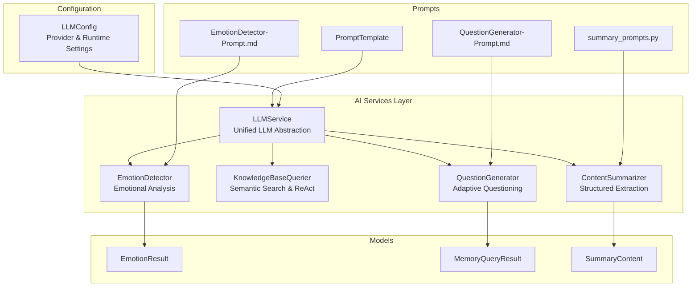
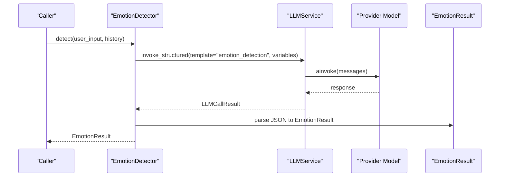
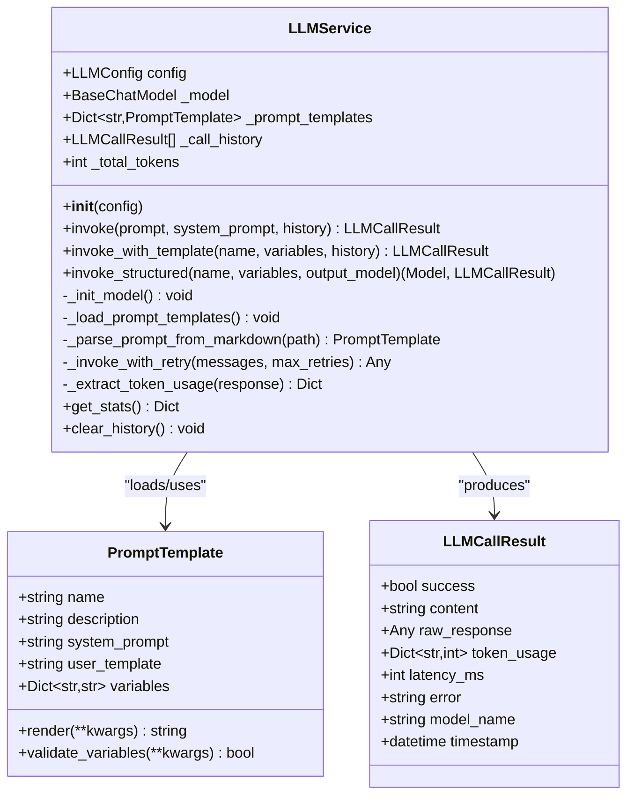
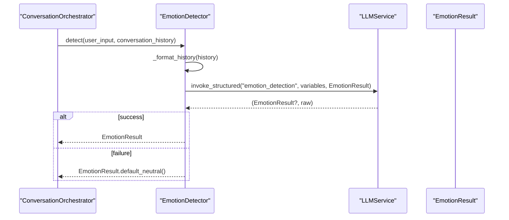
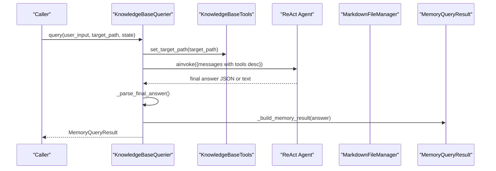
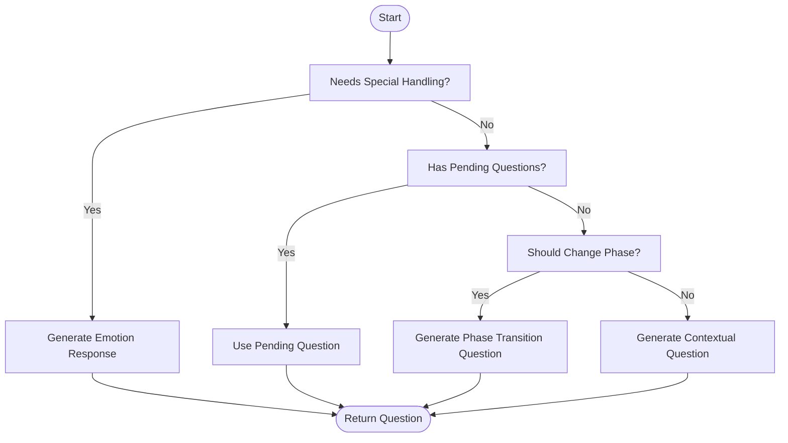
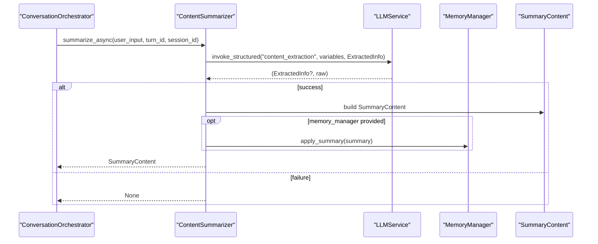
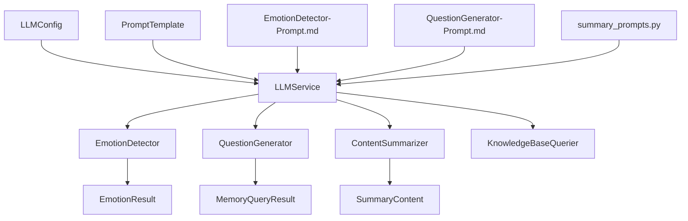

# AI Services

<cite>
**Referenced Files in This Document**
- [llm_service.py](file://src/services/llm_service.py)
- [emotion_detector.py](file://src/services/emotion_detector.py)
- [knowledge_base_querier.py](file://src/services/knowledge_base_querier.py)
- [question_generator.py](file://src/services/question_generator.py)
- [content_summarizer.py](file://src/services/content_summarizer.py)
- [llm_config.py](file://src/config/llm_config.py)
- [base.py](file://src/prompts/base.py)
- [EmotionDetector-Prompt.md](file://src/prompts/EmotionDetector-Prompt.md)
- [QuestionGenerator-Prompt.md](file://src/prompts/QuestionGenerator-Prompt.md)
- [summary_prompts.py](file://src/prompts/summary_prompts.py)
- [emotion_result.py](file://src/models/emotion_result.py)
- [memory_query_result.py](file://src/models/memory_query_result.py)
- [summary_content.py](file://src/models/summary_content.py)
- [test_llm_service.py](file://tests/test_llm_service.py)
</cite>

## Table of Contents
1. [Introduction](#introduction)
2. [Project Structure](#project-structure)
3. [Core Components](#core-components)
4. [Architecture Overview](#architecture-overview)
5. [Detailed Component Analysis](#detailed-component-analysis)
6. [Dependency Analysis](#dependency-analysis)
7. [Performance Considerations](#performance-considerations)
8. [Troubleshooting Guide](#troubleshooting-guide)
9. [Conclusion](#conclusion)
10. [Appendices](#appendices)

## Introduction
This document describes the AI services layer responsible for orchestrating large language model interactions and enabling intelligent conversation behaviors. It covers the unified LLMService abstraction supporting multiple providers (OpenAI-compatible, Qwen, DeepSeek, Anthropic), the EmotionDetector for emotional analysis and response adaptation, the KnowledgeBaseQuerier for semantic search and cross-referencing, the QuestionGenerator for adaptive questioning, and the ContentSummarizer for content analysis and structured data extraction. It also documents configuration options, service contracts, integration patterns, error handling, and performance optimization strategies.

## Project Structure
The AI services layer is organized around a central LLMService that encapsulates provider-specific model instantiation, prompt template management, and invocation semantics. Supporting services depend on LLMService to deliver specialized capabilities while maintaining a clean separation of concerns.

**Diagram sources**
- [llm_service.py:32-124](file://src/services/llm_service.py#L32-L124)
- [emotion_detector.py:12-73](file://src/services/emotion_detector.py#L12-L73)
- [knowledge_base_querier.py:202-255](file://src/services/knowledge_base_querier.py#L202-L255)
- [question_generator.py:12-73](file://src/services/question_generator.py#L12-L73)
- [content_summarizer.py:17-42](file://src/services/content_summarizer.py#L17-L42)
- [llm_config.py:10-41](file://src/config/llm_config.py#L10-L41)
- [base.py:6-28](file://src/prompts/base.py#L6-L28)
- [EmotionDetector-Prompt.md:1-63](file://src/prompts/EmotionDetector-Prompt.md#L1-L63)
- [QuestionGenerator-Prompt.md:1-89](file://src/prompts/QuestionGenerator-Prompt.md#L1-L89)
- [summary_prompts.py:3-48](file://src/prompts/summary_prompts.py#L3-L48)
- [emotion_result.py:6-40](file://src/models/emotion_result.py#L6-L40)
- [memory_query_result.py:23-49](file://src/models/memory_query_result.py#L23-L49)
- [summary_content.py:37-67](file://src/models/summary_content.py#L37-L67)

**Section sources**
- [llm_service.py:32-124](file://src/services/llm_service.py#L32-L124)
- [llm_config.py:10-41](file://src/config/llm_config.py#L10-L41)
- [base.py:6-28](file://src/prompts/base.py#L6-L28)

## Core Components
- LLMService: Provides a unified interface to multiple LLM providers via LangChain, manages prompt templates loaded from both Python modules and Markdown files, supports structured outputs, and offers robust retry and telemetry.
- EmotionDetector: Uses LLMService to analyze user input and conversation history, returning a structured EmotionResult with confidence and suggested actions.
- KnowledgeBaseQuerier: Implements a ReAct-style agent to explore a constrained knowledge base, extract related memories, and return a MemoryQueryResult with linked context.
- QuestionGenerator: Generates adaptive questions based on emotion, memory context, session state, and conversation history, with fallback strategies.
- ContentSummarizer: Extracts structured information from user input and produces SummaryContent with update plans for memory management.

**Section sources**
- [llm_service.py:32-124](file://src/services/llm_service.py#L32-L124)
- [emotion_detector.py:12-73](file://src/services/emotion_detector.py#L12-L73)
- [knowledge_base_querier.py:202-255](file://src/services/knowledge_base_querier.py#L202-L255)
- [question_generator.py:12-73](file://src/services/question_generator.py#L12-L73)
- [content_summarizer.py:17-42](file://src/services/content_summarizer.py#L17-L42)

## Architecture Overview
The AI services layer follows a layered pattern:
- Configuration layer defines provider settings and runtime parameters.
- LLMService abstracts provider differences and exposes consistent invocation APIs.
- Domain services (EmotionDetector, KnowledgeBaseQuerier, QuestionGenerator, ContentSummarizer) consume LLMService to implement specialized behaviors.
- Models define the data contracts for results and updates.
- Prompt templates (Python and Markdown) define the system/user prompts and variable schemas.

**Diagram sources**
- [emotion_detector.py:39-73](file://src/services/emotion_detector.py#L39-L73)
- [llm_service.py:327-398](file://src/services/llm_service.py#L327-L398)
- [EmotionDetector-Prompt.md:43-55](file://src/prompts/EmotionDetector-Prompt.md#L43-L55)

**Section sources**
- [emotion_detector.py:39-73](file://src/services/emotion_detector.py#L39-L73)
- [llm_service.py:225-292](file://src/services/llm_service.py#L225-L292)
- [EmotionDetector-Prompt.md:43-55](file://src/prompts/EmotionDetector-Prompt.md#L43-L55)

## Detailed Component Analysis

### LLMService: Unified LLM Abstraction
LLMService encapsulates:
- Provider initialization for OpenAI-compatible (including Qwen), DeepSeek, and Anthropic.
- Prompt template loading from Python modules and Markdown files.
- Invocation methods:
  - Basic invoke with optional system prompt and history.
  - invoke_with_template using rendered PromptTemplate.
  - invoke_structured returning validated Pydantic models.
- Retry logic with exponential backoff and token usage extraction.
- Statistics collection and history management.

Key implementation patterns:
- Provider selection and model instantiation in a single place.
- Template parsing from Markdown to populate PromptTemplate registry.
- Structured output parsing with robust fallback for malformed JSON.

**Diagram sources**
- [llm_service.py:32-124](file://src/services/llm_service.py#L32-L124)
- [llm_service.py:20-30](file://src/services/llm_service.py#L20-L30)
- [base.py:6-28](file://src/prompts/base.py#L6-L28)

**Section sources**
- [llm_service.py:71-124](file://src/services/llm_service.py#L71-L124)
- [llm_service.py:126-216](file://src/services/llm_service.py#L126-L216)
- [llm_service.py:225-292](file://src/services/llm_service.py#L225-L292)
- [llm_service.py:293-325](file://src/services/llm_service.py#L293-L325)
- [llm_service.py:327-398](file://src/services/llm_service.py#L327-L398)
- [llm_service.py:400-437](file://src/services/llm_service.py#L400-L437)
- [llm_service.py:449-461](file://src/services/llm_service.py#L449-L461)
- [base.py:6-28](file://src/prompts/base.py#L6-L28)

### EmotionDetector: Emotional Analysis and Response Adaptation
Responsibilities:
- Accepts user input and recent conversation history.
- Calls LLMService with the emotion_detection template to produce EmotionResult.
- Provides a strategy mapping based on emotion type/intensity/valence.

Implementation highlights:
- Formats recent conversation turns into a concise history string.
- Falls back to a default neutral EmotionResult on structured parsing failure.
- Exposes get_response_strategy for downstream orchestration.

**Diagram sources**
- [emotion_detector.py:39-73](file://src/services/emotion_detector.py#L39-L73)
- [emotion_result.py:48-57](file://src/models/emotion_result.py#L48-L57)

**Section sources**
- [emotion_detector.py:39-73](file://src/services/emotion_detector.py#L39-L73)
- [emotion_result.py:20-40](file://src/models/emotion_result.py#L20-L40)

### KnowledgeBaseQuerier: Semantic Search and Cross-Referencing
Responsibilities:
- Build a ReAct agent using LLMService’s model and a knowledge_base_react template.
- Provide tools to list files, read files, follow links, mark suspected files, and report exploration.
- Enforce target path scope and return MemoryQueryResult with related memories and linked context.
- Parse Final Answer from agent output, with robust fallback to natural language extraction.

**Diagram sources**
- [knowledge_base_querier.py:257-372](file://src/services/knowledge_base_querier.py#L257-L372)
- [knowledge_base_querier.py:435-511](file://src/services/knowledge_base_querier.py#L435-L511)
- [knowledge_base_querier.py:513-540](file://src/services/knowledge_base_querier.py#L513-L540)

**Section sources**
- [knowledge_base_querier.py:202-255](file://src/services/knowledge_base_querier.py#L202-L255)
- [knowledge_base_querier.py:257-372](file://src/services/knowledge_base_querier.py#L257-L372)
- [knowledge_base_querier.py:435-511](file://src/services/knowledge_base_querier.py#L435-L511)
- [knowledge_base_querier.py:513-540](file://src/services/knowledge_base_querier.py#L513-L540)

### QuestionGenerator: Adaptive Questioning with Context and Emotion
Responsibilities:
- Generate the next question considering emotion, memory context, session state, and conversation history.
- Priority chain: special emotion handling → pending questions → phase transition → contextual generation.
- Provide fallback responses and default questions per phase.

**Diagram sources**
- [question_generator.py:38-74](file://src/services/question_generator.py#L38-L74)
- [question_generator.py:152-194](file://src/services/question_generator.py#L152-L194)

**Section sources**
- [question_generator.py:38-74](file://src/services/question_generator.py#L38-L74)
- [question_generator.py:152-194](file://src/services/question_generator.py#L152-L194)

### ContentSummarizer: Content Analysis and Structured Extraction
Responsibilities:
- Extract structured information (events, people, themes, time markers) from user input.
- Produce SummaryContent with memory update plans and optional immediate application via MemoryManager.
- Prepare a final handoff summary at session termination.

**Diagram sources**
- [content_summarizer.py:43-92](file://src/services/content_summarizer.py#L43-L92)
- [summary_prompts.py:3-48](file://src/prompts/summary_prompts.py#L3-L48)

**Section sources**
- [content_summarizer.py:43-92](file://src/services/content_summarizer.py#L43-L92)
- [summary_prompts.py:3-48](file://src/prompts/summary_prompts.py#L3-L48)

## Dependency Analysis
- LLMService depends on LLMConfig for provider/runtime settings and LangChain models.
- Prompt templates are loaded from both Python modules and Markdown files, enabling flexible authoring and distribution.
- EmotionDetector, KnowledgeBaseQuerier, QuestionGenerator, and ContentSummarizer all depend on LLMService.
- Models (EmotionResult, MemoryQueryResult, SummaryContent) define contracts for inter-service communication.

**Diagram sources**
- [llm_config.py:10-41](file://src/config/llm_config.py#L10-L41)
- [llm_service.py:126-161](file://src/services/llm_service.py#L126-L161)
- [base.py:6-28](file://src/prompts/base.py#L6-L28)
- [EmotionDetector-Prompt.md:1-63](file://src/prompts/EmotionDetector-Prompt.md#L1-L63)
- [QuestionGenerator-Prompt.md:1-89](file://src/prompts/QuestionGenerator-Prompt.md#L1-L89)
- [summary_prompts.py:3-48](file://src/prompts/summary_prompts.py#L3-L48)
- [emotion_result.py:6-28](file://src/models/emotion_result.py#L6-L28)
- [memory_query_result.py:23-49](file://src/models/memory_query_result.py#L23-L49)
- [summary_content.py:37-67](file://src/models/summary_content.py#L37-L67)

**Section sources**
- [llm_service.py:126-161](file://src/services/llm_service.py#L126-L161)
- [emotion_result.py:6-28](file://src/models/emotion_result.py#L6-L28)
- [memory_query_result.py:23-49](file://src/models/memory_query_result.py#L23-L49)
- [summary_content.py:37-67](file://src/models/summary_content.py#L37-L67)

## Performance Considerations
- Provider selection: Prefer Qwen-compatible OpenAI client for broad compatibility; configure base_url and api_key appropriately.
- Token usage tracking: LLMService extracts usage metadata when available; monitor total_tokens and latency for cost and SLA control.
- Retry strategy: Built-in exponential backoff reduces transient failures; tune max_retries and timeout in LLMConfig.
- Prompt template caching: Templates are loaded once and reused; avoid frequent reloads.
- Structured output parsing: Robust fallback for malformed JSON prevents cascading failures.
- KnowledgeBaseQuerier exploration: Prefer comprehensive initial directory listing to minimize repeated tool calls.

[No sources needed since this section provides general guidance]

## Troubleshooting Guide
Common issues and resolutions:
- Provider misconfiguration: Ensure LLMConfig provider and credentials are set; verify environment variables for Qwen/DeepSeek.
- Template not found: Confirm template names match registered keys and that Markdown files are readable.
- Structured output parse errors: Validate JSON schema alignment with output_model; handle code block-wrapped JSON gracefully.
- KnowledgeBaseQuerier target path errors: Verify directory existence and permissions; enforce safe path resolution.
- Retries exhausted: Inspect logs for underlying exceptions; adjust retry count and backoff.

**Section sources**
- [llm_config.py:42-110](file://src/config/llm_config.py#L42-L110)
- [llm_service.py:400-437](file://src/services/llm_service.py#L400-L437)
- [llm_service.py:327-398](file://src/services/llm_service.py#L327-L398)
- [knowledge_base_querier.py:280-294](file://src/services/knowledge_base_querier.py#L280-L294)
- [test_llm_service.py:104-140](file://tests/test_llm_service.py#L104-L140)

## Conclusion
The AI services layer provides a cohesive, extensible foundation for LLM-driven conversation systems. By unifying provider interactions, enforcing structured contracts, and offering robust error handling and telemetry, it enables reliable deployment of emotion-aware questioning, semantic search, and content summarization tailored to narrative interviews.

[No sources needed since this section summarizes without analyzing specific files]

## Appendices

### Service Contracts and Usage Examples
- LLMService invocation patterns:
  - Basic: [llm_service.py:225-292](file://src/services/llm_service.py#L225-L292)
  - With template: [llm_service.py:293-325](file://src/services/llm_service.py#L293-L325)
  - Structured output: [llm_service.py:327-398](file://src/services/llm_service.py#L327-L398)
- EmotionDetector usage:
  - Detect emotion and strategy: [emotion_detector.py:39-73](file://src/services/emotion_detector.py#L39-L73)
- KnowledgeBaseQuerier usage:
  - ReAct query with tools: [knowledge_base_querier.py:257-372](file://src/services/knowledge_base_querier.py#L257-L372)
- QuestionGenerator usage:
  - Adaptive question generation: [question_generator.py:38-74](file://src/services/question_generator.py#L38-L74)
- ContentSummarizer usage:
  - Structured extraction and summary: [content_summarizer.py:43-92](file://src/services/content_summarizer.py#L43-L92)

**Section sources**
- [llm_service.py:225-398](file://src/services/llm_service.py#L225-L398)
- [emotion_detector.py:39-73](file://src/services/emotion_detector.py#L39-L73)
- [knowledge_base_querier.py:257-372](file://src/services/knowledge_base_querier.py#L257-L372)
- [question_generator.py:38-74](file://src/services/question_generator.py#L38-L74)
- [content_summarizer.py:43-92](file://src/services/content_summarizer.py#L43-L92)

### Configuration Options
- LLMConfig fields and environment variable precedence:
  - Provider selection and credentials
  - Model name and token limits
  - Temperature and timeout
  - Provider-specific overrides for Qwen and DeepSeek

**Section sources**
- [llm_config.py:10-41](file://src/config/llm_config.py#L10-L41)
- [llm_config.py:42-110](file://src/config/llm_config.py#L42-L110)