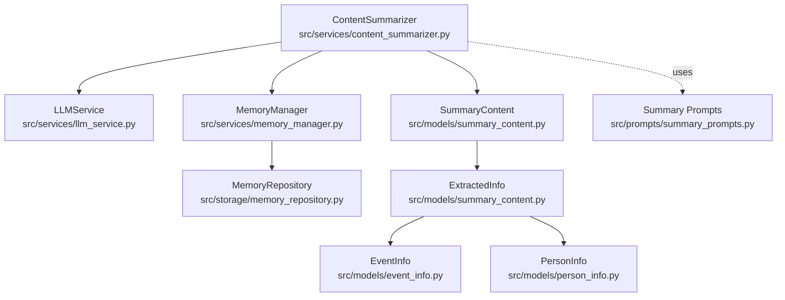
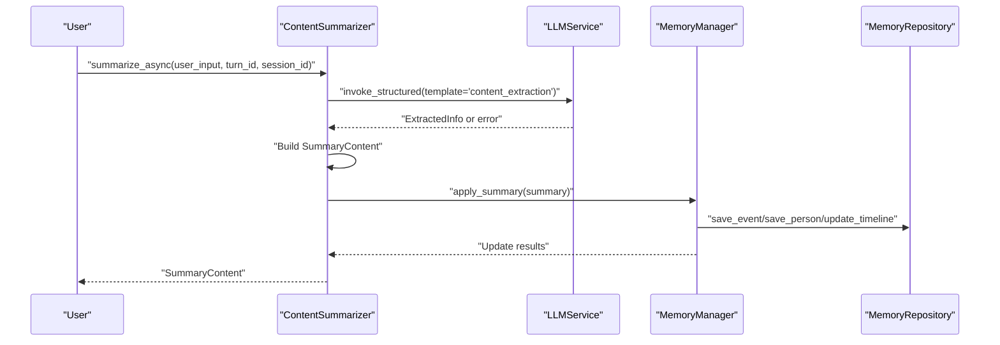
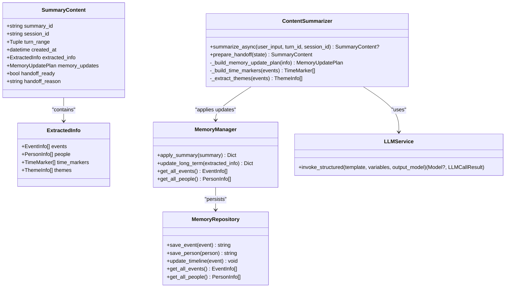

# Content Summarizer

<cite>
**Referenced Files in This Document**
- [content_summarizer.py](file://src/services/content_summarizer.py)
- [summary_prompts.py](file://src/prompts/summary_prompts.py)
- [summary_content.py](file://src/models/summary_content.py)
- [event_info.py](file://src/models/event_info.py)
- [person_info.py](file://src/models/person_info.py)
- [memory_manager.py](file://src/services/memory_manager.py)
- [memory_repository.py](file://src/storage/memory_repository.py)
- [interview_session_agent.py](file://src/agents/interview_session_agent.py)
- [conversation_orchestrator.py](file://src/core/conversation_orchestrator.py)
- [session_state.py](file://src/models/session_state.py)
- [conversation_turn.py](file://src/models/conversation_turn.py)
- [handoff_package.py](file://src/models/handoff_package.py)
- [phase_type.py](file://src/enums/phase_type.py)
- [llm_service.py](file://src/services/llm_service.py)
</cite>

## Table of Contents
1. [Introduction](#introduction)
2. [Project Structure](#project-structure)
3. [Core Components](#core-components)
4. [Architecture Overview](#architecture-overview)
5. [Detailed Component Analysis](#detailed-component-analysis)
6. [Dependency Analysis](#dependency-analysis)
7. [Performance Considerations](#performance-considerations)
8. [Troubleshooting Guide](#troubleshooting-guide)
9. [Conclusion](#conclusion)

## Introduction
This document describes the ContentSummarizer service, which extracts and organizes structured information from interview conversations. It transforms unstructured narrative data into structured memory entries (events, people, themes, time markers), prepares summaries for persistence, and coordinates with MemoryManager for long-term storage. It also documents the SummaryContent data model, the confidence and validation mechanisms used during extraction, and the integration with InterviewSessionAgent for session lifecycle management and handoff preparation.

## Project Structure
The ContentSummarizer sits within the services layer and interacts with:
- LLMService for structured extraction using a dedicated prompt template
- MemoryManager for applying updates to long-term knowledge base
- Models for typed data structures (SummaryContent, ExtractedInfo, EventInfo, PersonInfo)
- InterviewSessionAgent and ConversationOrchestrator for session orchestration and handoff

**Diagram sources**
- [content_summarizer.py:17-177](file://src/services/content_summarizer.py#L17-L177)
- [llm_service.py:32-481](file://src/services/llm_service.py#L32-L481)
- [memory_manager.py:27-470](file://src/services/memory_manager.py#L27-L470)
- [memory_repository.py:40-359](file://src/storage/memory_repository.py#L40-L359)
- [summary_content.py:8-67](file://src/models/summary_content.py#L8-L67)
- [event_info.py:5-69](file://src/models/event_info.py#L5-L69)
- [person_info.py:5-61](file://src/models/person_info.py#L5-L61)
- [summary_prompts.py:3-49](file://src/prompts/summary_prompts.py#L3-L49)

**Section sources**
- [content_summarizer.py:17-177](file://src/services/content_summarizer.py#L17-L177)
- [summary_prompts.py:3-49](file://src/prompts/summary_prompts.py#L3-L49)
- [summary_content.py:8-67](file://src/models/summary_content.py#L8-L67)
- [event_info.py:5-69](file://src/models/event_info.py#L5-L69)
- [person_info.py:5-61](file://src/models/person_info.py#L5-L61)
- [memory_manager.py:27-470](file://src/services/memory_manager.py#L27-L470)
- [memory_repository.py:40-359](file://src/storage/memory_repository.py#L40-L359)

## Core Components
- ContentSummarizer: Orchestrates extraction, builds SummaryContent, and applies updates via MemoryManager.
- SummaryContent: Encapsulates extracted info, memory update plan, and handoff metadata.
- ExtractedInfo: Aggregates events, people, time markers, and themes.
- EventInfo and PersonInfo: Typed models for structured event and person records.
- MemoryManager: Applies SummaryContent updates to long-term storage and maintains profile memory.
- MemoryRepository: Low-level persistence for events, people, timelines, and profile indices.
- LLMService: Provides structured extraction using prompt templates.
- InterviewSessionAgent and ConversationOrchestrator: Manage session lifecycle and prepare handoffs.

**Section sources**
- [content_summarizer.py:17-177](file://src/services/content_summarizer.py#L17-L177)
- [summary_content.py:37-67](file://src/models/summary_content.py#L37-L67)
- [event_info.py:5-69](file://src/models/event_info.py#L5-L69)
- [person_info.py:5-61](file://src/models/person_info.py#L5-L61)
- [memory_manager.py:27-470](file://src/services/memory_manager.py#L27-L470)
- [memory_repository.py:40-359](file://src/storage/memory_repository.py#L40-L359)
- [llm_service.py:32-481](file://src/services/llm_service.py#L32-L481)
- [interview_session_agent.py:33-482](file://src/agents/interview_session_agent.py#L33-L482)
- [conversation_orchestrator.py:353-382](file://src/core/conversation_orchestrator.py#L353-L382)

## Architecture Overview
The ContentSummarizer integrates with LLMService to extract structured information from user input, constructs SummaryContent, and delegates persistence to MemoryManager. During session termination, it collaborates with InterviewSessionAgent and ConversationOrchestrator to produce a HandoffPackage for downstream processing.

**Diagram sources**
- [content_summarizer.py:43-93](file://src/services/content_summarizer.py#L43-L93)
- [llm_service.py:327-398](file://src/services/llm_service.py#L327-L398)
- [memory_manager.py:435-466](file://src/services/memory_manager.py#L435-L466)
- [memory_repository.py:176-226](file://src/storage/memory_repository.py#L176-L226)

**Section sources**
- [content_summarizer.py:43-93](file://src/services/content_summarizer.py#L43-L93)
- [llm_service.py:327-398](file://src/services/llm_service.py#L327-L398)
- [memory_manager.py:435-466](file://src/services/memory_manager.py#L435-L466)
- [memory_repository.py:176-226](file://src/storage/memory_repository.py#L176-L226)

## Detailed Component Analysis

### ContentSummarizer
Responsibilities:
- Extract structured information from user input using a content extraction prompt.
- Build SummaryContent with extracted info and a memory update plan.
- Apply updates immediately if a MemoryManager is present.
- Prepare a final handoff summary at session termination.

Key behaviors:
- Asynchronous extraction via LLMService.invoke_structured with template "content_extraction".
- Constructs SummaryContent with session_id, turn_range, and extracted_info.
- Builds MemoryUpdatePlan with short-term, long-term, and profile updates.
- On session termination, aggregates all events/people from MemoryManager and produces a handoff-ready SummaryContent.

Confidence and validation:
- Extraction success is determined by whether LLMService returns a parsed ExtractedInfo instance.
- Errors are logged and surfaced as None summaries.

Integration points:
- Uses LLMService for structured extraction.
- Delegates persistence to MemoryManager.apply_summary.
- Works with SessionState for session termination handoff.

**Section sources**
- [content_summarizer.py:17-177](file://src/services/content_summarizer.py#L17-L177)
- [summary_prompts.py:3-49](file://src/prompts/summary_prompts.py#L3-L49)
- [summary_content.py:37-67](file://src/models/summary_content.py#L37-L67)
- [memory_manager.py:435-466](file://src/services/memory_manager.py#L435-L466)
- [session_state.py:24-139](file://src/models/session_state.py#L24-L139)

### SummaryContent Data Model
SummaryContent encapsulates:
- Identity and temporal scope (summary_id, session_id, turn_range, created_at).
- ExtractedInfo payload (events, people, time_markers, themes).
- MemoryUpdatePlan for persistence actions.
- Handoff flags (handoff_ready, handoff_reason) for session completion.

MemoryUpdatePlan fields:
- short_term_updates: ephemeral state updates (e.g., last_event, last_person).
- long_term_files: target file paths for persistence.
- profile_updates: profile-related metadata updates.

**Section sources**
- [summary_content.py:37-67](file://src/models/summary_content.py#L37-L67)
- [content_summarizer.py:94-109](file://src/services/content_summarizer.py#L94-L109)

### ExtractedInfo and Related Types
ExtractedInfo aggregates:
- events: list of EventInfo
- people: list of PersonInfo
- time_markers: list of TimeMarker
- themes: list of ThemeInfo

EventInfo and PersonInfo define the canonical structure for persisted knowledge base entries, including identifiers, descriptions, relationships, and markdown conversion helpers.

**Section sources**
- [summary_content.py:22-28](file://src/models/summary_content.py#L22-L28)
- [event_info.py:5-69](file://src/models/event_info.py#L5-L69)
- [person_info.py:5-61](file://src/models/person_info.py#L5-L61)

### MemoryManager Integration
MemoryManager applies SummaryContent updates:
- Updates short-term memory (e.g., recent entities).
- Saves events and people to long-term storage via MemoryRepository.
- Updates timeline entries and profile memory.
- Supports batch operations and compatibility methods for legacy flows.

**Section sources**
- [memory_manager.py:435-466](file://src/services/memory_manager.py#L435-L466)
- [memory_repository.py:176-226](file://src/storage/memory_repository.py#L176-L226)

### Session Lifecycle and Handoff
During session termination:
- ConversationOrchestrator calls ContentSummarizer.prepare_handoff with SessionState.
- ContentSummarizer aggregates all events and people from MemoryManager and constructs a final SummaryContent with handoff flags.
- InterviewSessionAgent and ConversationOrchestrator package the summary into a HandoffPackage for downstream processing.

**Section sources**
- [conversation_orchestrator.py:353-382](file://src/core/conversation_orchestrator.py#L353-L382)
- [content_summarizer.py:111-143](file://src/services/content_summarizer.py#L111-L143)
- [interview_session_agent.py:33-482](file://src/agents/interview_session_agent.py#L33-L482)
- [handoff_package.py:32-66](file://src/models/handoff_package.py#L32-L66)
- [session_state.py:24-139](file://src/models/session_state.py#L24-L139)

### Confidence Scoring and Validation
- Extraction confidence is implicit in the structured parsing pipeline: successful JSON parsing yields a validated Pydantic model; otherwise, errors are captured and surfaced.
- LLMService.invoke_structured enforces JSON schema compliance and logs parse failures.
- ContentSummarizer treats extraction failure as a warning and returns None summary.

**Section sources**
- [llm_service.py:327-398](file://src/services/llm_service.py#L327-L398)
- [content_summarizer.py:60-92](file://src/services/content_summarizer.py#L60-L92)

### Structured Data Formatting and Preservation of Narrative Coherence
- EventInfo and PersonInfo provide to_markdown methods that preserve narrative context while structuring data for knowledge base consumption.
- Time markers and themes are derived from extracted events to maintain chronological and thematic coherence.
- MemoryRepository determines appropriate directories and filenames based on time and roles, ensuring consistent organization.

**Section sources**
- [event_info.py:34-69](file://src/models/event_info.py#L34-L69)
- [person_info.py:34-61](file://src/models/person_info.py#L34-L61)
- [memory_repository.py:308-359](file://src/storage/memory_repository.py#L308-L359)
- [content_summarizer.py:145-177](file://src/services/content_summarizer.py#L145-L177)

### Summarization Strategies Across Content Types
- Events: Extracted with time precision, location, type, description, participants, emotions, significance, and source turns; persisted under phase-specific directories.
- People: Captured with roles, relations, descriptions, influences, and quotes; stored under role-based directories.
- Themes: Derived from event significance to group related memories.
- Time markers: Group events by time and infer phase labels for timeline organization.

**Section sources**
- [summary_prompts.py:3-49](file://src/prompts/summary_prompts.py#L3-L49)
- [content_summarizer.py:145-177](file://src/services/content_summarizer.py#L145-L177)
- [memory_repository.py:310-337](file://src/storage/memory_repository.py#L310-L337)
- [phase_type.py:4-10](file://src/enums/phase_type.py#L4-L10)

## Dependency Analysis

**Diagram sources**
- [content_summarizer.py:17-177](file://src/services/content_summarizer.py#L17-L177)
- [summary_content.py:37-67](file://src/models/summary_content.py#L37-L67)
- [memory_manager.py:27-470](file://src/services/memory_manager.py#L27-L470)
- [memory_repository.py:40-359](file://src/storage/memory_repository.py#L40-L359)
- [llm_service.py:32-481](file://src/services/llm_service.py#L32-L481)

**Section sources**
- [content_summarizer.py:17-177](file://src/services/content_summarizer.py#L17-L177)
- [summary_content.py:37-67](file://src/models/summary_content.py#L37-L67)
- [memory_manager.py:27-470](file://src/services/memory_manager.py#L27-L470)
- [memory_repository.py:40-359](file://src/storage/memory_repository.py#L40-L359)
- [llm_service.py:32-481](file://src/services/llm_service.py#L32-L481)

## Performance Considerations
- Asynchronous extraction and persistence minimize blocking during interviews.
- Parallel saves are supported in MemoryManager for efficient batch updates.
- Caching and LRU caches in MemoryRepository reduce repeated reads.
- Structured extraction reduces post-processing overhead by returning validated models.

[No sources needed since this section provides general guidance]

## Troubleshooting Guide
Common issues and resolutions:
- Extraction failures: Check LLMService invocation logs and prompt template correctness. Extraction failures return None summaries; verify template "content_extraction" and variable completeness.
- Persistence errors: Inspect MemoryManager.apply_summary results and MemoryRepository save operations for exceptions.
- Session handoff gaps: Ensure MemoryManager has aggregated events/people before prepare_handoff is called.

**Section sources**
- [content_summarizer.py:60-92](file://src/services/content_summarizer.py#L60-L92)
- [memory_manager.py:435-466](file://src/services/memory_manager.py#L435-L466)
- [memory_repository.py:176-226](file://src/storage/memory_repository.py#L176-L226)

## Conclusion
ContentSummarizer provides a robust pipeline for transforming interview narratives into structured knowledge base entries. By leveraging LLMService for extraction, SummaryContent for encapsulation, and MemoryManager for persistence, it ensures accurate, coherent, and organized memory updates. Its integration with InterviewSessionAgent and ConversationOrchestrator guarantees seamless session lifecycle management and effective handoff preparation for downstream processing.