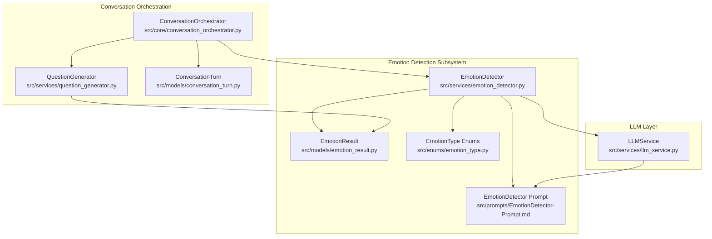
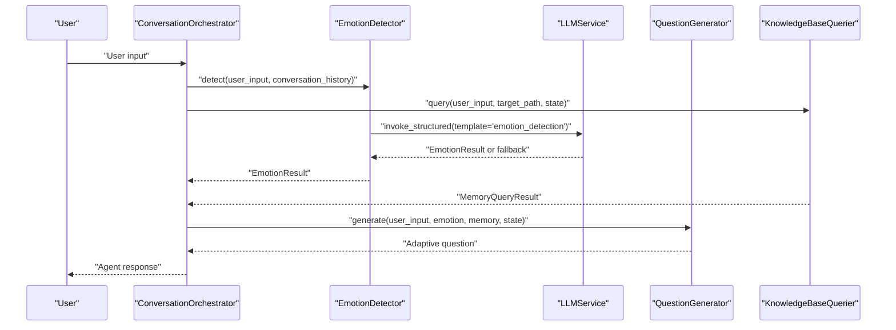
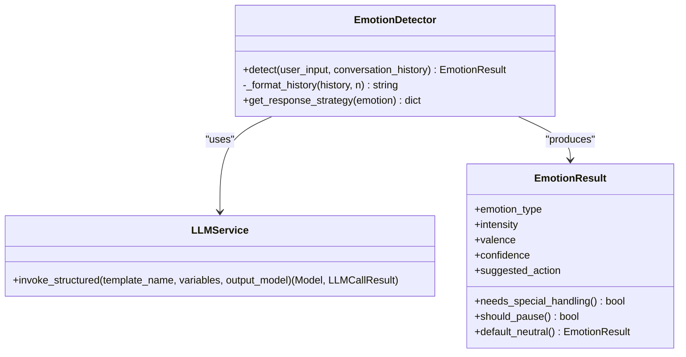
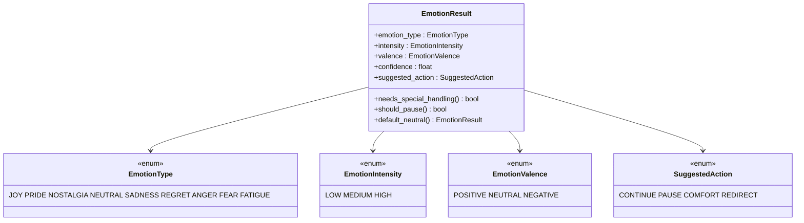
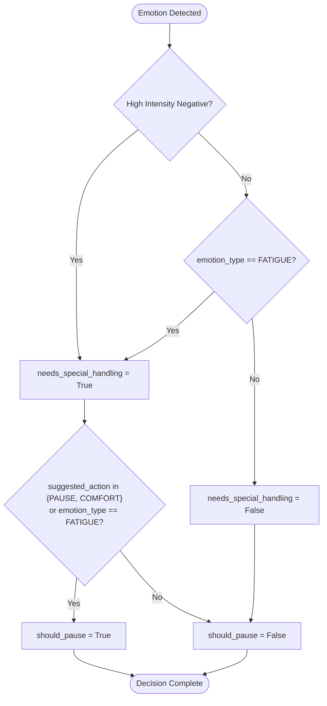
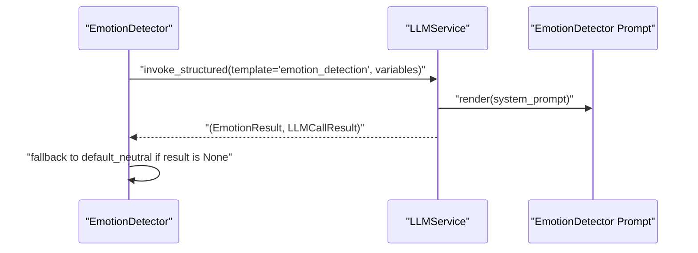
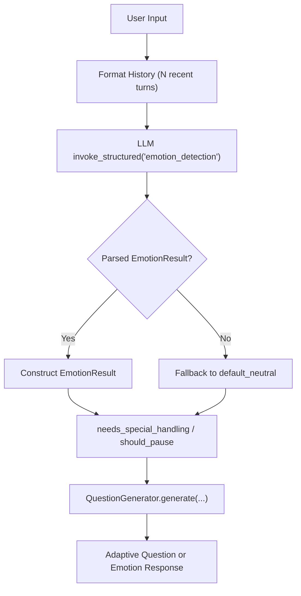
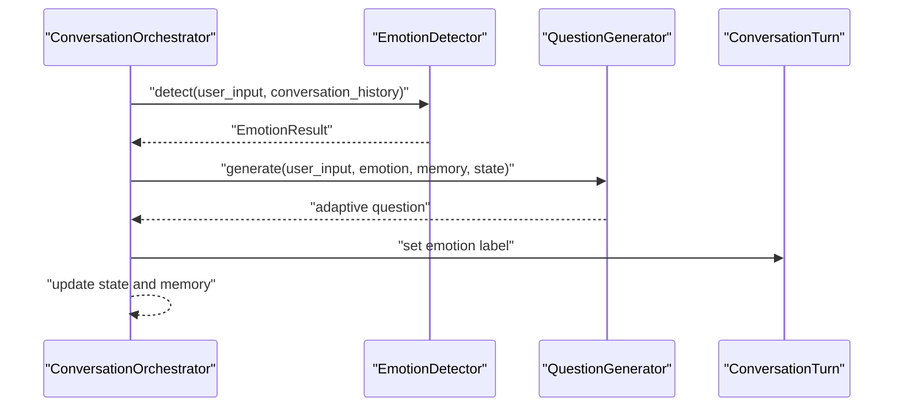
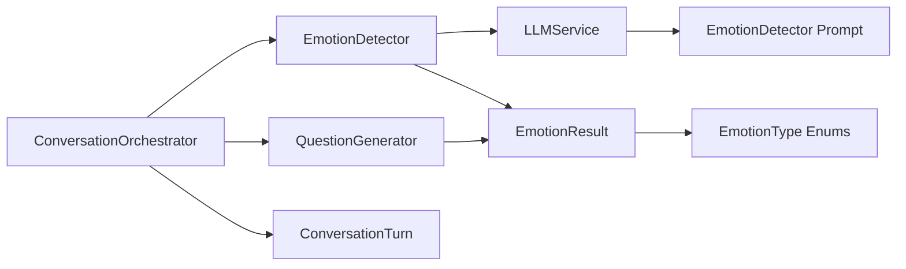

# Emotion Detector

<cite>
**Referenced Files in This Document**
- [emotion_detector.py](file://src/services/emotion_detector.py)
- [emotion_result.py](file://src/models/emotion_result.py)
- [emotion_type.py](file://src/enums/emotion_type.py)
- [EmotionDetector-Prompt.md](file://src/prompts/EmotionDetector-Prompt.md)
- [llm_service.py](file://src/services/llm_service.py)
- [question_generator.py](file://src/services/question_generator.py)
- [conversation_orchestrator.py](file://src/core/conversation_orchestrator.py)
- [conversation_turn.py](file://src/models/conversation_turn.py)
- [test_core_services.py](file://test_core_services.py)
</cite>

## Table of Contents
1. [Introduction](#introduction)
2. [Project Structure](#project-structure)
3. [Core Components](#core-components)
4. [Architecture Overview](#architecture-overview)
5. [Detailed Component Analysis](#detailed-component-analysis)
6. [Dependency Analysis](#dependency-analysis)
7. [Performance Considerations](#performance-considerations)
8. [Troubleshooting Guide](#troubleshooting-guide)
9. [Conclusion](#conclusion)

## Introduction
This document describes the EmotionDetector service that analyzes user emotional states during conversations. It explains the emotion classification system, confidence scoring, threshold-based decision making, integration with LLMService, and the EmotionResult data model. It also documents the emotion detection workflow from input processing through analysis to response adaptation, including examples of emotion detection in context, confidence interpretation, and how detected emotions influence conversation flow. Finally, it covers the relationship with InterviewAgent for adaptive response strategies and the impact on user experience.

## Project Structure
The emotion detection capability is implemented as a cohesive subsystem within the larger interview and memory system. The primary components are:
- EmotionDetector service: orchestrates emotion analysis and strategy mapping
- EmotionResult model: defines the output structure and decision helpers
- EmotionType enums: define emotion categories, intensities, valences, and suggested actions
- EmotionDetector prompt template: instructs the LLM to produce structured emotion analysis
- LLMService: unified interface for LLM calls and structured output parsing
- QuestionGenerator: adapts question generation based on detected emotion
- ConversationOrchestrator: coordinates emotion detection with the broader conversation flow
- ConversationTurn model: carries conversation context for emotion analysis

**Diagram sources**
- [emotion_detector.py:12-131](file://src/services/emotion_detector.py#L12-L131)
- [emotion_result.py:6-57](file://src/models/emotion_result.py#L6-L57)
- [emotion_type.py:4-50](file://src/enums/emotion_type.py#L4-L50)
- [EmotionDetector-Prompt.md:1-259](file://src/prompts/EmotionDetector-Prompt.md#L1-L259)
- [llm_service.py:32-481](file://src/services/llm_service.py#L32-L481)
- [conversation_orchestrator.py:138-402](file://src/core/conversation_orchestrator.py#L138-L402)
- [question_generator.py:12-253](file://src/services/question_generator.py#L12-L253)
- [conversation_turn.py:14-52](file://src/models/conversation_turn.py#L14-L52)

**Section sources**
- [emotion_detector.py:12-131](file://src/services/emotion_detector.py#L12-L131)
- [emotion_result.py:6-57](file://src/models/emotion_result.py#L6-L57)
- [emotion_type.py:4-50](file://src/enums/emotion_type.py#L4-L50)
- [EmotionDetector-Prompt.md:1-259](file://src/prompts/EmotionDetector-Prompt.md#L1-L259)
- [llm_service.py:32-481](file://src/services/llm_service.py#L32-L481)
- [conversation_orchestrator.py:138-402](file://src/core/conversation_orchestrator.py#L138-L402)
- [question_generator.py:12-253](file://src/services/question_generator.py#L12-L253)
- [conversation_turn.py:14-52](file://src/models/conversation_turn.py#L14-L52)

## Core Components
- EmotionDetector: performs emotion analysis using a structured LLM call and returns an EmotionResult. It formats recent conversation history and maps results to response strategies.
- EmotionResult: Pydantic model representing the emotion classification, intensity, valence, confidence, suggested action, and decision helpers for special handling and pausing.
- EmotionType enums: define emotion categories (e.g., joy, pride, nostalgia, sadness, regret, anger, fear, fatigue), intensities (low, medium, high), valences (positive, neutral, negative), and suggested actions (continue, pause, comfort, redirect).
- EmotionDetector prompt: instructs the LLM to identify emotion type, intensity, valence, confidence, suggested action, and whether special handling is needed, returning a JSON schema aligned with EmotionResult.
- LLMService: provides unified LLM invocation, including structured output parsing and template loading from Markdown files.
- QuestionGenerator: generates adaptive questions based on emotion results, emotion responses for special handling, and phase transitions.
- ConversationOrchestrator: coordinates emotion detection with knowledge querying and question generation, updates session state, and handles timeouts and handoff conditions.
- ConversationTurn: carries user input, agent response, extracted entities/events, optional emotion label, and metadata for context.

**Section sources**
- [emotion_detector.py:12-131](file://src/services/emotion_detector.py#L12-L131)
- [emotion_result.py:6-57](file://src/models/emotion_result.py#L6-L57)
- [emotion_type.py:4-50](file://src/enums/emotion_type.py#L4-L50)
- [EmotionDetector-Prompt.md:1-259](file://src/prompts/EmotionDetector-Prompt.md#L1-L259)
- [llm_service.py:32-481](file://src/services/llm_service.py#L32-L481)
- [question_generator.py:12-253](file://src/services/question_generator.py#L12-L253)
- [conversation_orchestrator.py:138-402](file://src/core/conversation_orchestrator.py#L138-L402)
- [conversation_turn.py:14-52](file://src/models/conversation_turn.py#L14-L52)

## Architecture Overview
The emotion detection workflow integrates tightly with the conversation orchestration. At each turn, the orchestrator triggers emotion detection concurrently with knowledge querying. The emotion result determines whether to pause the conversation, adjust tone, or continue with deeper probing. The QuestionGenerator then produces adaptive questions informed by emotion and memory context.

**Diagram sources**
- [conversation_orchestrator.py:236-344](file://src/core/conversation_orchestrator.py#L236-L344)
- [emotion_detector.py:39-73](file://src/services/emotion_detector.py#L39-L73)
- [llm_service.py:327-399](file://src/services/llm_service.py#L327-L399)
- [question_generator.py:38-74](file://src/services/question_generator.py#L38-L74)

## Detailed Component Analysis

### EmotionDetector
Responsibilities:
- Detect user emotion from input and recent conversation history
- Determine if special handling is needed
- Provide response strategy suggestions

Key behaviors:
- Formats recent conversation history (last N turns) into a readable string
- Invokes LLMService with the emotion_detection template and parses structured output into EmotionResult
- Falls back to a default neutral EmotionResult when LLM fails
- Maps emotion to a response strategy based on valence and intensity, with special handling for fatigue

**Diagram sources**
- [emotion_detector.py:12-131](file://src/services/emotion_detector.py#L12-L131)
- [llm_service.py:327-399](file://src/services/llm_service.py#L327-L399)
- [emotion_result.py:6-57](file://src/models/emotion_result.py#L6-L57)

**Section sources**
- [emotion_detector.py:12-131](file://src/services/emotion_detector.py#L12-L131)
- [EmotionDetector-Prompt.md:96-125](file://src/prompts/EmotionDetector-Prompt.md#L96-L125)

### EmotionResult Data Model
Structure:
- emotion_type: EmotionType (e.g., joy, pride, nostalgia, sadness, regret, anger, fear, fatigue)
- intensity: EmotionIntensity (low, medium, high)
- valence: EmotionValence (positive, neutral, negative)
- confidence: float [0.0, 1.0]
- suggested_action: SuggestedAction (continue, pause, comfort, redirect)
- needs_special_handling: property combining high-intensity negative emotion and specific types (fatigue, reluctance, confusion)
- should_pause: property indicating pause or comfort actions
- default_neutral: classmethod to construct a neutral baseline

**Diagram sources**
- [emotion_result.py:6-57](file://src/models/emotion_result.py#L6-L57)
- [emotion_type.py:4-50](file://src/enums/emotion_type.py#L4-L50)

**Section sources**
- [emotion_result.py:6-57](file://src/models/emotion_result.py#L6-L57)
- [emotion_type.py:4-50](file://src/enums/emotion_type.py#L4-L50)

### Emotion Classification System
The classification system encompasses:
- Positive emotions: joy, pride, nostalgia, gratitude, hope
- Neutral emotions: neutral, curious, contemplative
- Negative emotions: sadness, regret, anger, fear, guilt
- Special states: confusion, fatigue, reluctance

Confidence scoring:
- Confidence is a floating-point value in [0.0, 1.0] produced by the LLM
- It reflects the model’s certainty in the emotion classification and associated attributes

Threshold-based decision making:
- needs_special_handling: True for high-intensity negative emotions or specific special states (fatigue, reluctance, confusion)
- should_pause: True when suggested_action is pause or comfort, or when emotion_type is fatigue

**Diagram sources**
- [emotion_result.py:29-46](file://src/models/emotion_result.py#L29-L46)

**Section sources**
- [emotion_type.py:4-50](file://src/enums/emotion_type.py#L4-L50)
- [emotion_result.py:29-46](file://src/models/emotion_result.py#L29-L46)

### Integration with LLMService
- EmotionDetector invokes LLMService.invoke_structured with template_name "emotion_detection"
- Variables passed include user_input and formatted conversation_history
- Output is parsed into EmotionResult; on failure, a default neutral result is returned
- LLMService loads prompt templates from Markdown files and supports structured JSON parsing with retries

**Diagram sources**
- [emotion_detector.py:58-73](file://src/services/emotion_detector.py#L58-L73)
- [llm_service.py:327-399](file://src/services/llm_service.py#L327-L399)
- [EmotionDetector-Prompt.md:100-125](file://src/prompts/EmotionDetector-Prompt.md#L100-L125)

**Section sources**
- [emotion_detector.py:58-73](file://src/services/emotion_detector.py#L58-L73)
- [llm_service.py:327-399](file://src/services/llm_service.py#L327-L399)
- [EmotionDetector-Prompt.md:100-125](file://src/prompts/EmotionDetector-Prompt.md#L100-L125)

### Emotion Detection Workflow
End-to-end flow:
- Input processing: EmotionDetector receives user_input and recent conversation_history
- History formatting: Last N turns are formatted into a readable string
- LLM invocation: Structured emotion_detection template is rendered and invoked
- Result parsing: EmotionResult is constructed; fallback to default neutral on failure
- Decision mapping: needs_special_handling and should_pause computed from EmotionResult
- Response adaptation: QuestionGenerator selects emotion response or contextual question based on emotion

**Diagram sources**
- [emotion_detector.py:54-73](file://src/services/emotion_detector.py#L54-L73)
- [question_generator.py:38-74](file://src/services/question_generator.py#L38-L74)

**Section sources**
- [emotion_detector.py:54-73](file://src/services/emotion_detector.py#L54-L73)
- [question_generator.py:38-74](file://src/services/question_generator.py#L38-L74)

### Examples of Emotion Detection in Context
- Example scenario: user recalls childhood with mixed feelings of poverty and family care
  - Expected emotion_type: nostalgia
  - Expected intensity: medium
  - Expected valence: neutral
  - Expected suggested_action: continue
  - Confidence: around 0.85
  - Reasoning: nostalgic reflection with balanced sentiment, not strongly negative

These examples illustrate how the system distinguishes nostalgia from sadness and applies appropriate response strategies.

**Section sources**
- [EmotionDetector-Prompt.md:233-258](file://src/prompts/EmotionDetector-Prompt.md#L233-L258)

### Relationship with InterviewAgent and Conversation Flow
- ConversationOrchestrator coordinates emotion detection and knowledge querying concurrently
- EmotionResult influences state transitions:
  - needs_special_handling sets current_state to PAUSE
  - should_pause is surfaced to the caller for UI/UX pauses
- QuestionGenerator adapts responses:
  - Emotion responses for high-intensity negative emotions or fatigue
  - Contextual questions otherwise
- ConversationTurn captures emotion labels for downstream analytics and memory association

**Diagram sources**
- [conversation_orchestrator.py:236-344](file://src/core/conversation_orchestrator.py#L236-L344)
- [question_generator.py:38-74](file://src/services/question_generator.py#L38-L74)
- [conversation_turn.py:42-43](file://src/models/conversation_turn.py#L42-L43)

**Section sources**
- [conversation_orchestrator.py:236-344](file://src/core/conversation_orchestrator.py#L236-L344)
- [question_generator.py:38-74](file://src/services/question_generator.py#L38-L74)
- [conversation_turn.py:42-43](file://src/models/conversation_turn.py#L42-L43)

## Dependency Analysis
- EmotionDetector depends on LLMService for structured emotion analysis and on EmotionResult for output modeling
- EmotionResult depends on EmotionType enums for categorical semantics
- EmotionDetector prompt is loaded by LLMService from Markdown files
- ConversationOrchestrator composes EmotionDetector, QuestionGenerator, and KnowledgeBaseQuerier
- QuestionGenerator consumes EmotionResult to adapt question generation
- ConversationTurn carries emotion labels for downstream use

**Diagram sources**
- [emotion_detector.py:5-7](file://src/services/emotion_detector.py#L5-L7)
- [emotion_result.py:3](file://src/models/emotion_result.py#L3)
- [emotion_type.py:4-50](file://src/enums/emotion_type.py#L4-L50)
- [EmotionDetector-Prompt.md:127-139](file://src/prompts/EmotionDetector-Prompt.md#L127-L139)
- [conversation_orchestrator.py:178-185](file://src/core/conversation_orchestrator.py#L178-L185)
- [question_generator.py:6-7](file://src/services/question_generator.py#L6-L7)
- [conversation_turn.py:42-43](file://src/models/conversation_turn.py#L42-L43)

**Section sources**
- [emotion_detector.py:5-7](file://src/services/emotion_detector.py#L5-L7)
- [emotion_result.py:3](file://src/models/emotion_result.py#L3)
- [emotion_type.py:4-50](file://src/enums/emotion_type.py#L4-L50)
- [EmotionDetector-Prompt.md:127-139](file://src/prompts/EmotionDetector-Prompt.md#L127-L139)
- [conversation_orchestrator.py:178-185](file://src/core/conversation_orchestrator.py#L178-L185)
- [question_generator.py:6-7](file://src/services/question_generator.py#L6-L7)
- [conversation_turn.py:42-43](file://src/models/conversation_turn.py#L42-L43)

## Performance Considerations
- Concurrency: EmotionDetector and KnowledgeBaseQuerier are executed concurrently in ConversationOrchestrator with timeout protection to prevent blocking
- Timeout handling: Defaults to neutral emotion when detection times out, ensuring robustness
- Structured parsing: LLMService extracts and validates JSON output, minimizing parsing overhead and errors
- Prompt caching: LLMService loads templates from disk and caches them, reducing repeated I/O

[No sources needed since this section provides general guidance]

## Troubleshooting Guide
Common issues and resolutions:
- Emotion detection failures:
  - Symptom: EmotionResult is None, fallback to default_neutral
  - Cause: LLMService structured parsing error or model unavailability
  - Resolution: Check LLMService logs, verify prompt template availability, retry with reduced load
- High-intensity negative emotion misclassification:
  - Symptom: needs_special_handling unexpectedly True
  - Cause: ambiguous user input or model uncertainty
  - Resolution: Increase confidence threshold or refine prompt examples
- Fatigue detection not triggering pause:
  - Symptom: should_pause remains False despite fatigue
  - Cause: suggested_action not set to pause or comfort
  - Resolution: Review EmotionResult mapping and QuestionGenerator fallbacks
- Conversation flow disruption:
  - Symptom: excessive pauses or lack of adaptive responses
  - Cause: incorrect EmotionResult decisions or QuestionGenerator logic
  - Resolution: Validate EmotionResult thresholds and QuestionGenerator strategy selection

**Section sources**
- [emotion_detector.py:67-73](file://src/services/emotion_detector.py#L67-L73)
- [llm_service.py:375-398](file://src/services/llm_service.py#L375-L398)
- [question_generator.py:75-98](file://src/services/question_generator.py#L75-L98)
- [emotion_result.py:29-46](file://src/models/emotion_result.py#L29-L46)

## Conclusion
The EmotionDetector service provides a robust, structured approach to emotion analysis integrated into the conversation orchestration pipeline. Its classification system, confidence scoring, and threshold-based decision-making enable adaptive responses tailored to user emotional states. Through tight integration with LLMService, QuestionGenerator, and ConversationOrchestrator, it enhances user experience by offering empathetic, context-aware conversation flow while maintaining reliability through fallbacks and timeouts.