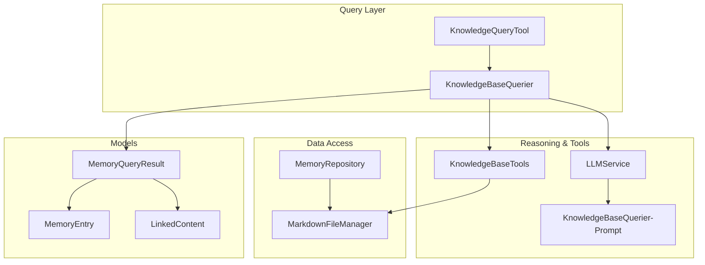
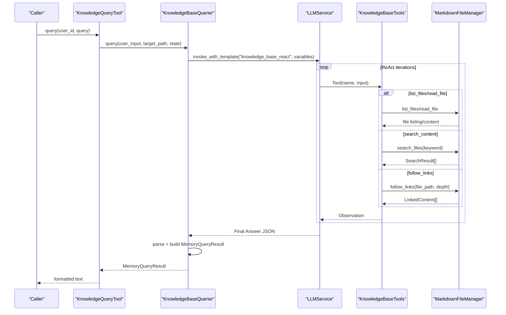
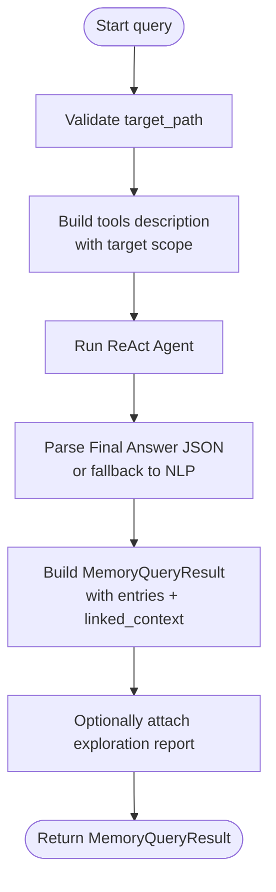
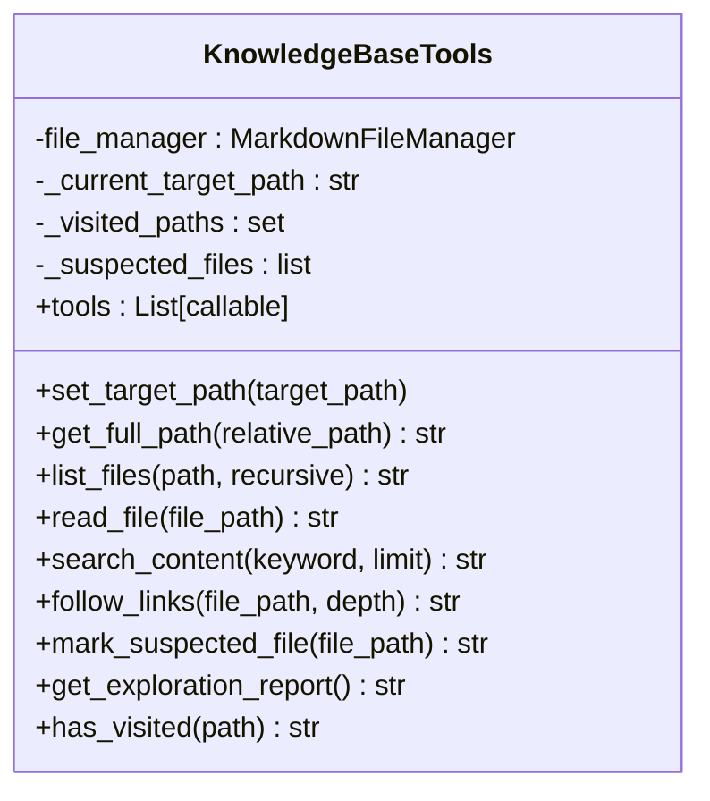
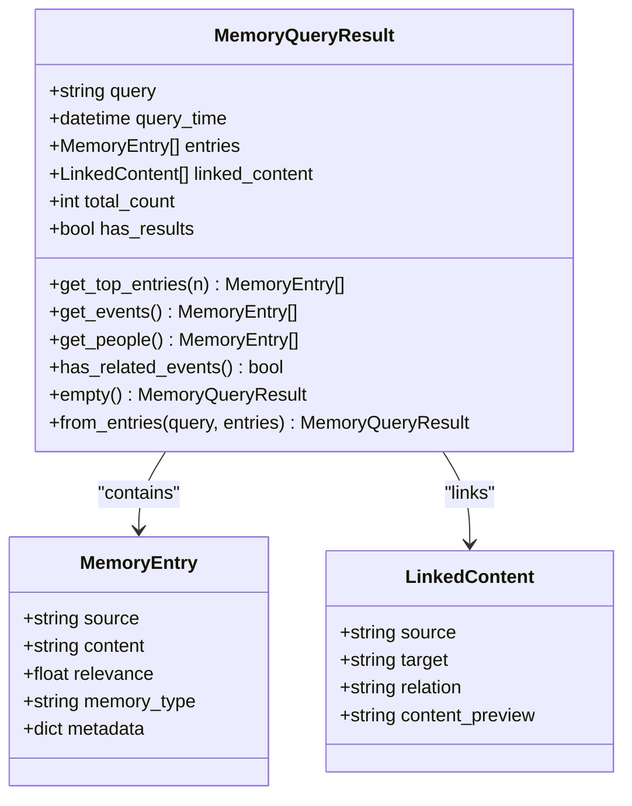
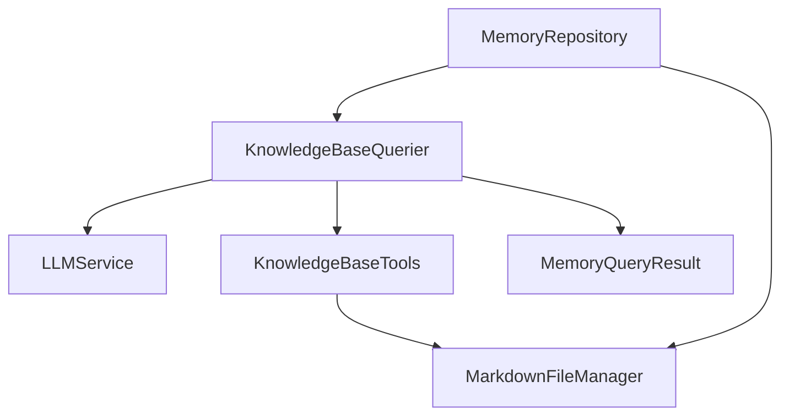

# Knowledge Base Querier

<cite>
**Referenced Files in This Document**
- [knowledge_base_querier.py](file://src/services/knowledge_base_querier.py)
- [memory_query_result.py](file://src/models/memory_query_result.py)
- [knowledge_query_tool.py](file://src/tools/knowledge_query_tool.py)
- [memory_repository.py](file://src/storage/memory_repository.py)
- [markdown_file_manager.py](file://src/storage/markdown_file_manager.py)
- [llm_service.py](file://src/services/llm_service.py)
- [KnowledgeBaseQuerier-Prompt.md](file://Prompts/KnowledgeBaseQuerier-Prompt.md)
- [MemoryOrganizer-Prompt.md](file://Prompts/MemoryOrganizer-Prompt.md)
- [test_kb_querier_target_path.py](file://test_kb_querier_target_path.py)
- [test_kb_tools.py](file://test_kb_tools.py)
- [event_info.py](file://src/models/event_info.py)
- [person_info.py](file://src/models/person_info.py)
- [session_state.py](file://src/models/session_state.py)
</cite>

## Table of Contents
1. [Introduction](#introduction)
2. [Project Structure](#project-structure)
3. [Core Components](#core-components)
4. [Architecture Overview](#architecture-overview)
5. [Detailed Component Analysis](#detailed-component-analysis)
6. [Dependency Analysis](#dependency-analysis)
7. [Performance Considerations](#performance-considerations)
8. [Troubleshooting Guide](#troubleshooting-guide)
9. [Conclusion](#conclusion)

## Introduction
This document explains the KnowledgeBaseQuerier service that powers semantic search and entity extraction over a structured knowledge base. It covers the ReAct-driven query pipeline, natural language understanding, dynamic exploration via tools, and result ranking into a unified MemoryQueryResult structure. It also documents integration with KnowledgeQueryTool for efficient query processing and the relationship with MemoryRepository for persistent storage. Practical examples illustrate complex queries, entity recognition patterns, and how semantic search enriches conversational context.

## Project Structure
The KnowledgeBaseQuerier sits at the intersection of:
- Natural language understanding and reasoning via LLM prompts
- A tool-based explorer over a Markdown-based knowledge graph
- Structured result modeling for downstream consumers

**Diagram sources**
- [knowledge_base_querier.py:202-540](file://src/services/knowledge_base_querier.py#L202-L540)
- [knowledge_query_tool.py:11-81](file://src/tools/knowledge_query_tool.py#L11-L81)
- [llm_service.py:32-481](file://src/services/llm_service.py#L32-L481)
- [KnowledgeBaseQuerier-Prompt.md:1-538](file://Prompts/KnowledgeBaseQuerier-Prompt.md#L1-L538)
- [markdown_file_manager.py:31-546](file://src/storage/markdown_file_manager.py#L31-L546)
- [memory_repository.py:40-359](file://src/storage/memory_repository.py#L40-L359)
- [memory_query_result.py:23-81](file://src/models/memory_query_result.py#L23-L81)

**Section sources**
- [knowledge_base_querier.py:202-540](file://src/services/knowledge_base_querier.py#L202-L540)
- [knowledge_query_tool.py:11-81](file://src/tools/knowledge_query_tool.py#L11-L81)
- [llm_service.py:32-481](file://src/services/llm_service.py#L32-L481)
- [KnowledgeBaseQuerier-Prompt.md:1-538](file://Prompts/KnowledgeBaseQuerier-Prompt.md#L1-L538)
- [markdown_file_manager.py:31-546](file://src/storage/markdown_file_manager.py#L31-L546)
- [memory_repository.py:40-359](file://src/storage/memory_repository.py#L40-L359)
- [memory_query_result.py:23-81](file://src/models/memory_query_result.py#L23-L81)

## Core Components
- KnowledgeBaseQuerier: Orchestrates ReAct-style exploration, invokes LLM reasoning, and parses structured results into MemoryQueryResult.
- KnowledgeBaseTools: Provides safe, scoped tools for file listing, reading, content search, and link-following within a target path.
- KnowledgeQueryTool: Thin wrapper around KnowledgeBaseQuerier for external callers, formatting results into readable text.
- MemoryQueryResult: Unified result model with entries and linked content, plus convenience helpers for filtering and ranking.
- MarkdownFileManager: Filesystem abstraction for reading/writing Markdown, searching, and resolving wiki-links.
- MemoryRepository: Higher-level storage with LRU cache, short-term memory, and long-term persistence for events and people.
- LLMService: Centralized LLM orchestration with prompt templates and structured output support.

**Section sources**
- [knowledge_base_querier.py:202-540](file://src/services/knowledge_base_querier.py#L202-L540)
- [knowledge_query_tool.py:11-81](file://src/tools/knowledge_query_tool.py#L11-L81)
- [memory_query_result.py:23-81](file://src/models/memory_query_result.py#L23-L81)
- [markdown_file_manager.py:31-546](file://src/storage/markdown_file_manager.py#L31-L546)
- [memory_repository.py:40-359](file://src/storage/memory_repository.py#L40-L359)
- [llm_service.py:32-481](file://src/services/llm_service.py#L32-L481)

## Architecture Overview
The KnowledgeBaseQuerier integrates LLM reasoning with a controlled toolset to explore a knowledge graph composed of Markdown files. The ReAct loop allows the model to:
- Understand intent
- Choose tools strategically
- Iterate until sufficient context is gathered
- Produce a structured answer suitable for conversation grounding

**Diagram sources**
- [knowledge_query_tool.py:33-66](file://src/tools/knowledge_query_tool.py#L33-L66)
- [knowledge_base_querier.py:257-373](file://src/services/knowledge_base_querier.py#L257-L373)
- [llm_service.py:293-325](file://src/services/llm_service.py#L293-L325)
- [KnowledgeBaseQuerier-Prompt.md:30-144](file://Prompts/KnowledgeBaseQuerier-Prompt.md#L30-L144)
- [markdown_file_manager.py:285-430](file://src/storage/markdown_file_manager.py#L285-L430)

**Section sources**
- [knowledge_query_tool.py:33-66](file://src/tools/knowledge_query_tool.py#L33-L66)
- [knowledge_base_querier.py:257-373](file://src/services/knowledge_base_querier.py#L257-L373)
- [llm_service.py:293-325](file://src/services/llm_service.py#L293-L325)
- [KnowledgeBaseQuerier-Prompt.md:30-144](file://Prompts/KnowledgeBaseQuerier-Prompt.md#L30-L144)
- [markdown_file_manager.py:285-430](file://src/storage/markdown_file_manager.py#L285-L430)

## Detailed Component Analysis

### KnowledgeBaseQuerier: ReAct-driven Semantic Search
- Purpose: Interpret user intent, dynamically explore the knowledge base, and produce a ranked, linked-memory result.
- ReAct Loop: Thought → Action (list_files/read_file/search_content/follow_links) → Observation → Repeat until Final Answer.
- Target-scoped Execution: Enforces a strict target_path boundary to prevent unauthorized filesystem access.
- Parsing and Ranking: Extracts structured JSON; falls back to natural-language parsing with confidence notes; builds MemoryQueryResult with relevance metadata.

**Diagram sources**
- [knowledge_base_querier.py:257-373](file://src/services/knowledge_base_querier.py#L257-L373)
- [knowledge_base_querier.py:435-511](file://src/services/knowledge_base_querier.py#L435-L511)
- [knowledge_base_querier.py:513-540](file://src/services/knowledge_base_querier.py#L513-L540)

**Section sources**
- [knowledge_base_querier.py:257-373](file://src/services/knowledge_base_querier.py#L257-L373)
- [knowledge_base_querier.py:435-511](file://src/services/knowledge_base_querier.py#L435-L511)
- [knowledge_base_querier.py:513-540](file://src/services/knowledge_base_querier.py#L513-L540)

### KnowledgeBaseTools: Safe Exploration Utilities
- list_files: Enumerate directory tree with optional recursion and detail sorting.
- read_file: Read file content synchronously to avoid event-loop conflicts.
- search_content: Full-text search across Markdown files with relevance scoring.
- follow_links: Resolve wiki-links and optionally recurse to discover connected content.
- Marking and Reporting: Track suspected files and maintain an exploration report for transparency.

**Diagram sources**
- [knowledge_base_querier.py:17-199](file://src/services/knowledge_base_querier.py#L17-L199)

**Section sources**
- [knowledge_base_querier.py:54-199](file://src/services/knowledge_base_querier.py#L54-L199)
- [markdown_file_manager.py:358-430](file://src/storage/markdown_file_manager.py#L358-L430)

### MemoryQueryResult: Structured Results and Scoring
- MemoryEntry: source, content, relevance (0–1), memory_type, and metadata.
- LinkedContent: source-target pairs with relation and preview.
- MemoryQueryResult: wraps query, entries, linked_content, counts, and booleans; provides helpers to filter by type and rank by relevance.

**Diagram sources**
- [memory_query_result.py:6-81](file://src/models/memory_query_result.py#L6-L81)

**Section sources**
- [memory_query_result.py:23-81](file://src/models/memory_query_result.py#L23-L81)

### KnowledgeQueryTool: External Integration Wrapper
- Wraps KnowledgeBaseQuerier with a simplified interface.
- Builds target_path from user_id under knowledge_base.
- Formats MemoryQueryResult into human-readable text for downstream consumption.

**Section sources**
- [knowledge_query_tool.py:11-81](file://src/tools/knowledge_query_tool.py#L11-L81)

### MemoryRepository: Storage and Caching
- Short-term memory (in-memory) and LRU cache for frequent lookups.
- Long-term persistence for events and people with indexing and timeline updates.
- Integrates KnowledgeBaseQuerier for knowledge exploration and LLMService for structured extraction.

**Section sources**
- [memory_repository.py:40-359](file://src/storage/memory_repository.py#L40-L359)

### LLMService: Prompt Templates and Structured Outputs
- Loads prompt templates from Markdown and Python modules.
- Supports structured outputs via JSON schema enforcement.
- Provides unified invocation with retry and token usage tracking.

**Section sources**
- [llm_service.py:126-217](file://src/services/llm_service.py#L126-L217)
- [llm_service.py:327-398](file://src/services/llm_service.py#L327-L398)

### Entity Extraction and Cross-Referencing
- Wiki-link extraction and traversal enable cross-references between events, people, and timelines.
- MemoryQueryResult exposes linked_context to surface relationships discovered during exploration.
- MemoryRepository maintains indices for fast retrieval and cache hits.

**Section sources**
- [markdown_file_manager.py:358-430](file://src/storage/markdown_file_manager.py#L358-L430)
- [memory_repository.py:16-87](file://src/storage/memory_repository.py#L16-L87)
- [memory_query_result.py:15-21](file://src/models/memory_query_result.py#L15-L21)

## Dependency Analysis
Key relationships:
- KnowledgeBaseQuerier depends on LLMService for reasoning and KnowledgeBaseTools for exploration.
- KnowledgeBaseTools depends on MarkdownFileManager for filesystem operations.
- MemoryQueryResult is produced by KnowledgeBaseQuerier and consumed by KnowledgeQueryTool and downstream services.
- MemoryRepository provides caching and persistence used by MemoryManager and indirectly supports KnowledgeBaseQuerier’s data access patterns.

**Diagram sources**
- [knowledge_base_querier.py:220-235](file://src/services/knowledge_base_querier.py#L220-L235)
- [llm_service.py:32-481](file://src/services/llm_service.py#L32-L481)
- [knowledge_query_tool.py:25-31](file://src/tools/knowledge_query_tool.py#L25-L31)
- [memory_repository.py:82-87](file://src/storage/memory_repository.py#L82-L87)

**Section sources**
- [knowledge_base_querier.py:220-235](file://src/services/knowledge_base_querier.py#L220-L235)
- [llm_service.py:32-481](file://src/services/llm_service.py#L32-L481)
- [knowledge_query_tool.py:25-31](file://src/tools/knowledge_query_tool.py#L25-L31)
- [memory_repository.py:82-87](file://src/storage/memory_repository.py#L82-L87)

## Performance Considerations
- Tool-first exploration: Prefer list_files(recursive=True) to gather full directory context, reducing repeated tool calls.
- Prefer complete reads: Use read_file on promising candidates before fragment searches to maximize context.
- Link traversal depth: Control depth in follow_links to balance comprehensiveness and cost.
- Caching: MemoryRepository’s LRU cache accelerates repeated lookups; leverage it for frequent entities and events.
- Prompt templating: Use knowledge_base_react to guide the model toward efficient exploration and avoid unnecessary loops.
- Concurrency: Parallelize independent operations (e.g., saving events and people) when integrating with MemoryManager.

[No sources needed since this section provides general guidance]

## Troubleshooting Guide
Common issues and resolutions:
- Empty or partial results:
  - Verify target_path correctness and existence.
  - Inspect exploration report attached to results when no direct matches are found.
- Parsing failures:
  - The parser attempts JSON extraction and falls back to natural-language parsing with confidence notes.
- Directory traversal concerns:
  - The tools enforce safe path resolution; ensure relative paths are used and avoid parent-directory traversal.
- Tool misuse:
  - Use list_files to discover structure, then read_file for content, and follow_links to uncover relationships.

**Section sources**
- [knowledge_base_querier.py:280-294](file://src/services/knowledge_base_querier.py#L280-L294)
- [knowledge_base_querier.py:335-358](file://src/services/knowledge_base_querier.py#L335-L358)
- [knowledge_base_querier.py:435-511](file://src/services/knowledge_base_querier.py#L435-L511)
- [knowledge_base_querier.py:374-433](file://src/services/knowledge_base_querier.py#L374-L433)

## Examples and Patterns

### Example 1: People and Family Context
- Query: “Who were the important people in my childhood?”
- Expected pattern:
  - Explore people/childhood-related files.
  - Read profiles and extract relationships.
  - Surface linked_context connecting people to events and timelines.

**Section sources**
- [knowledge_base_querier.py:257-373](file://src/services/knowledge_base_querier.py#L257-L373)
- [markdown_file_manager.py:390-430](file://src/storage/markdown_file_manager.py#L390-L430)

### Example 2: Event and Timeline Alignment
- Query: “What major events happened during my school years?”
- Expected pattern:
  - Search keywords like “school,” “education.”
  - Read event files and follow links to timeline nodes.
  - Rank by relevance and include linked_context for temporal alignment.

**Section sources**
- [knowledge_base_querier.py:257-373](file://src/services/knowledge_base_querier.py#L257-L373)
- [markdown_file_manager.py:285-334](file://src/storage/markdown_file_manager.py#L285-L334)

### Example 3: Theme-Based Reflection
- Query: “What values shaped my life journey?”
- Expected pattern:
  - Locate thematic files and related event/person mentions.
  - Aggregate quotes and descriptions to form a reflective summary.

**Section sources**
- [knowledge_base_querier.py:257-373](file://src/services/knowledge_base_querier.py#L257-L373)
- [MemoryOrganizer-Prompt.md:560-634](file://Prompts/MemoryOrganizer-Prompt.md#L560-L634)

### Example 4: Complex Multi-Step Query
- Query: “Tell me about my early work experiences and the people who influenced me.”
- Expected pattern:
  - Search career-related terms.
  - Read event files and follow links to people profiles.
  - Build linked_context to show influence relationships.

**Section sources**
- [knowledge_base_querier.py:257-373](file://src/services/knowledge_base_querier.py#L257-L373)
- [markdown_file_manager.py:390-430](file://src/storage/markdown_file_manager.py#L390-L430)

## Semantic Search and Conversation Context
- Semantic grounding: MemoryQueryResult entries provide summarized, relevant content with metadata for downstream summarization and question generation.
- Relationship mapping: LinkedContent captures explicit connections between entities and events, enabling richer conversation context.
- Iterative refinement: ReAct loop ensures the model explores deeply and returns only what is truly relevant.

**Section sources**
- [memory_query_result.py:23-81](file://src/models/memory_query_result.py#L23-L81)
- [KnowledgeBaseQuerier-Prompt.md:110-144](file://Prompts/KnowledgeBaseQuerier-Prompt.md#L110-L144)

## Testing and Validation
- Target-path scoping: Tests confirm target_path enforcement and safe path resolution.
- Tool functionality: Tests validate list_files, read_file, search_content, follow_links, and reporting.

**Section sources**
- [test_kb_querier_target_path.py:25-103](file://test_kb_querier_target_path.py#L25-L103)
- [test_kb_tools.py:49-133](file://test_kb_tools.py#L49-L133)

## Conclusion
KnowledgeBaseQuerier delivers a robust, ReAct-driven semantic search engine over a Markdown-based knowledge graph. By combining precise tool-based exploration, structured result modeling, and link-aware discovery, it enables deep, context-rich conversations grounded in personal memories. Integration with KnowledgeQueryTool and MemoryRepository further streamlines practical deployment, while caching and indexing optimize performance for frequently accessed knowledge.