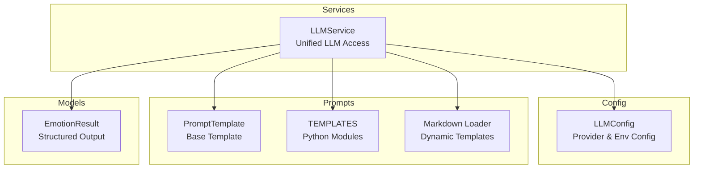
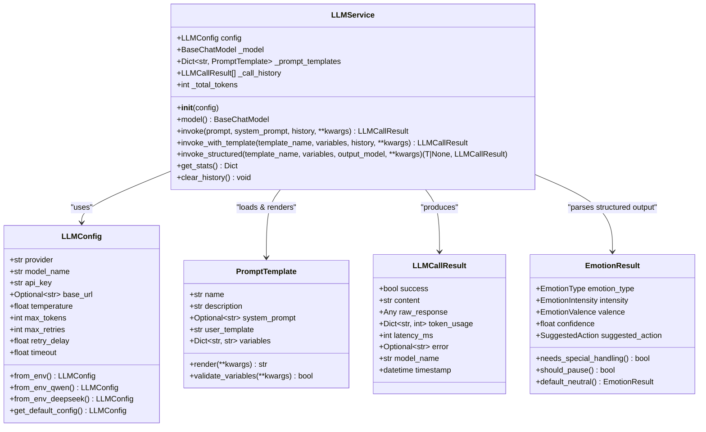
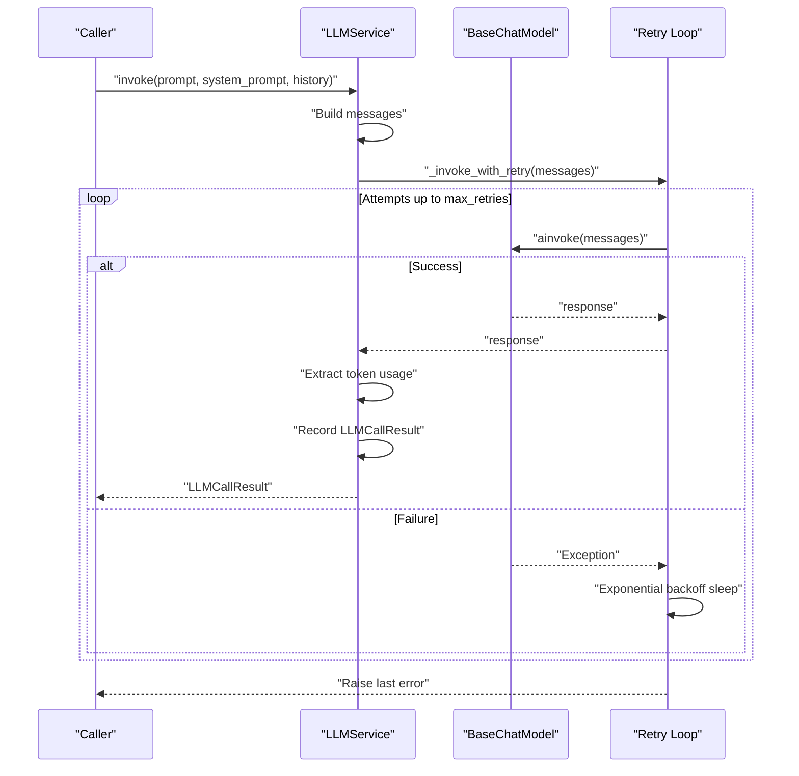
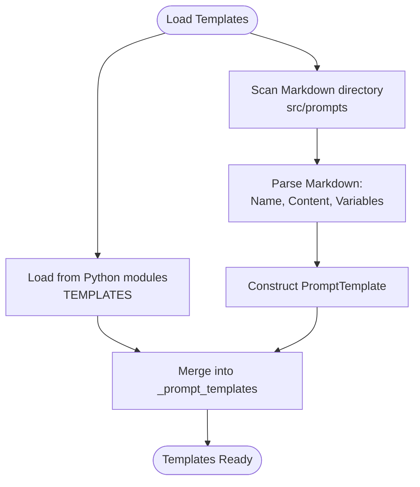
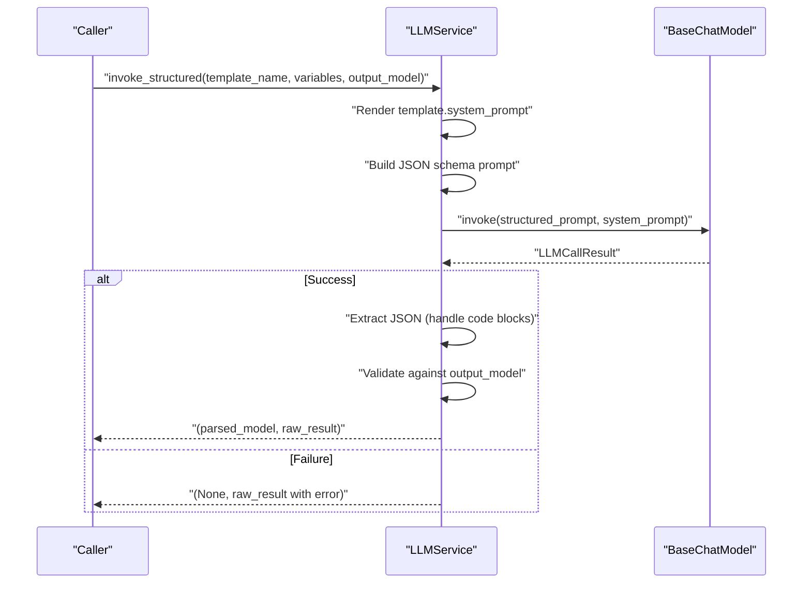
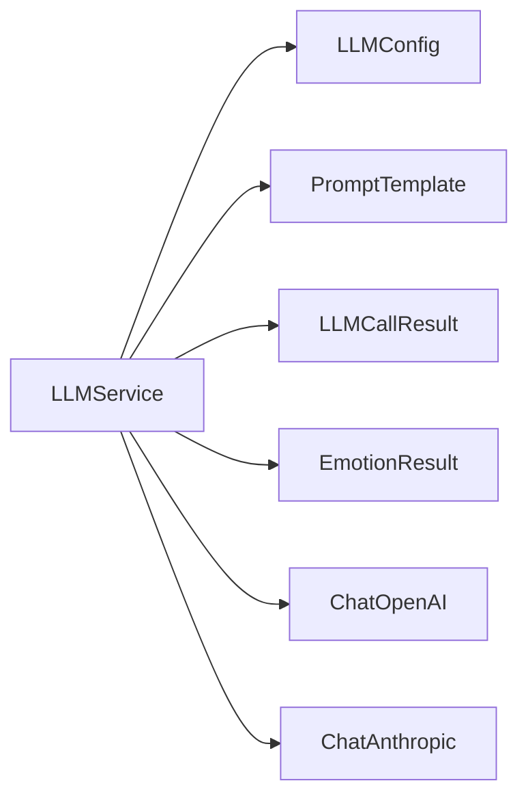

# LLM Service

<cite>
**Referenced Files in This Document**
- [llm_service.py](file://src/services/llm_service.py)
- [llm_config.py](file://src/config/llm_config.py)
- [base.py](file://src/prompts/base.py)
- [__init__.py](file://src/prompts/__init__.py)
- [question_prompts.py](file://src/prompts/question_prompts.py)
- [emotion_prompts.py](file://src/prompts/emotion_prompts.py)
- [summary_prompts.py](file://src/prompts/summary_prompts.py)
- [emotion_result.py](file://src/models/emotion_result.py)
- [test_llm_service.py](file://tests/test_llm_service.py)
- [verify_llm_service.py](file://verify_llm_service.py)
</cite>

## Table of Contents
1. [Introduction](#introduction)
2. [Project Structure](#project-structure)
3. [Core Components](#core-components)
4. [Architecture Overview](#architecture-overview)
5. [Detailed Component Analysis](#detailed-component-analysis)
6. [Dependency Analysis](#dependency-analysis)
7. [Performance Considerations](#performance-considerations)
8. [Troubleshooting Guide](#troubleshooting-guide)
9. [Conclusion](#conclusion)
10. [Appendices](#appendices)

## Introduction
This document provides comprehensive documentation for the LLMService class, which offers unified access to multiple AI model providers (OpenAI, Anthropic, Qwen, and DeepSeek) through a consistent interface. It covers the provider abstraction, three invocation modes (basic, template-based, and structured output), the prompt template system (including dynamic loading from Markdown files and Python modules), error handling and retry mechanisms with exponential backoff, token usage tracking, and performance monitoring. It also documents the LLMCallResult data structure, statistics collection, and global service initialization patterns, with practical examples and integration guidance.

## Project Structure
The LLM service integrates tightly with configuration, prompt templates, and Pydantic models. The primary files involved are:
- LLMService implementation and global initialization helpers
- LLM configuration model with environment variable support
- Prompt template base class and provider-specific templates
- Structured output models for parsing

**Diagram sources**
- [llm_service.py:32-481](file://src/services/llm_service.py#L32-L481)
- [llm_config.py:10-120](file://src/config/llm_config.py#L10-L120)
- [base.py:6-33](file://src/prompts/base.py#L6-L33)
- [__init__.py:1-12](file://src/prompts/__init__.py#L1-L12)
- [emotion_result.py:6-57](file://src/models/emotion_result.py#L6-L57)

**Section sources**
- [llm_service.py:32-481](file://src/services/llm_service.py#L32-L481)
- [llm_config.py:10-120](file://src/config/llm_config.py#L10-L120)
- [base.py:6-33](file://src/prompts/base.py#L6-L33)
- [__init__.py:1-12](file://src/prompts/__init__.py#L1-L12)
- [emotion_result.py:6-57](file://src/models/emotion_result.py#L6-L57)

## Core Components
- LLMService: Central orchestrator for provider initialization, prompt rendering, invocation, retries, token accounting, and statistics.
- LLMConfig: Provider configuration with environment variable support and provider-specific overrides.
- PromptTemplate: Base template abstraction with rendering and variable validation.
- TEMPLATES: Aggregated template registry from Python modules.
- EmotionResult: Example structured output model for parsing JSON responses.

Key responsibilities:
- Unified provider abstraction for OpenAI-compatible, Qwen, DeepSeek, and Anthropic.
- Three invocation modes: basic invoke(), template-based invoke_with_template(), and structured invoke_structured().
- Dynamic prompt template loading from Markdown files and Python modules.
- Retry with exponential backoff and robust error handling.
- Token usage extraction and statistics aggregation.
- Global service initialization via get_llm_service() and init_llm_service().

**Section sources**
- [llm_service.py:32-481](file://src/services/llm_service.py#L32-L481)
- [llm_config.py:10-120](file://src/config/llm_config.py#L10-L120)
- [base.py:6-33](file://src/prompts/base.py#L6-L33)
- [__init__.py:1-12](file://src/prompts/__init__.py#L1-L12)
- [emotion_result.py:6-57](file://src/models/emotion_result.py#L6-L57)

## Architecture Overview
The LLMService encapsulates LangChain’s BaseChatModel and exposes a simplified interface. It supports multiple providers by conditionally constructing provider-specific chat models. Prompt templates are loaded from two sources: Python modules and Markdown files. Invocation results are standardized via LLMCallResult, with token usage tracked and aggregated.

**Diagram sources**
- [llm_service.py:32-481](file://src/services/llm_service.py#L32-L481)
- [llm_config.py:10-120](file://src/config/llm_config.py#L10-L120)
- [base.py:6-33](file://src/prompts/base.py#L6-L33)
- [emotion_result.py:6-57](file://src/models/emotion_result.py#L6-L57)

## Detailed Component Analysis

### LLMService
- Provider Abstraction:
  - OpenAI/Qwen: Uses ChatOpenAI with optional base_url and provider-specific extras (e.g., DeepSeek thinking disabled).
  - Anthropic: Dynamically imported ChatAnthropic.
  - Unsupported provider raises a ValueError.
- Invocation Modes:
  - Basic invoke(): Builds messages (system, history, user), calls with retry, records metrics.
  - Template-based invoke_with_template(): Renders a named template and delegates to basic invoke().
  - Structured invoke_structured(): Adds a JSON schema prompt, parses returned JSON into a Pydantic model.
- Prompt Template System:
  - Loads from Python modules via TEMPLATES registry.
  - Loads from Markdown files under src/prompts with custom parsing for name, content, and variable table.
- Error Handling and Retries:
  - Exponential backoff retry loop with configurable max_retries.
  - Catches exceptions, logs warnings, and surfaces errors in LLMCallResult.
- Metrics and Statistics:
  - Extracts token usage from response metadata when available.
  - Tracks total tokens and maintains a call history for statistics.

**Diagram sources**
- [llm_service.py:225-292](file://src/services/llm_service.py#L225-L292)
- [llm_service.py:400-438](file://src/services/llm_service.py#L400-L438)

**Section sources**
- [llm_service.py:32-481](file://src/services/llm_service.py#L32-L481)

### LLMConfig
- Supports environment-driven configuration with provider-specific overrides:
  - Qwen: QWEN_URL and QWEN_APIKEY take precedence.
  - DeepSeek: DEEPSEEK_URL and DEEPSEEK_APIKEY take precedence.
  - Fallback to generic LLM_* variables if provider-specific ones are absent.
- Provides convenience constructors:
  - from_env_qwen(), from_env_deepseek(), and get_default_config().

**Section sources**
- [llm_config.py:10-120](file://src/config/llm_config.py#L10-L120)

### PromptTemplate and Template Registry
- PromptTemplate:
  - Fields: name, description, system_prompt, user_template, variables.
  - Methods: render() performs safe substitution; validate_variables() checks completeness.
- Template Registry:
  - Aggregates TEMPLATES from question_prompts.py, emotion_prompts.py, and summary_prompts.py.
- Markdown Loading:
  - Parses Markdown files for template name, content, and variable table, then constructs PromptTemplate instances.

**Diagram sources**
- [base.py:6-33](file://src/prompts/base.py#L6-L33)
- [__init__.py:1-12](file://src/prompts/__init__.py#L1-L12)
- [llm_service.py:126-217](file://src/services/llm_service.py#L126-L217)

**Section sources**
- [base.py:6-33](file://src/prompts/base.py#L6-L33)
- [__init__.py:1-12](file://src/prompts/__init__.py#L1-L12)
- [question_prompts.py:1-86](file://src/prompts/question_prompts.py#L1-L86)
- [emotion_prompts.py:1-38](file://src/prompts/emotion_prompts.py#L1-L38)
- [summary_prompts.py:1-49](file://src/prompts/summary_prompts.py#L1-L49)
- [llm_service.py:126-217](file://src/services/llm_service.py#L126-L217)

### Structured Output Parsing
- invoke_structured() builds a JSON schema prompt using the target Pydantic model’s JSON schema, calls invoke(), then attempts to extract and parse JSON from the response.
- Handles code-block-wrapped JSON and validates against the model schema.

**Diagram sources**
- [llm_service.py:327-399](file://src/services/llm_service.py#L327-L399)
- [emotion_result.py:6-57](file://src/models/emotion_result.py#L6-L57)

**Section sources**
- [llm_service.py:327-399](file://src/services/llm_service.py#L327-L399)
- [emotion_result.py:6-57](file://src/models/emotion_result.py#L6-L57)

### Global Service Initialization
- get_llm_service(): Lazy-initializes a global singleton using get_default_config().
- init_llm_service(config): Explicitly initializes the global singleton with a given config.

**Section sources**
- [llm_service.py:464-481](file://src/services/llm_service.py#L464-L481)

## Dependency Analysis
- Internal dependencies:
  - LLMService depends on LLMConfig for provider/model settings.
  - LLMService loads PromptTemplate instances from TEMPLATES and Markdown files.
  - LLMService produces LLMCallResult and optionally parses into Pydantic models like EmotionResult.
- External dependencies:
  - LangChain chat models (ChatOpenAI, ChatAnthropic).
  - Pydantic for configuration and structured output models.
  - Standard library modules for timing, logging, and file parsing.

**Diagram sources**
- [llm_service.py:90-124](file://src/services/llm_service.py#L90-L124)
- [llm_config.py:10-120](file://src/config/llm_config.py#L10-L120)
- [emotion_result.py:6-57](file://src/models/emotion_result.py#L6-L57)

**Section sources**
- [llm_service.py:90-124](file://src/services/llm_service.py#L90-L124)
- [llm_config.py:10-120](file://src/config/llm_config.py#L10-L120)
- [emotion_result.py:6-57](file://src/models/emotion_result.py#L6-L57)

## Performance Considerations
- Retry Strategy: Exponential backoff reduces load on failing endpoints and improves resilience.
- Token Accounting: When response metadata is available, token usage is extracted and accumulated for cost and quota monitoring.
- Statistics: Call counts, total tokens, success rate, and average latency are computed for observability.
- Asynchronous Invocation: Uses ainvoke() to avoid blocking the event loop.

Recommendations:
- Tune max_retries and retry_delay based on provider SLAs.
- Monitor success_rate and avg_latency to detect provider issues early.
- Consider caching frequent prompt renders if templates are static.

**Section sources**
- [llm_service.py:400-457](file://src/services/llm_service.py#L400-L457)

## Troubleshooting Guide
Common issues and resolutions:
- Provider Not Supported: Ensure provider is one of openai, anthropic, qwen, or deepseek. Unsupported providers raise a ValueError during model initialization.
- Missing Templates: invoke_with_template() requires a template name present in _prompt_templates. Verify template loading from Python modules and Markdown files.
- Structured Output Parsing Failures: Non-JSON or malformed JSON responses cause parse errors. Ensure the model follows the JSON schema prompt and returns clean JSON.
- API Errors: invoke() catches exceptions and returns LLMCallResult with error details. Inspect error field and logs for specifics.
- Token Usage Missing: Some providers may not expose usage metadata. _extract_token_usage() safely handles missing fields.

Validation and verification:
- Unit tests cover success/failure scenarios, retry behavior, template usage, structured parsing, and statistics computation.
- Verification script demonstrates configuration, template loading, and service initialization.

**Section sources**
- [llm_service.py:121-122](file://src/services/llm_service.py#L121-L122)
- [llm_service.py:312-313](file://src/services/llm_service.py#L312-L313)
- [llm_service.py:394-398](file://src/services/llm_service.py#L394-L398)
- [llm_service.py:285-291](file://src/services/llm_service.py#L285-L291)
- [llm_service.py:439-447](file://src/services/llm_service.py#L439-L447)
- [test_llm_service.py:1-187](file://tests/test_llm_service.py#L1-L187)
- [verify_llm_service.py:1-121](file://verify_llm_service.py#L1-L121)

## Conclusion
The LLMService provides a robust, extensible abstraction over multiple LLM providers with consistent invocation patterns, powerful prompt templating, and comprehensive observability. Its retry and error-handling mechanisms improve reliability, while structured output parsing enables precise downstream processing. The modular design allows easy addition of new providers and templates.

## Appendices

### Invocation Examples and Patterns
- Basic invoke():
  - Build a simple conversation turn with optional system prompt and history.
  - Returns LLMCallResult with content, token usage, latency, and error info.
- Template-based invoke_with_template():
  - Render a predefined template with variables and call invoke().
  - Useful for standardized workflows like question generation and emotion response.
- Structured invoke_structured():
  - Request JSON output aligned with a Pydantic model schema.
  - Parse and validate the result into a strongly-typed object.

Integration patterns:
- Use get_llm_service() for lazy initialization in applications.
- Use init_llm_service(config) for explicit control in tests or CLI tools.
- Combine with other AI services by passing LLMCallResult.raw_response for advanced processing.

**Section sources**
- [llm_service.py:225-399](file://src/services/llm_service.py#L225-L399)
- [llm_service.py:464-481](file://src/services/llm_service.py#L464-L481)
- [test_llm_service.py:24-102](file://tests/test_llm_service.py#L24-L102)