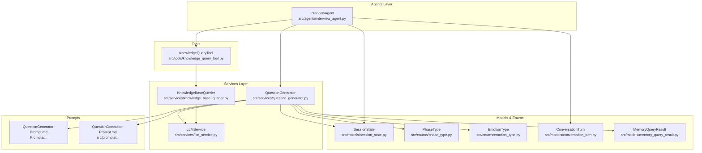
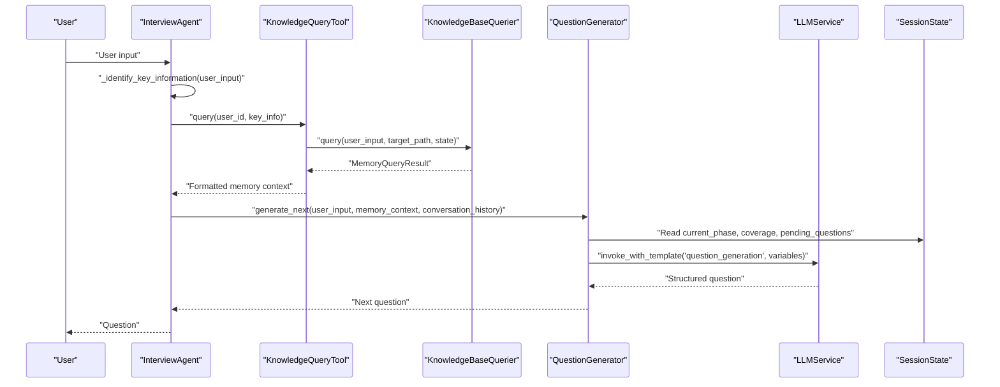
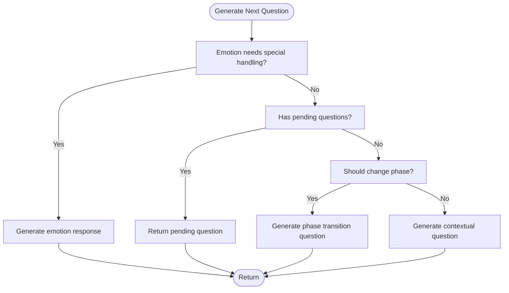
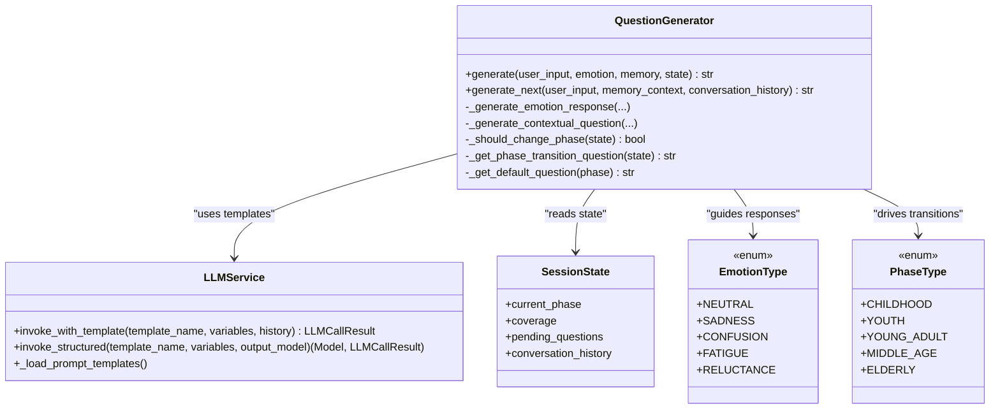
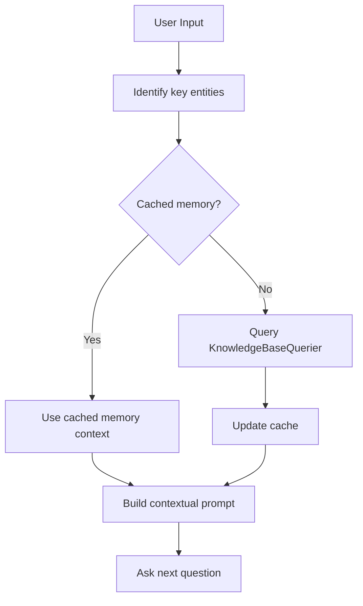
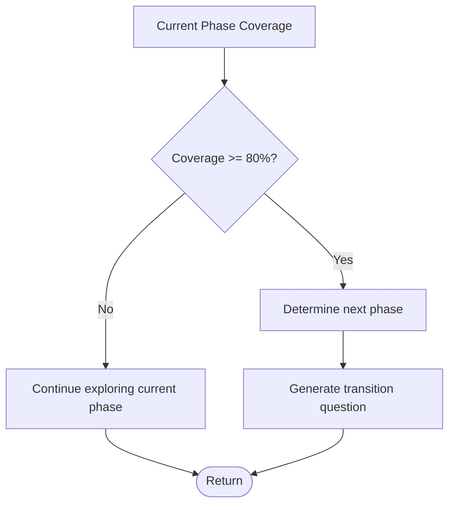
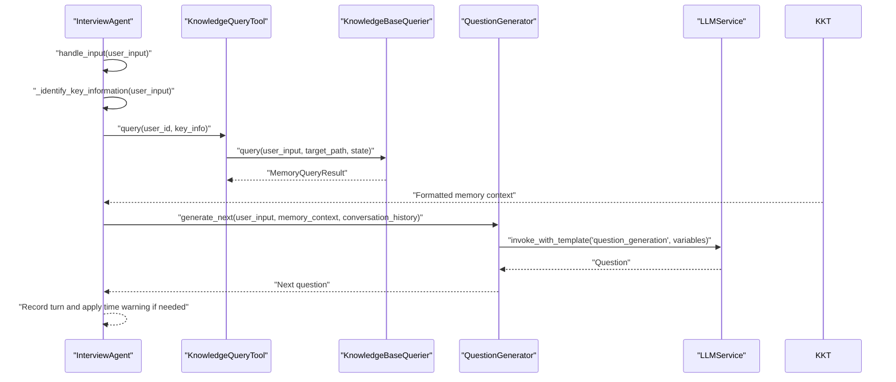
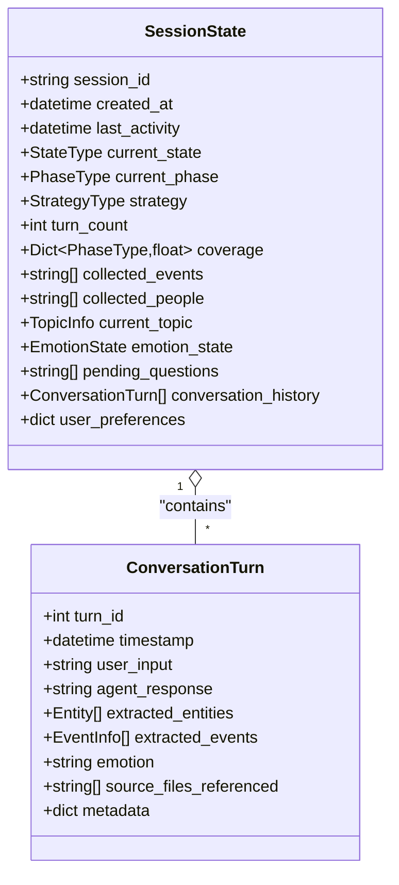
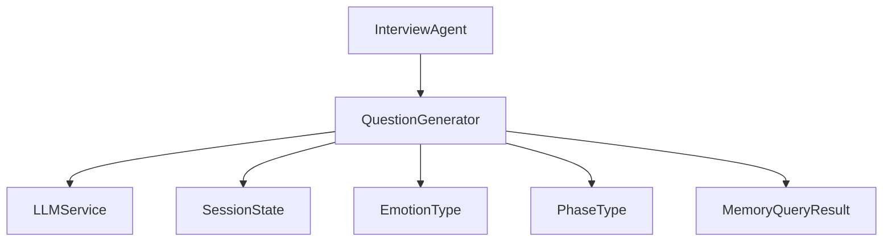

# Question Generator

<cite>
**Referenced Files in This Document**
- [question_generator.py](file://src/services/question_generator.py)
- [QuestionGenerator-Prompt.md](file://Prompts/QuestionGenerator-Prompt.md)
- [QuestionGenerator-Prompt.md](file://src/prompts/QuestionGenerator-Prompt.md)
- [interview_agent.py](file://src/agents/interview_agent.py)
- [knowledge_base_querier.py](file://src/services/knowledge_base_querier.py)
- [session_state.py](file://src/models/session_state.py)
- [phase_type.py](file://src/enums/phase_type.py)
- [emotion_type.py](file://src/enums/emotion_type.py)
- [conversation_turn.py](file://src/models/conversation_turn.py)
- [llm_service.py](file://src/services/llm_service.py)
- [knowledge_query_tool.py](file://src/tools/knowledge_query_tool.py)
- [memory_query_result.py](file://src/models/memory_query_result.py)
- [README.md](file://README.md)
</cite>

## Table of Contents
1. [Introduction](#introduction)
2. [Project Structure](#project-structure)
3. [Core Components](#core-components)
4. [Architecture Overview](#architecture-overview)
5. [Detailed Component Analysis](#detailed-component-analysis)
6. [Dependency Analysis](#dependency-analysis)
7. [Performance Considerations](#performance-considerations)
8. [Troubleshooting Guide](#troubleshooting-guide)
9. [Conclusion](#conclusion)

## Introduction
The QuestionGenerator service is the adaptive question engine that powers the interview session orchestration. It transforms conversation history, user responses, and contextual memory into targeted follow-up questions while maintaining emotional sensitivity and chronological awareness. This document explains how the service analyzes conversation context, applies progressive disclosure patterns, targets time periods for chronological interviews, and integrates with InterviewAgent and KnowledgeBaseQuerier to deliver contextually relevant questions that balance guided interviewing with natural conversation flow.

## Project Structure
The QuestionGenerator resides in the services layer alongside other core services and integrates with agents, models, and tools across the system.

**Diagram sources**
- [question_generator.py:12-253](file://src/services/question_generator.py#L12-L253)
- [interview_agent.py:16-346](file://src/agents/interview_agent.py#L16-L346)
- [knowledge_base_querier.py:202-540](file://src/services/knowledge_base_querier.py#L202-L540)
- [llm_service.py:32-481](file://src/services/llm_service.py#L32-L481)
- [session_state.py:24-139](file://src/models/session_state.py#L24-L139)
- [phase_type.py:4-10](file://src/enums/phase_type.py#L4-L10)
- [emotion_type.py:4-50](file://src/enums/emotion_type.py#L4-L50)
- [conversation_turn.py:14-52](file://src/models/conversation_turn.py#L14-L52)
- [knowledge_query_tool.py:11-81](file://src/tools/knowledge_query_tool.py#L11-L81)
- [memory_query_result.py:23-81](file://src/models/memory_query_result.py#L23-L81)
- [QuestionGenerator-Prompt.md:1-352](file://Prompts/QuestionGenerator-Prompt.md#L1-L352)
- [QuestionGenerator-Prompt.md:1-352](file://src/prompts/QuestionGenerator-Prompt.md#L1-L352)

**Section sources**
- [README.md:27-53](file://README.md#L27-L53)
- [question_generator.py:12-253](file://src/services/question_generator.py#L12-L253)
- [interview_agent.py:16-346](file://src/agents/interview_agent.py#L16-L346)

## Core Components
- QuestionGenerator: Generates adaptive questions using a priority-driven decision chain, emotion-aware responses, and context-aware prompting.
- InterviewAgent: Orchestrates the interview loop, invoking QuestionGenerator and integrating with KnowledgeBaseQuerier and MemoryCacheTool.
- KnowledgeBaseQuerier: Implements a ReAct-style agent to search and retrieve relevant memory content for context-aware question generation.
- LLMService: Unified interface for prompt templating, structured outputs, and conversation history injection.
- SessionState: Tracks interview progress, phases, coverage, pending questions, and conversation history.
- EmotionType and PhaseType: Enumerations that inform question selection and stage transitions.
- MemoryQueryResult: Structured representation of retrieved memory entries and linked content.

**Section sources**
- [question_generator.py:12-253](file://src/services/question_generator.py#L12-L253)
- [interview_agent.py:16-346](file://src/agents/interview_agent.py#L16-L346)
- [knowledge_base_querier.py:202-540](file://src/services/knowledge_base_querier.py#L202-L540)
- [llm_service.py:32-481](file://src/services/llm_service.py#L32-L481)
- [session_state.py:24-139](file://src/models/session_state.py#L24-L139)
- [emotion_type.py:4-50](file://src/enums/emotion_type.py#L4-L50)
- [phase_type.py:4-10](file://src/enums/phase_type.py#L4-L10)
- [memory_query_result.py:23-81](file://src/models/memory_query_result.py#L23-L81)

## Architecture Overview
The QuestionGenerator participates in a multi-stage interview pipeline:
- InterviewAgent receives user input, identifies key information, queries knowledge base, updates cache, and asks the next question.
- QuestionGenerator evaluates emotion, pending questions, phase transitions, and memory context to produce the next question.
- LLMService loads dynamic prompt templates and injects conversation history for optimal engagement.
- KnowledgeBaseQuerier performs ReAct-style exploration within the user’s knowledge base to enrich context.

**Diagram sources**
- [interview_agent.py:115-184](file://src/agents/interview_agent.py#L115-L184)
- [knowledge_query_tool.py:33-66](file://src/tools/knowledge_query_tool.py#L33-L66)
- [knowledge_base_querier.py:257-373](file://src/services/knowledge_base_querier.py#L257-L373)
- [question_generator.py:207-253](file://src/services/question_generator.py#L207-L253)
- [llm_service.py:293-325](file://src/services/llm_service.py#L293-L325)
- [session_state.py:24-139](file://src/models/session_state.py#L24-L139)

## Detailed Component Analysis

### QuestionGenerator: Adaptive Question Engine
The QuestionGenerator implements a priority-driven decision chain to select the most appropriate next question:
- Emotion response: If the user requires special handling, generate a supportive response before asking a new question.
- Pending questions: Serve pre-cached follow-ups to maintain momentum.
- Phase transition: When coverage reaches a threshold, propose a natural transition to the next life stage.
- Contextual question: Otherwise, generate a question informed by user input, memory context, strategy, and conversation history.

Key behaviors:
- Emotion-aware fallbacks: Provides predefined responses for high-intensity negative emotions or fatigue.
- Progressive disclosure: Uses memory context to guide deeper exploration without overwhelming the user.
- Time period targeting: Leverages SessionState coverage thresholds to move from childhood to elderly stages systematically.
- Structured prompting: Uses a dedicated template to ensure consistent question types and reasoning.

**Diagram sources**
- [question_generator.py:38-74](file://src/services/question_generator.py#L38-L74)
- [question_generator.py:75-108](file://src/services/question_generator.py#L75-L108)
- [question_generator.py:109-140](file://src/services/question_generator.py#L109-L140)
- [question_generator.py:152-195](file://src/services/question_generator.py#L152-L195)

**Section sources**
- [question_generator.py:12-253](file://src/services/question_generator.py#L12-L253)

### QuestionGenerator-Prompt Template System
The QuestionGenerator-Prompt.md defines a structured template that guides the LLM to:
- Understand the user’s recent input, current emotion, memory context, phase, strategy, and conversation history.
- Apply principles such as prioritizing emotion handling, using specificization, emotionalization, and association.
- Output a JSON object containing the question, question type, reasoning, and expected information categories.

The LLMService loads this template dynamically and renders it with runtime variables, enabling consistent and context-aware question generation.

**Diagram sources**
- [question_generator.py:12-253](file://src/services/question_generator.py#L12-L253)
- [llm_service.py:293-325](file://src/services/llm_service.py#L293-L325)
- [session_state.py:24-139](file://src/models/session_state.py#L24-L139)
- [emotion_type.py:4-50](file://src/enums/emotion_type.py#L4-L50)
- [phase_type.py:4-10](file://src/enums/phase_type.py#L4-L10)

**Section sources**
- [QuestionGenerator-Prompt.md:1-352](file://Prompts/QuestionGenerator-Prompt.md#L1-L352)
- [QuestionGenerator-Prompt.md:1-352](file://src/prompts/QuestionGenerator-Prompt.md#L1-L352)
- [llm_service.py:126-161](file://src/services/llm_service.py#L126-L161)

### Contextual Awareness and Progressive Disclosure
Contextual awareness is achieved through:
- Conversation history: Injected into LLMService calls to maintain continuity.
- Memory context: Formatted MemoryQueryResult entries guide deeper exploration.
- Strategy and phase: Interview strategy and current life phase influence question framing.
- Pending questions: Pre-specified follow-ups maintain engagement and momentum.

Progressive disclosure patterns:
- Start with broad, open-ended questions to establish comfort.
- Use follow-ups to drill down into specifics when users mention events or people.
- Introduce confirmatory questions to validate key facts.
- Transition naturally between phases when coverage thresholds are met.

**Diagram sources**
- [interview_agent.py:115-184](file://src/agents/interview_agent.py#L115-L184)
- [knowledge_query_tool.py:33-66](file://src/tools/knowledge_query_tool.py#L33-L66)
- [knowledge_base_querier.py:257-373](file://src/services/knowledge_base_querier.py#L257-L373)
- [question_generator.py:109-140](file://src/services/question_generator.py#L109-L140)

**Section sources**
- [interview_agent.py:115-184](file://src/agents/interview_agent.py#L115-L184)
- [knowledge_query_tool.py:33-66](file://src/tools/knowledge_query_tool.py#L33-L66)
- [knowledge_base_querier.py:257-373](file://src/services/knowledge_base_querier.py#L257-L373)
- [question_generator.py:109-140](file://src/services/question_generator.py#L109-L140)

### Time Period Targeting for Chronological Interviews
The QuestionGenerator enforces chronological progression by monitoring coverage thresholds per life phase:
- Coverage thresholds: When coverage for the current phase exceeds 80%, the system proposes a natural transition to the next phase.
- Phase ordering: Defined as Childhood → Youth → Young Adult → Middle Age → Elderly.
- Transition questions: Provide smooth bridges between phases, encouraging deeper exploration of the next stage.

**Diagram sources**
- [question_generator.py:152-195](file://src/services/question_generator.py#L152-L195)
- [phase_type.py:4-10](file://src/enums/phase_type.py#L4-L10)

**Section sources**
- [question_generator.py:152-195](file://src/services/question_generator.py#L152-L195)
- [phase_type.py:4-10](file://src/enums/phase_type.py#L4-L10)

### Integration with InterviewAgent and KnowledgeBaseQuerier
InterviewAgent orchestrates the end-to-end interview loop:
- Starts the session and records turns.
- Identifies key information from user input to drive knowledge base queries.
- Queries KnowledgeBaseQuerier via KnowledgeQueryTool, caches results, and passes formatted memory context to QuestionGenerator.
- Applies time warnings near session end and records assistant replies.

**Diagram sources**
- [interview_agent.py:115-184](file://src/agents/interview_agent.py#L115-L184)
- [knowledge_query_tool.py:33-66](file://src/tools/knowledge_query_tool.py#L33-L66)
- [knowledge_base_querier.py:257-373](file://src/services/knowledge_base_querier.py#L257-L373)
- [question_generator.py:207-253](file://src/services/question_generator.py#L207-L253)
- [llm_service.py:293-325](file://src/services/llm_service.py#L293-L325)

**Section sources**
- [interview_agent.py:115-184](file://src/agents/interview_agent.py#L115-L184)
- [knowledge_query_tool.py:33-66](file://src/tools/knowledge_query_tool.py#L33-L66)
- [knowledge_base_querier.py:257-373](file://src/services/knowledge_base_querier.py#L257-L373)
- [question_generator.py:207-253](file://src/services/question_generator.py#L207-L253)

### Conversation Turn Structure for Optimal Engagement
Each conversation turn captures:
- User input, agent response, extracted entities and events, emotion, referenced memory files, and metadata.
- SessionState maintains conversation history, coverage, and pending questions to inform QuestionGenerator decisions.

**Diagram sources**
- [conversation_turn.py:14-52](file://src/models/conversation_turn.py#L14-L52)
- [session_state.py:24-139](file://src/models/session_state.py#L24-L139)

**Section sources**
- [conversation_turn.py:14-52](file://src/models/conversation_turn.py#L14-L52)
- [session_state.py:24-139](file://src/models/session_state.py#L24-L139)

### Question Generation Patterns, Timing Strategies, and Emotional Adaptation
Patterns:
- Open-ended questions to initiate storytelling.
- Follow-up questions to deepen details when users mention events or people.
- Confirmatory questions to validate key facts.
- Emotion response questions to acknowledge and soothe strong feelings.

Timing strategies:
- InterviewAgent tracks elapsed time and adds a gentle time warning near the session threshold.
- QuestionGenerator respects user energy by avoiding overly deep probing when fatigue or reluctance is detected.

Emotional adaptation:
- EmotionType enumerations guide QuestionGenerator’s fallback responses for sadness, fatigue, and reluctance.
- Emotion-aware templates and structured outputs help the LLM tailor tone and phrasing to the user’s emotional state.

**Section sources**
- [emotion_type.py:4-50](file://src/enums/emotion_type.py#L4-L50)
- [question_generator.py:75-108](file://src/services/question_generator.py#L75-L108)
- [interview_agent.py:274-287](file://src/agents/interview_agent.py#L274-L287)

## Dependency Analysis
The QuestionGenerator depends on:
- LLMService for prompt templating and structured outputs.
- SessionState for phase, coverage, and conversation history.
- EmotionType and PhaseType for decision-making.
- MemoryQueryResult for memory context formatting.
- InterviewAgent for orchestrating the interview loop and passing conversation history.

**Diagram sources**
- [question_generator.py:12-253](file://src/services/question_generator.py#L12-L253)
- [llm_service.py:32-481](file://src/services/llm_service.py#L32-L481)
- [session_state.py:24-139](file://src/models/session_state.py#L24-L139)
- [emotion_type.py:4-50](file://src/enums/emotion_type.py#L4-L50)
- [phase_type.py:4-10](file://src/enums/phase_type.py#L4-L10)
- [memory_query_result.py:23-81](file://src/models/memory_query_result.py#L23-L81)
- [interview_agent.py:16-346](file://src/agents/interview_agent.py#L16-L346)

**Section sources**
- [question_generator.py:12-253](file://src/services/question_generator.py#L12-L253)
- [llm_service.py:32-481](file://src/services/llm_service.py#L32-L481)
- [session_state.py:24-139](file://src/models/session_state.py#L24-L139)
- [emotion_type.py:4-50](file://src/enums/emotion_type.py#L4-L50)
- [phase_type.py:4-10](file://src/enums/phase_type.py#L4-L10)
- [memory_query_result.py:23-81](file://src/models/memory_query_result.py#L23-L81)
- [interview_agent.py:16-346](file://src/agents/interview_agent.py#L16-L346)

## Performance Considerations
- Prompt templating overhead: Loading and rendering templates adds latency; reuse formatted variables and minimize repeated template loads.
- Memory context size: Limit the number of entries passed to the LLM to keep prompts concise and reduce token usage.
- Conversation history length: Truncate or summarize recent turns to maintain relevance without bloating the context window.
- Retry and error handling: LLMService includes retry logic; ensure QuestionGenerator falls back gracefully when LLM calls fail.

## Troubleshooting Guide
Common issues and resolutions:
- No relevant memory context: QuestionGenerator falls back to default questions per phase; verify KnowledgeBaseQuerier is configured correctly and KnowledgeQueryTool targets the right user directory.
- Emotion detection failures: Emotion-aware fallbacks provide neutral responses; ensure EmotionType values align with the detected emotion and that the emotion response template is loaded.
- Excessive token usage: Reduce memory context length and conversation history size; adjust LLMService temperature and max tokens for balanced creativity and efficiency.
- Phase transition not triggered: Verify coverage thresholds and PhaseType ordering; ensure SessionState.update_coverage is called appropriately.

**Section sources**
- [question_generator.py:99-108](file://src/services/question_generator.py#L99-L108)
- [question_generator.py:196-205](file://src/services/question_generator.py#L196-L205)
- [llm_service.py:400-437](file://src/services/llm_service.py#L400-L437)
- [session_state.py:93-96](file://src/models/session_state.py#L93-L96)

## Conclusion
The QuestionGenerator service is the adaptive brain behind the interview experience. By combining emotion-aware responses, progressive disclosure, chronological targeting, and robust integration with InterviewAgent and KnowledgeBaseQuerier, it ensures that each question feels natural, relevant, and sensitive to the user’s emotional state. The structured prompt system and SessionState-driven decision logic enable consistent, high-quality questioning that balances guided interviewing with organic conversation flow.