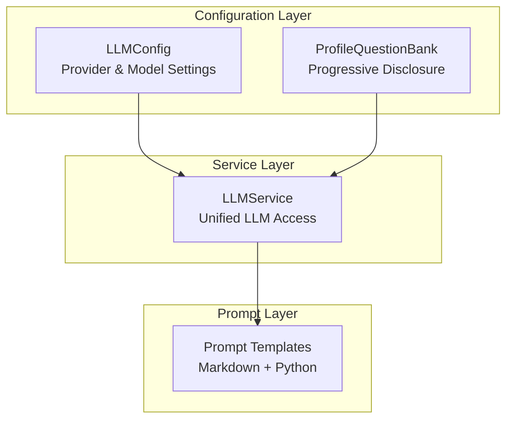
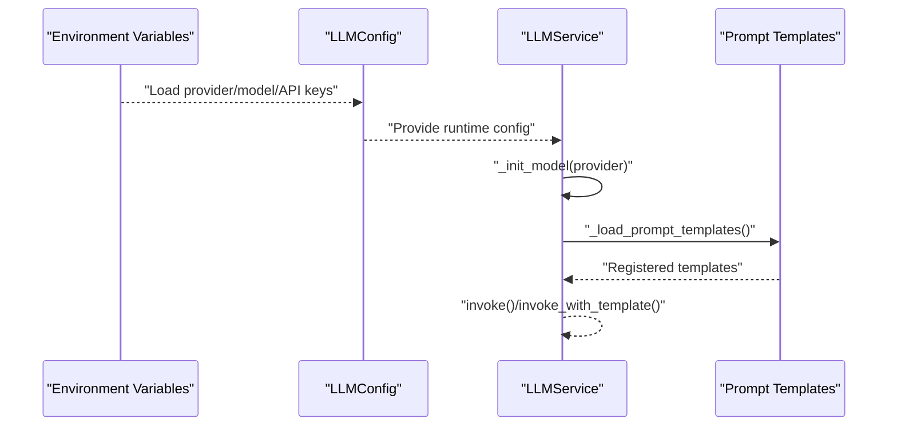
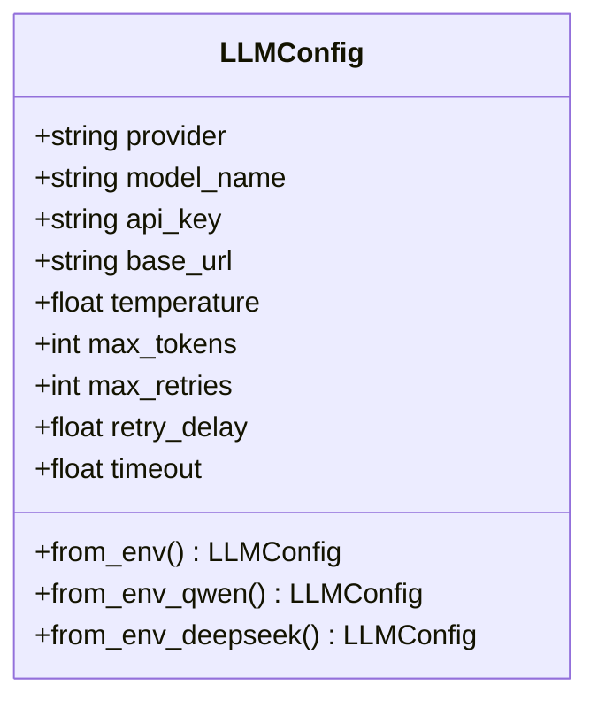
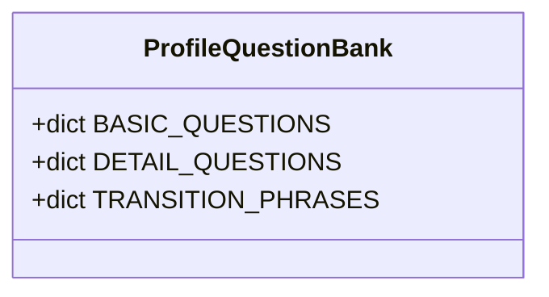
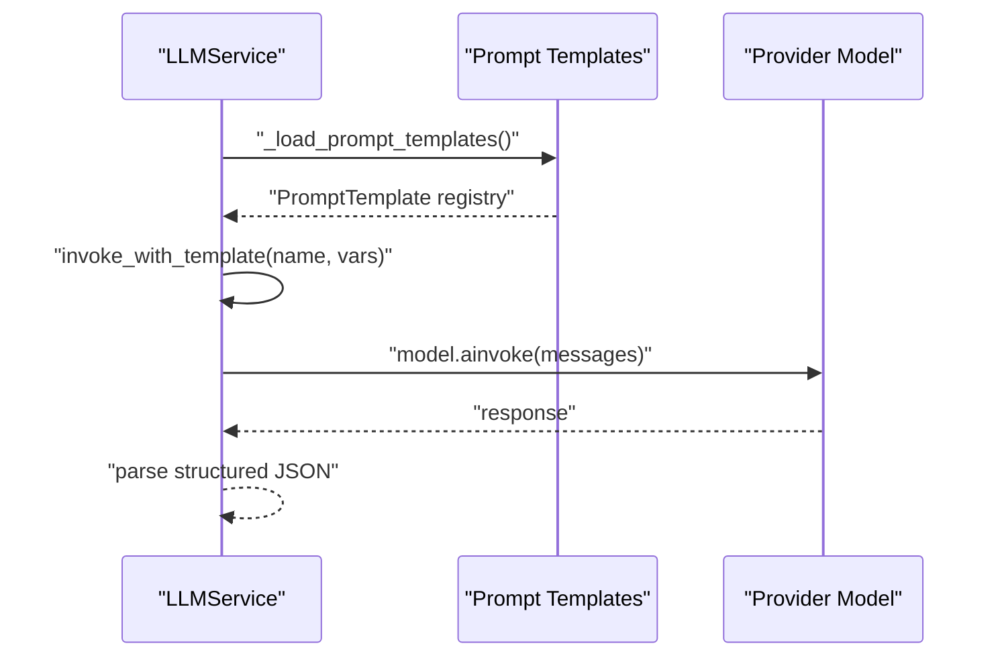
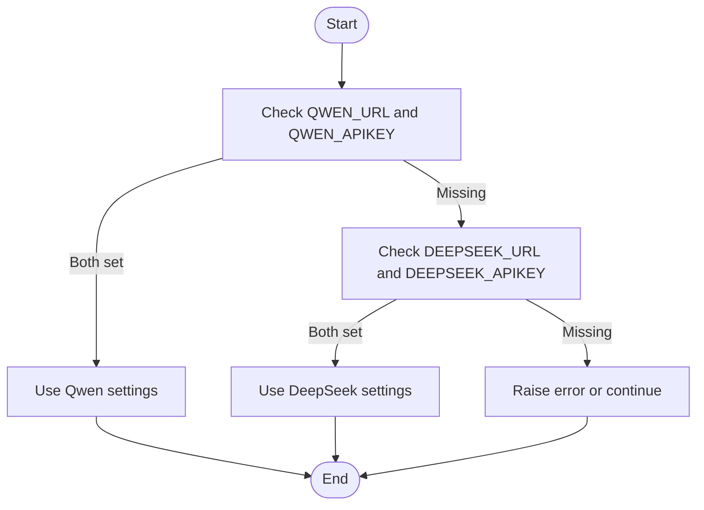
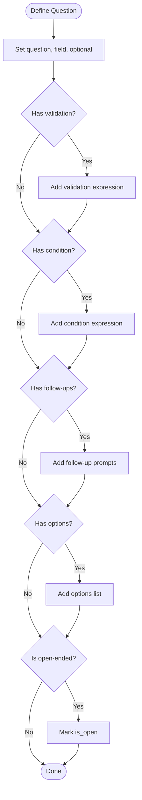
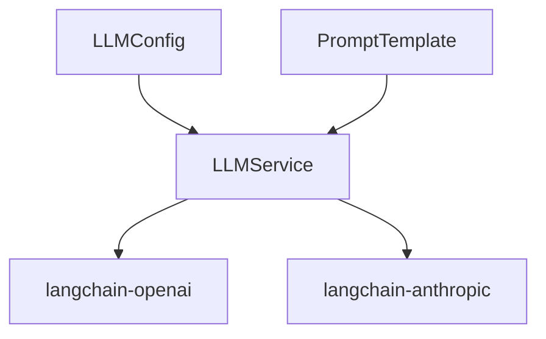

# Configuration

<cite>
**Referenced Files in This Document**
- [llm_config.py](file://src/config/llm_config.py)
- [profile_questions.py](file://src/config/profile_questions.py)
- [__init__.py](file://src/config/__init__.py)
- [llm_service.py](file://src/services/llm_service.py)
- [QuestionGenerator-Prompt.md](file://src/prompts/QuestionGenerator-Prompt.md)
- [ProfileCollection-Prompt.md](file://Prompts/ProfileCollection-Prompt.md)
- [base.py](file://src/prompts/base.py)
- [production-checklist.md](file://langgraph-agent-dev/references/production-checklist.md)
- [requirements.txt](file://requirements.txt)
- [pyproject.toml](file://pyproject.toml)
</cite>

## Table of Contents
1. [Introduction](#introduction)
2. [Project Structure](#project-structure)
3. [Core Components](#core-components)
4. [Architecture Overview](#architecture-overview)
5. [Detailed Component Analysis](#detailed-component-analysis)
6. [Dependency Analysis](#dependency-analysis)
7. [Performance Considerations](#performance-considerations)
8. [Troubleshooting Guide](#troubleshooting-guide)
9. [Conclusion](#conclusion)
10. [Appendices](#appendices)

## Introduction
This document provides comprehensive configuration documentation for system settings, focusing on:
- LLMConfig for provider setup and environment variable management
- ProfileQuestions for questionnaire management including progressive disclosure and cultural considerations
- Implementation details for configuration loading, validation, and runtime usage
- Examples for configuration setup, environment variable usage, and custom question development
- Best practices for configuration management, security considerations for API keys, and troubleshooting
- Deployment-specific configurations and environment-specific settings

## Project Structure
The configuration system is centered around two primary modules:
- LLM configuration: provider selection, model parameters, and environment-driven loading
- Profile questions: structured questionnaire banks with progressive disclosure and optional cultural adaptations

**Diagram sources**
- [llm_config.py:10-120](file://src/config/llm_config.py#L10-L120)
- [profile_questions.py:3-94](file://src/config/profile_questions.py#L3-L94)
- [llm_service.py:32-125](file://src/services/llm_service.py#L32-L125)
- [base.py:6-33](file://src/prompts/base.py#L6-L33)

**Section sources**
- [llm_config.py:10-120](file://src/config/llm_config.py#L10-L120)
- [profile_questions.py:3-94](file://src/config/profile_questions.py#L3-L94)
- [llm_service.py:32-125](file://src/services/llm_service.py#L32-L125)
- [base.py:6-33](file://src/prompts/base.py#L6-L33)

## Core Components
- LLMConfig: Defines provider, model, credentials, base URL, temperature, tokens, retries, and timeouts. Provides environment-driven constructors for Qwen and DeepSeek, with a default fallback.
- ProfileQuestionBank: Encapsulates basic and detailed question sets with optional fields, conditions, validations, and follow-up prompts. Includes transition phrases for smooth progression.

Key capabilities:
- Environment variable loading with explicit precedence for Qwen and DeepSeek
- Structured question metadata enabling progressive disclosure and conditional branching
- Transition phrases to maintain conversational flow

**Section sources**
- [llm_config.py:10-120](file://src/config/llm_config.py#L10-L120)
- [profile_questions.py:3-94](file://src/config/profile_questions.py#L3-L94)

## Architecture Overview
The configuration system integrates with the LLM service and prompt templates to deliver a unified, environment-aware experience.

**Diagram sources**
- [llm_config.py:42-120](file://src/config/llm_config.py#L42-L120)
- [llm_service.py:71-125](file://src/services/llm_service.py#L71-L125)
- [llm_service.py:126-161](file://src/services/llm_service.py#L126-L161)

## Detailed Component Analysis

### LLM Configuration: LLMConfig
LLMConfig centralizes provider and model settings with environment-driven loading and validation.

- Supported providers: openai-compatible (including Qwen), anthropic, and deepseek
- Environment variables:
  - General: LLM_PROVIDER, LLM_MODEL_NAME, LLM_API_KEY, LLM_BASE_URL, LLM_TEMPERATURE, LLM_MAX_TOKENS
  - Qwen: QWEN_URL, QWEN_APIKEY (overrides general settings when present)
  - DeepSeek: DEEPSEEK_URL, DEEPSEEK_APIKEY (overrides general settings when present)
- Constructors:
  - from_env: prioritizes Qwen if both QWEN_URL and QWEN_APIKEY are set; otherwise raises an error
  - from_env_qwen: similar to from_env but defaults to a larger Qwen model
  - from_env_deepseek: uses DeepSeek if both DEEPSEEK_URL and DEEPSEEK_APIKEY are set; otherwise raises an error
  - get_default_config: attempts DeepSeek first, falls back to Qwen

**Diagram sources**
- [llm_config.py:10-120](file://src/config/llm_config.py#L10-L120)

**Section sources**
- [llm_config.py:10-120](file://src/config/llm_config.py#L10-L120)

### Profile Questions: ProfileQuestionBank
ProfileQuestionBank defines a structured questionnaire with progressive disclosure and optional cultural considerations.

- Basic questions: name, age, occupation, birth place, retirement year
- Detail questions: family status, children count, living arrangement, health status, story expectations, important persons, favorite memories
- Features:
  - optional flag per question
  - validation expressions (e.g., age threshold)
  - condition expressions (e.g., children only if married/widowed)
  - follow-ups for deeper exploration
  - open-ended fields for free-form responses
- Transition phrases: to_basic, to_detail, to_ready

**Diagram sources**
- [profile_questions.py:3-94](file://src/config/profile_questions.py#L3-L94)

**Section sources**
- [profile_questions.py:3-94](file://src/config/profile_questions.py#L3-L94)

### Prompt Integration and Usage
LLMService loads prompt templates from both Python modules and Markdown files, enabling dynamic prompt composition.

- Template loading:
  - Python module registry via src.prompts.summary_prompts
  - Markdown files parsed into PromptTemplate instances
- Invocation patterns:
  - invoke: basic prompt with optional system prompt and history
  - invoke_with_template: renders a named template and invokes the model
  - invoke_structured: requests structured JSON output validated against a Pydantic model

**Diagram sources**
- [llm_service.py:126-161](file://src/services/llm_service.py#L126-L161)
- [llm_service.py:293-325](file://src/services/llm_service.py#L293-L325)
- [llm_service.py:327-398](file://src/services/llm_service.py#L327-L398)
- [base.py:6-33](file://src/prompts/base.py#L6-L33)

**Section sources**
- [llm_service.py:126-161](file://src/services/llm_service.py#L126-L161)
- [llm_service.py:293-325](file://src/services/llm_service.py#L293-L325)
- [llm_service.py:327-398](file://src/services/llm_service.py#L327-L398)
- [base.py:6-33](file://src/prompts/base.py#L6-L33)

### Example Workflows

#### LLM Provider Setup and Environment Variables
- Qwen setup:
  - Set QWEN_URL and QWEN_APIKEY; optionally set LLM_MODEL_NAME, LLM_TEMPERATURE, LLM_MAX_TOKENS
  - LLMConfig.from_env or from_env_qwen will use Qwen settings
- DeepSeek setup:
  - Set DEEPSEEK_URL and DEEPSEEK_APIKEY; optionally set DEEPSEEK_MODEL_NAME, LLM_TEMPERATURE, LLM_MAX_TOKENS
  - LLMConfig.from_env_deepseek will use DeepSeek settings
- Default fallback:
  - get_default_config tries DeepSeek first, then falls back to Qwen

**Diagram sources**
- [llm_config.py:42-120](file://src/config/llm_config.py#L42-L120)

**Section sources**
- [llm_config.py:42-120](file://src/config/llm_config.py#L42-L120)

#### Custom Question Development
- Add new questions to BASIC_QUESTIONS or DETAIL_QUESTIONS with:
  - question: the prompt text
  - field: target field name
  - optional: whether the field is required
  - validation: expression for validation (e.g., age thresholds)
  - condition: expression for conditional display (e.g., children only for married/widowed)
  - follow_ups: list of follow-up prompts
  - options: predefined choices for multiple-choice questions
  - is_open: whether the question allows free-form answers

**Diagram sources**
- [profile_questions.py:7-87](file://src/config/profile_questions.py#L7-L87)

**Section sources**
- [profile_questions.py:7-87](file://src/config/profile_questions.py#L7-L87)

## Dependency Analysis
- LLMService depends on LLMConfig for provider/model initialization and on PromptTemplate for prompt composition.
- Prompt templates are loaded from both Python modules and Markdown files.
- External dependencies include LangChain providers for OpenAI-compatible and Anthropic models.

**Diagram sources**
- [llm_service.py:10-14](file://src/services/llm_service.py#L10-L14)
- [llm_service.py:94-121](file://src/services/llm_service.py#L94-L121)
- [requirements.txt:2-9](file://requirements.txt#L2-L9)

**Section sources**
- [llm_service.py:94-121](file://src/services/llm_service.py#L94-L121)
- [requirements.txt:2-9](file://requirements.txt#L2-L9)

## Performance Considerations
- Retry and timeout controls: LLMConfig includes max_retries and timeout to improve resilience under transient failures.
- Token limits: max_tokens helps manage cost and latency by bounding model outputs.
- Provider-specific tuning: Different providers may require distinct base URLs and model names; ensure correct configuration to avoid unnecessary retries.

[No sources needed since this section provides general guidance]

## Troubleshooting Guide
Common configuration issues and resolutions:
- Missing Qwen credentials:
  - Symptom: ValueError indicating missing Qwen URL or API key
  - Resolution: Set QWEN_URL and QWEN_APIKEY; ensure .env is loaded
- Missing DeepSeek credentials:
  - Symptom: ValueError indicating missing DeepSeek URL or API key
  - Resolution: Set DEEPSEEK_URL and DEEPSEEK_APIKEY
- Provider mismatch:
  - Symptom: Unsupported provider error during model initialization
  - Resolution: Use supported providers (openai-compatible/Qwen, anthropic, deepseek)
- Prompt template not found:
  - Symptom: ValueError when invoking a template
  - Resolution: Ensure template name exists in registry or Markdown file; confirm loading paths

**Section sources**
- [llm_config.py:59-60](file://src/config/llm_config.py#L59-L60)
- [llm_config.py:99-100](file://src/config/llm_config.py#L99-L100)
- [llm_service.py:121](file://src/services/llm_service.py#L121)
- [llm_service.py:312-314](file://src/services/llm_service.py#L312-L314)

## Conclusion
The configuration system provides a robust, environment-driven approach to managing LLM providers and questionnaire logic. By leveraging environment variables, structured question banks, and unified prompt templates, the system supports flexible deployments, progressive disclosure, and secure credential handling.

[No sources needed since this section summarizes without analyzing specific files]

## Appendices

### A. Environment Variable Reference
- General LLM settings:
  - LLM_PROVIDER: Provider identifier (e.g., openai, anthropic, qwen)
  - LLM_MODEL_NAME: Model name
  - LLM_API_KEY: API key
  - LLM_BASE_URL: Base URL for provider API
  - LLM_TEMPERATURE: Sampling temperature
  - LLM_MAX_TOKENS: Maximum output tokens
- Qwen-specific:
  - QWEN_URL: Qwen API URL
  - QWEN_APIKEY: Qwen API key
- DeepSeek-specific:
  - DEEPSEEK_URL: DeepSeek API URL
  - DEEPSEEK_APIKEY: DeepSeek API key
  - DEEPSEEK_MODEL_NAME: DeepSeek model name

**Section sources**
- [llm_config.py:14-26](file://src/config/llm_config.py#L14-L26)
- [llm_config.py:23-26](file://src/config/llm_config.py#L23-L26)
- [llm_config.py:84-97](file://src/config/llm_config.py#L84-L97)

### B. Security Best Practices
- Store secrets in environment variables or secure secret managers; never commit to version control
- Use separate API keys per environment (development, staging, production)
- Restrict permissions and rotate keys regularly
- Prefer HTTPS endpoints and validate base URLs

**Section sources**
- [production-checklist.md:340-371](file://langgraph-agent-dev/references/production-checklist.md#L340-L371)

### C. Deployment Notes
- Containerization: Use Docker images with environment variables injected at runtime
- Orchestration: Compose services with proper networking and volume mounts for persistent data
- Observability: Enable logging and metrics for monitoring LLM usage and errors

**Section sources**
- [production-checklist.md:431-482](file://langgraph-agent-dev/references/production-checklist.md#L431-L482)