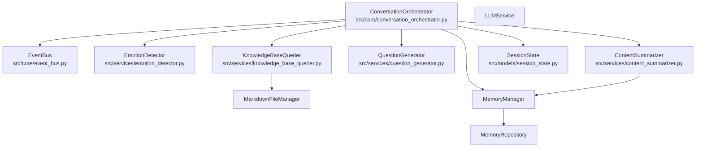
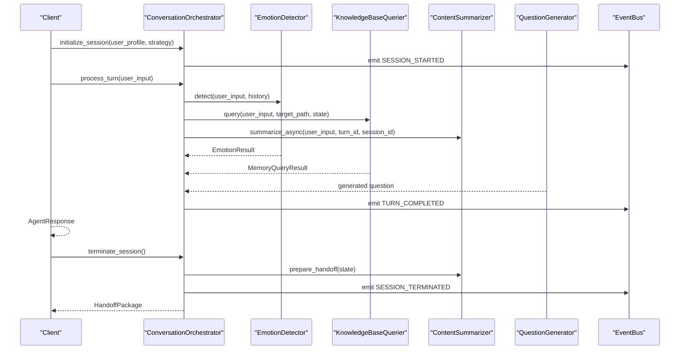
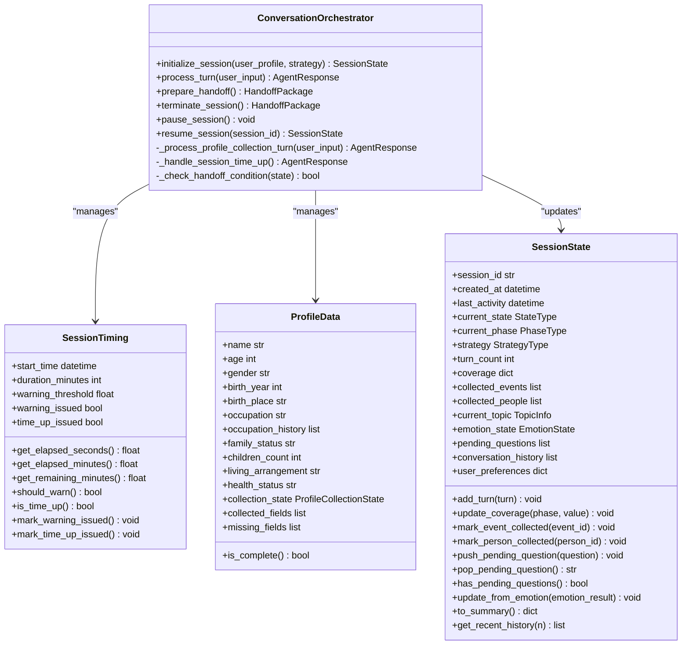
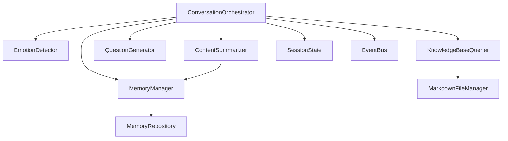
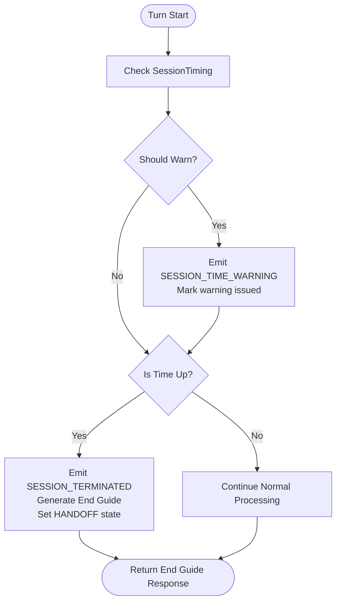

# Conversation Orchestrator

<cite>
**Referenced Files in This Document**
- [conversation_orchestrator.py](file://src/core/conversation_orchestrator.py)
- [event_bus.py](file://src/core/event_bus.py)
- [session_state.py](file://src/models/session_state.py)
- [emotion_result.py](file://src/models/emotion_result.py)
- [memory_query_result.py](file://src/models/memory_query_result.py)
- [conversation_turn.py](file://src/models/conversation_turn.py)
- [state_type.py](file://src/enums/state_type.py)
- [phase_type.py](file://src/enums/phase_type.py)
- [strategy_type.py](file://src/enums/strategy_type.py)
- [emotion_type.py](file://src/enums/emotion_type.py)
- [emotion_detector.py](file://src/services/emotion_detector.py)
- [knowledge_base_querier.py](file://src/services/knowledge_base_querier.py)
- [question_generator.py](file://src/services/question_generator.py)
- [content_summarizer.py](file://src/services/content_summarizer.py)
- [profile_questions.py](file://src/config/profile_questions.py)
- [handoff_package.py](file://src/models/handoff_package.py)
- [summary_content.py](file://src/models/summary_content.py)
</cite>

## Table of Contents
1. [Introduction](#introduction)
2. [Project Structure](#project-structure)
3. [Core Components](#core-components)
4. [Architecture Overview](#architecture-overview)
5. [Detailed Component Analysis](#detailed-component-analysis)
6. [Dependency Analysis](#dependency-analysis)
7. [Performance Considerations](#performance-considerations)
8. [Troubleshooting Guide](#troubleshooting-guide)
9. [Conclusion](#conclusion)
10. [Appendices](#appendices)

## Introduction
This document provides comprehensive documentation for the ConversationOrchestrator component, the central coordinator of the conversation system. It explains how the orchestrator manages session lifecycle, coordinates parallel AI services, maintains state, and implements an event-driven architecture. It also covers initialization, session timing controls, profile collection workflow, time management with warnings and termination, and handoff preparation. Implementation details for SessionTiming, ProfileData, and SessionState management are included, along with concrete examples for session initialization, turn processing, and graceful termination. Configuration options, timeout handling, and error recovery mechanisms are documented.

## Project Structure
The ConversationOrchestrator resides in the core module and integrates tightly with services, models, enums, and configuration. The orchestrator composes multiple specialized services and emits events via the EventBus to coordinate asynchronous workflows.

**Diagram sources**
- [conversation_orchestrator.py:138-401](file://src/core/conversation_orchestrator.py#L138-L401)
- [event_bus.py:40-182](file://src/core/event_bus.py#L40-L182)
- [emotion_detector.py:12-74](file://src/services/emotion_detector.py#L12-L74)
- [knowledge_base_querier.py:202-373](file://src/services/knowledge_base_querier.py#L202-L373)
- [question_generator.py:12-74](file://src/services/question_generator.py#L12-L74)
- [content_summarizer.py:17-93](file://src/services/content_summarizer.py#L17-L93)
- [session_state.py:24-139](file://src/models/session_state.py#L24-L139)

**Section sources**
- [conversation_orchestrator.py:138-401](file://src/core/conversation_orchestrator.py#L138-L401)
- [event_bus.py:40-182](file://src/core/event_bus.py#L40-L182)

## Core Components
- ConversationOrchestrator: Central controller managing session lifecycle, parallel processing of AI services, and state management.
- SessionTiming: Tracks session duration, warning thresholds, and termination checks.
- ProfileData: Holds collected user profile information and collection state.
- SessionState: Core state container for the session, including coverage, turns, and emotion state.
- EventBus: Publish-subscribe mechanism decoupling orchestration from downstream consumers.
- Services: EmotionDetector, KnowledgeBaseQuerier, QuestionGenerator, ContentSummarizer.
- Models: EmotionResult, MemoryQueryResult, ConversationTurn, HandoffPackage, SummaryContent.

**Section sources**
- [conversation_orchestrator.py:29-136](file://src/core/conversation_orchestrator.py#L29-L136)
- [session_state.py:24-139](file://src/models/session_state.py#L24-L139)
- [event_bus.py:40-182](file://src/core/event_bus.py#L40-L182)

## Architecture Overview
The orchestrator initializes services, creates a session with timing and optional profile collection, and during each turn, concurrently invokes emotion detection, knowledge querying, and content summarization. It aggregates results, updates state, and publishes events. At session end, it prepares a handoff package for downstream processing.

**Diagram sources**
- [conversation_orchestrator.py:198-401](file://src/core/conversation_orchestrator.py#L198-L401)
- [emotion_detector.py:39-73](file://src/services/emotion_detector.py#L39-L73)
- [knowledge_base_querier.py:257-373](file://src/services/knowledge_base_querier.py#L257-L373)
- [content_summarizer.py:111-143](file://src/services/content_summarizer.py#L111-L143)
- [question_generator.py:38-74](file://src/services/question_generator.py#L38-L74)
- [event_bus.py:108-171](file://src/core/event_bus.py#L108-L171)

## Detailed Component Analysis

### ConversationOrchestrator
Responsibilities:
- Initialize session with timing and optional profile collection.
- Process turns in parallel: emotion detection, knowledge querying, content summarization.
- Update SessionState and short-term memory.
- Emit events for monitoring and integration.
- Prepare handoff and handle session termination.

Key behaviors:
- Initialization: Creates SessionTiming, optionally starts ProfileData, sets SessionState, emits SESSION_STARTED.
- Turn processing: Starts three concurrent tasks with timeouts, applies emotion-based pausing, generates a question, updates state and memory, checks handoff conditions, emits TURN_COMPLETED.
- Time management: Periodically checks warning threshold and time-up condition; emits SESSION_TIME_WARNING and triggers termination flow.
- Profile collection: Manages state machine across init, basic, detail, and ready stages; emits transitional messages and saves profile upon readiness.
- Handoff: Builds HandoffPackage with session summary, coverage, collected data, and pending questions; emits HANDOFF_READY.

Configuration:
- OrchestratorConfig defines timeouts for emotion detection, knowledge query, and content summarization, plus session duration, warning threshold, and flags for enabling profile collection and time warnings.

Implementation highlights:
- Parallel execution pattern using asyncio tasks and wait_for with timeouts.
- Graceful degradation: falls back to neutral emotion and empty memory results on timeout.
- Event-driven state updates and notifications.

Concrete examples:
- Session initialization: see [initialize_session:198-234](file://src/core/conversation_orchestrator.py#L198-L234).
- Turn processing: see [process_turn:236-343](file://src/core/conversation_orchestrator.py#L236-L343).
- Graceful termination: see [terminate_session:391-401](file://src/core/conversation_orchestrator.py#L391-L401).

**Section sources**
- [conversation_orchestrator.py:138-401](file://src/core/conversation_orchestrator.py#L138-L401)
- [conversation_orchestrator.py:29-43](file://src/core/conversation_orchestrator.py#L29-L43)

#### Class Diagram

**Diagram sources**
- [conversation_orchestrator.py:138-401](file://src/core/conversation_orchestrator.py#L138-L401)
- [session_state.py:24-139](file://src/models/session_state.py#L24-L139)

### SessionTiming
Purpose:
- Track session start time, duration, and warning thresholds.
- Compute elapsed and remaining time.
- Decide whether to warn or terminate based on configured thresholds.

Usage:
- Created during session initialization.
- Checked before each turn to emit warnings and enforce termination.

**Section sources**
- [conversation_orchestrator.py:53-94](file://src/core/conversation_orchestrator.py#L53-L94)

### ProfileData and Profile Collection Workflow
Workflow:
- INIT_PROFILE: Sends welcome message and transitions to COLLECT_BASIC.
- COLLECT_BASIC: Iteratively collects required basic fields until completion, then transitions to COLLECT_DETAIL.
- COLLECT_DETAIL: Iteratively collects detailed fields until completion, then transitions to READY and persists profile.
- READY: Stops profile collection and proceeds to normal conversation.

Configuration:
- ProfileQuestionBank defines question sets and transitions.

**Section sources**
- [conversation_orchestrator.py:45-121](file://src/core/conversation_orchestrator.py#L45-L121)
- [conversation_orchestrator.py:421-551](file://src/core/conversation_orchestrator.py#L421-L551)
- [profile_questions.py:3-94](file://src/config/profile_questions.py#L3-L94)

### SessionState Management
Responsibilities:
- Maintain session identity, timestamps, and state.
- Track progress across life phases with coverage metrics.
- Record conversation history, pending questions, and collected entities.
- Update emotion state and expose summaries for handoff.

**Section sources**
- [session_state.py:24-139](file://src/models/session_state.py#L24-L139)
- [state_type.py:4-12](file://src/enums/state_type.py#L4-L12)
- [phase_type.py:4-10](file://src/enums/phase_type.py#L4-L10)
- [strategy_type.py:4-8](file://src/enums/strategy_type.py#L4-L8)

### Parallel Execution Pattern with asyncio
Pattern:
- Start three concurrent tasks: emotion detection, knowledge query, and content summarization.
- Apply timeouts per service using asyncio.wait_for.
- On timeout, fall back to safe defaults (neutral emotion, empty memory).
- Proceed with question generation and state updates.

Benefits:
- Improved responsiveness under load.
- Controlled failure modes with timeouts.

**Section sources**
- [conversation_orchestrator.py:269-302](file://src/core/conversation_orchestrator.py#L269-L302)

### Event-Driven Architecture
EventBus supports:
- Publishing synchronous and asynchronous handlers.
- Emit-and-wait capability for ordered processing.
- Rich event types covering turns, state changes, memory updates, emotions, handoffs, and session lifecycle.

Integration:
- Orchestrator emits SESSION_STARTED, TURN_COMPLETED, SESSION_TIME_WARNING, HANDOFF_READY, SESSION_TERMINATED.
- Handlers can react to these events for monitoring, logging, or triggering downstream actions.

**Section sources**
- [event_bus.py:40-182](file://src/core/event_bus.py#L40-L182)
- [conversation_orchestrator.py:227-258](file://src/core/conversation_orchestrator.py#L227-L258)
- [conversation_orchestrator.py:332-335](file://src/core/conversation_orchestrator.py#L332-L335)
- [conversation_orchestrator.py:387-388](file://src/core/conversation_orchestrator.py#L387-L388)
- [conversation_orchestrator.py:574-577](file://src/core/conversation_orchestrator.py#L574-L577)

### Handoff Preparation
Process:
- Triggered by termination or handoff conditions.
- Calls ContentSummarizer.prepare_handoff to aggregate collected data.
- Constructs HandoffPackage with session summary, coverage, collected data, and pending questions.
- Emits HANDOFF_READY for downstream consumption.

**Section sources**
- [conversation_orchestrator.py:353-389](file://src/core/conversation_orchestrator.py#L353-L389)
- [content_summarizer.py:111-143](file://src/services/content_summarizer.py#L111-L143)
- [handoff_package.py:32-66](file://src/models/handoff_package.py#L32-L66)
- [summary_content.py:37-67](file://src/models/summary_content.py#L37-L67)

### Time Management, Warnings, and Termination
Mechanics:
- SessionTiming computes elapsed minutes and remaining minutes.
- Warning issued once when elapsed ratio reaches threshold; marked to avoid duplicates.
- Time-up triggers immediate termination flow, emitting SESSION_TERMINATED and returning an end-guide response.

**Section sources**
- [conversation_orchestrator.py:53-94](file://src/core/conversation_orchestrator.py#L53-L94)
- [conversation_orchestrator.py:246-258](file://src/core/conversation_orchestrator.py#L246-L258)
- [conversation_orchestrator.py:570-592](file://src/core/conversation_orchestrator.py#L570-L592)

### Concrete Examples

#### Example 1: Session Initialization
- Initialize orchestrator with LLM configuration and optional memory base path.
- Call initialize_session with user profile and strategy.
- Observe SESSION_STARTED event emission.

Reference:
- [initialize_session:198-234](file://src/core/conversation_orchestrator.py#L198-L234)

#### Example 2: Turn Processing
- Call process_turn with user input.
- Observe parallel tasks for emotion detection, knowledge query, and summarization.
- Receive AgentResponse with message, state update, pause flags, and handoff trigger.

Reference:
- [process_turn:236-343](file://src/core/conversation_orchestrator.py#L236-L343)

#### Example 3: Graceful Session Termination
- Call terminate_session to prepare handoff.
- Observe SESSION_TERMINATED event emission.
- Receive HandoffPackage containing session summary and collected data.

Reference:
- [terminate_session:391-401](file://src/core/conversation_orchestrator.py#L391-L401)
- [prepare_handoff:353-389](file://src/core/conversation_orchestrator.py#L353-L389)

## Dependency Analysis
The orchestrator depends on:
- Services: EmotionDetector, KnowledgeBaseQuerier, QuestionGenerator, ContentSummarizer.
- Storage: MarkdownFileManager, MemoryRepository, MemoryManager.
- Models: SessionState, EmotionResult, MemoryQueryResult, ConversationTurn, HandoffPackage, SummaryContent.
- Enums: StateType, PhaseType, StrategyType, EmotionType.
- EventBus for decoupled communication.

**Diagram sources**
- [conversation_orchestrator.py:163-187](file://src/core/conversation_orchestrator.py#L163-L187)
- [emotion_detector.py:12-38](file://src/services/emotion_detector.py#L12-L38)
- [knowledge_base_querier.py:202-235](file://src/services/knowledge_base_querier.py#L202-L235)
- [question_generator.py:12-36](file://src/services/question_generator.py#L12-L36)
- [content_summarizer.py:17-42](file://src/services/content_summarizer.py#L17-L42)

**Section sources**
- [conversation_orchestrator.py:163-187](file://src/core/conversation_orchestrator.py#L163-L187)

## Performance Considerations
- Asynchronous parallelism reduces latency by overlapping independent operations.
- Timeout-based fallback prevents stalls; neutral defaults ensure continuity.
- Memory updates are applied asynchronously to avoid blocking the main turn loop.
- Consider tuning OrchestratorConfig timeouts and session duration based on deployment SLAs and LLM latency characteristics.

## Troubleshooting Guide
Common issues and resolutions:
- Emotion detection timeout: Falls back to neutral emotion; check LLM availability and prompt stability.
- Knowledge query timeout: Returns empty memory result; verify target_path validity and file manager permissions.
- Session time-up: Terminates early with end-guide; adjust session_duration_minutes and time_warning_threshold.
- Handoff not triggered: Verify handoff conditions (turn count and coverage thresholds).
- Profile collection stuck: Ensure ProfileQuestionBank questions are properly defined and next-field resolution works.

Operational tips:
- Subscribe to EventBus events for monitoring and alerting.
- Log warnings and errors emitted by services and orchestrator.
- Validate SessionState coverage and collected entities after each turn.

**Section sources**
- [conversation_orchestrator.py:287-301](file://src/core/conversation_orchestrator.py#L287-L301)
- [conversation_orchestrator.py:570-592](file://src/core/conversation_orchestrator.py#L570-L592)
- [event_bus.py:108-171](file://src/core/event_bus.py#L108-L171)

## Conclusion
The ConversationOrchestrator is the central nervous system of the conversation system. It orchestrates parallel AI services, enforces time budgets, manages state transitions, and emits rich events for observability. Its design balances responsiveness, reliability, and extensibility, making it suitable for interactive, long-form interviews with structured handoffs to downstream systems.

## Appendices

### Configuration Options
- OrchestratorConfig:
  - emotion_timeout: Detection timeout.
  - query_timeout: Knowledge query timeout.
  - summary_timeout: Content summarization timeout.
  - handoff_turn_threshold: Threshold for turn-based handoff.
  - pause_inactivity_minutes: Inactivity pause threshold.
  - session_duration_minutes: Maximum session duration.
  - time_warning_threshold: Fraction of duration to warn in advance.
  - time_warning_enabled: Enable/disable time warnings.
  - profile_collection_enabled: Enable/disable initial profile collection.

**Section sources**
- [conversation_orchestrator.py:29-43](file://src/core/conversation_orchestrator.py#L29-L43)

### Time Management Flow

**Diagram sources**
- [conversation_orchestrator.py:246-258](file://src/core/conversation_orchestrator.py#L246-L258)
- [conversation_orchestrator.py:570-592](file://src/core/conversation_orchestrator.py#L570-L592)