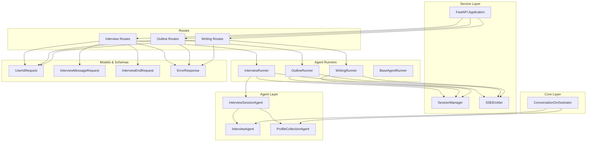
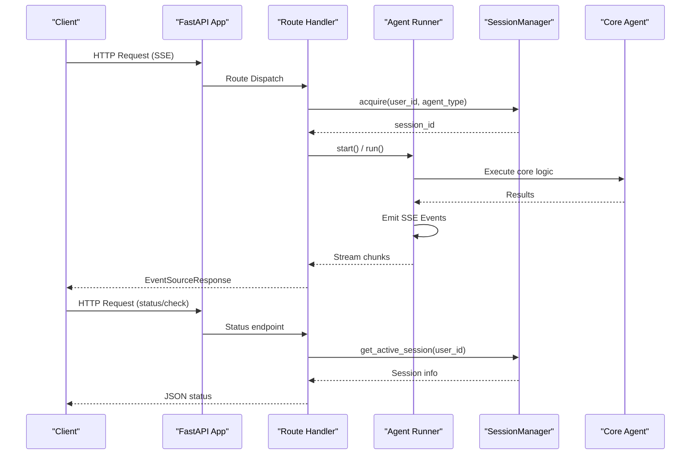
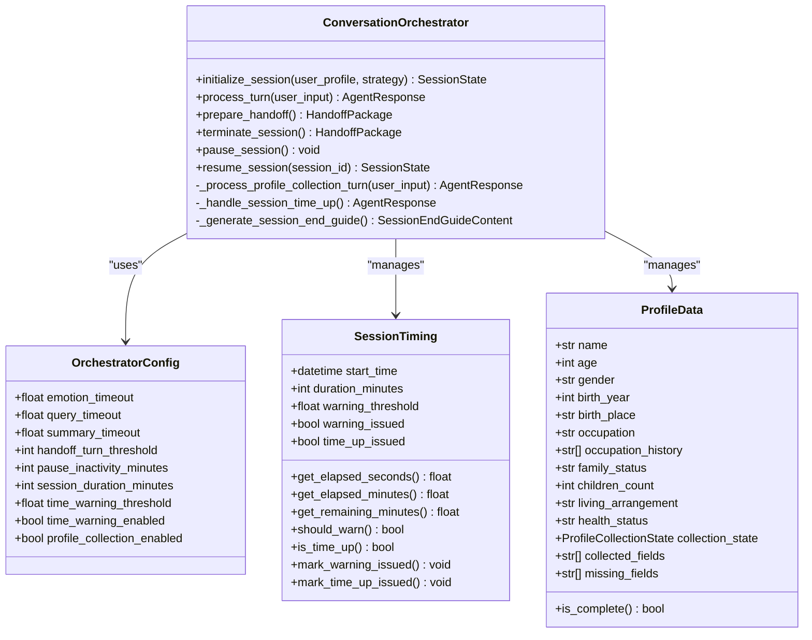
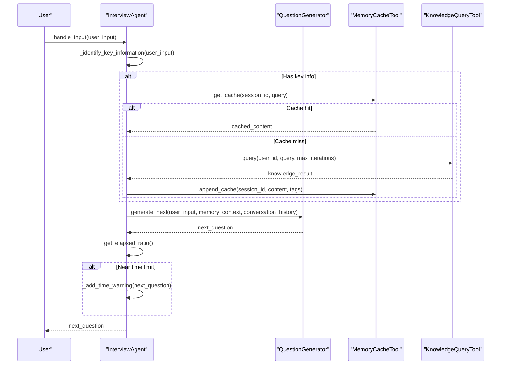
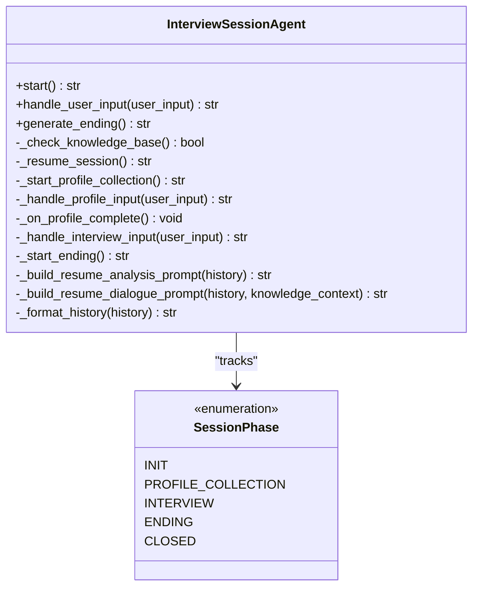
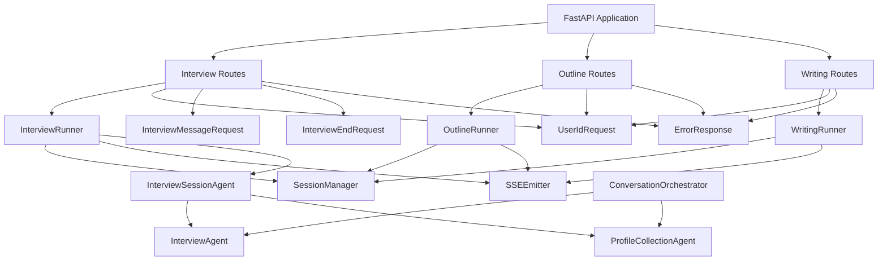

# Core Components

<cite>
**Referenced Files in This Document**
- [conversation_orchestrator.py](file://src/core/conversation_orchestrator.py)
- [interview_agent.py](file://src/agents/interview_agent.py)
- [profile_collection_agent.py](file://src/agents/profile_collection_agent.py)
- [interview_session_agent.py](file://src/agents/interview_session_agent.py)
- [session_state.py](file://src/models/session_state.py)
- [agent_response.py](file://src/models/agent_response.py)
- [llm_config.py](file://src/config/llm_config.py)
- [profile_questions.py](file://src/config/profile_questions.py)
- [state_type.py](file://src/enums/state_type.py)
- [phase_type.py](file://src/enums/phase_type.py)
- [question_generator.py](file://src/services/question_generator.py)
- [memory_cache_tool.py](file://src/tools/memory_cache_tool.py)
- [knowledge_query_tool.py](file://src/tools/knowledge_query_tool.py)
- [memory_archive_tool.py](file://src/tools/memory_archive_tool.py)
- [app.py](file://src/service/app.py)
- [session_manager.py](file://src/service/session_manager.py)
- [sse_response.py](file://src/service/sse_response.py)
- [interview_runner.py](file://src/service/agent_runners/interview_runner.py)
- [outline_runner.py](file://src/service/agent_runners/outline_runner.py)
- [writing_runner.py](file://src/service/agent_runners/writing_runner.py)
- [interview.py](file://src/service/routes/interview.py)
- [biography_outline.py](file://src/service/routes/biography_outline.py)
- [biography_writing.py](file://src/service/routes/biography_writing.py)
- [requests.py](file://src/service/schemas/requests.py)
</cite>

## Update Summary
**Changes Made**
- Added comprehensive service layer documentation covering FastAPI integration and HTTP-based API exposure
- Documented new agent runners architecture with SSE streaming support
- Added SessionManager singleton pattern for concurrent session management
- Updated architecture overview to reflect service-oriented design
- Added HTTP API endpoints and request/response schemas
- Documented real-time streaming capabilities through SSEEmitter

## Table of Contents
1. [Introduction](#introduction)
2. [Project Structure](#project-structure)
3. [Core Components](#core-components)
4. [Architecture Overview](#architecture-overview)
5. [Service Layer Architecture](#service-layer-architecture)
6. [Detailed Component Analysis](#detailed-component-analysis)
7. [HTTP API Endpoints](#http-api-endpoints)
8. [Dependency Analysis](#dependency-analysis)
9. [Performance Considerations](#performance-considerations)
10. [Troubleshooting Guide](#troubleshooting-guide)
11. [Conclusion](#conclusion)

## Introduction
This document provides comprehensive documentation for the core agent system components that power the elderly autobiography writing assistant. The system has evolved from a monolithic architecture to a service-oriented architecture with comprehensive HTTP API exposure and real-time streaming capabilities.

The core system now consists of four primary components:
- ConversationOrchestrator: Central coordinator managing session lifecycle and parallel processing
- InterviewAgent: Time-constrained conversation manager with adaptive questioning and state transitions
- ProfileCollectionAgent: Initial user onboarding and information gathering
- InterviewSessionAgent: Complete session lifecycle management including user coordination and session handoff

**Updated** Added service layer architecture with FastAPI integration, agent runners for SSE streaming, and comprehensive HTTP API endpoints.

## Project Structure
The system is now organized around a layered service-oriented architecture:
- Core orchestration layer: ConversationOrchestrator coordinates services and agents
- Agent layer: InterviewAgent, ProfileCollectionAgent, InterviewSessionAgent encapsulate conversation flows
- Service layer: FastAPI application with HTTP endpoints and SSE streaming
- Agent runners: InterviewRunner, OutlineRunner, WritingRunner for service orchestration
- Session management: SessionManager singleton for concurrent session control
- Routes: HTTP endpoints for interview, biography outline, and biography writing services
- Models and configuration: Enhanced with Pydantic request/response schemas



**Diagram sources**
- [app.py:22-59](file://src/service/app.py#L22-L59)
- [session_manager.py:45-157](file://src/service/session_manager.py#L45-L157)
- [sse_response.py:23-69](file://src/service/sse_response.py#L23-L69)
- [interview_runner.py:8-94](file://src/service/agent_runners/interview_runner.py#L8-L94)
- [outline_runner.py:13-108](file://src/service/agent_runners/outline_runner.py#L13-L108)
- [writing_runner.py:14-122](file://src/service/agent_runners/writing_runner.py#L14-L122)
- [interview.py:12-116](file://src/service/routes/interview.py#L12-116)
- [biography_outline.py:15-133](file://src/service/routes/biography_outline.py#L15-133)
- [biography_writing.py:16-136](file://src/service/routes/biography_writing.py#L16-136)
- [requests.py:8-69](file://src/service/schemas/requests.py#L8-69)

**Section sources**
- [app.py:1-59](file://src/service/app.py#L1-L59)
- [session_manager.py:1-157](file://src/service/session_manager.py#L1-L157)
- [sse_response.py:1-69](file://src/service/sse_response.py#L1-L69)
- [interview_runner.py:1-94](file://src/service/agent_runners/interview_runner.py#L1-L94)
- [outline_runner.py:1-108](file://src/service/agent_runners/outline_runner.py#L1-L108)
- [writing_runner.py:1-122](file://src/service/agent_runners/writing_runner.py#L1-L122)

## Core Components
This section introduces the four core components and their primary responsibilities, now integrated within the service-oriented architecture.

- ConversationOrchestrator: Central coordinator that manages session lifecycle, parallel processing of emotion detection, knowledge querying, and content summarization, while handling time controls, profile collection, and handoff preparation.
- InterviewAgent: Time-constrained interview agent that drives conversation flow, identifies key information, queries knowledge base, updates cache, generates adaptive questions, and handles time warnings.
- ProfileCollectionAgent: Onboarding agent responsible for collecting essential user information through progressive questioning and generating a basic knowledge base.
- InterviewSessionAgent: Session lifecycle manager that orchestrates between initialization and interview phases, coordinates tools, and manages session handoff.

**Updated** Enhanced with service layer integration and HTTP API exposure capabilities.

Key configuration and models:
- LLMConfig: Centralized LLM configuration with provider selection and environment-based loading.
- ProfileQuestionBank: Structured question sets for profile collection with transitions and validation rules.
- SessionState: Comprehensive session state model tracking progress, coverage, collected items, and conversation history.
- AgentResponse: Standardized response model for agent outputs.
- SessionManager: Singleton for managing concurrent sessions per user with thread-safety guarantees.
- SSEEmitter: Unified SSE streaming response abstraction for real-time communication.

**Section sources**
- [conversation_orchestrator.py:138-401](file://src/core/conversation_orchestrator.py#L138-L401)
- [interview_agent.py:16-184](file://src/agents/interview_agent.py#L16-L184)
- [profile_collection_agent.py:14-166](file://src/agents/profile_collection_agent.py#L14-L166)
- [interview_session_agent.py:33-111](file://src/agents/interview_session_agent.py#L33-L111)
- [session_manager.py:45-157](file://src/service/session_manager.py#L45-L157)
- [sse_response.py:23-69](file://src/service/sse_response.py#L23-L69)

## Architecture Overview
The system now follows a comprehensive service-oriented architecture pattern with HTTP API exposure and real-time streaming:

- FastAPI Application: Central HTTP server with CORS middleware and route registration
- SessionManager: Singleton that enforces mutual exclusivity and manages concurrent sessions
- Agent Runners: Specialized runners that wrap core agents with SSE streaming capabilities
- SSEEmitter: Unified streaming response system for real-time event emission
- Route Handlers: HTTP endpoints that coordinate between API requests and agent execution
- Core Agents: Underlying conversation and content generation agents



**Diagram sources**
- [app.py:22-59](file://src/service/app.py#L22-L59)
- [interview_runner.py:16-94](file://src/service/agent_runners/interview_runner.py#L16-L94)
- [session_manager.py:87-117](file://src/service/session_manager.py#L87-L117)
- [interview.py:15-116](file://src/service/routes/interview.py#L15-L116)

## Service Layer Architecture
The service layer provides HTTP-based API exposure for all agent functionalities with comprehensive streaming support:

### FastAPI Application Factory
The application creates a FastAPI instance with:
- CORS middleware for cross-origin requests
- Route registration for all agent services
- Application lifespan for service initialization
- Health check endpoint for monitoring

### Session Management
SessionManager implements a thread-safe singleton pattern:
- Enforces mutual exclusivity: only one agent active per user
- Supports interview session persistence across multiple messages
- Provides session acquisition, release, and status tracking
- Handles session conflict resolution with detailed error reporting

### SSE Streaming System
SSEEmitter provides unified streaming capabilities:
- Async queue-based event emission
- Automatic timestamp injection
- Error event handling with recoverable flags
- Done event signaling for stream termination
- Integration with FastAPI EventSourceResponse

**Section sources**
- [app.py:8-59](file://src/service/app.py#L8-L59)
- [session_manager.py:45-157](file://src/service/session_manager.py#L45-L157)
- [sse_response.py:23-69](file://src/service/sse_response.py#L23-L69)

## Detailed Component Analysis

### ConversationOrchestrator
Central coordinator managing session lifecycle and parallel processing.

Public interface:
- initialize_session(user_profile, strategy): Initializes session timing, optional profile collection, and emits session started events.
- process_turn(user_input): Handles a single conversation turn with parallel processing and returns AgentResponse.
- prepare_handoff(): Prepares handoff package with collected data and session summary.
- terminate_session(): Terminates session and returns handoff package.
- pause_session()/resume_session(session_id): Controls session pause/resume.

Key behaviors:
- Parallel processing: Emotion detection, knowledge querying, and content summarization run concurrently with timeouts.
- Time management: SessionTiming tracks elapsed time, issues warnings, and triggers termination.
- Profile collection: ProfileCollectionState manages initialization, basic info collection, detail collection, and readiness.
- Handoff: prepare_handoff aggregates collected data and builds HandoffPackage.

Configuration:
- OrchestratorConfig: Controls timeouts, handoff thresholds, session duration, time warning threshold, and profile collection enablement.

Error handling:
- Timeout protection for emotion detection and knowledge querying with fallback neutral results.
- Graceful handling of session time-up with end guide generation and handoff trigger.



**Diagram sources**
- [conversation_orchestrator.py:29-197](file://src/core/conversation_orchestrator.py#L29-L197)

**Section sources**
- [conversation_orchestrator.py:138-401](file://src/core/conversation_orchestrator.py#L138-L401)
- [session_state.py:24-139](file://src/models/session_state.py#L24-L139)
- [agent_response.py:5-22](file://src/models/agent_response.py#L5-L22)

### InterviewAgent
Time-constrained conversation manager with adaptive questioning and state transitions.

Public interface:
- start(): Generates opening message using resume prompt or standard template.
- handle_input(user_input): Processes user input, identifies key information, queries knowledge base, updates cache, generates next question, and checks time limits.
- generate_ending(): Creates end-of-session guidance using a prompt template.

Core logic:
- Time control: Tracks elapsed time, warns near threshold, and marks completion upon reaching limit.
- Key information identification: Uses LLM to extract events, persons, time points, locations, and tags.
- Knowledge integration: Checks cache, queries knowledge base if needed, and updates cache.
- Adaptive questioning: Uses QuestionGenerator to produce context-aware questions.



**Diagram sources**
- [interview_agent.py:115-184](file://src/agents/interview_agent.py#L115-L184)
- [question_generator.py:207-253](file://src/services/question_generator.py#L207-L253)
- [memory_cache_tool.py:34-84](file://src/tools/memory_cache_tool.py#L34-L84)
- [knowledge_query_tool.py:33-66](file://src/tools/knowledge_query_tool.py#L33-L66)

**Section sources**
- [interview_agent.py:16-184](file://src/agents/interview_agent.py#L16-L184)
- [question_generator.py:12-253](file://src/services/question_generator.py#L12-L253)
- [memory_cache_tool.py:8-89](file://src/tools/memory_cache_tool.py#L8-L89)
- [knowledge_query_tool.py:11-81](file://src/tools/knowledge_query_tool.py#L11-L81)

### ProfileCollectionAgent
Initial user onboarding and information gathering.

Public interface:
- start(): Generates welcome message using profile collection prompt.
- handle_input(user_input): Records input, extracts structured information, checks completion criteria, and generates next question.
- get_conversation_history(): Returns full conversation record.

Completion logic:
- Required fields: name, age, occupation, family_status, living_arrangement, story_expectation.
- Time limit: Max duration minutes for initialization.
- Information extraction: Uses structured JSON extraction to populate collected_info.

```mermaid
flowchart TD
Start(["Start"]) --> LoadPrompt["Load Profile Collection Prompt"]
LoadPrompt --> GenerateWelcome["Generate Welcome Message"]
GenerateWelcome --> RecordAssistant["Record Assistant Turn"]
loop For each user input
UserInput["User Input"] --> RecordUser["Record User Turn"]
RecordUser --> ExtractInfo["Extract Structured Info (JSON)"]
ExtractInfo --> UpdateCollected["Update collected_info"]
UpdateCollected --> CheckComplete{"Required Fields Complete<br/>OR Time Exceeded?"}
CheckComplete --> |Yes| MarkCompleted["Set is_completed = True"]
CheckComplete --> |No| GenerateNext["Generate Next Question"]
GenerateNext --> RecordAssistant2["Record Assistant Turn"]
end
MarkCompleted --> End(["End"])
RecordAssistant2 --> End
```

**Diagram sources**
- [profile_collection_agent.py:98-166](file://src/agents/profile_collection_agent.py#L98-L166)

**Section sources**
- [profile_collection_agent.py:14-166](file://src/agents/profile_collection_agent.py#L14-L166)
- [profile_questions.py:3-94](file://src/config/profile_questions.py#L3-L94)

### InterviewSessionAgent
Complete session lifecycle management including user coordination and session handoff.

Public interface:
- start(): Determines whether to resume existing session or start profile collection.
- handle_user_input(user_input): Delegates to appropriate phase agent.
- generate_ending(): Generates end-of-session guidance and archives conversation.

Lifecycle phases:
- INIT: Initialize session timing and determine knowledge base existence.
- PROFILE_COLLECTION: Run ProfileCollectionAgent until completion or timeout.
- INTERVIEW: Run InterviewAgent with time controls and knowledge integration.
- ENDING: Generate ending message and archive conversation.
- CLOSED: Final closed state.



**Diagram sources**
- [interview_session_agent.py:33-111](file://src/agents/interview_session_agent.py#L33-L111)

**Section sources**
- [interview_session_agent.py:33-392](file://src/agents/interview_session_agent.py#L33-L392)

### InterviewRunner
**New** Agent runner that wraps InterviewSessionAgent for HTTP/SSE streaming.

Public interface:
- start(): Starts new interview session, stores agent instance, and emits session events.
- handle_message(message): Processes user messages, tracks phase changes, and streams responses.
- end(): Ends session and returns JSON summary.

Key behaviors:
- Session persistence: Stores InterviewSessionAgent instances in SessionManager for multi-message conversations.
- Phase tracking: Monitors and emits phase change events during conversation flow.
- Error handling: Emits structured error events with recoverable flags.
- SSE streaming: Uses SSEEmitter for real-time event emission.

**Section sources**
- [interview_runner.py:8-94](file://src/service/agent_runners/interview_runner.py#L8-L94)

### OutlineRunner
**New** Biography outline agent runner with comprehensive SSE progress events.

Public interface:
- run(): Executes outline generation with detailed progress streaming.

Progress events:
- task_started: Initial task notification with mode information
- scanning: Material scanning progress with step indicators
- analyzing: Analysis completion notification
- generating: Generation progress with chapter counts
- completed: Final completion with outline data and changes
- failed: Error handling with detailed error information

**Section sources**
- [outline_runner.py:13-108](file://src/service/agent_runners/outline_runner.py#L13-L108)

### WritingRunner
**New** Biography writing agent runner with chapter-by-chapter streaming.

Public interface:
- run(): Executes writing process with detailed progress streaming.

Progress events:
- task_started: Initial task notification with chapter count
- loading_tasks: Task loading progress with chapter IDs
- saved: Individual chapter completion with progress tracking
- merging: Final merging stage notification
- completed: Completion with word count and file paths
- failed: Error handling with detailed error information

**Section sources**
- [writing_runner.py:14-122](file://src/service/agent_runners/writing_runner.py#L14-L122)

## HTTP API Endpoints
**New** Comprehensive HTTP API endpoints for all agent services with SSE streaming support.

### Interview Service Endpoints
- POST `/api/interview/start`: Start new interview session with SSE streaming
- POST `/api/interview/message`: Send message in active interview session
- POST `/api/interview/end`: End interview session with JSON summary
- GET `/api/interview/status/{user_id}/{session_id}`: Get session status

### Biography Outline Service Endpoints
- POST `/api/biography/outline/generate`: Generate/update outline with SSE streaming
- GET `/api/biography/outline/{user_id}`: Get current saved outline
- PUT `/api/biography/outline/{user_id}/chapters/{chapter_id}/confirm`: Confirm draft chapter

### Biography Writing Service Endpoints
- POST `/api/biography/writing/run`: Start writing task with SSE streaming
- GET `/api/biography/writing/{user_id}/chapters`: List written chapters
- GET `/api/biography/writing/{user_id}/full`: Get merged full biography

**Section sources**
- [interview.py:15-116](file://src/service/routes/interview.py#L15-L116)
- [biography_outline.py:33-133](file://src/service/routes/biography_outline.py#L33-L133)
- [biography_writing.py:34-136](file://src/service/routes/biography_writing.py#L34-L136)

## Dependency Analysis
This section maps the dependencies between components and highlights coupling and cohesion in the service-oriented architecture.



**Diagram sources**
- [app.py:40-51](file://src/service/app.py#L40-L51)
- [interview_runner.py:11-24](file://src/service/agent_runners/interview_runner.py#L11-L24)
- [session_manager.py:14-29](file://src/service/session_manager.py#L14-L29)
- [interview.py:15-39](file://src/service/routes/interview.py#L15-L39)
- [biography_outline.py:34-61](file://src/service/routes/biography_outline.py#L34-L61)
- [biography_writing.py:35-62](file://src/service/routes/biography_writing.py#L35-L62)

**Section sources**
- [app.py:1-59](file://src/service/app.py#L1-L59)
- [session_manager.py:1-157](file://src/service/session_manager.py#L1-L157)
- [interview_runner.py:1-94](file://src/service/agent_runners/interview_runner.py#L1-L94)
- [outline_runner.py:1-108](file://src/service/agent_runners/outline_runner.py#L1-L108)
- [writing_runner.py:1-122](file://src/service/agent_runners/writing_runner.py#L1-L122)

## Performance Considerations
- Parallel processing: ConversationOrchestrator runs emotion detection, knowledge querying, and content summarization concurrently with timeout protection to prevent blocking.
- Time management: InterviewAgent and InterviewSessionAgent enforce strict time limits with early warnings to improve user experience.
- Caching: MemoryCacheTool reduces repeated knowledge base queries by storing relevant context with tag-based retrieval.
- Asynchronous operations: InterviewAgent uses async/await for I/O-bound operations to maximize throughput.
- Configuration tuning: LLMConfig allows adjusting provider, model, temperature, and token limits to balance quality and cost.
- **New** Concurrent session management: SessionManager provides thread-safe session handling with asyncio.Lock for high-concurrency scenarios.
- **New** SSE streaming efficiency: SSEEmitter uses async queues for non-blocking event emission during long-running operations.
- **New** HTTP API optimization: FastAPI application uses efficient routing and middleware for low-latency request handling.

## Troubleshooting Guide
Common issues and resolutions:
- Timeout errors: ConversationOrchestrator applies timeouts to emotion detection and knowledge querying; when exceeded, it falls back to neutral results and logs warnings.
- Session time-up: When session duration is reached, ConversationOrchestrator triggers time-up handling and prepares an end guide with handoff.
- Knowledge base queries: InterviewAgent and InterviewSessionAgent rely on KnowledgeQueryTool; ensure target_path includes user_id and that required directories exist.
- Initialization failures: ProfileCollectionAgent completes when required fields are collected or when time limit is exceeded; verify prompt templates and extraction logic.
- **New** Session conflicts: SessionManager raises SessionConflictError when users attempt to start conflicting agent types; check active session status before acquiring new sessions.
- **New** SSE streaming issues: Verify SSEEmitter queue operations and ensure proper event formatting; check for closed streams that prevent further emissions.
- **New** HTTP API validation: Pydantic request schemas validate user_id format and message content; ensure requests meet validation requirements.
- **New** Agent runner errors: InterviewRunner, OutlineRunner, and WritingRunner emit structured error events with recoverable flags for better client-side error handling.

**Section sources**
- [conversation_orchestrator.py:286-301](file://src/core/conversation_orchestrator.py#L286-L301)
- [interview_agent.py:170-184](file://src/agents/interview_agent.py#L170-L184)
- [interview_session_agent.py:344-358](file://src/agents/interview_session_agent.py#L344-L358)
- [session_manager.py:34-43](file://src/service/session_manager.py#L34-L43)
- [sse_response.py:48-54](file://src/service/sse_response.py#L48-L54)
- [interview_runner.py:47-50](file://src/service/agent_runners/interview_runner.py#L47-L50)

## Conclusion
The core agent system has successfully evolved from a monolithic architecture to a comprehensive service-oriented architecture with HTTP API exposure and real-time streaming capabilities. The new architecture provides:

- **Service Layer Integration**: FastAPI application with comprehensive route handlers for all agent services
- **Real-time Streaming**: SSEEmitter enables real-time event emission for long-running operations
- **Concurrent Session Management**: SessionManager singleton ensures thread-safe, mutually exclusive session handling
- **HTTP API Exposure**: Complete RESTful API with SSE streaming for interview, outline generation, and writing services
- **Enhanced Error Handling**: Structured error events with recoverable flags for better client-side handling
- **Scalable Architecture**: Modular design supports future expansion and maintenance

The system maintains its core functionality while adding robust service layer capabilities that enable external clients to interact with the agent system through standardized HTTP APIs with real-time streaming support. This transformation provides a solid foundation for deployment in production environments while preserving the intelligent conversation and content generation capabilities that make the system effective for elderly autobiography interviews.