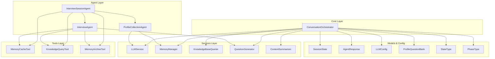
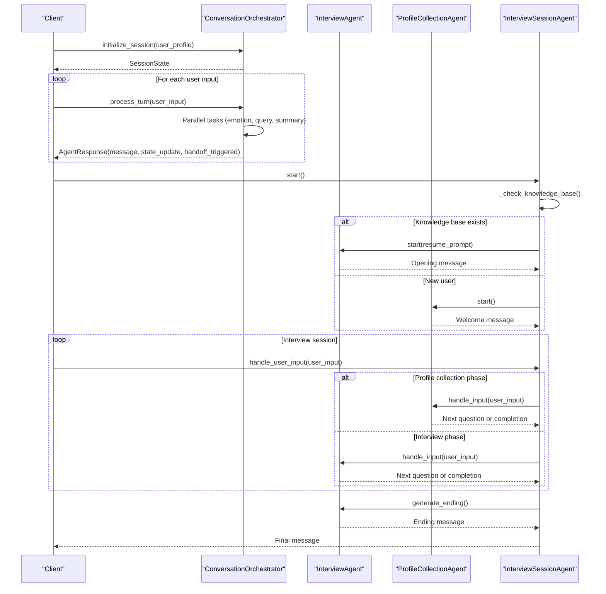
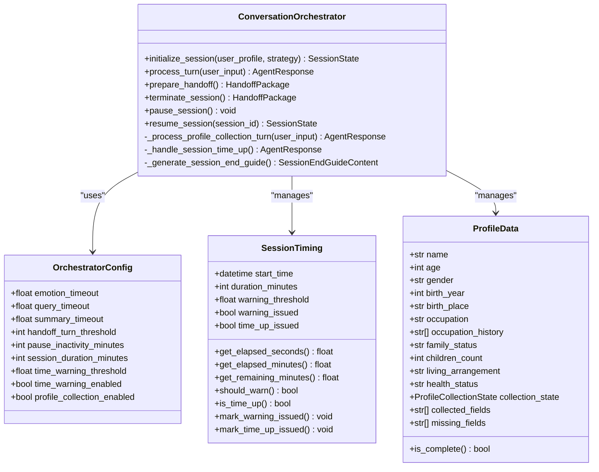
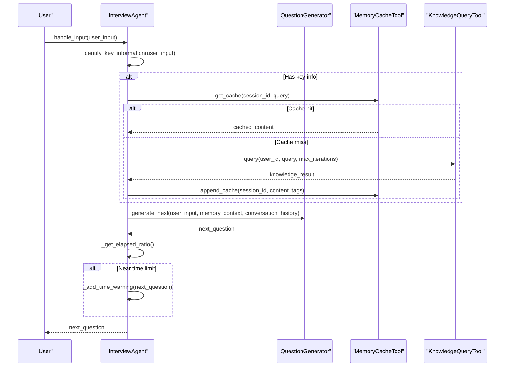
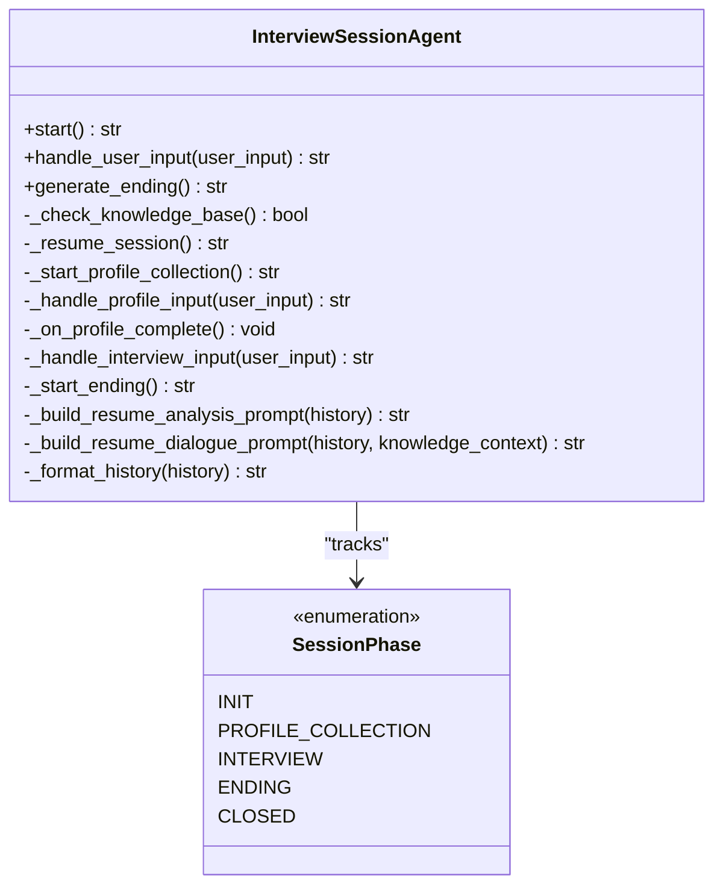
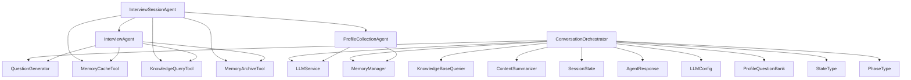

# Core Components

<cite>
**Referenced Files in This Document**
- [conversation_orchestrator.py](file://src/core/conversation_orchestrator.py)
- [interview_agent.py](file://src/agents/interview_agent.py)
- [profile_collection_agent.py](file://src/agents/profile_collection_agent.py)
- [interview_session_agent.py](file://src/agents/interview_session_agent.py)
- [session_state.py](file://src/models/session_state.py)
- [agent_response.py](file://src/models/agent_response.py)
- [llm_config.py](file://src/config/llm_config.py)
- [profile_questions.py](file://src/config/profile_questions.py)
- [state_type.py](file://src/enums/state_type.py)
- [phase_type.py](file://src/enums/phase_type.py)
- [question_generator.py](file://src/services/question_generator.py)
- [memory_cache_tool.py](file://src/tools/memory_cache_tool.py)
- [knowledge_query_tool.py](file://src/tools/knowledge_query_tool.py)
- [memory_archive_tool.py](file://src/tools/memory_archive_tool.py)
</cite>

## Table of Contents
1. [Introduction](#introduction)
2. [Project Structure](#project-structure)
3. [Core Components](#core-components)
4. [Architecture Overview](#architecture-overview)
5. [Detailed Component Analysis](#detailed-component-analysis)
6. [Dependency Analysis](#dependency-analysis)
7. [Performance Considerations](#performance-considerations)
8. [Troubleshooting Guide](#troubleshooting-guide)
9. [Conclusion](#conclusion)

## Introduction
This document provides comprehensive documentation for the core agent system components that power the elderly autobiography writing assistant. It focuses on four primary components:
- ConversationOrchestrator: Central coordinator managing session lifecycle and parallel processing
- InterviewAgent: Time-constrained conversation manager with adaptive questioning and state transitions
- ProfileCollectionAgent: Initial user onboarding and information gathering
- InterviewSessionAgent: Complete session lifecycle management including user coordination and session handoff

The documentation covers implementation details, invocation relationships, public interfaces, usage patterns, configuration options, parameters, return values, and error handling strategies for each component, with concrete examples drawn from the actual codebase.

## Project Structure
The system is organized around a layered architecture:
- Core orchestration layer: ConversationOrchestrator coordinates services and agents
- Agent layer: InterviewAgent, ProfileCollectionAgent, InterviewSessionAgent encapsulate conversation flows
- Services layer: LLMService, MemoryManager, KnowledgeBaseQuerier, QuestionGenerator, ContentSummarizer
- Tools layer: MemoryCacheTool, KnowledgeQueryTool, MemoryArchiveTool
- Models and configuration: SessionState, AgentResponse, LLMConfig, ProfileQuestionBank
- Enums: StateType, PhaseType



**Diagram sources**
- [conversation_orchestrator.py:138-401](file://src/core/conversation_orchestrator.py#L138-L401)
- [interview_agent.py:16-184](file://src/agents/interview_agent.py#L16-L184)
- [profile_collection_agent.py:14-166](file://src/agents/profile_collection_agent.py#L14-L166)
- [interview_session_agent.py:33-111](file://src/agents/interview_session_agent.py#L33-L111)

**Section sources**
- [conversation_orchestrator.py:1-658](file://src/core/conversation_orchestrator.py#L1-L658)
- [interview_agent.py:1-346](file://src/agents/interview_agent.py#L1-L346)
- [profile_collection_agent.py:1-275](file://src/agents/profile_collection_agent.py#L1-L275)
- [interview_session_agent.py:1-482](file://src/agents/interview_session_agent.py#L1-L482)

## Core Components
This section introduces the four core components and their primary responsibilities.

- ConversationOrchestrator: Central coordinator that manages session lifecycle, parallel processing of emotion detection, knowledge querying, and content summarization, while handling time controls, profile collection, and handoff preparation.
- InterviewAgent: Time-constrained interview agent that drives conversation flow, identifies key information, queries knowledge base, updates cache, generates adaptive questions, and handles time warnings.
- ProfileCollectionAgent: Onboarding agent responsible for collecting essential user information through progressive questioning and generating a basic knowledge base.
- InterviewSessionAgent: Session lifecycle manager that orchestrates between initialization and interview phases, coordinates tools, and manages session handoff.

Key configuration and models:
- LLMConfig: Centralized LLM configuration with provider selection and environment-based loading.
- ProfileQuestionBank: Structured question sets for profile collection with transitions and validation rules.
- SessionState: Comprehensive session state model tracking progress, coverage, collected items, and conversation history.
- AgentResponse: Standardized response model for agent outputs.

**Section sources**
- [conversation_orchestrator.py:138-401](file://src/core/conversation_orchestrator.py#L138-L401)
- [interview_agent.py:16-184](file://src/agents/interview_agent.py#L16-L184)
- [profile_collection_agent.py:14-166](file://src/agents/profile_collection_agent.py#L14-L166)
- [interview_session_agent.py:33-111](file://src/agents/interview_session_agent.py#L33-L111)
- [llm_config.py:10-120](file://src/config/llm_config.py#L10-L120)
- [profile_questions.py:3-94](file://src/config/profile_questions.py#L3-L94)
- [session_state.py:24-139](file://src/models/session_state.py#L24-L139)
- [agent_response.py:5-22](file://src/models/agent_response.py#L5-L22)

## Architecture Overview
The system follows a coordinated orchestration pattern:
- ConversationOrchestrator initializes services and session state, then coordinates parallel tasks for emotion detection, knowledge querying, and content summarization.
- InterviewSessionAgent manages the end-to-end session lifecycle, delegating to ProfileCollectionAgent for onboarding and InterviewAgent for the main interview.
- InterviewAgent performs time-aware questioning, knowledge integration, and adaptive responses.
- ProfileCollectionAgent handles structured onboarding with progressive questioning and knowledge base creation.



**Diagram sources**
- [conversation_orchestrator.py:198-343](file://src/core/conversation_orchestrator.py#L198-L343)
- [interview_session_agent.py:112-392](file://src/agents/interview_session_agent.py#L112-L392)
- [interview_agent.py:80-184](file://src/agents/interview_agent.py#L80-L184)
- [profile_collection_agent.py:98-166](file://src/agents/profile_collection_agent.py#L98-L166)

## Detailed Component Analysis

### ConversationOrchestrator
Central coordinator managing session lifecycle and parallel processing.

Public interface:
- initialize_session(user_profile, strategy): Initializes session timing, optional profile collection, and emits session started events.
- process_turn(user_input): Handles a single conversation turn with parallel processing and returns AgentResponse.
- prepare_handoff(): Prepares handoff package with collected data and session summary.
- terminate_session(): Terminates session and returns handoff package.
- pause_session()/resume_session(session_id): Controls session pause/resume.

Key behaviors:
- Parallel processing: Emotion detection, knowledge querying, and content summarization run concurrently with timeouts.
- Time management: SessionTiming tracks elapsed time, issues warnings, and triggers termination.
- Profile collection: ProfileCollectionState manages initialization, basic info collection, detail collection, and readiness.
- Handoff: prepare_handoff aggregates collected data and builds HandoffPackage.

Configuration:
- OrchestratorConfig: Controls timeouts, handoff thresholds, session duration, time warning threshold, and profile collection enablement.

Error handling:
- Timeout protection for emotion detection and knowledge querying with fallback neutral results.
- Graceful handling of session time-up with end guide generation and handoff trigger.



**Diagram sources**
- [conversation_orchestrator.py:29-197](file://src/core/conversation_orchestrator.py#L29-L197)

**Section sources**
- [conversation_orchestrator.py:138-401](file://src/core/conversation_orchestrator.py#L138-L401)
- [session_state.py:24-139](file://src/models/session_state.py#L24-L139)
- [agent_response.py:5-22](file://src/models/agent_response.py#L5-L22)

### InterviewAgent
Time-constrained conversation manager with adaptive questioning and state transitions.

Public interface:
- start(): Generates opening message using resume prompt or standard template.
- handle_input(user_input): Processes user input, identifies key information, queries knowledge base, updates cache, generates next question, and checks time limits.
- generate_ending(): Creates end-of-session guidance using a prompt template.

Core logic:
- Time control: Tracks elapsed time, warns near threshold, and marks completion upon reaching limit.
- Key information identification: Uses LLM to extract events, persons, time points, locations, and tags.
- Knowledge integration: Checks cache, queries knowledge base if needed, and updates cache.
- Adaptive questioning: Uses QuestionGenerator to produce context-aware questions.



**Diagram sources**
- [interview_agent.py:115-184](file://src/agents/interview_agent.py#L115-L184)
- [question_generator.py:207-253](file://src/services/question_generator.py#L207-L253)
- [memory_cache_tool.py:34-84](file://src/tools/memory_cache_tool.py#L34-L84)
- [knowledge_query_tool.py:33-66](file://src/tools/knowledge_query_tool.py#L33-L66)

**Section sources**
- [interview_agent.py:16-184](file://src/agents/interview_agent.py#L16-L184)
- [question_generator.py:12-253](file://src/services/question_generator.py#L12-L253)
- [memory_cache_tool.py:8-89](file://src/tools/memory_cache_tool.py#L8-L89)
- [knowledge_query_tool.py:11-81](file://src/tools/knowledge_query_tool.py#L11-L81)

### ProfileCollectionAgent
Initial user onboarding and information gathering.

Public interface:
- start(): Generates welcome message using profile collection prompt.
- handle_input(user_input): Records input, extracts structured information, checks completion criteria, and generates next question.
- get_conversation_history(): Returns full conversation record.

Completion logic:
- Required fields: name, age, occupation, family_status, living_arrangement, story_expectation.
- Time limit: Max duration minutes for initialization.
- Information extraction: Uses structured JSON extraction to populate collected_info.

```mermaid
flowchart TD
Start(["Start"]) --> LoadPrompt["Load Profile Collection Prompt"]
LoadPrompt --> GenerateWelcome["Generate Welcome Message"]
GenerateWelcome --> RecordAssistant["Record Assistant Turn"]
loop For each user input
UserInput["User Input"] --> RecordUser["Record User Turn"]
RecordUser --> ExtractInfo["Extract Structured Info (JSON)"]
ExtractInfo --> UpdateCollected["Update collected_info"]
UpdateCollected --> CheckComplete{"Required Fields Complete<br/>OR Time Exceeded?"}
CheckComplete --> |Yes| MarkCompleted["Set is_completed = True"]
CheckComplete --> |No| GenerateNext["Generate Next Question"]
GenerateNext --> RecordAssistant2["Record Assistant Turn"]
end
MarkCompleted --> End(["End"])
RecordAssistant2 --> End
```

**Diagram sources**
- [profile_collection_agent.py:98-166](file://src/agents/profile_collection_agent.py#L98-L166)

**Section sources**
- [profile_collection_agent.py:14-166](file://src/agents/profile_collection_agent.py#L14-L166)
- [profile_questions.py:3-94](file://src/config/profile_questions.py#L3-L94)

### InterviewSessionAgent
Complete session lifecycle management including user coordination and session handoff.

Public interface:
- start(): Determines whether to resume existing session or start profile collection.
- handle_user_input(user_input): Delegates to appropriate phase agent.
- generate_ending(): Generates end-of-session guidance and archives conversation.

Lifecycle phases:
- INIT: Initialize session timing and determine knowledge base existence.
- PROFILE_COLLECTION: Run ProfileCollectionAgent until completion or timeout.
- INTERVIEW: Run InterviewAgent with time controls and knowledge integration.
- ENDING: Generate ending message and archive conversation.
- CLOSED: Final closed state.



**Diagram sources**
- [interview_session_agent.py:33-111](file://src/agents/interview_session_agent.py#L33-L111)

**Section sources**
- [interview_session_agent.py:33-392](file://src/agents/interview_session_agent.py#L33-L392)

## Dependency Analysis
This section maps the dependencies between components and highlights coupling and cohesion.



**Diagram sources**
- [conversation_orchestrator.py:163-187](file://src/core/conversation_orchestrator.py#L163-L187)
- [interview_session_agent.py:54-111](file://src/agents/interview_session_agent.py#L54-L111)
- [interview_agent.py:37-78](file://src/agents/interview_agent.py#L37-L78)
- [profile_collection_agent.py:34-48](file://src/agents/profile_collection_agent.py#L34-L48)

**Section sources**
- [conversation_orchestrator.py:1-658](file://src/core/conversation_orchestrator.py#L1-L658)
- [interview_session_agent.py:1-482](file://src/agents/interview_session_agent.py#L1-L482)
- [interview_agent.py:1-346](file://src/agents/interview_agent.py#L1-L346)
- [profile_collection_agent.py:1-275](file://src/agents/profile_collection_agent.py#L1-L275)

## Performance Considerations
- Parallel processing: ConversationOrchestrator runs emotion detection, knowledge querying, and content summarization concurrently with timeout protection to prevent blocking.
- Time management: InterviewAgent and InterviewSessionAgent enforce strict time limits with early warnings to improve user experience.
- Caching: MemoryCacheTool reduces repeated knowledge base queries by storing relevant context with tag-based retrieval.
- Asynchronous operations: InterviewAgent uses async/await for I/O-bound operations to maximize throughput.
- Configuration tuning: LLMConfig allows adjusting provider, model, temperature, and token limits to balance quality and cost.

[No sources needed since this section provides general guidance]

## Troubleshooting Guide
Common issues and resolutions:
- Timeout errors: ConversationOrchestrator applies timeouts to emotion detection and knowledge querying; when exceeded, it falls back to neutral results and logs warnings.
- Session time-up: When session duration is reached, ConversationOrchestrator triggers time-up handling and prepares an end guide with handoff.
- Knowledge base queries: InterviewAgent and InterviewSessionAgent rely on KnowledgeQueryTool; ensure target_path includes user_id and that required directories exist.
- Initialization failures: ProfileCollectionAgent completes when required fields are collected or when time limit is exceeded; verify prompt templates and extraction logic.

**Section sources**
- [conversation_orchestrator.py:286-301](file://src/core/conversation_orchestrator.py#L286-L301)
- [interview_agent.py:170-184](file://src/agents/interview_agent.py#L170-L184)
- [interview_session_agent.py:344-358](file://src/agents/interview_session_agent.py#L344-L358)

## Conclusion
The core agent system integrates a central orchestrator with specialized agents to deliver a seamless, time-aware, and knowledge-enhanced conversation experience. ConversationOrchestrator coordinates parallel processing and session lifecycle, InterviewAgent manages adaptive questioning under time constraints, ProfileCollectionAgent ensures robust onboarding, and InterviewSessionAgent orchestrates the end-to-end session flow. Together, they provide a scalable foundation for elderly autobiography interviews with strong error handling, caching, and handoff capabilities.