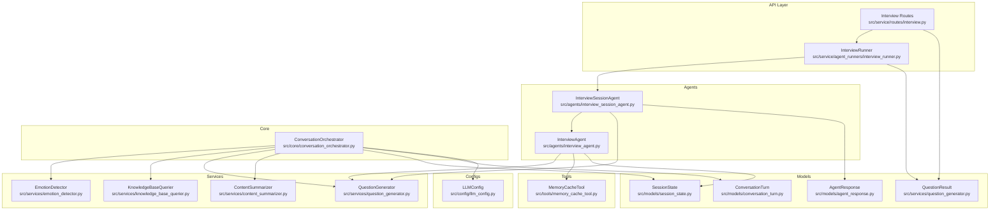
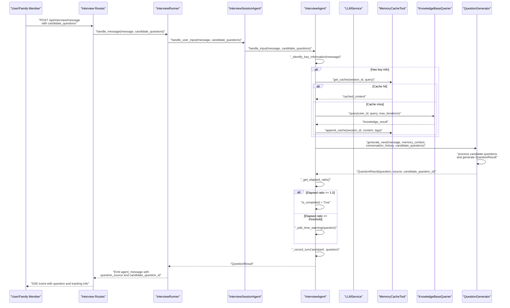
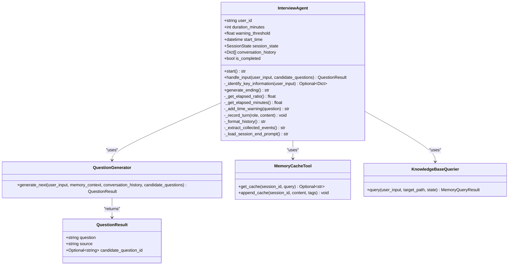
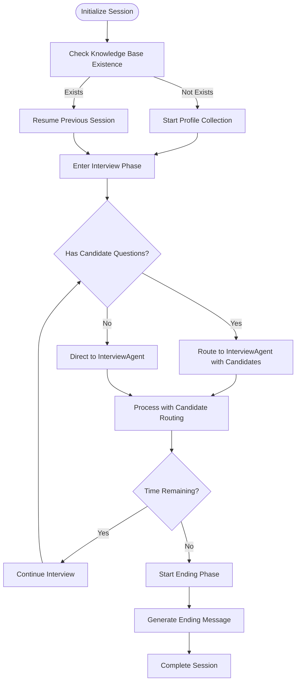
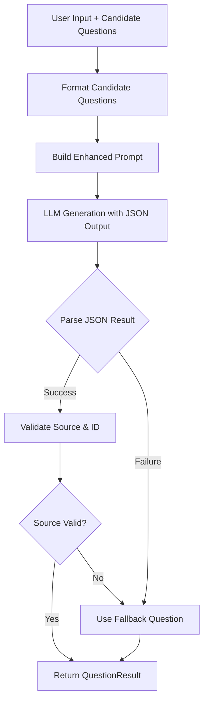
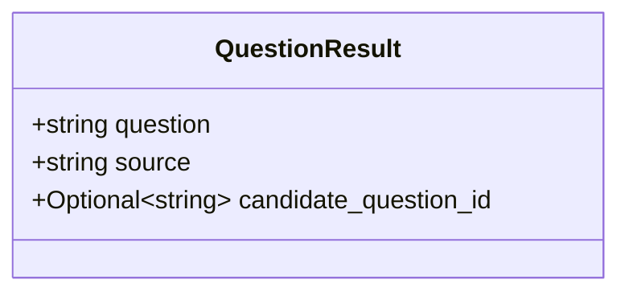
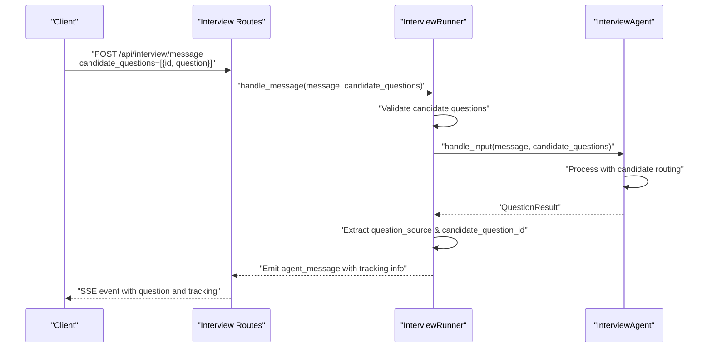
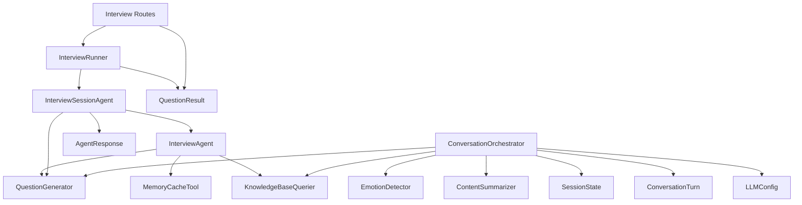

# Interview Agent

<cite>
**Referenced Files in This Document**
- [interview_agent.py](file://src/agents/interview_agent.py)
- [interview_session_agent.py](file://src/agents/interview_session_agent.py)
- [conversation_orchestrator.py](file://src/core/conversation_orchestrator.py)
- [question_generator.py](file://src/services/question_generator.py)
- [knowledge_base_querier.py](file://src/services/knowledge_base_querier.py)
- [emotion_detector.py](file://src/services/emotion_detector.py)
- [content_summarizer.py](file://src/services/content_summarizer.py)
- [memory_cache_tool.py](file://src/tools/memory_cache_tool.py)
- [session_state.py](file://src/models/session_state.py)
- [conversation_turn.py](file://src/models/conversation_turn.py)
- [agent_response.py](file://src/models/agent_response.py)
- [state_type.py](file://src/enums/state_type.py)
- [QuestionGenerator-Prompt.md](file://src/prompts/QuestionGenerator-Prompt.md)
- [SessionEndGuide-Prompt.md](file://Prompts/SessionEndGuide-Prompt.md)
- [llm_config.py](file://src/config/llm_config.py)
- [interview.py](file://src/service/routes/interview.py)
- [interview_runner.py](file://src/service/agent_runners/interview_runner.py)
- [test_interview_api.py](file://tests/integration/test_interview_api.py)
</cite>

## Update Summary
**Changes Made**
- Added documentation for the new QuestionResult data structure and candidate question selection system
- Updated InterviewAgent interface to support candidate_questions parameter
- Enhanced QuestionGenerator with candidate question routing capabilities
- Added integration points for family member-prepared questions
- Updated API endpoints and SSE event handling for candidate question tracking

## Table of Contents
1. [Introduction](#introduction)
2. [Project Structure](#project-structure)
3. [Core Components](#core-components)
4. [Architecture Overview](#architecture-overview)
5. [Detailed Component Analysis](#detailed-component-analysis)
6. [Candidate Question System](#candidate-question-system)
7. [Dependency Analysis](#dependency-analysis)
8. [Performance Considerations](#performance-considerations)
9. [Troubleshooting Guide](#troubleshooting-guide)
10. [Conclusion](#conclusion)
11. [Appendices](#appendices)

## Introduction
This document provides comprehensive documentation for the InterviewAgent component, which manages time-constrained conversations during interviews. The InterviewAgent now features an advanced candidate question selection system that allows family members to prepare questions in advance, enabling sophisticated question routing capabilities. It explains how InterviewAgent maintains conversation flow within strict time limits, adapts questioning strategies, coordinates with the ConversationOrchestrator for session management, and integrates with the new QuestionResult data structure for enhanced question tracking and routing.

## Project Structure
The InterviewAgent resides in the agents module and integrates with core orchestration, services, tools, and models. The ConversationOrchestrator coordinates multiple subsystems asynchronously, while InterviewAgent focuses on time-bound conversation management and adaptive questioning. The new candidate question system enhances the interview workflow with sophisticated question routing capabilities.

**Diagram sources**
- [interview_agent.py:16-360](file://src/agents/interview_agent.py#L16-L360)
- [interview_session_agent.py:34-520](file://src/agents/interview_session_agent.py#L34-L520)
- [conversation_orchestrator.py:138-658](file://src/core/conversation_orchestrator.py#L138-L658)
- [question_generator.py:14-333](file://src/services/question_generator.py#L14-L333)
- [knowledge_base_querier.py:202-540](file://src/services/knowledge_base_querier.py#L202-L540)
- [emotion_detector.py:12-131](file://src/services/emotion_detector.py#L12-L131)
- [content_summarizer.py:17-177](file://src/services/content_summarizer.py#L17-L177)
- [memory_cache_tool.py:8-89](file://src/tools/memory_cache_tool.py#L8-L89)
- [session_state.py:24-139](file://src/models/session_state.py#L24-L139)
- [conversation_turn.py:14-52](file://src/models/conversation_turn.py#L14-L52)
- [agent_response.py:5-22](file://src/models/agent_response.py#L5-L22)
- [interview_runner.py:10-102](file://src/service/agent_runners/interview_runner.py#L10-L102)
- [interview.py:15-122](file://src/service/routes/interview.py#L15-L122)
- [llm_config.py:10-120](file://src/config/llm_config.py#L10-L120)

**Section sources**
- [interview_agent.py:16-360](file://src/agents/interview_agent.py#L16-L360)
- [interview_session_agent.py:34-520](file://src/agents/interview_session_agent.py#L34-L520)
- [conversation_orchestrator.py:138-658](file://src/core/conversation_orchestrator.py#L138-L658)

## Core Components
- InterviewAgent: Manages time-constrained conversation flow, generates adaptive questions with candidate question support, integrates with knowledge base and memory caching, and handles time warnings and completion.
- InterviewSessionAgent: Orchestrates the complete interview lifecycle, manages session phases, coordinates with InterviewAgent, and handles candidate question routing.
- ConversationOrchestrator: Coordinates emotion detection, knowledge base querying, content summarization, and session timing; triggers time-up handling and end-of-session guidance.
- QuestionGenerator: Enhanced with QuestionResult data structure and candidate question selection capabilities, generating contextual questions with sophisticated routing logic.
- KnowledgeBaseQuerier: Implements ReAct-style search with tools to explore and retrieve relevant memories.
- EmotionDetector: Detects user emotional state and suggests appropriate responses.
- ContentSummarizer: Extracts structured information and prepares summaries for handoff.
- MemoryCacheTool: Provides lightweight session-scoped caching for memory context.
- SessionState and ConversationTurn: Define session lifecycle and turn-level data structures.
- QuestionResult: New data structure containing question text, source type, and candidate question ID for enhanced tracking.
- AgentResponse: Standardized response structure for agent interactions.
- InterviewRunner and API Routes: Handle candidate question processing and SSE event emission with question tracking.
- LLMConfig: Centralized LLM provider configuration.

**Section sources**
- [interview_agent.py:16-360](file://src/agents/interview_agent.py#L16-L360)
- [interview_session_agent.py:34-520](file://src/agents/interview_session_agent.py#L34-L520)
- [conversation_orchestrator.py:138-658](file://src/core/conversation_orchestrator.py#L138-L658)
- [question_generator.py:14-333](file://src/services/question_generator.py#L14-L333)
- [knowledge_base_querier.py:202-540](file://src/services/knowledge_base_querier.py#L202-L540)
- [emotion_detector.py:12-131](file://src/services/emotion_detector.py#L12-L131)
- [content_summarizer.py:17-177](file://src/services/content_summarizer.py#L17-L177)
- [memory_cache_tool.py:8-89](file://src/tools/memory_cache_tool.py#L8-L89)
- [session_state.py:24-139](file://src/models/session_state.py#L24-L139)
- [conversation_turn.py:14-52](file://src/models/conversation_turn.py#L14-L52)
- [agent_response.py:5-22](file://src/models/agent_response.py#L5-L22)
- [interview_runner.py:10-102](file://src/service/agent_runners/interview_runner.py#L10-L102)
- [interview.py:15-122](file://src/service/routes/interview.py#L15-L122)
- [llm_config.py:10-120](file://src/config/llm_config.py#L10-L120)

## Architecture Overview
InterviewAgent operates within a time-bound framework, generating questions and adapting to user input while checking time thresholds. The new candidate question system allows family members to prepare questions in advance, which are then intelligently routed by the QuestionGenerator. InterviewAgent integrates with KnowledgeBaseQuerier for context retrieval and MemoryCacheTool for caching. The InterviewSessionAgent coordinates the complete interview lifecycle and manages the transition between phases. The ConversationOrchestrator manages broader session timing, emotion handling, and end-of-session guidance.

**Diagram sources**
- [interview.py:42-76](file://src/service/routes/interview.py#L42-L76)
- [interview_runner.py:44-82](file://src/service/agent_runners/interview_runner.py#L44-L82)
- [interview_session_agent.py:272-397](file://src/agents/interview_session_agent.py#L272-L397)
- [interview_agent.py:115-196](file://src/agents/interview_agent.py#L115-L196)
- [question_generator.py:217-332](file://src/services/question_generator.py#L217-L332)
- [knowledge_base_querier.py:257-373](file://src/services/knowledge_base_querier.py#L257-L373)
- [memory_cache_tool.py:34-84](file://src/tools/memory_cache_tool.py#L34-L84)

## Detailed Component Analysis

### InterviewAgent
InterviewAgent encapsulates time-constrained conversation management, adaptive questioning with candidate question support, and state transitions. It initializes with configurable duration and warning thresholds, records conversation turns, and integrates with LLMService, MemoryManager, QuestionGenerator, and tools for caching and querying.

Key responsibilities:
- Start interview with optional resume prompt or standard opening.
- Handle user input with candidate question support: record turn, extract key information, query knowledge base, update cache, generate next question with candidate routing, and enforce time limits.
- Manage time warnings and completion flags.
- Generate end-of-session guidance using a dedicated prompt template.
- Return QuestionResult objects containing question text, source type, and candidate question ID.

**Updated** Enhanced with candidate question parameter support and QuestionResult return type for improved question tracking and routing.

Time management:
- Duration minutes and warning threshold (default 80%) define when to warn and when to mark completion.
- Elapsed ratio computed from start time to current time.

Adaptive questioning:
- Uses QuestionGenerator.generate_next for InterviewAgent-specific flows with candidate question support.
- Incorporates memory context, conversation history, and candidate questions.
- Returns QuestionResult with source tracking for question origin.

Integration points:
- KnowledgeBaseQuerier for context retrieval.
- MemoryCacheTool for caching.
- SessionState for conversation history and pacing.

**Diagram sources**
- [interview_agent.py:16-360](file://src/agents/interview_agent.py#L16-L360)
- [question_generator.py:14-333](file://src/services/question_generator.py#L14-L333)
- [question_generator.py:217-332](file://src/services/question_generator.py#L217-L332)
- [memory_cache_tool.py:8-89](file://src/tools/memory_cache_tool.py#L8-L89)
- [knowledge_base_querier.py:257-373](file://src/services/knowledge_base_querier.py#L257-L373)

**Section sources**
- [interview_agent.py:16-360](file://src/agents/interview_agent.py#L16-L360)

### InterviewSessionAgent
InterviewSessionAgent orchestrates the complete interview lifecycle, managing session phases and coordinating with InterviewAgent. It now supports candidate question routing through the InterviewAgent interface.

Key responsibilities:
- Initialize and manage session phases (INIT, PROFILE_COLLECTION, INTERVIEW, ENDING).
- Coordinate between ProfileCollectionAgent and InterviewAgent.
- Handle candidate question routing and validation.
- Manage session timing with five-minute archiving and total duration control.
- Process user input across different session phases with candidate question support.

**Updated** Enhanced with candidate question parameter passing and improved phase management for the new question routing system.

Session phases:
- INIT: Session initialization and knowledge base validation.
- PROFILE_COLLECTION: User profile collection before main interview.
- INTERVIEW: Main interview phase with candidate question support.
- ENDING: Session conclusion and summary generation.

**Diagram sources**
- [interview_session_agent.py:113-131](file://src/agents/interview_session_agent.py#L113-L131)
- [interview_session_agent.py:179-200](file://src/agents/interview_session_agent.py#L179-L200)
- [interview_session_agent.py:272-397](file://src/agents/interview_session_agent.py#L272-L397)

**Section sources**
- [interview_session_agent.py:34-520](file://src/agents/interview_session_agent.py#L34-L520)

### QuestionGenerator
Enhanced with sophisticated candidate question routing capabilities and QuestionResult data structure support. The QuestionGenerator now processes candidate questions alongside user input and memory context to determine the optimal next question.

Key capabilities:
- Process candidate questions with intelligent matching and routing.
- Generate QuestionResult objects with source tracking and candidate question IDs.
- Validate candidate question IDs against provided lists.
- Maintain backward compatibility with standard question generation.

**Updated** Major enhancement with candidate question processing and QuestionResult return type.

Candidate question processing:
- Format candidate questions with numbering and ID tracking.
- Match candidate questions to user input context.
- Route selected candidate questions as natural follow-ups.
- Validate candidate question IDs for security and consistency.

QuestionResult structure:
- question: Generated question text.
- source: "candidate_question" or "generated".
- candidate_question_id: ID of selected candidate question or None.

**Diagram sources**
- [question_generator.py:217-332](file://src/services/question_generator.py#L217-L332)
- [question_generator.py:14-20](file://src/services/question_generator.py#L14-L20)

**Section sources**
- [question_generator.py:14-333](file://src/services/question_generator.py#L14-L333)

### QuestionResult Data Structure
The new QuestionResult data structure provides standardized question representation with enhanced tracking capabilities for the candidate question system.

Structure definition:
- question: String containing the generated question text.
- source: String indicating question origin ("candidate_question" or "generated").
- candidate_question_id: Optional string containing the ID of selected candidate question.

**New** Introduced to support the candidate question selection system and provide enhanced tracking.

**Diagram sources**
- [question_generator.py:14-20](file://src/services/question_generator.py#L14-L20)

**Section sources**
- [question_generator.py:14-20](file://src/services/question_generator.py#L14-L20)

### InterviewRunner and API Integration
The InterviewRunner and API routes have been enhanced to support candidate question processing and SSE event emission with question tracking.

Key enhancements:
- Support for candidate_questions parameter in message handling.
- Emit question_source and candidate_question_id in SSE events.
- Validate candidate question IDs before routing.
- Maintain backward compatibility with existing API calls.

**Updated** Enhanced with candidate question support and improved event emission.

**Diagram sources**
- [interview.py:42-76](file://src/service/routes/interview.py#L42-L76)
- [interview_runner.py:44-82](file://src/service/agent_runners/interview_runner.py#L44-L82)

**Section sources**
- [interview_runner.py:10-102](file://src/service/agent_runners/interview_runner.py#L10-L102)
- [interview.py:15-122](file://src/service/routes/interview.py#L15-L122)

## Candidate Question System
The new candidate question system allows family members to prepare questions in advance, enhancing the interview workflow with sophisticated question routing capabilities.

### System Architecture
Family members prepare candidate questions that are transmitted to the InterviewAgent along with user messages. The QuestionGenerator processes these candidate questions alongside user input and memory context to determine the optimal next question.

### Candidate Question Processing Flow
1. Family member submits candidate questions via API with unique IDs.
2. InterviewRunner validates candidate question IDs and formats them for processing.
3. InterviewAgent passes candidate questions to QuestionGenerator.
4. QuestionGenerator analyzes user input context and candidate questions.
5. Selected candidate question is routed as a natural follow-up question.
6. QuestionResult includes source tracking and candidate question ID.

### QuestionResult Tracking
The QuestionResult structure provides enhanced tracking for question origin and routing decisions:
- source: Indicates whether question came from candidate routing or generation.
- candidate_question_id: Tracks which candidate question was selected (if any).

### API Integration
The interview API routes support candidate question submission and tracking:
- POST /api/interview/message accepts candidate_questions parameter.
- SSE events include question_source and candidate_question_id fields.
- Integration tests validate candidate question consumption tracking.

**Section sources**
- [interview.py:42-76](file://src/service/routes/interview.py#L42-L76)
- [interview_runner.py:44-82](file://src/service/agent_runners/interview_runner.py#L44-L82)
- [question_generator.py:217-332](file://src/services/question_generator.py#L217-L332)
- [test_interview_api.py:160-194](file://tests/integration/test_interview_api.py#L160-L194)

## Dependency Analysis
InterviewAgent depends on QuestionGenerator, MemoryCacheTool, and KnowledgeBaseQuerier for adaptive questioning and context retrieval. InterviewSessionAgent orchestrates InterviewAgent and manages session phases. Both components rely on LLMService configured via LLMConfig. The new candidate question system introduces additional dependencies for QuestionResult handling and API integration.

**Diagram sources**
- [interview_agent.py:6-11](file://src/agents/interview_agent.py#L6-L11)
- [interview_session_agent.py:9-20](file://src/agents/interview_session_agent.py#L9-L20)
- [conversation_orchestrator.py:9-24](file://src/core/conversation_orchestrator.py#L9-L24)
- [interview_runner.py:6-7](file://src/service/agent_runners/interview_runner.py#L6-L7)
- [interview.py:7-9](file://src/service/routes/interview.py#L7-L9)
- [llm_config.py:10-120](file://src/config/llm_config.py#L10-L120)

**Section sources**
- [interview_agent.py:6-11](file://src/agents/interview_agent.py#L6-L11)
- [interview_session_agent.py:9-20](file://src/agents/interview_session_agent.py#L9-L20)
- [conversation_orchestrator.py:9-24](file://src/core/conversation_orchestrator.py#L9-L24)

## Performance Considerations
- Asynchronous processing: ConversationOrchestrator runs emotion detection, knowledge base querying, and content summarization concurrently with timeouts to prevent blocking.
- Caching: InterviewAgent caches knowledge results keyed by tags to reduce repeated queries.
- Timeouts: Emotion detection and knowledge base queries have explicit timeouts; failures fall back to neutral/default responses.
- Token limits and temperature: LLMConfig centralizes model parameters; adjust temperature for creativity vs. consistency.
- Candidate question processing: Efficient candidate question validation and routing minimize computational overhead.
- SSE streaming: InterviewRunner optimizes event emission for real-time candidate question tracking.

## Troubleshooting Guide
Common issues and resolutions:
- Knowledge base query failures: The KnowledgeBaseQuerier logs errors and returns empty results; verify target_path existence and permissions.
- Emotion detection failures: Falls back to neutral EmotionResult; check LLM template availability and output parsing.
- Time-up handling: ConversationOrchestrator emits session termination and generates end guide; ensure prompt templates are available.
- Cache misses: InterviewAgent queries knowledge base when cache is empty; confirm tag-based retrieval logic aligns with query structure.
- Session timing: SessionTiming checks elapsed minutes and remaining time; ensure consistent timezone and clock synchronization.
- Candidate question validation: If candidate_question_id is invalid, QuestionGenerator falls back to generated questions; verify candidate question IDs match provided lists.
- SSE event tracking: Ensure client-side SSE event handlers properly process question_source and candidate_question_id fields.

**Section sources**
- [knowledge_base_querier.py:368-372](file://src/services/knowledge_base_querier.py#L368-L372)
- [emotion_detector.py:67-73](file://src/services/emotion_detector.py#L67-L73)
- [conversation_orchestrator.py:570-592](file://src/core/conversation_orchestrator.py#L570-L592)
- [interview_agent.py:134-162](file://src/agents/interview_agent.py#L134-L162)
- [question_generator.py:306-311](file://src/services/question_generator.py#L306-L311)
- [interview_runner.py:75-81](file://src/service/agent_runners/interview_runner.py#L75-L81)

## Conclusion
InterviewAgent provides robust time-constrained conversation management with adaptive questioning, emotion-aware responses, and efficient knowledge base integration. The new candidate question selection system significantly enhances the interview workflow by allowing family members to prepare questions in advance, with sophisticated routing capabilities and enhanced tracking through the QuestionResult data structure. Its design ensures smooth pacing, user engagement, and seamless coordination with InterviewSessionAgent and ConversationOrchestrator for comprehensive session-wide orchestration. The combination of caching, structured prompts, asynchronous processing, and candidate question routing delivers a responsive, reliable, and enhanced interviewing experience.

## Appendices

### Configuration Options
- InterviewAgent
  - duration_minutes: Total session duration in minutes (default 15).
  - warning_threshold: Ratio threshold (default 0.8) to trigger time warnings.
  - resume_prompt: Optional custom opening prompt; otherwise uses standard template.
  - initial_history: Optional initial conversation history.

- InterviewSessionAgent
  - total_duration_minutes: Session length (default 15).
  - profile_duration_minutes: Profile collection duration (default 5).
  - five_minute_archived: Internal flag for five-minute archiving.

- ConversationOrchestrator
  - session_duration_minutes: Session length (default 15).
  - time_warning_threshold: Warning threshold (default 0.8).
  - time_warning_enabled: Toggle for time warnings.
  - profile_collection_enabled: Enable first-time profile collection.

- QuestionGenerator
  - Enhanced with candidate question processing capabilities.
  - Returns QuestionResult objects with source tracking.

- LLMConfig
  - provider, model_name, api_key, base_url, temperature, max_tokens, max_retries, retry_delay, timeout.
  - Environment variables support Qwen and Deepseek providers.

**Section sources**
- [interview_agent.py:37-79](file://src/agents/interview_agent.py#L37-L79)
- [interview_session_agent.py:55-90](file://src/agents/interview_session_agent.py#L55-L90)
- [conversation_orchestrator.py:29-43](file://src/core/conversation_orchestrator.py#L29-L43)
- [question_generator.py:14-20](file://src/services/question_generator.py#L14-L20)
- [llm_config.py:10-120](file://src/config/llm_config.py#L10-L120)

### Typical Interview Scenarios and Patterns
- Opening: InterviewAgent starts with a warm, brief greeting; InterviewSessionAgent may initiate profile collection before transitioning to main interview flow.
- Adaptive questioning: Based on user input, emotion, memory context, and candidate questions, InterviewAgent generates follow-up questions or transitions to new topics.
- Candidate question routing: When family members provide candidate questions, QuestionGenerator intelligently matches them to user input context and routes them as natural follow-ups.
- Time management: Approaching threshold, InterviewAgent adds a gentle time reminder; upon time-up, InterviewSessionAgent generates an end guide and triggers handoff.
- Knowledge integration: When user mentions key entities, InterviewAgent identifies them, checks cache, queries knowledge base if needed, updates cache, and continues with contextual questions.
- Interruptions: If emotion indicates fatigue or reluctance, InterviewAgent responds empathetically and may suggest a break or redirect to lighter topics.
- Question tracking: All questions are tracked through QuestionResult with source information for enhanced workflow monitoring.

**Section sources**
- [interview_agent.py:80-114](file://src/agents/interview_agent.py#L80-L114)
- [interview_session_agent.py:236-343](file://src/agents/interview_session_agent.py#L236-L343)
- [emotion_detector.py:85-131](file://src/services/emotion_detector.py#L85-L131)
- [knowledge_base_querier.py:257-373](file://src/services/knowledge_base_querier.py#L257-L373)
- [question_generator.py:217-332](file://src/services/question_generator.py#L217-L332)

### API Endpoints and Candidate Question Integration
- POST /api/interview/start: Start new interview session with SSE streaming.
- POST /api/interview/message: Send message with optional candidate_questions parameter.
- POST /api/interview/end: End interview session with summary.
- GET /api/interview/status/{user_id}/{session_id}: Get current session status.

**Updated** Enhanced with candidate question support in message endpoint.

**Section sources**
- [interview.py:15-122](file://src/service/routes/interview.py#L15-L122)

### Prompt Templates Used
- InterviewAgent end-of-session guidance: SessionEndGuide-Prompt.md.
- Question generation for InterviewAgent: QuestionGenerator-Prompt.md.
- ConversationOrchestrator uses emotion_detection, content_extraction, and session_end_guide templates.

**Section sources**
- [SessionEndGuide-Prompt.md:1-233](file://Prompts/SessionEndGuide-Prompt.md#L1-L233)
- [QuestionGenerator-Prompt.md:1-352](file://src/prompts/QuestionGenerator-Prompt.md#L1-L352)
- [conversation_orchestrator.py:594-615](file://src/core/conversation_orchestrator.py#L594-L615)