# Interview Agent

<cite>
**Referenced Files in This Document**
- [interview_agent.py](file://src/agents/interview_agent.py)
- [conversation_orchestrator.py](file://src/core/conversation_orchestrator.py)
- [knowledge_base_querier.py](file://src/services/knowledge_base_querier.py)
- [emotion_detector.py](file://src/services/emotion_detector.py)
- [content_summarizer.py](file://src/services/content_summarizer.py)
- [question_generator.py](file://src/services/question_generator.py)
- [memory_cache_tool.py](file://src/tools/memory_cache_tool.py)
- [session_state.py](file://src/models/session_state.py)
- [conversation_turn.py](file://src/models/conversation_turn.py)
- [state_type.py](file://src/enums/state_type.py)
- [QuestionGenerator-Prompt.md](file://src/prompts/QuestionGenerator-Prompt.md)
- [SessionEndGuide-Prompt.md](file://Prompts/SessionEndGuide-Prompt.md)
- [llm_config.py](file://src/config/llm_config.py)
</cite>

## Table of Contents
1. [Introduction](#introduction)
2. [Project Structure](#project-structure)
3. [Core Components](#core-components)
4. [Architecture Overview](#architecture-overview)
5. [Detailed Component Analysis](#detailed-component-analysis)
6. [Dependency Analysis](#dependency-analysis)
7. [Performance Considerations](#performance-considerations)
8. [Troubleshooting Guide](#troubleshooting-guide)
9. [Conclusion](#conclusion)
10. [Appendices](#appendices)

## Introduction
This document provides comprehensive documentation for the InterviewAgent component, which manages time-constrained conversations during interviews. It explains how InterviewAgent maintains conversation flow within strict time limits, adapts questioning strategies, and coordinates with the ConversationOrchestrator for session management. It also covers time management features, conversation pacing, user engagement techniques, integration with emotion detection, knowledge base queries, and content summarization services. Typical interview scenarios, question generation patterns, and handling of conversation interruptions are documented, along with configuration options for time limits, question strategies, and user interaction patterns.

## Project Structure
The InterviewAgent resides in the agents module and integrates with core orchestration, services, tools, and models. The ConversationOrchestrator coordinates multiple subsystems asynchronously, while InterviewAgent focuses on time-bound conversation management and adaptive questioning.

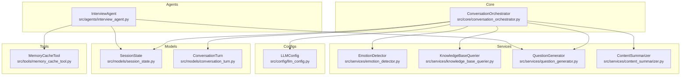

**Diagram sources**
- [interview_agent.py:16-346](file://src/agents/interview_agent.py#L16-L346)
- [conversation_orchestrator.py:138-658](file://src/core/conversation_orchestrator.py#L138-L658)
- [knowledge_base_querier.py:202-540](file://src/services/knowledge_base_querier.py#L202-L540)
- [emotion_detector.py:12-131](file://src/services/emotion_detector.py#L12-L131)
- [content_summarizer.py:17-177](file://src/services/content_summarizer.py#L17-L177)
- [question_generator.py:12-253](file://src/services/question_generator.py#L12-L253)
- [memory_cache_tool.py:8-89](file://src/tools/memory_cache_tool.py#L8-L89)
- [session_state.py:24-139](file://src/models/session_state.py#L24-L139)
- [conversation_turn.py:14-52](file://src/models/conversation_turn.py#L14-L52)
- [llm_config.py:10-120](file://src/config/llm_config.py#L10-L120)

**Section sources**
- [interview_agent.py:16-346](file://src/agents/interview_agent.py#L16-L346)
- [conversation_orchestrator.py:138-658](file://src/core/conversation_orchestrator.py#L138-L658)

## Core Components
- InterviewAgent: Manages time-constrained conversation flow, generates adaptive questions, integrates with knowledge base and memory caching, and handles time warnings and completion.
- ConversationOrchestrator: Coordinates emotion detection, knowledge base querying, content summarization, and session timing; triggers time-up handling and end-of-session guidance.
- KnowledgeBaseQuerier: Implements ReAct-style search with tools to explore and retrieve relevant memories.
- EmotionDetector: Detects user emotional state and suggests appropriate responses.
- ContentSummarizer: Extracts structured information and prepares summaries for handoff.
- QuestionGenerator: Generates contextual questions and handles emotion-aware responses.
- MemoryCacheTool: Provides lightweight session-scoped caching for memory context.
- SessionState and ConversationTurn: Define session lifecycle and turn-level data structures.
- LLMConfig: Centralized LLM provider configuration.

**Section sources**
- [interview_agent.py:16-346](file://src/agents/interview_agent.py#L16-L346)
- [conversation_orchestrator.py:138-658](file://src/core/conversation_orchestrator.py#L138-L658)
- [knowledge_base_querier.py:202-540](file://src/services/knowledge_base_querier.py#L202-L540)
- [emotion_detector.py:12-131](file://src/services/emotion_detector.py#L12-L131)
- [content_summarizer.py:17-177](file://src/services/content_summarizer.py#L17-L177)
- [question_generator.py:12-253](file://src/services/question_generator.py#L12-L253)
- [memory_cache_tool.py:8-89](file://src/tools/memory_cache_tool.py#L8-L89)
- [session_state.py:24-139](file://src/models/session_state.py#L24-L139)
- [conversation_turn.py:14-52](file://src/models/conversation_turn.py#L14-L52)
- [llm_config.py:10-120](file://src/config/llm_config.py#L10-L120)

## Architecture Overview
InterviewAgent operates within a time-bound framework, generating questions and adapting to user input while checking time thresholds. It integrates with KnowledgeBaseQuerier for context retrieval and MemoryCacheTool for caching. The ConversationOrchestrator manages broader session timing, emotion handling, and end-of-session guidance.

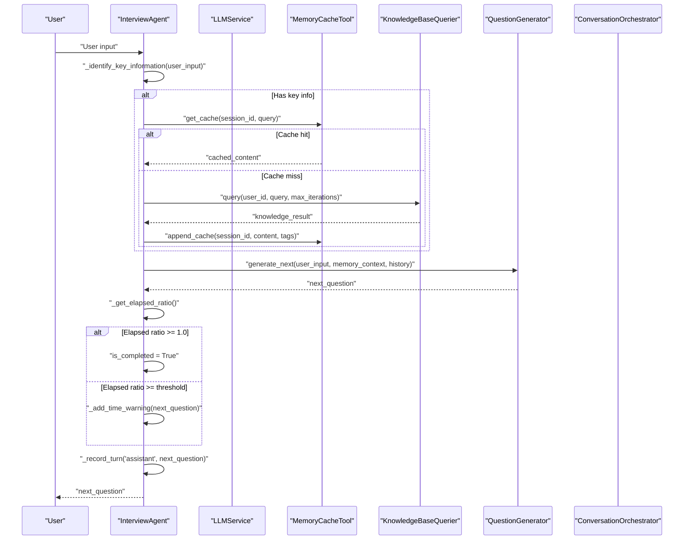

**Diagram sources**
- [interview_agent.py:115-184](file://src/agents/interview_agent.py#L115-L184)
- [interview_agent.py:186-243](file://src/agents/interview_agent.py#L186-L243)
- [knowledge_base_querier.py:257-373](file://src/services/knowledge_base_querier.py#L257-L373)
- [memory_cache_tool.py:34-84](file://src/tools/memory_cache_tool.py#L34-L84)
- [question_generator.py:207-253](file://src/services/question_generator.py#L207-L253)

## Detailed Component Analysis

### InterviewAgent
InterviewAgent encapsulates time-constrained conversation management, adaptive questioning, and state transitions. It initializes with configurable duration and warning thresholds, records conversation turns, and integrates with LLMService, MemoryManager, QuestionGenerator, and tools for caching and querying.

Key responsibilities:
- Start interview with optional resume prompt or standard opening.
- Handle user input: record turn, extract key information, query knowledge base, update cache, generate next question, and enforce time limits.
- Manage time warnings and completion flags.
- Generate end-of-session guidance using a dedicated prompt template.

Time management:
- Duration minutes and warning threshold (default 80%) define when to warn and when to mark completion.
- Elapsed ratio computed from start time to current time.

Adaptive questioning:
- Uses QuestionGenerator.generate_next for InterviewAgent-specific flows.
- Incorporates memory context and conversation history.

Integration points:
- KnowledgeBaseQuerier for context retrieval.
- MemoryCacheTool for caching.
- SessionState for conversation history and pacing.

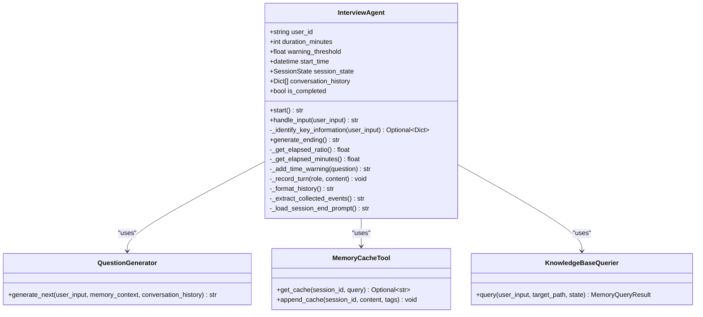

**Diagram sources**
- [interview_agent.py:16-346](file://src/agents/interview_agent.py#L16-L346)
- [question_generator.py:207-253](file://src/services/question_generator.py#L207-L253)
- [memory_cache_tool.py:8-89](file://src/tools/memory_cache_tool.py#L8-L89)
- [knowledge_base_querier.py:257-373](file://src/services/knowledge_base_querier.py#L257-L373)

**Section sources**
- [interview_agent.py:16-346](file://src/agents/interview_agent.py#L16-L346)

### ConversationOrchestrator
ConversationOrchestrator coordinates emotion detection, knowledge base querying, content summarization, and session timing. It manages profile collection, session timing with warning and time-up logic, and generates end-of-session guidance.

Session timing:
- SessionTiming tracks start time, duration, warning threshold, and emits warnings and time-up events.
- OrchestratorConfig defines session duration, warning threshold, and feature toggles.

Processing loop:
- Asynchronously runs emotion detection and knowledge base query with timeouts.
- Generates questions via QuestionGenerator and updates session state.
- Triggers handoff when coverage thresholds and turn count are met.

End-of-session:
- Emits session termination and generates end guide content using a structured prompt.

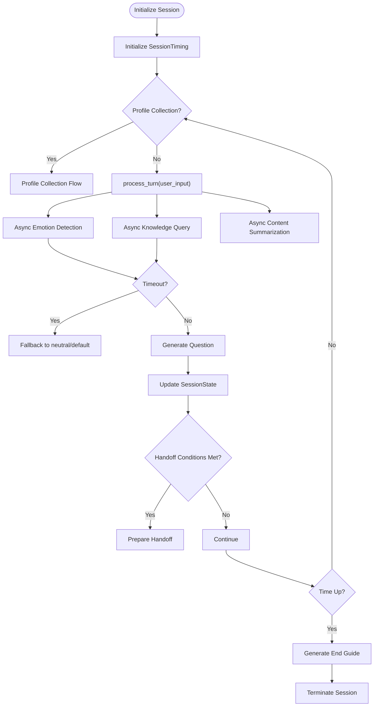

**Diagram sources**
- [conversation_orchestrator.py:198-401](file://src/core/conversation_orchestrator.py#L198-L401)
- [conversation_orchestrator.py:570-615](file://src/core/conversation_orchestrator.py#L570-L615)

**Section sources**
- [conversation_orchestrator.py:138-658](file://src/core/conversation_orchestrator.py#L138-L658)

### KnowledgeBaseQuerier
Implements a ReAct-style agent with tools to explore and retrieve relevant memories. It constructs a LangChain agent with a knowledge base prompt template and executes iterative thought-action-observation cycles until a final answer is produced or an exploration report is generated.

Key capabilities:
- Tools: list_files, read_file, follow_links, mark_suspected_file, get_exploration_report, has_visited.
- Strictly confines operations to a target path.
- Parses Final Answer JSON or falls back to natural language parsing.
- Builds MemoryQueryResult with entries and linked content.

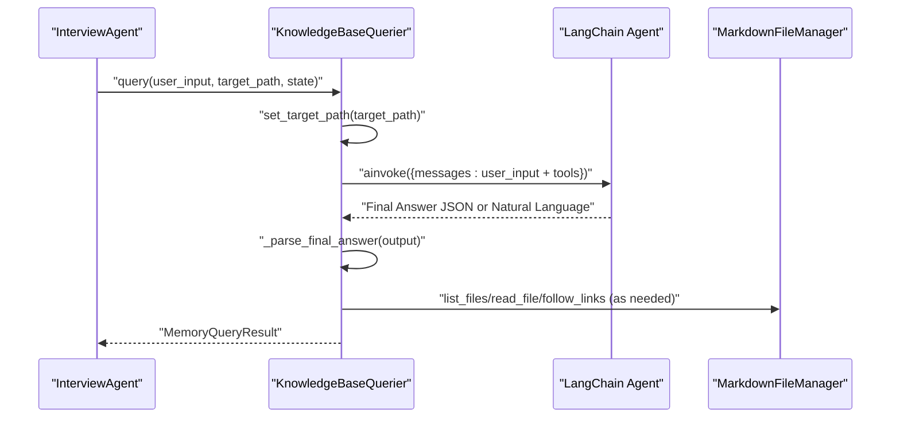

**Diagram sources**
- [knowledge_base_querier.py:257-373](file://src/services/knowledge_base_querier.py#L257-L373)
- [knowledge_base_querier.py:435-511](file://src/services/knowledge_base_querier.py#L435-L511)

**Section sources**
- [knowledge_base_querier.py:202-540](file://src/services/knowledge_base_querier.py#L202-L540)

### EmotionDetector
Detects user emotional state and provides suggested actions. It formats recent conversation history and returns structured EmotionResult, falling back to neutral when LLM fails.

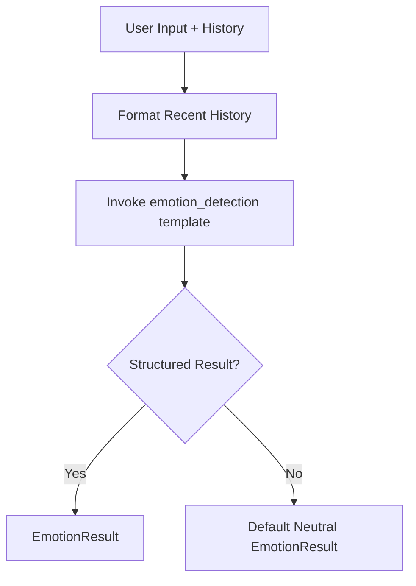

**Diagram sources**
- [emotion_detector.py:39-73](file://src/services/emotion_detector.py#L39-L73)

**Section sources**
- [emotion_detector.py:12-131](file://src/services/emotion_detector.py#L12-L131)

### ContentSummarizer
Extracts structured information from user input asynchronously and builds MemoryUpdatePlan. It also prepares a final summary for handoff at session termination.

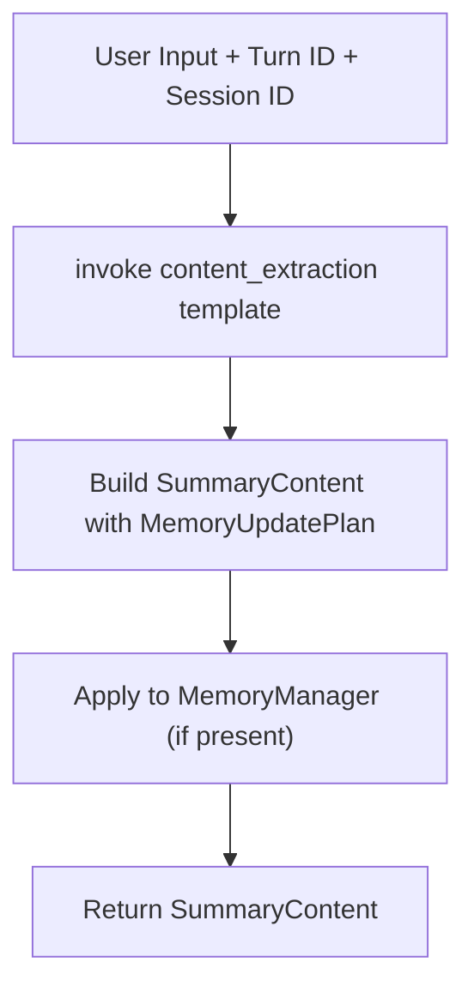

**Diagram sources**
- [content_summarizer.py:43-92](file://src/services/content_summarizer.py#L43-L92)
- [content_summarizer.py:111-143](file://src/services/content_summarizer.py#L111-L143)

**Section sources**
- [content_summarizer.py:17-177](file://src/services/content_summarizer.py#L17-L177)

### QuestionGenerator
Generates contextual questions and handles emotion-aware responses. InterviewAgent uses generate_next for its own flow, while ConversationOrchestrator uses generate for orchestrated sessions.

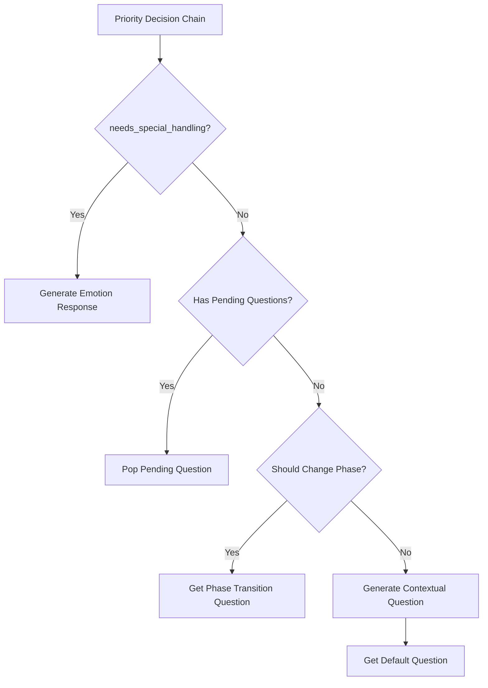

**Diagram sources**
- [question_generator.py:38-74](file://src/services/question_generator.py#L38-L74)
- [question_generator.py:109-140](file://src/services/question_generator.py#L109-L140)
- [question_generator.py:152-195](file://src/services/question_generator.py#L152-L195)
- [question_generator.py:196-206](file://src/services/question_generator.py#L196-L206)

**Section sources**
- [question_generator.py:12-253](file://src/services/question_generator.py#L12-L253)

### MemoryCacheTool
Provides lightweight session-scoped caching with tag-based retrieval and append operations.

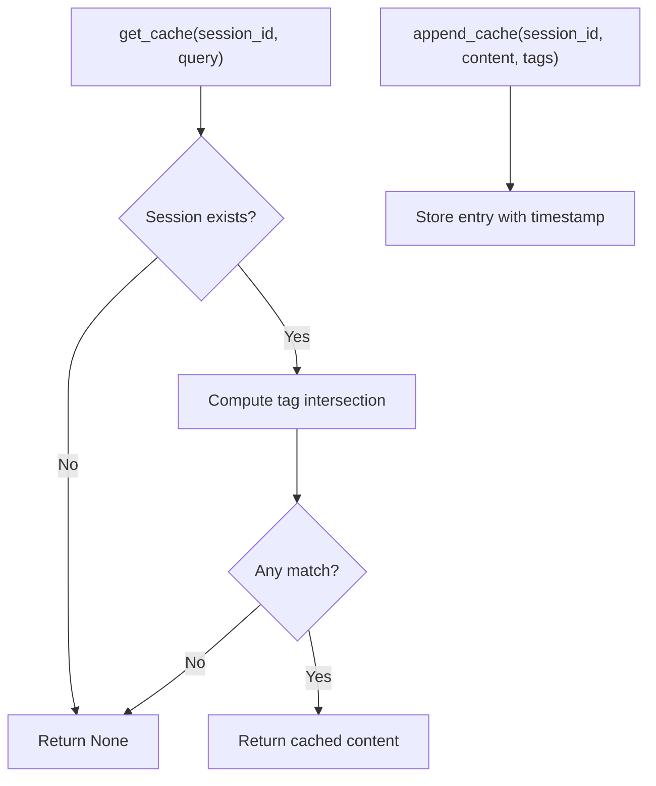

**Diagram sources**
- [memory_cache_tool.py:34-84](file://src/tools/memory_cache_tool.py#L34-L84)

**Section sources**
- [memory_cache_tool.py:8-89](file://src/tools/memory_cache_tool.py#L8-L89)

### SessionState and ConversationTurn
SessionState tracks session lifecycle, coverage, collected entities, and conversation history. ConversationTurn captures per-turn data including user input, agent response, extracted entities, and referenced files.

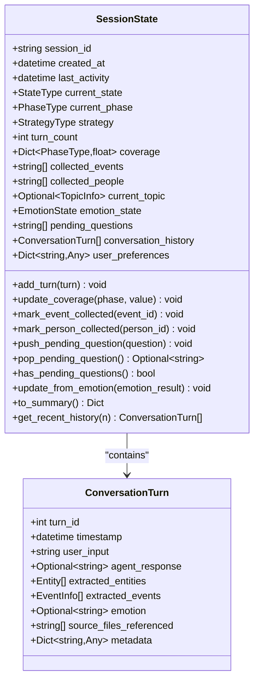

**Diagram sources**
- [session_state.py:24-139](file://src/models/session_state.py#L24-L139)
- [conversation_turn.py:14-52](file://src/models/conversation_turn.py#L14-L52)

**Section sources**
- [session_state.py:24-139](file://src/models/session_state.py#L24-L139)
- [conversation_turn.py:14-52](file://src/models/conversation_turn.py#L14-L52)

## Dependency Analysis
InterviewAgent depends on QuestionGenerator, MemoryCacheTool, and KnowledgeBaseQuerier for adaptive questioning and context retrieval. ConversationOrchestrator orchestrates emotion detection, knowledge base querying, content summarization, and session timing. Both components rely on LLMService configured via LLMConfig.

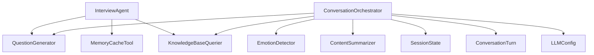

**Diagram sources**
- [interview_agent.py:6-11](file://src/agents/interview_agent.py#L6-L11)
- [conversation_orchestrator.py:9-24](file://src/core/conversation_orchestrator.py#L9-L24)
- [llm_config.py:10-120](file://src/config/llm_config.py#L10-L120)

**Section sources**
- [interview_agent.py:6-11](file://src/agents/interview_agent.py#L6-L11)
- [conversation_orchestrator.py:9-24](file://src/core/conversation_orchestrator.py#L9-L24)

## Performance Considerations
- Asynchronous processing: ConversationOrchestrator runs emotion detection, knowledge base querying, and content summarization concurrently with timeouts to prevent blocking.
- Caching: InterviewAgent caches knowledge results keyed by tags to reduce repeated queries.
- Timeouts: Emotion detection and knowledge base queries have explicit timeouts; failures fall back to neutral/default responses.
- Token limits and temperature: LLMConfig centralizes model parameters; adjust temperature for creativity vs. consistency.

[No sources needed since this section provides general guidance]

## Troubleshooting Guide
Common issues and resolutions:
- Knowledge base query failures: The KnowledgeBaseQuerier logs errors and returns empty results; verify target_path existence and permissions.
- Emotion detection failures: Falls back to neutral EmotionResult; check LLM template availability and output parsing.
- Time-up handling: ConversationOrchestrator emits session termination and generates end guide; ensure prompt templates are available.
- Cache misses: InterviewAgent queries knowledge base when cache is empty; confirm tag-based retrieval logic aligns with query structure.
- Session timing: SessionTiming checks elapsed minutes and remaining time; ensure consistent timezone and clock synchronization.

**Section sources**
- [knowledge_base_querier.py:368-372](file://src/services/knowledge_base_querier.py#L368-L372)
- [emotion_detector.py:67-73](file://src/services/emotion_detector.py#L67-L73)
- [conversation_orchestrator.py:570-592](file://src/core/conversation_orchestrator.py#L570-L592)
- [interview_agent.py:134-162](file://src/agents/interview_agent.py#L134-L162)

## Conclusion
InterviewAgent provides robust time-constrained conversation management with adaptive questioning, emotion-aware responses, and efficient knowledge base integration. Its design ensures smooth pacing, user engagement, and seamless coordination with ConversationOrchestrator for session-wide orchestration. The combination of caching, structured prompts, and asynchronous processing delivers a responsive and reliable interviewing experience.

[No sources needed since this section summarizes without analyzing specific files]

## Appendices

### Configuration Options
- InterviewAgent
  - duration_minutes: Total session duration in minutes (default 15).
  - warning_threshold: Ratio threshold (default 0.8) to trigger time warnings.
  - resume_prompt: Optional custom opening prompt; otherwise uses standard template.
  - initial_history: Optional initial conversation history.

- ConversationOrchestrator
  - session_duration_minutes: Session length (default 15).
  - time_warning_threshold: Warning threshold (default 0.8).
  - time_warning_enabled: Toggle for time warnings.
  - profile_collection_enabled: Enable first-time profile collection.

- LLMConfig
  - provider, model_name, api_key, base_url, temperature, max_tokens, max_retries, retry_delay, timeout.
  - Environment variables support Qwen and Deepseek providers.

**Section sources**
- [interview_agent.py:37-79](file://src/agents/interview_agent.py#L37-L79)
- [conversation_orchestrator.py:29-43](file://src/core/conversation_orchestrator.py#L29-L43)
- [llm_config.py:10-120](file://src/config/llm_config.py#L10-L120)

### Typical Interview Scenarios and Patterns
- Opening: InterviewAgent starts with a warm, brief greeting; ConversationOrchestrator may initiate profile collection before transitioning to main interview flow.
- Adaptive questioning: Based on user input, emotion, and memory context, InterviewAgent generates follow-up questions or transitions to new topics.
- Time management: Approaching threshold, InterviewAgent adds a gentle time reminder; upon time-up, ConversationOrchestrator generates an end guide and triggers handoff.
- Knowledge integration: When user mentions key entities, InterviewAgent identifies them, checks cache, queries knowledge base if needed, updates cache, and continues with contextual questions.
- Interruptions: If emotion indicates fatigue or reluctance, InterviewAgent responds empathetically and may suggest a break or redirect to lighter topics.

**Section sources**
- [interview_agent.py:80-114](file://src/agents/interview_agent.py#L80-L114)
- [conversation_orchestrator.py:236-343](file://src/core/conversation_orchestrator.py#L236-L343)
- [emotion_detector.py:85-131](file://src/services/emotion_detector.py#L85-L131)
- [knowledge_base_querier.py:257-373](file://src/services/knowledge_base_querier.py#L257-L373)

### Prompt Templates Used
- InterviewAgent end-of-session guidance: SessionEndGuide-Prompt.md.
- Question generation for InterviewAgent: QuestionGenerator-Prompt.md.
- ConversationOrchestrator uses emotion_detection, content_extraction, and session_end_guide templates.

**Section sources**
- [SessionEndGuide-Prompt.md:1-233](file://Prompts/SessionEndGuide-Prompt.md#L1-L233)
- [QuestionGenerator-Prompt.md:1-352](file://src/prompts/QuestionGenerator-Prompt.md#L1-L352)
- [conversation_orchestrator.py:594-615](file://src/core/conversation_orchestrator.py#L594-L615)