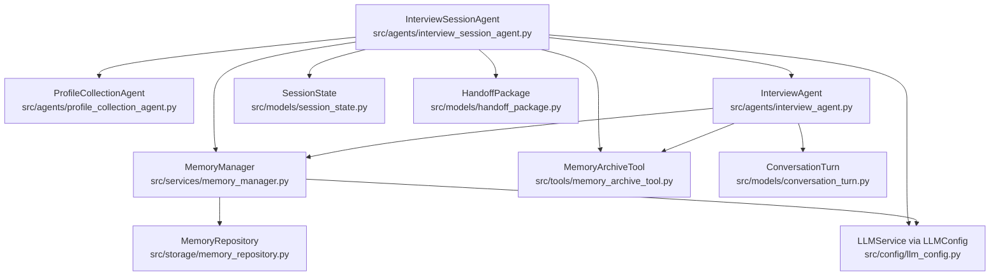
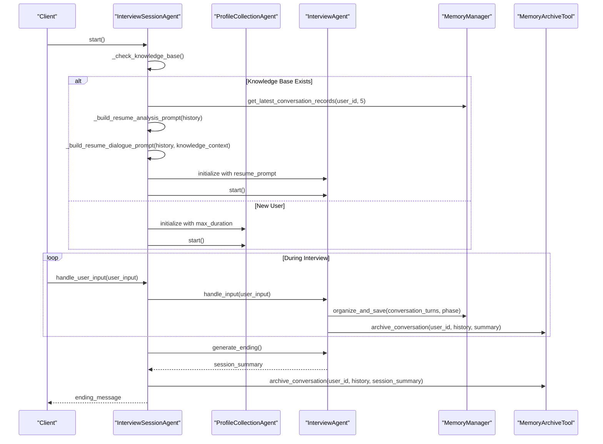
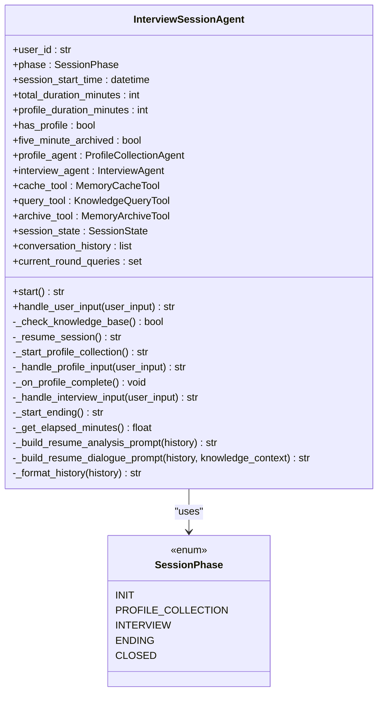
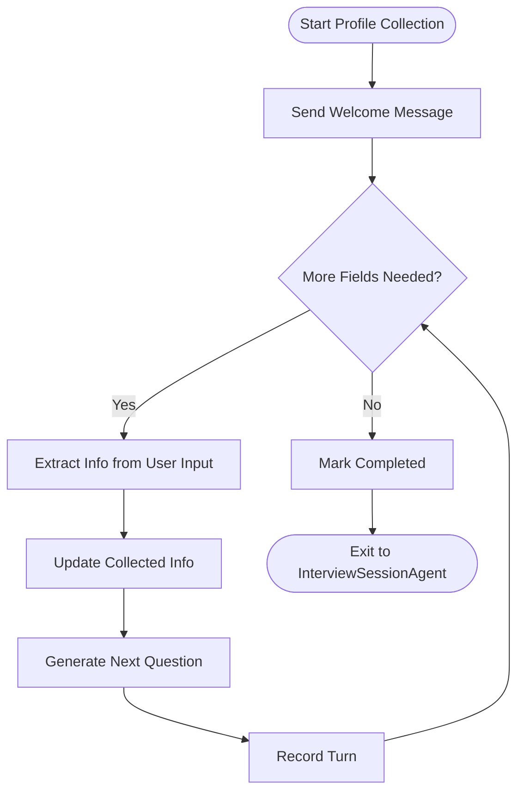
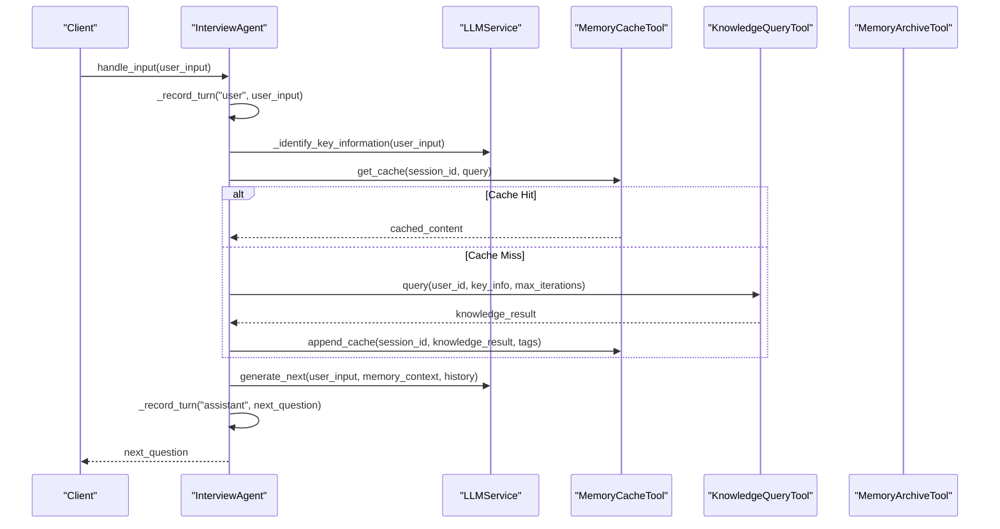
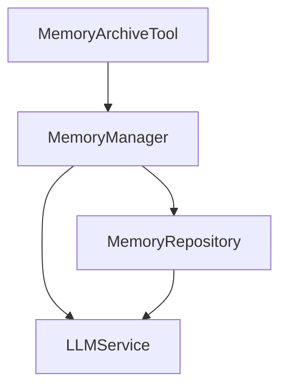
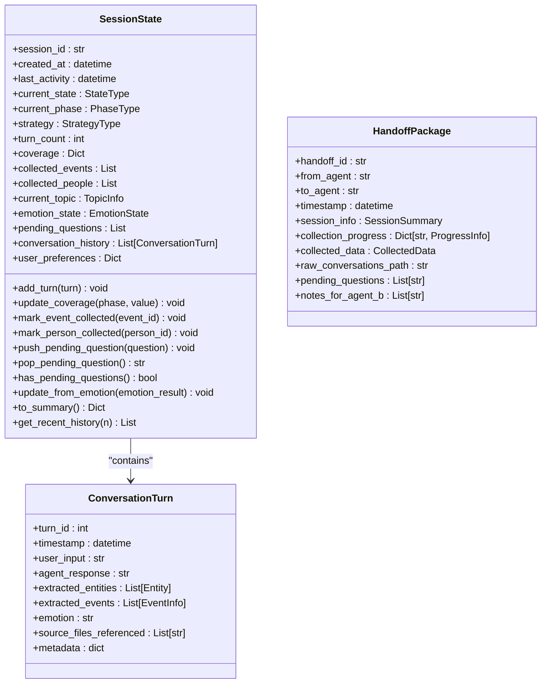
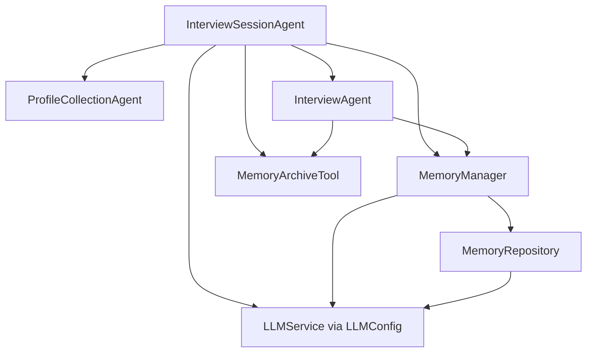

# Interview Session Agent

<cite>
**Referenced Files in This Document**
- [interview_session_agent.py](file://src/agents/interview_session_agent.py)
- [profile_collection_agent.py](file://src/agents/profile_collection_agent.py)
- [interview_agent.py](file://src/agents/interview_agent.py)
- [memory_manager.py](file://src/services/memory_manager.py)
- [memory_repository.py](file://src/storage/memory_repository.py)
- [memory_archive_tool.py](file://src/tools/memory_archive_tool.py)
- [session_state.py](file://src/models/session_state.py)
- [conversation_turn.py](file://src/models/conversation_turn.py)
- [handoff_package.py](file://src/models/handoff_package.py)
- [llm_config.py](file://src/config/llm_config.py)
- [test_interview_session_agent.py](file://tests/test_interview_session_agent.py)
</cite>

## Table of Contents
1. [Introduction](#introduction)
2. [Project Structure](#project-structure)
3. [Core Components](#core-components)
4. [Architecture Overview](#architecture-overview)
5. [Detailed Component Analysis](#detailed-component-analysis)
6. [Dependency Analysis](#dependency-analysis)
7. [Performance Considerations](#performance-considerations)
8. [Troubleshooting Guide](#troubleshooting-guide)
9. [Conclusion](#conclusion)
10. [Appendices](#appendices)

## Introduction
The InterviewSessionAgent orchestrates the complete lifecycle of a single interview session with a user. It coordinates initialization, ongoing conversation management, and session completion while integrating with supporting agents and services. The agent ensures coherent narrative flow, maintains conversation context, and prepares handoffs to downstream systems. It also handles time-based controls, knowledge base checks, and archival of session artifacts.

## Project Structure
The InterviewSessionAgent resides in the agents module and collaborates with services, tools, storage, and models across the system. The following diagram shows the primary components and their relationships.

**Diagram sources**
- [interview_session_agent.py:33-482](file://src/agents/interview_session_agent.py#L33-L482)
- [profile_collection_agent.py:14-275](file://src/agents/profile_collection_agent.py#L14-L275)
- [interview_agent.py:16-346](file://src/agents/interview_agent.py#L16-L346)
- [memory_manager.py:27-470](file://src/services/memory_manager.py#L27-L470)
- [memory_repository.py:40-200](file://src/storage/memory_repository.py#L40-L200)
- [memory_archive_tool.py:10-112](file://src/tools/memory_archive_tool.py#L10-L112)
- [session_state.py:24-139](file://src/models/session_state.py#L24-L139)
- [conversation_turn.py:14-52](file://src/models/conversation_turn.py#L14-L52)
- [handoff_package.py:32-66](file://src/models/handoff_package.py#L32-L66)
- [llm_config.py:10-120](file://src/config/llm_config.py#L10-L120)

**Section sources**
- [interview_session_agent.py:1-482](file://src/agents/interview_session_agent.py#L1-L482)
- [profile_collection_agent.py:1-275](file://src/agents/profile_collection_agent.py#L1-L275)
- [interview_agent.py:1-346](file://src/agents/interview_agent.py#L1-L346)
- [memory_manager.py:1-470](file://src/services/memory_manager.py#L1-L470)
- [memory_repository.py:1-200](file://src/storage/memory_repository.py#L1-L200)
- [memory_archive_tool.py:1-112](file://src/tools/memory_archive_tool.py#L1-L112)
- [session_state.py:1-139](file://src/models/session_state.py#L1-L139)
- [conversation_turn.py:1-52](file://src/models/conversation_turn.py#L1-L52)
- [handoff_package.py:1-66](file://src/models/handoff_package.py#L1-L66)
- [llm_config.py:1-120](file://src/config/llm_config.py#L1-L120)

## Core Components
- InterviewSessionAgent: Central coordinator for session lifecycle, time control, and integration with child agents and tools.
- ProfileCollectionAgent: Collects user profile information and initializes knowledge base content.
- InterviewAgent: Manages the main interview conversation, question generation, knowledge queries, and time warnings.
- MemoryManager and MemoryRepository: Provide structured memory organization, long-term storage, and retrieval.
- MemoryArchiveTool: Archives conversations and creates user knowledge bases.
- SessionState and ConversationTurn: Core data models for session state and conversation turns.
- HandoffPackage: Structured package for transitioning to downstream systems.
- LLMConfig: Provides LLM configuration for all agents and services.

**Section sources**
- [interview_session_agent.py:33-110](file://src/agents/interview_session_agent.py#L33-L110)
- [profile_collection_agent.py:14-63](file://src/agents/profile_collection_agent.py#L14-L63)
- [interview_agent.py:16-79](file://src/agents/interview_agent.py#L16-L79)
- [memory_manager.py:27-61](file://src/services/memory_manager.py#L27-L61)
- [memory_repository.py:40-88](file://src/storage/memory_repository.py#L40-L88)
- [memory_archive_tool.py:10-30](file://src/tools/memory_archive_tool.py#L10-L30)
- [session_state.py:24-86](file://src/models/session_state.py#L24-L86)
- [conversation_turn.py:14-52](file://src/models/conversation_turn.py#L14-L52)
- [handoff_package.py:32-66](file://src/models/handoff_package.py#L32-L66)
- [llm_config.py:10-41](file://src/config/llm_config.py#L10-L41)

## Architecture Overview
The InterviewSessionAgent coordinates three major phases:
- Initialization: Checks for existing knowledge base; if absent, starts ProfileCollectionAgent.
- Interview: Uses InterviewAgent to manage conversation, time limits, and knowledge integration.
- Ending: Generates a summary, archives the session, and transitions to closed state.

**Diagram sources**
- [interview_session_agent.py:112-392](file://src/agents/interview_session_agent.py#L112-L392)
- [profile_collection_agent.py:98-166](file://src/agents/profile_collection_agent.py#L98-L166)
- [interview_agent.py:80-184](file://src/agents/interview_agent.py#L80-L184)
- [memory_manager.py:111-156](file://src/services/memory_manager.py#L111-L156)
- [memory_archive_tool.py:61-112](file://src/tools/memory_archive_tool.py#L61-L112)

## Detailed Component Analysis

### InterviewSessionAgent
Responsibilities:
- Session lifecycle management (init, profile collection, interview, ending, closed).
- Time control: 15-minute total session, with 5-minute profile cap and 10-minute interview cap for new users.
- Knowledge base check and restoration logic.
- Coordination of child agents and tools.
- Conversation history maintenance and context building.

Key behaviors:
- Knowledge base existence check validates directory structure and presence of non-index Markdown files.
- Resume logic builds analysis and dialogue prompts to continue from recent history.
- Interview phase triggers early archiving after five minutes and ends with summary generation and archival.
- Transition to closed state after ending completes.

**Diagram sources**
- [interview_session_agent.py:24-110](file://src/agents/interview_session_agent.py#L24-L110)
- [interview_session_agent.py:112-482](file://src/agents/interview_session_agent.py#L112-L482)

**Section sources**
- [interview_session_agent.py:33-110](file://src/agents/interview_session_agent.py#L33-L110)
- [interview_session_agent.py:112-177](file://src/agents/interview_session_agent.py#L112-L177)
- [interview_session_agent.py:178-242](file://src/agents/interview_session_agent.py#L178-L242)
- [interview_session_agent.py:243-269](file://src/agents/interview_session_agent.py#L243-L269)
- [interview_session_agent.py:271-392](file://src/agents/interview_session_agent.py#L271-L392)
- [interview_session_agent.py:401-475](file://src/agents/interview_session_agent.py#L401-L475)
- [interview_session_agent.py:477-482](file://src/agents/interview_session_agent.py#L477-L482)

### ProfileCollectionAgent
Responsibilities:
- Collects user profile information across multiple rounds.
- Extracts structured information from user responses.
- Generates natural follow-up questions based on collected data.
- Ends either when required fields are complete or when time exceeds the profile duration.

**Diagram sources**
- [profile_collection_agent.py:98-166](file://src/agents/profile_collection_agent.py#L98-L166)

**Section sources**
- [profile_collection_agent.py:14-63](file://src/agents/profile_collection_agent.py#L14-L63)
- [profile_collection_agent.py:98-166](file://src/agents/profile_collection_agent.py#L98-L166)
- [profile_collection_agent.py:168-227](file://src/agents/profile_collection_agent.py#L168-L227)
- [profile_collection_agent.py:228-275](file://src/agents/profile_collection_agent.py#L228-L275)

### InterviewAgent
Responsibilities:
- Manages the main interview conversation with time-based controls.
- Identifies key information (events, persons, time points, locations) from user responses.
- Queries knowledge base and updates cache accordingly.
- Generates next questions and adds time warnings near session end.
- Produces a session summary and ending guidance.

**Diagram sources**
- [interview_agent.py:115-184](file://src/agents/interview_agent.py#L115-L184)
- [interview_agent.py:186-243](file://src/agents/interview_agent.py#L186-L243)

**Section sources**
- [interview_agent.py:16-79](file://src/agents/interview_agent.py#L16-L79)
- [interview_agent.py:115-184](file://src/agents/interview_agent.py#L115-L184)
- [interview_agent.py:186-243](file://src/agents/interview_agent.py#L186-L243)
- [interview_agent.py:244-272](file://src/agents/interview_agent.py#L244-L272)
- [interview_agent.py:274-282](file://src/agents/interview_agent.py#L274-L282)
- [interview_agent.py:284-314](file://src/agents/interview_agent.py#L284-L314)
- [interview_agent.py:315-346](file://src/agents/interview_agent.py#L315-L346)

### Memory Management and Archival
- MemoryManager organizes conversation turns into structured memory (events, people, timeline) and applies updates to long-term storage.
- MemoryRepository provides short-term memory, LRU caching, and persistent storage via MarkdownFileManager.
- MemoryArchiveTool creates user knowledge bases during initialization and archives conversations at checkpoints and session end.

**Diagram sources**
- [memory_manager.py:27-61](file://src/services/memory_manager.py#L27-L61)
- [memory_repository.py:40-88](file://src/storage/memory_repository.py#L40-L88)
- [memory_archive_tool.py:10-30](file://src/tools/memory_archive_tool.py#L10-L30)

**Section sources**
- [memory_manager.py:111-156](file://src/services/memory_manager.py#L111-L156)
- [memory_manager.py:158-193](file://src/services/memory_manager.py#L158-L193)
- [memory_manager.py:214-248](file://src/services/memory_manager.py#L214-L248)
- [memory_manager.py:324-342](file://src/services/memory_manager.py#L324-L342)
- [memory_repository.py:111-162](file://src/storage/memory_repository.py#L111-L162)
- [memory_repository.py:176-200](file://src/storage/memory_repository.py#L176-L200)
- [memory_archive_tool.py:31-59](file://src/tools/memory_archive_tool.py#L31-L59)
- [memory_archive_tool.py:61-112](file://src/tools/memory_archive_tool.py#L61-L112)

### Data Models and Handoff
- SessionState captures session-wide state, progress, coverage, and conversation history.
- ConversationTurn represents individual turns with extracted entities and metadata.
- HandoffPackage encapsulates collected data and progress for downstream consumption.

**Diagram sources**
- [session_state.py:24-139](file://src/models/session_state.py#L24-L139)
- [conversation_turn.py:14-52](file://src/models/conversation_turn.py#L14-L52)
- [handoff_package.py:32-66](file://src/models/handoff_package.py#L32-L66)

**Section sources**
- [session_state.py:24-139](file://src/models/session_state.py#L24-L139)
- [conversation_turn.py:14-52](file://src/models/conversation_turn.py#L14-L52)
- [handoff_package.py:32-66](file://src/models/handoff_package.py#L32-L66)

## Dependency Analysis
- InterviewSessionAgent depends on child agents (ProfileCollectionAgent, InterviewAgent), MemoryManager, MemoryArchiveTool, and LLMService configured via LLMConfig.
- InterviewAgent depends on MemoryManager and MemoryArchiveTool for archival and MemoryCacheTool for caching.
- MemoryManager depends on MemoryRepository and LLMService for organizing and saving memory.
- MemoryRepository integrates with MarkdownFileManager and KnowledgeBaseQuerier for persistence and querying.

**Diagram sources**
- [interview_session_agent.py:7-20](file://src/agents/interview_session_agent.py#L7-L20)
- [interview_agent.py:6-11](file://src/agents/interview_agent.py#L6-L11)
- [memory_manager.py:47-61](file://src/services/memory_manager.py#L47-L61)
- [memory_repository.py:54-87](file://src/storage/memory_repository.py#L54-L87)
- [llm_config.py:10-41](file://src/config/llm_config.py#L10-L41)

**Section sources**
- [interview_session_agent.py:7-20](file://src/agents/interview_session_agent.py#L7-L20)
- [interview_agent.py:6-11](file://src/agents/interview_agent.py#L6-L11)
- [memory_manager.py:47-61](file://src/services/memory_manager.py#L47-L61)
- [memory_repository.py:54-87](file://src/storage/memory_repository.py#L54-L87)
- [llm_config.py:10-41](file://src/config/llm_config.py#L10-L41)

## Performance Considerations
- Time-based controls: The agent enforces strict time limits to maintain session pacing and prevent extended sessions.
- Caching: Knowledge queries are cached to reduce repeated retrievals and improve responsiveness.
- Asynchronous operations: InterviewAgent performs parallel operations for key information identification and knowledge queries.
- Memory organization: Structured memory updates are applied asynchronously to minimize latency.

[No sources needed since this section provides general guidance]

## Troubleshooting Guide
Common issues and resolutions:
- Knowledge base not detected: Ensure the knowledge base directory exists and contains required subdirectories and at least one non-index Markdown file.
- Initialization hangs: Verify ProfileCollectionAgent completes required fields or times out after the profile duration.
- Interview session not ending: Confirm InterviewAgent reaches time threshold or explicitly signals completion.
- Archival failures: Check MemoryArchiveTool logs for exceptions during conversation archival or memory organization.

Validation via tests:
- Knowledge base structure validation tests cover missing directories, only index.md present, and successful detection with additional files.

**Section sources**
- [test_interview_session_agent.py:16-77](file://tests/test_interview_session_agent.py#L16-L77)

## Conclusion
The InterviewSessionAgent provides a robust orchestration layer for managing the entire interview lifecycle. By coordinating initialization, ongoing conversation management, and session completion, it ensures coherent narrative flow, maintains conversation context, and integrates seamlessly with memory and archival services. Its time-based controls, caching strategies, and structured data models support efficient and reliable operation across diverse user interactions.

## Appendices

### Full Session Workflow Examples
- New user session:
  1. InterviewSessionAgent.start() checks knowledge base and finds none.
  2. Starts ProfileCollectionAgent with a 5-minute cap.
  3. On completion or timeout, creates user knowledge base and transitions to InterviewAgent with 10-minute cap.
  4. During interview, archives at 5 minutes and continues until time limit.
  5. Generates ending, archives session, and closes.

- Returning user session:
  1. InterviewSessionAgent.start() detects existing knowledge base.
  2. Loads recent conversation history and builds analysis and resume prompts.
  3. Initializes InterviewAgent with resume prompt and continues interview.
  4. Archives at 5 minutes and ends with summary.

[No sources needed since this section summarizes workflows conceptually]