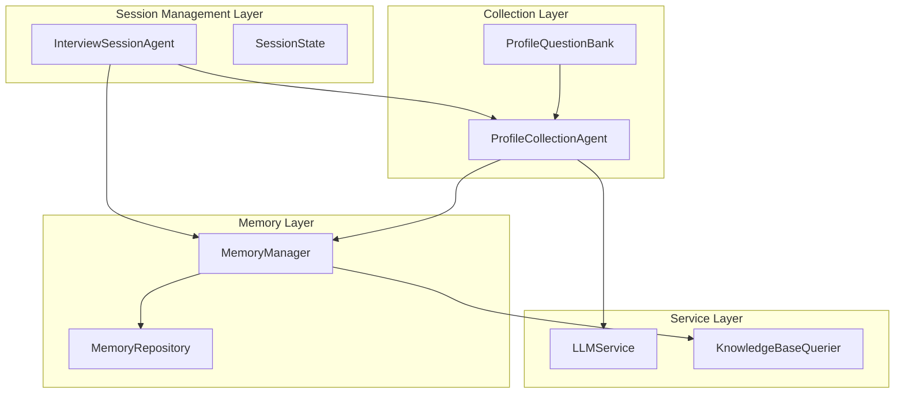
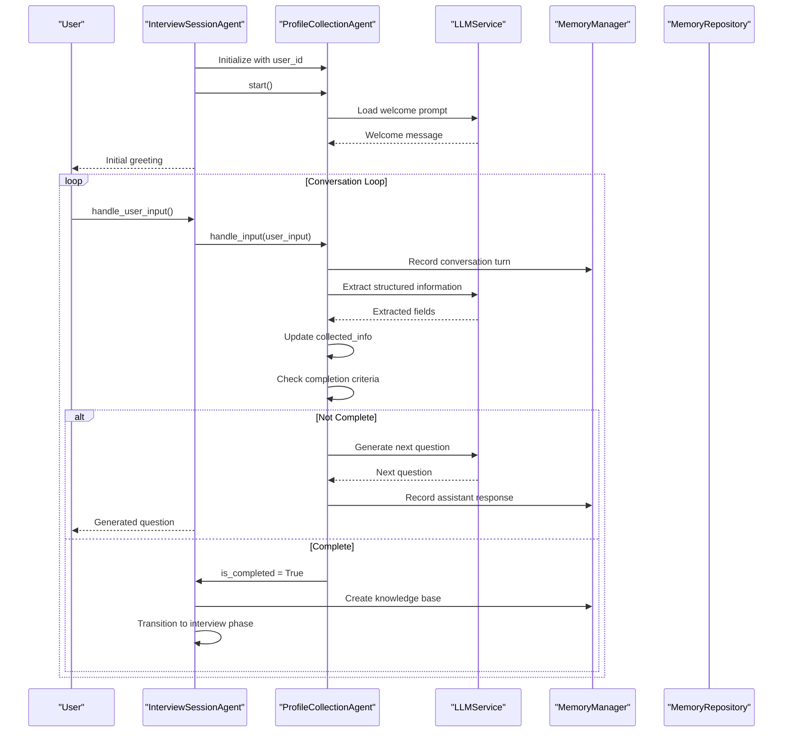
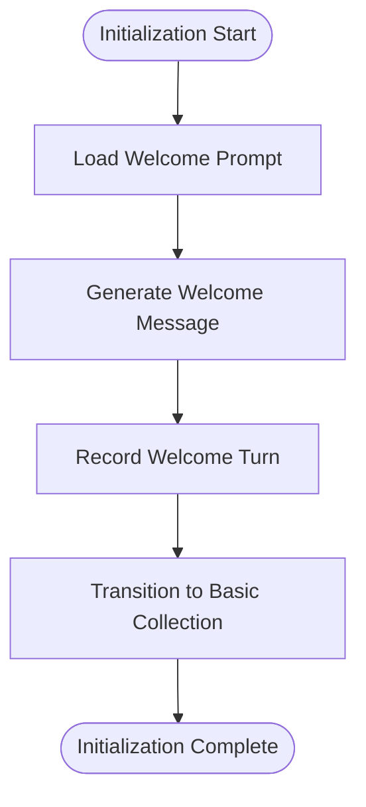
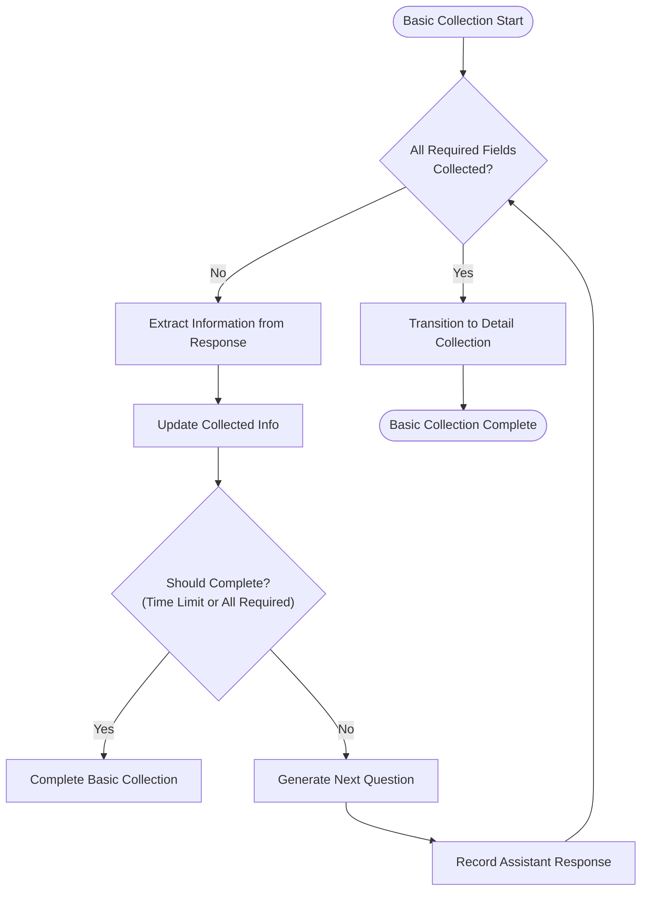
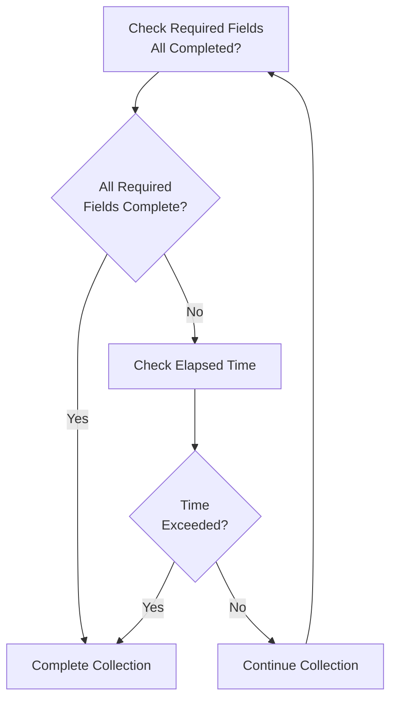
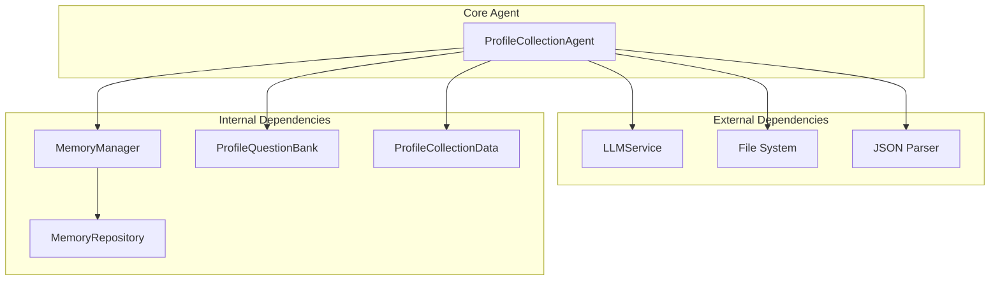

# Profile Collection Agent

<cite>
**Referenced Files in This Document**
- [profile_collection_agent.py](file://src/agents/profile_collection_agent.py)
- [profile_questions.py](file://src/config/profile_questions.py)
- [ProfileCollection-Prompt.md](file://Prompts/ProfileCollection-Prompt.md)
- [interview_session_agent.py](file://src/agents/interview_session_agent.py)
- [memory_manager.py](file://src/services/memory_manager.py)
- [memory_repository.py](file://src/storage/memory_repository.py)
- [session_state.py](file://src/models/session_state.py)
- [state_type.py](file://src/enums/state_type.py)
- [phase_type.py](file://src/enums/phase_type.py)
- [integration_test_new_user.py](file://integration_test_new_user.py)
</cite>

## Table of Contents
1. [Introduction](#introduction)
2. [Project Structure](#project-structure)
3. [Core Components](#core-components)
4. [Architecture Overview](#architecture-overview)
5. [Detailed Component Analysis](#detailed-component-analysis)
6. [Dependency Analysis](#dependency-analysis)
7. [Performance Considerations](#performance-considerations)
8. [Troubleshooting Guide](#troubleshooting-guide)
9. [Conclusion](#conclusion)

## Introduction
The ProfileCollectionAgent is responsible for the initial user onboarding and information gathering process in the elderly autobiography writing system. It implements a progressive disclosure approach to collect user profile information through natural conversation, transitioning from basic demographics to personal history and preferences. The agent integrates with the ProfileQuestionBank for structured question management and coordinates with the broader interview session workflow through the InterviewSessionAgent.

The agent follows a three-phase collection process: initialization, basic information gathering, and detailed information collection. It manages state throughout the collection process, determines completion criteria, and prepares users for the main interview process by generating a foundational knowledge base.

## Project Structure
The ProfileCollectionAgent is part of a larger conversational AI system designed for elderly autobiography writing. The system follows a layered architecture with clear separation of concerns:

**Diagram sources**
- [interview_session_agent.py:71-122](file://src/agents/interview_session_agent.py#L71-L122)
- [profile_collection_agent.py:14-49](file://src/agents/profile_collection_agent.py#L14-L49)
- [memory_manager.py:27-61](file://src/services/memory_manager.py#L27-L61)

**Section sources**
- [profile_collection_agent.py:14-32](file://src/agents/profile_collection_agent.py#L14-L32)
- [interview_session_agent.py:71-122](file://src/agents/interview_session_agent.py#L71-L122)

## Core Components

### ProfileCollectionAgent
The ProfileCollectionAgent serves as the primary orchestrator for user initialization and information gathering. It maintains conversation state, manages the three-phase collection process, and integrates with external services for memory management and LLM processing.

Key responsibilities include:
- Progressive disclosure of questions through natural conversation
- Structured information extraction from user responses
- State management throughout the collection process
- Integration with MemoryManager for knowledge base creation
- Coordination with InterviewSessionAgent for session lifecycle management

**Section sources**
- [profile_collection_agent.py:14-32](file://src/agents/profile_collection_agent.py#L14-L32)
- [profile_collection_agent.py:34-63](file://src/agents/profile_collection_agent.py#L34-L63)

### ProfileQuestionBank
The ProfileQuestionBank provides structured question management with categorized fields and conditional logic. It defines the complete set of questions for both basic and detailed information collection phases.

Structure categories:
- **Basic Information Questions**: Essential demographic and contact information
- **Detailed Information Questions**: Personal history, family context, and preferences
- **Transition Phrases**: Natural progression between collection phases

**Section sources**
- [profile_questions.py:3-94](file://src/config/profile_questions.py#L3-L94)

### InterviewSessionAgent Integration
The InterviewSessionAgent coordinates the overall session lifecycle, managing the transition from profile collection to the main interview process. It handles session timing, knowledge base checking, and seamless handoff between collection and interview phases.

**Section sources**
- [interview_session_agent.py:71-122](file://src/agents/interview_session_agent.py#L71-L122)
- [interview_session_agent.py:210-300](file://src/agents/interview_session_agent.py#L210-L300)

## Architecture Overview

The ProfileCollectionAgent operates within a sophisticated conversational AI architecture that emphasizes natural dialogue and progressive information gathering:

**Diagram sources**
- [interview_session_agent.py:238-261](file://src/agents/interview_session_agent.py#L238-L261)
- [profile_collection_agent.py:130-166](file://src/agents/profile_collection_agent.py#L130-L166)
- [memory_manager.py:111-156](file://src/services/memory_manager.py#L111-L156)

## Detailed Component Analysis

### Three-Phase Collection Process

The ProfileCollectionAgent implements a carefully designed three-phase approach to information gathering:

#### Phase 1: Initialization (INIT_PROFILE)
The initialization phase establishes the foundation for the conversation and sets up the collection framework. During this phase, the agent generates a warm welcome message and transitions into the basic information collection phase.

**Diagram sources**
- [profile_collection_agent.py:98-128](file://src/agents/profile_collection_agent.py#L98-L128)

#### Phase 2: Basic Information Gathering (COLLECT_BASIC)
The basic information phase focuses on essential demographic and contact information. The agent systematically collects required fields while maintaining conversational flow and natural dialogue patterns.

Required fields collection order:
1. **Name** - Establishes personal connection and respectful address
2. **Age** - Critical for age-appropriate conversation and context
3. **Occupation** - Provides professional background and life experiences
4. **Family Status** - Important social context and relationships
5. **Living Arrangement** - Current living situation and support network
6. **Story Expectation** - Primary motivation and desired focus areas

**Diagram sources**
- [profile_collection_agent.py:130-166](file://src/agents/profile_collection_agent.py#L130-L166)
- [profile_collection_agent.py:214-226](file://src/agents/profile_collection_agent.py#L214-L226)

#### Phase 3: Detailed Information Collection (COLLECT_DETAIL)
The detailed information phase expands beyond basic demographics to capture personal history, family context, health status, and individual preferences. This phase enables deeper understanding of the user's life experiences and motivations.

Detailed field categories:
- **Family Information**: Children count, relationships, family dynamics
- **Health Status**: Physical condition and care needs
- **Personal Preferences**: Significant people, favorite memories, story expectations
- **Life Context**: Important persons who shaped their journey

**Section sources**
- [profile_questions.py:43-87](file://src/config/profile_questions.py#L43-L87)

### Progressive Disclosure Approach

The agent employs sophisticated progressive disclosure techniques to maintain natural conversation flow while systematically gathering information:

#### Natural Question Generation
Questions are generated dynamically based on:
- Previously collected information
- Conversation context and recent responses
- Field priority and completion status
- User engagement patterns and response quality

#### Context-Aware Responses
The agent maintains awareness of:
- Recent conversation history (last 6 turns)
- Field collection progress
- User response patterns and engagement levels
- Timing considerations and session duration limits

**Section sources**
- [profile_collection_agent.py:228-254](file://src/agents/profile_collection_agent.py#L228-L254)
- [profile_collection_agent.py:269-275](file://src/agents/profile_collection_agent.py#L269-L275)

### State Management and Completion Criteria

The ProfileCollectionAgent implements robust state management with multiple completion criteria:

#### Required Fields Tracking
The agent maintains explicit tracking of essential information:
- **Mandatory Fields**: name, age, occupation, family_status, living_arrangement, story_expectation
- **Optional Fields**: Additional context and preference information
- **Field Validation**: Ensures meaningful responses rather than placeholder answers

#### Time-Based Completion
Session duration management ensures efficient information gathering:
- **Maximum Duration**: 5 minutes for profile collection phase
- **Elapsed Time Monitoring**: Real-time tracking of conversation duration
- **Graceful Timeout**: Automatic completion when time limit reached

#### Completion Decision Logic

**Diagram sources**
- [profile_collection_agent.py:214-226](file://src/agents/profile_collection_agent.py#L214-L226)

**Section sources**
- [profile_collection_agent.py:214-226](file://src/agents/profile_collection_agent.py#L214-L226)

### Integration with ProfileQuestionBank

The agent seamlessly integrates with the ProfileQuestionBank for structured question management:

#### Question Selection Logic
Questions are selected based on:
- Field availability and collection status
- Conditional requirements and prerequisites
- Response quality and engagement indicators
- Conversation flow and natural progression

#### Dynamic Question Adaptation
The agent adapts question presentation based on:
- User response content and context
- Field interdependencies and logical relationships
- Personalization opportunities and respectful addressing
- Cultural sensitivity and age-appropriate communication

**Section sources**
- [profile_questions.py:3-94](file://src/config/profile_questions.py#L3-L94)

### Memory Management Integration

The ProfileCollectionAgent coordinates with the MemoryManager for knowledge base creation and persistence:

#### Conversation History Management
- **Turn Recording**: Comprehensive logging of all conversation exchanges
- **Context Preservation**: Maintaining conversation flow and continuity
- **History Formatting**: Structured representation for downstream processing

#### Knowledge Base Creation
- **Structured Extraction**: Transforming conversational data into structured profiles
- **Memory Organization**: Integrating new information with existing knowledge base
- **Persistence Layer**: Ensuring reliable storage and future retrieval

**Section sources**
- [memory_manager.py:111-156](file://src/services/memory_manager.py#L111-L156)
- [memory_repository.py:103-110](file://src/storage/memory_repository.py#L103-L110)

### Session Lifecycle Integration

The agent participates in the broader session lifecycle managed by the InterviewSessionAgent:

#### Phase Transitions
Seamless handoff from profile collection to interview phase:
- **Completion Detection**: Automatic recognition of collection completion
- **Knowledge Base Activation**: Creation of foundational knowledge base
- **Interview Preparation**: Setup for main interview process
- **Resource Cleanup**: Proper session termination and resource release

#### Timing Coordination
Integration with overall session timing:
- **Profile Collection Window**: Dedicated 5-minute collection period
- **Interview Phase Extension**: Remaining time allocated for main interview
- **Progressive Time Allocation**: Efficient use of available conversation time

**Section sources**
- [interview_session_agent.py:263-300](file://src/agents/interview_session_agent.py#L263-L300)

## Dependency Analysis

The ProfileCollectionAgent has well-defined dependencies that support its specialized role in the system:

**Diagram sources**
- [profile_collection_agent.py:7-9](file://src/agents/profile_collection_agent.py#L7-L9)
- [memory_manager.py:47-61](file://src/services/memory_manager.py#L47-L61)

### Coupling and Cohesion Analysis
The agent demonstrates strong internal cohesion around its core responsibilities while maintaining loose coupling with external services. This design enables:

- **Modular Design**: Clear separation of concerns and specialized functionality
- **Testability**: Independent testing capabilities for each component
- **Maintainability**: Isolated changes and focused modifications
- **Scalability**: Independent scaling of different system components

### Circular Dependency Prevention
The architecture prevents circular dependencies through:
- **Hierarchical Layering**: Clear top-to-bottom dependency direction
- **Interface Abstraction**: Well-defined service interfaces
- **Event-Driven Communication**: Loose coupling through event systems
- **Data Transfer Objects**: Structured data exchange patterns

**Section sources**
- [profile_collection_agent.py:7-9](file://src/agents/profile_collection_agent.py#L7-L9)
- [memory_manager.py:47-61](file://src/services/memory_manager.py#L47-L61)

## Performance Considerations

### Conversation Efficiency
The agent optimizes conversation efficiency through:
- **Intelligent Question Selection**: Minimizing redundant or repetitive questions
- **Context Awareness**: Leveraging conversation history for natural progression
- **Response Parsing**: Efficient extraction of structured information from unstructured input
- **Timing Management**: Balanced question frequency and response length

### Resource Optimization
Performance considerations include:
- **Memory Management**: Efficient handling of conversation history and collected data
- **LLM Call Optimization**: Strategic use of language model resources
- **Caching Strategies**: Leveraging previous interactions for improved response quality
- **Asynchronous Processing**: Non-blocking operations for better responsiveness

### Scalability Factors
The system design supports scalability through:
- **Stateless Operations**: Minimal state dependencies for horizontal scaling
- **Service-Oriented Architecture**: Independent service components
- **Asynchronous Workflows**: Concurrent processing capabilities
- **Resource Pooling**: Efficient utilization of computational resources

## Troubleshooting Guide

### Common Issues and Solutions

#### Issue: Incomplete Information Collection
**Symptoms**: Collection continues beyond 5 minutes or required fields remain empty
**Causes**: 
- User disengagement or lack of response
- Complex personal circumstances preventing information sharing
- Technical issues with LLM integration

**Solutions**:
- Implement gentle timeout reminders and natural conversation prompts
- Provide alternative question formats for sensitive topics
- Monitor and log collection progress for debugging

#### Issue: Information Extraction Failures
**Symptoms**: Structured extraction returns empty or incomplete results
**Causes**:
- Ambiguous user responses or vague information
- LLM parsing errors or response format issues
- Insufficient context for accurate extraction

**Solutions**:
- Implement fallback mechanisms for partial information
- Provide clarification questions for ambiguous responses
- Enhance prompt engineering for better extraction accuracy

#### Issue: Session Handoff Problems
**Symptoms**: Transition from collection to interview phase fails
**Causes**:
- Incomplete knowledge base creation
- Memory management errors during transition
- State synchronization issues between agents

**Solutions**:
- Verify knowledge base creation completion before handoff
- Implement retry mechanisms for memory operations
- Add comprehensive state validation checks

**Section sources**
- [profile_collection_agent.py:214-226](file://src/agents/profile_collection_agent.py#L214-L226)
- [interview_session_agent.py:263-300](file://src/agents/interview_session_agent.py#L263-L300)

### Debugging and Monitoring

#### Logging and Auditing
The system implements comprehensive logging for:
- **Conversation Tracking**: Complete dialogue history for analysis
- **System Events**: Agent state changes and operational metrics
- **Error Conditions**: Exception handling and recovery procedures
- **Performance Metrics**: Response times and resource utilization

#### Diagnostic Tools
Available diagnostic capabilities include:
- **State Inspection**: Real-time examination of agent state and progress
- **Conversation Analysis**: Review of collected information and response patterns
- **Integration Testing**: Verification of service connections and data flow
- **Performance Monitoring**: System resource usage and bottleneck identification

**Section sources**
- [profile_collection_agent.py:11-11](file://src/agents/profile_collection_agent.py#L11-L11)
- [integration_test_new_user.py:31-33](file://integration_test_new_user.py#L31-L33)

## Conclusion

The ProfileCollectionAgent represents a sophisticated implementation of conversational AI for elderly autobiography writing. Its progressive disclosure approach, combined with structured question management and seamless integration with the broader system, creates an effective foundation for meaningful user engagement.

The agent's three-phase collection process, robust state management, and careful consideration of user experience demonstrate thoughtful design principles. By maintaining natural conversation flow while systematically gathering essential information, the agent successfully bridges the gap between initial user onboarding and the main interview process.

The architectural decisions supporting this agent—clear separation of concerns, well-defined interfaces, and comprehensive integration with memory management—provide a solid foundation for continued system evolution and enhancement. The agent's performance considerations and troubleshooting capabilities ensure reliable operation in real-world scenarios.

Future enhancements could focus on expanding cultural sensitivity features, improving adaptive questioning strategies, and enhancing the transition to interview phases based on collected information quality and user engagement patterns.