# Biography Processing Models

<cite>
**Referenced Files in This Document**
- [README.md](file://README.md)
- [biography_models.py](file://src/models/biography_models.py)
- [biography_outline_state.py](file://src/models/biography_outline_state.py)
- [biography_writing_state.py](file://src/models/biography_writing_state.py)
- [biography_outline_agent.py](file://src/agents/biography_outline_agent.py)
- [biography_writing_agent.py](file://src/agents/biography_writing_agent.py)
- [biography_outline_graph.py](file://src/agents/biography_outline_graph.py)
- [biography_writing_graph.py](file://src/agents/biography_writing_graph.py)
- [biography_file_manager.py](file://src/services/biography_file_manager.py)
- [biography_material_analyzer.py](file://src/services/biography_material_analyzer.py)
- [llm_service.py](file://src/services/llm_service.py)
- [BiographyChapterReviewer-Prompt.md](file://src/prompts/BiographyChapterReviewer-Prompt.md)
- [QuestionGenerator-Prompt.md](file://src/prompts/QuestionGenerator-Prompt.md)
- [session_state.py](file://src/models/session_state.py)
- [phase_type.py](file://src/enums/phase_type.py)
- [state_type.py](file://src/enums/state_type.py)
</cite>

## Table of Contents
1. [Introduction](#introduction)
2. [System Architecture](#system-architecture)
3. [Core Data Models](#core-data-models)
4. [Outline Generation Pipeline](#outline-generation-pipeline)
5. [Writing Generation Pipeline](#writing-generation-pipeline)
6. [File Management System](#file-management-system)
7. [Material Analysis Engine](#material-analysis-engine)
8. [LLM Integration Layer](#llm-integration-layer)
9. [State Management](#state-management)
10. [Processing Workflows](#processing-workflows)
11. [Performance Considerations](#performance-considerations)
12. [Troubleshooting Guide](#troubleshooting-guide)
13. [Conclusion](#conclusion)

## Introduction

The Biography Processing Models system is an intelligent framework designed to help elderly individuals record and preserve their life stories through automated biographical content generation. Built on advanced Large Language Model (LLM) capabilities, the system transforms collected interview materials into structured, publishable biographical works while maintaining historical accuracy and personal authenticity.

The system operates through two primary processing pipelines: **Outline Generation** and **Writing Generation**, each designed to handle specific aspects of biographical content creation. The architecture emphasizes incremental processing, quality assurance, and seamless integration between different processing stages.

## System Architecture

The Biography Processing System follows a modular architecture with clear separation of concerns across multiple layers:

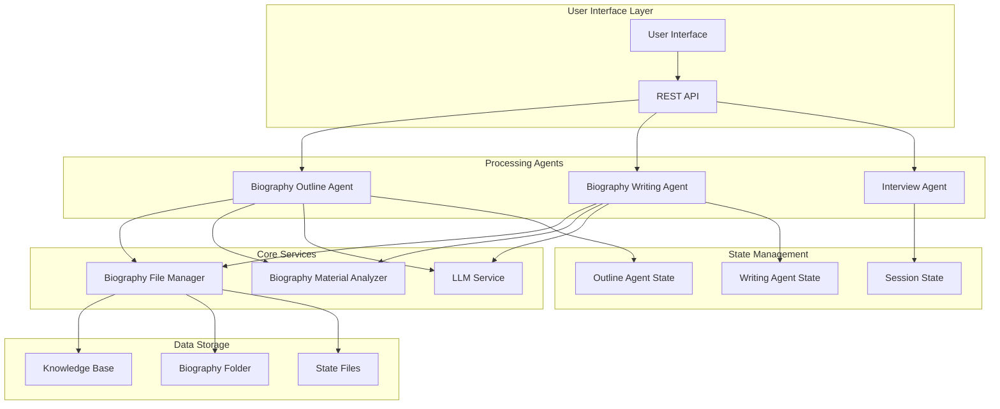
```mermaid
graph TB
subgraph "User Interface Layer"
UI[User Interface]
API[REST API]
end
subgraph "Processing Agents"
OutlineAgent[Biography Outline Agent]
WritingAgent[Biography Writing Agent]
InterviewAgent[Interview Agent]
end
subgraph "Core Services"
FileManager[Biography File Manager]
MaterialAnalyzer[Biography Material Analyzer]
LLMService[LLM Service]
end
subgraph "Data Storage"
KnowledgeBase[Knowledge Base]
BiographyFolder[Biography Folder]
StateFiles[State Files]
end
subgraph "State Management"
OutlineState[Outline Agent State]
WritingState[Writing Agent State]
SessionState[Session State]
end
UI --> API
API --> OutlineAgent
API --> WritingAgent
API --> InterviewAgent
OutlineAgent --> FileManager
OutlineAgent --> MaterialAnalyzer
OutlineAgent --> LLMService
WritingAgent --> FileManager
WritingAgent --> MaterialAnalyzer
WritingAgent --> LLMService
FileManager --> KnowledgeBase
FileManager --> BiographyFolder
FileManager --> StateFiles
OutlineAgent --> OutlineState
WritingAgent --> WritingState
InterviewAgent --> SessionState
```

**Diagram sources**
- [biography_outline_agent.py:27-64](file://src/agents/biography_outline_agent.py#L27-L64)
- [biography_writing_agent.py:25-53](file://src/agents/biography_writing_agent.py#L25-L53)
- [biography_file_manager.py:32-46](file://src/services/biography_file_manager.py#L32-L46)
- [llm_service.py:32-89](file://src/services/llm_service.py#L32-L89)

## Core Data Models

The system defines a comprehensive set of data models that serve as the foundation for all processing operations. These models ensure data consistency and enable seamless communication between different components.

### Chapter Status Enumeration

The system uses a sophisticated status tracking mechanism for chapters:

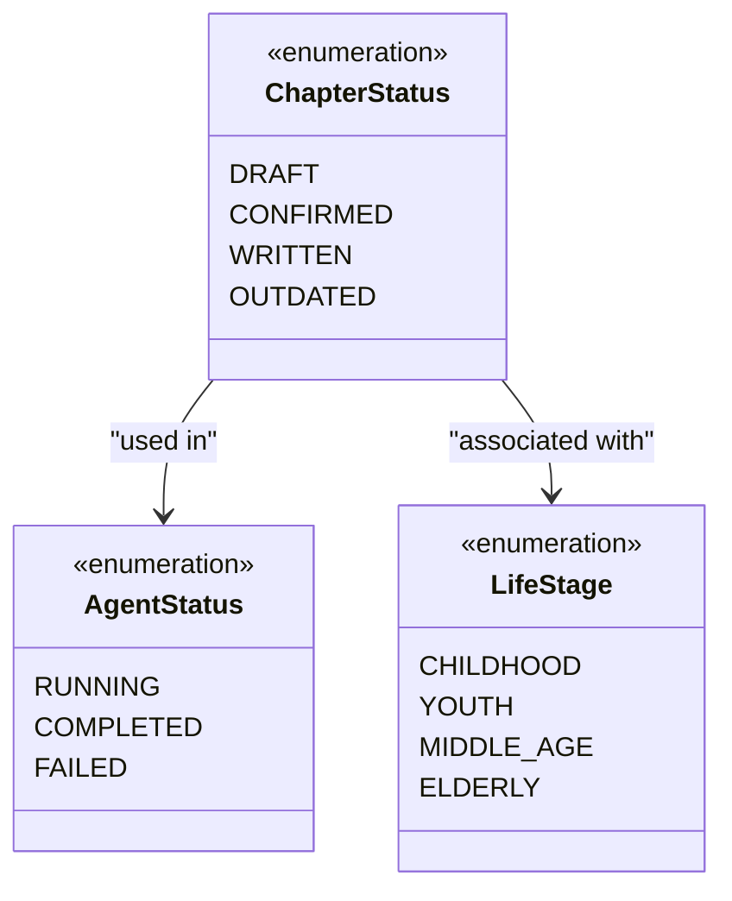
```mermaid
classDiagram
class ChapterStatus {
<<enumeration>>
DRAFT
CONFIRMED
WRITTEN
OUTDATED
}
class AgentStatus {
<<enumeration>>
RUNNING
COMPLETED
FAILED
}
class LifeStage {
<<enumeration>>
CHILDHOOD
YOUTH
MIDDLE_AGE
ELDERLY
}
ChapterStatus --> AgentStatus : "used in"
ChapterStatus --> LifeStage : "associated with"
```

**Diagram sources**
- [biography_models.py:15-39](file://src/models/biography_models.py#L15-L39)

### Document Structure Models

The core document models define the hierarchical structure of biographical content:

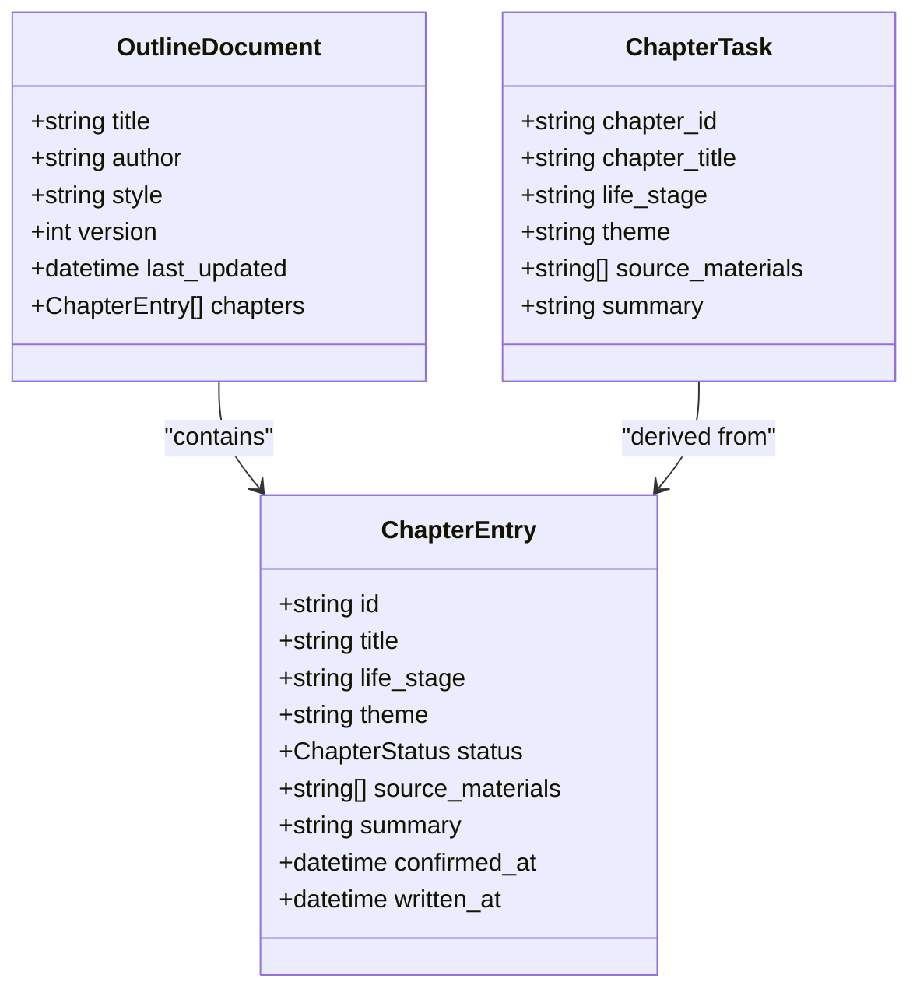
```mermaid
classDiagram
class ChapterEntry {
+string id
+string title
+string life_stage
+string theme
+ChapterStatus status
+string[] source_materials
+string summary
+datetime confirmed_at
+datetime written_at
}
class OutlineDocument {
+string title
+string author
+string style
+int version
+datetime last_updated
+ChapterEntry[] chapters
}
class ChapterTask {
+string chapter_id
+string chapter_title
+string life_stage
+string theme
+string[] source_materials
+string summary
}
OutlineDocument --> ChapterEntry : "contains"
ChapterTask --> ChapterEntry : "derived from"
```

**Diagram sources**
- [biography_models.py:41-118](file://src/models/biography_models.py#L41-L118)

**Section sources**
- [biography_models.py:1-127](file://src/models/biography_models.py#L1-L127)

## Outline Generation Pipeline

The Outline Generation Pipeline is responsible for analyzing collected materials and creating structured chapter outlines. This pipeline operates through a series of well-defined stages with incremental processing capabilities.

### Pipeline Architecture

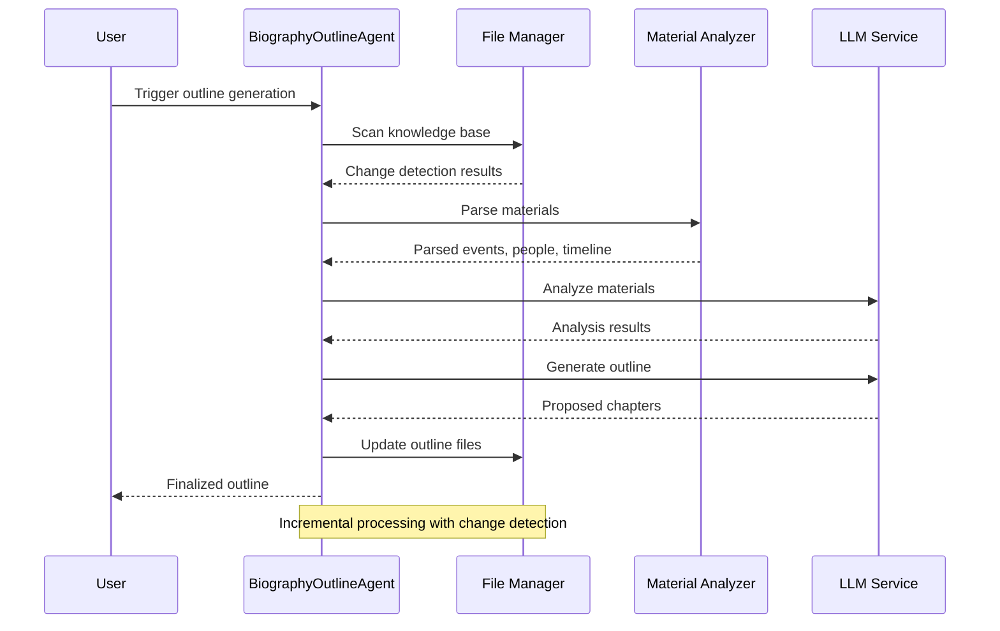
```mermaid
sequenceDiagram
participant User as User
participant Agent as BiographyOutlineAgent
participant FM as File Manager
participant MA as Material Analyzer
participant LLM as LLM Service
User->>Agent : Trigger outline generation
Agent->>FM : Scan knowledge base
FM-->>Agent : Change detection results
Agent->>MA : Parse materials
MA-->>Agent : Parsed events, people, timeline
Agent->>LLM : Analyze materials
LLM-->>Agent : Analysis results
Agent->>LLM : Generate outline
LLM-->>Agent : Proposed chapters
Agent->>FM : Update outline files
Agent-->>User : Finalized outline
Note over Agent,FM : Incremental processing with change detection
```

**Diagram sources**
- [biography_outline_agent.py:40-64](file://src/agents/biography_outline_agent.py#L40-L64)
- [biography_outline_graph.py:19-59](file://src/agents/biography_outline_graph.py#L19-L59)

### State Management

The outline generation process maintains detailed state information for tracking progress and managing incremental updates:

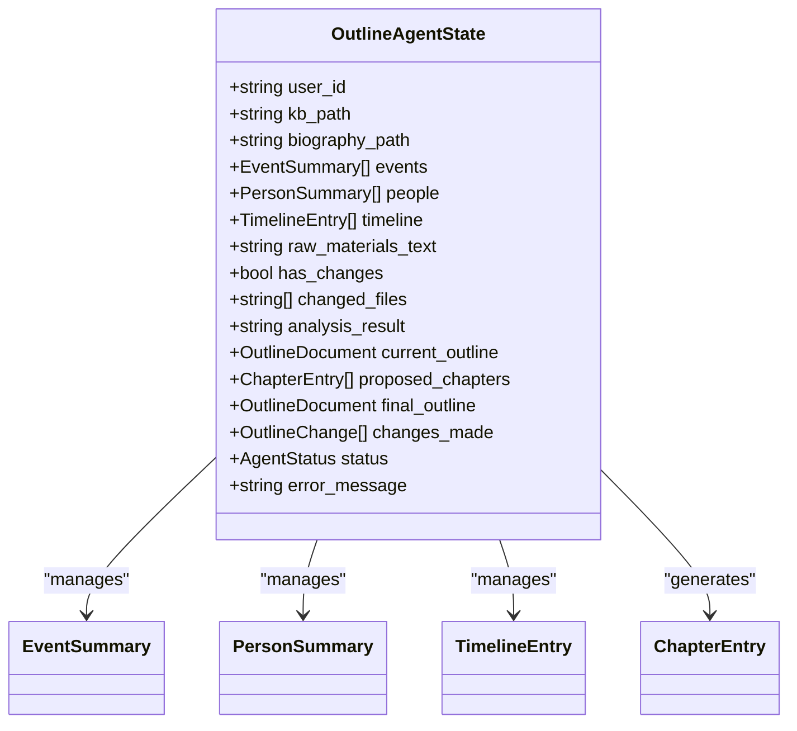
```mermaid
classDiagram
class OutlineAgentState {
+string user_id
+string kb_path
+string biography_path
+EventSummary[] events
+PersonSummary[] people
+TimelineEntry[] timeline
+string raw_materials_text
+bool has_changes
+string[] changed_files
+string analysis_result
+OutlineDocument current_outline
+ChapterEntry[] proposed_chapters
+OutlineDocument final_outline
+OutlineChange[] changes_made
+AgentStatus status
+string error_message
}
OutlineAgentState --> EventSummary : "manages"
OutlineAgentState --> PersonSummary : "manages"
OutlineAgentState --> TimelineEntry : "manages"
OutlineAgentState --> ChapterEntry : "generates"
```

**Diagram sources**
- [biography_outline_state.py:20-49](file://src/models/biography_outline_state.py#L20-L49)

**Section sources**
- [biography_outline_agent.py:68-322](file://src/agents/biography_outline_agent.py#L68-L322)
- [biography_outline_state.py:1-50](file://src/models/biography_outline_state.py#L1-L50)

## Writing Generation Pipeline

The Writing Generation Pipeline transforms confirmed chapter outlines into complete biographical chapters through iterative writing, review, and refinement processes.

### Writing Workflow

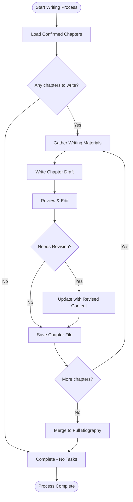
```mermaid
flowchart TD
Start([Start Writing Process]) --> LoadTasks[Load Confirmed Chapters]
LoadTasks --> HasTasks{Any chapters to write?}
HasTasks --> |No| Complete[Complete - No Tasks]
HasTasks --> |Yes| GatherMaterials[Gather Writing Materials]
GatherMaterials --> WriteChapter[Write Chapter Draft]
WriteChapter --> ReviewChapter[Review & Edit]
ReviewChapter --> NeedsRevision{Needs Revision?}
NeedsRevision --> |Yes| UpdateDraft[Update with Revised Content]
NeedsRevision --> |No| SaveChapter[Save Chapter File]
UpdateDraft --> SaveChapter
SaveChapter --> NextChapter{More chapters?}
NextChapter --> |Yes| GatherMaterials
NextChapter --> |No| MergeBiography[Merge to Full Biography]
MergeBiography --> Complete
Complete --> End([Process Complete])
```

**Diagram sources**
- [biography_writing_agent.py:57-279](file://src/agents/biography_writing_agent.py#L57-L279)
- [biography_writing_graph.py:24-63](file://src/agents/biography_writing_graph.py#L24-L63)

### Writing State Management

The writing pipeline maintains comprehensive state tracking for each chapter and the overall writing process:

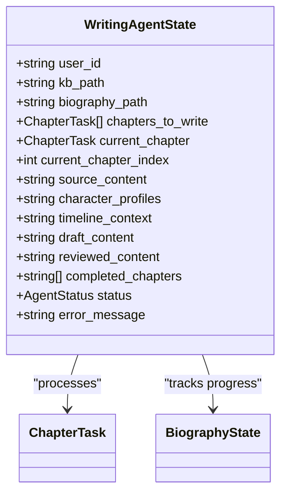
```mermaid
classDiagram
class WritingAgentState {
+string user_id
+string kb_path
+string biography_path
+ChapterTask[] chapters_to_write
+ChapterTask current_chapter
+int current_chapter_index
+string source_content
+string character_profiles
+string timeline_context
+string draft_content
+string reviewed_content
+string[] completed_chapters
+AgentStatus status
+string error_message
}
WritingAgentState --> ChapterTask : "processes"
WritingAgentState --> BiographyState : "tracks progress"
```

**Diagram sources**
- [biography_writing_state.py:12-39](file://src/models/biography_writing_state.py#L12-L39)

**Section sources**
- [biography_writing_agent.py:38-279](file://src/agents/biography_writing_agent.py#L38-L279)
- [biography_writing_state.py:1-40](file://src/models/biography_writing_state.py#L1-L40)

## File Management System

The File Management System serves as the backbone for all file operations, providing robust mechanisms for reading, writing, and organizing biographical content across multiple processing stages.

### File Operations Architecture

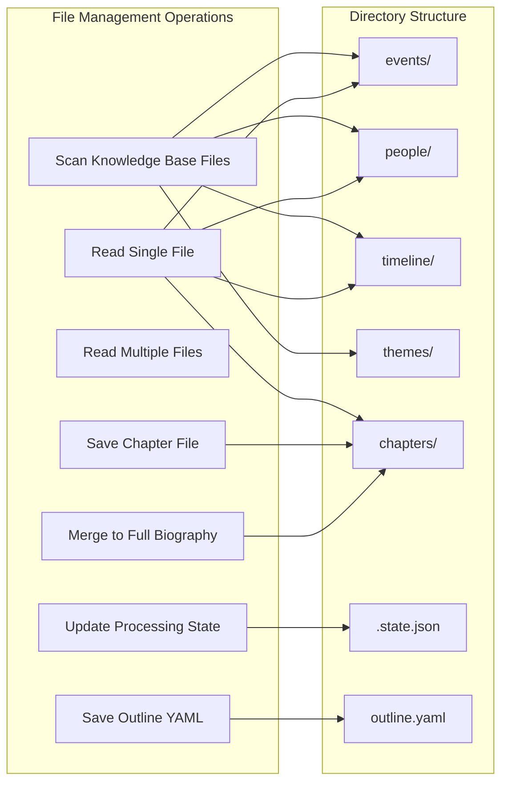
```mermaid
graph LR
subgraph "File Management Operations"
ScanFiles[Scan Knowledge Base Files]
ReadFile[Read Single File]
ReadBatch[Read Multiple Files]
SaveOutline[Save Outline YAML]
SaveChapter[Save Chapter File]
MergeFull[Merge to Full Biography]
UpdateState[Update Processing State]
end
subgraph "Directory Structure"
EventsDir[events/]
PeopleDir[people/]
TimelineDir[timeline/]
ThemesDir[themes/]
ChaptersDir[chapters/]
StateFile[.state.json]
OutlineFile[outline.yaml]
end
ScanFiles --> EventsDir
ScanFiles --> PeopleDir
ScanFiles --> TimelineDir
ScanFiles --> ThemesDir
ReadFile --> EventsDir
ReadFile --> PeopleDir
ReadFile --> TimelineDir
ReadFile --> ChaptersDir
SaveChapter --> ChaptersDir
SaveOutline --> OutlineFile
UpdateState --> StateFile
MergeFull --> ChaptersDir
```

**Diagram sources**
- [biography_file_manager.py:278-392](file://src/services/biography_file_manager.py#L278-L392)

### Incremental Processing Features

The file management system implements sophisticated change detection and incremental processing capabilities:

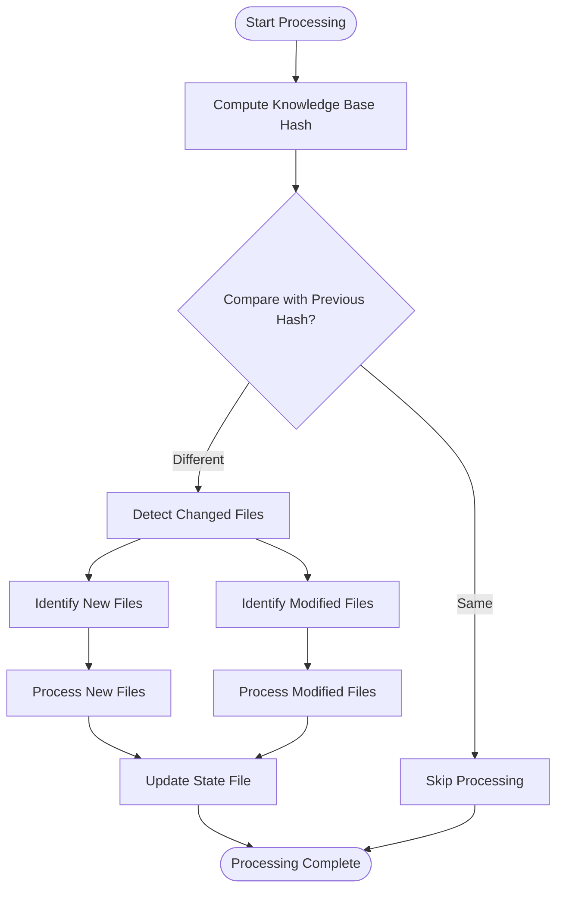
```mermaid
flowchart TD
Start([Start Processing]) --> ComputeHash[Compute Knowledge Base Hash]
ComputeHash --> CompareHash{Compare with Previous Hash?}
CompareHash --> |Different| DetectChanges[Detect Changed Files]
CompareHash --> |Same| SkipProcessing[Skip Processing]
DetectChanges --> NewFiles[Identify New Files]
DetectChanges --> ModifiedFiles[Identify Modified Files]
NewFiles --> ProcessNew[Process New Files]
ModifiedFiles --> ProcessModified[Process Modified Files]
ProcessNew --> UpdateState[Update State File]
ProcessModified --> UpdateState
UpdateState --> End([Processing Complete])
SkipProcessing --> End
```

**Diagram sources**
- [biography_file_manager.py:349-392](file://src/services/biography_file_manager.py#L349-L392)

**Section sources**
- [biography_file_manager.py:32-431](file://src/services/biography_file_manager.py#L32-L431)

## Material Analysis Engine

The Material Analysis Engine serves as the intelligence hub for parsing, extracting, and structuring biographical content from various sources within the knowledge base.

### Material Parsing Architecture

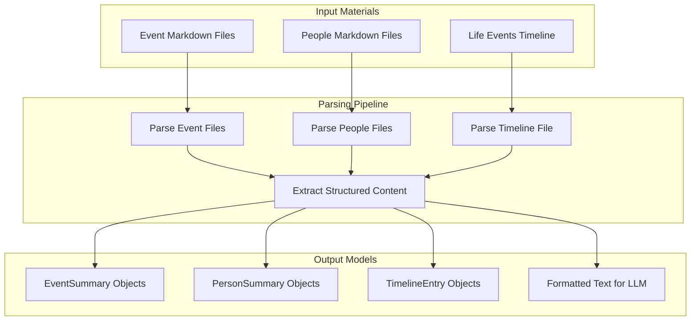
```mermaid
graph TB
subgraph "Input Materials"
EventFiles[Event Markdown Files]
PeopleFiles[People Markdown Files]
TimelineFile[Life Events Timeline]
end
subgraph "Parsing Pipeline"
ParseEvents[Parse Event Files]
ParsePeople[Parse People Files]
ParseTimeline[Parse Timeline File]
ExtractContent[Extract Structured Content]
end
subgraph "Output Models"
EventSummaries[EventSummary Objects]
PersonProfiles[PersonSummary Objects]
TimelineEntries[TimelineEntry Objects]
FormattedText[Formatted Text for LLM]
end
EventFiles --> ParseEvents
PeopleFiles --> ParsePeople
TimelineFile --> ParseTimeline
ParseEvents --> ExtractContent
ParsePeople --> ExtractContent
ParseTimeline --> ExtractContent
ExtractContent --> EventSummaries
ExtractContent --> PersonProfiles
ExtractContent --> TimelineEntries
ExtractContent --> FormattedText
```

**Diagram sources**
- [biography_material_analyzer.py:28-58](file://src/services/biography_material_analyzer.py#L28-L58)

### Content Extraction Patterns

The material analyzer employs sophisticated extraction patterns for different content types:

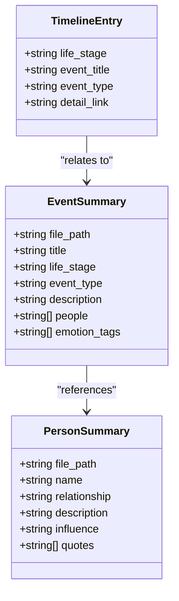
```mermaid
classDiagram
class EventSummary {
+string file_path
+string title
+string life_stage
+string event_type
+string description
+string[] people
+string[] emotion_tags
}
class PersonSummary {
+string file_path
+string name
+string relationship
+string description
+string influence
+string[] quotes
}
class TimelineEntry {
+string life_stage
+string event_title
+string event_type
+string detail_link
}
EventSummary --> PersonSummary : "references"
TimelineEntry --> EventSummary : "relates to"
```

**Diagram sources**
- [biography_models.py:68-98](file://src/models/biography_models.py#L68-L98)

**Section sources**
- [biography_material_analyzer.py:22-575](file://src/services/biography_material_analyzer.py#L22-L575)
- [biography_models.py:68-98](file://src/models/biography_models.py#L68-L98)

## LLM Integration Layer

The LLM Integration Layer provides a unified interface for interacting with various Large Language Model providers while maintaining consistent behavior across different model implementations.

### LLM Service Architecture

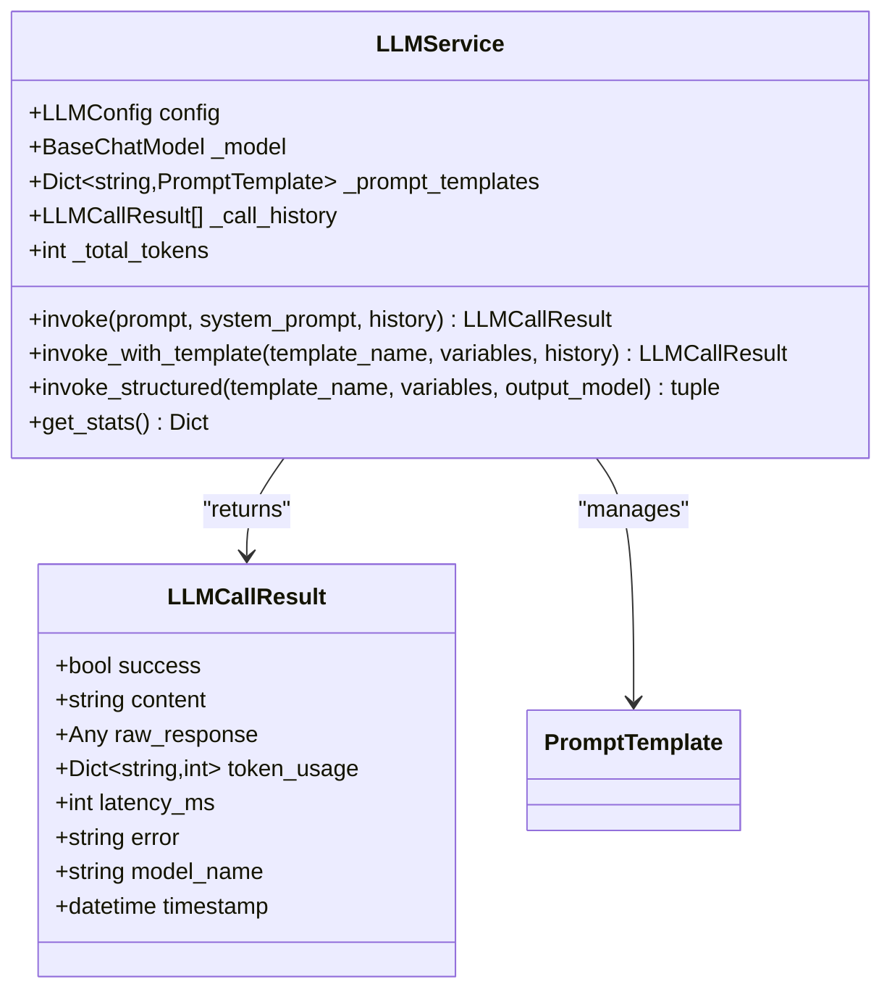
```mermaid
classDiagram
class LLMService {
+LLMConfig config
+BaseChatModel _model
+Dict~string,PromptTemplate~ _prompt_templates
+LLMCallResult[] _call_history
+int _total_tokens
+invoke(prompt, system_prompt, history) LLMCallResult
+invoke_with_template(template_name, variables, history) LLMCallResult
+invoke_structured(template_name, variables, output_model) tuple
+get_stats() Dict
}
class LLMCallResult {
+bool success
+string content
+Any raw_response
+Dict~string,int~ token_usage
+int latency_ms
+string error
+string model_name
+datetime timestamp
}
LLMService --> LLMCallResult : "returns"
LLMService --> PromptTemplate : "manages"
```

**Diagram sources**
- [llm_service.py:20-481](file://src/services/llm_service.py#L20-L481)

### Template Management System

The LLM service implements a comprehensive template management system that supports dynamic prompt rendering:

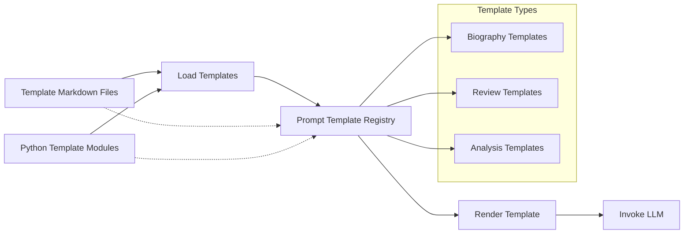
```mermaid
flowchart LR
TemplateFiles[Template Markdown Files] --> LoadTemplates[Load Templates]
PythonTemplates[Python Template Modules] --> LoadTemplates
LoadTemplates --> PromptRegistry[Prompt Template Registry]
PromptRegistry --> RenderTemplate[Render Template]
RenderTemplate --> InvokeLLM[Invoke LLM]
TemplateFiles -.-> PromptRegistry
PythonTemplates -.-> PromptRegistry
subgraph "Template Types"
BiographyTemplates[Biography Templates]
ReviewTemplates[Review Templates]
AnalysisTemplates[Analysis Templates]
end
PromptRegistry --> BiographyTemplates
PromptRegistry --> ReviewTemplates
PromptRegistry --> AnalysisTemplates
```

**Diagram sources**
- [llm_service.py:126-216](file://src/services/llm_service.py#L126-L216)

**Section sources**
- [llm_service.py:32-481](file://src/services/llm_service.py#L32-L481)

## State Management

The state management system coordinates the complex interactions between different processing stages while maintaining data consistency and enabling recovery from interruptions.

### State Coordination Architecture

```mermaid
graph TB
subgraph "State Types"
OutlineState[OutlineAgentState]
WritingState[WritingAgentState]
SessionState[SessionState]
end
subgraph "State Persistence"
StateFiles[.state.json files]
ProgressTracking[Progress Tracking]
RecoveryMechanisms[Recovery Mechanisms]
end
subgraph "State Synchronization"
CrossStageCommunication[Cross-stage Communication]
StateValidation[State Validation]
ConflictResolution[Conflict Resolution]
end
OutlineState --> StateFiles
WritingState --> StateFiles
SessionState --> StateFiles
StateFiles --> ProgressTracking
ProgressTracking --> RecoveryMechanisms
OutlineState < --> WritingState
WritingState < --> SessionState
SessionState < --> OutlineState
CrossStageCommunication --> StateValidation
StateValidation --> ConflictResolution
```

**Diagram sources**
- [biography_outline_state.py:20-49](file://src/models/biography_outline_state.py#L20-L49)
- [biography_writing_state.py:12-39](file://src/models/biography_writing_state.py#L12-L39)
- [session_state.py:24-82](file://src/models/session_state.py#L24-L82)

### State Transition Patterns

The system implements sophisticated state transition patterns that enable complex processing workflows:

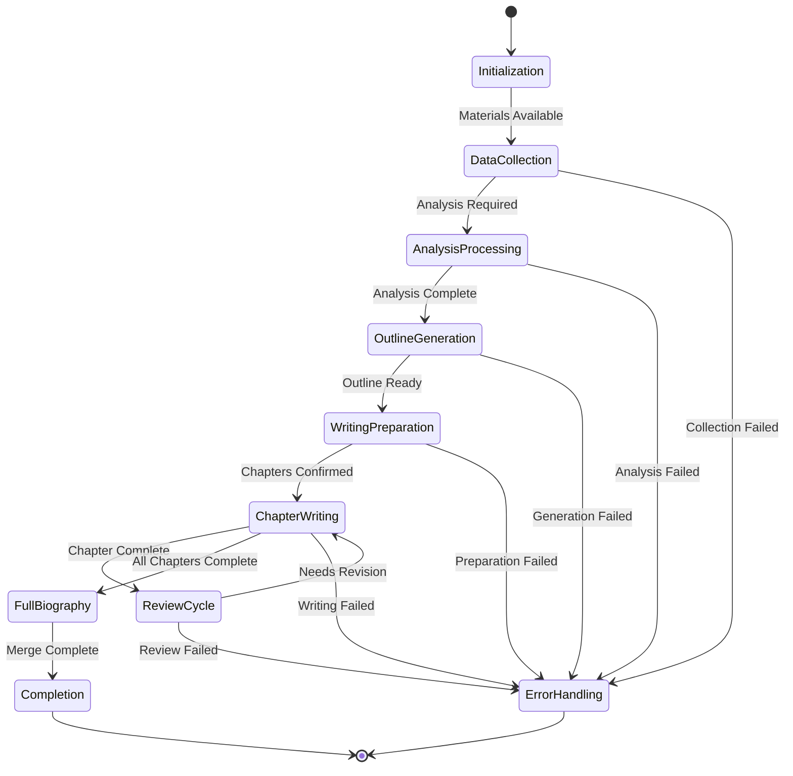
```mermaid
stateDiagram-v2
[*] --> Initialization
Initialization --> DataCollection : Materials Available
DataCollection --> AnalysisProcessing : Analysis Required
AnalysisProcessing --> OutlineGeneration : Analysis Complete
OutlineGeneration --> WritingPreparation : Outline Ready
WritingPreparation --> ChapterWriting : Chapters Confirmed
ChapterWriting --> ReviewCycle : Chapter Complete
ReviewCycle --> ChapterWriting : Needs Revision
ChapterWriting --> FullBiography : All Chapters Complete
FullBiography --> Completion : Merge Complete
Completion --> [*]
DataCollection --> ErrorHandling : Collection Failed
AnalysisProcessing --> ErrorHandling : Analysis Failed
OutlineGeneration --> ErrorHandling : Generation Failed
WritingPreparation --> ErrorHandling : Preparation Failed
ChapterWriting --> ErrorHandling : Writing Failed
ReviewCycle --> ErrorHandling : Review Failed
ErrorHandling --> [*]
```

**Diagram sources**
- [biography_outline_agent.py:111-115](file://src/agents/biography_outline_agent.py#L111-L115)
- [biography_writing_agent.py:258-266](file://src/agents/biography_writing_agent.py#L258-L266)

**Section sources**
- [session_state.py:24-139](file://src/models/session_state.py#L24-L139)
- [phase_type.py:4-10](file://src/enums/phase_type.py#L4-L10)
- [state_type.py:4-12](file://src/enums/state_type.py#L4-L12)

## Processing Workflows

The system orchestrates complex multi-stage processing workflows that transform raw interview materials into polished biographical content through carefully designed sequential and conditional operations.

### End-to-End Processing Flow

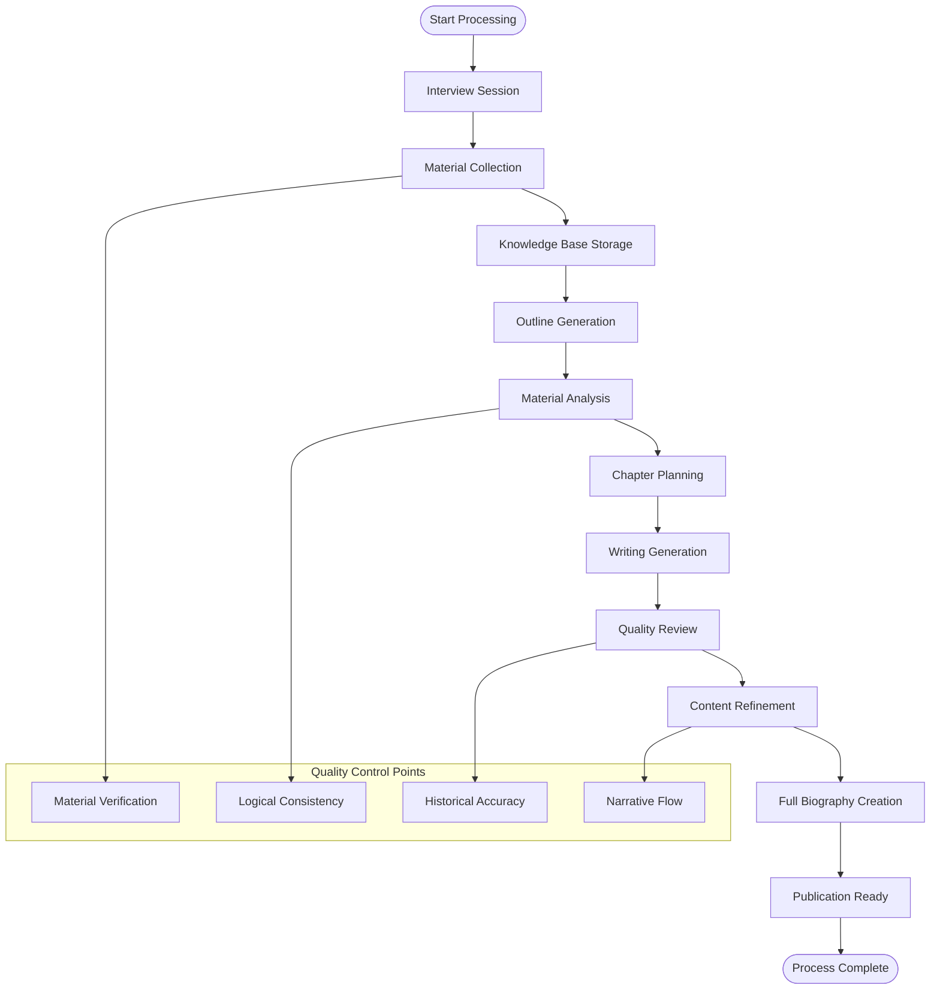
```mermaid
flowchart TD
Start([Start Processing]) --> InterviewSession[Interview Session]
InterviewSession --> MaterialCollection[Material Collection]
MaterialCollection --> KnowledgeBase[Knowledge Base Storage]
KnowledgeBase --> OutlineGeneration[Outline Generation]
OutlineGeneration --> MaterialAnalysis[Material Analysis]
MaterialAnalysis --> ChapterPlanning[Chapter Planning]
ChapterPlanning --> WritingGeneration[Writing Generation]
WritingGeneration --> QualityReview[Quality Review]
QualityReview --> ContentRefinement[Content Refinement]
ContentRefinement --> FullBiography[Full Biography Creation]
FullBiography --> Publication[Publication Ready]
Publication --> End([Process Complete])
subgraph "Quality Control Points"
QC1[Material Verification]
QC2[Logical Consistency]
QC3[Historical Accuracy]
QC4[Narrative Flow]
end
MaterialCollection --> QC1
MaterialAnalysis --> QC2
QualityReview --> QC3
ContentRefinement --> QC4
```

**Diagram sources**
- [README.md:27-53](file://README.md#L27-L53)

### Conditional Processing Logic

The system implements sophisticated conditional logic for handling different processing scenarios:

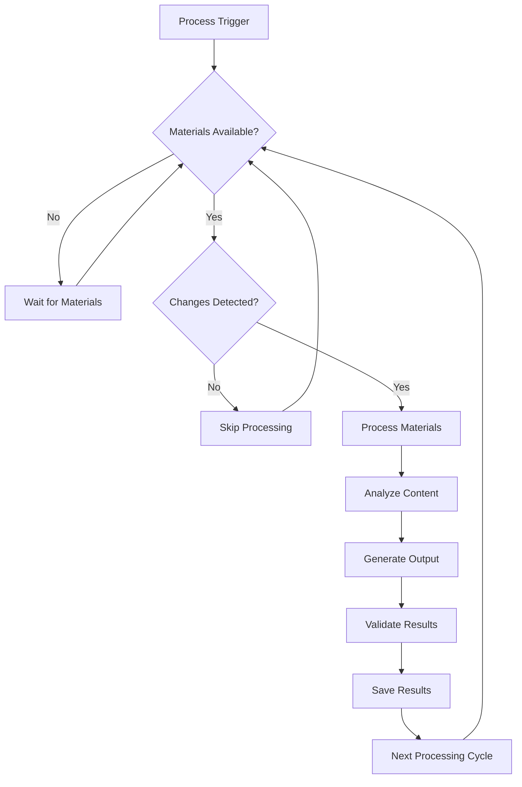
```mermaid
flowchart TD
Input[Process Trigger] --> CheckMaterials{Materials Available?}
CheckMaterials --> |No| Wait[Wait for Materials]
CheckMaterials --> |Yes| CheckChanges{Changes Detected?}
CheckChanges --> |No| Skip[Skip Processing]
CheckChanges --> |Yes| Process[Process Materials]
Process --> Analyze[Analyze Content]
Analyze --> Generate[Generate Output]
Generate --> Validate[Validate Results]
Validate --> Save[Save Results]
Save --> NextCycle[Next Processing Cycle]
NextCycle --> CheckMaterials
Wait --> CheckMaterials
Skip --> CheckMaterials
```

**Diagram sources**
- [biography_outline_agent.py:111-115](file://src/agents/biography_outline_agent.py#L111-L115)
- [biography_file_manager.py:373-392](file://src/services/biography_file_manager.py#L373-L392)

**Section sources**
- [README.md:27-53](file://README.md#L27-L53)

## Performance Considerations

The Biography Processing System incorporates several performance optimization strategies to ensure efficient operation across different processing scenarios and data volumes.

### Optimization Strategies

The system implements multiple layers of optimization:

1. **Incremental Processing**: Only processes changed materials to minimize computational overhead
2. **Caching Mechanisms**: Maintains cached results for frequently accessed data
3. **Asynchronous Operations**: Utilizes async/await patterns for non-blocking I/O operations
4. **Resource Management**: Implements proper resource cleanup and memory management
5. **Batch Operations**: Processes multiple files in batches to improve throughput

### Scalability Features

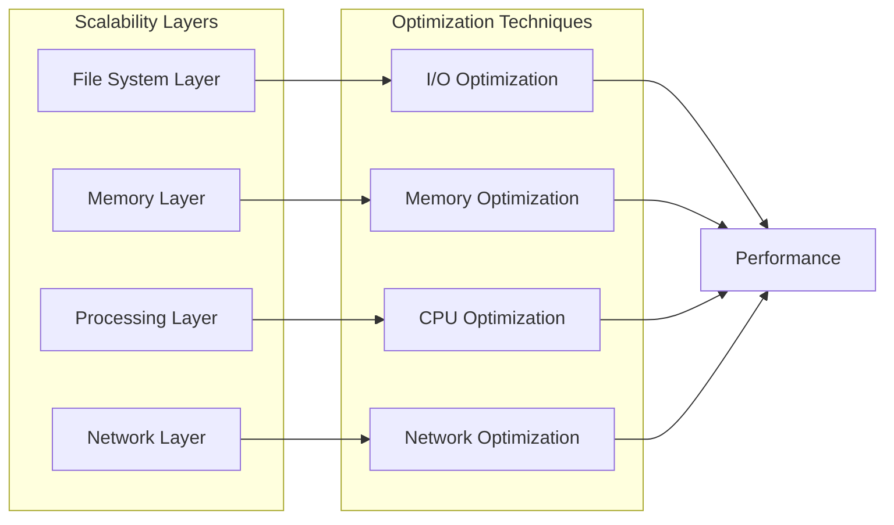
```mermaid
graph LR
subgraph "Scalability Layers"
FileLayer[File System Layer]
ProcessingLayer[Processing Layer]
MemoryLayer[Memory Layer]
NetworkLayer[Network Layer]
end
subgraph "Optimization Techniques"
IOOptimization[I/O Optimization]
MemoryOptimization[Memory Optimization]
CPUOptimization[CPU Optimization]
NetworkOptimization[Network Optimization]
end
FileLayer --> IOOptimization
ProcessingLayer --> CPUOptimization
MemoryLayer --> MemoryOptimization
NetworkLayer --> NetworkOptimization
IOOptimization --> Performance[Performance]
MemoryOptimization --> Performance
CPUOptimization --> Performance
NetworkOptimization --> Performance
```

## Troubleshooting Guide

The system provides comprehensive error handling and diagnostic capabilities to facilitate troubleshooting and maintenance.

### Common Issues and Solutions

**File Access Issues**
- Verify file permissions and paths
- Check for file locks or concurrent access
- Validate file encoding and format

**LLM Integration Problems**
- Check API credentials and connectivity
- Verify template availability and formatting
- Monitor rate limits and quotas

**Processing Failures**
- Review error logs and stack traces
- Check state file integrity
- Validate input data formats

### Diagnostic Tools

The system includes built-in diagnostic capabilities:

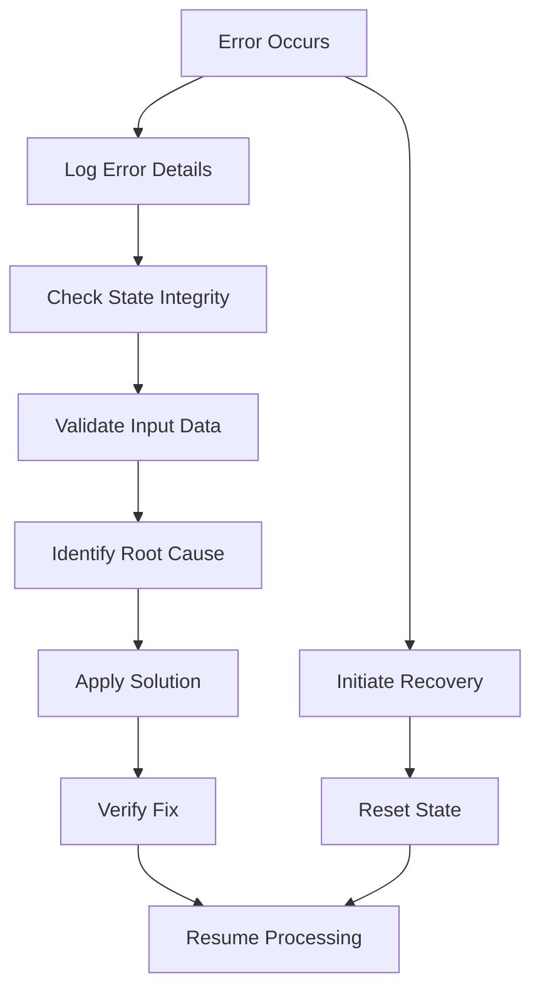
```mermaid
flowchart TD
Error[Error Occurs] --> LogError[Log Error Details]
LogError --> CheckState[Check State Integrity]
CheckState --> ValidateData[Validate Input Data]
ValidateData --> IdentifyCause[Identify Root Cause]
IdentifyCause --> ApplyFix[Apply Solution]
ApplyFix --> VerifyFix[Verify Fix]
VerifyFix --> Resume[Resume Processing]
Error --> Recovery[Initiate Recovery]
Recovery --> ResetState[Reset State]
ResetState --> Resume
```

**Section sources**
- [biography_outline_agent.py:140-144](file://src/agents/biography_outline_agent.py#L140-L144)
- [biography_writing_agent.py:160-165](file://src/agents/biography_writing_agent.py#L160-L165)

## Conclusion

The Biography Processing Models system represents a sophisticated approach to automated biographical content generation, combining advanced AI technologies with robust data management and quality assurance processes. The system's modular architecture enables flexible processing workflows while maintaining data integrity and operational reliability.

Key strengths of the system include its incremental processing capabilities, comprehensive state management, and sophisticated material analysis engine. The dual-pipeline architecture ensures both thorough content analysis and high-quality output generation, making it well-suited for long-term biographical projects.

The system's design emphasizes extensibility and maintainability, providing clear interfaces for adding new processing capabilities and integrating with evolving AI technologies. This foundation positions the system well for future enhancements and expanded functionality.

Through careful attention to data modeling, state management, and quality control, the Biography Processing Models system delivers a reliable platform for preserving and sharing meaningful life stories with accuracy and authenticity.