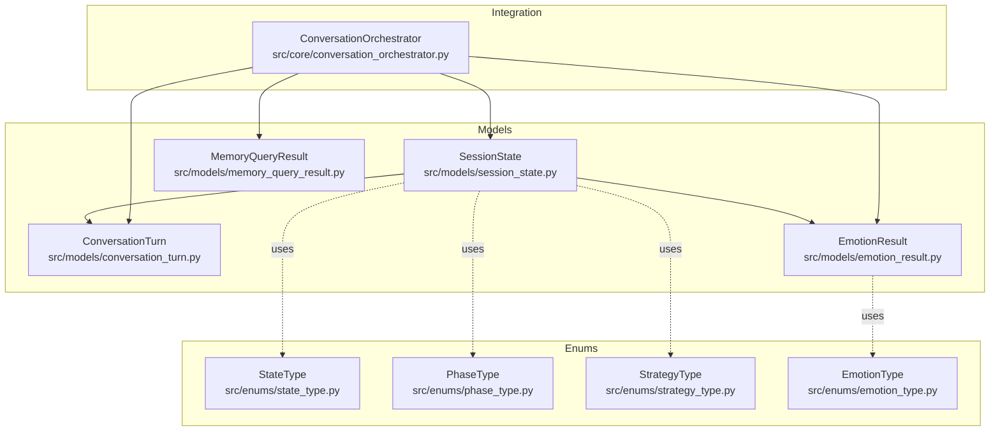
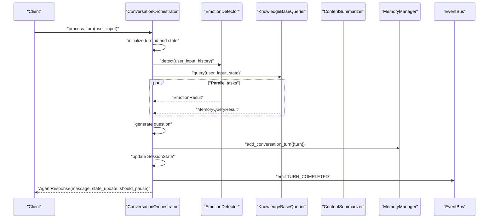
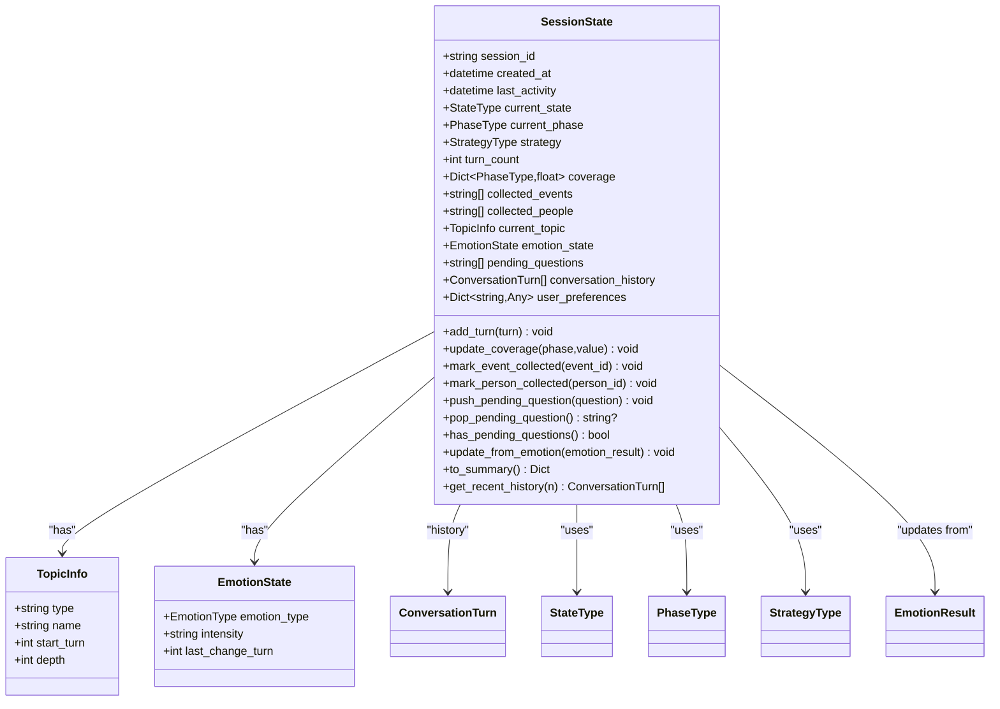
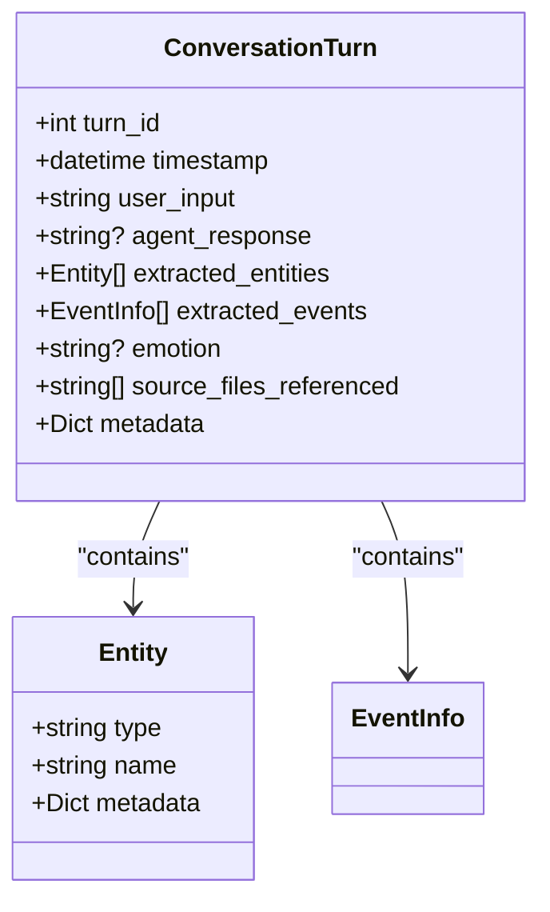
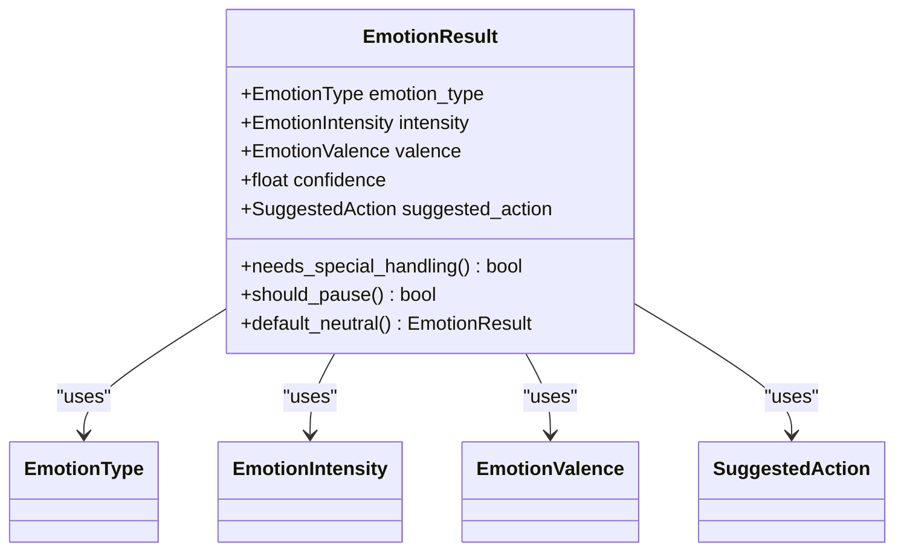
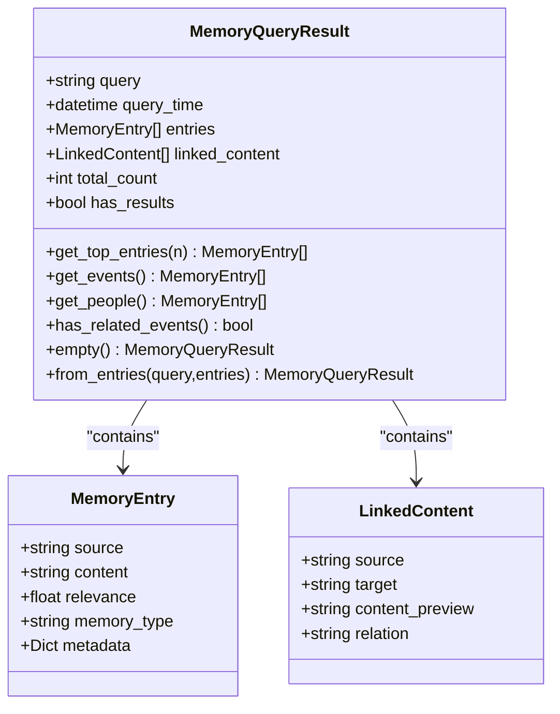
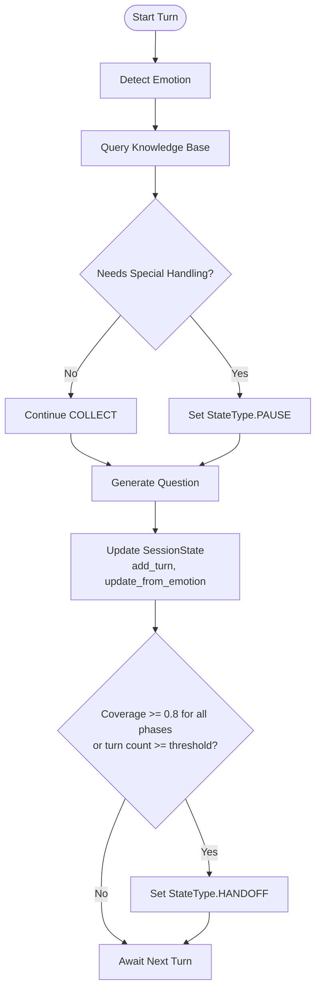
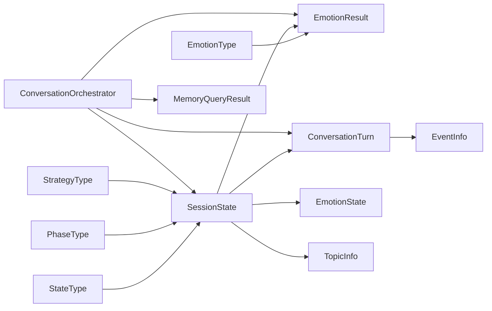

# Core Models

<cite>
**Referenced Files in This Document**
- [session_state.py](file://src/models/session_state.py)
- [conversation_turn.py](file://src/models/conversation_turn.py)
- [emotion_result.py](file://src/models/emotion_result.py)
- [memory_query_result.py](file://src/models/memory_query_result.py)
- [state_type.py](file://src/enums/state_type.py)
- [phase_type.py](file://src/enums/phase_type.py)
- [strategy_type.py](file://src/enums/strategy_type.py)
- [emotion_type.py](file://src/enums/emotion_type.py)
- [event_info.py](file://src/models/event_info.py)
- [person_info.py](file://src/models/person_info.py)
- [conversation_orchestrator.py](file://src/core/conversation_orchestrator.py)
- [test_session_state.py](file://tests/test_session_state.py)
- [verify_models.py](file://verify_models.py)
</cite>

## Table of Contents
1. [Introduction](#introduction)
2. [Project Structure](#project-structure)
3. [Core Components](#core-components)
4. [Architecture Overview](#architecture-overview)
5. [Detailed Component Analysis](#detailed-component-analysis)
6. [Dependency Analysis](#dependency-analysis)
7. [Performance Considerations](#performance-considerations)
8. [Troubleshooting Guide](#troubleshooting-guide)
9. [Conclusion](#conclusion)

## Introduction
This document provides comprehensive data model documentation for the core system models that orchestrate conversation sessions. It focuses on:
- SessionState: central state container for conversation lifecycle tracking
- ConversationTurn: per-turn record of dialogue exchange
- EmotionResult: outcome of emotional analysis
- MemoryQueryResult: knowledge base search results

It details field definitions, data types, validation rules, Pydantic configurations, and business constraints. It also illustrates relationships among these models and their roles in the conversation orchestration system, with examples of instantiation, serialization, state transitions, and data transformation workflows.

## Project Structure
The core models are defined under src/models and supported by enums under src/enums. They integrate with the ConversationOrchestrator in src/core and are exercised via unit tests and verification scripts.

**Diagram sources**
- [session_state.py:24-139](file://src/models/session_state.py#L24-L139)
- [conversation_turn.py:14-52](file://src/models/conversation_turn.py#L14-L52)
- [emotion_result.py:6-57](file://src/models/emotion_result.py#L6-L57)
- [memory_query_result.py:23-81](file://src/models/memory_query_result.py#L23-L81)
- [state_type.py:4-12](file://src/enums/state_type.py#L4-L12)
- [phase_type.py:4-10](file://src/enums/phase_type.py#L4-L10)
- [strategy_type.py:4-8](file://src/enums/strategy_type.py#L4-L8)
- [emotion_type.py:4-50](file://src/enums/emotion_type.py#L4-L50)
- [conversation_orchestrator.py:430-664](file://src/core/conversation_orchestrator.py#L430-L664)

**Section sources**
- [session_state.py:1-139](file://src/models/session_state.py#L1-L139)
- [conversation_turn.py:1-52](file://src/models/conversation_turn.py#L1-L52)
- [emotion_result.py:1-57](file://src/models/emotion_result.py#L1-L57)
- [memory_query_result.py:1-81](file://src/models/memory_query_result.py#L1-L81)
- [state_type.py:1-12](file://src/enums/state_type.py#L1-L12)
- [phase_type.py:1-10](file://src/enums/phase_type.py#L1-L10)
- [strategy_type.py:1-8](file://src/enums/strategy_type.py#L1-L8)
- [emotion_type.py:1-50](file://src/enums/emotion_type.py#L1-L50)
- [conversation_orchestrator.py:430-664](file://src/core/conversation_orchestrator.py#L430-L664)

## Core Components
This section documents the four core models with their fields, types, validation rules, Pydantic configurations, and business constraints.

### SessionState
SessionState is the central state container for a conversation session. It tracks identity, lifecycle timestamps, orchestration state, progress metrics, collected artifacts, current topic, emotion state, pending questions, conversation history, and user preferences.

Key fields and constraints:
- session_id: string, required
- created_at: datetime, defaults to now
- last_activity: datetime, defaults to now
- current_state: StateType, default INIT
- current_phase: PhaseType, default CHILDHOOD
- strategy: StrategyType, default SPARKLE_FIRST
- turn_count: int, default 0
- coverage: Dict[PhaseType, float], default 0.0 per phase; validated to [0.0, 1.0]
- collected_events: List[str], deduplicated additions
- collected_people: List[str], deduplicated additions
- current_topic: Optional[TopicInfo]
- emotion_state: EmotionState, default neutral low intensity
- pending_questions: List[str]
- conversation_history: List[ConversationTurn]
- user_preferences: Dict[str, Any]

Pydantic configuration:
- use_enum_values: True

Business constraints and behaviors:
- add_turn increments turn_count and updates last_activity
- update_coverage clamps values to [0.0, 1.0]
- mark_event_collected and mark_person_collected avoid duplicates
- push_pending_question and pop_pending_question manage FIFO queue
- update_from_emotion updates emotion_state and records last change turn
- to_summary provides compact snapshot
- get_recent_history returns up to n latest turns

Validation rules:
- coverage values are bounded via update_coverage
- confidence in EmotionResult is bounded to [0.0, 1.0]

Example usage patterns:
- Instantiation with session_id and optional user_preferences
- Adding a ConversationTurn after processing user input
- Updating coverage per life phase
- Serializing to JSON for persistence and deserializing to resume

**Section sources**
- [session_state.py:24-139](file://src/models/session_state.py#L24-L139)
- [state_type.py:4-12](file://src/enums/state_type.py#L4-L12)
- [phase_type.py:4-10](file://src/enums/phase_type.py#L4-L10)
- [strategy_type.py:4-8](file://src/enums/strategy_type.py#L4-L8)
- [emotion_type.py:4-50](file://src/enums/emotion_type.py#L4-L50)

### ConversationTurn
ConversationTurn captures a single round of dialogue exchange, including identifiers, timestamps, user input, agent response, extracted entities and events, emotion label, referenced source files, and arbitrary metadata.

Key fields and constraints:
- turn_id: int, required
- timestamp: datetime, defaults to now
- user_input: str, required
- agent_response: Optional[str]
- extracted_entities: List[Entity], default empty
- extracted_events: List[EventInfo], default empty
- emotion: Optional[str]
- source_files_referenced: List[str], default empty
- metadata: dict, default empty

Business constraints:
- Designed to be appended to SessionState.conversation_history
- Supports downstream services like EmotionDetector and ContentSummarizer

Example usage patterns:
- Creating a new turn with turn_id and user_input
- Populating agent_response after generation
- Attaching extracted entities/events and source references

**Section sources**
- [conversation_turn.py:14-52](file://src/models/conversation_turn.py#L14-L52)
- [event_info.py:5-69](file://src/models/event_info.py#L5-L69)

### EmotionResult
EmotionResult encapsulates the outcome of an emotion detection operation, including emotion type, intensity, valence, confidence, and suggested action. It provides convenience methods to determine special handling needs and pause conditions.

Key fields and constraints:
- emotion_type: EmotionType, required
- intensity: EmotionIntensity, default LOW
- valence: EmotionValence, default NEUTRAL
- confidence: float, default 0.5, constrained to [0.0, 1.0]
- suggested_action: SuggestedAction, default CONTINUE

Computed properties:
- needs_special_handling: True when high negative intensity or specific negative emotions
- should_pause: True for PAUSE or COMFORT actions

Factory method:
- default_neutral: returns a neutral baseline result

Example usage patterns:
- Passing EmotionResult to SessionState.update_from_emotion
- Using needs_special_handling to trigger pause state
- Using should_pause to inform UI/pause logic

**Section sources**
- [emotion_result.py:6-57](file://src/models/emotion_result.py#L6-L57)
- [emotion_type.py:4-50](file://src/enums/emotion_type.py#L4-L50)

### MemoryQueryResult
MemoryQueryResult represents the result of a knowledge base query, including the original query text, timestamp, matched entries, linked content, totals, and helpers to filter and summarize results.

Key fields and constraints:
- query: str, required
- query_time: datetime, defaults to now
- entries: List[MemoryEntry], default empty
- linked_content: List[LinkedContent], default empty
- total_count: int, default 0
- has_results: bool, default False

Helper methods:
- get_top_entries(n): returns top-n entries by relevance
- get_events(): filters entries containing “event”
- get_people(): filters entries containing “people”
- has_related_events(): checks presence of event-type entries
- empty(): factory for empty result
- from_entries(): factory from prebuilt entries

Example usage patterns:
- Passing MemoryQueryResult to QuestionGenerator for context-aware question generation
- Using get_top_entries to prioritize retrieval-augmented prompts
- Building summaries for ContentSummarizer

**Section sources**
- [memory_query_result.py:23-81](file://src/models/memory_query_result.py#L23-L81)

## Architecture Overview
The ConversationOrchestrator coordinates services and updates SessionState for each turn. It performs parallel tasks for emotion detection and knowledge query, then generates a question, updates the session state, and optionally triggers handoff or pause.

**Diagram sources**
- [conversation_orchestrator.py:506-592](file://src/core/conversation_orchestrator.py#L506-L592)

**Section sources**
- [conversation_orchestrator.py:430-664](file://src/core/conversation_orchestrator.py#L430-L664)

## Detailed Component Analysis

### SessionState Analysis
SessionState composes several auxiliary models and maintains orchestration state. Its methods enforce business rules and provide convenience accessors.

**Diagram sources**
- [session_state.py:9-139](file://src/models/session_state.py#L9-L139)

**Section sources**
- [session_state.py:24-139](file://src/models/session_state.py#L24-L139)

### ConversationTurn Analysis
ConversationTurn is a lightweight record of a single dialogue turn, designed for composition into SessionState.history and consumption by downstream services.

**Diagram sources**
- [conversation_turn.py:7-52](file://src/models/conversation_turn.py#L7-L52)
- [event_info.py:5-69](file://src/models/event_info.py#L5-L69)

**Section sources**
- [conversation_turn.py:14-52](file://src/models/conversation_turn.py#L14-L52)

### EmotionResult Analysis
EmotionResult standardizes emotion detection outcomes and provides decision helpers for orchestration.

**Diagram sources**
- [emotion_result.py:6-57](file://src/models/emotion_result.py#L6-L57)
- [emotion_type.py:4-50](file://src/enums/emotion_type.py#L4-L50)

**Section sources**
- [emotion_result.py:6-57](file://src/models/emotion_result.py#L6-L57)

### MemoryQueryResult Analysis
MemoryQueryResult encapsulates knowledge base search results and provides filtering and summarization helpers.

**Diagram sources**
- [memory_query_result.py:23-81](file://src/models/memory_query_result.py#L23-L81)

**Section sources**
- [memory_query_result.py:23-81](file://src/models/memory_query_result.py#L23-L81)

### State Transition Workflow
The ConversationOrchestrator drives SessionState transitions during a turn. The flow below shows how emotion results can shift the session into pause mode and how coverage thresholds can trigger handoff.

**Diagram sources**
- [conversation_orchestrator.py:506-600](file://src/core/conversation_orchestrator.py#L506-L600)
- [state_type.py:4-12](file://src/enums/state_type.py#L4-L12)

**Section sources**
- [conversation_orchestrator.py:594-600](file://src/core/conversation_orchestrator.py#L594-L600)

## Dependency Analysis
The core models depend on enums for typed values and on each other for composition. The ConversationOrchestrator depends on all four models for orchestration.

**Diagram sources**
- [session_state.py:24-139](file://src/models/session_state.py#L24-L139)
- [conversation_turn.py:14-52](file://src/models/conversation_turn.py#L14-L52)
- [emotion_result.py:6-57](file://src/models/emotion_result.py#L6-L57)
- [memory_query_result.py:23-81](file://src/models/memory_query_result.py#L23-L81)
- [state_type.py:4-12](file://src/enums/state_type.py#L4-L12)
- [phase_type.py:4-10](file://src/enums/phase_type.py#L4-L10)
- [strategy_type.py:4-8](file://src/enums/strategy_type.py#L4-L8)
- [emotion_type.py:4-50](file://src/enums/emotion_type.py#L4-L50)
- [conversation_orchestrator.py:430-664](file://src/core/conversation_orchestrator.py#L430-L664)

**Section sources**
- [session_state.py:1-139](file://src/models/session_state.py#L1-L139)
- [conversation_turn.py:1-52](file://src/models/conversation_turn.py#L1-L52)
- [emotion_result.py:1-57](file://src/models/emotion_result.py#L1-L57)
- [memory_query_result.py:1-81](file://src/models/memory_query_result.py#L1-L81)
- [conversation_orchestrator.py:430-664](file://src/core/conversation_orchestrator.py#L430-L664)

## Performance Considerations
- Prefer get_recent_history with a bounded n to limit memory growth in long sessions.
- Use update_coverage with clamping to maintain valid bounds and avoid repeated normalization.
- Keep conversation_history manageable; consider periodic pruning or summarization for very long sessions.
- EmotionResult’s computed properties are O(1); keep lists small to minimize overhead.
- MemoryQueryResult.get_top_entries sorts by relevance; for large result sets, consider streaming or early stopping.

## Troubleshooting Guide
Common issues and resolutions:
- Serialization failures: Ensure use_enum_values is enabled (already configured) and avoid non-serializable metadata in fields.
- Coverage out-of-range: update_coverage clamps values; verify external assignments do not bypass this method.
- Duplicate artifacts: mark_event_collected and mark_person_collected prevent duplicates; ensure IDs are normalized.
- Pending questions queue exhaustion: pop_pending_question returns None when empty; guard callers accordingly.
- Emotion-driven pause: should_pause relies on suggested_action; confirm detector configuration aligns with expected actions.

Verification references:
- Unit tests for SessionState behavior and assertions
- Model validation and JSON dump/load verification

**Section sources**
- [test_session_state.py:1-143](file://tests/test_session_state.py#L1-L143)
- [verify_models.py:105-142](file://verify_models.py#L105-L142)

## Conclusion
These core models form the backbone of the conversation orchestration system. SessionState centralizes state and progress, ConversationTurn records dialogue exchanges, EmotionResult informs behavioral decisions, and MemoryQueryResult supplies contextual knowledge. Together with enums and the ConversationOrchestrator, they enable robust, typed, and serializable workflows for guided interviews and content synthesis.