# Data Models

<cite>
**Referenced Files in This Document**
- [__init__.py](file://src/models/__init__.py)
- [session_state.py](file://src/models/session_state.py)
- [conversation_turn.py](file://src/models/conversation_turn.py)
- [emotion_result.py](file://src/models/emotion_result.py)
- [memory_query_result.py](file://src/models/memory_query_result.py)
- [event_info.py](file://src/models/event_info.py)
- [person_info.py](file://src/models/person_info.py)
- [agent_response.py](file://src/models/agent_response.py)
- [handoff_package.py](file://src/models/handoff_package.py)
- [organized_memory.py](file://src/models/organized_memory.py)
- [summary_content.py](file://src/models/summary_content.py)
- [biography_models.py](file://src/models/biography_models.py)
- [biography_outline_state.py](file://src/models/biography_outline_state.py)
- [biography_writing_state.py](file://src/models/biography_writing_state.py)
- [kb_organizer_state.py](file://src/models/kb_organizer_state.py)
- [requests.py](file://src/service/schemas/requests.py)
- [state_type.py](file://src/enums/state_type.py)
- [phase_type.py](file://src/enums/phase_type.py)
- [emotion_type.py](file://src/enums/emotion_type.py)
</cite>

## Update Summary
**Changes Made**
- Added comprehensive documentation for new biography processing models
- Added documentation for knowledge base organization state management models
- Added documentation for service schemas for API endpoints
- Updated model relationships to reflect new biography and KB organization workflows
- Enhanced architecture overview to include new agent states and processing pipelines

## Table of Contents
1. [Introduction](#introduction)
2. [Project Structure](#project-structure)
3. [Core Components](#core-components)
4. [Architecture Overview](#architecture-overview)
5. [Detailed Component Analysis](#detailed-component-analysis)
6. [Dependency Analysis](#dependency-analysis)
7. [Performance Considerations](#performance-considerations)
8. [Troubleshooting Guide](#troubleshooting-guide)
9. [Conclusion](#conclusion)
10. [Appendices](#appendices)

## Introduction
This document provides comprehensive data model documentation for the Pydantic-based schemas that power the system's conversation orchestration, memory querying, summarization, handoff workflows, and the new biography processing and knowledge base organization capabilities. It focuses on core models such as SessionState, ConversationTurn, EmotionResult, MemoryQueryResult, and specialized models including EventInfo, PersonInfo, AgentResponse, HandoffPackage, OrganizedMemory, and SummaryContent. Additionally, it covers the newly added biography processing models (ChapterStatus, AgentStatus, LifeStage, ChapterEntry, OutlineDocument, EventSummary, PersonSummary, TimelineEntry, OutlineChange, ChapterTask, BiographyState), knowledge base organization state models (TaskStatus, OrganizerTask, ConflictItem, MergeRecord, KBOrganizerState), and service schemas for API endpoint validation (UserIdRequest, InterviewMessageRequest, InterviewEndRequest, ChapterConfirmRequest, ErrorDetail, ErrorResponse). For each model, we describe fields, data types, validation rules, business constraints, usage scenarios, serialization patterns, and transformation workflows. We also illustrate relationships among models and their roles in the overall system architecture.

## Project Structure
The data models are centralized under the models package and re-exported via the package initializer for easy consumption across the application. New biography processing models, knowledge base organization state models, and service schemas are integrated alongside existing core models. Enums that constrain field values are located under the enums package and imported by models where applicable.

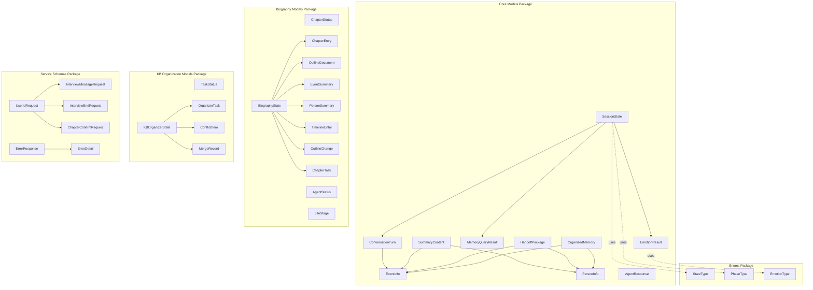

**Diagram sources**
- [__init__.py:1-100](file://src/models/__init__.py#L1-L100)
- [session_state.py:24-139](file://src/models/session_state.py#L24-L139)
- [conversation_turn.py:14-52](file://src/models/conversation_turn.py#L14-L52)
- [emotion_result.py:6-57](file://src/models/emotion_result.py#L6-L57)
- [memory_query_result.py:23-81](file://src/models/memory_query_result.py#L23-L81)
- [event_info.py:5-69](file://src/models/event_info.py#L5-L69)
- [person_info.py:5-61](file://src/models/person_info.py#L5-L61)
- [agent_response.py:5-22](file://src/models/agent_response.py#L5-L22)
- [handoff_package.py:32-66](file://src/models/handoff_package.py#L32-L66)
- [organized_memory.py:141-151](file://src/models/organized_memory.py#L141-L151)
- [summary_content.py:37-67](file://src/models/summary_content.py#L37-L67)
- [biography_models.py:15-127](file://src/models/biography_models.py#L15-127)
- [biography_outline_state.py:20-50](file://src/models/biography_outline_state.py#L20-50)
- [biography_writing_state.py:12-40](file://src/models/biography_writing_state.py#L12-40)
- [kb_organizer_state.py:7-202](file://src/models/kb_organizer_state.py#L7-202)
- [requests.py:8-69](file://src/service/schemas/requests.py#L8-69)
- [state_type.py:4-12](file://src/enums/state_type.py#L4-12)
- [phase_type.py:4-10](file://src/enums/phase_type.py#L4-10)
- [emotion_type.py:4-50](file://src/enums/emotion_type.py#L4-50)

**Section sources**
- [__init__.py:1-100](file://src/models/__init__.py#L1-L100)

## Core Components
This section documents the primary data models and their responsibilities, fields, validation rules, and typical usage patterns.

### SessionState
- Purpose: Central state container for an interview session, tracking lifecycle, progress, coverage, collected artifacts, current topic, emotion state, pending questions, conversation history, and user preferences.
- Key fields and constraints:
  - session_id: string; required
  - created_at, last_activity: datetime; defaults to current time
  - current_state: StateType enum; default init
  - current_phase: PhaseType enum; default childhood
  - strategy: StrategyType enum; default sparkle_first
  - turn_count: int; default 0
  - coverage: Dict keyed by PhaseType with float values bounded to [0.0, 1.0]; initialized to zeros
  - collected_events, collected_people: lists of strings
  - current_topic: optional TopicInfo
  - emotion_state: EmotionState with emotion_type, intensity, last_change_turn
  - pending_questions: list of strings
  - conversation_history: list of ConversationTurn
  - user_preferences: dict
- Methods:
  - add_turn, update_coverage, mark_event_collected, mark_person_collected, push_pending_question, pop_pending_question, has_pending_questions, update_from_emotion, to_summary, get_recent_history
- Validation:
  - Uses enum values via Config.use_enum_values
- Typical usage:
  - Held and updated by the orchestrator
  - Read by services for decision-making
  - Serialized for persistence during pause/resume

**Section sources**
- [session_state.py:9-22](file://src/models/session_state.py#L9-L22)
- [session_state.py:24-139](file://src/models/session_state.py#L24-L139)
- [state_type.py:4-12](file://src/enums/state_type.py#L4-12)
- [phase_type.py:4-10](file://src/enums/phase_type.py#L4-10)

### ConversationTurn
- Purpose: Encapsulates a single round of conversation including timestamps, user input, agent response, extracted entities and events, emotion tag, referenced source files, and metadata.
- Key fields and constraints:
  - turn_id: int; required
  - timestamp: datetime; default now
  - user_input: string; required
  - agent_response: optional string
  - extracted_entities: list of Entity with type, name, metadata
  - extracted_events: list of EventInfo
  - emotion: optional string
  - source_files_referenced: list of strings
  - metadata: dict
- Typical usage:
  - Appended to SessionState.history
  - Consumed by emotion detector and summarizer

**Section sources**
- [conversation_turn.py:7-12](file://src/models/conversation_turn.py#L7-L12)
- [conversation_turn.py:14-52](file://src/models/conversation_turn.py#L14-L52)
- [event_info.py:5-69](file://src/models/event_info.py#L5-L69)

### EmotionResult
- Purpose: Captures emotion detection results and suggested actions for downstream orchestration decisions.
- Key fields and constraints:
  - emotion_type: EmotionType enum; required
  - intensity: EmotionIntensity enum; default low
  - valence: EmotionValence enum; default neutral
  - confidence: float; constrained to [0.0, 1.0]; default 0.5
  - suggested_action: SuggestedAction enum; default continue
- Behavior:
  - needs_special_handling: computed property based on intensity, valence, and emotion_type
  - should_pause: computed property based on suggested_action
  - default_neutral: class method returning a neutral baseline result
- Typical usage:
  - Returned by emotion detector
  - Used to update SessionState emotion_state

**Section sources**
- [emotion_result.py:6-57](file://src/models/emotion_result.py#L6-L57)
- [emotion_type.py:4-50](file://src/enums/emotion_type.py#L4-50)

### MemoryQueryResult
- Purpose: Aggregates results from knowledge base queries, including matched entries, linked content, and summary flags.
- Key fields and constraints:
  - query: string; required
  - query_time: datetime; default now
  - entries: list of MemoryEntry with source, content, relevance, memory_type, metadata
  - linked_content: list of LinkedContent with source, target, content_preview, relation
  - total_count: int; default 0
  - has_results: bool; default False
- Methods:
  - get_top_entries(n), get_events(), get_people(), has_related_events()
  - empty(), from_entries()
- Typical usage:
  - Returned by knowledge base querier
  - Used to inform question generation and summarization

**Section sources**
- [memory_query_result.py:6-21](file://src/models/memory_query_result.py#L6-L21)
- [memory_query_result.py:23-81](file://src/models/memory_query_result.py#L23-L81)

### EventInfo
- Purpose: Structured representation of a life event suitable for writing to the knowledge base.
- Key fields and constraints:
  - event_id: string; required
  - title: string; required
  - time: string; required
  - time_precision: string; default "year"
  - location: string; default ""
  - type: string; default "other"
  - description: string; required
  - details: list of strings
  - participants: list of strings
  - emotions: list of strings
  - significance: string; default ""
  - source_turns: list of ints
- Behavior:
  - to_markdown(): generates a formatted Markdown string for file output
- Typical usage:
  - Produced by summarizer and written to memory via file manager
  - Included in handoff and summary content

**Section sources**
- [event_info.py:5-69](file://src/models/event_info.py#L5-L69)

### PersonInfo
- Purpose: Structured representation of a person in the narrative suitable for writing to the knowledge base.
- Key fields and constraints:
  - person_id: string; required
  - name: string; required
  - role: string; required
  - description: string; default ""
  - relation_to_protagonist: string; default ""
  - source_events: list of strings
  - Optional extended fields: birth_year, characteristics, influence, quotes
- Behavior:
  - to_markdown(): generates a formatted Markdown string for file output
- Typical usage:
  - Produced by summarizer and written to memory via file manager
  - Included in handoff and summary content

**Section sources**
- [person_info.py:5-61](file://src/models/person_info.py#L5-L61)

### AgentResponse
- Purpose: Standardized response envelope for a single turn, carrying message, state update hints, pause signals, and handoff triggers.
- Key fields and constraints:
  - message: string; required
  - state_update: dict; default empty
  - should_pause: bool; default False
  - pause_reason: optional string
  - handoff_triggered: bool; default False
- Typical usage:
  - Returned by orchestrator after processing a turn
  - Consumed by upper layers to decide next steps

**Section sources**
- [agent_response.py:5-22](file://src/models/agent_response.py#L5-L22)

### HandoffPackage
- Purpose: Complete payload passed to downstream agents upon session termination, encapsulating session info, progress, collected data, and notes.
- Key fields and constraints:
  - handoff_id: string; required
  - from_agent, to_agent: strings; defaults Agent-A, Agent-B
  - timestamp: datetime; default now
  - session_info: SessionSummary with session_id, total_turns, duration_minutes, strategy_used
  - collection_progress: dict of ProgressInfo keyed by stage
  - collected_data: CollectedData containing lists of EventInfo, PersonInfo, TimeMarker, ThemeInfo
  - raw_conversations_path: string; default empty
  - pending_questions: list of strings
  - notes_for_agent_b: list of strings
- Typical usage:
  - Generated by orchestrator on terminate_session
  - Passed to downstream agent for structured memory organization

**Section sources**
- [handoff_package.py:9-30](file://src/models/handoff_package.py#L9-L30)
- [handoff_package.py:32-66](file://src/models/handoff_package.py#L32-L66)

### OrganizedMemory
- Purpose: Hierarchical and structured memory updates produced by downstream processing, including timeline updates, extracted events and people, profile updates, storage suggestions, and processing summary.
- Key fields and constraints:
  - timeline_updates: list of TimelineUpdate
  - events: list of EventExtract
  - people: list of PersonExtract
  - profile_updates: optional ProfileUpdates
  - storage_suggestions: optional StorageSuggestions
  - processing_summary: optional ProcessingSummary
- Nested types (selected):
  - TimelineUpdate: time_point, time_type (TimeType), life_phase, event_reference, significance
  - EventExtract: event_id, title, time, location, event_type (EventType), importance (Importance), description, participants, emotions, user_evaluation, related_events, source_turns, confidence
  - PersonExtract: person_id, name, relation, relation_type (RelationType), first_appear_time, description, appearance, personality, occupation, key_quotes, relationships, influence_level (InfluenceLevel), source_turns
  - ProfileUpdates: protagonist (optional), relationship_network
  - StorageSuggestions: timeline_file, event_files, people_files
  - ProcessingSummary: counts and notes
- Enum types:
  - TimeType, EventType, Importance, RelationType, InfluenceLevel
- Behavior:
  - empty(): class method returning an empty instance

**Section sources**
- [organized_memory.py:6-46](file://src/models/organized_memory.py#L6-L46)
- [organized_memory.py:49-72](file://src/models/organized_memory.py#L49-L72)
- [organized_memory.py:81-95](file://src/models/organized_memory.py#L81-L95)
- [organized_memory.py:113-147](file://src/models/organized_memory.py#L113-L147)
- [organized_memory.py:141-151](file://src/models/organized_memory.py#L141-L151)

### SummaryContent
- Purpose: Structured summary of a summarization run, including extracted information, memory update plan, pending questions, and handoff readiness.
- Key fields and constraints:
  - summary_id, session_id: strings; required
  - turn_range: tuple of two ints; required
  - created_at: datetime; default now
  - extracted_info: ExtractedInfo with events, people, time_markers, themes
  - memory_updates: MemoryUpdatePlan with short_term_updates, long_term_files, profile_updates
  - pending_questions: list of strings
  - handoff_ready: bool; default False
  - handoff_reason: optional string
- Typical usage:
  - Output of content summarizer
  - Input to memory manager and included in handoff when ready

**Section sources**
- [summary_content.py:8-28](file://src/models/summary_content.py#L8-L28)
- [summary_content.py:30-67](file://src/models/summary_content.py#L30-L67)

### Biography Processing Models

**Updated** Added comprehensive documentation for new biography processing models that enable automated biographical content creation and organization.

#### ChapterStatus
- Purpose: Enum representing the lifecycle status of a biography chapter
- Values: draft, confirmed, written, outdated
- Usage: Tracks chapter progression from initial creation to completion

#### AgentStatus
- Purpose: Enum representing the operational status of biography agents
- Values: running, completed, failed
- Usage: Controls agent lifecycle and error handling

#### LifeStage
- Purpose: Enum categorizing human life stages for biographical organization
- Values: childhood, youth, middle_age, elderly
- Usage: Organizes content by temporal context

#### ChapterEntry
- Purpose: Individual chapter definition within a biography outline
- Key fields: id, title, life_stage, theme, status, source_materials, summary, timestamps
- Usage: Core unit of biography organization and processing

#### OutlineDocument
- Purpose: Complete biography outline structure
- Key fields: title, author, style, version, last_updated, chapters
- Usage: Master document coordinating biography creation workflow

#### EventSummary
- Purpose: Extracted event information from knowledge base for biography content
- Key fields: file_path, title, life_stage, event_type, description, people, emotion_tags
- Usage: Provides factual content foundation for biography chapters

#### PersonSummary
- Purpose: Extracted person information from knowledge base for biography context
- Key fields: file_path, name, relationship, description, influence, quotes
- Usage: Supplies character development and relationship context

#### TimelineEntry
- Purpose: Chronological event entry for biography timeline construction
- Key fields: life_stage, event_title, event_type, detail_link
- Usage: Enables temporal organization of biography content

#### OutlineChange
- Purpose: Records modifications made to biography outlines
- Key fields: action, chapter_id, chapter_entry, reason
- Usage: Maintains audit trail for outline evolution

#### ChapterTask
- Purpose: Work unit for biography writing agent execution
- Key fields: chapter_id, chapter_title, life_stage, theme, source_materials, summary
- Usage: Drives writing agent task queue and progress tracking

#### BiographyState
- Purpose: Incremental processing state for biography workflows
- Key fields: last_outline_run, kb_content_hash, processed_files, chapter_versions
- Usage: Enables efficient incremental processing and caching

**Section sources**
- [biography_models.py:15-127](file://src/models/biography_models.py#L15-L127)

### Knowledge Base Organization State Models

**Updated** Added documentation for new models that manage knowledge base organization workflows and state tracking.

#### TaskStatus
- Purpose: Enum representing the execution status of KB organization tasks
- Values: pending, in_progress, completed, failed, skipped
- Usage: Coordinates task execution and error recovery

#### OrganizerTask
- Purpose: Individual task unit within the KB organization workflow
- Key fields: task_id, task_type, description, status, result, error, affected_files, retry_count
- Usage: Defines executable steps in the organization process

#### ConflictItem
- Purpose: Records and tracks contradictions found during KB organization
- Key fields: conflict_id, conflict_type, description, source_files, resolved, resolution, evidence
- Usage: Manages fact-checking and quality assurance processes

#### MergeRecord
- Purpose: Documents and traces document merging operations
- Key fields: merge_id, source_files, target_file, merge_reason, preserved_details
- Usage: Ensures traceability and auditability of KB restructuring

#### KBOrganizerState
- Purpose: Complete state management for knowledge base organization workflows
- Key fields: user_id, source_path, working_path, task_plan, current_task_index, all_files, merge_records, conflict_items, link_redirect_map, started_at, completed_at, iteration_count, document_contents
- Methods: get_current_task(), all_tasks_done(), get_active_conflicts(), register_merge()
- Usage: Central coordination point for KB organization agent operations

**Section sources**
- [kb_organizer_state.py:7-202](file://src/models/kb_organizer_state.py#L7-L202)

### Service Schemas for API Endpoints

**Updated** Added documentation for new request/response validation models for API endpoints.

#### UserIdRequest
- Purpose: Validates user identification for API requests
- Fields: user_id (validated with alphanumeric and underscore pattern)
- Validation: 3-50 characters, alphanumeric and underscore only
- Usage: Common validation for all authenticated endpoints

#### InterviewMessageRequest
- Purpose: Validates interview message submission requests
- Fields: user_id, session_id, message
- Validations: user_id format validation, non-empty message requirement
- Usage: Endpoint for sending messages in active interview sessions

#### InterviewEndRequest
- Purpose: Validates interview termination requests
- Fields: user_id, session_id
- Validation: user_id format validation
- Usage: Endpoint for ending active interview sessions

#### ChapterConfirmRequest
- Purpose: Optional request body for chapter confirmation operations
- Fields: notes (optional string)
- Usage: Allows adding notes when confirming biography chapters

#### ErrorDetail
- Purpose: Standardized error detail structure
- Fields: code, message, details (optional)
- Usage: Consistent error reporting across all API endpoints

#### ErrorResponse
- Purpose: Standardized error response envelope
- Fields: error (ErrorDetail)
- Usage: Unified error response format for all API endpoints

**Section sources**
- [requests.py:8-69](file://src/service/schemas/requests.py#L8-L69)

## Architecture Overview
The models form a layered data contract across the system, now expanded to include biography processing and knowledge base organization workflows:
- SessionState orchestrates conversation flow and aggregates artifacts.
- ConversationTurn captures per-turn inputs, outputs, and extractions.
- EmotionResult informs behavioral adjustments.
- MemoryQueryResult supplies contextual knowledge for questioning and summarization.
- EventInfo and PersonInfo represent structured knowledge items persisted to the knowledge base.
- SummaryContent consolidates structured insights and update plans.
- OrganizedMemory organizes and enriches knowledge post-summarization.
- HandoffPackage packages everything for downstream processing.
- Biography models coordinate automated biographical content creation through outline planning and writing phases.
- Knowledge base organization models manage KB restructuring, conflict resolution, and document merging operations.
- Service schemas provide request/response validation for all API endpoints.

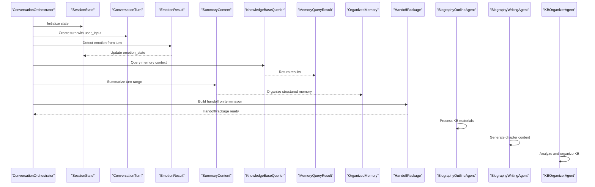

**Diagram sources**
- [session_state.py:87-139](file://src/models/session_state.py#L87-L139)
- [conversation_turn.py:14-52](file://src/models/conversation_turn.py#L14-L52)
- [emotion_result.py:6-57](file://src/models/emotion_result.py#L6-L57)
- [memory_query_result.py:23-81](file://src/models/memory_query_result.py#L23-L81)
- [summary_content.py:37-67](file://src/models/summary_content.py#L37-L67)
- [organized_memory.py:141-151](file://src/models/organized_memory.py#L141-L151)
- [handoff_package.py:32-66](file://src/models/handoff_package.py#L32-L66)
- [biography_outline_state.py:20-50](file://src/models/biography_outline_state.py#L20-L50)
- [biography_writing_state.py:12-40](file://src/models/biography_writing_state.py#L12-L40)
- [kb_organizer_state.py:103-202](file://src/models/kb_organizer_state.py#L103-L202)

## Detailed Component Analysis

### SessionState Analysis
- Responsibilities:
  - Track session lifecycle and progress
  - Maintain coverage metrics across life phases
  - Store collected artifacts and conversation history
  - Manage pending questions and emotion state
- Processing logic highlights:
  - Coverage clamping to [0.0, 1.0]
  - Deduplication when marking collected artifacts
  - Emotion-driven state updates
- Serialization pattern:
  - Enum values serialized via Config.use_enum_values
  - Timestamps stored as datetime
- Data transformation:
  - to_summary() produces a concise snapshot for monitoring
  - get_recent_history(n) supports context windowing

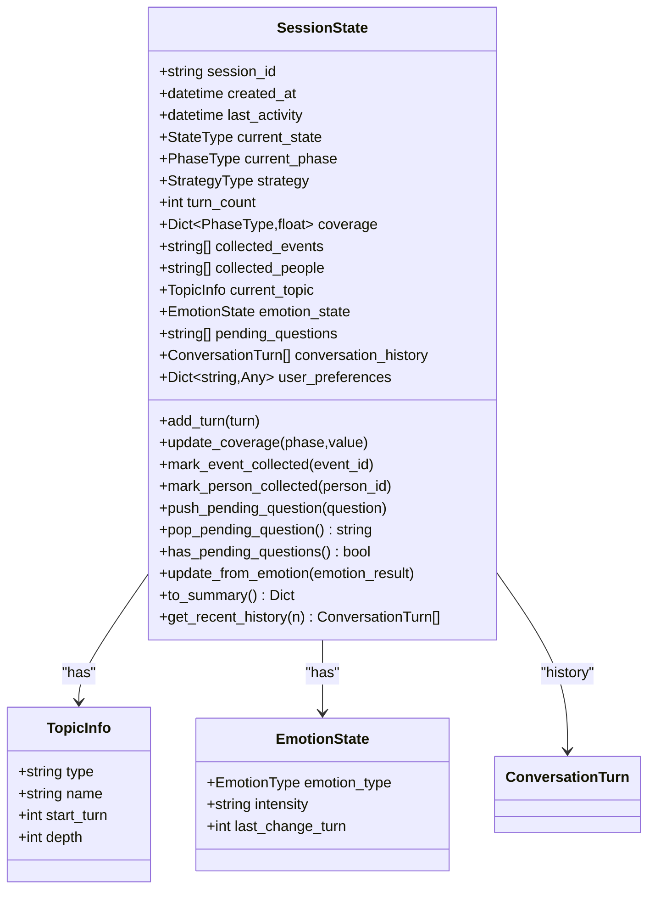

**Diagram sources**
- [session_state.py:9-22](file://src/models/session_state.py#L9-L22)
- [session_state.py:24-139](file://src/models/session_state.py#L24-L139)

**Section sources**
- [session_state.py:24-139](file://src/models/session_state.py#L24-L139)
- [state_type.py:4-12](file://src/enums/state_type.py#L4-L12)
- [phase_type.py:4-10](file://src/enums/phase_type.py#L4-L10)

### ConversationTurn Analysis
- Responsibilities:
  - Capture turn-level inputs and outputs
  - Record extracted entities and events
  - Track emotion and referenced sources
- Processing logic highlights:
  - Metadata and referenced files enable provenance
  - Extraction lists support downstream enrichment

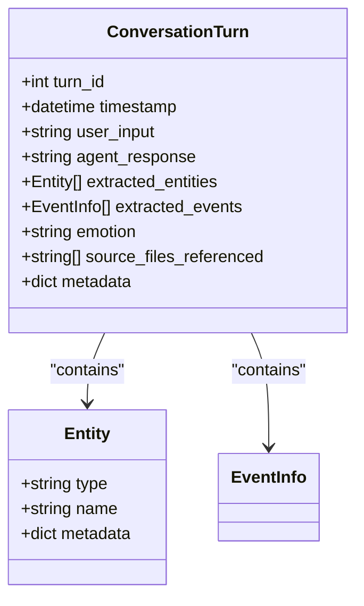

**Diagram sources**
- [conversation_turn.py:7-12](file://src/models/conversation_turn.py#L7-L12)
- [conversation_turn.py:14-52](file://src/models/conversation_turn.py#L14-L52)
- [event_info.py:5-69](file://src/models/event_info.py#L5-L69)

**Section sources**
- [conversation_turn.py:14-52](file://src/models/conversation_turn.py#L14-L52)

### EmotionResult Analysis
- Responsibilities:
  - Encode emotion classification and confidence
  - Provide actionable guidance for the orchestrator
- Processing logic highlights:
  - Computed properties drive pause/redirect decisions
  - Neutral baseline simplifies initialization

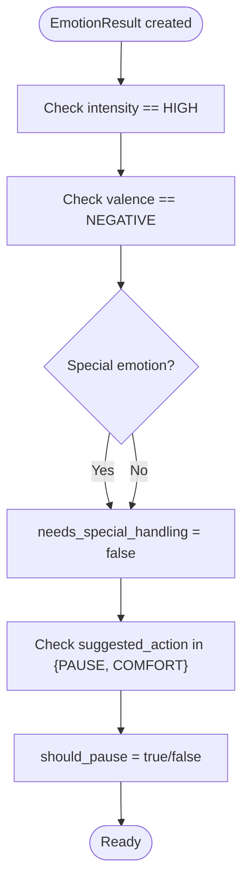

**Diagram sources**
- [emotion_result.py:29-46](file://src/models/emotion_result.py#L29-L46)

**Section sources**
- [emotion_result.py:6-57](file://src/models/emotion_result.py#L6-L57)
- [emotion_type.py:45-50](file://src/enums/emotion_type.py#L45-L50)

### MemoryQueryResult Analysis
- Responsibilities:
  - Aggregate and rank knowledge base matches
  - Provide filtered views by type and top-N relevance
- Processing logic highlights:
  - Sorting by relevance for top-N selection
  - Type filtering helpers for events/people

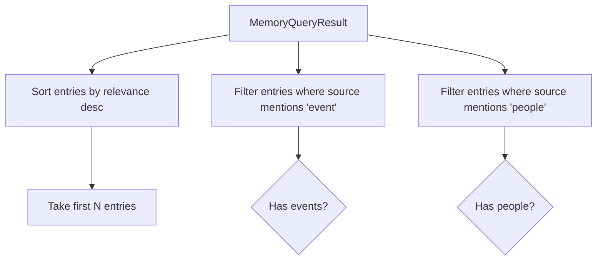

**Diagram sources**
- [memory_query_result.py:51-67](file://src/models/memory_query_result.py#L51-L67)

**Section sources**
- [memory_query_result.py:23-81](file://src/models/memory_query_result.py#L23-L81)

### EventInfo and PersonInfo Analysis
- Responsibilities:
  - Provide canonical, Markdown-ready representations of knowledge items
- Processing logic highlights:
  - to_markdown() renders structured content for file output
  - Supports cross-references and tagging conventions

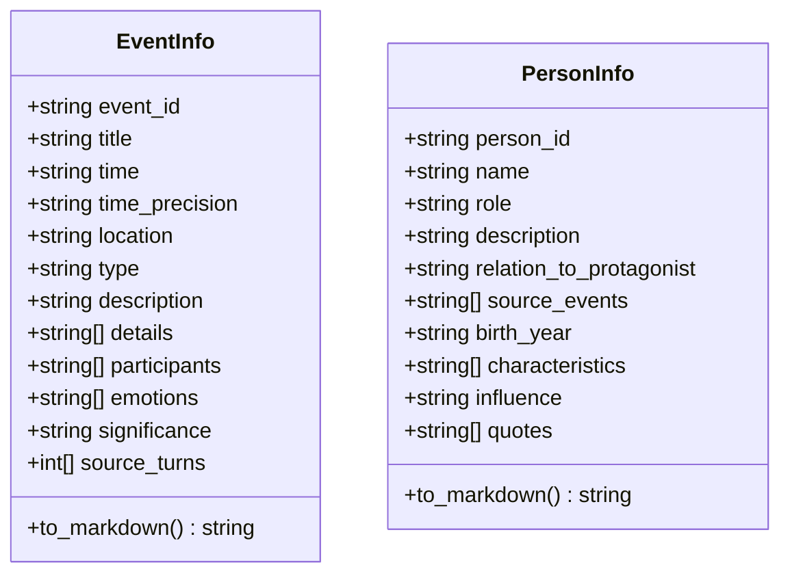

**Diagram sources**
- [event_info.py:5-69](file://src/models/event_info.py#L5-L69)
- [person_info.py:5-61](file://src/models/person_info.py#L5-L61)

**Section sources**
- [event_info.py:5-69](file://src/models/event_info.py#L5-L69)
- [person_info.py:5-61](file://src/models/person_info.py#L5-L61)

### AgentResponse Analysis
- Responsibilities:
  - Standardize turn-level responses and control signals
- Processing logic highlights:
  - State update hints enable downstream synchronization
  - Pause flags and reasons support graceful interruptions

**Section sources**
- [agent_response.py:5-22](file://src/models/agent_response.py#L5-L22)

### HandoffPackage Analysis
- Responsibilities:
  - Bundle session outcomes and preparation notes for downstream consumption
- Processing logic highlights:
  - Progress summaries by life phase
  - CollectedData aggregation across modalities

**Section sources**
- [handoff_package.py:32-66](file://src/models/handoff_package.py#L32-L66)

### OrganizedMemory Analysis
- Responsibilities:
  - Provide a rich, structured representation of timeline, events, people, profiles, and processing metadata
- Processing logic highlights:
  - Enum-typed fields ensure semantic consistency
  - Confidence scores and relationship edges enable trust-aware downstream use

**Section sources**
- [organized_memory.py:141-151](file://src/models/organized_memory.py#L141-L151)

### SummaryContent Analysis
- Responsibilities:
  - Consolidate extraction and update plans for memory management
- Processing logic highlights:
  - Turn range anchors context windows
  - Handoff readiness flags coordinate pipeline transitions

**Section sources**
- [summary_content.py:37-67](file://src/models/summary_content.py#L37-L67)

### Biography Processing Models Analysis

**Updated** Comprehensive analysis of new biography processing models that enable automated biographical content creation.

#### Biography Workflow Coordination
- ChapterEntry serves as the core unit for biography organization
- OutlineDocument manages the complete outline structure
- ChapterTask drives the writing agent execution pipeline
- BiographyState enables incremental processing and caching

#### Status Management
- ChapterStatus provides clear lifecycle tracking from draft to written
- AgentStatus enables robust error handling and recovery
- LifeStage categorization ensures temporal coherence

#### Content Extraction
- EventSummary and PersonSummary provide structured knowledge base integration
- TimelineEntry enables chronological organization
- Source material tracking ensures provenance and quality

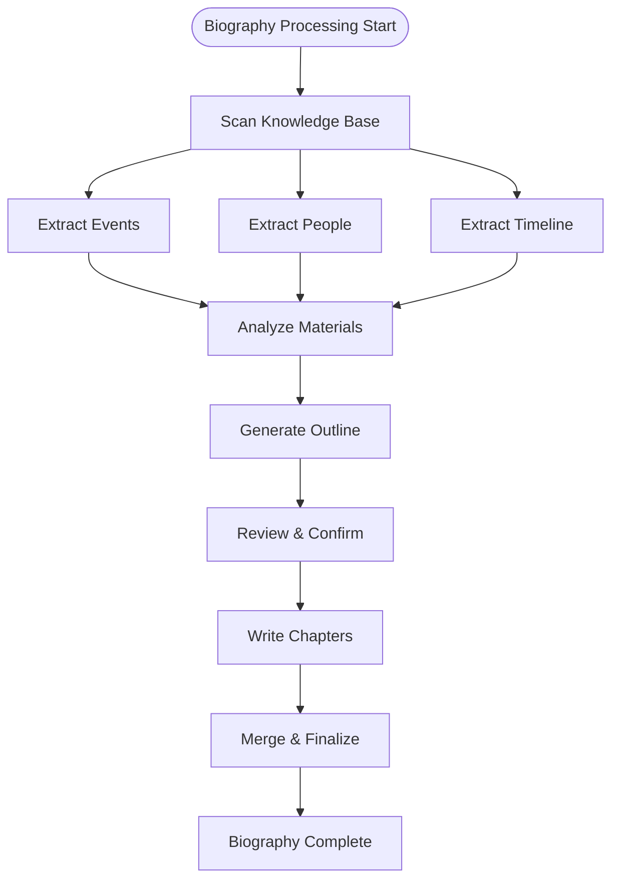

**Diagram sources**
- [biography_outline_state.py:20-50](file://src/models/biography_outline_state.py#L20-L50)
- [biography_writing_state.py:12-40](file://src/models/biography_writing_state.py#L12-L40)
- [biography_models.py:41-127](file://src/models/biography_models.py#L41-L127)

**Section sources**
- [biography_models.py:15-127](file://src/models/biography_models.py#L15-L127)
- [biography_outline_state.py:20-50](file://src/models/biography_outline_state.py#L20-L50)
- [biography_writing_state.py:12-40](file://src/models/biography_writing_state.py#L12-L40)

### Knowledge Base Organization State Analysis

**Updated** Analysis of new models that manage complex knowledge base organization workflows.

#### Task Management
- OrganizerTask defines executable units with status tracking and error handling
- TaskStatus enables robust workflow coordination
- MAX_TASK_RETRIES provides automatic error recovery

#### Conflict Resolution
- ConflictItem tracks contradictions with resolution state
- Evidence normalization ensures consistent data handling
- Active conflict filtering supports prioritized resolution

#### Document Tracking
- MergeRecord provides complete audit trail for document operations
- LinkRedirectMap maintains content integrity during restructuring
- DocumentContents cache optimizes performance

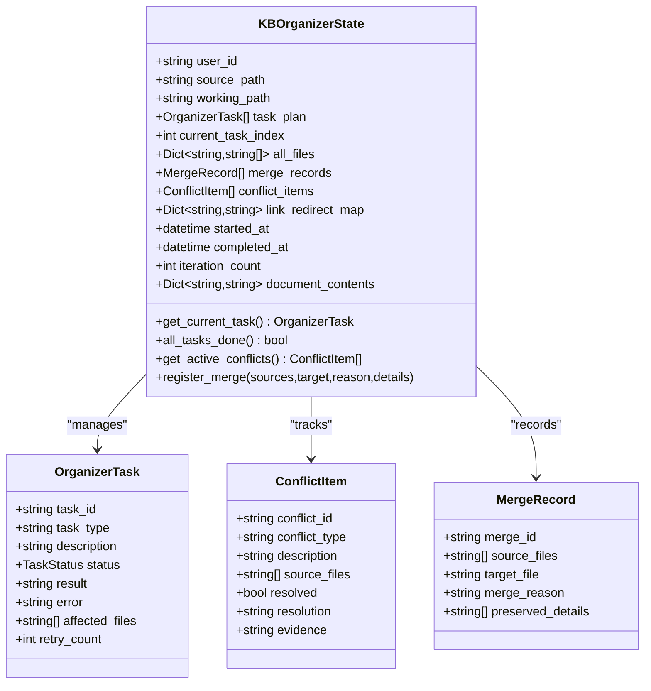

**Diagram sources**
- [kb_organizer_state.py:103-202](file://src/models/kb_organizer_state.py#L103-L202)
- [kb_organizer_state.py:16-77](file://src/models/kb_organizer_state.py#L16-L77)

**Section sources**
- [kb_organizer_state.py:7-202](file://src/models/kb_organizer_state.py#L7-L202)

### Service Schemas Analysis

**Updated** Analysis of new request/response validation models for API endpoint consistency.

#### Request Validation
- UserIdRequest provides common user authentication validation
- InterviewMessageRequest enforces message content requirements
- InterviewEndRequest validates termination requests
- ChapterConfirmRequest allows optional notes with confirmations

#### Error Handling
- ErrorDetail standardizes error reporting structure
- ErrorResponse provides unified error response format
- Field validators ensure data integrity at API boundaries

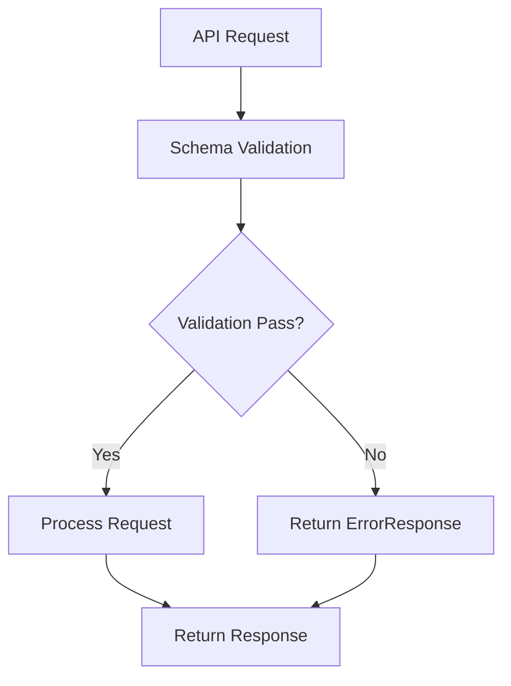

**Diagram sources**
- [requests.py:8-69](file://src/service/schemas/requests.py#L8-L69)

**Section sources**
- [requests.py:8-69](file://src/service/schemas/requests.py#L8-L69)

## Dependency Analysis
The following diagram shows direct dependencies among models and enums, now including new biography processing and knowledge base organization components:

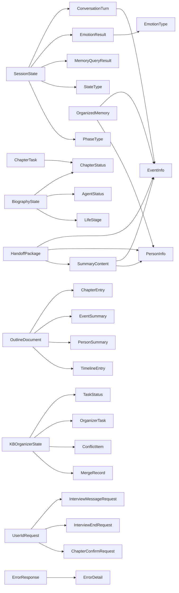

**Diagram sources**
- [session_state.py:24-86](file://src/models/session_state.py#L24-L86)
- [conversation_turn.py:14-52](file://src/models/conversation_turn.py#L14-L52)
- [emotion_result.py:6-57](file://src/models/emotion_result.py#L6-L57)
- [memory_query_result.py:23-81](file://src/models/memory_query_result.py#L23-L81)
- [event_info.py:5-69](file://src/models/event_info.py#L5-L69)
- [person_info.py:5-61](file://src/models/person_info.py#L5-L61)
- [summary_content.py:37-67](file://src/models/summary_content.py#L37-L67)
- [handoff_package.py:32-66](file://src/models/handoff_package.py#L32-L66)
- [organized_memory.py:141-151](file://src/models/organized_memory.py#L141-L151)
- [biography_models.py:15-127](file://src/models/biography_models.py#L15-L127)
- [biography_outline_state.py:20-50](file://src/models/biography_outline_state.py#L20-L50)
- [biography_writing_state.py:12-40](file://src/models/biography_writing_state.py#L12-L40)
- [kb_organizer_state.py:7-202](file://src/models/kb_organizer_state.py#L7-L202)
- [requests.py:8-69](file://src/service/schemas/requests.py#L8-L69)
- [state_type.py:4-12](file://src/enums/state_type.py#L4-L12)
- [phase_type.py:4-10](file://src/enums/phase_type.py#L4-L10)
- [emotion_type.py:4-50](file://src/enums/emotion_type.py#L4-L50)

**Section sources**
- [__init__.py:1-100](file://src/models/__init__.py#L1-L100)

## Performance Considerations
- Prefer streaming or chunked processing for large conversation histories to avoid excessive memory usage when retrieving recent turns.
- Use get_top_entries() judiciously to limit downstream computation to highly relevant results.
- Keep metadata minimal to reduce serialization overhead; avoid large nested structures unless necessary.
- Normalize repeated strings (e.g., event/person IDs) to reduce duplication across lists.
- **New Performance Considerations**:
  - Biography processing models support incremental updates through BiographyState to minimize recomputation.
  - Knowledge base organization state models implement caching via document_contents to optimize repeated operations.
  - Task retry mechanisms in KBOrganizerState prevent unnecessary restarts of failed operations.
  - Service schemas validate input early to reduce downstream processing overhead.

## Troubleshooting Guide
- Validation errors on enum fields:
  - Ensure values match defined enum variants; SessionState uses enum values via Config.use_enum_values.
- Confidence bounds:
  - EmotionResult confidence must be within [0.0, 1.0]; adjust detectors or apply clipping before assignment.
- Coverage normalization:
  - SessionState.update_coverage clamps values to [0.0, 1.0]; verify upstream calculations.
- Empty collections:
  - Use MemoryQueryResult.empty() or SummaryContent.empty() patterns to initialize containers safely.
- Serialization:
  - Confirm datetime fields serialize consistently; avoid mixing naive and timezone-aware datetimes.
- **New Troubleshooting Guidance**:
  - Biography model validation: Ensure ChapterStatus values are properly set; use enum values for consistency.
  - Knowledge base organization: Check TaskStatus transitions; failed tasks automatically retry up to MAX_TASK_RETRIES.
  - Service schema validation: User IDs must match pattern /^[a-zA-Z0-9_]{3,50}$/; messages cannot be empty.
  - Conflict resolution: Use get_active_conflicts() to identify unresolved issues before proceeding with KB operations.

**Section sources**
- [session_state.py:93-95](file://src/models/session_state.py#L93-L95)
- [emotion_result.py:23-23](file://src/models/emotion_result.py#L23-L23)
- [memory_query_result.py:68-71](file://src/models/memory_query_result.py#L68-L71)
- [summary_content.py:37-67](file://src/models/summary_content.py#L37-L67)
- [biography_models.py:15-127](file://src/models/biography_models.py#L15-L127)
- [kb_organizer_state.py:100-170](file://src/models/kb_organizer_state.py#L100-L170)
- [requests.py:12-38](file://src/service/schemas/requests.py#L12-L38)

## Conclusion
The data models define a robust, validated contract enabling seamless orchestration of interviews, emotion-aware responses, knowledge-base interactions, structured memory organization, automated biography processing, and knowledge base organization workflows. Their relationships and constraints ensure consistency across the pipeline, while their serialization-friendly designs support persistence and inter-agent handoffs. The addition of biography processing models and knowledge base organization capabilities significantly expands the system's ability to automate content creation and maintenance workflows.

## Appendices

### Model Usage Examples (by reference)
- Creating a neutral emotion result:
  - [emotion_result.py:48-57](file://src/models/emotion_result.py#L48-L57)
- Building a handoff package:
  - [handoff_package.py:32-66](file://src/models/handoff_package.py#L32-L66)
- Generating Markdown from EventInfo:
  - [event_info.py:34-69](file://src/models/event_info.py#L34-L69)
- Generating Markdown from PersonInfo:
  - [person_info.py:34-61](file://src/models/person_info.py#L34-L61)
- Retrieving top-k memory entries:
  - [memory_query_result.py:51-54](file://src/models/memory_query_result.py#L51-L54)
- Accessing recent conversation history:
  - [session_state.py:137-139](file://src/models/session_state.py#L137-L139)
- **New Model Usage Examples**:
  - Biography outline generation: [biography_outline_state.py:20-50](file://src/models/biography_outline_state.py#L20-L50)
  - Knowledge base organization: [kb_organizer_state.py:103-202](file://src/models/kb_organizer_state.py#L103-L202)
  - API request validation: [requests.py:8-69](file://src/service/schemas/requests.py#L8-L69)