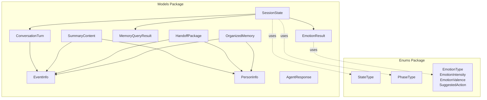
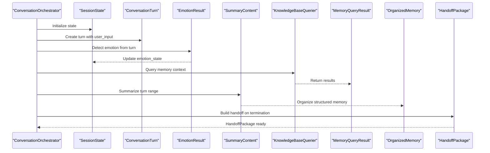
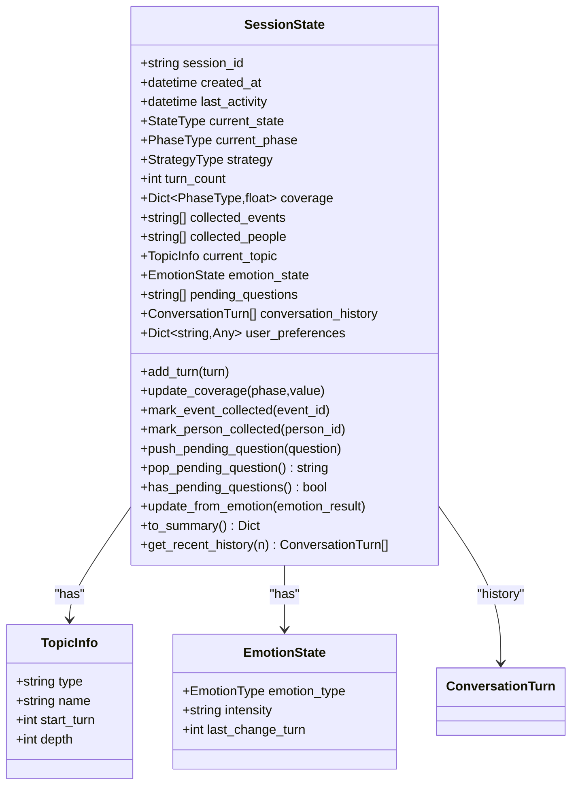
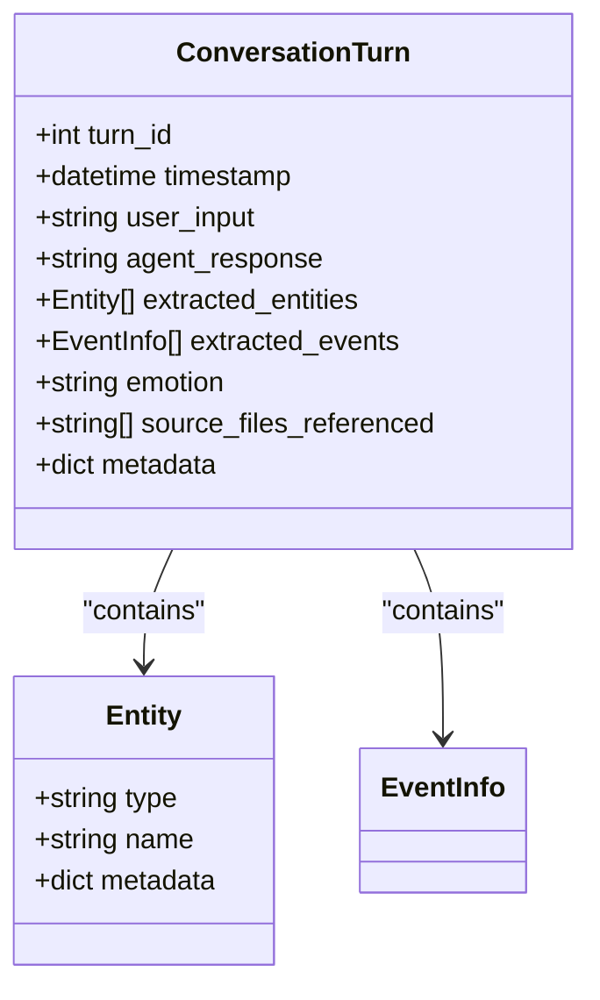
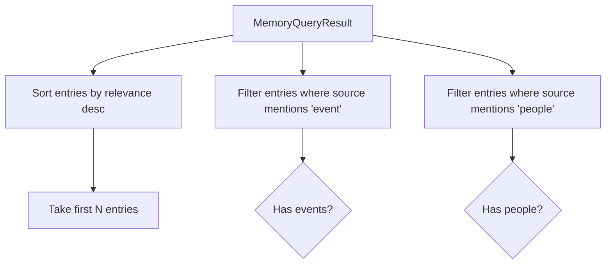
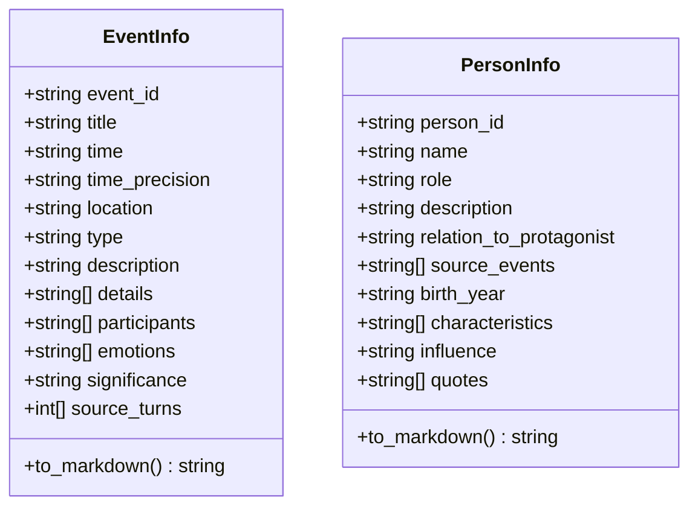
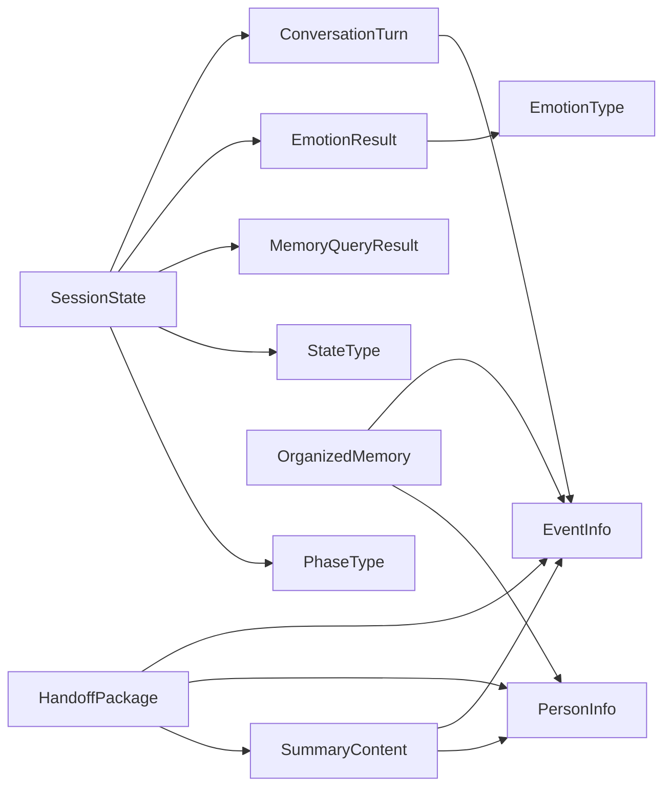

# Data Models

<cite>
**Referenced Files in This Document**
- [__init__.py](file://src/models/__init__.py)
- [session_state.py](file://src/models/session_state.py)
- [conversation_turn.py](file://src/models/conversation_turn.py)
- [emotion_result.py](file://src/models/emotion_result.py)
- [memory_query_result.py](file://src/models/memory_query_result.py)
- [event_info.py](file://src/models/event_info.py)
- [person_info.py](file://src/models/person_info.py)
- [agent_response.py](file://src/models/agent_response.py)
- [handoff_package.py](file://src/models/handoff_package.py)
- [organized_memory.py](file://src/models/organized_memory.py)
- [summary_content.py](file://src/models/summary_content.py)
- [state_type.py](file://src/enums/state_type.py)
- [phase_type.py](file://src/enums/phase_type.py)
- [emotion_type.py](file://src/enums/emotion_type.py)
</cite>

## Table of Contents
1. [Introduction](#introduction)
2. [Project Structure](#project-structure)
3. [Core Components](#core-components)
4. [Architecture Overview](#architecture-overview)
5. [Detailed Component Analysis](#detailed-component-analysis)
6. [Dependency Analysis](#dependency-analysis)
7. [Performance Considerations](#performance-considerations)
8. [Troubleshooting Guide](#troubleshooting-guide)
9. [Conclusion](#conclusion)
10. [Appendices](#appendices)

## Introduction
This document provides comprehensive data model documentation for the Pydantic-based schemas that power the system’s conversation orchestration, memory querying, summarization, and handoff workflows. It focuses on core models such as SessionState, ConversationTurn, EmotionResult, MemoryQueryResult, and specialized models including EventInfo, PersonInfo, AgentResponse, HandoffPackage, OrganizedMemory, and SummaryContent. For each model, we describe fields, data types, validation rules, business constraints, usage scenarios, serialization patterns, and transformation workflows. We also illustrate relationships among models and their roles in the overall system architecture.

## Project Structure
The data models are centralized under the models package and re-exported via the package initializer for easy consumption across the application. Enums that constrain field values are located under the enums package and imported by models where applicable.

**Diagram sources**
- [__init__.py:1-38](file://src/models/__init__.py#L1-L38)
- [session_state.py:24-86](file://src/models/session_state.py#L24-L86)
- [conversation_turn.py:14-52](file://src/models/conversation_turn.py#L14-L52)
- [emotion_result.py:6-57](file://src/models/emotion_result.py#L6-L57)
- [memory_query_result.py:23-81](file://src/models/memory_query_result.py#L23-L81)
- [event_info.py:5-69](file://src/models/event_info.py#L5-L69)
- [person_info.py:5-61](file://src/models/person_info.py#L5-L61)
- [agent_response.py:5-22](file://src/models/agent_response.py#L5-L22)
- [handoff_package.py:32-66](file://src/models/handoff_package.py#L32-L66)
- [organized_memory.py:141-151](file://src/models/organized_memory.py#L141-L151)
- [summary_content.py:37-67](file://src/models/summary_content.py#L37-L67)
- [state_type.py:4-12](file://src/enums/state_type.py#L4-L12)
- [phase_type.py:4-10](file://src/enums/phase_type.py#L4-L10)
- [emotion_type.py:4-50](file://src/enums/emotion_type.py#L4-L50)

**Section sources**
- [__init__.py:1-38](file://src/models/__init__.py#L1-L38)

## Core Components
This section documents the primary data models and their responsibilities, fields, validation rules, and typical usage patterns.

### SessionState
- Purpose: Central state container for an interview session, tracking lifecycle, progress, coverage, collected artifacts, current topic, emotion state, pending questions, conversation history, and user preferences.
- Key fields and constraints:
  - session_id: string; required
  - created_at, last_activity: datetime; defaults to current time
  - current_state: StateType enum; default init
  - current_phase: PhaseType enum; default childhood
  - strategy: StrategyType enum; default sparkle_first
  - turn_count: int; default 0
  - coverage: Dict keyed by PhaseType with float values bounded to [0.0, 1.0]; initialized to zeros
  - collected_events, collected_people: lists of strings
  - current_topic: optional TopicInfo
  - emotion_state: EmotionState with emotion_type, intensity, last_change_turn
  - pending_questions: list of strings
  - conversation_history: list of ConversationTurn
  - user_preferences: dict
- Methods:
  - add_turn, update_coverage, mark_event_collected, mark_person_collected, push_pending_question, pop_pending_question, has_pending_questions, update_from_emotion, to_summary, get_recent_history
- Validation:
  - Uses enum values via Config.use_enum_values
- Typical usage:
  - Held and updated by the orchestrator
  - Read by services for decision-making
  - Serialized for persistence during pause/resume

**Section sources**
- [session_state.py:9-22](file://src/models/session_state.py#L9-L22)
- [session_state.py:24-139](file://src/models/session_state.py#L24-L139)
- [state_type.py:4-12](file://src/enums/state_type.py#L4-L12)
- [phase_type.py:4-10](file://src/enums/phase_type.py#L4-L10)

### ConversationTurn
- Purpose: Encapsulates a single round of conversation including timestamps, user input, agent response, extracted entities and events, emotion tag, referenced source files, and metadata.
- Key fields and constraints:
  - turn_id: int; required
  - timestamp: datetime; default now
  - user_input: string; required
  - agent_response: optional string
  - extracted_entities: list of Entity with type, name, metadata
  - extracted_events: list of EventInfo
  - emotion: optional string
  - source_files_referenced: list of strings
  - metadata: dict
- Typical usage:
  - Appended to SessionState.history
  - Consumed by emotion detector and summarizer

**Section sources**
- [conversation_turn.py:7-12](file://src/models/conversation_turn.py#L7-L12)
- [conversation_turn.py:14-52](file://src/models/conversation_turn.py#L14-L52)
- [event_info.py:5-69](file://src/models/event_info.py#L5-L69)

### EmotionResult
- Purpose: Captures emotion detection results and suggested actions for downstream orchestration decisions.
- Key fields and constraints:
  - emotion_type: EmotionType enum; required
  - intensity: EmotionIntensity enum; default low
  - valence: EmotionValence enum; default neutral
  - confidence: float; constrained to [0.0, 1.0]; default 0.5
  - suggested_action: SuggestedAction enum; default continue
- Behavior:
  - needs_special_handling: computed property based on intensity, valence, and emotion_type
  - should_pause: computed property based on suggested_action
  - default_neutral: class method returning a neutral baseline result
- Typical usage:
  - Returned by emotion detector
  - Used to update SessionState emotion_state

**Section sources**
- [emotion_result.py:6-57](file://src/models/emotion_result.py#L6-L57)
- [emotion_type.py:4-50](file://src/enums/emotion_type.py#L4-L50)

### MemoryQueryResult
- Purpose: Aggregates results from knowledge base queries, including matched entries, linked content, and summary flags.
- Key fields and constraints:
  - query: string; required
  - query_time: datetime; default now
  - entries: list of MemoryEntry with source, content, relevance, memory_type, metadata
  - linked_content: list of LinkedContent with source, target, content_preview, relation
  - total_count: int; default 0
  - has_results: bool; default False
- Methods:
  - get_top_entries(n), get_events(), get_people(), has_related_events()
  - empty(), from_entries()
- Typical usage:
  - Returned by knowledge base querier
  - Used to inform question generation and summarization

**Section sources**
- [memory_query_result.py:6-21](file://src/models/memory_query_result.py#L6-L21)
- [memory_query_result.py:23-81](file://src/models/memory_query_result.py#L23-L81)

### EventInfo
- Purpose: Structured representation of a life event suitable for writing to the knowledge base.
- Key fields and constraints:
  - event_id: string; required
  - title: string; required
  - time: string; required
  - time_precision: string; default "year"
  - location: string; default ""
  - type: string; default "other"
  - description: string; required
  - details: list of strings
  - participants: list of strings
  - emotions: list of strings
  - significance: string; default ""
  - source_turns: list of ints
- Behavior:
  - to_markdown(): generates a formatted Markdown string for file output
- Typical usage:
  - Produced by summarizer and written to memory via file manager
  - Included in handoff and summary content

**Section sources**
- [event_info.py:5-69](file://src/models/event_info.py#L5-L69)

### PersonInfo
- Purpose: Structured representation of a person in the narrative suitable for writing to the knowledge base.
- Key fields and constraints:
  - person_id: string; required
  - name: string; required
  - role: string; required
  - description: string; default ""
  - relation_to_protagonist: string; default ""
  - source_events: list of strings
  - Optional extended fields: birth_year, characteristics, influence, quotes
- Behavior:
  - to_markdown(): generates a formatted Markdown string for file output
- Typical usage:
  - Produced by summarizer and written to memory via file manager
  - Included in handoff and summary content

**Section sources**
- [person_info.py:5-61](file://src/models/person_info.py#L5-L61)

### AgentResponse
- Purpose: Standardized response envelope for a single turn, carrying message, state update hints, pause signals, and handoff triggers.
- Key fields and constraints:
  - message: string; required
  - state_update: dict; default empty
  - should_pause: bool; default False
  - pause_reason: optional string
  - handoff_triggered: bool; default False
- Typical usage:
  - Returned by orchestrator after processing a turn
  - Consumed by upper layers to decide next steps

**Section sources**
- [agent_response.py:5-22](file://src/models/agent_response.py#L5-L22)

### HandoffPackage
- Purpose: Complete payload passed to downstream agents upon session termination, encapsulating session info, progress, collected data, and notes.
- Key fields and constraints:
  - handoff_id: string; required
  - from_agent, to_agent: strings; defaults Agent-A, Agent-B
  - timestamp: datetime; default now
  - session_info: SessionSummary with session_id, total_turns, duration_minutes, strategy_used
  - collection_progress: dict of ProgressInfo keyed by stage
  - collected_data: CollectedData containing lists of EventInfo, PersonInfo, TimeMarker, ThemeInfo
  - raw_conversations_path: string; default empty
  - pending_questions: list of strings
  - notes_for_agent_b: list of strings
- Typical usage:
  - Generated by orchestrator on terminate_session
  - Passed to downstream agent for structured memory organization

**Section sources**
- [handoff_package.py:9-30](file://src/models/handoff_package.py#L9-L30)
- [handoff_package.py:32-66](file://src/models/handoff_package.py#L32-L66)

### OrganizedMemory
- Purpose: Hierarchical and structured memory updates produced by downstream processing, including timeline updates, extracted events and people, profile updates, storage suggestions, and processing summary.
- Key fields and constraints:
  - timeline_updates: list of TimelineUpdate
  - events: list of EventExtract
  - people: list of PersonExtract
  - profile_updates: optional ProfileUpdates
  - storage_suggestions: optional StorageSuggestions
  - processing_summary: optional ProcessingSummary
- Nested types (selected):
  - TimelineUpdate: time_point, time_type (TimeType), life_phase, event_reference, significance
  - EventExtract: event_id, title, time, location, event_type (EventType), importance (Importance), description, participants, emotions, user_evaluation, related_events, source_turns, confidence
  - PersonExtract: person_id, name, relation, relation_type (RelationType), first_appear_time, description, appearance, personality, occupation, key_quotes, relationships, influence_level (InfluenceLevel), source_turns
  - ProfileUpdates: protagonist (optional), relationship_network
  - StorageSuggestions: timeline_file, event_files, people_files
  - ProcessingSummary: counts and notes
- Enum types:
  - TimeType, EventType, Importance, RelationType, InfluenceLevel
- Behavior:
  - empty(): class method returning an empty instance

**Section sources**
- [organized_memory.py:6-46](file://src/models/organized_memory.py#L6-L46)
- [organized_memory.py:49-72](file://src/models/organized_memory.py#L49-L72)
- [organized_memory.py:81-95](file://src/models/organized_memory.py#L81-L95)
- [organized_memory.py:113-147](file://src/models/organized_memory.py#L113-L147)
- [organized_memory.py:141-151](file://src/models/organized_memory.py#L141-L151)

### SummaryContent
- Purpose: Structured summary of a summarization run, including extracted information, memory update plan, pending questions, and handoff readiness.
- Key fields and constraints:
  - summary_id, session_id: strings; required
  - turn_range: tuple of two ints; required
  - created_at: datetime; default now
  - extracted_info: ExtractedInfo with events, people, time_markers, themes
  - memory_updates: MemoryUpdatePlan with short_term_updates, long_term_files, profile_updates
  - pending_questions: list of strings
  - handoff_ready: bool; default False
  - handoff_reason: optional string
- Typical usage:
  - Output of content summarizer
  - Input to memory manager and included in handoff when ready

**Section sources**
- [summary_content.py:8-28](file://src/models/summary_content.py#L8-L28)
- [summary_content.py:30-67](file://src/models/summary_content.py#L30-L67)

## Architecture Overview
The models form a layered data contract across the system:
- SessionState orchestrates conversation flow and aggregates artifacts.
- ConversationTurn captures per-turn inputs, outputs, and extractions.
- EmotionResult informs behavioral adjustments.
- MemoryQueryResult supplies contextual knowledge for questioning and summarization.
- EventInfo and PersonInfo represent structured knowledge items persisted to the knowledge base.
- SummaryContent consolidates structured insights and update plans.
- OrganizedMemory organizes and enriches knowledge post-summarization.
- HandoffPackage packages everything for downstream processing.

**Diagram sources**
- [session_state.py:87-139](file://src/models/session_state.py#L87-L139)
- [conversation_turn.py:14-52](file://src/models/conversation_turn.py#L14-L52)
- [emotion_result.py:6-57](file://src/models/emotion_result.py#L6-L57)
- [memory_query_result.py:23-81](file://src/models/memory_query_result.py#L23-L81)
- [summary_content.py:37-67](file://src/models/summary_content.py#L37-L67)
- [organized_memory.py:141-151](file://src/models/organized_memory.py#L141-L151)
- [handoff_package.py:32-66](file://src/models/handoff_package.py#L32-L66)

## Detailed Component Analysis

### SessionState Analysis
- Responsibilities:
  - Track session lifecycle and progress
  - Maintain coverage metrics across life phases
  - Store collected artifacts and conversation history
  - Manage pending questions and emotion state
- Processing logic highlights:
  - Coverage clamping to [0.0, 1.0]
  - Deduplication when marking collected artifacts
  - Emotion-driven state updates
- Serialization pattern:
  - Enum values serialized via Config.use_enum_values
  - Timestamps stored as datetime
- Data transformation:
  - to_summary() produces a concise snapshot for monitoring
  - get_recent_history(n) supports context windowing

**Diagram sources**
- [session_state.py:9-22](file://src/models/session_state.py#L9-L22)
- [session_state.py:24-139](file://src/models/session_state.py#L24-L139)

**Section sources**
- [session_state.py:24-139](file://src/models/session_state.py#L24-L139)
- [state_type.py:4-12](file://src/enums/state_type.py#L4-L12)
- [phase_type.py:4-10](file://src/enums/phase_type.py#L4-L10)

### ConversationTurn Analysis
- Responsibilities:
  - Capture turn-level inputs and outputs
  - Record extracted entities and events
  - Track emotion and referenced sources
- Processing logic highlights:
  - Metadata and referenced files enable provenance
  - Extraction lists support downstream enrichment

**Diagram sources**
- [conversation_turn.py:7-12](file://src/models/conversation_turn.py#L7-L12)
- [conversation_turn.py:14-52](file://src/models/conversation_turn.py#L14-L52)
- [event_info.py:5-69](file://src/models/event_info.py#L5-L69)

**Section sources**
- [conversation_turn.py:14-52](file://src/models/conversation_turn.py#L14-L52)

### EmotionResult Analysis
- Responsibilities:
  - Encode emotion classification and confidence
  - Provide actionable guidance for the orchestrator
- Processing logic highlights:
  - Computed properties drive pause/redirect decisions
  - Neutral baseline simplifies initialization

**Diagram sources**
- [emotion_result.py:29-46](file://src/models/emotion_result.py#L29-L46)

**Section sources**
- [emotion_result.py:6-57](file://src/models/emotion_result.py#L6-L57)
- [emotion_type.py:45-50](file://src/enums/emotion_type.py#L45-L50)

### MemoryQueryResult Analysis
- Responsibilities:
  - Aggregate and rank knowledge base matches
  - Provide filtered views by type and top-N relevance
- Processing logic highlights:
  - Sorting by relevance for top-N selection
  - Type filtering helpers for events/people

**Diagram sources**
- [memory_query_result.py:51-67](file://src/models/memory_query_result.py#L51-L67)

**Section sources**
- [memory_query_result.py:23-81](file://src/models/memory_query_result.py#L23-L81)

### EventInfo and PersonInfo Analysis
- Responsibilities:
  - Provide canonical, Markdown-ready representations of knowledge items
- Processing logic highlights:
  - to_markdown() renders structured content for file output
  - Supports cross-references and tagging conventions

**Diagram sources**
- [event_info.py:5-69](file://src/models/event_info.py#L5-L69)
- [person_info.py:5-61](file://src/models/person_info.py#L5-L61)

**Section sources**
- [event_info.py:5-69](file://src/models/event_info.py#L5-L69)
- [person_info.py:5-61](file://src/models/person_info.py#L5-L61)

### AgentResponse Analysis
- Responsibilities:
  - Standardize turn-level responses and control signals
- Processing logic highlights:
  - State update hints enable downstream synchronization
  - Pause flags and reasons support graceful interruptions

**Section sources**
- [agent_response.py:5-22](file://src/models/agent_response.py#L5-L22)

### HandoffPackage Analysis
- Responsibilities:
  - Bundle session outcomes and preparation notes for downstream consumption
- Processing logic highlights:
  - Progress summaries by life phase
  - CollectedData aggregation across modalities

**Section sources**
- [handoff_package.py:32-66](file://src/models/handoff_package.py#L32-L66)

### OrganizedMemory Analysis
- Responsibilities:
  - Provide a rich, structured representation of timeline, events, people, profiles, and processing metadata
- Processing logic highlights:
  - Enum-typed fields ensure semantic consistency
  - Confidence scores and relationship edges enable trust-aware downstream use

**Section sources**
- [organized_memory.py:141-151](file://src/models/organized_memory.py#L141-L151)

### SummaryContent Analysis
- Responsibilities:
  - Consolidate extraction and update plans for memory management
- Processing logic highlights:
  - Turn range anchors context windows
  - Handoff readiness flags coordinate pipeline transitions

**Section sources**
- [summary_content.py:37-67](file://src/models/summary_content.py#L37-L67)

## Dependency Analysis
The following diagram shows direct dependencies among models and enums:

**Diagram sources**
- [session_state.py:24-86](file://src/models/session_state.py#L24-L86)
- [conversation_turn.py:14-52](file://src/models/conversation_turn.py#L14-L52)
- [emotion_result.py:6-57](file://src/models/emotion_result.py#L6-L57)
- [memory_query_result.py:23-81](file://src/models/memory_query_result.py#L23-L81)
- [event_info.py:5-69](file://src/models/event_info.py#L5-L69)
- [person_info.py:5-61](file://src/models/person_info.py#L5-L61)
- [summary_content.py:37-67](file://src/models/summary_content.py#L37-L67)
- [handoff_package.py:32-66](file://src/models/handoff_package.py#L32-L66)
- [organized_memory.py:141-151](file://src/models/organized_memory.py#L141-L151)
- [state_type.py:4-12](file://src/enums/state_type.py#L4-L12)
- [phase_type.py:4-10](file://src/enums/phase_type.py#L4-L10)
- [emotion_type.py:4-50](file://src/enums/emotion_type.py#L4-L50)

**Section sources**
- [__init__.py:1-38](file://src/models/__init__.py#L1-L38)

## Performance Considerations
- Prefer streaming or chunked processing for large conversation histories to avoid excessive memory usage when retrieving recent turns.
- Use get_top_entries() judiciously to limit downstream computation to highly relevant results.
- Keep metadata minimal to reduce serialization overhead; avoid large nested structures unless necessary.
- Normalize repeated strings (e.g., event/person IDs) to reduce duplication across lists.

## Troubleshooting Guide
- Validation errors on enum fields:
  - Ensure values match defined enum variants; SessionState uses enum values via Config.use_enum_values.
- Confidence bounds:
  - EmotionResult confidence must be within [0.0, 1.0]; adjust detectors or apply clipping before assignment.
- Coverage normalization:
  - SessionState.update_coverage clamps values to [0.0, 1.0]; verify upstream calculations.
- Empty collections:
  - Use MemoryQueryResult.empty() or SummaryContent.empty() patterns to initialize containers safely.
- Serialization:
  - Confirm datetime fields serialize consistently; avoid mixing naive and timezone-aware datetimes.

**Section sources**
- [session_state.py:93-95](file://src/models/session_state.py#L93-L95)
- [emotion_result.py:23-23](file://src/models/emotion_result.py#L23-L23)
- [memory_query_result.py:68-71](file://src/models/memory_query_result.py#L68-L71)
- [summary_content.py:37-67](file://src/models/summary_content.py#L37-L67)

## Conclusion
The data models define a robust, validated contract enabling seamless orchestration of interviews, emotion-aware responses, knowledge-base interactions, and structured memory organization. Their relationships and constraints ensure consistency across the pipeline, while their serialization-friendly designs support persistence and inter-agent handoffs.

## Appendices

### Model Usage Examples (by reference)
- Creating a neutral emotion result:
  - [emotion_result.py:48-57](file://src/models/emotion_result.py#L48-L57)
- Building a handoff package:
  - [handoff_package.py:32-66](file://src/models/handoff_package.py#L32-L66)
- Generating Markdown from EventInfo:
  - [event_info.py:34-69](file://src/models/event_info.py#L34-L69)
- Generating Markdown from PersonInfo:
  - [person_info.py:34-61](file://src/models/person_info.py#L34-L61)
- Retrieving top-k memory entries:
  - [memory_query_result.py:51-54](file://src/models/memory_query_result.py#L51-L54)
- Accessing recent conversation history:
  - [session_state.py:137-139](file://src/models/session_state.py#L137-L139)