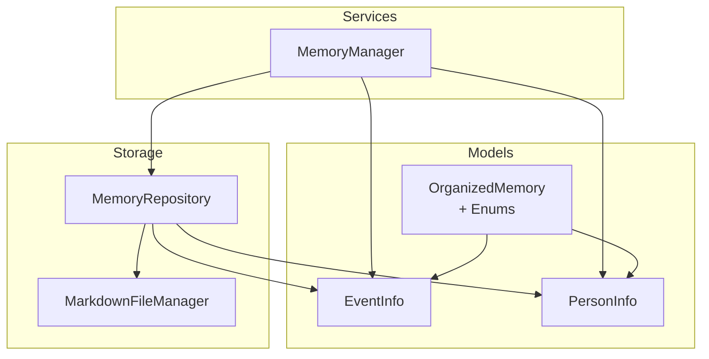
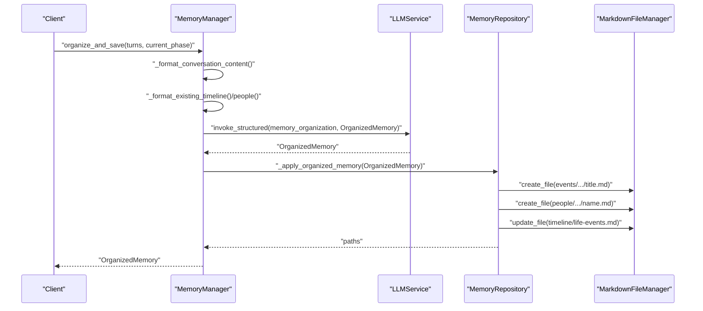
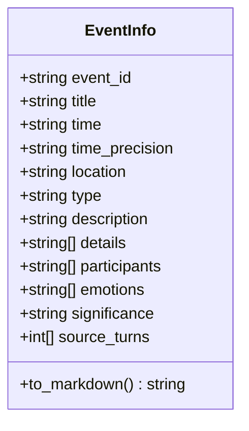
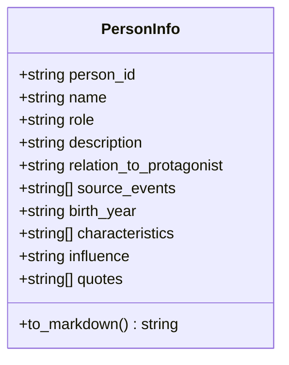
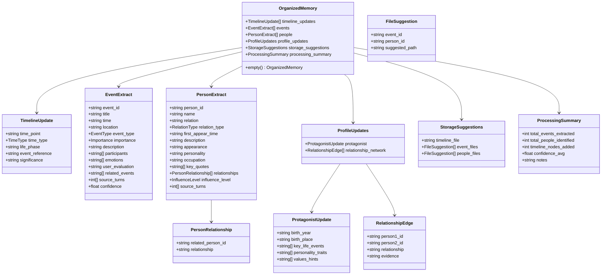
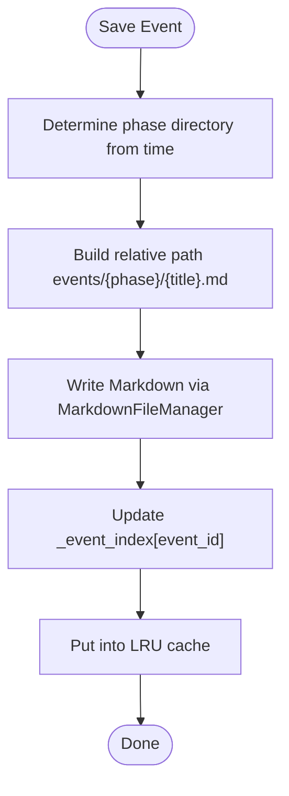
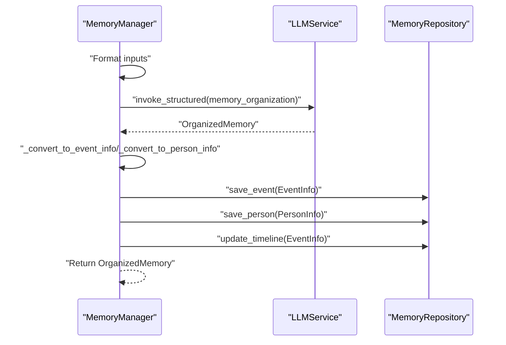
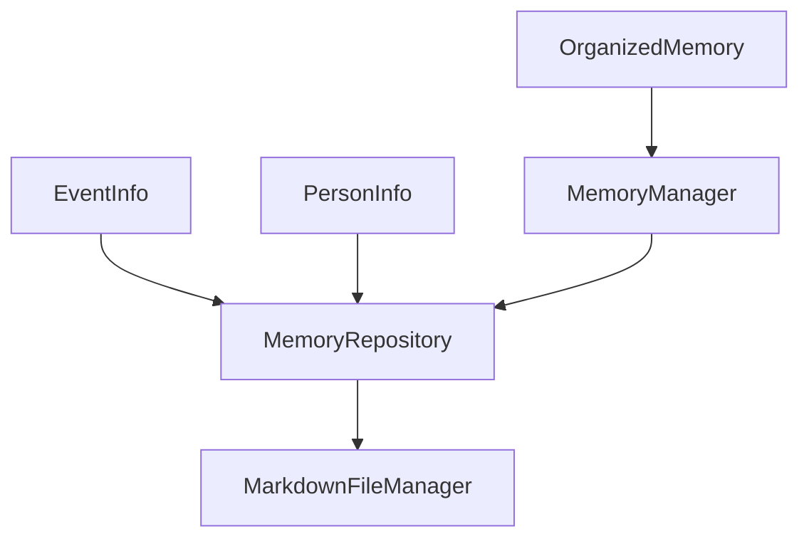

# Event and Person Models

<cite>
**Referenced Files in This Document**
- [event_info.py](file://src/models/event_info.py)
- [person_info.py](file://src/models/person_info.py)
- [organized_memory.py](file://src/models/organized_memory.py)
- [memory_repository.py](file://src/storage/memory_repository.py)
- [markdown_file_manager.py](file://src/storage/markdown_file_manager.py)
- [memory_manager.py](file://src/services/memory_manager.py)
- [__init__.py](file://src/models/__init__.py)
- [test_memory_repository.py](file://tests/test_memory_repository.py)
- [test_memory_manager.py](file://tests/test_memory_manager.py)
</cite>

## Table of Contents
1. [Introduction](#introduction)
2. [Project Structure](#project-structure)
3. [Core Components](#core-components)
4. [Architecture Overview](#architecture-overview)
5. [Detailed Component Analysis](#detailed-component-analysis)
6. [Dependency Analysis](#dependency-analysis)
7. [Performance Considerations](#performance-considerations)
8. [Troubleshooting Guide](#troubleshooting-guide)
9. [Conclusion](#conclusion)

## Introduction
This document provides detailed data model documentation for event and person information models, along with supporting hierarchical memory organization constructs. It covers:
- EventInfo for structured event representation
- PersonInfo for character profile management
- OrganizedMemory for hierarchical data organization across time, events, and people
- Field definitions, validation rules, relationships, and business constraints
- Examples of event-person relationship modeling, hierarchical memory organization, cross-referencing patterns, and consistency enforcement
- Serialization formats, indexing strategies, and performance considerations for large-scale memory management

## Project Structure
The relevant models and their relationships are defined under the models package and integrated with storage and service layers:
- Models define typed data structures with validation and serialization support
- MemoryRepository manages short-term, long-term, and profile memory with caching and indexing
- MarkdownFileManager handles file system operations and wiki-link parsing
- MemoryManager orchestrates LLM-driven organization and persistence of memories

**Diagram sources**
- [memory_manager.py:27-61](file://src/services/memory_manager.py#L27-L61)
- [memory_repository.py:40-87](file://src/storage/memory_repository.py#L40-L87)
- [markdown_file_manager.py:31-45](file://src/storage/markdown_file_manager.py#L31-L45)
- [event_info.py:5-33](file://src/models/event_info.py#L5-L33)
- [person_info.py:5-33](file://src/models/person_info.py#L5-L33)
- [organized_memory.py:141-147](file://src/models/organized_memory.py#L141-L147)

**Section sources**
- [__init__.py:1-86](file://src/models/__init__.py#L1-L86)
- [memory_manager.py:27-61](file://src/services/memory_manager.py#L27-L61)
- [memory_repository.py:40-87](file://src/storage/memory_repository.py#L40-L87)
- [markdown_file_manager.py:31-45](file://src/storage/markdown_file_manager.py#L31-L45)

## Core Components

### EventInfo Model
EventInfo captures a single event with identifiers, temporal and spatial context, categorization, narrative details, participants, emotional tags, significance, and provenance.

Key fields and constraints:
- event_id: Unique identifier for the event
- title: Event title
- time: Human-readable time descriptor
- time_precision: Enumerated precision level (year, month, day)
- location: Place associated with the event
- type: Event category (e.g., birth, education, career, marriage, relocation, achievement, challenge, travel, historical, other)
- description: Narrative description
- details: List of key details
- participants: List of person identifiers involved
- emotions: List of emotion tags
- significance: Personal meaning or evaluation
- source_turns: List of dialogue turn indices that sourced this record

Validation and behavior:
- Uses Pydantic BaseModel with Field descriptions for validation
- Provides to_markdown() method to render a structured Markdown representation with cross-links to people and timeline

Serialization and indexing:
- Persisted as Markdown files under events/<phase>/<title>.md
- Indexed by event_id in MemoryRepository for fast retrieval and caching

**Section sources**
- [event_info.py:5-33](file://src/models/event_info.py#L5-L33)
- [event_info.py:34-69](file://src/models/event_info.py#L34-L69)
- [memory_repository.py:176-200](file://src/storage/memory_repository.py#L176-L200)

### PersonInfo Model
PersonInfo captures a character’s identity, relationships, biographical details, and connections to events.

Key fields and constraints:
- person_id: Unique identifier for the person
- name: Full name
- role: Role or relationship type (e.g., immediate_family, extended_family, spouse, friend, colleague, mentor, classmate, neighbor)
- description: General description
- relation_to_protagonist: Relationship to the protagonist
- source_events: List of event identifiers associated with this person
- birth_year: Optional birth year
- characteristics: Optional list of personality traits
- influence: Optional influence level on the protagonist
- quotes: Optional list of key quotes

Validation and behavior:
- Uses Pydantic BaseModel with Field descriptions
- Provides to_markdown() method to render a structured profile with cross-links to related events and quotes

Serialization and indexing:
- Persisted as Markdown files under people/<role>/.../<name>.md
- Special handling for protagonist profile stored at people/protagonist.md
- Indexed by person_id in MemoryRepository for retrieval and caching

**Section sources**
- [person_info.py:5-33](file://src/models/person_info.py#L5-L33)
- [person_info.py:34-61](file://src/models/person_info.py#L34-L61)
- [memory_repository.py:202-226](file://src/storage/memory_repository.py#L202-L226)

### OrganizedMemory Model
OrganizedMemory is a container for LLM-structured outputs across three dimensions: timeline updates, events, and people, plus optional profile updates and processing metadata.

Primary components:
- timeline_updates: List of timeline nodes with time_point, time_type, life_phase, optional event_reference, and significance
- events: List of EventExtract items (converted to EventInfo for persistence)
- people: List of PersonExtract items (converted to PersonInfo for persistence)
- profile_updates: Optional ProfileUpdates for protagonist and relationship network
- storage_suggestions: Optional suggestions for file placement
- processing_summary: Optional summary statistics

Supporting types and enums:
- TimeType: exact, approximate, period, unknown
- EventType: birth, family, education, career, marriage, children, achievement, difficulty, migration, other
- Importance: core, important, normal
- RelationType: family, friend, colleague, neighbor, teacher, student, other
- InfluenceLevel: high, medium, low

Conversion helpers:
- MemoryManager converts EventExtract and PersonExtract to EventInfo and PersonInfo prior to persistence

**Section sources**
- [organized_memory.py:49-72](file://src/models/organized_memory.py#L49-L72)
- [organized_memory.py:80-95](file://src/models/organized_memory.py#L80-L95)
- [organized_memory.py:113-147](file://src/models/organized_memory.py#L113-L147)
- [organized_memory.py:6-46](file://src/models/organized_memory.py#L6-L46)
- [memory_manager.py:251-283](file://src/services/memory_manager.py#L251-L283)

## Architecture Overview
The system orchestrates LLM-driven extraction into structured models, persists them to Markdown files, maintains in-memory caches and indices, and supports queries and cross-references.

**Diagram sources**
- [memory_manager.py:111-156](file://src/services/memory_manager.py#L111-L156)
- [memory_manager.py:158-193](file://src/services/memory_manager.py#L158-L193)
- [memory_repository.py:176-200](file://src/storage/memory_repository.py#L176-L200)
- [memory_repository.py:202-226](file://src/storage/memory_repository.py#L202-L226)
- [memory_repository.py:248-260](file://src/storage/memory_repository.py#L248-L260)

## Detailed Component Analysis

### EventInfo Class Diagram

**Diagram sources**
- [event_info.py:5-33](file://src/models/event_info.py#L5-L33)
- [event_info.py:34-69](file://src/models/event_info.py#L34-L69)

**Section sources**
- [event_info.py:5-33](file://src/models/event_info.py#L5-L33)
- [event_info.py:34-69](file://src/models/event_info.py#L34-L69)

### PersonInfo Class Diagram

**Diagram sources**
- [person_info.py:5-33](file://src/models/person_info.py#L5-L33)
- [person_info.py:34-61](file://src/models/person_info.py#L34-L61)

**Section sources**
- [person_info.py:5-33](file://src/models/person_info.py#L5-L33)
- [person_info.py:34-61](file://src/models/person_info.py#L34-L61)

### OrganizedMemory and Supporting Types

**Diagram sources**
- [organized_memory.py:49-147](file://src/models/organized_memory.py#L49-L147)
- [organized_memory.py:6-46](file://src/models/organized_memory.py#L6-L46)

**Section sources**
- [organized_memory.py:49-147](file://src/models/organized_memory.py#L49-L147)
- [organized_memory.py:6-46](file://src/models/organized_memory.py#L6-L46)

### MemoryRepository: Storage and Indexing
MemoryRepository manages:
- Short-term memory (in-memory dictionary with timestamp)
- LRU cache for long-lived retrievals
- Event and person indices keyed by IDs
- Timeline updates appended to a shared timeline file
- Directory-aware file naming and role-based routing

Key behaviors:
- save_event(): writes Markdown, updates event index and cache
- save_person(): routes to appropriate role directory, special-case for protagonist
- get_event()/get_person(): cache-first, then index fallback
- update_timeline(): appends timeline entries
- query_events(): filters by keyword and type against in-memory index

**Diagram sources**
- [memory_repository.py:176-200](file://src/storage/memory_repository.py#L176-L200)
- [markdown_file_manager.py:134-170](file://src/storage/markdown_file_manager.py#L134-L170)

**Section sources**
- [memory_repository.py:40-87](file://src/storage/memory_repository.py#L40-L87)
- [memory_repository.py:176-260](file://src/storage/memory_repository.py#L176-L260)
- [markdown_file_manager.py:31-45](file://src/storage/markdown_file_manager.py#L31-L45)

### MemoryManager: Orchestration and Conversion
MemoryManager coordinates:
- Formatting conversation content and existing knowledge
- Invoking LLM with a structured template to produce OrganizedMemory
- Converting EventExtract/PersonExtract to EventInfo/PersonInfo
- Persisting to storage and updating profile memory

**Diagram sources**
- [memory_manager.py:111-156](file://src/services/memory_manager.py#L111-L156)
- [memory_manager.py:251-283](file://src/services/memory_manager.py#L251-L283)
- [memory_repository.py:176-260](file://src/storage/memory_repository.py#L176-L260)

**Section sources**
- [memory_manager.py:27-61](file://src/services/memory_manager.py#L27-L61)
- [memory_manager.py:111-156](file://src/services/memory_manager.py#L111-L156)
- [memory_manager.py:251-283](file://src/services/memory_manager.py#L251-L283)

## Dependency Analysis
- Models depend on Pydantic for validation and serialization
- MemoryRepository depends on MarkdownFileManager for file operations and on MemoryManager for orchestration
- MemoryManager depends on LLMService for structured extraction and on MemoryRepository for persistence
- Tests validate conversion, persistence, querying, and profile updates

**Diagram sources**
- [memory_manager.py:7-13](file://src/services/memory_manager.py#L7-L13)
- [memory_repository.py:8-11](file://src/storage/memory_repository.py#L8-L11)
- [event_info.py:1-2](file://src/models/event_info.py#L1-L2)
- [person_info.py:1-2](file://src/models/person_info.py#L1-L2)
- [organized_memory.py:1-3](file://src/models/organized_memory.py#L1-L3)

**Section sources**
- [__init__.py:1-86](file://src/models/__init__.py#L1-L86)
- [memory_manager.py:7-13](file://src/services/memory_manager.py#L7-L13)
- [memory_repository.py:8-11](file://src/storage/memory_repository.py#L8-L11)

## Performance Considerations
- Caching: LRU cache reduces repeated reads for frequently accessed events and persons
- Indexing: In-memory dictionaries enable O(1) average-time retrieval by ID
- Asynchronous I/O: MarkdownFileManager uses async file operations to minimize blocking
- Parallelism: MemoryManager uses asyncio.gather to save multiple events and people concurrently
- File naming: Sanitized filenames and directory partitioning improve filesystem scalability
- Query filtering: Lightweight in-memory filtering on small to moderate datasets; consider database-backed search for large-scale deployments

[No sources needed since this section provides general guidance]

## Troubleshooting Guide
Common issues and resolutions:
- Missing person_id during save_person: Validation raises an error; ensure person_id is set before saving
- Timeline file not updated: Verify update_timeline is called after save_event and that the timeline path exists
- Query returns empty: Confirm events are indexed and query filters match available fields
- Cache misses: Check cache keys and capacity; ensure keys follow the "event:<id>" and "person:<id>" patterns

Validation and tests:
- Unit tests confirm save, retrieval, timeline updates, and query behaviors
- Tests demonstrate conversion from EventExtract/PersonExtract to EventInfo/PersonInfo

**Section sources**
- [memory_repository.py:204-206](file://src/storage/memory_repository.py#L204-L206)
- [memory_repository.py:248-260](file://src/storage/memory_repository.py#L248-L260)
- [test_memory_repository.py:52-131](file://tests/test_memory_repository.py#L52-L131)
- [test_memory_repository.py:193-226](file://tests/test_memory_repository.py#L193-L226)
- [test_memory_manager.py:32-96](file://tests/test_memory_manager.py#L32-L96)

## Conclusion
The event and person models, together with OrganizedMemory, form a cohesive data layer for capturing, organizing, and persisting life story memories. They leverage Pydantic for robust validation, integrate with asynchronous file operations for scalability, and maintain efficient in-memory caches and indices. The provided examples and diagrams illustrate how to model relationships, organize hierarchical memory, enforce data consistency, and prepare for large-scale growth through indexing and parallel persistence.