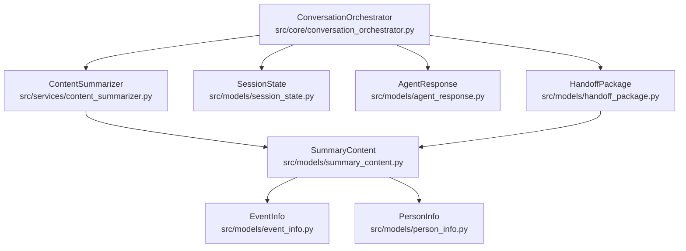
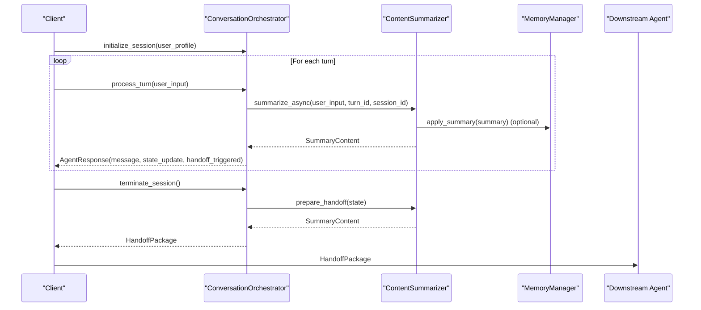
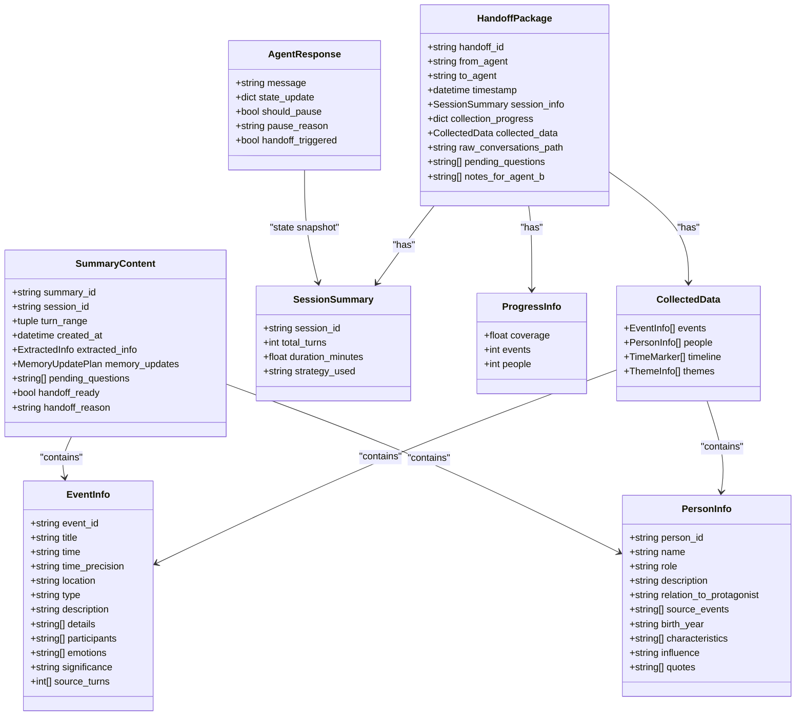

# Response and Handoff Models

<cite>
**Referenced Files in This Document**
- [agent_response.py](file://src/models/agent_response.py)
- [handoff_package.py](file://src/models/handoff_package.py)
- [summary_content.py](file://src/models/summary_content.py)
- [conversation_turn.py](file://src/models/conversation_turn.py)
- [session_state.py](file://src/models/session_state.py)
- [event_info.py](file://src/models/event_info.py)
- [person_info.py](file://src/models/person_info.py)
- [content_summarizer.py](file://src/services/content_summarizer.py)
- [conversation_orchestrator.py](file://src/core/conversation_orchestrator.py)
- [test_integration.py](file://test_integration.py)
</cite>

## Table of Contents
1. [Introduction](#introduction)
2. [Project Structure](#project-structure)
3. [Core Components](#core-components)
4. [Architecture Overview](#architecture-overview)
5. [Detailed Component Analysis](#detailed-component-analysis)
6. [Dependency Analysis](#dependency-analysis)
7. [Performance Considerations](#performance-considerations)
8. [Troubleshooting Guide](#troubleshooting-guide)
9. [Conclusion](#conclusion)
10. [Appendices](#appendices)

## Introduction
This document provides comprehensive data model documentation for response and handoff models in the system. It focuses on:
- AgentResponse for standardized agent communication
- HandoffPackage for session completion and transfer data
- SummaryContent for content structuring and presentation
It also explains field definitions, validation rules, response categorization schemes, handoff criteria, and practical examples for response formatting, handoff decision logic, content aggregation workflows, and data export mechanisms. Integration points with external systems, compliance requirements, and data retention policies are included.

## Project Structure
The response and handoff models are part of a modular architecture centered around a ConversationOrchestrator that coordinates multiple services and models. The orchestrator manages session lifecycle, handles user input, triggers content summarization, and prepares handoff packages for downstream consumption.

**Diagram sources**
- [conversation_orchestrator.py](file://src/core/conversation_orchestrator.py)
- [content_summarizer.py](file://src/services/content_summarizer.py)
- [session_state.py](file://src/models/session_state.py)
- [agent_response.py](file://src/models/agent_response.py)
- [handoff_package.py](file://src/models/handoff_package.py)
- [summary_content.py](file://src/models/summary_content.py)
- [event_info.py](file://src/models/event_info.py)
- [person_info.py](file://src/models/person_info.py)

**Section sources**
- [conversation_orchestrator.py](file://src/core/conversation_orchestrator.py)
- [content_summarizer.py](file://src/services/content_summarizer.py)
- [session_state.py](file://src/models/session_state.py)
- [agent_response.py](file://src/models/agent_response.py)
- [handoff_package.py](file://src/models/handoff_package.py)
- [summary_content.py](file://src/models/summary_content.py)
- [event_info.py](file://src/models/event_info.py)
- [person_info.py](file://src/models/person_info.py)

## Core Components
This section defines the three primary models and their roles in the system.

- AgentResponse
  - Purpose: Standardized agent communication payload returned after each conversation turn.
  - Key fields: message, state_update, should_pause, pause_reason, handoff_triggered.
  - Validation: Pydantic BaseModel enforces field presence and types; optional fields may be None.
  - Typical usage: Returned by ConversationOrchestrator.process_turn().

- HandoffPackage
  - Purpose: Complete session handoff container passed to downstream agents.
  - Key fields: handoff_id, from_agent, to_agent, timestamp, session_info, collection_progress, collected_data, raw_conversations_path, pending_questions, notes_for_agent_b.
  - Validation: Pydantic BaseModel with typed substructures (SessionSummary, ProgressInfo, CollectedData).
  - Typical usage: Generated by ConversationOrchestrator.prepare_handoff() and consumed by downstream agents.

- SummaryContent
  - Purpose: Structured summary of content extracted during or after a session.
  - Key fields: summary_id, session_id, turn_range, created_at, extracted_info, memory_updates, pending_questions, handoff_ready, handoff_reason.
  - Validation: Pydantic BaseModel with nested ExtractedInfo and MemoryUpdatePlan.
  - Typical usage: Produced by ContentSummarizer.summarize_async() and prepare_handoff(), embedded into HandoffPackage.

**Section sources**
- [agent_response.py](file://src/models/agent_response.py)
- [handoff_package.py](file://src/models/handoff_package.py)
- [summary_content.py](file://src/models/summary_content.py)

## Architecture Overview
The ConversationOrchestrator coordinates services and models to handle user input, detect emotion, query knowledge, generate questions, and summarize content. It decides whether to trigger a handoff based on session state and thresholds.

**Diagram sources**
- [conversation_orchestrator.py](file://src/core/conversation_orchestrator.py)
- [content_summarizer.py](file://src/services/content_summarizer.py)

**Section sources**
- [conversation_orchestrator.py](file://src/core/conversation_orchestrator.py)
- [content_summarizer.py](file://src/services/content_summarizer.py)

## Detailed Component Analysis

### AgentResponse Model
AgentResponse encapsulates a single turn’s response and auxiliary signals for orchestration.

- Fields and validation
  - message: Required string; agent’s reply text.
  - state_update: Optional dictionary; snapshot of session state for observability.
  - should_pause: Boolean flag indicating pause recommendation.
  - pause_reason: Optional string; reason for pause (e.g., detected emotion).
  - handoff_triggered: Boolean flag signaling session termination readiness.

- Usage patterns
  - Returned by ConversationOrchestrator.process_turn().
  - Consumers check should_pause and handoff_triggered to decide next actions.

- Example usage
  - See integration test loop where response.handoff_triggered is checked to decide termination.

**Section sources**
- [agent_response.py](file://src/models/agent_response.py)
- [conversation_orchestrator.py](file://src/core/conversation_orchestrator.py)
- [test_integration.py](file://test_integration.py)

### HandoffPackage Model
HandoffPackage aggregates session outcomes and contextual data for downstream consumption.

- Nested structures
  - SessionSummary: session_id, total_turns, duration_minutes, strategy_used.
  - ProgressInfo: coverage (float), events (int), people (int).
  - CollectedData: lists of EventInfo, PersonInfo, TimeMarker, ThemeInfo.

- Fields and validation
  - handoff_id: Required string; unique identifier for the handoff.
  - from_agent, to_agent: Defaults for Agent-A and Agent-B.
  - timestamp: Defaults to current time.
  - session_info: Required SessionSummary.
  - collection_progress: Dictionary keyed by phase with ProgressInfo values.
  - collected_data: Required CollectedData.
  - raw_conversations_path: Optional path string.
  - pending_questions: List of strings.
  - notes_for_agent_b: List of strings.

- Integration points
  - Constructed by ConversationOrchestrator.prepare_handoff().
  - Consumed by downstream agents after session termination.

- Example usage
  - Integration test demonstrates retrieval of handoff_id, session_info, and collected counts.

**Section sources**
- [handoff_package.py](file://src/models/handoff_package.py)
- [conversation_orchestrator.py](file://src/core/conversation_orchestrator.py)
- [test_integration.py](file://test_integration.py)

### SummaryContent Model
SummaryContent represents structured content derived from conversation turns and memory updates.

- Nested structures
  - ExtractedInfo: Lists of EventInfo, PersonInfo, TimeMarker, ThemeInfo.
  - MemoryUpdatePlan: Short-term and long-term updates, profile updates.

- Fields and validation
  - summary_id: Required string; unique summary identifier.
  - session_id: Required string; links summary to a session.
  - turn_range: Required tuple of integers; inclusive range of turns covered.
  - created_at: Defaults to current time.
  - extracted_info: Required ExtractedInfo.
  - memory_updates: Required MemoryUpdatePlan.
  - pending_questions: List of strings.
  - handoff_ready: Boolean flag indicating readiness for handoff.
  - handoff_reason: Optional string describing reason for handoff.

- Integration points
  - Produced by ContentSummarizer.summarize_async() and prepare_handoff().
  - Embedded into HandoffPackage as collected_data.

**Section sources**
- [summary_content.py](file://src/models/summary_content.py)
- [content_summarizer.py](file://src/services/content_summarizer.py)

### Supporting Models Used in Handoffs
- EventInfo
  - Represents a structured event with identifiers, time, location, type, description, details, participants, emotions, significance, and source turns.
  - Provides a Markdown conversion method for persistence/export.

- PersonInfo
  - Represents a structured person with identifiers, role, description, relation to protagonist, source events, and optional attributes like birth year, characteristics, influence, and quotes.
  - Provides a Markdown conversion method for persistence/export.

- ConversationTurn and SessionState
  - ConversationTurn captures per-turn user input, agent response, extracted entities/events, emotion, referenced files, and metadata.
  - SessionState tracks session-wide progress, coverage, collected items, current topic, emotion state, pending questions, history, and user preferences.

**Section sources**
- [event_info.py](file://src/models/event_info.py)
- [person_info.py](file://src/models/person_info.py)
- [conversation_turn.py](file://src/models/conversation_turn.py)
- [session_state.py](file://src/models/session_state.py)

## Dependency Analysis
The following diagram shows how the response and handoff models depend on each other and on supporting models.

**Diagram sources**
- [agent_response.py](file://src/models/agent_response.py)
- [handoff_package.py](file://src/models/handoff_package.py)
- [summary_content.py](file://src/models/summary_content.py)
- [event_info.py](file://src/models/event_info.py)
- [person_info.py](file://src/models/person_info.py)

**Section sources**
- [agent_response.py](file://src/models/agent_response.py)
- [handoff_package.py](file://src/models/handoff_package.py)
- [summary_content.py](file://src/models/summary_content.py)
- [event_info.py](file://src/models/event_info.py)
- [person_info.py](file://src/models/person_info.py)

## Performance Considerations
- Asynchronous processing: ContentSummarizer.summarize_async() runs independently of the main turn processing to avoid blocking user experience.
- Timeout protection: ConversationOrchestrator applies timeouts for emotion detection and knowledge queries to maintain responsiveness.
- Minimal serialization overhead: Pydantic models enable fast validation and JSON serialization for inter-service communication.
- Batch aggregation: SummaryContent consolidates extracted information to reduce downstream processing overhead.

[No sources needed since this section provides general guidance]

## Troubleshooting Guide
- Handoff not triggered
  - Verify thresholds: turn count and coverage checks in ConversationOrchestrator._check_handoff_condition().
  - Inspect SessionState.coverage values and turn_count progression.

- Empty or partial HandoffPackage
  - Confirm ContentSummarizer.prepare_handoff() was invoked and populated SummaryContent.
  - Check CollectedData lists for events/people/timeline/themes.

- AgentResponse anomalies
  - Validate should_pause and pause_reason derivation from EmotionResult.
  - Ensure state_update reflects current SessionState.to_summary().

- Export and persistence
  - EventInfo and PersonInfo provide to_markdown() helpers for writing structured content to files.
  - Use raw_conversations_path to locate original conversation logs for audit trails.

**Section sources**
- [conversation_orchestrator.py](file://src/core/conversation_orchestrator.py)
- [content_summarizer.py](file://src/services/content_summarizer.py)
- [event_info.py](file://src/models/event_info.py)
- [person_info.py](file://src/models/person_info.py)

## Conclusion
The response and handoff models form a cohesive data layer enabling robust, standardized agent communication and seamless session handoffs. AgentResponse provides actionable signals for orchestration, SummaryContent structures extracted insights for downstream use, and HandoffPackage aggregates session outcomes with sufficient context for continuation by downstream agents. Together with supporting models and services, they support scalable, observable, and maintainable conversational workflows.

[No sources needed since this section summarizes without analyzing specific files]

## Appendices

### Response Categorization and Decision Logic
- Handoff decision criteria
  - Threshold-based: minimum number of turns reached.
  - Coverage-based: cumulative coverage across life phases meets or exceeds a threshold.
- Pause decision logic
  - Derived from emotion detection results indicating high negative intensity or specific emotion categories requiring comfort or pause.

**Section sources**
- [conversation_orchestrator.py](file://src/core/conversation_orchestrator.py)

### Content Aggregation Workflow
- Extraction pipeline
  - ContentSummarizer.summarize_async() invokes LLM-based extraction to produce ExtractedInfo.
  - MemoryUpdatePlan is built to guide persistent updates.
- Final aggregation
  - prepare_handoff() compiles all collected events and people, constructs time markers and themes, and marks handoff_ready.

**Section sources**
- [content_summarizer.py](file://src/services/content_summarizer.py)

### Data Export Mechanisms
- Markdown export
  - EventInfo.to_markdown() and PersonInfo.to_markdown() produce structured Markdown suitable for knowledge base storage.
- Handoff packaging
  - HandoffPackage includes raw_conversations_path for traceability and collected_data for downstream processing.

**Section sources**
- [event_info.py](file://src/models/event_info.py)
- [person_info.py](file://src/models/person_info.py)
- [handoff_package.py](file://src/models/handoff_package.py)

### Integration Points and Compliance Notes
- External integrations
  - ConversationOrchestrator exposes initialize_session, process_turn, and terminate_session for external clients.
  - Events are emitted via EventBus for monitoring and observability.
- Compliance and retention
  - Retention policy: raw_conversations_path indicates where conversation logs are stored for audit.
  - Data minimization: only necessary fields are included in AgentResponse and HandoffPackage.
  - Export format: Markdown export ensures human-readable and archival-friendly content.

**Section sources**
- [conversation_orchestrator.py](file://src/core/conversation_orchestrator.py)
- [handoff_package.py](file://src/models/handoff_package.py)