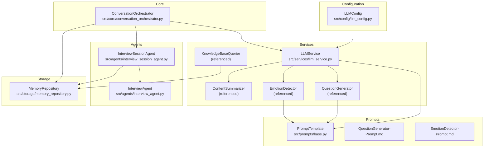
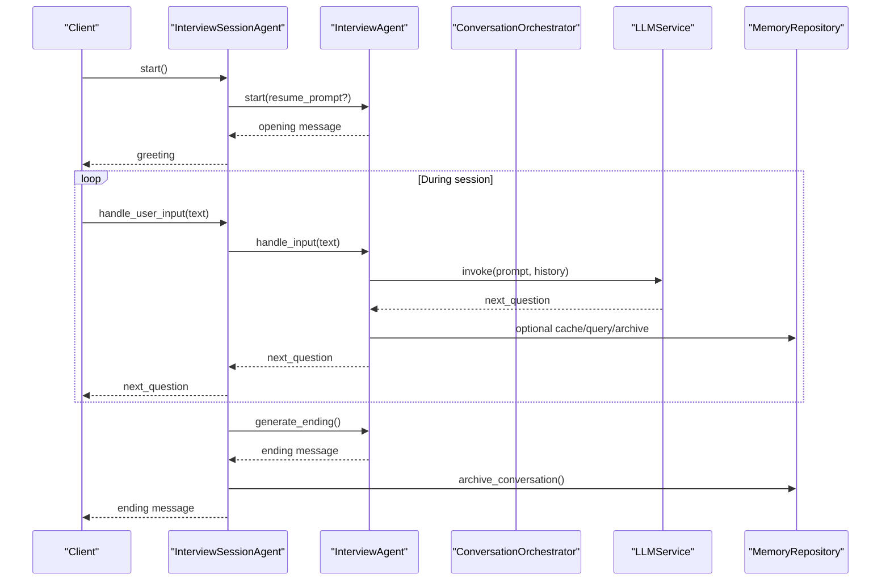
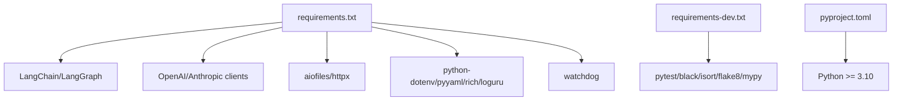

# Deployment and Operations

<cite>
**Referenced Files in This Document**
- [requirements.txt](file://requirements.txt)
- [requirements-dev.txt](file://requirements-dev.txt)
- [pyproject.toml](file://pyproject.toml)
- [src/config/llm_config.py](file://src/config/llm_config.py)
- [src/services/llm_service.py](file://src/services/llm_service.py)
- [src/storage/memory_repository.py](file://src/storage/memory_repository.py)
- [src/core/conversation_orchestrator.py](file://src/core/conversation_orchestrator.py)
- [src/agents/interview_agent.py](file://src/agents/interview_agent.py)
- [src/agents/interview_session_agent.py](file://src/agents/interview_session_agent.py)
- [src/prompts/base.py](file://src/prompts/base.py)
- [src/prompts/QuestionGenerator-Prompt.md](file://src/prompts/QuestionGenerator-Prompt.md)
- [src/prompts/EmotionDetector-Prompt.md](file://src/prompts/EmotionDetector-Prompt.md)
</cite>

## Table of Contents
1. [Introduction](#introduction)
2. [Project Structure](#project-structure)
3. [Core Components](#core-components)
4. [Architecture Overview](#architecture-overview)
5. [Detailed Component Analysis](#detailed-component-analysis)
6. [Dependency Analysis](#dependency-analysis)
7. [Performance Considerations](#performance-considerations)
8. [Monitoring and Logging](#monitoring-and-logging)
9. [Environment Setup and Configuration Management](#environment-setup-and-configuration-management)
10. [Deployment Topologies](#deployment-topologies)
11. [Infrastructure Requirements and Scalability](#infrastructure-requirements-and-scalability)
12. [Backup and Recovery Procedures](#backup-and-recovery-procedures)
13. [Security Considerations](#security-considerations)
14. [Maintenance and Operational Procedures](#maintenance-and-operational-procedures)
15. [Troubleshooting Guide](#troubleshooting-guide)
16. [Conclusion](#conclusion)

## Introduction
This document provides comprehensive deployment and operations guidance for the Elderly Memoir Agent system. It covers environment setup, dependency management, configuration, deployment topologies for development, staging, and production, monitoring and logging, performance and error tracking, infrastructure and scalability, backup and recovery, security, maintenance schedules, and troubleshooting. The goal is to enable reliable, observable, and maintainable operations across environments while preserving the system’s conversational quality and memory management capabilities.

## Project Structure
The system is organized around a modular Python package with clear separation of concerns:
- Configuration and environment variables for LLM providers
- Services for LLM invocation, emotion detection, knowledge base querying, summarization, and memory management
- Agents for interview orchestration and session lifecycle management
- Core orchestration coordinating agents and services
- Prompt templates and base prompt utilities
- Storage and caching for memory and knowledge base persistence

**Diagram sources**
- [src/config/llm_config.py:10-120](file://src/config/llm_config.py#L10-L120)
- [src/services/llm_service.py:32-125](file://src/services/llm_service.py#L32-L125)
- [src/agents/interview_session_agent.py:33-110](file://src/agents/interview_session_agent.py#L33-L110)
- [src/agents/interview_agent.py:16-80](file://src/agents/interview_agent.py#L16-L80)
- [src/core/conversation_orchestrator.py:138-197](file://src/core/conversation_orchestrator.py#L138-L197)
- [src/storage/memory_repository.py:40-88](file://src/storage/memory_repository.py#L40-L88)
- [src/prompts/base.py:6-33](file://src/prompts/base.py#L6-L33)
- [src/prompts/QuestionGenerator-Prompt.md:1-352](file://src/prompts/QuestionGenerator-Prompt.md#L1-L352)
- [src/prompts/EmotionDetector-Prompt.md:1-259](file://src/prompts/EmotionDetector-Prompt.md#L1-L259)

**Section sources**
- [requirements.txt:1-24](file://requirements.txt#L1-L24)
- [requirements-dev.txt:1-13](file://requirements-dev.txt#L1-L13)
- [pyproject.toml:1-26](file://pyproject.toml#L1-L26)

## Core Components
- LLM configuration and provider selection via environment variables
- Unified LLM service with retry/backoff, token usage tracking, and structured output support
- Memory repository with short-term, long-term, and profile memory, plus LRU cache
- Interview session and interview agents implementing time-bounded sessions with knowledge base integration
- Conversation orchestrator managing session lifecycle, timing, and state transitions
- Prompt templates and dynamic rendering for emotion detection and question generation

Key operational implications:
- Environment-driven provider selection enables multi-cloud/provider flexibility
- Structured outputs improve reliability and observability
- Time-bound sessions and warnings ensure predictable user experience
- Knowledge base queries and caching reduce latency and LLM cost

**Section sources**
- [src/config/llm_config.py:10-120](file://src/config/llm_config.py#L10-L120)
- [src/services/llm_service.py:32-125](file://src/services/llm_service.py#L32-L125)
- [src/storage/memory_repository.py:40-88](file://src/storage/memory_repository.py#L40-L88)
- [src/agents/interview_session_agent.py:33-110](file://src/agents/interview_session_agent.py#L33-L110)
- [src/agents/interview_agent.py:16-80](file://src/agents/interview_agent.py#L16-L80)
- [src/core/conversation_orchestrator.py:138-197](file://src/core/conversation_orchestrator.py#L138-L197)
- [src/prompts/base.py:6-33](file://src/prompts/base.py#L6-L33)

## Architecture Overview
The system follows a layered architecture:
- Presentation/Control Layer: InterviewSessionAgent and InterviewAgent
- Orchestration Layer: ConversationOrchestrator
- Service Layer: LLMService, EmotionDetector, KnowledgeBaseQuerier, QuestionGenerator, ContentSummarizer
- Persistence Layer: MemoryRepository backed by MarkdownFileManager and filesystem storage
- Prompt Layer: Dynamic prompt templates loaded from Markdown and Python modules

**Diagram sources**
- [src/agents/interview_session_agent.py:112-130](file://src/agents/interview_session_agent.py#L112-L130)
- [src/agents/interview_agent.py:80-114](file://src/agents/interview_agent.py#L80-L114)
- [src/agents/interview_agent.py:115-184](file://src/agents/interview_agent.py#L115-L184)
- [src/agents/interview_agent.py:244-272](file://src/agents/interview_agent.py#L244-L272)
- [src/agents/interview_session_agent.py:369-392](file://src/agents/interview_session_agent.py#L369-L392)
- [src/services/llm_service.py:225-292](file://src/services/llm_service.py#L225-L292)
- [src/storage/memory_repository.py:174-200](file://src/storage/memory_repository.py#L174-L200)

## Detailed Component Analysis

### LLM Configuration and Provider Selection
- Supports Qwen and DeepSeek providers via dedicated environment variables
- Falls back to default provider if provider-specific variables are absent
- Centralized configuration loading and defaults

Operational guidance:
- Set provider-specific variables for primary provider
- Keep LLM temperature and token limits aligned with use case
- Configure timeouts and retries per environment

**Section sources**
- [src/config/llm_config.py:42-120](file://src/config/llm_config.py#L42-L120)

### LLM Service and Prompt Templates
- Unified LLM invocation with retry/backoff and token usage metrics
- Structured output parsing with Pydantic models
- Dynamic prompt template loading from Markdown and Python modules
- Global singleton initialization for convenience

Operational guidance:
- Monitor success rate, latency, and token usage via service stats
- Validate prompt template variables before invoking structured outputs
- Use appropriate temperature and max tokens for each task

**Section sources**
- [src/services/llm_service.py:32-125](file://src/services/llm_service.py#L32-L125)
- [src/services/llm_service.py:225-292](file://src/services/llm_service.py#L225-L292)
- [src/services/llm_service.py:327-398](file://src/services/llm_service.py#L327-L398)
- [src/prompts/base.py:6-33](file://src/prompts/base.py#L6-L33)
- [src/prompts/QuestionGenerator-Prompt.md:1-352](file://src/prompts/QuestionGenerator-Prompt.md#L1-L352)
- [src/prompts/EmotionDetector-Prompt.md:1-259](file://src/prompts/EmotionDetector-Prompt.md#L1-L259)

### Memory Repository and Caching
- Short-term memory with bounded history
- Long-term memory persisted as Markdown files under knowledge base
- LRU cache for frequently accessed entities
- Indexing for people and events to accelerate retrieval

Operational guidance:
- Tune cache capacity and short-term history size for workload
- Ensure knowledge base directories exist and are writable
- Monitor disk usage and implement retention policies

**Section sources**
- [src/storage/memory_repository.py:40-88](file://src/storage/memory_repository.py#L40-L88)
- [src/storage/memory_repository.py:174-200](file://src/storage/memory_repository.py#L174-L200)
- [src/storage/memory_repository.py:228-247](file://src/storage/memory_repository.py#L228-L247)

### Interview Session and Interview Agents
- Session phases: init, profile collection, interview, ending, closed
- Time controls: total duration, profile duration, five-minute archive trigger
- Knowledge base checks and resume logic for returning users
- Archive and cache tools integrated during session

Operational guidance:
- Enforce time budgets rigorously; warn near threshold
- Ensure knowledge base paths are correct and accessible
- Use archive tool to checkpoint progress

**Section sources**
- [src/agents/interview_session_agent.py:24-52](file://src/agents/interview_session_agent.py#L24-L52)
- [src/agents/interview_session_agent.py:112-130](file://src/agents/interview_session_agent.py#L112-L130)
- [src/agents/interview_session_agent.py:178-241](file://src/agents/interview_session_agent.py#L178-L241)
- [src/agents/interview_session_agent.py:341-367](file://src/agents/interview_session_agent.py#L341-L367)
- [src/agents/interview_session_agent.py:369-392](file://src/agents/interview_session_agent.py#L369-L392)
- [src/agents/interview_agent.py:274-283](file://src/agents/interview_agent.py#L274-L283)

### Conversation Orchestrator
- Coordinates emotion detection, knowledge base querying, and question generation
- Manages session timing, state transitions, and handoff preparation
- Emits events for monitoring and observability

Operational guidance:
- Configure timeouts for emotion and query tasks
- Monitor session events and timing warnings
- Prepare handoff packages with coverage and collected data

**Section sources**
- [src/core/conversation_orchestrator.py:138-197](file://src/core/conversation_orchestrator.py#L138-L197)
- [src/core/conversation_orchestrator.py:236-344](file://src/core/conversation_orchestrator.py#L236-L344)
- [src/core/conversation_orchestrator.py:570-592](file://src/core/conversation_orchestrator.py#L570-L592)

## Dependency Analysis
External dependencies include LangChain/LangGraph for LLM orchestration, OpenAI-compatible clients, YAML and dotenv for configuration, watchdog for file monitoring, and loguru for logging. Development dependencies include pytest, black, isort, flake8, and mypy.

**Diagram sources**
- [requirements.txt:1-24](file://requirements.txt#L1-L24)
- [requirements-dev.txt:1-13](file://requirements-dev.txt#L1-L13)
- [pyproject.toml](file://pyproject.toml#L6)

**Section sources**
- [requirements.txt:1-24](file://requirements.txt#L1-L24)
- [requirements-dev.txt:1-13](file://requirements-dev.txt#L1-L13)
- [pyproject.toml](file://pyproject.toml#L6)

## Performance Considerations
- Asynchronous LLM calls with retry/backoff reduce tail latency and improve resilience
- Structured outputs with JSON parsing enable deterministic processing
- Prompt template loading from Markdown reduces cold-start costs after initial load
- Caching and indexing minimize repeated LLM calls and file reads
- Time-bound sessions prevent runaway resource consumption

Recommendations:
- Monitor LLM latency and token usage; adjust temperature and max tokens accordingly
- Use connection pooling and limit concurrent requests to provider APIs
- Implement circuit breakers for downstream services
- Cache frequently accessed prompts and templates

[No sources needed since this section provides general guidance]

## Monitoring and Logging
- LLMService logs call outcomes, errors, and token usage
- ConversationOrchestrator emits session lifecycle events
- Logging library supports structured logging; configure sinks externally

Guidelines:
- Centralize logs to a collector (e.g., syslog, cloud logging)
- Tag logs with session_id and user_id for correlation
- Alert on high error rates, timeouts, and excessive latency
- Track token consumption and cost metrics

**Section sources**
- [src/services/llm_service.py:15-16](file://src/services/llm_service.py#L15-L16)
- [src/services/llm_service.py:285-291](file://src/services/llm_service.py#L285-L291)
- [src/core/conversation_orchestrator.py:227-231](file://src/core/conversation_orchestrator.py#L227-L231)

## Environment Setup and Configuration Management
Prerequisites:
- Python version requirement: see project metadata
- Install runtime dependencies from requirements.txt
- Install developer/test dependencies from requirements-dev.txt

Configuration:
- LLM provider selection via environment variables
- Load configuration from .env files using python-dotenv
- Configure logging and prompt template paths

Operational steps:
- Create virtual environment and install dependencies
- Set environment variables for provider and credentials
- Initialize knowledge base directories if needed
- Run tests and linting as part of CI

**Section sources**
- [pyproject.toml](file://pyproject.toml#L6)
- [requirements.txt:1-24](file://requirements.txt#L1-L24)
- [requirements-dev.txt:1-13](file://requirements-dev.txt#L1-L13)
- [src/config/llm_config.py:6-7](file://src/config/llm_config.py#L6-L7)
- [src/services/llm_service.py:126-161](file://src/services/llm_service.py#L126-L161)

## Deployment Topologies
- Development: local Python environment with local knowledge base storage
- Staging: containerized service with ephemeral storage and shared knowledge base mount
- Production: containerized service with persistent storage, secrets management, and observability stack

Topology considerations:
- Stateless LLM service pods behind a load balancer
- Persistent volume for knowledge base directories
- Secrets mounted for provider API keys
- Health checks for readiness and liveness
- Horizontal scaling based on concurrent sessions and CPU utilization

[No sources needed since this section provides general guidance]

## Infrastructure Requirements and Scalability
Compute:
- CPU: moderate for LLM inference; scale with concurrency
- Memory: proportional to session concurrency and prompt sizes
- Disk: knowledge base growth; implement retention and archival

Networking:
- Outbound HTTPS to provider APIs
- Internal service mesh for inter-pod communication

Scalability:
- Auto-scaling based on queue length or CPU utilization
- Connection pooling to providers
- Caching layer for frequent queries

[No sources needed since this section provides general guidance]

## Backup and Recovery Procedures
Backup scope:
- Knowledge base directories (Markdown files)
- Conversation archives and timelines
- Prompt templates and configuration

Backup strategy:
- Periodic snapshots of knowledge base
- Incremental backups for recent conversations
- Version control for prompt templates

Recovery procedure:
- Restore snapshot to a clean knowledge base path
- Reinitialize session agents pointing to restored path
- Validate conversation continuity and memory queries

[No sources needed since this section provides general guidance]

## Security Considerations
- Secrets management: store API keys in environment variables or secret managers
- Least privilege: restrict file system permissions for knowledge base directories
- Network egress: whitelist provider endpoints
- Input sanitization: guard against malicious prompts and file paths
- Audit logs: track sensitive operations and configuration changes

[No sources needed since this section provides general guidance]

## Maintenance and Operational Procedures
- Regular dependency updates with testing
- Retention and cleanup of old conversations
- Capacity planning for storage and compute
- Patching provider SDKs and Python runtime
- Drills for backup restoration and incident response

[No sources needed since this section provides general guidance]

## Troubleshooting Guide
Common issues and resolutions:
- Provider configuration errors: verify environment variables and fallback logic
- LLM timeouts or failures: check retry/backoff and provider quotas
- Missing knowledge base: ensure directories exist and are writable
- Prompt template parsing errors: validate Markdown format and variable completeness
- Session timing anomalies: review timing thresholds and event emissions

Diagnostic steps:
- Inspect logs for error messages and stack traces
- Verify environment variables and .env loading
- Confirm prompt template registration and variable validation
- Check disk space and file permissions

**Section sources**
- [src/config/llm_config.py:42-120](file://src/config/llm_config.py#L42-L120)
- [src/services/llm_service.py:400-437](file://src/services/llm_service.py#L400-L437)
- [src/storage/memory_repository.py:122-161](file://src/storage/memory_repository.py#L122-L161)
- [src/prompts/base.py:29-33](file://src/prompts/base.py#L29-L33)

## Conclusion
This guide outlines a practical, repeatable approach to deploying and operating the Elderly Memoir Agent system. By leveraging environment-driven configuration, robust LLM service primitives, structured prompts, and disciplined storage and caching, the system achieves reliability, observability, and maintainability across development, staging, and production environments. Adopt the recommended practices for monitoring, security, backup, and scalability to sustain high-quality user experiences over time.