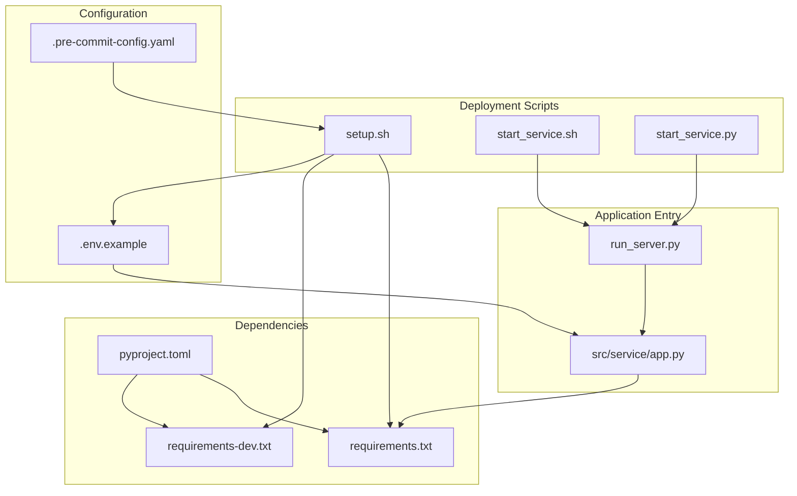
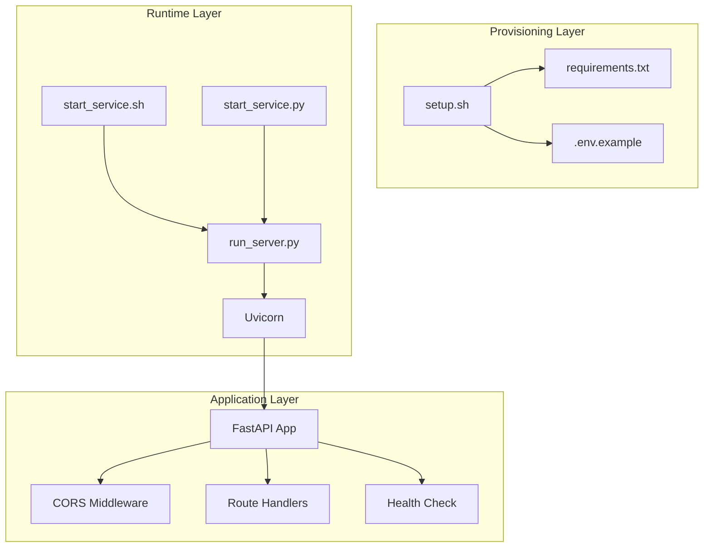
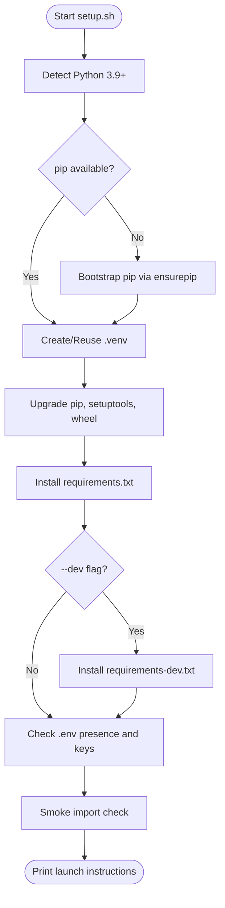
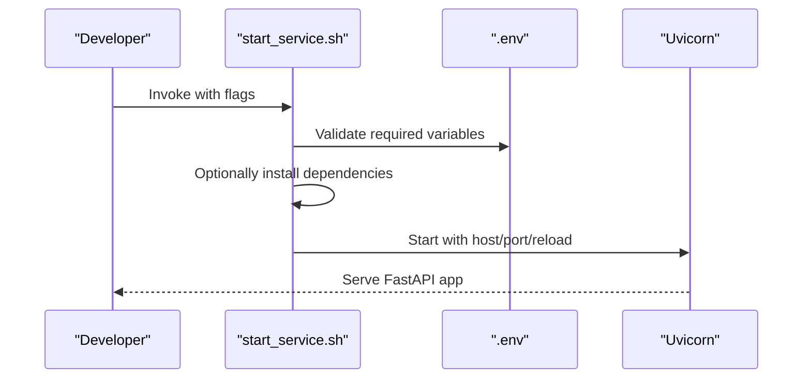
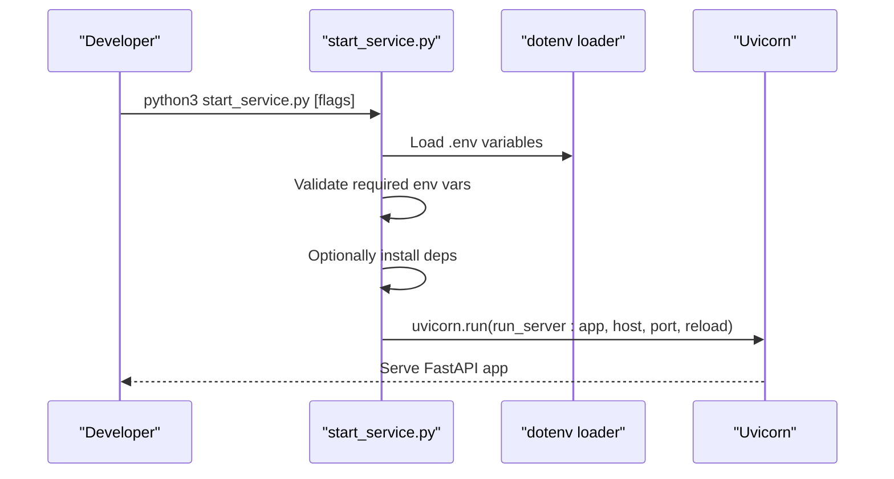
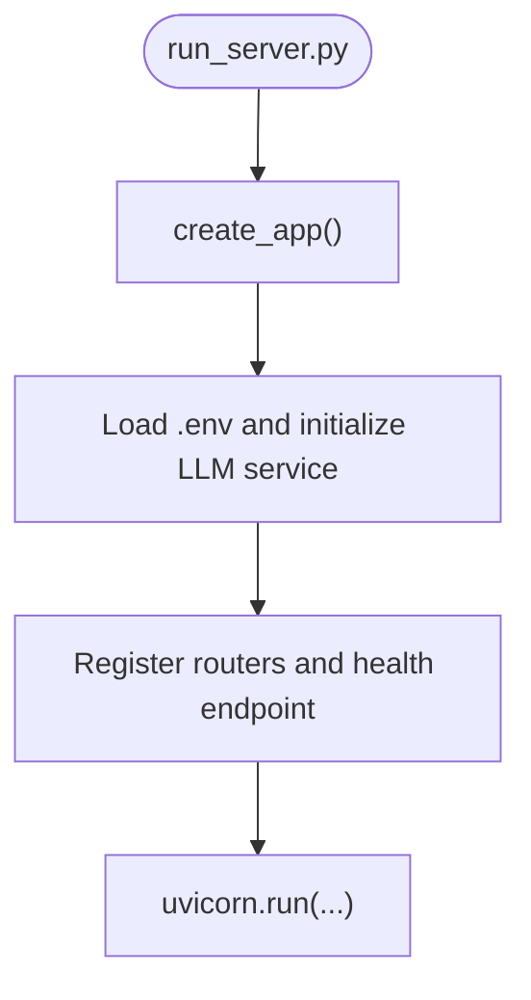
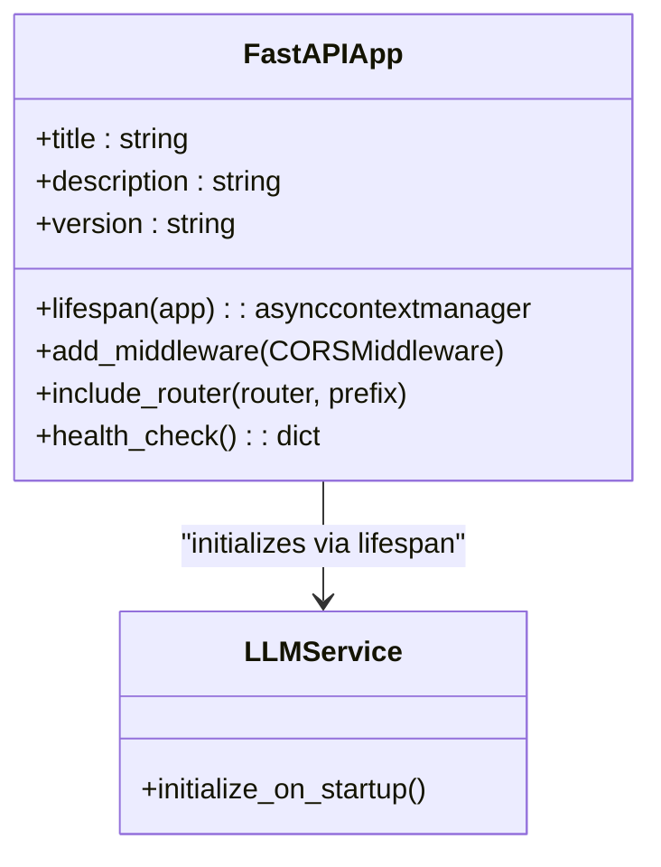
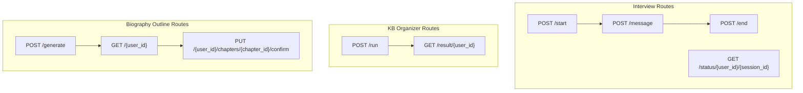
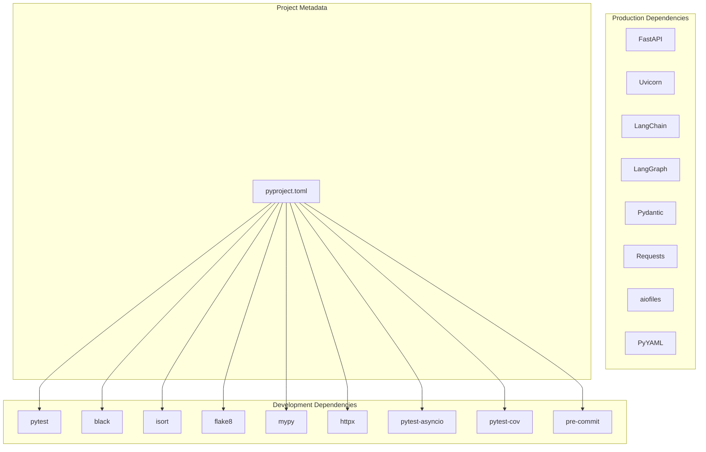

# Deployment Infrastructure

<cite>
**Referenced Files in This Document**
- [setup.sh](file://setup.sh)
- [start_service.sh](file://start_service.sh)
- [start_service.py](file://start_service.py)
- [run_server.py](file://run_server.py)
- [app.py](file://src/service/app.py)
- [requirements.txt](file://requirements.txt)
- [requirements-dev.txt](file://requirements-dev.txt)
- [pyproject.toml](file://pyproject.toml)
- [.env.example](file://.env.example)
- [.pre-commit-config.yaml](file://.pre-commit-config.yaml)
- [interview.py](file://src/service/routes/interview.py)
- [kb_organizer.py](file://src/service/routes/kb_organizer.py)
- [biography_outline.py](file://src/service/routes/biography_outline.py)
</cite>

## Table of Contents
1. [Introduction](#introduction)
2. [Project Structure](#project-structure)
3. [Core Components](#core-components)
4. [Architecture Overview](#architecture-overview)
5. [Detailed Component Analysis](#detailed-component-analysis)
6. [Dependency Analysis](#dependency-analysis)
7. [Performance Considerations](#performance-considerations)
8. [Troubleshooting Guide](#troubleshooting-guide)
9. [Conclusion](#conclusion)

## Introduction
This document describes the deployment infrastructure for the Elder Memoir Agent Service, focusing on the automated setup scripts, service launch mechanisms, and runtime configuration. It explains how the system provisions Python environments, installs dependencies, loads environment variables, and starts the FastAPI application with Uvicorn. It also covers the API surface exposed by the service and operational considerations for cloud deployment.

## Project Structure
The deployment infrastructure centers around several key files:
- Setup and environment provisioning scripts for one-click installation
- Service launch scripts for both development and production scenarios
- Application entry point and FastAPI configuration
- Dependency management via requirements files and project metadata
- Environment variable configuration and quality assurance tooling

**Diagram sources**
- [setup.sh:1-235](file://setup.sh#L1-L235)
- [start_service.sh:1-169](file://start_service.sh#L1-L169)
- [start_service.py:1-191](file://start_service.py#L1-L191)
- [run_server.py:1-23](file://run_server.py#L1-L23)
- [app.py:1-59](file://src/service/app.py#L1-L59)
- [requirements.txt:1-22](file://requirements.txt#L1-L22)
- [requirements-dev.txt:1-14](file://requirements-dev.txt#L1-L14)
- [pyproject.toml:1-26](file://pyproject.toml#L1-L26)
- [.env.example:1-10](file://.env.example#L1-L10)
- [.pre-commit-config.yaml:1-20](file://.pre-commit-config.yaml#L1-L20)

**Section sources**
- [setup.sh:1-235](file://setup.sh#L1-L235)
- [start_service.sh:1-169](file://start_service.sh#L1-L169)
- [start_service.py:1-191](file://start_service.py#L1-L191)
- [run_server.py:1-23](file://run_server.py#L1-L23)
- [app.py:1-59](file://src/service/app.py#L1-L59)
- [requirements.txt:1-22](file://requirements.txt#L1-L22)
- [requirements-dev.txt:1-14](file://requirements-dev.txt#L1-L14)
- [pyproject.toml:1-26](file://pyproject.toml#L1-L26)
- [.env.example:1-10](file://.env.example#L1-L10)
- [.pre-commit-config.yaml:1-20](file://.pre-commit-config.yaml#L1-L20)

## Core Components
- Environment setup and dependency installation:
  - Automated virtual environment creation, package installation, and environment validation
  - Support for installing development dependencies and suppressing verbose pip output
- Service launchers:
  - Bash-based launcher for interactive development with hot reload
  - Python-based launcher for cross-platform compatibility and programmatic control
- Application entry point:
  - FastAPI application factory with CORS middleware and route registration
  - Health check endpoint and centralized configuration
- Runtime configuration:
  - Environment variable loading from .env with fallback parsing
  - Required environment variables for LLM connectivity

**Section sources**
- [setup.sh:1-235](file://setup.sh#L1-L235)
- [start_service.sh:1-169](file://start_service.sh#L1-L169)
- [start_service.py:1-191](file://start_service.py#L1-L191)
- [run_server.py:1-23](file://run_server.py#L1-L23)
- [app.py:1-59](file://src/service/app.py#L1-L59)

## Architecture Overview
The deployment architecture consists of three layers:
- Provisioning layer: setup scripts detect Python, create/activate virtual environments, install dependencies, and validate environment variables
- Runtime layer: service launchers start the FastAPI application with Uvicorn, load environment variables, and expose API routes
- Application layer: FastAPI routes handle interview sessions, knowledge base organization, biography outline generation, and file operations

**Diagram sources**
- [setup.sh:1-235](file://setup.sh#L1-L235)
- [start_service.sh:1-169](file://start_service.sh#L1-L169)
- [start_service.py:1-191](file://start_service.py#L1-L191)
- [run_server.py:1-23](file://run_server.py#L1-L23)
- [app.py:1-59](file://src/service/app.py#L1-L59)

## Detailed Component Analysis

### Setup Script (setup.sh)
The setup script automates environment provisioning:
- Detects Python 3.9+ and ensures pip availability
- Creates or reuses a virtual environment and activates it
- Upgrades pip, setuptools, and wheel
- Installs production dependencies and optionally development dependencies
- Copies .env.example to .env if .env does not exist and warns about required environment variables
- Performs a smoke import check for core packages
- Prints launch instructions and available API route prefixes

**Diagram sources**
- [setup.sh:1-235](file://setup.sh#L1-L235)

**Section sources**
- [setup.sh:1-235](file://setup.sh#L1-L235)

### Service Launcher (start_service.sh)
The bash launcher supports interactive development:
- Parses arguments for host, port, reload toggle, and optional dependency installation
- Validates Python availability and optional virtual environment activation via VENV_PATH
- Ensures .env exists and contains required environment variables
- Optionally installs dependencies from requirements.txt
- Starts Uvicorn with the configured host, port, and reload behavior

**Diagram sources**
- [start_service.sh:1-169](file://start_service.sh#L1-L169)

**Section sources**
- [start_service.sh:1-169](file://start_service.sh#L1-L169)

### Service Launcher (start_service.py)
The Python launcher provides cross-platform compatibility:
- Loads environment variables from .env with python-dotenv fallback
- Validates required environment variables (DEEPSEEK_URL, DEEPSEEK_APIKEY)
- Optionally installs dependencies via pip
- Prints a startup banner listing available API routes
- Launches Uvicorn programmatically against run_server:app

**Diagram sources**
- [start_service.py:1-191](file://start_service.py#L1-L191)

**Section sources**
- [start_service.py:1-191](file://start_service.py#L1-L191)

### Application Entry Point (run_server.py)
The application entry point:
- Creates the FastAPI app using the factory pattern
- Runs Uvicorn directly when executed as the main module
- Can be invoked via uvicorn with host, port, and reload flags

**Diagram sources**
- [run_server.py:1-23](file://run_server.py#L1-L23)
- [app.py:1-59](file://src/service/app.py#L1-L59)

**Section sources**
- [run_server.py:1-23](file://run_server.py#L1-L23)
- [app.py:1-59](file://src/service/app.py#L1-L59)

### FastAPI Application Factory (app.py)
The application factory:
- Defines the lifespan to initialize the LLM service singleton on startup
- Adds CORS middleware (allow-all in development)
- Registers route modules under /api prefix
- Exposes a /health endpoint for service checks

**Diagram sources**
- [app.py:1-59](file://src/service/app.py#L1-L59)

**Section sources**
- [app.py:1-59](file://src/service/app.py#L1-L59)

### API Route Handlers
The service exposes multiple API route groups under /api:

- Interview Agent routes:
  - POST /api/interview/start: Start a new interview session with SSE streaming
  - POST /api/interview/message: Send messages in an active session with SSE streaming
  - POST /api/interview/end: End a session and return a JSON summary
  - GET /api/interview/status/{user_id}/{session_id}: Get session status

- Knowledge Base Organizer routes:
  - POST /api/kb-organizer/run: Start organization task with SSE streaming
  - GET /api/kb-organizer/result/{user_id}: Retrieve organization result (placeholder)

- Biography Outline routes:
  - POST /api/biography/outline/generate: Generate/update outline with SSE streaming
  - GET /api/biography/outline/{user_id}: Retrieve saved outline
  - PUT /api/biography/outline/{user_id}/chapters/{chapter_id}/confirm: Confirm a chapter for writing

**Diagram sources**
- [interview.py:1-116](file://src/service/routes/interview.py#L1-L116)
- [kb_organizer.py:1-77](file://src/service/routes/kb_organizer.py#L1-L77)
- [biography_outline.py:1-133](file://src/service/routes/biography_outline.py#L1-L133)

**Section sources**
- [interview.py:1-116](file://src/service/routes/interview.py#L1-L116)
- [kb_organizer.py:1-77](file://src/service/routes/kb_organizer.py#L1-L77)
- [biography_outline.py:1-133](file://src/service/routes/biography_outline.py#L1-L133)

## Dependency Analysis
The project manages dependencies through requirements files and project metadata:
- Production dependencies pinned for web framework, LLM/Agent stack, data validation, HTTP client, and storage/serialization
- Development dependencies for testing and code quality
- Project configuration defines optional dev dependencies and linting/formatting tools

**Diagram sources**
- [requirements.txt:1-22](file://requirements.txt#L1-L22)
- [requirements-dev.txt:1-14](file://requirements-dev.txt#L1-L14)
- [pyproject.toml:1-26](file://pyproject.toml#L1-L26)

**Section sources**
- [requirements.txt:1-22](file://requirements.txt#L1-L22)
- [requirements-dev.txt:1-14](file://requirements-dev.txt#L1-L14)
- [pyproject.toml:1-26](file://pyproject.toml#L1-L26)

## Performance Considerations
- Development vs. production:
  - The bash launcher enables hot reload by default, which is useful during development but not recommended for integration tests or production
  - The Python launcher defaults to reload enabled; use --no-reload for test runs
- Resource usage:
  - Uvicorn standard workers are supported; choose appropriate worker count based on CPU cores and memory constraints
- Network and latency:
  - CORS is permissive in development; restrict origins in production for security
- Logging:
  - Configure LOG_LEVEL and LOG_FILE in .env for operational visibility

[No sources needed since this section provides general guidance]

## Troubleshooting Guide
Common deployment issues and resolutions:
- Missing or invalid environment variables:
  - Ensure .env exists and contains DEEPSEEK_URL and DEEPSEEK_APIKEY
  - The setup and launcher scripts validate these variables and will report missing or placeholder values
- Python version mismatch:
  - The setup script requires Python 3.9+ and will fail if an incompatible version is detected
- Virtual environment issues:
  - The setup script creates .venv; ensure it is activated before running the service
  - The bash launcher supports VENV_PATH for external virtual environments
- Dependency installation failures:
  - Use --install flag with the bash launcher or run pip install -r requirements.txt manually
- Service startup errors:
  - Verify that Uvicorn is installed and the application entry point is correct
  - Check the health endpoint (/health) for service readiness

**Section sources**
- [setup.sh:178-212](file://setup.sh#L178-L212)
- [start_service.sh:108-132](file://start_service.sh#L108-L132)
- [start_service.py:82-115](file://start_service.py#L82-L115)

## Conclusion
The deployment infrastructure provides a streamlined, idempotent setup process and flexible service launch options for both development and production. By leveraging the setup scripts, environment configuration, and FastAPI/Uvicorn stack, teams can reliably provision the Elder Memoir Agent Service and expose its interview, knowledge base organization, and biography generation capabilities through a clean API surface.