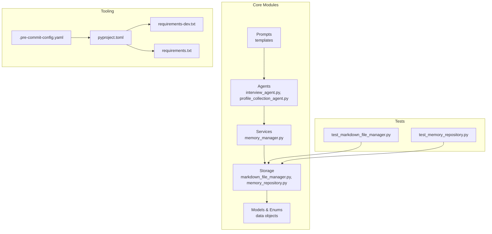
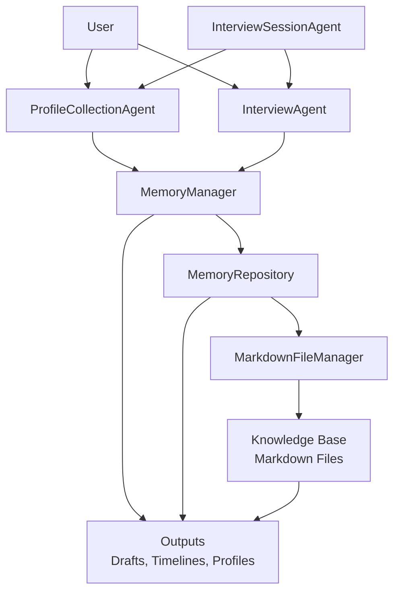
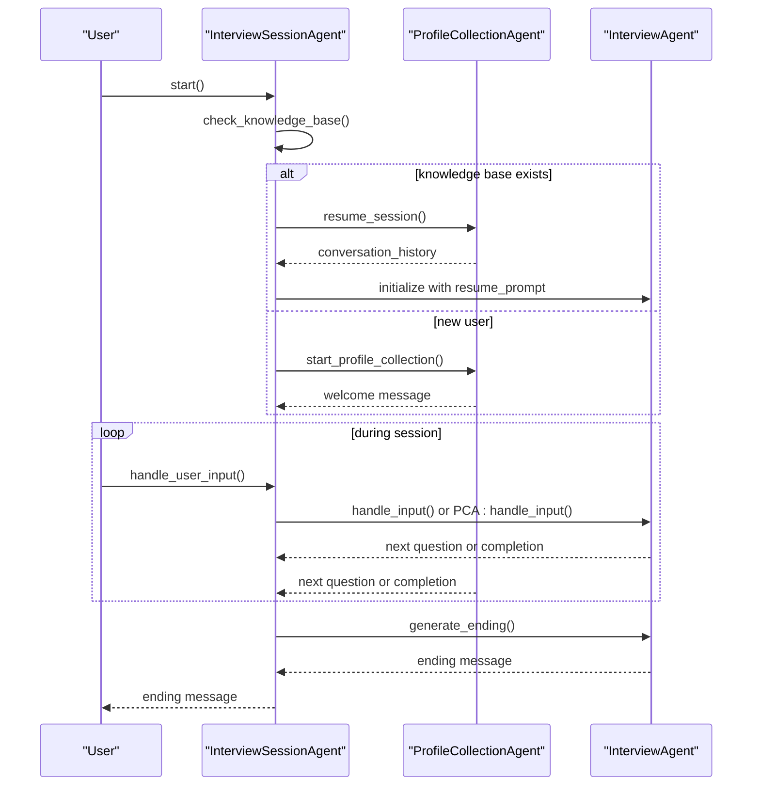
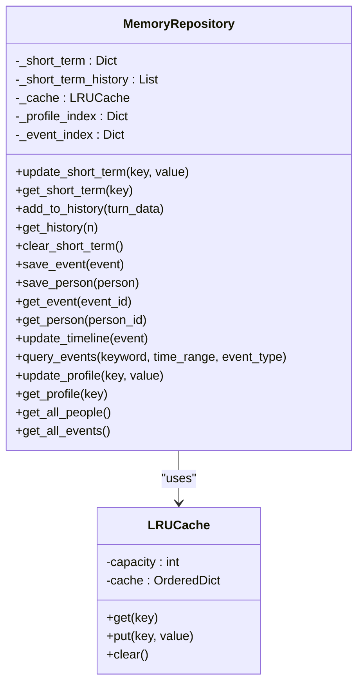
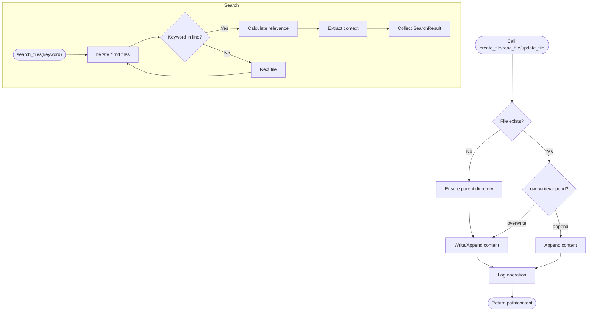
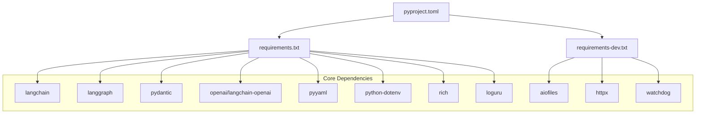

# Development Guidelines

<cite>
**Referenced Files in This Document**
- [老人自传 Agent 协作架构.md](file://老人自传 Agent 协作架构.md)
- [老人自传写作指南.md](file://老人自传写作指南.md)
- [Task-001-实现数据对象.md](file://开发故事卡/Task-001-实现数据对象.md)
- [Task-003-实现MarkdownFileManager.md](file://开发故事卡/Task-003-实现MarkdownFileManager.md)
- [Task-004-005-实现MemoryRepository和MemoryManager.md](file://开发故事卡/Task-004-005-实现MemoryRepository和MemoryManager.md)
- [Task-013-实现Agent服务主体.md](file://开发故事卡/Task-013-实现Agent服务主体.md)
- [pyproject.toml](file://pyproject.toml)
- [.pre-commit-config.yaml](file://.pre-commit-config.yaml)
- [requirements-dev.txt](file://requirements-dev.txt)
- [requirements.txt](file://requirements.txt)
- [src/storage/markdown_file_manager.py](file://src/storage/markdown_file_manager.py)
- [src/storage/memory_repository.py](file://src/storage/memory_repository.py)
- [src/services/memory_manager.py](file://src/services/memory_manager.py)
- [src/agents/interview_agent.py](file://src/agents/interview_agent.py)
- [src/agents/profile_collection_agent.py](file://src/agents/profile_collection_agent.py)
- [tests/test_markdown_file_manager.py](file://tests/test_markdown_file_manager.py)
- [tests/test_memory_repository.py](file://tests/test_memory_repository.py)
</cite>

## Table of Contents
1. [Introduction](#introduction)
2. [Project Structure](#project-structure)
3. [Core Components](#core-components)
4. [Architecture Overview](#architecture-overview)
5. [Detailed Component Analysis](#detailed-component-analysis)
6. [Dependency Analysis](#dependency-analysis)
7. [Performance Considerations](#performance-considerations)
8. [Troubleshooting Guide](#troubleshooting-guide)
9. [Conclusion](#conclusion)
10. [Appendices](#appendices)

## Introduction
This document provides comprehensive development guidelines for contributing to the elderly memoir agent system. It covers coding standards enforced by Black, isort, and mypy; the development workflow using story cards (开发故事卡); implementation tasks for the Agent service, MemoryRepository, and MarkdownFileManager; pre-commit hooks configuration; code review processes; and testing requirements. It also explains the relationship between development tasks and system architecture, best practices for maintaining code quality, and guidelines for extending the system with new features.

## Project Structure
The project follows a modular Python layout with clear separation of concerns:
- src/: Core application modules including agents, services, storage, models, enums, prompts, and tools
- tests/: Unit and integration tests for key components
- Prompts/: Prompt templates for LLM interactions
- knowledge_base/: Sample knowledge base for testing and demonstration
- 开发故事卡/: Story cards detailing feature development tasks and acceptance criteria
- Tooling: pyproject.toml, .pre-commit-config.yaml, requirements files

**Diagram sources**
- [pyproject.toml:1-26](file://pyproject.toml#L1-L26)
- [.pre-commit-config.yaml:1-20](file://.pre-commit-config.yaml#L1-L20)
- [requirements-dev.txt:1-13](file://requirements-dev.txt#L1-L13)
- [requirements.txt:1-24](file://requirements.txt#L1-L24)
- [src/agents/interview_agent.py:1-346](file://src/agents/interview_agent.py#L1-L346)
- [src/agents/profile_collection_agent.py:1-275](file://src/agents/profile_collection_agent.py#L1-L275)
- [src/services/memory_manager.py:1-470](file://src/services/memory_manager.py#L1-L470)
- [src/storage/markdown_file_manager.py:1-546](file://src/storage/markdown_file_manager.py#L1-L546)
- [src/storage/memory_repository.py:1-359](file://src/storage/memory_repository.py#L1-L359)
- [tests/test_markdown_file_manager.py:1-207](file://tests/test_markdown_file_manager.py#L1-L207)
- [tests/test_memory_repository.py:1-325](file://tests/test_memory_repository.py#L1-L325)

**Section sources**
- [pyproject.toml:1-26](file://pyproject.toml#L1-L26)
- [.pre-commit-config.yaml:1-20](file://.pre-commit-config.yaml#L1-L20)
- [requirements-dev.txt:1-13](file://requirements-dev.txt#L1-L13)
- [requirements.txt:1-24](file://requirements.txt#L1-L24)

## Core Components
This section outlines the core components and their responsibilities, aligned with the architecture and story cards.

- InterviewSessionAgent (Task-013)
  - Orchestrates the end-to-end session lifecycle: initialization, interview, and ending
  - Coordinates ProfileCollectionAgent, InterviewAgent, and tools
  - Manages timing and transitions between phases
  - References: [Task-013-实现Agent服务主体.md](file://开发故事卡/Task-013-实现Agent服务主体.md), [src/agents/interview_agent.py:1-346](file://src/agents/interview_agent.py#L1-L346), [src/agents/profile_collection_agent.py:1-275](file://src/agents/profile_collection_agent.py#L1-L275)

- InterviewAgent (Task-013)
  - Time-driven interview flow with question generation and knowledge base queries
  - Manages conversation history, cache, and time warnings
  - References: [Task-013-实现Agent服务主体.md](file://开发故事卡/Task-013-实现Agent服务主体.md), [src/agents/interview_agent.py:1-346](file://src/agents/interview_agent.py#L1-L346)

- ProfileCollectionAgent (Task-013)
  - Collects user profile information via structured prompts and gradual questioning
  - Ends when required fields are filled or time limit is reached
  - References: [Task-013-实现Agent服务主体.md](file://开发故事卡/Task-013-实现Agent服务主体.md), [src/agents/profile_collection_agent.py:1-275](file://src/agents/profile_collection_agent.py#L1-L275)

- MemoryManager (Task-004-005)
  - Provides high-level memory operations and integrates LLM for organizing content
  - Formats conversation content and calls LLM with structured templates
  - Applies organized memory to storage and updates profiles
  - References: [Task-004-005-实现MemoryRepository和MemoryManager.md](file://开发故事卡/Task-004-005-实现MemoryRepository和MemoryManager.md), [src/services/memory_manager.py:1-470](file://src/services/memory_manager.py#L1-L470)

- MemoryRepository (Task-004-005)
  - Implements three-layer memory: short-term, long-term (files), and profile memory
  - Provides caching, indexing, and timeline updates
  - References: [Task-004-005-实现MemoryRepository和MemoryManager.md](file://开发故事卡/Task-004-005-实现MemoryRepository和MemoryManager.md), [src/storage/memory_repository.py:1-359](file://src/storage/memory_repository.py#L1-L359)

- MarkdownFileManager (Task-003)
  - Async file operations for the knowledge base
  - Full-text search, wiki-link extraction and traversal, and directory management
  - References: [Task-003-实现MarkdownFileManager.md](file://开发故事卡/Task-003-实现MarkdownFileManager.md), [src/storage/markdown_file_manager.py:1-546](file://src/storage/markdown_file_manager.py#L1-L546)

- Data Objects (Task-001)
  - Pydantic models and enums for session state, conversation turns, emotion results, memory query results, event/person info, summaries, and handoff packages
  - References: [Task-001-实现数据对象.md](file://开发故事卡/Task-001-实现数据对象.md)

**Section sources**
- [Task-001-实现数据对象.md:1-955](file://开发故事卡/Task-001-实现数据对象.md#L1-L955)
- [Task-003-实现MarkdownFileManager.md:1-591](file://开发故事卡/Task-003-实现MarkdownFileManager.md#L1-L591)
- [Task-004-005-实现MemoryRepository和MemoryManager.md:1-1153](file://开发故事卡/Task-004-005-实现MemoryRepository和MemoryManager.md#L1-L1153)
- [Task-013-实现Agent服务主体.md:1-1631](file://开发故事卡/Task-013-实现Agent服务主体.md#L1-L1631)
- [src/services/memory_manager.py:1-470](file://src/services/memory_manager.py#L1-L470)
- [src/storage/memory_repository.py:1-359](file://src/storage/memory_repository.py#L1-L359)
- [src/storage/markdown_file_manager.py:1-546](file://src/storage/markdown_file_manager.py#L1-L546)
- [src/agents/interview_agent.py:1-346](file://src/agents/interview_agent.py#L1-L346)
- [src/agents/profile_collection_agent.py:1-275](file://src/agents/profile_collection_agent.py#L1-L275)

## Architecture Overview
The system is designed as a multi-agent pipeline with a memory-centric architecture. The story cards define the implementation roadmap, while the architecture document describes the end-to-end flow.

**Diagram sources**
- [老人自传 Agent 协作架构.md:1-644](file://老人自传 Agent 协作架构.md#L1-L644)
- [Task-013-实现Agent服务主体.md:1-1631](file://开发故事卡/Task-013-实现Agent服务主体.md#L1-L1631)
- [src/agents/profile_collection_agent.py:1-275](file://src/agents/profile_collection_agent.py#L1-L275)
- [src/agents/interview_agent.py:1-346](file://src/agents/interview_agent.py#L1-L346)
- [src/services/memory_manager.py:1-470](file://src/services/memory_manager.py#L1-L470)
- [src/storage/memory_repository.py:1-359](file://src/storage/memory_repository.py#L1-L359)
- [src/storage/markdown_file_manager.py:1-546](file://src/storage/markdown_file_manager.py#L1-L546)

**Section sources**
- [老人自传 Agent 协作架构.md:1-644](file://老人自传 Agent 协作架构.md#L1-L644)
- [老人自传写作指南.md:1-253](file://老人自传写作指南.md#L1-L253)

## Detailed Component Analysis

### Coding Standards and Tooling
- Formatting and linting are enforced via Black, isort, flake8, and mypy
- Pre-commit hooks automate checks on commit
- Development dependencies are declared in pyproject and requirements files

Key configurations:
- Black: line length 88, target Python 3.10
- isort: profile black, line length 88
- mypy: strict mode, ignore missing imports
- pytest: async mode auto, testpaths tests

**Section sources**
- [pyproject.toml:11-26](file://pyproject.toml#L11-L26)
- [.pre-commit-config.yaml:1-20](file://.pre-commit-config.yaml#L1-L20)
- [requirements-dev.txt:1-13](file://requirements-dev.txt#L1-L13)
- [requirements.txt:1-24](file://requirements.txt#L1-L24)

### Development Workflow Using Story Cards
The story cards define tasks, dependencies, priorities, and acceptance criteria. Typical workflow:
- Read the story card for scope and acceptance criteria
- Implement the feature incrementally with unit tests
- Run pre-commit hooks locally and pytest
- Open a pull request for code review

Examples:
- Task-001: Implement data objects (P0, no dependencies)
- Task-003: Implement MarkdownFileManager (P0, depends on Task-001)
- Task-004/005: Implement MemoryRepository and MemoryManager (P0, depends on Task-001 and Task-003)
- Task-013: Implement Agent service主体 (P0, depends on previous tasks)

**Section sources**
- [Task-001-实现数据对象.md:1-955](file://开发故事卡/Task-001-实现数据对象.md#L1-L955)
- [Task-003-实现MarkdownFileManager.md:1-591](file://开发故事卡/Task-003-实现MarkdownFileManager.md#L1-L591)
- [Task-004-005-实现MemoryRepository和MemoryManager.md:1-1153](file://开发故事卡/Task-004-005-实现MemoryRepository和MemoryManager.md#L1-L1153)
- [Task-013-实现Agent服务主体.md:1-1631](file://开发故事卡/Task-013-实现Agent服务主体.md#L1-L1631)

### Implementation Tasks

#### Agent Service Development
- InterviewSessionAgent orchestrates session phases and coordinates child agents
- InterviewAgent manages time limits, question generation, and knowledge base queries
- ProfileCollectionAgent collects user profile information with structured prompts

**Diagram sources**
- [Task-013-实现Agent服务主体.md:124-435](file://开发故事卡/Task-013-实现Agent服务主体.md#L124-L435)
- [src/agents/interview_agent.py:80-184](file://src/agents/interview_agent.py#L80-L184)
- [src/agents/profile_collection_agent.py:98-166](file://src/agents/profile_collection_agent.py#L98-L166)

**Section sources**
- [Task-013-实现Agent服务主体.md:1-1631](file://开发故事卡/Task-013-实现Agent服务主体.md#L1-L1631)
- [src/agents/interview_agent.py:1-346](file://src/agents/interview_agent.py#L1-L346)
- [src/agents/profile_collection_agent.py:1-275](file://src/agents/profile_collection_agent.py#L1-L275)

#### MemoryRepository Implementation
- Short-term memory: in-memory cache and conversation history
- Long-term memory: file-based storage via MarkdownFileManager
- Profile memory: in-memory indexing for people and events
- LRU cache and indexing support efficient retrieval

**Diagram sources**
- [src/storage/memory_repository.py:40-359](file://src/storage/memory_repository.py#L40-L359)

**Section sources**
- [Task-004-005-实现MemoryRepository和MemoryManager.md:1-1153](file://开发故事卡/Task-004-005-实现MemoryRepository和MemoryManager.md#L1-L1153)
- [src/storage/memory_repository.py:1-359](file://src/storage/memory_repository.py#L1-L359)

#### MarkdownFileManager Functionality
- Async file operations: create, read, update, append sections
- Full-text search with relevance scoring
- Wiki-link extraction and traversal with depth control
- Directory structure enforcement and index creation

**Diagram sources**
- [src/storage/markdown_file_manager.py:134-282](file://src/storage/markdown_file_manager.py#L134-L282)
- [src/storage/markdown_file_manager.py:285-354](file://src/storage/markdown_file_manager.py#L285-L354)

**Section sources**
- [Task-003-实现MarkdownFileManager.md:1-591](file://开发故事卡/Task-003-实现MarkdownFileManager.md#L1-L591)
- [src/storage/markdown_file_manager.py:1-546](file://src/storage/markdown_file_manager.py#L1-L546)

### Testing Requirements
- Unit tests for key components:
  - MarkdownFileManager: file operations, search, link extraction, traversal, listing, existence checks, and stats
  - MemoryRepository: LRU cache, saving events/people, timeline updates, querying, short-term memory, and latest conversation records
- Tests use pytest with asyncio marking and temporary directories for isolation

Recommended practices:
- Run tests with pytest and pytest-asyncio
- Ensure coverage for async IO operations
- Validate error handling (e.g., FileNotFoundError)

**Section sources**
- [tests/test_markdown_file_manager.py:1-207](file://tests/test_markdown_file_manager.py#L1-L207)
- [tests/test_memory_repository.py:1-325](file://tests/test_memory_repository.py#L1-L325)

### Code Review Processes
- Pre-commit hooks enforce formatting and linting automatically
- Pull requests should include passing tests and documentation updates
- Reviewers should verify adherence to story card acceptance criteria and architecture alignment

**Section sources**
- [.pre-commit-config.yaml:1-20](file://.pre-commit-config.yaml#L1-L20)
- [pyproject.toml:24-26](file://pyproject.toml#L24-L26)

## Dependency Analysis
External dependencies and internal module relationships:

**Diagram sources**
- [pyproject.toml:1-26](file://pyproject.toml#L1-L26)
- [requirements.txt:1-24](file://requirements.txt#L1-L24)
- [requirements-dev.txt:1-13](file://requirements-dev.txt#L1-L13)

**Section sources**
- [pyproject.toml:1-26](file://pyproject.toml#L1-L26)
- [requirements.txt:1-24](file://requirements.txt#L1-L24)
- [requirements-dev.txt:1-13](file://requirements-dev.txt#L1-L13)

## Performance Considerations
- Asynchronous I/O: Use aiofiles for file operations to avoid blocking
- Caching: MemoryRepository employs LRU cache and in-memory indices for fast retrieval
- Parallelism: MemoryManager uses asyncio.gather for concurrent saves
- Time control: InterviewAgent enforces time limits and warns near thresholds
- Indexing: MarkdownFileManager ensures directory structure and maintains an index file

[No sources needed since this section provides general guidance]

## Troubleshooting Guide
Common issues and resolutions:
- File not found errors when reading files: Verify relative paths and base_path configuration
- Overwrite vs append behavior: Use overwrite flag intentionally; otherwise append mode is used
- Search relevance scoring: Adjust keyword matching and title weighting logic if needed
- LRU eviction: Monitor cache capacity and tune for workload
- Timeouts: InterviewAgent triggers completion when elapsed ratio reaches threshold

**Section sources**
- [src/storage/markdown_file_manager.py:188-199](file://src/storage/markdown_file_manager.py#L188-L199)
- [src/storage/memory_repository.py:169-173](file://src/storage/memory_repository.py#L169-L173)
- [src/agents/interview_agent.py:170-184](file://src/agents/interview_agent.py#L170-L184)

## Conclusion
These guidelines establish a consistent development process for the elderly memoir agent system. By following the story cards, adhering to coding standards, implementing robust tests, and leveraging the architecture, contributors can reliably extend the system with new features while maintaining high code quality and performance.

[No sources needed since this section summarizes without analyzing specific files]

## Appendices

### Best Practices for Extending the System
- Keep responsibilities single and cohesive per module
- Use Pydantic models for data validation and serialization
- Prefer async I/O for file and network operations
- Add unit tests for new functionality
- Align new features with the multi-agent architecture and memory layers
- Document changes in story cards and tests

[No sources needed since this section provides general guidance]