# Architectural Documentation

<cite>
**Referenced Files in This Document**
- [README.md](file://README.md)
- [run_server.py](file://run_server.py)
- [src/service/app.py](file://src/service/app.py)
- [src/core/conversation_orchestrator.py](file://src/core/conversation_orchestrator.py)
- [src/core/event_bus.py](file://src/core/event_bus.py)
- [src/agents/interview_agent.py](file://src/agents/interview_agent.py)
- [src/agents/profile_collection_agent.py](file://src/agents/profile_collection_agent.py)
- [src/services/llm_service.py](file://src/services/llm_service.py)
- [src/storage/memory_repository.py](file://src/storage/memory_repository.py)
- [src/models/session_state.py](file://src/models/session_state.py)
- [src/service/routes/interview.py](file://src/service/routes/interview.py)
- [src/config/llm_config.py](file://src/config/llm_config.py)
- [src/prompts/base.py](file://src/prompts/base.py)
</cite>

## Table of Contents
1. [Introduction](#introduction)
2. [System Architecture Overview](#system-architecture-overview)
3. [Core Components](#core-components)
4. [Component Interactions](#component-interactions)
5. [Data Flow Architecture](#data-flow-architecture)
6. [Service Layer Design](#service-layer-design)
7. [Storage and Memory Management](#storage-and-memory-management)
8. [API and Routing](#api-and-routing)
9. [Configuration Management](#configuration-management)
10. [Error Handling and Monitoring](#error-handling-and-monitoring)
11. [Performance Considerations](#performance-considerations)
12. [Deployment Architecture](#deployment-architecture)

## Introduction

The Elder Memoir Agent System is an intelligent conversational platform designed to help elderly individuals record and preserve their life stories through guided interviews. Built with modern Python architecture patterns, the system leverages large language models to create a natural, therapeutic interviewing experience that captures personal memories, family histories, and life experiences in an organized, retrievable format.

The system follows a multi-agent architecture with four primary layers: Interview Guidance, Structuring, Memory Management, and Writing Generation. Each layer serves a specific purpose in the transcription and organization of personal narratives while maintaining privacy, emotional sensitivity, and historical accuracy.

## System Architecture Overview

The system employs a layered architecture with clear separation of concerns:

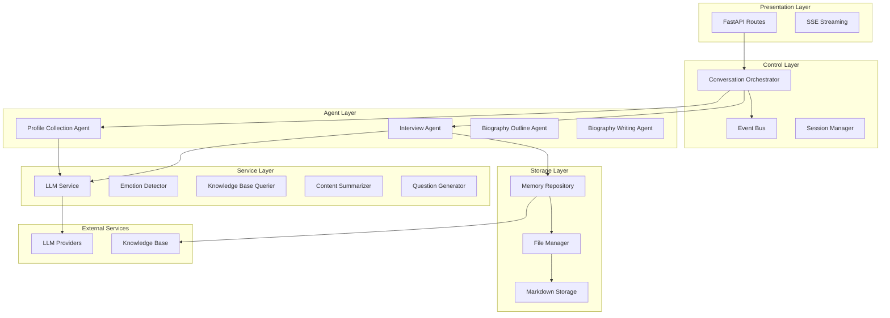

**Diagram sources**
- [src/service/app.py:22-58](file://src/service/app.py#L22-L58)
- [src/core/conversation_orchestrator.py:138-197](file://src/core/conversation_orchestrator.py#L138-L197)
- [src/agents/interview_agent.py:16-79](file://src/agents/interview_agent.py#L16-L79)

## Core Components

### Conversation Orchestrator

The Conversation Orchestrator serves as the central coordinator for the entire interview process, managing multiple concurrent agents and maintaining session state throughout the interaction lifecycle.

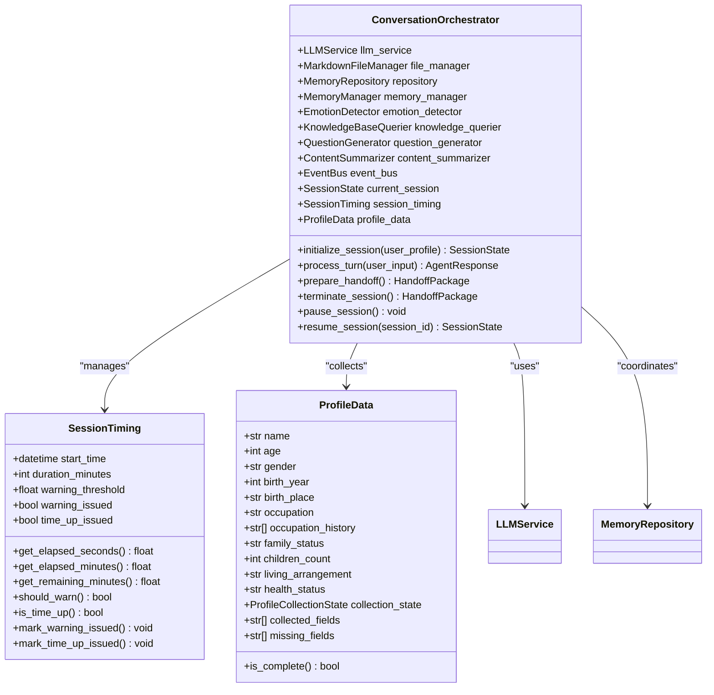

**Diagram sources**
- [src/core/conversation_orchestrator.py:138-197](file://src/core/conversation_orchestrator.py#L138-L197)
- [src/core/conversation_orchestrator.py:54-94](file://src/core/conversation_orchestrator.py#L54-L94)
- [src/core/conversation_orchestrator.py:96-127](file://src/core/conversation_orchestrator.py#L96-L127)

**Section sources**
- [src/core/conversation_orchestrator.py:138-658](file://src/core/conversation_orchestrator.py#L138-L658)

### Event Bus System

The Event Bus implements a publish-subscribe pattern for decoupled communication between system components, enabling asynchronous processing and real-time event handling.

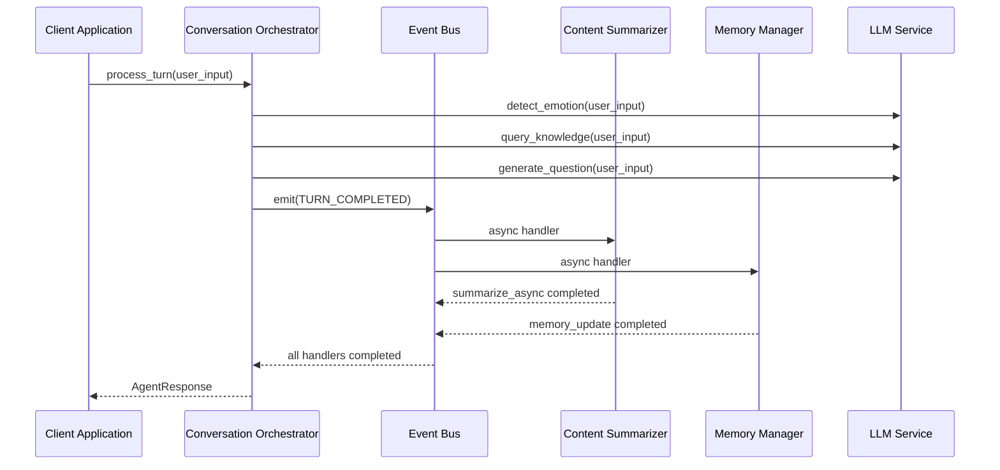

**Diagram sources**
- [src/core/event_bus.py:108-141](file://src/core/event_bus.py#L108-L141)
- [src/core/conversation_orchestrator.py:332-343](file://src/core/conversation_orchestrator.py#L332-L343)

**Section sources**
- [src/core/event_bus.py:40-182](file://src/core/event_bus.py#L40-L182)

### Interview Agent

The Interview Agent manages the primary conversational flow, implementing time-based conversation control and dynamic question generation based on user responses and contextual awareness.

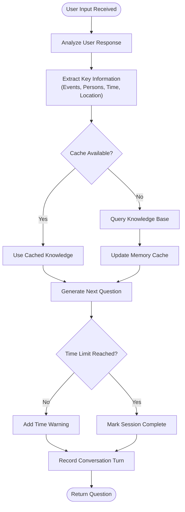

**Diagram sources**
- [src/agents/interview_agent.py:115-184](file://src/agents/interview_agent.py#L115-L184)

**Section sources**
- [src/agents/interview_agent.py:16-346](file://src/agents/interview_agent.py#L16-L346)

### Profile Collection Agent

The Profile Collection Agent handles initial user information gathering through a structured, progressive questioning approach designed to collect essential biographical data efficiently.

**Section sources**
- [src/agents/profile_collection_agent.py:14-275](file://src/agents/profile_collection_agent.py#L14-L275)

## Component Interactions

### Service Layer Architecture

The service layer provides specialized capabilities through focused service objects that encapsulate domain-specific functionality:

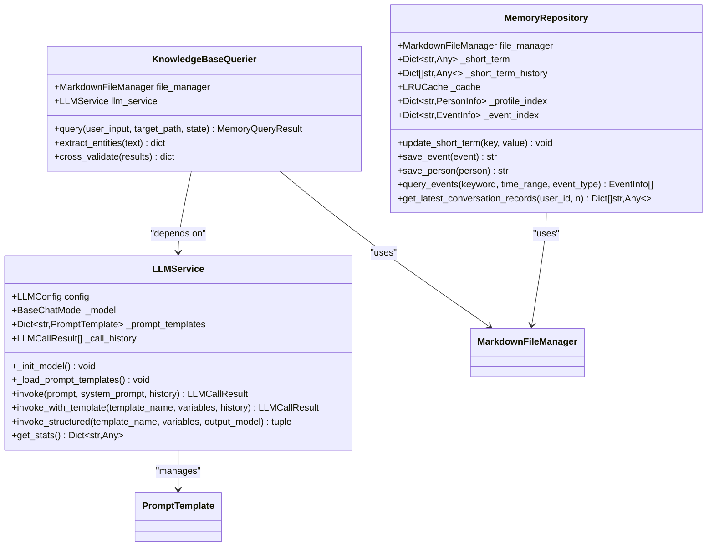

**Diagram sources**
- [src/services/llm_service.py:32-89](file://src/services/llm_service.py#L32-L89)
- [src/storage/memory_repository.py:40-88](file://src/storage/memory_repository.py#L40-L88)

**Section sources**
- [src/services/llm_service.py:32-481](file://src/services/llm_service.py#L32-L481)
- [src/storage/memory_repository.py:40-359](file://src/storage/memory_repository.py#L40-L359)

### State Management

The system maintains comprehensive session state through a structured state management approach:

**Section sources**
- [src/models/session_state.py:24-139](file://src/models/session_state.py#L24-L139)

## Data Flow Architecture

### Memory Management Flow

The memory management system implements a multi-tiered storage architecture with caching, indexing, and persistence layers:

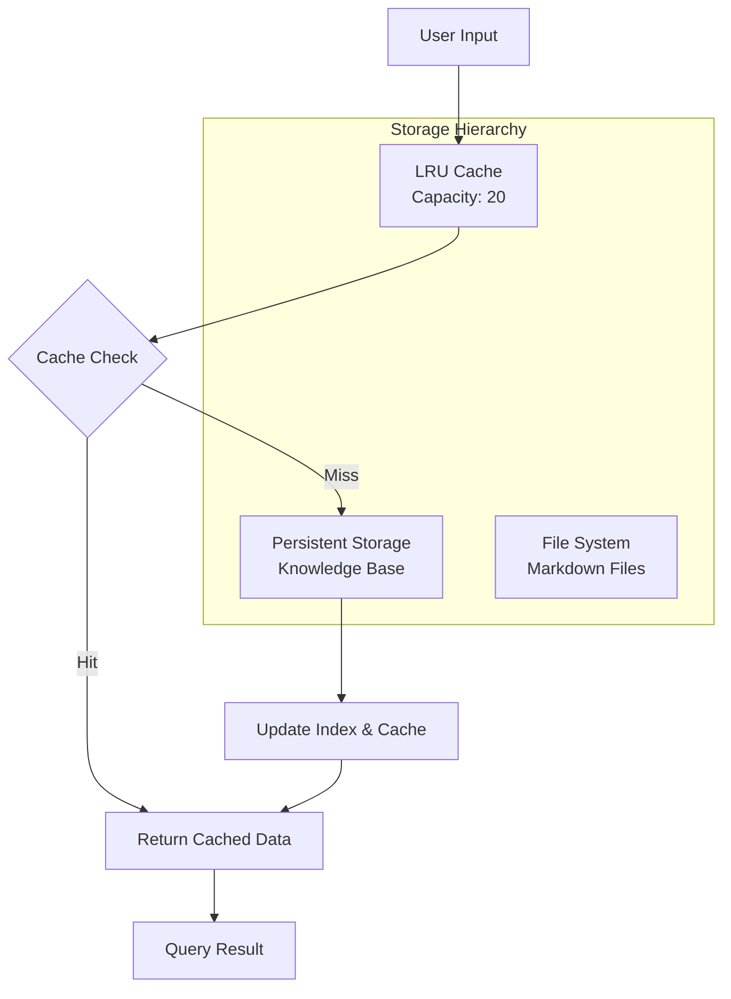

**Diagram sources**
- [src/storage/memory_repository.py:16-38](file://src/storage/memory_repository.py#L16-L38)
- [src/storage/memory_repository.py:70-87](file://src/storage/memory_repository.py#L70-L87)

**Section sources**
- [src/storage/memory_repository.py:16-359](file://src/storage/memory_repository.py#L16-L359)

### Conversation Processing Pipeline

The conversation processing pipeline coordinates multiple concurrent operations with timeout protection and graceful degradation:

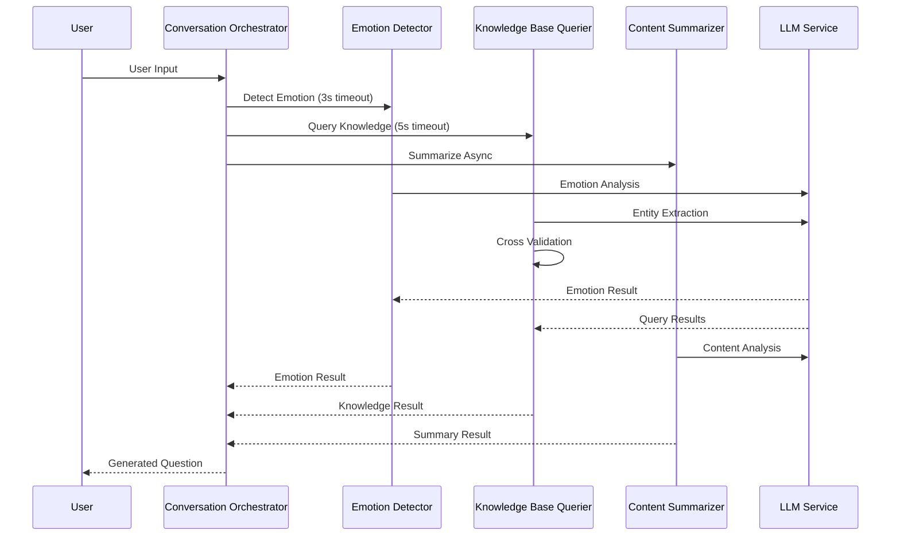

**Diagram sources**
- [src/core/conversation_orchestrator.py:269-343](file://src/core/conversation_orchestrator.py#L269-L343)

## Service Layer Design

### LLM Service Architecture

The LLM Service provides a unified interface for interacting with multiple Large Language Model providers while maintaining consistent error handling and response formatting.

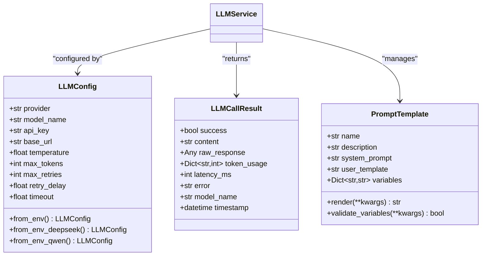

**Diagram sources**
- [src/config/llm_config.py:10-120](file://src/config/llm_config.py#L10-L120)
- [src/services/llm_service.py:20-30](file://src/services/llm_service.py#L20-L30)
- [src/prompts/base.py:6-33](file://src/prompts/base.py#L6-L33)

**Section sources**
- [src/config/llm_config.py:10-120](file://src/config/llm_config.py#L10-L120)
- [src/services/llm_service.py:32-481](file://src/services/llm_service.py#L32-L481)
- [src/prompts/base.py:6-33](file://src/prompts/base.py#L6-L33)

## Storage and Memory Management

### Knowledge Base Structure

The knowledge base implements a hierarchical file system structure optimized for human-readable documentation and semantic organization:

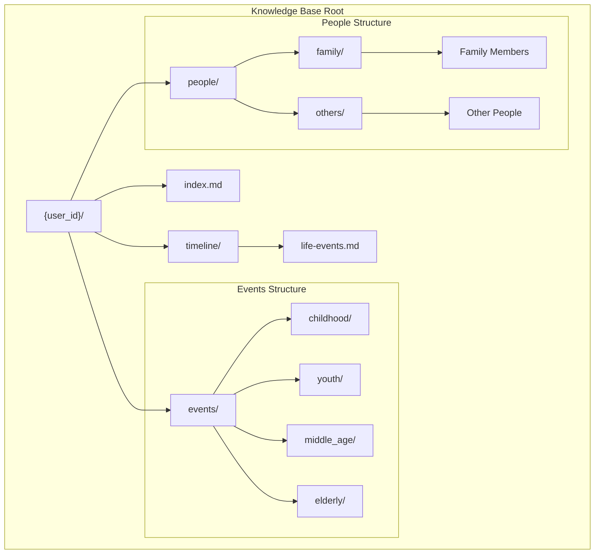

**Diagram sources**
- [README.md:339-358](file://README.md#L339-L358)

**Section sources**
- [README.md:334-358](file://README.md#L334-L358)

## API and Routing

### REST API Architecture

The system exposes a comprehensive REST API with Server-Sent Events (SSE) support for real-time conversation streaming:

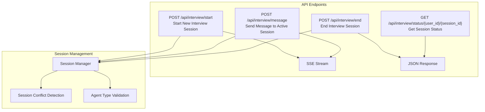

**Diagram sources**
- [src/service/routes/interview.py:15-116](file://src/service/routes/interview.py#L15-L116)

**Section sources**
- [src/service/routes/interview.py:15-116](file://src/service/routes/interview.py#L15-L116)

## Configuration Management

### Environment-Based Configuration

The system supports flexible configuration through environment variables with provider-specific optimizations:

**Section sources**
- [src/config/llm_config.py:42-120](file://src/config/llm_config.py#L42-L120)

## Error Handling and Monitoring

### Comprehensive Error Management

The system implements robust error handling across all layers with graceful degradation and monitoring capabilities:

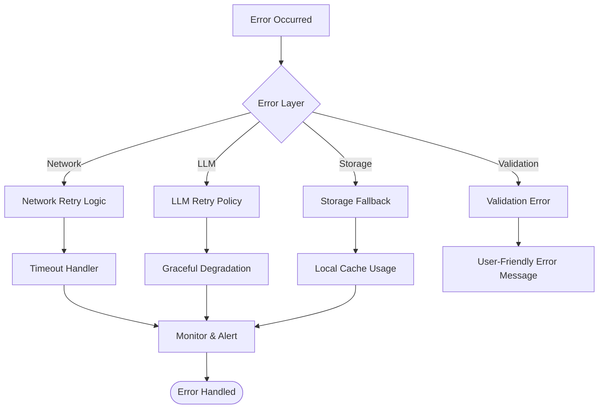

**Section sources**
- [src/services/llm_service.py:400-437](file://src/services/llm_service.py#L400-L437)

## Performance Considerations

### Asynchronous Processing Architecture

The system leverages asynchronous programming patterns to maximize throughput and responsiveness:

- **Concurrent Operations**: Parallel execution of emotion detection, knowledge queries, and content summarization
- **Timeout Protection**: Configurable timeouts prevent resource exhaustion during long-running operations
- **Caching Strategy**: Multi-level caching reduces repeated computations and database queries
- **Streaming Responses**: SSE enables real-time user feedback during processing

### Resource Management

- **Memory Limits**: Configurable capacity limits for short-term memory and cache
- **Connection Pooling**: Efficient LLM provider connection management
- **Garbage Collection**: Automatic cleanup of temporary resources

## Deployment Architecture

### Production Deployment

The system is designed for containerized deployment with the following components:

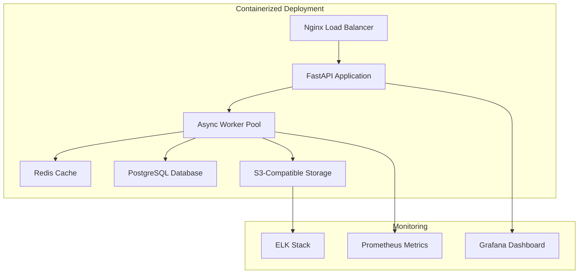

**Section sources**
- [run_server.py:1-23](file://run_server.py#L1-L23)
- [src/service/app.py:22-58](file://src/service/app.py#L22-L58)

## Conclusion

The Elder Memoir Agent System represents a sophisticated architectural solution for preserving personal narratives through intelligent conversation. The system's layered design, event-driven architecture, and comprehensive service abstraction enable scalable, maintainable, and emotionally sensitive applications for elderly memory preservation.

Key architectural strengths include:

- **Modular Design**: Clear separation of concerns enables independent development and testing
- **Event-Driven Communication**: Decoupled components through publish-subscribe patterns
- **Multi-Tiered Caching**: Optimized performance through strategic caching layers
- **Asynchronous Processing**: Non-blocking operations for improved user experience
- **Provider Flexibility**: Support for multiple LLM providers with consistent interfaces
- **Real-Time Streaming**: SSE-based communication for responsive user interactions

The system provides a solid foundation for extending functionality, adding new interview agents, integrating additional knowledge sources, and scaling to support larger user bases while maintaining the therapeutic quality essential for elderly memory preservation applications.