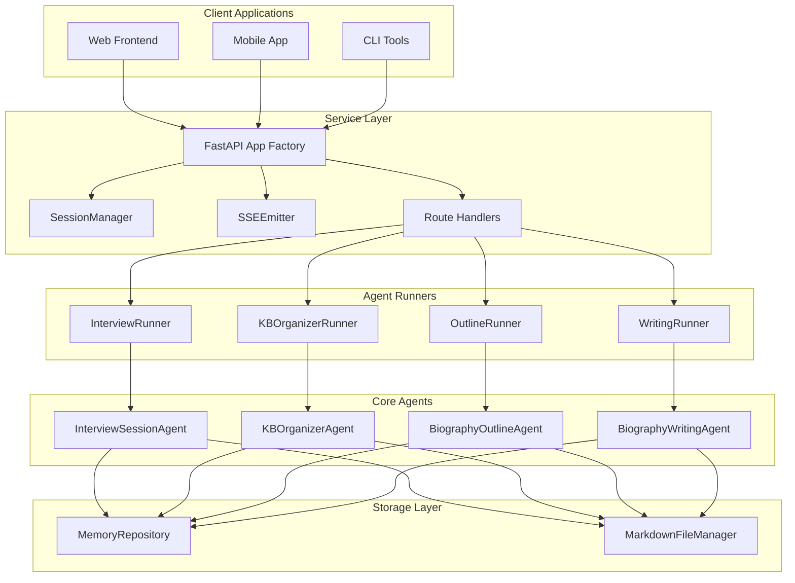
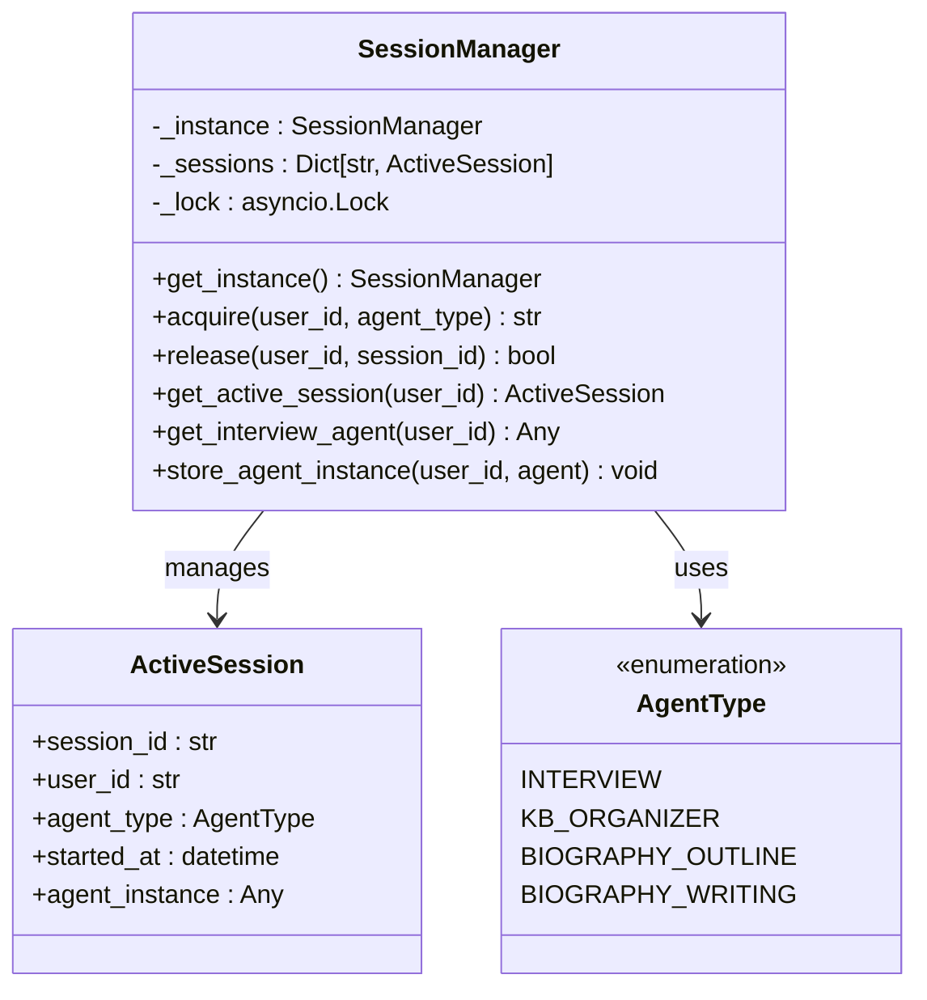
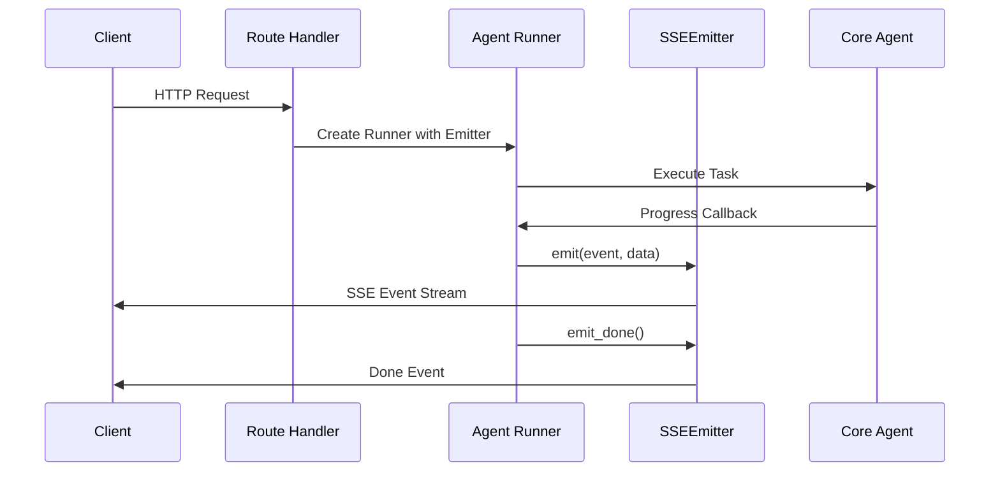
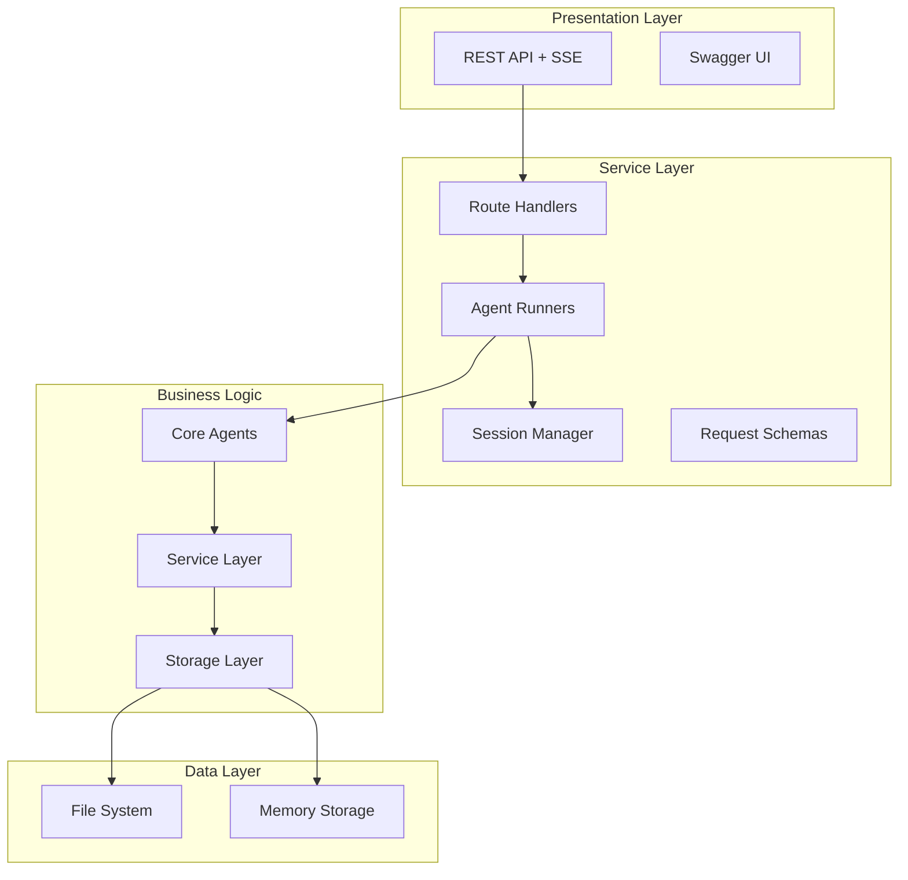
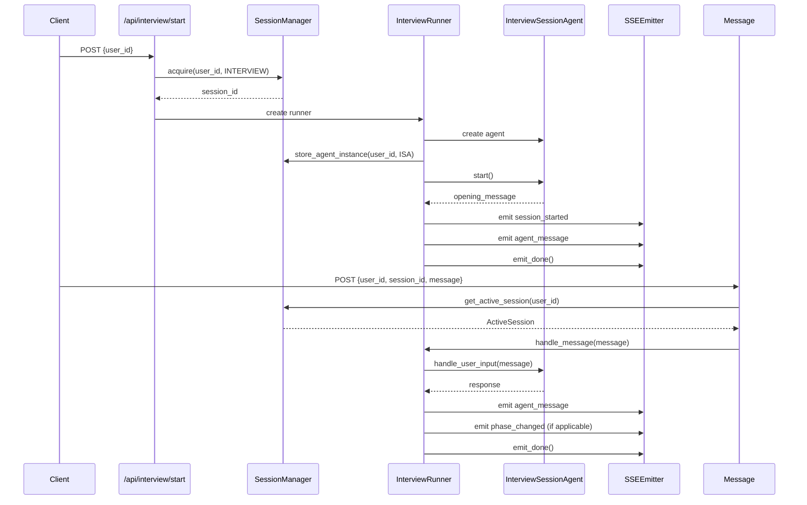
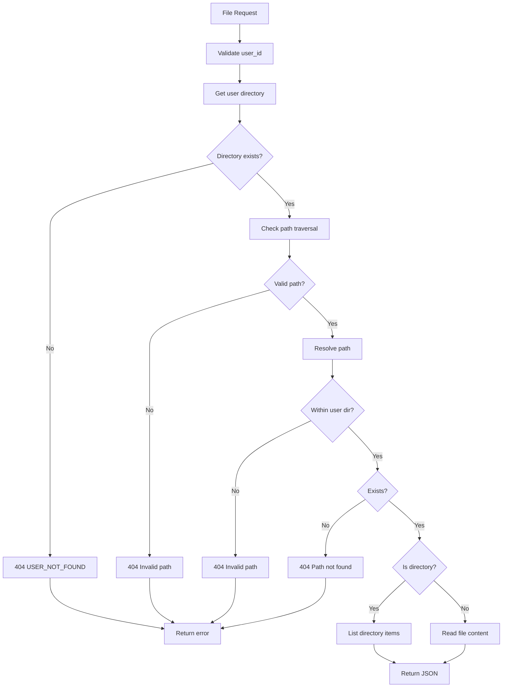

# Development Guidelines

<cite>
**Referenced Files in This Document**
- [老人自传 Agent 协作架构.md](file://老人自传 Agent 协作架构.md)
- [API接口文档.md](file://API接口文档.md)
- [开发故事卡/Task-014-Agent服务化.md](file://开发故事卡/Task-014-Agent服务化.md)
- [开发故事卡/Refactor-底层代码优化重构Spec.md](file://开发故事卡/Refactor-底层代码优化重构Spec.md)
- [src/service/app.py](file://src/service/app.py)
- [src/service/routes/interview.py](file://src/service/routes/interview.py)
- [src/service/routes/files.py](file://src/service/routes/files.py)
- [src/service/session_manager.py](file://src/service/session_manager.py)
- [src/service/sse_response.py](file://src/service/sse_response.py)
- [src/service/agent_runners/base_runner.py](file://src/service/agent_runners/base_runner.py)
- [src/service/agent_runners/interview_runner.py](file://src/service/agent_runners/interview_runner.py)
- [src/service/schemas/requests.py](file://src/service/schemas/requests.py)
- [Task-001-实现数据对象.md](file://开发故事卡/Task-001-实现数据对象.md)
- [Task-003-实现MarkdownFileManager.md](file://开发故事卡/Task-003-实现MarkdownFileManager.md)
- [Task-004-005-实现MemoryRepository和MemoryManager.md](file://开发故事卡/Task-004-005-实现MemoryRepository和MemoryManager.md)
- [Task-013-实现Agent服务主体.md](file://开发故事卡/Task-013-实现Agent服务主体.md)
- [pyproject.toml](file://pyproject.toml)
- [.pre-commit-config.yaml](file://.pre-commit-config.yaml)
- [requirements-dev.txt](file://requirements-dev.txt)
- [requirements.txt](file://requirements.txt)
- [src/storage/markdown_file_manager.py](file://src/storage/markdown_file_manager.py)
- [src/storage/memory_repository.py](file://src/storage/memory_repository.py)
- [src/services/memory_manager.py](file://src/services/memory_manager.py)
- [src/agents/interview_agent.py](file://src/agents/interview_agent.py)
- [src/agents/profile_collection_agent.py](file://src/agents/profile_collection_agent.py)
- [tests/test_markdown_file_manager.py](file://tests/test_markdown_file_manager.py)
- [tests/test_memory_repository.py](file://tests/test_memory_repository.py)
</cite>

## Update Summary
**Changes Made**
- Added comprehensive service-oriented architecture documentation
- Integrated API interface documentation as the primary specification
- Documented the new FastAPI service layer with SSE streaming
- Added SessionManager concurrency control and mutual exclusion
- Documented AgentRunner pattern for wrapping existing agents
- Added comprehensive development workflow using story cards
- Updated architecture diagrams to reflect service-oriented design
- Enhanced testing requirements for service layer components

## Table of Contents
1. [Introduction](#introduction)
2. [Service-Oriented Architecture](#service-oriented-architecture)
3. [API Interface Specification](#api-interface-specification)
4. [Service Layer Components](#service-layer-components)
5. [Development Workflow](#development-workflow)
6. [Coding Standards and Tooling](#coding-stards-and-tooling)
7. [Testing Requirements](#testing-requirements)
8. [Architecture Overview](#architecture-overview)
9. [Component Implementation Details](#component-implementation-details)
10. [Development Story Cards](#development-story-cards)
11. [Best Practices](#best-practices)
12. [Troubleshooting Guide](#troubleshooting-guide)
13. [Conclusion](#conclusion)

## Introduction
This document provides comprehensive development guidelines for contributing to the elderly memoir agent system with its new service-oriented architecture. The system has evolved from direct agent invocation to a fully encapsulated FastAPI service layer that exposes standardized HTTP/SSE interfaces. This documentation covers the new service architecture, API specifications, development workflows using story cards, coding standards, testing requirements, and best practices for maintaining the service-oriented design.

## Service-Oriented Architecture
The system now operates as a service-oriented architecture with clear separation between the agent implementations and the HTTP/SSE interface layer. The service layer provides unified access to four AI agents plus file operations through standardized endpoints.

**Diagram sources**
- [src/service/app.py:22-58](file://src/service/app.py#L22-L58)
- [src/service/session_manager.py:45-157](file://src/service/session_manager.py#L45-L157)
- [src/service/sse_response.py:23-69](file://src/service/sse_response.py#L23-L69)
- [src/service/agent_runners/interview_runner.py:8-94](file://src/service/agent_runners/interview_runner.py#L8-L94)

**Section sources**
- [API接口文档.md:1-1147](file://API接口文档.md#L1-L1147)
- [开发故事卡/Task-014-Agent服务化.md:1-693](file://开发故事卡/Task-014-Agent服务化.md#L1-L693)

## API Interface Specification
The service exposes 15 standardized endpoints organized into 5 functional groups, each with consistent SSE streaming patterns and error handling.

### Interview Agent Endpoints
- **POST /api/interview/start** - Start new interview session with SSE streaming
- **POST /api/interview/message** - Send messages during active session
- **POST /api/interview/end** - End session and return summary
- **GET /api/interview/status/{user_id}/{session_id}** - Query session status

### Knowledge Base Organizer Endpoints
- **POST /api/kb-organizer/run** - Execute organization task with progress events
- **GET /api/kb-organizer/result/{user_id}** - Retrieve last organization result

### Biography Outline Endpoints
- **POST /api/biography/outline/generate** - Generate/update outline with progress events
- **GET /api/biography/outline/{user_id}** - Get current outline
- **PUT /api/biography/outline/{user_id}/chapters/{chapter_id}/confirm** - Confirm chapter for writing

### Biography Writing Endpoints
- **POST /api/biography/writing/run** - Execute writing task with chapter progress
- **GET /api/biography/writing/{user_id}/chapters** - List completed chapters
- **GET /api/biography/writing/{user_id}/full** - Get complete biography

### File Service Endpoints
- **GET /api/files/{user_id}** - List user knowledge base root
- **GET /api/files/{user_id}/tree** - Get complete directory tree
- **GET /api/files/{user_id}/{path:path}** - Get file or directory content

**Section sources**
- [API接口文档.md:109-770](file://API接口文档.md#L109-L770)

## Service Layer Components
The service layer consists of several key components that work together to provide the HTTP/SSE interface while maintaining loose coupling with the underlying agent implementations.

### SessionManager
The global singleton that enforces mutual exclusion across users and manages active agent sessions. It prevents concurrent execution of different agent types for the same user and handles interview session persistence.

**Diagram sources**
- [src/service/session_manager.py:45-157](file://src/service/session_manager.py#L45-L157)

### SSEEmitter
Unified SSE event emitter that standardizes event formatting, timestamp injection, and keepalive mechanisms across all agent runners.

**Diagram sources**
- [src/service/sse_response.py:23-69](file://src/service/sse_response.py#L23-L69)
- [src/service/agent_runners/interview_runner.py:16-74](file://src/service/agent_runners/interview_runner.py#L16-L74)

### AgentRunners
Wrapper classes that adapt existing agent implementations to the service layer, handling session management, event emission, and error propagation.

**Section sources**
- [src/service/session_manager.py:1-157](file://src/service/session_manager.py#L1-L157)
- [src/service/sse_response.py:1-69](file://src/service/sse_response.py#L1-L69)
- [src/service/agent_runners/base_runner.py:1-18](file://src/service/agent_runners/base_runner.py#L1-L18)
- [src/service/agent_runners/interview_runner.py:1-94](file://src/service/agent_runners/interview_runner.py#L1-L94)

## Development Workflow
The development workflow follows the story card methodology with clear phases for service implementation, testing, and integration.

### Phase 1: Infrastructure Setup
- Add FastAPI dependencies to requirements
- Implement SSEEmitter and SessionManager
- Create request/response schemas
- Write unit tests for core components

### Phase 2: File Service Implementation
- Implement file service routes with security measures
- Test directory traversal protection and path validation
- Verify content type detection and file operations

### Phase 3: Agent Runner Implementation
- Implement BaseAgentRunner and specific runner classes
- Wrap existing agent implementations without modifying core logic
- Handle session persistence for interview agent

### Phase 4: Route Handler Implementation
- Implement all 15 endpoint handlers
- Configure FastAPI routing and middleware
- Set up CORS and application lifecycle management

### Phase 5: Integration and Testing
- Comprehensive integration testing across all endpoints
- End-to-end validation of service functionality
- Performance and concurrency testing

**Section sources**
- [开发故事卡/Task-014-Agent服务化.md:535-631](file://开发故事卡/Task-014-Agent服务化.md#L535-L631)

## Coding Standards and Tooling
The service layer maintains the existing code quality standards while adding new requirements for service-oriented design.

### Formatting and Linting
- Black: line length 88, target Python 3.10
- isort: profile black, line length 88
- mypy: strict mode, ignore missing imports
- pytest: async mode auto, testpaths tests

### Service-Specific Requirements
- All new service code goes under `src/service/`
- No modification of existing agent implementations
- Explicit dependency injection over implicit globals
- Async-first approach for all I/O operations
- Comprehensive error handling with standardized responses

**Section sources**
- [pyproject.toml:11-26](file://pyproject.toml#L11-L26)
- [.pre-commit-config.yaml:1-20](file://.pre-commit-config.yaml#L1-L20)
- [requirements-dev.txt:1-13](file://requirements-dev.txt#L1-L13)
- [requirements.txt:1-24](file://requirements.txt#L1-L24)

## Testing Requirements
The service layer requires comprehensive testing covering both unit and integration scenarios.

### Unit Testing
- SessionManager: concurrency control, mutual exclusion, session lifecycle
- SSEEmitter: event formatting, keepalive, error handling
- Request schemas: validation, error cases
- Individual route handlers: endpoint-specific behavior

### Integration Testing
- Complete API endpoint coverage with curl or HTTP clients
- SSE stream validation and event ordering
- Error response format compliance
- Concurrent request handling and race condition testing

### Service-Specific Tests
- Agent runner integration with core agents
- File service security validation (path traversal)
- Session conflict resolution scenarios
- Graceful degradation on agent failures

**Section sources**
- [开发故事卡/Task-014-Agent服务化.md:585-631](file://开发故事卡/Task-014-Agent服务化.md#L585-L631)

## Architecture Overview
The service-oriented architecture provides clear separation of concerns while maintaining the original agent functionality through wrapper classes.

**Diagram sources**
- [src/service/app.py:22-58](file://src/service/app.py#L22-L58)
- [src/service/routes/interview.py:15-116](file://src/service/routes/interview.py#L15-L116)
- [src/service/session_manager.py:45-157](file://src/service/session_manager.py#L45-L157)

**Section sources**
- [老人自传 Agent 协作架构.md:1-644](file://老人自传 Agent 协作架构.md#L1-L644)
- [开发故事卡/Refactor-底层代码优化重构Spec.md:34-87](file://开发故事卡/Refactor-底层代码优化重构Spec.md#L34-L87)

## Component Implementation Details

### Interview Agent Service
The interview agent service implements a persistent session model with interactive message handling and phase management.

**Diagram sources**
- [src/service/routes/interview.py:15-116](file://src/service/routes/interview.py#L15-L116)
- [src/service/agent_runners/interview_runner.py:16-94](file://src/service/agent_runners/interview_runner.py#L16-L94)

### File Service Security
The file service implements comprehensive security measures to prevent path traversal and unauthorized access.

**Diagram sources**
- [src/service/routes/files.py:137-229](file://src/service/routes/files.py#L137-L229)

**Section sources**
- [src/service/routes/interview.py:1-116](file://src/service/routes/interview.py#L1-L116)
- [src/service/routes/files.py:1-229](file://src/service/routes/files.py#L1-L229)

## Development Story Cards
The story cards provide detailed implementation specifications for the service-oriented architecture transformation.

### Task-014: Agent 服务化
This comprehensive story card defines the complete service layer implementation with 15 endpoints, SSE streaming, and session management.

**Key Requirements:**
- 15 API endpoints across 5 functional groups
- SSE streaming for all long-running operations
- SessionManager with mutual exclusion enforcement
- AgentRunner pattern for wrapping existing agents
- Comprehensive error handling and validation

### Refactor-底层代码优化重构Spec
This specification addresses fundamental architectural issues including circular dependencies, implicit global states, and god classes.

**Critical Issues Addressed:**
- Circular dependency between MemoryRepository and Service layer
- Implicit global LLMService singletons
- God class ConversationOrchestrator (658 lines)
- Duplicate functionality across Memory classes

**Section sources**
- [开发故事卡/Task-014-Agent服务化.md:1-693](file://开发故事卡/Task-014-Agent服务化.md#L1-L693)
- [开发故事卡/Refactor-底层代码优化重构Spec.md:1-497](file://开发故事卡/Refactor-底层代码优化重构Spec.md#L1-L497)

## Best Practices
Maintaining service-oriented design requires adherence to several key principles.

### Service Layer Principles
- **Single Responsibility**: Each service component has a focused purpose
- **Loose Coupling**: Dependencies injected, not created internally
- **Explicit Contracts**: Clear interfaces between components
- **Async-First**: Non-blocking operations for scalability
- **Error Isolation**: Failures contained within service boundaries

### Code Organization
- New service code exclusively in `src/service/`
- Maintain existing agent implementations unchanged
- Use dependency injection for all external dependencies
- Implement comprehensive logging for debugging
- Follow existing naming conventions and patterns

### Performance Considerations
- Leverage async I/O for all file and network operations
- Implement connection pooling for database and external services
- Use appropriate caching strategies for frequently accessed data
- Monitor resource usage and implement graceful degradation
- Optimize SSE event batching for high-frequency updates

## Troubleshooting Guide
Common issues and solutions for the service-oriented architecture.

### Session Management Issues
- **Session conflicts**: Multiple agents trying to run concurrently for same user
- **Session expiration**: Interview sessions timing out without proper cleanup
- **Race conditions**: Concurrent access to shared resources

### SSE Streaming Problems
- **Connection drops**: Clients disconnecting mid-stream
- **Event ordering**: Events arriving out of sequence
- **Memory leaks**: Accumulation of queued events

### API Integration Issues
- **Authentication**: Missing user_id parameter validation
- **Rate limiting**: Excessive concurrent requests overwhelming agents
- **Timeout handling**: Proper timeout configuration for long-running tasks

**Section sources**
- [src/service/session_manager.py:87-137](file://src/service/session_manager.py#L87-L137)
- [src/service/sse_response.py:62-69](file://src/service/sse_response.py#L62-L69)
- [API接口文档.md:70-106](file://API接口文档.md#L70-L106)

## Conclusion
The service-oriented architecture transformation provides a robust foundation for the elderly memoir agent system. By implementing standardized APIs, comprehensive session management, and secure file operations, the system achieves better maintainability, scalability, and developer experience. The story card-driven development approach ensures systematic implementation of all service components while preserving the functionality of the underlying agent implementations.