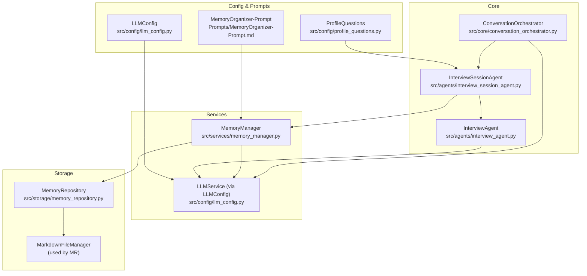
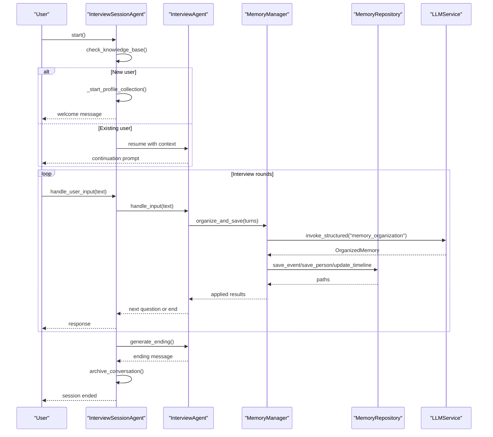
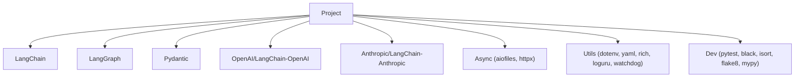

# Getting Started

<cite>
**Referenced Files in This Document**
- [requirements.txt](file://requirements.txt)
- [requirements-dev.txt](file://requirements-dev.txt)
- [pyproject.toml](file://pyproject.toml)
- [demo_memory_storage.py](file://demo_memory_storage.py)
- [src/core/conversation_orchestrator.py](file://src/core/conversation_orchestrator.py)
- [src/agents/interview_agent.py](file://src/agents/interview_agent.py)
- [src/agents/interview_session_agent.py](file://src/agents/interview_session_agent.py)
- [src/services/memory_manager.py](file://src/services/memory_manager.py)
- [src/storage/memory_repository.py](file://src/storage/memory_repository.py)
- [src/config/llm_config.py](file://src/config/llm_config.py)
- [src/config/profile_questions.py](file://src/config/profile_questions.py)
- [src/models/session_state.py](file://src/models/session_state.py)
- [Prompts/MemoryOrganizer-Prompt.md](file://Prompts/MemoryOrganizer-Prompt.md)
- [integration_test_new_user.py](file://integration_test_new_user.py)
</cite>

## Table of Contents
1. [Introduction](#introduction)
2. [Project Structure](#project-structure)
3. [Core Components](#core-components)
4. [Architecture Overview](#architecture-overview)
5. [Detailed Component Analysis](#detailed-component-analysis)
6. [Dependency Analysis](#dependency-analysis)
7. [Performance Considerations](#performance-considerations)
8. [Troubleshooting Guide](#troubleshooting-guide)
9. [Conclusion](#conclusion)
10. [Appendices](#appendices)

## Introduction
This guide helps you install and run the elderly memoir agent system quickly. It covers:
- Prerequisites and environment setup
- Installing dependencies
- Running the memory storage demo
- Setting up the conversation orchestrator and interview session
- Basic usage examples and interview flows
- LLM provider configuration and environment variables
- Troubleshooting common installation issues

The system supports asynchronous workflows, structured memory storage, and guided interview flows tailored for elderly memoir creation.

## Project Structure
High-level layout and roles:
- Core orchestration and session lifecycle: src/core and src/agents
- Memory management and storage: src/services and src/storage
- Configuration and prompts: src/config and Prompts
- Demos and tests: demo_memory_storage.py, integration scripts

**Diagram sources**
- [src/core/conversation_orchestrator.py](file://src/core/conversation_orchestrator.py)
- [src/agents/interview_session_agent.py](file://src/agents/interview_session_agent.py)
- [src/agents/interview_agent.py](file://src/agents/interview_agent.py)
- [src/services/memory_manager.py](file://src/services/memory_manager.py)
- [src/storage/memory_repository.py](file://src/storage/memory_repository.py)
- [src/config/llm_config.py](file://src/config/llm_config.py)
- [src/config/profile_questions.py](file://src/config/profile_questions.py)
- [Prompts/MemoryOrganizer-Prompt.md](file://Prompts/MemoryOrganizer-Prompt.md)

**Section sources**
- [src/core/conversation_orchestrator.py](file://src/core/conversation_orchestrator.py)
- [src/agents/interview_session_agent.py](file://src/agents/interview_session_agent.py)
- [src/agents/interview_agent.py](file://src/agents/interview_agent.py)
- [src/services/memory_manager.py](file://src/services/memory_manager.py)
- [src/storage/memory_repository.py](file://src/storage/memory_repository.py)
- [src/config/llm_config.py](file://src/config/llm_config.py)
- [src/config/profile_questions.py](file://src/config/profile_questions.py)
- [Prompts/MemoryOrganizer-Prompt.md](file://Prompts/MemoryOrganizer-Prompt.md)

## Core Components
- ConversationOrchestrator: Central controller managing session lifecycle, timing, state, and parallelized services (emotion detection, knowledge query, question generation, summarization).
- InterviewSessionAgent: Manages end-to-end session phases (profile collection, interview, ending) and integrates tools and memory.
- InterviewAgent: Handles time-bound interview loops, question generation, knowledge queries, caching, and end-of-session guidance.
- MemoryManager: Orchestrates LLM-driven organization of conversation turns into structured events, people, and timeline updates; coordinates MemoryRepository.
- MemoryRepository: Provides long-term, short-term, and profile memory with file-backed persistence via MarkdownFileManager.
- LLMConfig: Loads provider-specific and generic LLM settings from environment variables.
- ProfileQuestions: Defines question banks and transitions for profile collection.

**Section sources**
- [src/core/conversation_orchestrator.py](file://src/core/conversation_orchestrator.py)
- [src/agents/interview_session_agent.py](file://src/agents/interview_session_agent.py)
- [src/agents/interview_agent.py](file://src/agents/interview_agent.py)
- [src/services/memory_manager.py](file://src/services/memory_manager.py)
- [src/storage/memory_repository.py](file://src/storage/memory_repository.py)
- [src/config/llm_config.py](file://src/config/llm_config.py)
- [src/config/profile_questions.py](file://src/config/profile_questions.py)

## Architecture Overview
The system runs a session loop:
- Initialize session with user preferences
- Optionally collect profile data
- Conduct timed interviews with parallelized services
- Summarize and organize memories into structured knowledge
- Archive conversations and provide end-of-session guidance

**Diagram sources**
- [src/agents/interview_session_agent.py](file://src/agents/interview_session_agent.py)
- [src/agents/interview_agent.py](file://src/agents/interview_agent.py)
- [src/services/memory_manager.py](file://src/services/memory_manager.py)
- [src/storage/memory_repository.py](file://src/storage/memory_repository.py)
- [Prompts/MemoryOrganizer-Prompt.md](file://Prompts/MemoryOrganizer-Prompt.md)

## Detailed Component Analysis

### Installation and Environment Setup
- Python version requirement: Python >= 3.10
- Install production dependencies
- Install developer dependencies (testing, linting, formatting)
- Prepare environment variables for LLM providers

Step-by-step:
1) Verify Python version
- Ensure Python >= 3.10 is installed on your system.

2) Create and activate a virtual environment
- Recommended to isolate dependencies.

3) Install production dependencies
- Use the requirements file for core packages.

4) Install developer dependencies
- Use the dev requirements file for testing and quality tools.

5) Configure environment variables for LLM providers
- See “LLM Provider Configuration” below.

Notes:
- The project metadata enforces Python >= 3.10.
- Dependencies include LangChain, LangGraph, Pydantic, OpenAI/Anthropic integrations, async support, YAML, dotenv, Rich, Loguru, watchdog, and pytest/black/flake8/mypy for development.

**Section sources**
- [pyproject.toml](file://pyproject.toml)
- [requirements.txt](file://requirements.txt)
- [requirements-dev.txt](file://requirements-dev.txt)

### LLM Provider Configuration and Environment Variables
Supported providers and environment variables:
- Generic provider fields:
  - LLM_PROVIDER: provider identifier (e.g., openai/anthropic)
  - LLM_MODEL_NAME: model name
  - LLM_API_KEY: API key
  - LLM_BASE_URL: optional base URL override
  - LLM_TEMPERATURE: sampling temperature
  - LLM_MAX_TOKENS: max tokens per request
- Qwen-specific overrides (preferred if present):
  - QWEN_URL: Qwen API URL
  - QWEN_APIKEY: QWEN_APIKEY
- DeepSeek-specific overrides (fallback):
  - DEEPSEEK_URL: DeepSeek API URL
  - DEEPSEEK_APIKEY: DEEPSEEK_APIKEY

Behavior:
- The configuration loader prioritizes Qwen if both URL and API key are present.
- If Qwen is unavailable, it attempts DeepSeek.
- If neither is configured, the loader raises an error indicating missing Qwen credentials.

Recommended setup:
- Choose one provider and set the appropriate variables.
- For Qwen, set QWEN_URL and QWEN_APIKEY; leave generic fields optional.
- For DeepSeek, set DEEPSEEK_URL and DEEPSEEK_APIKEY; leave generic fields optional.

**Section sources**
- [src/config/llm_config.py](file://src/config/llm_config.py)

### Memory Storage Demo
Run the demo script to see how memory is organized and persisted:
- Creates a MarkdownFileManager and MemoryRepository
- Saves a protagonist, family member, and event
- Updates the timeline
- Prints the generated directory tree

Usage:
- Execute the demo script to observe the file structure and outputs.

What it demonstrates:
- How events, people, and timelines are stored under knowledge_base/<user_id>
- How protagonists are stored separately
- How timeline entries are appended

**Section sources**
- [demo_memory_storage.py](file://demo_memory_storage.py)
- [src/storage/memory_repository.py](file://src/storage/memory_repository.py)

### Conversation Orchestrator Basics
Key responsibilities:
- Initialize sessions with user preferences and strategy
- Manage timing, warnings, and termination
- Coordinate emotion detection, knowledge query, question generation, and summarization
- Emit events for session lifecycle and turn completion
- Prepare handoff packages with collected data

Typical flow:
- Initialize session with user profile
- Process turns with parallelized services
- Detect emotion and adjust state
- Generate questions and update short-term memory
- Check handoff conditions and time limits
- Terminate session and prepare handoff

**Section sources**
- [src/core/conversation_orchestrator.py](file://src/core/conversation_orchestrator.py)
- [src/models/session_state.py](file://src/models/session_state.py)

### Interview Session Agent
Manages session phases:
- Initialization: checks knowledge base existence
- Profile collection: collects user info using question bank
- Interview: runs time-bounded interview with caching and knowledge queries
- Ending: generates end-of-session guidance and archives conversation

Time rules:
- Total session time: 15 minutes
- Profile collection: up to 5 minutes
- Interview after profile: reduced to 10 minutes for new users

**Section sources**
- [src/agents/interview_session_agent.py](file://src/agents/interview_session_agent.py)
- [src/config/profile_questions.py](file://src/config/profile_questions.py)

### Interview Agent
Handles the interview loop:
- Generates opening messages
- Identifies key information (events, people, time, locations) from user input
- Queries knowledge base and caches results
- Generates next questions with time warnings near threshold
- Produces end-of-session guidance and saves summaries

**Section sources**
- [src/agents/interview_agent.py](file://src/agents/interview_agent.py)

### Memory Management and Organization
MemoryManager organizes conversation turns into structured knowledge:
- Formats conversation content and existing timeline/people
- Invokes LLM with the memory organization prompt
- Applies results to save events, people, and update timelines
- Updates profile memory and short-term history

MemoryRepository provides:
- Short-term memory (in-memory)
- Long-term memory (Markdown files under knowledge_base)
- Profile memory (structured metadata)
- Caching and indexing for efficient retrieval

**Section sources**
- [src/services/memory_manager.py](file://src/services/memory_manager.py)
- [src/storage/memory_repository.py](file://src/storage/memory_repository.py)
- [Prompts/MemoryOrganizer-Prompt.md](file://Prompts/MemoryOrganizer-Prompt.md)

### Basic Usage Examples

#### Example 1: Run the Memory Storage Demo
- Purpose: observe how events, people, and timelines are stored
- Steps:
  - Ensure dependencies are installed
  - Run the demo script
  - Review printed directory tree and saved files

Outcome:
- Files created under knowledge_base/<user_id>/events, people, timeline

**Section sources**
- [demo_memory_storage.py](file://demo_memory_storage.py)
- [src/storage/memory_repository.py](file://src/storage/memory_repository.py)

#### Example 2: End-to-End Interview Flow (New User)
- Purpose: simulate a first-time interview session
- Steps:
  - Prepare environment variables for your chosen LLM provider
  - Run the integration test script
  - Interact with the agent by typing responses
  - Type exit or quit to finish

Highlights:
- Agent collects profile information automatically
- After profile collection, it builds a knowledge base and starts the interview
- After ~15 minutes, it generates an ending message and archives the conversation

**Section sources**
- [integration_test_new_user.py](file://integration_test_new_user.py)
- [src/agents/interview_session_agent.py](file://src/agents/interview_session_agent.py)
- [src/agents/interview_agent.py](file://src/agents/interview_agent.py)

#### Example 3: Using the Conversation Orchestrator Programmatically
- Purpose: integrate the orchestrator in your own app
- Steps:
  - Load LLM configuration from environment
  - Initialize the orchestrator with LLM config and optional memory base path
  - Initialize a session with user preferences
  - Loop process_turn with user inputs
  - On handoff or time-up, prepare handoff and terminate session

Key APIs:
- initialize_session(user_profile, strategy)
- process_turn(user_input)
- prepare_handoff()
- terminate_session()

**Section sources**
- [src/core/conversation_orchestrator.py](file://src/core/conversation_orchestrator.py)
- [src/config/llm_config.py](file://src/config/llm_config.py)

## Dependency Analysis
External libraries and their roles:
- LangChain/LangGraph: orchestration and graph-based workflows
- Pydantic: data models and validation
- OpenAI/LangChain-OpenAI: OpenAI integration
- Anthropic/LangChain-Anthropic: Anthropic integration
- Async: aiofiles, httpx
- Utilities: python-dotenv, pyyaml, rich, loguru
- Watchdog: file monitoring
- Testing and quality: pytest, black, isort, flake8, mypy

**Diagram sources**
- [requirements.txt](file://requirements.txt)
- [requirements-dev.txt](file://requirements-dev.txt)

**Section sources**
- [requirements.txt](file://requirements.txt)
- [requirements-dev.txt](file://requirements-dev.txt)

## Performance Considerations
- Asynchronous operations: Parallel tasks for emotion detection and knowledge queries improve responsiveness.
- Caching: MemoryRepository uses an LRU cache to reduce repeated queries.
- Structured summarization: MemoryManager applies LLM organization in batches and saves concurrently.
- Time controls: Session timing and thresholds prevent long-running loops.

[No sources needed since this section provides general guidance]

## Troubleshooting Guide
Common installation and runtime issues:

- Python version mismatch
  - Symptom: Installation fails or runtime errors
  - Fix: Use Python >= 3.10

- Missing LLM credentials
  - Symptom: Configuration loader raises an error about missing Qwen credentials
  - Fix: Set QWEN_URL and QWEN_APIKEY, or configure DEEPSEEK_URL and DEEPSEEK_APIKEY

- Missing dependencies
  - Symptom: ImportError or ModuleNotFoundError
  - Fix: Install requirements.txt and requirements-dev.txt

- Permission or path issues
  - Symptom: Cannot write to knowledge_base or logs
  - Fix: Ensure the user has write permissions to the knowledge_base directory

- Timeout during orchestration
  - Symptom: Emotion detection or knowledge query timeouts
  - Fix: Adjust timeout settings in orchestrator configuration if needed

**Section sources**
- [pyproject.toml](file://pyproject.toml)
- [src/config/llm_config.py](file://src/config/llm_config.py)
- [src/core/conversation_orchestrator.py](file://src/core/conversation_orchestrator.py)

## Conclusion
You now have the essentials to install the system, configure LLM providers, run demos, and conduct interview sessions. Start with the memory storage demo, then try the integration test for a full interview flow. Use the orchestrator APIs to build custom integrations, and rely on the memory manager and repository for robust, structured knowledge persistence.

[No sources needed since this section summarizes without analyzing specific files]

## Appendices

### Appendix A: Environment Variables Reference
- Qwen (preferred)
  - QWEN_URL
  - QWEN_APIKEY
- DeepSeek (fallback)
  - DEEPSEEK_URL
  - DEEPSEEK_APIKEY
- Generic
  - LLM_PROVIDER
  - LLM_MODEL_NAME
  - LLM_API_KEY
  - LLM_BASE_URL
  - LLM_TEMPERATURE
  - LLM_MAX_TOKENS

**Section sources**
- [src/config/llm_config.py](file://src/config/llm_config.py)

### Appendix B: Interview Time Rules
- Total session: 15 minutes
- Profile collection: up to 5 minutes
- Interview after profile: 10 minutes for new users

**Section sources**
- [src/agents/interview_session_agent.py](file://src/agents/interview_session_agent.py)
- [src/agents/interview_agent.py](file://src/agents/interview_agent.py)