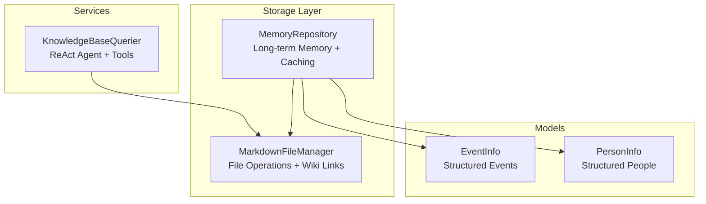
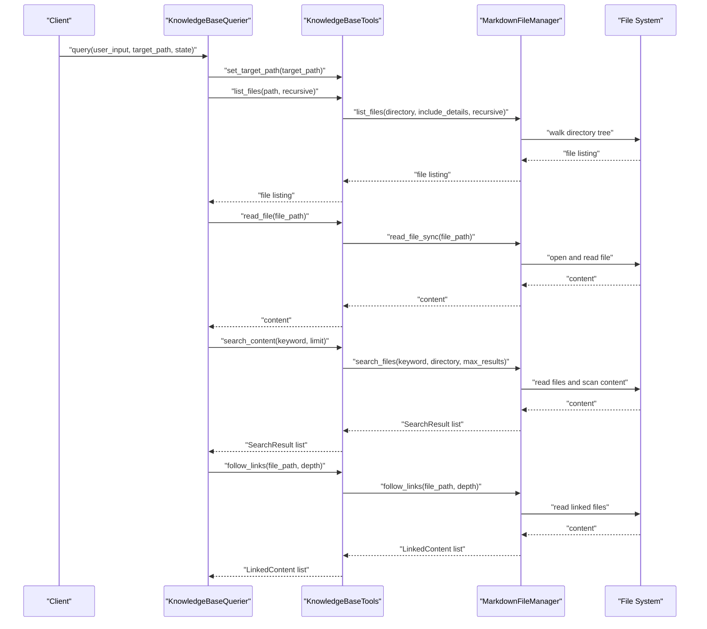
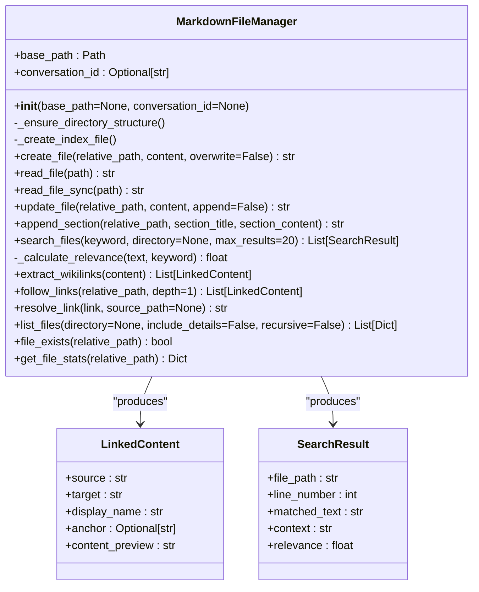
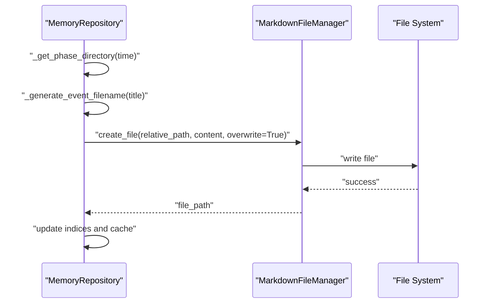
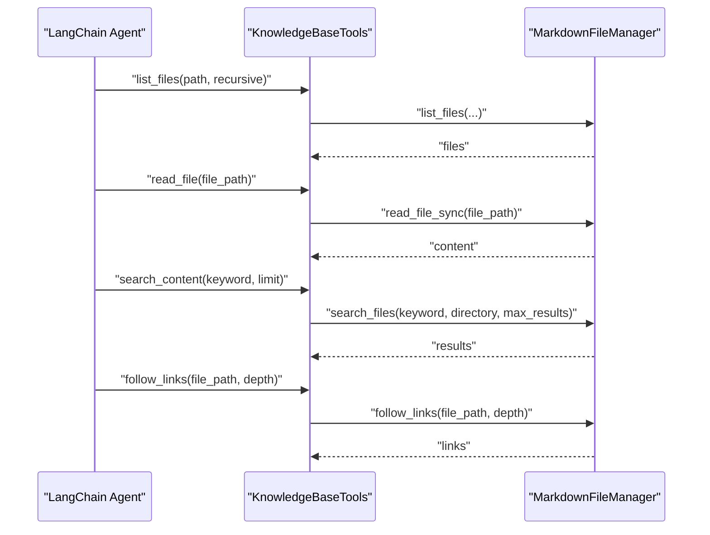
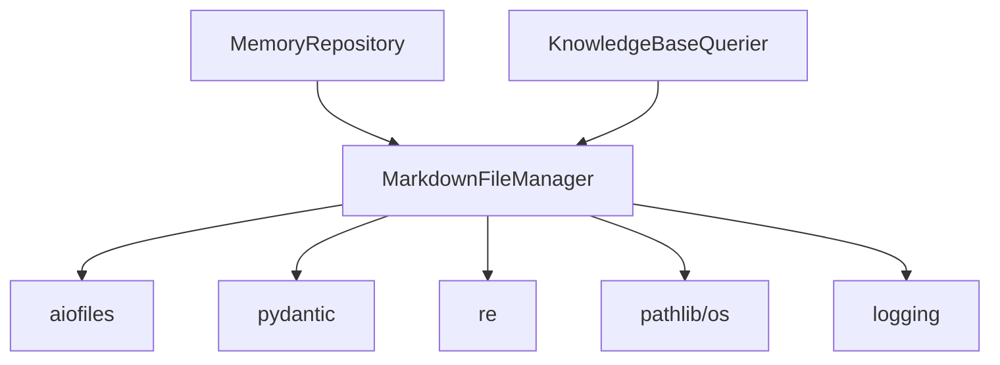

# Markdown File Manager

<cite>
**Referenced Files in This Document**
- [markdown_file_manager.py](file://src/storage/markdown_file_manager.py)
- [memory_repository.py](file://src/storage/memory_repository.py)
- [knowledge_base_querier.py](file://src/services/knowledge_base_querier.py)
- [event_info.py](file://src/models/event_info.py)
- [person_info.py](file://src/models/person_info.py)
- [test_markdown_file_manager.py](file://tests/test_markdown_file_manager.py)
- [Task-003-实现MarkdownFileManager.md](file://开发故事卡/Task-003-实现MarkdownFileManager.md)
- [pyproject.toml](file://pyproject.toml)
- [requirements.txt](file://requirements.txt)
</cite>

## Table of Contents
1. [Introduction](#introduction)
2. [Project Structure](#project-structure)
3. [Core Components](#core-components)
4. [Architecture Overview](#architecture-overview)
5. [Detailed Component Analysis](#detailed-component-analysis)
6. [Dependency Analysis](#dependency-analysis)
7. [Performance Considerations](#performance-considerations)
8. [Troubleshooting Guide](#troubleshooting-guide)
9. [Conclusion](#conclusion)
10. [Appendices](#appendices)

## Introduction
This document provides comprehensive documentation for the MarkdownFileManager class, which manages a structured knowledge base of Markdown files. It covers file system operations (creation, reading, updating, deletion), asynchronous and synchronous modes, wiki-style link parsing and generation, directory structure management, path resolution, search capabilities, and integration with MemoryRepository for persistent storage operations. It also documents configuration options, error handling, file locking considerations, and cross-platform compatibility.

## Project Structure
The MarkdownFileManager resides in the storage layer alongside the MemoryRepository, which orchestrates long-term memory persistence. The KnowledgeBaseQuerier integrates with the file manager to enable intelligent search and link-following within the knowledge base.

**Diagram sources**
- [markdown_file_manager.py:31-546](file://src/storage/markdown_file_manager.py#L31-L546)
- [memory_repository.py:40-359](file://src/storage/memory_repository.py#L40-L359)
- [knowledge_base_querier.py:202-540](file://src/services/knowledge_base_querier.py#L202-L540)
- [event_info.py:5-69](file://src/models/event_info.py#L5-L69)
- [person_info.py:5-61](file://src/models/person_info.py#L5-L61)

**Section sources**
- [markdown_file_manager.py:31-546](file://src/storage/markdown_file_manager.py#L31-L546)
- [memory_repository.py:40-359](file://src/storage/memory_repository.py#L40-L359)
- [knowledge_base_querier.py:202-540](file://src/services/knowledge_base_querier.py#L202-L540)

## Core Components
- MarkdownFileManager: Central class for file operations, wiki link parsing/generation, search, and directory management.
- MemoryRepository: Integrates with MarkdownFileManager to persist structured memory (events, people) and manage caches.
- KnowledgeBaseQuerier: Uses MarkdownFileManager to power ReAct agent-based search and link-following.

Key responsibilities:
- File operations: create, read (async/sync), update, append sections, delete (via update with empty content).
- Wiki link parsing: extract and resolve wiki-style links with anchors and display names.
- Search: keyword matching across all Markdown files with relevance scoring and context extraction.
- Directory management: ensure predefined directory structure and index file creation.
- Integration: seamless use by MemoryRepository and KnowledgeBaseQuerier.

**Section sources**
- [markdown_file_manager.py:31-546](file://src/storage/markdown_file_manager.py#L31-L546)
- [memory_repository.py:40-359](file://src/storage/memory_repository.py#L40-L359)
- [knowledge_base_querier.py:202-540](file://src/services/knowledge_base_querier.py#L202-L540)

## Architecture Overview
The system follows a layered architecture:
- Storage layer: MarkdownFileManager handles low-level file operations and wiki link management.
- Repository layer: MemoryRepository persists structured data (EventInfo, PersonInfo) using MarkdownFileManager and maintains caches.
- Service layer: KnowledgeBaseQuerier orchestrates intelligent search and link-following using the file manager.

**Diagram sources**
- [knowledge_base_querier.py:202-540](file://src/services/knowledge_base_querier.py#L202-L540)
- [markdown_file_manager.py:134-546](file://src/storage/markdown_file_manager.py#L134-L546)

## Detailed Component Analysis

### MarkdownFileManager Class
The MarkdownFileManager encapsulates all file operations and wiki link management. It ensures a standardized directory structure and provides robust search and link-handling capabilities.

**Diagram sources**
- [markdown_file_manager.py:13-546](file://src/storage/markdown_file_manager.py#L13-L546)

Key behaviors:
- Initialization and directory structure: Creates required directories and an index file if missing.
- File operations: Asynchronous create/read/update with optional overwrite and append modes; synchronous read for tool compatibility.
- Search: Full-text search across Markdown files with relevance scoring and context windows.
- Wiki links: Extraction supports multiple formats; resolution handles relative/absolute paths and anchors; follow-links traverses targets with depth control.
- Utilities: Listing files with optional details and statistics.

Asynchronous vs synchronous modes:
- Async methods: create_file, read_file, update_file, append_section, search_files, follow_links.
- Sync method: read_file_sync used by KnowledgeBaseTools to avoid event loop conflicts.

Path resolution:
- resolve_link parses wiki links and resolves relative paths against source_path, normalizing separators.

Search relevance:
- Scoring considers exact matches, occurrence counts, and whether the line is a header.

**Section sources**
- [markdown_file_manager.py:31-546](file://src/storage/markdown_file_manager.py#L31-L546)
- [test_markdown_file_manager.py:1-207](file://tests/test_markdown_file_manager.py#L1-L207)

### MemoryRepository Integration
MemoryRepository uses MarkdownFileManager to persist structured memory:
- Save events and people to Markdown files with generated filenames and directory placement.
- Maintain in-memory indices and LRU cache for fast retrieval.
- Update timeline entries with wiki links pointing to event files.

**Diagram sources**
- [memory_repository.py:175-200](file://src/storage/memory_repository.py#L175-L200)
- [markdown_file_manager.py:134-169](file://src/storage/markdown_file_manager.py#L134-L169)

**Section sources**
- [memory_repository.py:40-359](file://src/storage/memory_repository.py#L40-L359)
- [event_info.py:34-69](file://src/models/event_info.py#L34-L69)
- [person_info.py:34-61](file://src/models/person_info.py#L34-L61)

### KnowledgeBaseQuerier Integration
KnowledgeBaseQuerier exposes tools that delegate to MarkdownFileManager:
- list_files: Enumerates files with details and sorting.
- read_file: Reads content synchronously.
- search_content: Searches within a scoped directory.
- follow_links: Resolves and reads linked files with depth control.
- mark_suspected_file, get_exploration_report, has_visited: Support exploration workflows.

**Diagram sources**
- [knowledge_base_querier.py:54-195](file://src/services/knowledge_base_querier.py#L54-L195)
- [markdown_file_manager.py:475-546](file://src/storage/markdown_file_manager.py#L475-L546)

**Section sources**
- [knowledge_base_querier.py:202-540](file://src/services/knowledge_base_querier.py#L202-L540)

## Dependency Analysis
External dependencies and their roles:
- aiofiles: Asynchronous file I/O for create/read/update operations.
- pydantic: Data models for LinkedContent and SearchResult.
- re: Regular expressions for wiki link extraction and parsing.
- pathlib/os: Path manipulation and filesystem operations.
- logging: Structured logging for initialization and warnings.

Internal dependencies:
- MemoryRepository depends on MarkdownFileManager for persistence.
- KnowledgeBaseQuerier depends on MarkdownFileManager for search and link-following.

**Diagram sources**
- [markdown_file_manager.py:1-10](file://src/storage/markdown_file_manager.py#L1-L10)
- [requirements.txt:1-24](file://requirements.txt#L1-L24)

**Section sources**
- [markdown_file_manager.py:1-10](file://src/storage/markdown_file_manager.py#L1-L10)
- [requirements.txt:1-24](file://requirements.txt#L1-L24)

## Performance Considerations
- Asynchronous I/O: Use async create/read/update for high-throughput scenarios.
- Search efficiency: Full-text scanning across all .md files; consider indexing for large repositories.
- Link traversal depth: Limit depth in follow_links to control recursion cost.
- Caching: MemoryRepository’s LRU cache reduces repeated reads for frequently accessed items.
- Encoding: UTF-8 is hardcoded; ensure all content is encoded consistently.

[No sources needed since this section provides general guidance]

## Troubleshooting Guide
Common issues and resolutions:
- File not found errors: Ensure paths are relative to base_path; use read_file_sync for tools that require synchronous operations.
- Overwrite vs append behavior: When creating existing files without overwrite, content is appended; confirm intended behavior.
- Link resolution failures: Verify wiki link format and source_path correctness for relative links.
- Search results ordering: Results are sorted by relevance; adjust keyword specificity for better outcomes.
- Cross-platform paths: resolve_link normalizes separators; ensure consistent path usage across platforms.

**Section sources**
- [markdown_file_manager.py:171-229](file://src/storage/markdown_file_manager.py#L171-L229)
- [markdown_file_manager.py:358-471](file://src/storage/markdown_file_manager.py#L358-L471)
- [test_markdown_file_manager.py:41-44](file://tests/test_markdown_file_manager.py#L41-L44)

## Conclusion
The MarkdownFileManager provides a robust foundation for managing a structured knowledge base of Markdown files. Its integration with MemoryRepository and KnowledgeBaseQuerier enables persistent storage, intelligent search, and cross-referencing through wiki-style links. By leveraging asynchronous I/O, caching, and standardized directory structures, it supports scalable memory management for narrative-driven applications.

[No sources needed since this section summarizes without analyzing specific files]

## Appendices

### Configuration Options
- Base path: Configurable via constructor; defaults to a temporary directory under TEMP/APPDATA if not provided.
- Conversation ID: Optional; when provided, creates a subdirectory under base_path for isolation.
- Encoding: UTF-8 is used for all file operations.
- Permissions: Managed by the underlying filesystem; ensure write permissions for the base_path.

**Section sources**
- [markdown_file_manager.py:47-72](file://src/storage/markdown_file_manager.py#L47-L72)

### Directory Structure Management
Predefined directories and index file:
- events/childhood, events/youth, events/middle_age, events/elderly
- people/family, people/friends, people/colleagues, people/others
- timeline, themes
- index.md is created automatically if missing.

**Section sources**
- [markdown_file_manager.py:80-131](file://src/storage/markdown_file_manager.py#L80-L131)

### File Naming Conventions
- Event files: Generated from titles with non-alphanumeric characters replaced by hyphens, truncated to 50 characters.
- Person files: Generated from names with sanitization and truncation.
- Timeline updates: Append new entries with wiki links to event files.

**Section sources**
- [memory_repository.py:349-359](file://src/storage/memory_repository.py#L349-L359)
- [event_info.py:34-69](file://src/models/event_info.py#L34-L69)
- [person_info.py:34-61](file://src/models/person_info.py#L34-L61)

### Search Capabilities
- Keyword matching: Case-insensitive substring matching across all .md files.
- Recursive traversal: rglob scans all subdirectories.
- Filtering: Optional directory scope; max_results limits output.
- Relevance scoring: Based on exact matches, occurrence counts, and header lines.

**Section sources**
- [markdown_file_manager.py:285-354](file://src/storage/markdown_file_manager.py#L285-L354)

### Wiki Link Parsing and Generation
Supported formats:
- [[path]]
- [[path|display_name]]
- [[path#anchor]]
- [[path#anchor|display_name]]

Extraction and resolution:
- extract_wikilinks uses regex to capture target, anchor, and display_name.
- resolve_link normalizes separators and resolves relative paths against source_path.

Follow-links:
- Traverses linked files up to a specified depth, reading target content and previewing snippets.

**Section sources**
- [markdown_file_manager.py:358-471](file://src/storage/markdown_file_manager.py#L358-L471)

### Integration Notes
- MemoryRepository writes structured data to Markdown files using MarkdownFileManager and maintains caches.
- KnowledgeBaseQuerier uses MarkdownFileManager for tool-based exploration and ReAct loops.

**Section sources**
- [memory_repository.py:175-260](file://src/storage/memory_repository.py#L175-L260)
- [knowledge_base_querier.py:54-195](file://src/services/knowledge_base_querier.py#L54-L195)

### Testing References
- Unit tests cover file creation, reading, updating, appending, search, link extraction, resolution, and listing.

**Section sources**
- [test_markdown_file_manager.py:1-207](file://tests/test_markdown_file_manager.py#L1-L207)