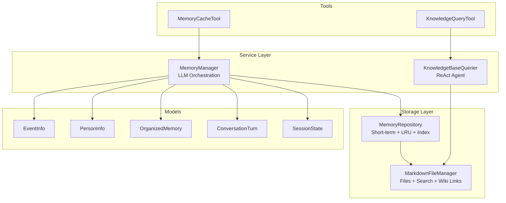
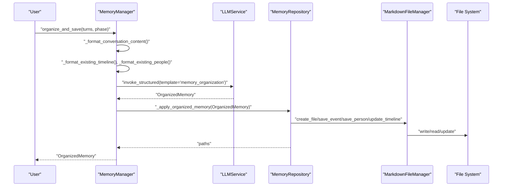
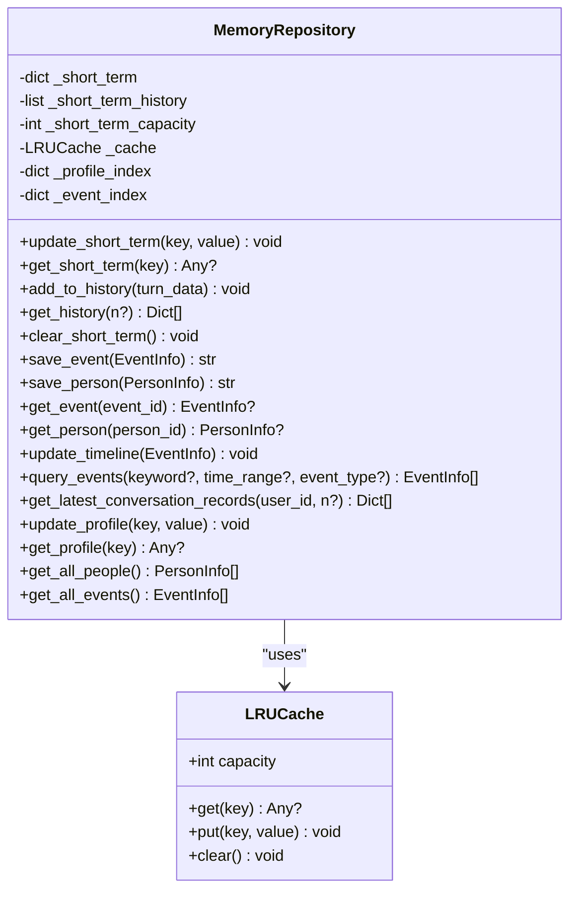
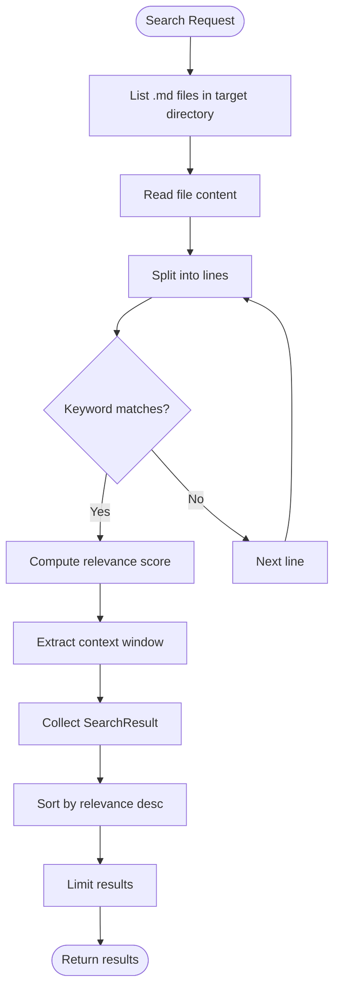
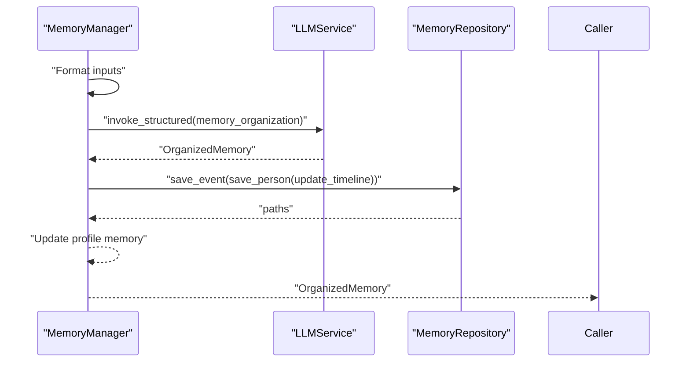
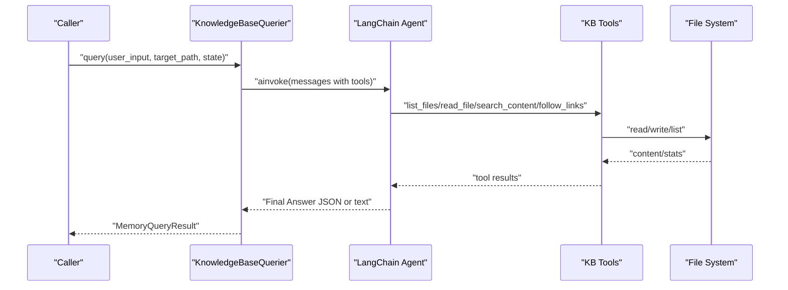
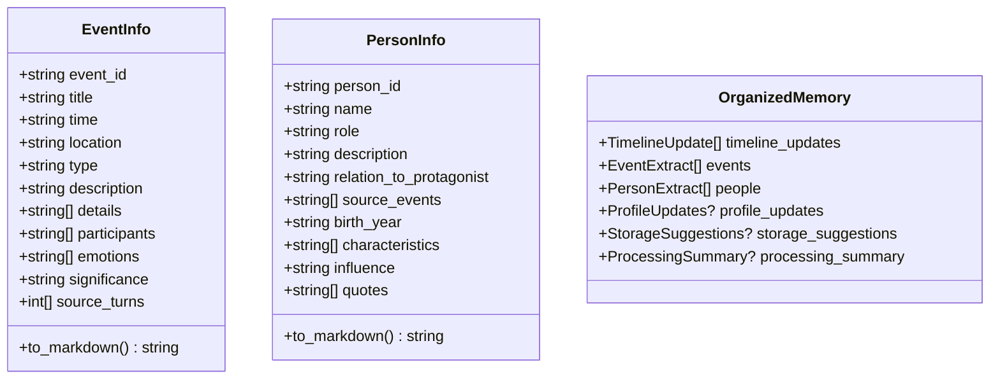
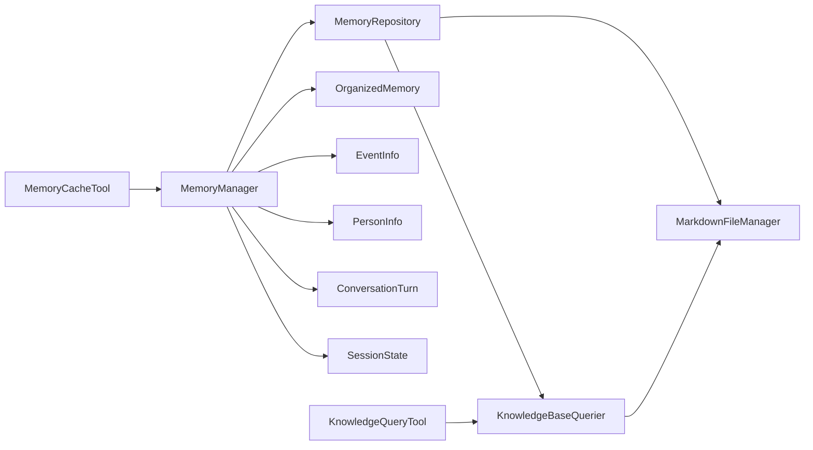

# Memory Management

<cite>
**Referenced Files in This Document**
- [memory_repository.py](file://src/storage/memory_repository.py)
- [markdown_file_manager.py](file://src/storage/markdown_file_manager.py)
- [memory_manager.py](file://src/services/memory_manager.py)
- [organized_memory.py](file://src/models/organized_memory.py)
- [event_info.py](file://src/models/event_info.py)
- [person_info.py](file://src/models/person_info.py)
- [conversation_turn.py](file://src/models/conversation_turn.py)
- [session_state.py](file://src/models/session_state.py)
- [knowledge_base_querier.py](file://src/services/knowledge_base_querier.py)
- [knowledge_query_tool.py](file://src/tools/knowledge_query_tool.py)
- [memory_cache_tool.py](file://src/tools/memory_cache_tool.py)
- [test_memory_repository.py](file://tests/test_memory_repository.py)
- [test_memory_manager.py](file://tests/test_memory_manager.py)
- [demo_memory_storage.py](file://demo_memory_storage.py)
</cite>

## Table of Contents
1. [Introduction](#introduction)
2. [Project Structure](#project-structure)
3. [Core Components](#core-components)
4. [Architecture Overview](#architecture-overview)
5. [Detailed Component Analysis](#detailed-component-analysis)
6. [Dependency Analysis](#dependency-analysis)
7. [Performance Considerations](#performance-considerations)
8. [Troubleshooting Guide](#troubleshooting-guide)
9. [Conclusion](#conclusion)
10. [Appendices](#appendices)

## Introduction
This document explains the memory management system that powers structured storytelling and knowledge organization. It covers:
- MemoryRepository’s multi-tiered storage combining short-term memory, LRU caching, and file-system persistence
- MarkdownFileManager’s wiki-style link tracking, file operations, and search capabilities
- MemoryManager’s orchestration of LLM-driven memory organization across events, people, and timeline categories
- Indexing, cross-referencing, and relationship mapping
- Practical examples of memory operations, cache management, and retrieval patterns
- Configuration options, performance tuning, and cross-platform considerations

## Project Structure
The memory system spans storage, service, model, and tool layers:
- Storage: MemoryRepository (short-term + LRU cache + persistent index), MarkdownFileManager (file ops + search + wiki-links)
- Services: MemoryManager (orchestration), KnowledgeBaseQuerier (ReAct agent over knowledge base)
- Models: EventInfo, PersonInfo, OrganizedMemory, ConversationTurn, SessionState
- Tools: KnowledgeQueryTool (wrapper), MemoryCacheTool (session-level cache)

**Diagram sources**
- [memory_repository.py:40-359](file://src/storage/memory_repository.py#L40-L359)
- [markdown_file_manager.py:31-546](file://src/storage/markdown_file_manager.py#L31-L546)
- [memory_manager.py:27-470](file://src/services/memory_manager.py#L27-L470)
- [knowledge_base_querier.py:202-540](file://src/services/knowledge_base_querier.py#L202-L540)
- [organized_memory.py:141-151](file://src/models/organized_memory.py#L141-L151)
- [event_info.py:5-69](file://src/models/event_info.py#L5-L69)
- [person_info.py:5-61](file://src/models/person_info.py#L5-L61)
- [conversation_turn.py:14-52](file://src/models/conversation_turn.py#L14-L52)
- [session_state.py:24-139](file://src/models/session_state.py#L24-L139)
- [knowledge_query_tool.py:11-81](file://src/tools/knowledge_query_tool.py#L11-L81)
- [memory_cache_tool.py:8-89](file://src/tools/memory_cache_tool.py#L8-L89)

**Section sources**
- [memory_repository.py:40-359](file://src/storage/memory_repository.py#L40-L359)
- [markdown_file_manager.py:31-546](file://src/storage/markdown_file_manager.py#L31-L546)
- [memory_manager.py:27-470](file://src/services/memory_manager.py#L27-L470)
- [knowledge_base_querier.py:202-540](file://src/services/knowledge_base_querier.py#L202-L540)
- [organized_memory.py:141-151](file://src/models/organized_memory.py#L141-L151)
- [event_info.py:5-69](file://src/models/event_info.py#L5-L69)
- [person_info.py:5-61](file://src/models/person_info.py#L5-L61)
- [conversation_turn.py:14-52](file://src/models/conversation_turn.py#L14-L52)
- [session_state.py:24-139](file://src/models/session_state.py#L24-L139)
- [knowledge_query_tool.py:11-81](file://src/tools/knowledge_query_tool.py#L11-L81)
- [memory_cache_tool.py:8-89](file://src/tools/memory_cache_tool.py#L8-L89)

## Core Components
- MemoryRepository: Multi-tier memory with short-term dict, LRU cache, persistent indices, and file-backed storage via MarkdownFileManager. Provides save/get/query operations for events and people, timeline updates, and conversation history management.
- MarkdownFileManager: File system manager with asynchronous/synchronous IO, directory scaffolding, search, wiki-link extraction and traversal, and file stats.
- MemoryManager: Orchestrates LLM-driven organization of conversations into structured memories (events, people, timeline), applies them to storage, and manages profile updates.
- KnowledgeBaseQuerier: ReAct agent that explores a target directory, lists files, reads content, follows wiki-links, marks suspected files, and returns relevant memory entries.
- Models: EventInfo, PersonInfo, OrganizedMemory, ConversationTurn, SessionState define the data contracts for memory operations.
- Tools: KnowledgeQueryTool wraps KnowledgeBaseQuerier for simple queries; MemoryCacheTool provides session-scoped short-term cache.

**Section sources**
- [memory_repository.py:40-359](file://src/storage/memory_repository.py#L40-L359)
- [markdown_file_manager.py:31-546](file://src/storage/markdown_file_manager.py#L31-L546)
- [memory_manager.py:27-470](file://src/services/memory_manager.py#L27-L470)
- [knowledge_base_querier.py:202-540](file://src/services/knowledge_base_querier.py#L202-L540)
- [organized_memory.py:141-151](file://src/models/organized_memory.py#L141-L151)
- [event_info.py:5-69](file://src/models/event_info.py#L5-L69)
- [person_info.py:5-61](file://src/models/person_info.py#L5-L61)
- [conversation_turn.py:14-52](file://src/models/conversation_turn.py#L14-L52)
- [session_state.py:24-139](file://src/models/session_state.py#L24-L139)
- [knowledge_query_tool.py:11-81](file://src/tools/knowledge_query_tool.py#L11-L81)
- [memory_cache_tool.py:8-89](file://src/tools/memory_cache_tool.py#L8-L89)

## Architecture Overview
The system integrates LLM-driven memory organization with robust file-based persistence and indexing.

**Diagram sources**
- [memory_manager.py:111-157](file://src/services/memory_manager.py#L111-L157)
- [memory_manager.py:158-193](file://src/services/memory_manager.py#L158-L193)
- [memory_repository.py:176-226](file://src/storage/memory_repository.py#L176-L226)
- [memory_repository.py:248-261](file://src/storage/memory_repository.py#L248-L261)
- [markdown_file_manager.py:134-170](file://src/storage/markdown_file_manager.py#L134-L170)

## Detailed Component Analysis

### MemoryRepository: Multi-Tier Memory and Persistence
- Short-term memory: In-memory dict keyed by string identifiers with timestamps; history stored as a bounded list.
- LRU cache: Fixed-capacity cache backed by an ordered dict; evicts least-recently-used entries.
- Persistent indices: In-memory dicts for events and people; cache entries mirror indices for fast retrieval.
- File-backed storage: Uses MarkdownFileManager to create/update files under structured directories (events, people, timeline).
- Timeline updates: Append formatted entries to a central timeline file with wiki-links to event pages.
- Querying: Keyword/type filtering over in-memory indices; future enhancements could add database-backed search.
- Conversation history: Lists latest JSON conversation files by timestamp and loads the most recent.

**Diagram sources**
- [memory_repository.py:16-38](file://src/storage/memory_repository.py#L16-L38)
- [memory_repository.py:40-359](file://src/storage/memory_repository.py#L40-L359)

**Section sources**
- [memory_repository.py:40-359](file://src/storage/memory_repository.py#L40-L359)

### MarkdownFileManager: File Operations, Search, and Wiki-Links
- Directory scaffolding: Ensures required directories exist (events, people, timeline, themes) and creates an index file.
- File operations: Asynchronous creation, reading, updating, and appending; supports section appends.
- Search: Full-text search across .md files with relevance scoring and context windows.
- Wiki-links: Extraction of [[path]], [[path|display_name]], [[path#anchor]], [[path#anchor|display_name]]; traversal with depth control; resolution of relative paths.
- Listing and stats: Recursive listing with optional details; file existence checks and stats.

**Diagram sources**
- [markdown_file_manager.py:285-335](file://src/storage/markdown_file_manager.py#L285-L335)

**Section sources**
- [markdown_file_manager.py:31-546](file://src/storage/markdown_file_manager.py#L31-L546)

### MemoryManager: LLM-Driven Organization and Application
- Formats conversation content and existing context for LLM templates.
- Invokes LLM to produce OrganizedMemory (events, people, timeline updates, profile updates).
- Applies results in parallel: saves events (and updates timeline), saves people, updates profile memory.
- Provides convenience methods for querying events, retrieving single entities, and clearing session memory.

**Diagram sources**
- [memory_manager.py:111-157](file://src/services/memory_manager.py#L111-L157)
- [memory_manager.py:158-193](file://src/services/memory_manager.py#L158-L193)

**Section sources**
- [memory_manager.py:27-470](file://src/services/memory_manager.py#L27-L470)
- [organized_memory.py:141-151](file://src/models/organized_memory.py#L141-L151)

### KnowledgeBaseQuerier: ReAct Agent Over Knowledge Base
- Builds a LangChain agent with tools: list_files, read_file, follow_links, mark_suspected_file, get_exploration_report, has_visited.
- Enforces target path scope to prevent directory traversal.
- Parses Final Answer JSON or falls back to natural language parsing.
- Returns MemoryQueryResult with entries and linked content previews.

**Diagram sources**
- [knowledge_base_querier.py:257-373](file://src/services/knowledge_base_querier.py#L257-L373)
- [knowledge_base_querier.py:435-512](file://src/services/knowledge_base_querier.py#L435-L512)

**Section sources**
- [knowledge_base_querier.py:202-540](file://src/services/knowledge_base_querier.py#L202-L540)

### Models: Data Contracts for Memory
- EventInfo: Structured event with markdown conversion and wiki-link placeholders.
- PersonInfo: Structured person with markdown conversion and related events.
- OrganizedMemory: LLM output schema with events, people, timeline updates, profile updates, and processing summary.
- ConversationTurn and SessionState: Track conversation history and session progress.

**Diagram sources**
- [event_info.py:5-69](file://src/models/event_info.py#L5-L69)
- [person_info.py:5-61](file://src/models/person_info.py#L5-L61)
- [organized_memory.py:141-151](file://src/models/organized_memory.py#L141-L151)

**Section sources**
- [event_info.py:5-69](file://src/models/event_info.py#L5-L69)
- [person_info.py:5-61](file://src/models/person_info.py#L5-L61)
- [organized_memory.py:141-151](file://src/models/organized_memory.py#L141-L151)

### Tools: Query and Cache Utilities
- KnowledgeQueryTool: Wraps KnowledgeBaseQuerier for simple string queries and formats results.
- MemoryCacheTool: Session-scoped in-memory cache keyed by tags; supports append and clear.

**Section sources**
- [knowledge_query_tool.py:11-81](file://src/tools/knowledge_query_tool.py#L11-L81)
- [memory_cache_tool.py:8-89](file://src/tools/memory_cache_tool.py#L8-L89)

## Dependency Analysis
- MemoryManager depends on MemoryRepository and LLMService to transform conversations into structured memories.
- MemoryRepository depends on MarkdownFileManager for file operations and KnowledgeBaseQuerier for LLM-backed search.
- KnowledgeBaseQuerier depends on MarkdownFileManager for file system access and LLMService for agent reasoning.
- Models are shared contracts across services and storage.

**Diagram sources**
- [memory_manager.py:27-470](file://src/services/memory_manager.py#L27-L470)
- [memory_repository.py:40-359](file://src/storage/memory_repository.py#L40-L359)
- [knowledge_base_querier.py:202-540](file://src/services/knowledge_base_querier.py#L202-L540)
- [knowledge_query_tool.py:11-81](file://src/tools/knowledge_query_tool.py#L11-L81)
- [memory_cache_tool.py:8-89](file://src/tools/memory_cache_tool.py#L8-L89)

**Section sources**
- [memory_manager.py:27-470](file://src/services/memory_manager.py#L27-L470)
- [memory_repository.py:40-359](file://src/storage/memory_repository.py#L40-L359)
- [knowledge_base_querier.py:202-540](file://src/services/knowledge_base_querier.py#L202-L540)
- [knowledge_query_tool.py:11-81](file://src/tools/knowledge_query_tool.py#L11-L81)
- [memory_cache_tool.py:8-89](file://src/tools/memory_cache_tool.py#L8-L89)

## Performance Considerations
- Short-term memory capacity: Controlled by MemoryRepository constructor; adjust to balance responsiveness vs. memory usage.
- LRU cache capacity: Tunable via MemoryRepository constructor; larger caches reduce repeated file reads but increase memory footprint.
- Parallelism: MemoryManager uses asyncio.gather to save events and people concurrently; beneficial for throughput.
- Search relevance: MarkdownFileManager computes relevance scores; tune keyword weighting and context window sizes for accuracy.
- File IO: Prefer asynchronous operations where possible; batch updates to minimize disk writes.
- Indexing: Current indices are in-memory; for large-scale deployments, consider integrating a lightweight database or embedding store for faster queries.

[No sources needed since this section provides general guidance]

## Troubleshooting Guide
Common issues and remedies:
- LLM template missing: KnowledgeBaseQuerier requires a “knowledge_base_react” template; ensure it is configured in LLMService.
- Target path errors: KnowledgeBaseQuerier validates target_path existence and directory type; ensure correct path construction.
- File not found during read: MarkdownFileManager raises FileNotFoundError; verify relative paths and base_path configuration.
- Cache eviction surprises: LRU cache capacity is fixed; monitor cache hit rates and adjust capacity accordingly.
- Conversation records not found: MemoryRepository scans for conversation_*.json files; ensure correct user_id and directory layout.

**Section sources**
- [knowledge_base_querier.py:280-294](file://src/services/knowledge_base_querier.py#L280-L294)
- [markdown_file_manager.py:188-189](file://src/storage/markdown_file_manager.py#L188-L189)
- [memory_repository.py:122-161](file://src/storage/memory_repository.py#L122-L161)

## Conclusion
The memory management system combines short-term in-memory caching, LRU eviction, and persistent file-based storage to support structured storytelling and knowledge organization. MemoryManager orchestrates LLM-driven organization into events, people, and timelines, while MarkdownFileManager provides robust file operations, search, and wiki-link navigation. KnowledgeBaseQuerier enables intelligent exploration of the knowledge base using a ReAct agent. Together, these components form a scalable, extensible foundation for memory-centric applications.

[No sources needed since this section summarizes without analyzing specific files]

## Appendices

### Practical Examples and Patterns
- Save an event and update timeline:
  - Call MemoryRepository.save_event(EventInfo) to persist and index.
  - Call MemoryRepository.update_timeline(EventInfo) to append to timeline.
- Retrieve recent conversation records:
  - Call MemoryRepository.get_latest_conversation_records(user_id, n?) to load the latest JSON conversation file and slice results.
- Query events by keyword or type:
  - Call MemoryManager.query_events(keyword?, event_type?) to filter in-memory indices.
- Manage short-term memory:
  - Use MemoryManager.update_short_term(key, value) and MemoryManager.get_short_term(key) for transient context.
- Clear session memory:
  - Use MemoryManager.clear_session() to reset short-term memory and history.

**Section sources**
- [memory_repository.py:176-226](file://src/storage/memory_repository.py#L176-L226)
- [memory_repository.py:248-261](file://src/storage/memory_repository.py#L248-L261)
- [memory_repository.py:111-161](file://src/storage/memory_repository.py#L111-L161)
- [memory_manager.py:324-341](file://src/services/memory_manager.py#L324-L341)
- [memory_manager.py:64-106](file://src/services/memory_manager.py#L64-L106)
- [memory_manager.py:468-470](file://src/services/memory_manager.py#L468-L470)

### Configuration Options and Tuning
- MemoryRepository capacities:
  - short_term_capacity: Controls the length of conversation history kept in-memory.
  - cache_capacity: Controls LRU cache size for event/person retrieval.
- MarkdownFileManager:
  - base_path: Root directory for memory storage; defaults to a temporary directory if not provided.
  - conversation_id: Optional; when provided, storage is scoped under memory/{conversation_id}.
- KnowledgeBaseQuerier:
  - target_path: Strictly limits agent operations to a given directory.
  - Tool parameters: list_files(recursive), search_content(limit), follow_links(depth).
- MemoryCacheTool:
  - Session-scoped cache; append with tags for targeted retrieval.

**Section sources**
- [memory_repository.py:54-87](file://src/storage/memory_repository.py#L54-L87)
- [markdown_file_manager.py:47-77](file://src/storage/markdown_file_manager.py#L47-L77)
- [knowledge_base_querier.py:295-296](file://src/services/knowledge_base_querier.py#L295-L296)
- [memory_cache_tool.py:29-32](file://src/tools/memory_cache_tool.py#L29-L32)

### Data Lifecycle and Archival
- Creation: Events and people are persisted as Markdown files with structured frontmatter-like sections.
- Indexing: In-memory indices track events and people; cache mirrors indices for fast retrieval.
- Timeline: Central timeline file aggregates life events with wiki-links to event pages.
- Archival: Files are stored under user-scoped directories; consider rotating or archiving old sessions by moving directories out of the active base_path.

**Section sources**
- [memory_repository.py:176-226](file://src/storage/memory_repository.py#L176-L226)
- [memory_repository.py:248-261](file://src/storage/memory_repository.py#L248-L261)
- [markdown_file_manager.py:80-131](file://src/storage/markdown_file_manager.py#L80-L131)

### Cross-Platform Compatibility
- Path handling: Uses pathlib.Path and os.path APIs; ensure consistent path separators across platforms.
- File encoding: UTF-8 is used for all file IO; verify platform locale settings.
- Async IO: aiofiles is used for async file operations; confirm event loop availability on target platforms.

**Section sources**
- [markdown_file_manager.py:134-170](file://src/storage/markdown_file_manager.py#L134-L170)
- [markdown_file_manager.py:201-229](file://src/storage/markdown_file_manager.py#L201-L229)

### Demo and Tests
- Demo script: Demonstrates saving protagonist, family members, events, and timeline updates with a generated conversation_id and base_path.
- Unit tests: Cover LRUCache behavior, MemoryRepository save/get/query, MemoryManager orchestration, and KnowledgeBaseQuerier parsing.

**Section sources**
- [demo_memory_storage.py:16-118](file://demo_memory_storage.py#L16-L118)
- [test_memory_repository.py:10-325](file://tests/test_memory_repository.py#L10-L325)
- [test_memory_manager.py:18-249](file://tests/test_memory_manager.py#L18-L249)