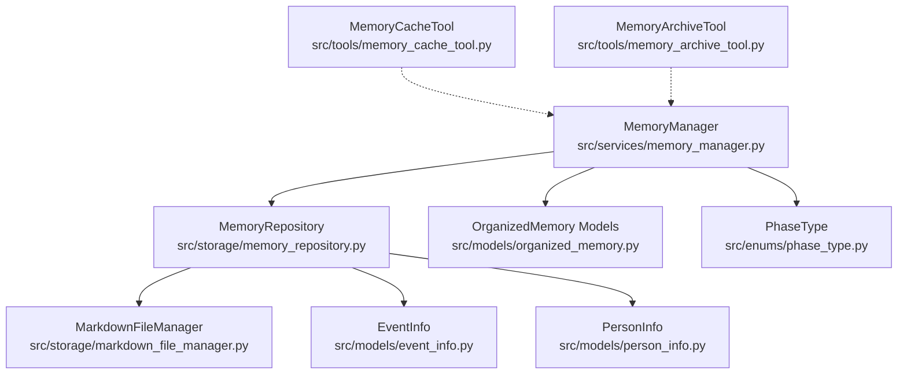
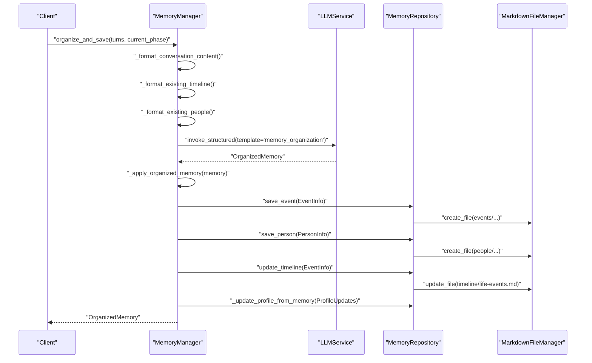
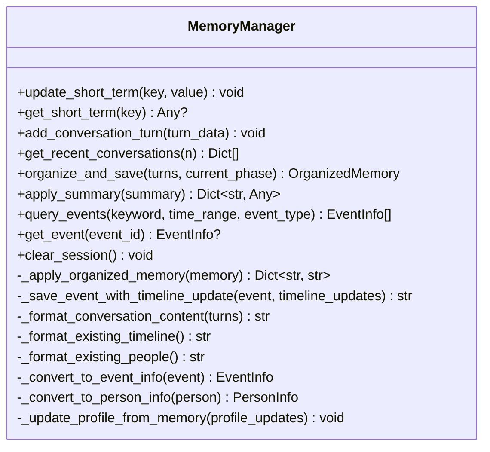
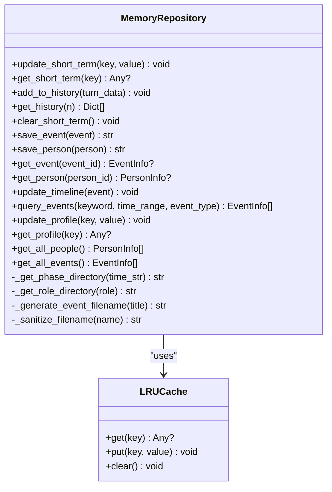
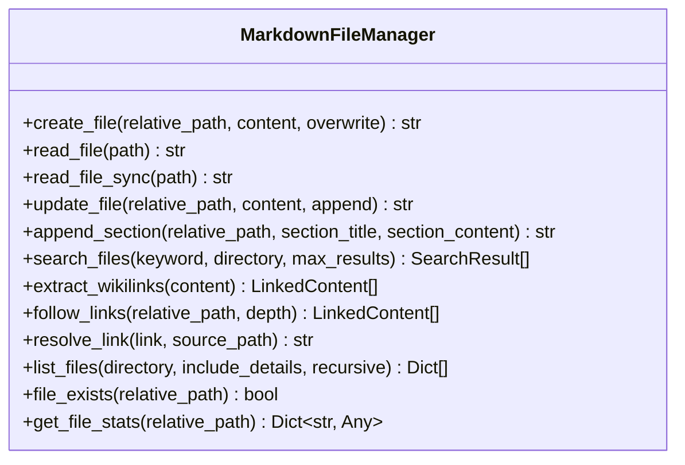
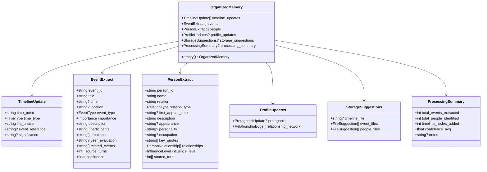
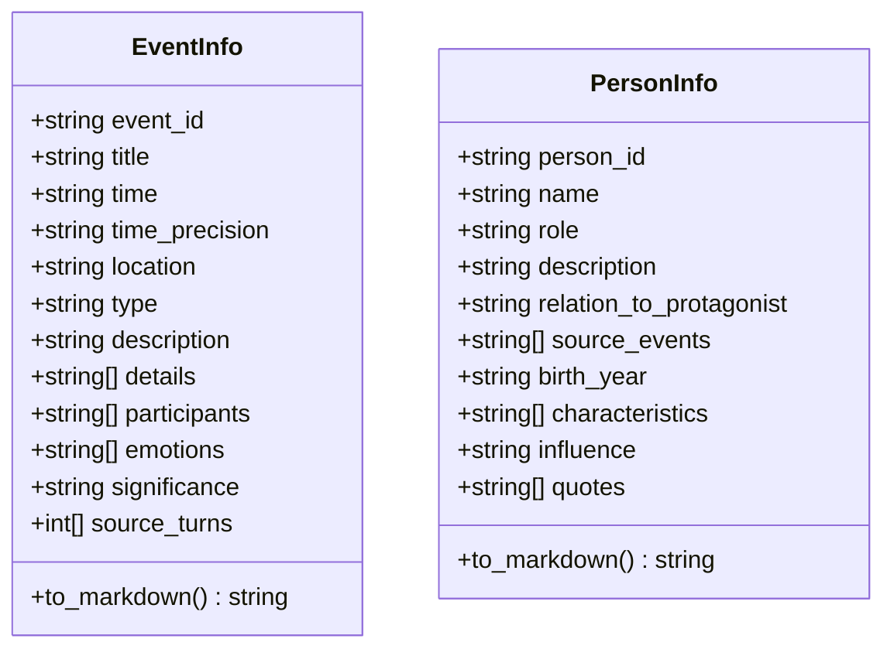
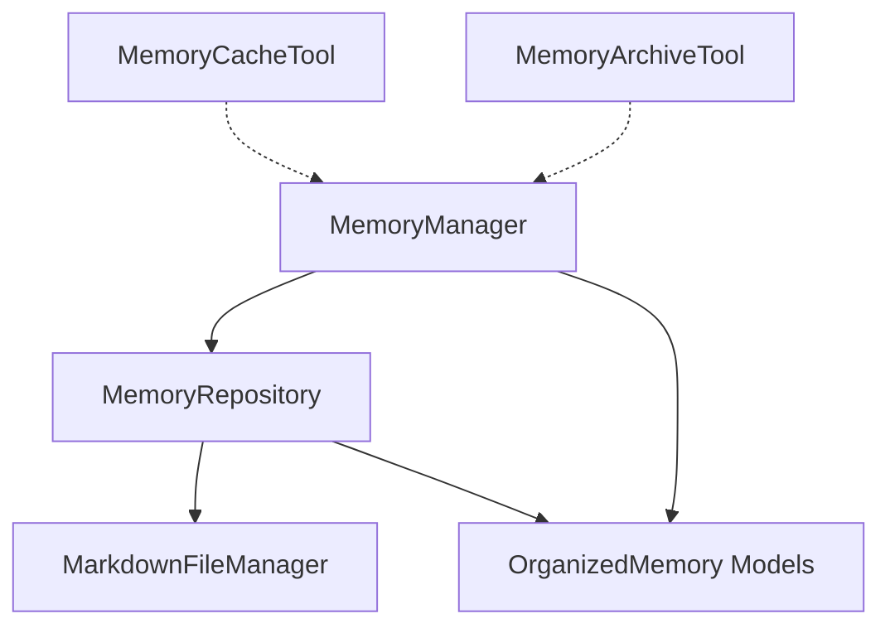

# Memory Manager

<cite>
**Referenced Files in This Document**
- [memory_manager.py](file://src/services/memory_manager.py)
- [memory_repository.py](file://src/storage/memory_repository.py)
- [markdown_file_manager.py](file://src/storage/markdown_file_manager.py)
- [organized_memory.py](file://src/models/organized_memory.py)
- [event_info.py](file://src/models/event_info.py)
- [person_info.py](file://src/models/person_info.py)
- [phase_type.py](file://src/enums/phase_type.py)
- [memory_cache_tool.py](file://src/tools/memory_cache_tool.py)
- [memory_archive_tool.py](file://src/tools/memory_archive_tool.py)
- [MemoryOrganizer-Prompt.md](file://Prompts/MemoryOrganizer-Prompt.md)
- [test_memory_manager.py](file://tests/test_memory_manager.py)
- [test_memory_repository.py](file://tests/test_memory_repository.py)
</cite>

## Table of Contents
1. [Introduction](#introduction)
2. [Project Structure](#project-structure)
3. [Core Components](#core-components)
4. [Architecture Overview](#architecture-overview)
5. [Detailed Component Analysis](#detailed-component-analysis)
6. [Dependency Analysis](#dependency-analysis)
7. [Performance Considerations](#performance-considerations)
8. [Troubleshooting Guide](#troubleshooting-guide)
9. [Conclusion](#conclusion)

## Introduction
This document provides comprehensive documentation for the MemoryManager service, which orchestrates memory operations across the system. It explains how MemoryManager coordinates between short-term memory caching, long-term persistence, and data organization. The service manages the memory lifecycle from data ingestion through processing to archival, integrates with MemoryRepository for storage operations, and works with MarkdownFileManager for file system interactions. It documents data organization patterns for events, people, and timeline structures, along with examples of memory operations, cache management strategies, and data retrieval workflows. Configuration options, performance optimization techniques, memory leak prevention, error recovery mechanisms, and consistency maintenance across storage layers are covered.

## Project Structure
The memory management system is composed of several key modules:
- MemoryManager: The orchestration service that coordinates memory operations and integrates with LLM services for structuring interview content.
- MemoryRepository: The storage layer that manages short-term, long-term, and profile memories, with LRU caching and indexing.
- MarkdownFileManager: The file system manager responsible for creating, reading, updating, and organizing Markdown files according to the knowledge base structure.
- OrganizedMemory models: Pydantic models that define the structured output schema for memory organization.
- EventInfo and PersonInfo models: Data structures representing events and people for persistence.
- PhaseType enum: Defines human life phases used for categorization.
- MemoryCacheTool: Provides session-level short-term memory caching with keyword-based retrieval and append operations.
- MemoryArchiveTool: Encapsulates archive operations for creating user knowledge bases and archiving conversations.

**Diagram sources**
- [memory_manager.py:27-470](file://src/services/memory_manager.py#L27-L470)
- [memory_repository.py:40-359](file://src/storage/memory_repository.py#L40-L359)
- [markdown_file_manager.py:31-546](file://src/storage/markdown_file_manager.py#L31-L546)
- [organized_memory.py:1-151](file://src/models/organized_memory.py#L1-L151)
- [event_info.py:5-69](file://src/models/event_info.py#L5-L69)
- [person_info.py:5-61](file://src/models/person_info.py#L5-L61)
- [phase_type.py:4-10](file://src/enums/phase_type.py#L4-L10)
- [memory_cache_tool.py:8-89](file://src/tools/memory_cache_tool.py#L8-L89)
- [memory_archive_tool.py:10-112](file://src/tools/memory_archive_tool.py#L10-L112)

**Section sources**
- [memory_manager.py:1-470](file://src/services/memory_manager.py#L1-L470)
- [memory_repository.py:1-359](file://src/storage/memory_repository.py#L1-L359)
- [markdown_file_manager.py:1-546](file://src/storage/markdown_file_manager.py#L1-L546)
- [organized_memory.py:1-151](file://src/models/organized_memory.py#L1-L151)
- [event_info.py:1-69](file://src/models/event_info.py#L1-L69)
- [person_info.py:1-61](file://src/models/person_info.py#L1-L61)
- [phase_type.py:1-10](file://src/enums/phase_type.py#L1-L10)
- [memory_cache_tool.py:1-89](file://src/tools/memory_cache_tool.py#L1-L89)
- [memory_archive_tool.py:1-112](file://src/tools/memory_archive_tool.py#L1-L112)

## Core Components
- MemoryManager: Central coordinator that formats conversation content, invokes LLM for memory organization, applies structured results to storage, and updates profile memory. It exposes APIs for short-term memory management, event querying, and session clearing.
- MemoryRepository: Manages three memory layers: short-term (in-memory), long-term (file system), and profile memory (structured). Implements LRU caching, indexing, and directory structure enforcement for knowledge base organization.
- MarkdownFileManager: Handles asynchronous file creation, reading, updating, and directory structure initialization. Provides search capabilities and wiki-link extraction/traversal.
- OrganizedMemory models: Define the schema for timeline updates, event extracts, person extracts, profile updates, storage suggestions, and processing summaries.
- EventInfo and PersonInfo: Structured representations of events and people with Markdown serialization support.
- PhaseType: Enumerates human life phases used for categorizing events and people.
- MemoryCacheTool: Provides lightweight session-level caching with tag-based retrieval and append operations.
- MemoryArchiveTool: Encapsulates knowledge base creation and conversation archiving workflows.

**Section sources**
- [memory_manager.py:27-470](file://src/services/memory_manager.py#L27-L470)
- [memory_repository.py:40-359](file://src/storage/memory_repository.py#L40-L359)
- [markdown_file_manager.py:31-546](file://src/storage/markdown_file_manager.py#L31-L546)
- [organized_memory.py:1-151](file://src/models/organized_memory.py#L1-L151)
- [event_info.py:5-69](file://src/models/event_info.py#L5-L69)
- [person_info.py:5-61](file://src/models/person_info.py#L5-L61)
- [phase_type.py:4-10](file://src/enums/phase_type.py#L4-L10)
- [memory_cache_tool.py:8-89](file://src/tools/memory_cache_tool.py#L8-L89)
- [memory_archive_tool.py:10-112](file://src/tools/memory_archive_tool.py#L10-L112)

## Architecture Overview
MemoryManager orchestrates the memory lifecycle by:
- Formatting conversation turns into a structured input for the LLM.
- Invoking the LLM with the memory organization prompt template to produce OrganizedMemory.
- Applying the OrganizedMemory to storage via MemoryRepository, saving events and people, updating timelines, and enriching profile memory.
- Managing short-term memory for session context and providing retrieval APIs.

**Diagram sources**
- [memory_manager.py:111-156](file://src/services/memory_manager.py#L111-L156)
- [memory_manager.py:158-193](file://src/services/memory_manager.py#L158-L193)
- [memory_manager.py:214-247](file://src/services/memory_manager.py#L214-L247)
- [memory_manager.py:349-395](file://src/services/memory_manager.py#L349-L395)
- [MemoryOrganizer-Prompt.md:1-773](file://Prompts/MemoryOrganizer-Prompt.md#L1-L773)
- [memory_repository.py:176-200](file://src/storage/memory_repository.py#L176-L200)
- [memory_repository.py:202-226](file://src/storage/memory_repository.py#L202-L226)
- [memory_repository.py:248-261](file://src/storage/memory_repository.py#L248-L261)

## Detailed Component Analysis

### MemoryManager
Responsibilities:
- Short-term memory management: update/get keys, add conversation turns, retrieve recent conversations.
- Long-term memory organization: format inputs, invoke LLM, apply structured results, save events/people, update timelines, and profile memory.
- Querying: retrieve events by keyword/time/type and get single event/person.
- Profile memory management: update protagonist and relationship network from organized memory.
- Batch operations: apply summary content to update short-term and long-term memories and profile.

Key methods and flows:
- organize_and_save: Formats conversation content, existing timeline, existing people, and current phase; invokes LLM with memory_organization template; applies results via _apply_organized_memory.
- _apply_organized_memory: Parallel saves for events and people; updates timeline entries; updates profile memory.
- _save_event_with_timeline_update: Saves event and updates timeline.
- _format_conversation_content/_format_existing_timeline/_format_existing_people: Prepare inputs for LLM.
- _convert_to_event_info/_convert_to_person_info: Transform extracted models to persistent models.
- update_profile/_update_profile_from_memory: Update profile memory with protagonist and relationship network.
- apply_summary: Apply summary content to short-term, long-term, and profile memory.
- clear_session: Clear short-term memory and history.

**Diagram sources**
- [memory_manager.py:27-470](file://src/services/memory_manager.py#L27-L470)

**Section sources**
- [memory_manager.py:64-105](file://src/services/memory_manager.py#L64-L105)
- [memory_manager.py:111-156](file://src/services/memory_manager.py#L111-L156)
- [memory_manager.py:158-211](file://src/services/memory_manager.py#L158-L211)
- [memory_manager.py:214-283](file://src/services/memory_manager.py#L214-L283)
- [memory_manager.py:349-423](file://src/services/memory_manager.py#L349-L423)
- [memory_manager.py:435-466](file://src/services/memory_manager.py#L435-L466)
- [memory_manager.py:468-470](file://src/services/memory_manager.py#L468-L470)

### MemoryRepository
Responsibilities:
- Short-term memory: in-memory dictionary with timestamps and bounded history list.
- Long-term memory: file-based persistence via MarkdownFileManager with directory structure enforcement.
- Profile memory: structured in-memory storage for protagonist and relationship metadata.
- Caching: LRU cache for frequently accessed events and people.
- Indexing: maintains dictionaries for quick lookup by ID.

Key methods and flows:
- update_short_term/get_short_term/add_to_history/get_history/clear_short_term: Manage session memory.
- save_event/save_person: Determine directories based on time and role; serialize to Markdown; update indices and cache.
- get_event/get_person: Check cache first, then index.
- update_timeline: Append timeline entries to life-events.md.
- query_events: Filter by keyword and type against index.
- update_profile/get_profile: Manage profile memory.
- Directory helpers: _get_phase_directory/_get_role_directory/_generate_event_filename/_sanitize_filename.

**Diagram sources**
- [memory_repository.py:40-359](file://src/storage/memory_repository.py#L40-L359)

**Section sources**
- [memory_repository.py:91-173](file://src/storage/memory_repository.py#L91-L173)
- [memory_repository.py:176-200](file://src/storage/memory_repository.py#L176-L200)
- [memory_repository.py:202-226](file://src/storage/memory_repository.py#L202-L226)
- [memory_repository.py:228-246](file://src/storage/memory_repository.py#L228-L246)
- [memory_repository.py:248-261](file://src/storage/memory_repository.py#L248-L261)
- [memory_repository.py:262-284](file://src/storage/memory_repository.py#L262-L284)
- [memory_repository.py:288-298](file://src/storage/memory_repository.py#L288-L298)
- [memory_repository.py:300-306](file://src/storage/memory_repository.py#L300-L306)
- [memory_repository.py:310-359](file://src/storage/memory_repository.py#L310-L359)

### MarkdownFileManager
Responsibilities:
- Ensure directory structure for knowledge base.
- Asynchronous file operations: create, read, update, append sections.
- Search across Markdown files with relevance scoring.
- Wiki-link extraction and traversal with depth control.
- Listing files with optional details and statistics.

Key methods and flows:
- _ensure_directory_structure/_create_index_file: Initialize knowledge base layout.
- create_file/read_file/update_file/append_section: Manage file content.
- search_files: Full-text search with context and relevance.
- extract_wikilinks/follow_links: Parse and traverse wiki-links.
- resolve_link: Resolve links to absolute paths.
- list_files/file_exists/get_file_stats: Utility operations.

**Diagram sources**
- [markdown_file_manager.py:31-546](file://src/storage/markdown_file_manager.py#L31-L546)

**Section sources**
- [markdown_file_manager.py:80-131](file://src/storage/markdown_file_manager.py#L80-L131)
- [markdown_file_manager.py:134-169](file://src/storage/markdown_file_manager.py#L134-L169)
- [markdown_file_manager.py:171-229](file://src/storage/markdown_file_manager.py#L171-L229)
- [markdown_file_manager.py:231-261](file://src/storage/markdown_file_manager.py#L231-L261)
- [markdown_file_manager.py:285-334](file://src/storage/markdown_file_manager.py#L285-L334)
- [markdown_file_manager.py:358-430](file://src/storage/markdown_file_manager.py#L358-L430)
- [markdown_file_manager.py:475-528](file://src/storage/markdown_file_manager.py#L475-L528)

### OrganizedMemory Models
Defines the schema for structured memory organization:
- TimelineUpdate: Timepoint, time type, life phase, event reference, significance.
- EventExtract: Event identification, title, time/location, type/importance, description, participants, emotions, user evaluation, related events, source turns, confidence.
- PersonExtract: Person identification, name, relation, relation type, first appear time, description, appearance, personality, occupation, key quotes, relationships, influence level, source turns.
- ProfileUpdates: Protagonist updates and relationship network edges.
- StorageSuggestions and ProcessingSummary: Suggested storage paths and processing metrics.
- OrganizedMemory: Aggregates timeline updates, events, people, profile updates, storage suggestions, and processing summary.

**Diagram sources**
- [organized_memory.py:49-151](file://src/models/organized_memory.py#L49-L151)

**Section sources**
- [organized_memory.py:49-151](file://src/models/organized_memory.py#L49-L151)

### EventInfo and PersonInfo
Representations for persisted events and people:
- EventInfo: Event identity, title, time precision, location, type, description, details, participants, emotions, significance, source turns; to_markdown serialization.
- PersonInfo: Person identity, name, role, description, relation to protagonist, source events, optional characteristics/influence/quotes; to_markdown serialization.

**Diagram sources**
- [event_info.py:5-69](file://src/models/event_info.py#L5-L69)
- [person_info.py:5-61](file://src/models/person_info.py#L5-L61)

**Section sources**
- [event_info.py:5-69](file://src/models/event_info.py#L5-L69)
- [person_info.py:5-61](file://src/models/person_info.py#L5-L61)

### PhaseType
Enumerates human life phases used for categorization:
- CHILDHOOD, YOUTH, YOUNG_ADULT, MIDDLE_AGE, ELDERLY.

**Section sources**
- [phase_type.py:4-10](file://src/enums/phase_type.py#L4-L10)

### MemoryCacheTool
Provides session-level short-term memory caching:
- get_cache: Retrieve cached content by tag intersection.
- append_cache: Append new content with tags and timestamp.
- clear_cache: Clear cache for a session.

**Section sources**
- [memory_cache_tool.py:8-89](file://src/tools/memory_cache_tool.py#L8-L89)

### MemoryArchiveTool
Encapsulates archive operations:
- create_user_knowledge_base: Save profile info to profile memory and convert conversation history to short-term memory.
- archive_conversation: Save session summary, transform conversation history to ConversationTurn objects, and call MemoryManager.organize_and_save; fallback to short-term memory on failure.

**Section sources**
- [memory_archive_tool.py:10-112](file://src/tools/memory_archive_tool.py#L10-L112)

## Dependency Analysis
- MemoryManager depends on MemoryRepository for storage operations and LLMService for memory organization.
- MemoryRepository depends on MarkdownFileManager for file system operations and on OrganizedMemory models for data structures.
- MarkdownFileManager depends on Python standard libraries for file operations and regex parsing.
- OrganizedMemory models are consumed by MemoryManager and MemoryRepository.
- MemoryCacheTool is independent and complements MemoryManager’s short-term memory.
- MemoryArchiveTool depends on MemoryManager for orchestration.

**Diagram sources**
- [memory_manager.py:5-12](file://src/services/memory_manager.py#L5-L12)
- [memory_repository.py:8-11](file://src/storage/memory_repository.py#L8-L11)
- [organized_memory.py:1-11](file://src/models/organized_memory.py#L1-L11)
- [memory_cache_tool.py:1-5](file://src/tools/memory_cache_tool.py#L1-L5)
- [memory_archive_tool.py:4-5](file://src/tools/memory_archive_tool.py#L4-L5)

**Section sources**
- [memory_manager.py:5-12](file://src/services/memory_manager.py#L5-L12)
- [memory_repository.py:8-11](file://src/storage/memory_repository.py#L8-L11)
- [organized_memory.py:1-11](file://src/models/organized_memory.py#L1-L11)
- [memory_cache_tool.py:1-5](file://src/tools/memory_cache_tool.py#L1-L5)
- [memory_archive_tool.py:4-5](file://src/tools/memory_archive_tool.py#L4-L5)

## Performance Considerations
- Asynchronous operations: MemoryManager and MemoryRepository use async/await for file I/O and LLM invocation to improve throughput.
- Parallelism: _apply_organized_memory uses asyncio.gather to save events and people concurrently.
- Caching: LRUCache in MemoryRepository reduces repeated file reads and improves retrieval performance.
- Capacity limits: Short-term memory history capacity prevents unbounded growth; cache capacity bounds memory usage.
- Directory structure: MarkdownFileManager ensures directories exist to avoid expensive checks during file operations.
- Search relevance: MarkdownFileManager.search_files computes relevance scores to prioritize meaningful results.

[No sources needed since this section provides general guidance]

## Troubleshooting Guide
Common issues and resolutions:
- LLM organization failure: MemoryManager logs errors when LLM returns None and returns an empty OrganizedMemory. Verify prompt template availability and model configuration.
- File not found errors: MarkdownFileManager.read_file raises FileNotFoundError; ensure paths are correct and directories are initialized.
- Conversation record retrieval: MemoryRepository.get_latest_conversation_records handles missing files gracefully and returns empty lists.
- Cache exceptions: MemoryManager._apply_organized_memory catches exceptions during concurrent saves and logs failures while continuing.
- Profile updates: MemoryManager._update_profile_from_memory safely merges sets for key life events, personality traits, and values hints.

**Section sources**
- [memory_manager.py:147-150](file://src/services/memory_manager.py#L147-L150)
- [markdown_file_manager.py:188-189](file://src/storage/markdown_file_manager.py#L188-L189)
- [memory_repository.py:159-161](file://src/storage/memory_repository.py#L159-L161)
- [memory_manager.py:184-186](file://src/services/memory_manager.py#L184-L186)
- [memory_manager.py:367-378](file://src/services/memory_manager.py#L367-L378)

## Conclusion
MemoryManager serves as the central orchestrator for memory operations, integrating LLM-driven organization with robust storage and retrieval mechanisms. It manages short-term, long-term, and profile memories, organizes data into structured schemas, and maintains consistency across file-based and in-memory layers. The system’s design emphasizes asynchronous processing, caching, and modular components, enabling scalable and maintainable memory management for interview-based knowledge construction.