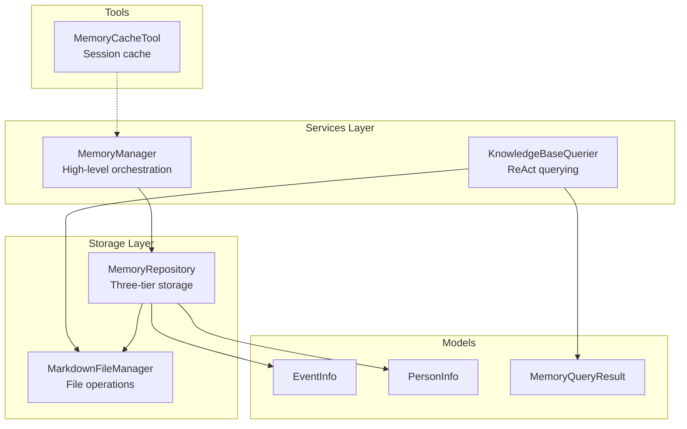
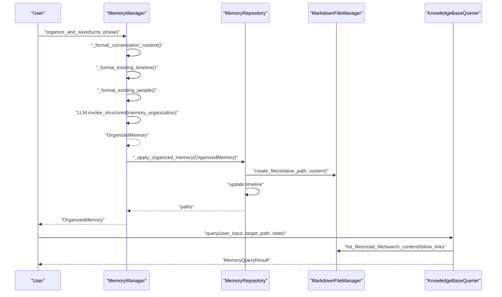
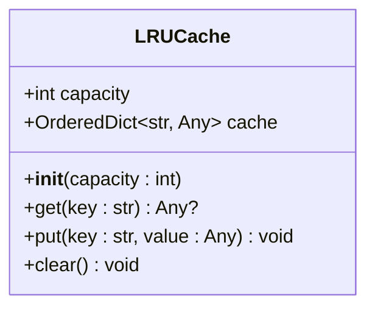
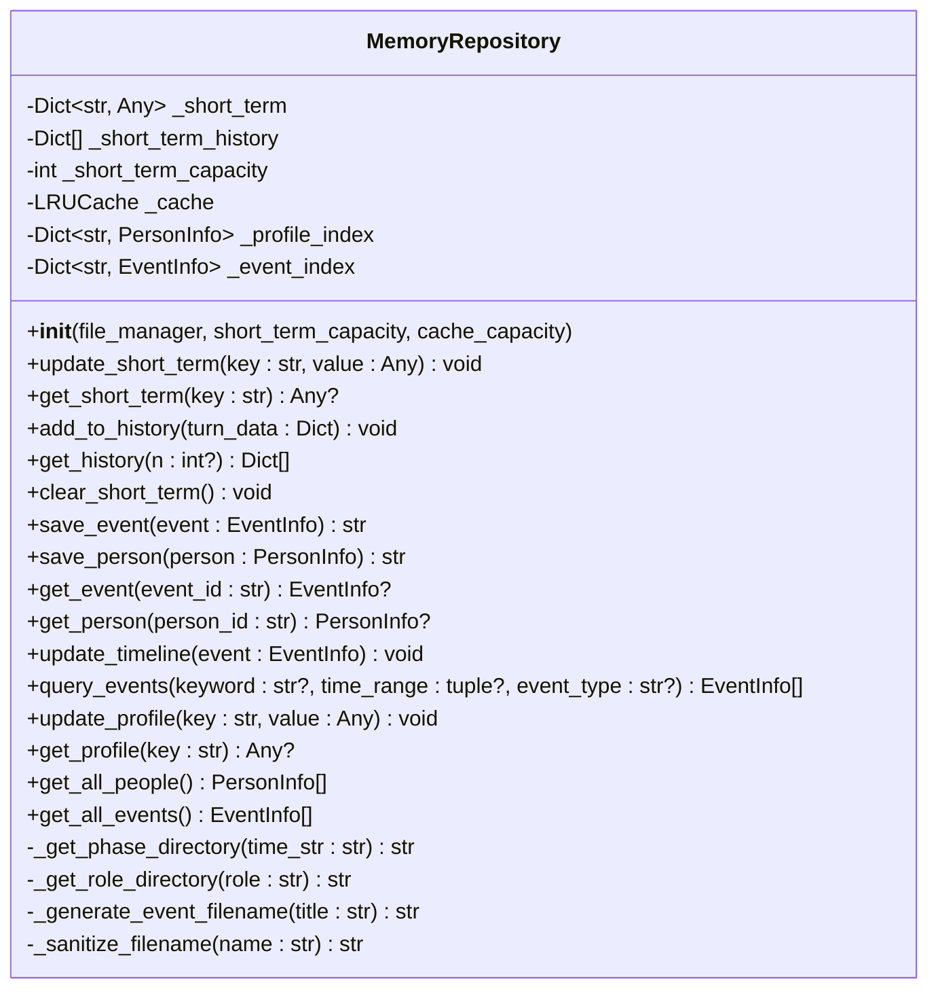
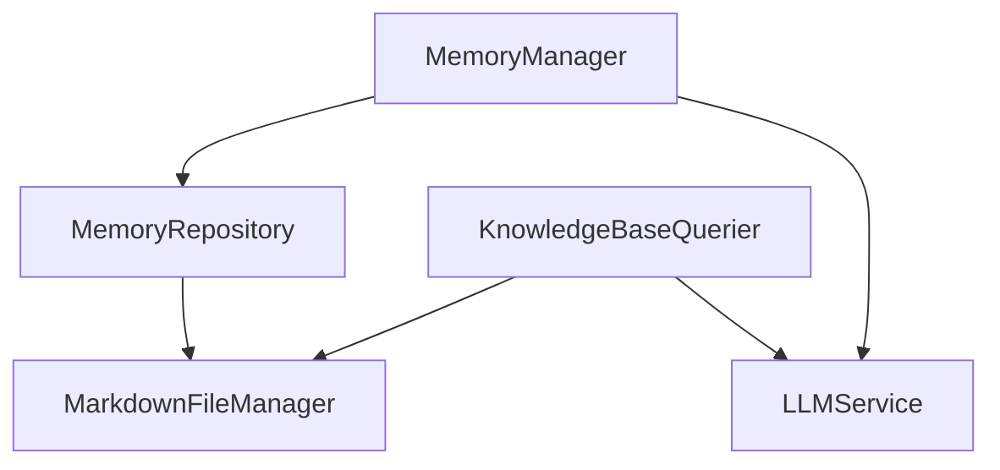

# Memory Repository

<cite>
**Referenced Files in This Document**
- [memory_repository.py](file://src/storage/memory_repository.py)
- [markdown_file_manager.py](file://src/storage/markdown_file_manager.py)
- [memory_manager.py](file://src/services/memory_manager.py)
- [knowledge_base_querier.py](file://src/services/knowledge_base_querier.py)
- [memory_cache_tool.py](file://src/tools/memory_cache_tool.py)
- [event_info.py](file://src/models/event_info.py)
- [person_info.py](file://src/models/person_info.py)
- [memory_query_result.py](file://src/models/memory_query_result.py)
- [test_memory_repository.py](file://tests/test_memory_repository.py)
- [demo_memory_storage.py](file://demo_memory_storage.py)
- [MEMORY_INTERACTION_GUIDE.md](file://MEMORY_INTERACTION_GUIDE.md)
- [MemoryOrganizer-Prompt.md](file://Prompts/MemoryOrganizer-Prompt.md)
</cite>

## Table of Contents
1. [Introduction](#introduction)
2. [Project Structure](#project-structure)
3. [Core Components](#core-components)
4. [Architecture Overview](#architecture-overview)
5. [Detailed Component Analysis](#detailed-component-analysis)
6. [Dependency Analysis](#dependency-analysis)
7. [Performance Considerations](#performance-considerations)
8. [Troubleshooting Guide](#troubleshooting-guide)
9. [Conclusion](#conclusion)
10. [Appendices](#appendices)

## Introduction
This document provides comprehensive documentation for the MemoryRepository class, the core storage component of the memory management system. It explains the three-tiered storage architecture:
- Short-term memory (in-memory)
- Cache memory (LRU-based)
- Long-term persistence (file system)

It details the LRUCache implementation with capacity management and eviction policies, documents storage methods for events and persons, and describes the indexing system for profile and event lookup, timeline updates, and query capabilities. It also covers configuration options, thread safety considerations, error handling, and integration with other system components.

## Project Structure
The memory management system is composed of several modules:
- Storage layer: MemoryRepository and MarkdownFileManager
- Services layer: MemoryManager and KnowledgeBaseQuerier
- Tools: MemoryCacheTool
- Models: EventInfo, PersonInfo, MemoryQueryResult
- Tests and demos: test_memory_repository.py, demo_memory_storage.py, MEMORY_INTERACTION_GUIDE.md

**Diagram sources**
- [memory_repository.py:40-359](file://src/storage/memory_repository.py#L40-L359)
- [markdown_file_manager.py:31-546](file://src/storage/markdown_file_manager.py#L31-L546)
- [memory_manager.py:27-470](file://src/services/memory_manager.py#L27-L470)
- [knowledge_base_querier.py:202-540](file://src/services/knowledge_base_querier.py#L202-L540)
- [memory_cache_tool.py:8-89](file://src/tools/memory_cache_tool.py#L8-L89)
- [event_info.py:5-69](file://src/models/event_info.py#L5-L69)
- [person_info.py:5-61](file://src/models/person_info.py#L5-L61)
- [memory_query_result.py:23-81](file://src/models/memory_query_result.py#L23-L81)

**Section sources**
- [memory_repository.py:1-359](file://src/storage/memory_repository.py#L1-L359)
- [markdown_file_manager.py:1-546](file://src/storage/markdown_file_manager.py#L1-L546)
- [memory_manager.py:1-470](file://src/services/memory_manager.py#L1-L470)
- [knowledge_base_querier.py:1-540](file://src/services/knowledge_base_querier.py#L1-L540)
- [memory_cache_tool.py:1-89](file://src/tools/memory_cache_tool.py#L1-L89)
- [event_info.py:1-69](file://src/models/event_info.py#L1-L69)
- [person_info.py:1-61](file://src/models/person_info.py#L1-L61)
- [memory_query_result.py:1-81](file://src/models/memory_query_result.py#L1-L81)

## Core Components
- MemoryRepository: Central storage manager implementing three-tier memory architecture, LRU caching, and file-based persistence.
- LRUCache: Lightweight LRU cache with ordered dictionary and capacity-based eviction.
- MarkdownFileManager: File system abstraction for creating, reading, updating, and searching Markdown files.
- MemoryManager: High-level service orchestrating memory organization and storage via LLM templates.
- KnowledgeBaseQuerier: ReAct-based querying service leveraging MarkdownFileManager and LLMService.
- MemoryCacheTool: Optional session-level cache for short-term content with tag-based retrieval.

Key responsibilities:
- MemoryRepository manages short-term memory (dict + history), cache (LRU), and long-term persistence (Markdown files).
- It indexes events and persons for fast lookup and maintains timeline entries.
- MemoryManager coordinates LLM-driven extraction and storage.
- KnowledgeBaseQuerier provides intelligent querying with ReAct loop and tool usage.

**Section sources**
- [memory_repository.py:40-359](file://src/storage/memory_repository.py#L40-L359)
- [markdown_file_manager.py:31-546](file://src/storage/markdown_file_manager.py#L31-L546)
- [memory_manager.py:27-470](file://src/services/memory_manager.py#L27-L470)
- [knowledge_base_querier.py:202-540](file://src/services/knowledge_base_querier.py#L202-L540)
- [memory_cache_tool.py:8-89](file://src/tools/memory_cache_tool.py#L8-L89)

## Architecture Overview
The system follows a layered architecture:
- Presentation/Orchestration: MemoryManager
- Storage: MemoryRepository + MarkdownFileManager
- Querying: KnowledgeBaseQuerier
- Models: EventInfo, PersonInfo, MemoryQueryResult
- Optional: MemoryCacheTool

**Diagram sources**
- [memory_manager.py:111-156](file://src/services/memory_manager.py#L111-L156)
- [memory_repository.py:158-193](file://src/storage/memory_repository.py#L158-L193)
- [markdown_file_manager.py:134-261](file://src/storage/markdown_file_manager.py#L134-L261)
- [knowledge_base_querier.py:257-373](file://src/services/knowledge_base_querier.py#L257-L373)

## Detailed Component Analysis

### MemoryRepository
MemoryRepository is the central storage component implementing three-tier memory architecture:
- Short-term memory: In-memory dict with timestamped entries and bounded history.
- Cache memory: LRU-based cache for frequent lookups.
- Long-term persistence: File system storage via MarkdownFileManager.

Key methods and responsibilities:
- Short-term memory: update_short_term, get_short_term, add_to_history, get_history, clear_short_term.
- Long-term persistence: save_event, save_person, get_event, get_person, update_timeline, query_events.
- Indexing: _event_index, _profile_index for O(1) lookup.
- Utility helpers: _get_phase_directory, _get_role_directory, _generate_event_filename, _sanitize_filename.

LRUCache implementation:
- Capacity-managed cache using OrderedDict to maintain insertion order.
- Evicts least recently used item when capacity exceeded.
- Provides get, put, and clear operations.

Storage methods:
- save_event: Determines phase directory, generates filename, writes Markdown, updates indices and cache.
- save_person: Handles protagonist vs. other roles, determines role directory, writes Markdown, updates indices and cache.
- get_event/get_person: First checks cache, then falls back to in-memory index.
- update_timeline: Appends timeline entry to timeline/life-events.md.
- query_events: Filters events by keyword and type against in-memory index.

Indexing system:
- _event_index: Maps event_id to EventInfo.
- _profile_index: Maps person_id to PersonInfo.
- Cache: Maps "event:{id}" and "person:{id}" to respective objects.

Directory structure organization:
- Events: events/{childhood|youth|middle_age|elderly}/{title}.md
- People: people/{family|friends|colleagues|others|protagonist}.md
- Timeline: timeline/life-events.md
- Themes: themes/

Timeline updates:
- update_timeline appends a new entry linking to the event file.

Query capabilities:
- query_events filters by keyword and type against in-memory index.

Configuration options:
- short_term_capacity: Controls bounded history length.
- cache_capacity: Controls LRU cache size.
- file_manager: Injected MarkdownFileManager for persistence.

Thread safety:
- Current implementation is not thread-safe. Concurrent access to shared mutable state (dicts, lists, cache) requires synchronization.

Error handling:
- Logging for failures during conversation record retrieval.
- Validation for person_id presence in save_person.
- Graceful handling of missing files in knowledge base queries.

Integration:
- Uses MarkdownFileManager for file operations.
- Uses KnowledgeBaseQuerier for knowledge base queries.
- Uses LLMService via KnowledgeBaseQuerier for ReAct querying.

**Section sources**
- [memory_repository.py:40-359](file://src/storage/memory_repository.py#L40-L359)
- [markdown_file_manager.py:31-546](file://src/storage/markdown_file_manager.py#L31-L546)
- [memory_manager.py:27-470](file://src/services/memory_manager.py#L27-L470)
- [knowledge_base_querier.py:202-540](file://src/services/knowledge_base_querier.py#L202-L540)
- [event_info.py:5-69](file://src/models/event_info.py#L5-L69)
- [person_info.py:5-61](file://src/models/person_info.py#L5-L61)

#### LRUCache Implementation

**Diagram sources**
- [memory_repository.py:16-38](file://src/storage/memory_repository.py#L16-L38)

**Section sources**
- [memory_repository.py:16-38](file://src/storage/memory_repository.py#L16-L38)

#### MemoryRepository Class

**Diagram sources**
- [memory_repository.py:40-359](file://src/storage/memory_repository.py#L40-L359)

**Section sources**
- [memory_repository.py:40-359](file://src/storage/memory_repository.py#L40-L359)

### MarkdownFileManager
MarkdownFileManager provides asynchronous and synchronous file operations:
- Directory creation and index file generation.
- File creation, reading, updating, and appending.
- Search functionality with relevance scoring.
- Wiki link extraction and following.
- Listing files with details and statistics.

Key methods:
- create_file, read_file, read_file_sync, update_file, append_section.
- search_files with relevance calculation.
- extract_wikilinks, follow_links, resolve_link.
- list_files, file_exists, get_file_stats.

**Section sources**
- [markdown_file_manager.py:31-546](file://src/storage/markdown_file_manager.py#L31-L546)

### MemoryManager
MemoryManager orchestrates memory organization and storage:
- Formats conversation content and existing timeline/people.
- Invokes LLM with memory_organization template to produce OrganizedMemory.
- Applies organized memory by saving events and people, updating timeline, and updating profile.
- Provides query and retrieval methods for events and people.

**Section sources**
- [memory_manager.py:27-470](file://src/services/memory_manager.py#L27-L470)
- [MemoryOrganizer-Prompt.md:1-773](file://Prompts/MemoryOrganizer-Prompt.md#L1-L773)

### KnowledgeBaseQuerier
KnowledgeBaseQuerier implements a ReAct-style agent:
- Builds tools for file system operations.
- Executes agent loop with thought-action-observation until final answer.
- Parses final answer and constructs MemoryQueryResult.
- Integrates with MarkdownFileManager for file operations.

**Section sources**
- [knowledge_base_querier.py:202-540](file://src/services/knowledge_base_querier.py#L202-L540)
- [memory_query_result.py:23-81](file://src/models/memory_query_result.py#L23-L81)

### MemoryCacheTool
MemoryCacheTool provides session-level caching:
- Stores content with tags and timestamps.
- Retrieves content based on tag intersection.
- Supports clearing cache per session.

**Section sources**
- [memory_cache_tool.py:8-89](file://src/tools/memory_cache_tool.py#L8-L89)

## Dependency Analysis
MemoryRepository depends on:
- MarkdownFileManager for file operations.
- KnowledgeBaseQuerier for knowledge base queries.
- LLMService via KnowledgeBaseQuerier for ReAct querying.
- EventInfo and PersonInfo models for structured storage.

MemoryManager depends on:
- MemoryRepository for storage.
- LLMService for memory organization.

KnowledgeBaseQuerier depends on:
- MarkdownFileManager for file operations.
- LLMService for ReAct agent.

**Diagram sources**
- [memory_repository.py:84-87](file://src/storage/memory_repository.py#L84-L87)
- [memory_manager.py:59-60](file://src/services/memory_manager.py#L59-L60)
- [knowledge_base_querier.py:232-234](file://src/services/knowledge_base_querier.py#L232-L234)

**Section sources**
- [memory_repository.py:84-87](file://src/storage/memory_repository.py#L84-L87)
- [memory_manager.py:59-60](file://src/services/memory_manager.py#L59-L60)
- [knowledge_base_querier.py:232-234](file://src/services/knowledge_base_querier.py#L232-L234)

## Performance Considerations
- Short-term memory: O(1) updates and lookups; bounded by short_term_capacity.
- Cache: O(1) average-time get/put with LRU eviction.
- File I/O: Asynchronous operations reduce blocking; ensure adequate disk throughput.
- Indexing: In-memory dicts provide O(1) lookup for events and persons.
- Querying: query_events scans in-memory index; consider adding database-backed search for large datasets.
- Concurrency: Not thread-safe; use locks or separate instances per thread.

[No sources needed since this section provides general guidance]

## Troubleshooting Guide
Common issues and resolutions:
- Missing person_id in save_person: Raises ValueError; ensure person has a valid ID.
- Conversation record retrieval errors: Logged; verify user_id and directory structure.
- File not found during read_file: Raises FileNotFoundError; verify file path.
- LLM invocation failures: MemoryManager logs error and returns empty OrganizedMemory.
- Cache capacity exceeded: LRU eviction removes least recently used items.

Validation and testing:
- Unit tests cover LRUCache behavior, event/person storage, timeline updates, short-term memory, and query filtering.
- Demo script demonstrates storage of protagonist, family members, events, and timeline updates.

**Section sources**
- [memory_repository.py:204-205](file://src/storage/memory_repository.py#L204-L205)
- [memory_repository.py:159-161](file://src/storage/memory_repository.py#L159-L161)
- [markdown_file_manager.py:188-189](file://src/storage/markdown_file_manager.py#L188-L189)
- [memory_manager.py:147-149](file://src/services/memory_manager.py#L147-L149)
- [test_memory_repository.py:1-325](file://tests/test_memory_repository.py#L1-L325)
- [demo_memory_storage.py:1-118](file://demo_memory_storage.py#L1-L118)

## Conclusion
MemoryRepository provides a robust, layered memory storage system integrating short-term, cache, and long-term persistence. Its design supports efficient lookups, scalable file-based storage, and seamless integration with higher-level services for memory organization and knowledge base querying. While current implementations are not thread-safe, they offer clear extension points for concurrency and performance enhancements.

[No sources needed since this section summarizes without analyzing specific files]

## Appendices

### Configuration Options
- MemoryRepository constructor parameters:
  - file_manager: MarkdownFileManager instance for persistence.
  - short_term_capacity: Integer controlling bounded history length.
  - cache_capacity: Integer controlling LRU cache size.
- Directory structure:
  - events/{childhood|youth|middle_age|elderly}/title.md
  - people/{family|friends|colleagues|others|protagonist}.md
  - timeline/life-events.md
  - themes/

**Section sources**
- [memory_repository.py:54-87](file://src/storage/memory_repository.py#L54-L87)
- [markdown_file_manager.py:80-131](file://src/storage/markdown_file_manager.py#L80-L131)

### Data Retrieval Patterns
- Get latest conversation records: get_latest_conversation_records(user_id, n?)
- Retrieve events by keyword/type: query_events(keyword?, event_type?)
- Get single event/person: get_event(event_id), get_person(person_id)
- Get all people/events: get_all_people(), get_all_events()

**Section sources**
- [memory_repository.py:111-167](file://src/storage/memory_repository.py#L111-L167)
- [memory_repository.py:228-246](file://src/storage/memory_repository.py#L228-L246)
- [memory_repository.py:300-306](file://src/storage/memory_repository.py#L300-L306)

### Integration Examples
- MemoryManager organizes and saves memory via LLM templates.
- KnowledgeBaseQuerier performs ReAct-based queries using MarkdownFileManager.
- Demo script shows end-to-end storage of protagonist, family, events, and timeline.

**Section sources**
- [memory_manager.py:111-156](file://src/services/memory_manager.py#L111-L156)
- [knowledge_base_querier.py:257-373](file://src/services/knowledge_base_querier.py#L257-L373)
- [demo_memory_storage.py:16-118](file://demo_memory_storage.py#L16-L118)
- [MEMORY_INTERACTION_GUIDE.md:1-172](file://MEMORY_INTERACTION_GUIDE.md#L1-L172)