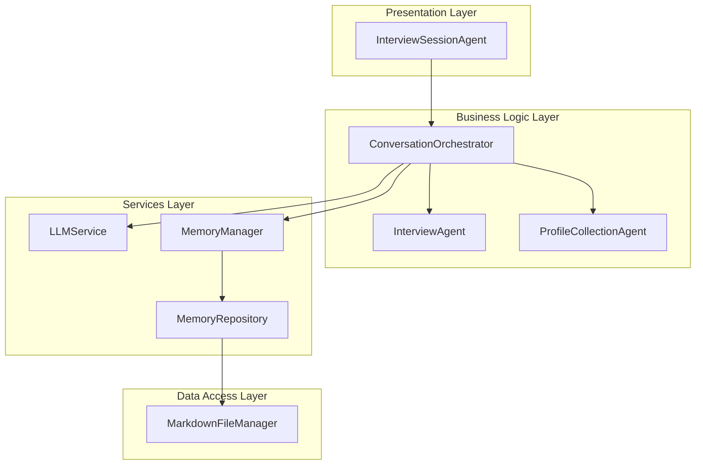
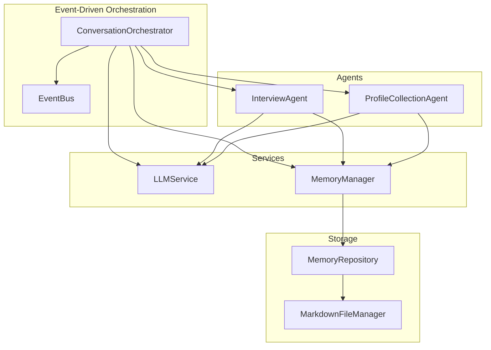
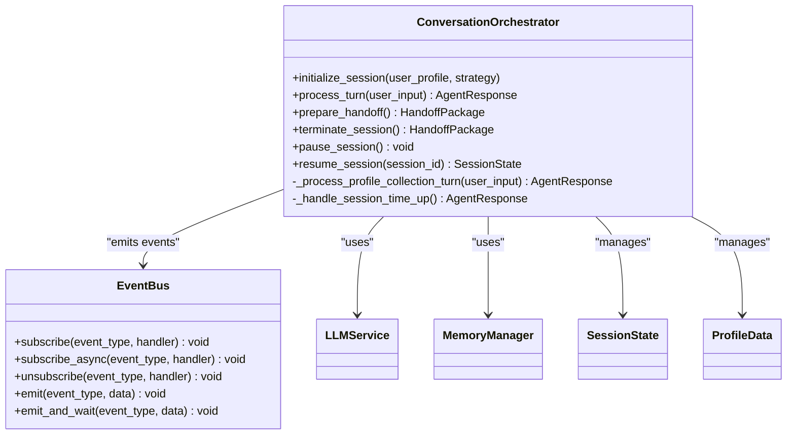
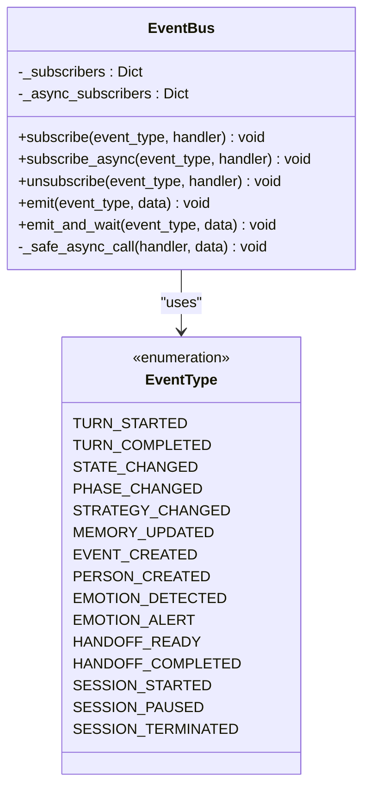
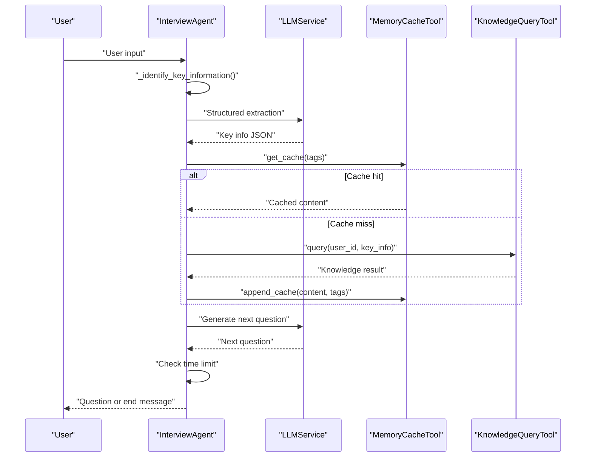
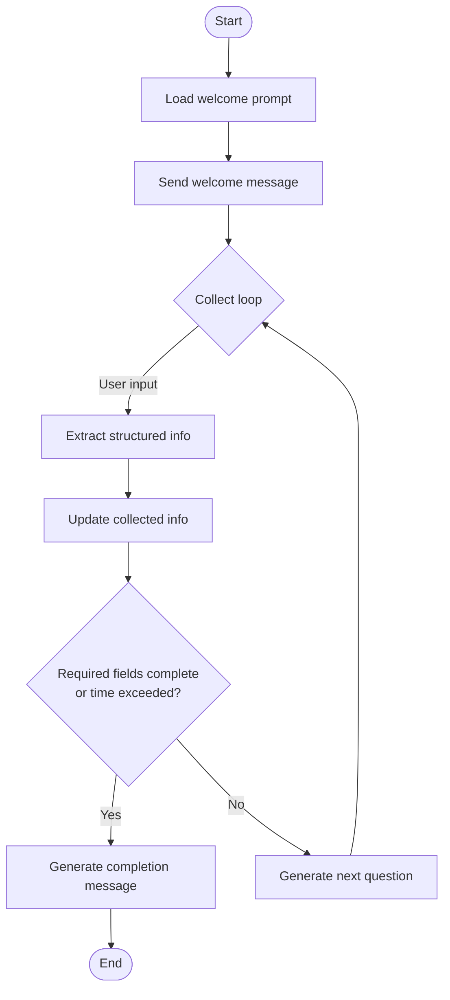
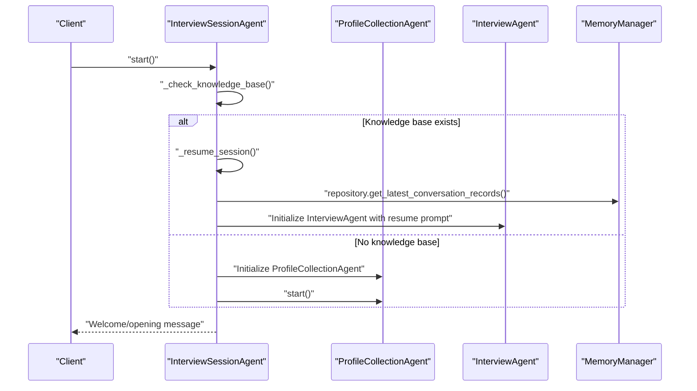
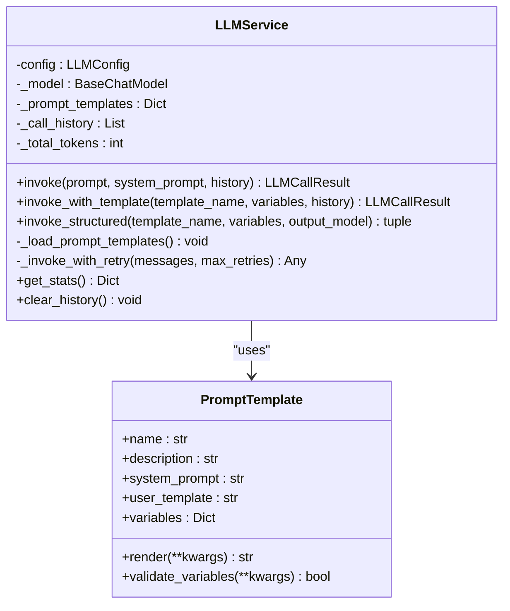
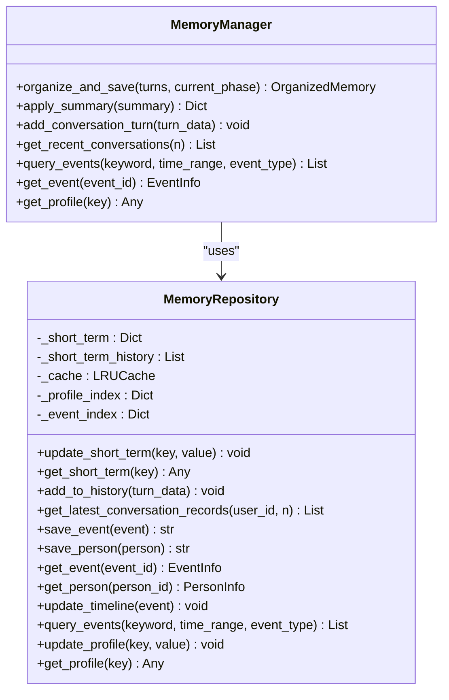
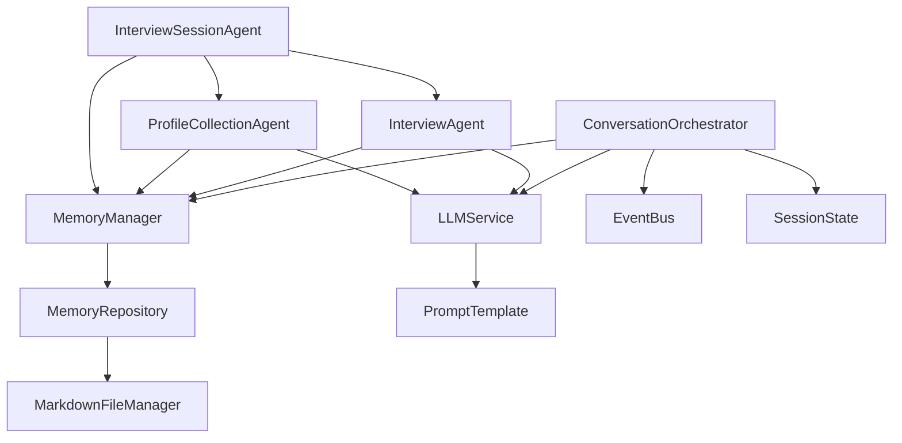

# Architecture Overview

<cite>
**Referenced Files in This Document**
- [conversation_orchestrator.py](file://src/core/conversation_orchestrator.py)
- [event_bus.py](file://src/core/event_bus.py)
- [interview_agent.py](file://src/agents/interview_agent.py)
- [profile_collection_agent.py](file://src/agents/profile_collection_agent.py)
- [interview_session_agent.py](file://src/agents/interview_session_agent.py)
- [llm_service.py](file://src/services/llm_service.py)
- [memory_manager.py](file://src/services/memory_manager.py)
- [memory_repository.py](file://src/storage/memory_repository.py)
- [session_state.py](file://src/models/session_state.py)
- [state_type.py](file://src/enums/state_type.py)
- [strategy_type.py](file://src/enums/strategy_type.py)
- [memory_cache_tool.py](file://src/tools/memory_cache_tool.py)
- [knowledge_query_tool.py](file://src/tools/knowledge_query_tool.py)
- [base.py](file://src/prompts/base.py)
</cite>

## Table of Contents
1. [Introduction](#introduction)
2. [Project Structure](#project-structure)
3. [Core Components](#core-components)
4. [Architecture Overview](#architecture-overview)
5. [Detailed Component Analysis](#detailed-component-analysis)
6. [Dependency Analysis](#dependency-analysis)
7. [Performance Considerations](#performance-considerations)
8. [Troubleshooting Guide](#troubleshooting-guide)
9. [Conclusion](#conclusion)

## Introduction
This document describes the high-level system architecture for a LangGraph agent orchestration platform designed for elderly autobiographical interviews. The system centers around a multi-agent architecture coordinated by a ConversationOrchestrator that manages lifecycle, state, and cross-agent communication. It employs an event-driven architecture using an EventBus for decoupled component interactions and follows a layered pattern separating presentation, business logic, services, and data access. The design incorporates several key patterns: Observer for event handling, Factory for dynamic model instantiation, and Strategy for conversation management.

## Project Structure
The project is organized into distinct layers and functional domains:
- Core: Central coordination and event bus
- Agents: Domain-specific agents for interview orchestration and user initialization
- Services: Business logic services for LLM orchestration, memory management, and knowledge base operations
- Storage: Data access layer for memory repository and file management
- Tools: Utility tools for caching and knowledge querying
- Models and Enums: Data structures and enumerations for state and strategy
- Prompts: Prompt templates and base prompt management

**Diagram sources**
- [conversation_orchestrator.py:138-401](file://src/core/conversation_orchestrator.py#L138-L401)
- [interview_session_agent.py:33-130](file://src/agents/interview_session_agent.py#L33-L130)
- [interview_agent.py:16-114](file://src/agents/interview_agent.py#L16-L114)
- [profile_collection_agent.py:14-98](file://src/agents/profile_collection_agent.py#L14-L98)
- [llm_service.py:32-89](file://src/services/llm_service.py#L32-L89)
- [memory_manager.py:27-61](file://src/services/memory_manager.py#L27-L61)
- [memory_repository.py:40-88](file://src/storage/memory_repository.py#L40-L88)

**Section sources**
- [conversation_orchestrator.py:138-401](file://src/core/conversation_orchestrator.py#L138-L401)
- [interview_session_agent.py:33-130](file://src/agents/interview_session_agent.py#L33-L130)

## Core Components
- ConversationOrchestrator: Central coordinator managing session lifecycle, state transitions, parallel processing of emotion detection and knowledge queries, and event emission.
- EventBus: Publish-subscribe mechanism enabling decoupled inter-component communication and asynchronous event handling.
- InterviewAgent: Time-driven interview agent responsible for question generation, knowledge base querying, and conversation continuation.
- ProfileCollectionAgent: Initializes user profiles by collecting essential information through guided questioning.
- InterviewSessionAgent: Top-level orchestrator that determines whether to resume an existing session or start profile collection, and coordinates agent transitions.
- LLMService: Unified interface for large language model interactions, templating, structured outputs, and retry logic.
- MemoryManager: High-level memory service coordinating LLM-based organization and persistence of conversations into structured memories.
- MemoryRepository: Low-level storage abstraction managing short-term, long-term, and profile memories with caching and indexing.
- Tools: MemoryCacheTool and KnowledgeQueryTool provide caching and knowledge base query capabilities.
- Models and Enums: SessionState, StateType, StrategyType, and related models define the runtime state and conversation metadata.

**Section sources**
- [conversation_orchestrator.py:138-401](file://src/core/conversation_orchestrator.py#L138-L401)
- [event_bus.py:40-182](file://src/core/event_bus.py#L40-L182)
- [interview_agent.py:16-114](file://src/agents/interview_agent.py#L16-L114)
- [profile_collection_agent.py:14-98](file://src/agents/profile_collection_agent.py#L14-L98)
- [interview_session_agent.py:33-130](file://src/agents/interview_session_agent.py#L33-L130)
- [llm_service.py:32-89](file://src/services/llm_service.py#L32-L89)
- [memory_manager.py:27-61](file://src/services/memory_manager.py#L27-L61)
- [memory_repository.py:40-88](file://src/storage/memory_repository.py#L40-L88)
- [session_state.py:24-139](file://src/models/session_state.py#L24-L139)
- [state_type.py:4-12](file://src/enums/state_type.py#L4-L12)
- [strategy_type.py:4-8](file://src/enums/strategy_type.py#L4-L8)
- [memory_cache_tool.py:8-33](file://src/tools/memory_cache_tool.py#L8-L33)
- [knowledge_query_tool.py:11-32](file://src/tools/knowledge_query_tool.py#L11-L32)
- [base.py:6-33](file://src/prompts/base.py#L6-L33)

## Architecture Overview
The system follows a layered architecture:
- Presentation: InterviewSessionAgent exposes a simple interface for session start and input handling.
- Business Logic: ConversationOrchestrator encapsulates orchestration logic, state management, and event emission.
- Services: LLMService, MemoryManager, and KnowledgeBaseQuerier provide specialized capabilities.
- Data Access: MemoryRepository and MarkdownFileManager manage persistent storage.

Event-driven communication is achieved through EventBus, allowing components to publish and subscribe to events without tight coupling. The orchestrator emits events for session lifecycle, state changes, memory updates, and handoffs, while services and agents react asynchronously.

**Diagram sources**
- [event_bus.py:40-182](file://src/core/event_bus.py#L40-L182)
- [conversation_orchestrator.py:138-401](file://src/core/conversation_orchestrator.py#L138-L401)
- [interview_agent.py:16-114](file://src/agents/interview_agent.py#L16-L114)
- [profile_collection_agent.py:14-98](file://src/agents/profile_collection_agent.py#L14-L98)
- [llm_service.py:32-89](file://src/services/llm_service.py#L32-L89)
- [memory_manager.py:27-61](file://src/services/memory_manager.py#L27-L61)
- [memory_repository.py:40-88](file://src/storage/memory_repository.py#L40-L88)

## Detailed Component Analysis

### ConversationOrchestrator
Central coordinator that:
- Initializes sessions with timing controls and optional profile collection
- Manages parallel processing of emotion detection and knowledge queries
- Updates session state and emits events for lifecycle and state changes
- Handles handoff preparation and termination
- Implements time-based warnings and session end logic

Key responsibilities:
- Session lifecycle: initialize_session, terminate_session, pause/resume
- Turn processing: process_turn with parallel async tasks and timeouts
- Profile collection: progressive collection of user information
- Event emission: session started, time warnings, turn completion, handoff ready, session terminated

**Diagram sources**
- [conversation_orchestrator.py:138-401](file://src/core/conversation_orchestrator.py#L138-L401)
- [event_bus.py:40-182](file://src/core/event_bus.py#L40-L182)
- [llm_service.py:32-89](file://src/services/llm_service.py#L32-L89)
- [memory_manager.py:27-61](file://src/services/memory_manager.py#L27-L61)
- [session_state.py:24-139](file://src/models/session_state.py#L24-L139)

**Section sources**
- [conversation_orchestrator.py:138-401](file://src/core/conversation_orchestrator.py#L138-L401)

### EventBus
Publish-subscribe event bus implementing:
- Synchronous and asynchronous subscribers
- Safe async event handler execution
- Event emission with optional waiting for async handlers

Design pattern: Observer pattern for decoupled event handling across components.

**Diagram sources**
- [event_bus.py:40-182](file://src/core/event_bus.py#L40-L182)

**Section sources**
- [event_bus.py:40-182](file://src/core/event_bus.py#L40-L182)

### InterviewAgent
Time-driven interview agent that:
- Generates opening messages and continues conversation
- Identifies key information from user input
- Queries knowledge base and caches results
- Manages time limits with warnings and completion signals
- Produces end-of-session guidance

**Diagram sources**
- [interview_agent.py:115-184](file://src/agents/interview_agent.py#L115-L184)
- [llm_service.py:293-325](file://src/services/llm_service.py#L293-L325)
- [memory_cache_tool.py:34-61](file://src/tools/memory_cache_tool.py#L34-L61)
- [knowledge_query_tool.py:33-66](file://src/tools/knowledge_query_tool.py#L33-L66)

**Section sources**
- [interview_agent.py:16-184](file://src/agents/interview_agent.py#L16-L184)

### ProfileCollectionAgent
Progressive user initialization agent that:
- Welcomes users and collects essential information
- Extracts structured data from user responses
- Determines next questions based on collected data
- Completes when required fields are gathered or time limit reached

**Diagram sources**
- [profile_collection_agent.py:98-166](file://src/agents/profile_collection_agent.py#L98-L166)

**Section sources**
- [profile_collection_agent.py:14-166](file://src/agents/profile_collection_agent.py#L14-L166)

### InterviewSessionAgent
Top-level session manager that:
- Determines whether to resume an existing session or start profile collection
- Coordinates agent transitions and time management
- Handles knowledge base existence checks and session phases

**Diagram sources**
- [interview_session_agent.py:112-130](file://src/agents/interview_session_agent.py#L112-L130)
- [interview_session_agent.py:178-241](file://src/agents/interview_session_agent.py#L178-L241)
- [interview_session_agent.py:243-269](file://src/agents/interview_session_agent.py#L243-L269)

**Section sources**
- [interview_session_agent.py:33-269](file://src/agents/interview_session_agent.py#L33-L269)

### LLMService
Unified LLM interface providing:
- Model initialization for multiple providers
- Prompt template loading from files and modules
- Structured output parsing with Pydantic models
- Retry logic and call statistics
- History management and token usage tracking

**Diagram sources**
- [llm_service.py:32-481](file://src/services/llm_service.py#L32-L481)
- [base.py:6-33](file://src/prompts/base.py#L6-L33)

**Section sources**
- [llm_service.py:32-481](file://src/services/llm_service.py#L32-L481)
- [base.py:6-33](file://src/prompts/base.py#L6-L33)

### MemoryManager and MemoryRepository
MemoryManager provides high-level operations:
- Organizing conversation turns into structured memories via LLM
- Applying organized memories to repository
- Managing short-term, long-term, and profile memories
- Querying and updating memories

MemoryRepository handles low-level storage:
- Short-term memory with LRU cache
- Long-term memory persisted to Markdown files
- Indexing for events and people
- Timeline updates and caching

**Diagram sources**
- [memory_manager.py:27-470](file://src/services/memory_manager.py#L27-L470)
- [memory_repository.py:40-359](file://src/storage/memory_repository.py#L40-L359)

**Section sources**
- [memory_manager.py:27-470](file://src/services/memory_manager.py#L27-L470)
- [memory_repository.py:40-359](file://src/storage/memory_repository.py#L40-L359)

### Tools: MemoryCacheTool and KnowledgeQueryTool
- MemoryCacheTool: In-memory cache keyed by session_id with tag-based retrieval and append operations.
- KnowledgeQueryTool: Wraps KnowledgeBaseQuerier to provide a simplified query interface with formatted results.

**Section sources**
- [memory_cache_tool.py:8-89](file://src/tools/memory_cache_tool.py#L8-L89)
- [knowledge_query_tool.py:11-81](file://src/tools/knowledge_query_tool.py#L11-L81)

### Models and Enums
- SessionState: Core runtime state including session identifiers, current state, phase, strategy, turn count, coverage metrics, collected items, current topic, emotion state, pending questions, conversation history, and user preferences.
- StateType and StrategyType: Enumerations defining conversation states and interview strategies.

**Section sources**
- [session_state.py:24-139](file://src/models/session_state.py#L24-L139)
- [state_type.py:4-12](file://src/enums/state_type.py#L4-L12)
- [strategy_type.py:4-8](file://src/enums/strategy_type.py#L4-L8)

## Dependency Analysis
The system exhibits strong cohesion within layers and loose coupling through EventBus. Key dependencies:
- ConversationOrchestrator depends on LLMService, MemoryManager, MemoryRepository, MarkdownFileManager, and EventBus.
- InterviewAgent and ProfileCollectionAgent depend on LLMService and MemoryManager.
- InterviewSessionAgent coordinates agents and uses MemoryManager and tools.
- MemoryManager depends on MemoryRepository and LLMService.
- EventBus enables decoupled communication across components.

**Diagram sources**
- [conversation_orchestrator.py:138-401](file://src/core/conversation_orchestrator.py#L138-L401)
- [interview_agent.py:16-114](file://src/agents/interview_agent.py#L16-L114)
- [profile_collection_agent.py:14-98](file://src/agents/profile_collection_agent.py#L14-L98)
- [interview_session_agent.py:33-130](file://src/agents/interview_session_agent.py#L33-L130)
- [memory_manager.py:27-61](file://src/services/memory_manager.py#L27-L61)
- [memory_repository.py:40-88](file://src/storage/memory_repository.py#L40-L88)
- [llm_service.py:32-89](file://src/services/llm_service.py#L32-L89)
- [base.py:6-33](file://src/prompts/base.py#L6-L33)

**Section sources**
- [conversation_orchestrator.py:138-401](file://src/core/conversation_orchestrator.py#L138-L401)
- [interview_session_agent.py:33-130](file://src/agents/interview_session_agent.py#L33-L130)
- [memory_manager.py:27-61](file://src/services/memory_manager.py#L27-L61)

## Performance Considerations
- Asynchronous parallelism: ConversationOrchestrator runs emotion detection and knowledge queries concurrently with timeouts to prevent blocking.
- Caching: MemoryCacheTool reduces repeated knowledge base queries; MemoryRepository uses LRU cache for indexed lookups.
- Structured outputs: LLMService’s structured parsing ensures robustness and reduces post-processing overhead.
- Time management: Session timing controls and warnings help maintain responsiveness and user experience.
- Retry logic: LLMService implements exponential backoff for transient failures.

[No sources needed since this section provides general guidance]

## Troubleshooting Guide
Common issues and resolutions:
- LLM invocation failures: LLMService includes retry logic and structured error reporting; check logs for detailed errors.
- Event handler exceptions: EventBus wraps async handlers in safe calls; review logs for handler errors.
- Memory organization failures: MemoryManager falls back to empty results when LLM parsing fails; verify prompt templates and input formatting.
- Knowledge base queries: KnowledgeQueryTool formats results; ensure target_path includes user_id and knowledge base structure is intact.

**Section sources**
- [llm_service.py:400-437](file://src/services/llm_service.py#L400-L437)
- [event_bus.py:135-140](file://src/core/event_bus.py#L135-L140)
- [memory_manager.py:147-149](file://src/services/memory_manager.py#L147-L149)
- [knowledge_query_tool.py:56-66](file://src/tools/knowledge_query_tool.py#L56-L66)

## Conclusion
The system employs a robust, layered architecture centered on ConversationOrchestrator with an event-driven design. The Observer pattern via EventBus decouples components, while the Factory pattern in LLMService enables dynamic model instantiation and template management. The Strategy pattern is evident in StrategyType enumeration guiding conversation approaches. Together, these patterns and layers deliver a scalable, maintainable, and extensible platform for elderly autobiographical interviews.