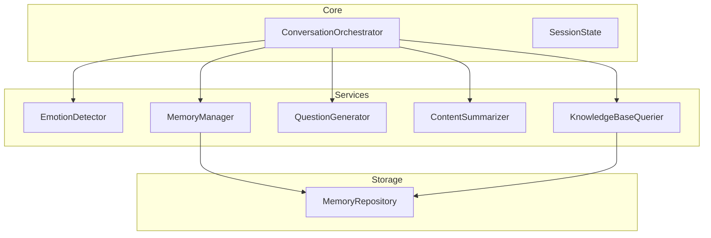
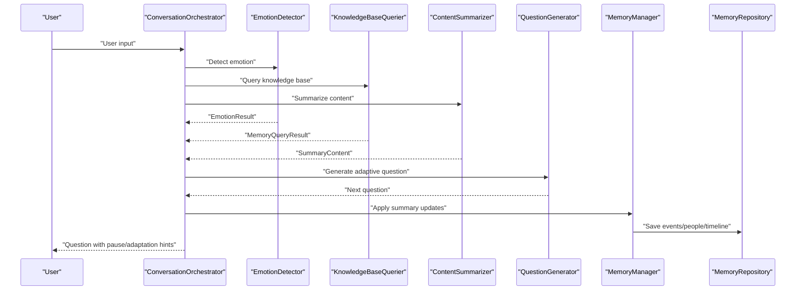
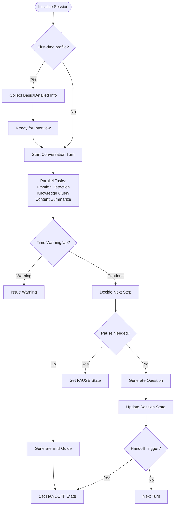
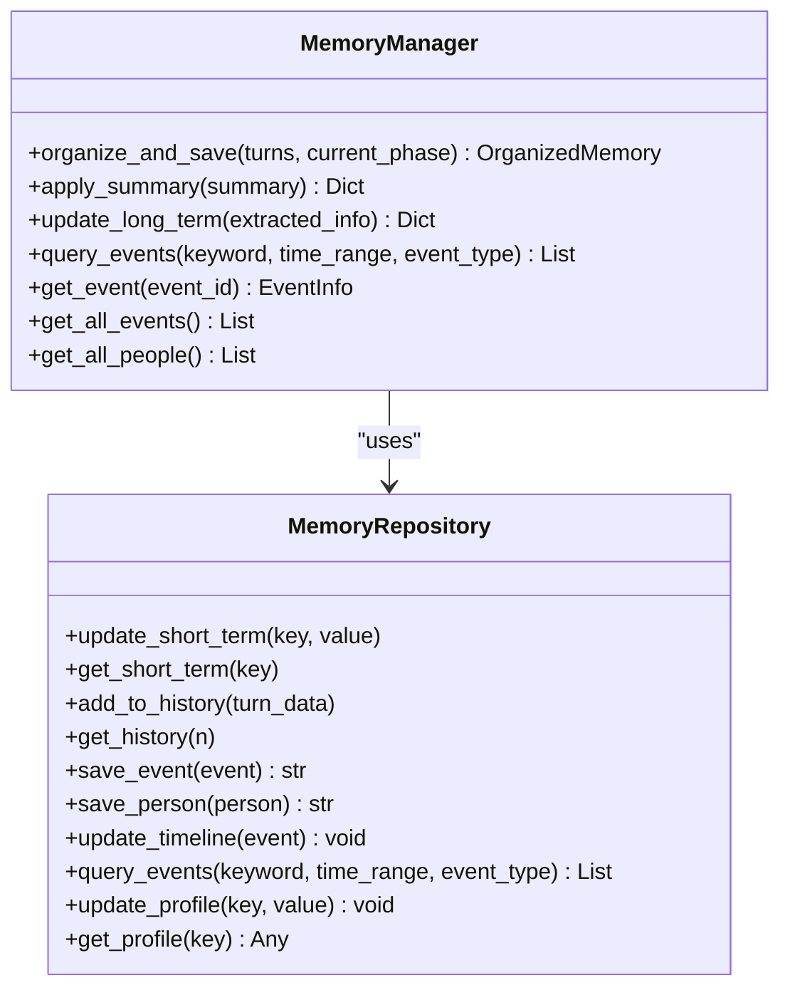
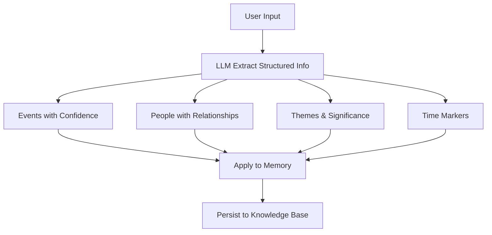
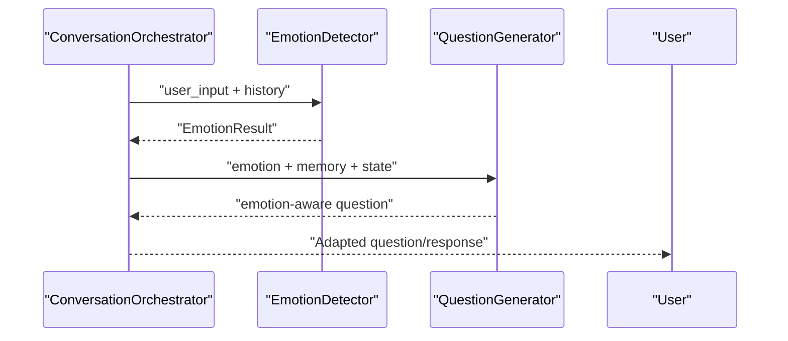
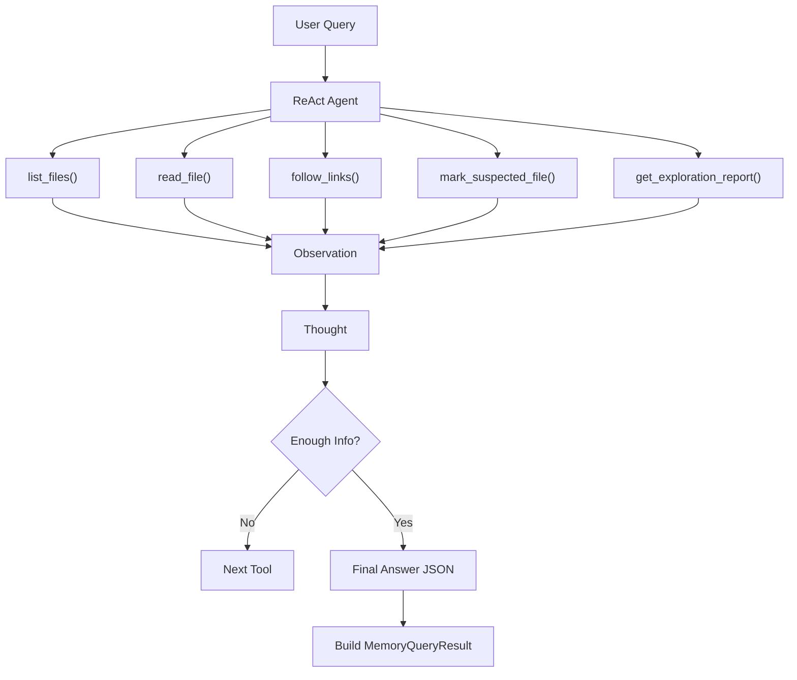
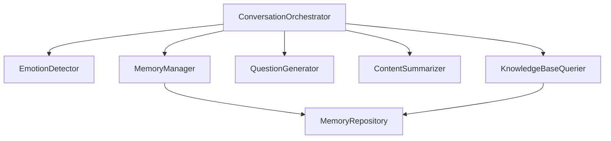

# Core Features

<cite>
**Referenced Files in This Document**
- [conversation_orchestrator.py](file://src/core/conversation_orchestrator.py)
- [memory_manager.py](file://src/services/memory_manager.py)
- [emotion_detector.py](file://src/services/emotion_detector.py)
- [knowledge_base_querier.py](file://src/services/knowledge_base_querier.py)
- [question_generator.py](file://src/services/question_generator.py)
- [content_summarizer.py](file://src/services/content_summarizer.py)
- [session_state.py](file://src/models/session_state.py)
- [state_type.py](file://src/enums/state_type.py)
- [phase_type.py](file://src/enums/phase_type.py)
- [emotion_type.py](file://src/enums/emotion_type.py)
- [memory_repository.py](file://src/storage/memory_repository.py)
- [QuestionGenerator-Prompt.md](file://src/prompts/QuestionGenerator-Prompt.md)
- [MemoryOrganizer-Prompt.md](file://Prompts/MemoryOrganizer-Prompt.md)
</cite>

## Table of Contents
1. [Introduction](#introduction)
2. [Project Structure](#project-structure)
3. [Core Components](#core-components)
4. [Architecture Overview](#architecture-overview)
5. [Detailed Component Analysis](#detailed-component-analysis)
6. [Dependency Analysis](#dependency-analysis)
7. [Performance Considerations](#performance-considerations)
8. [Troubleshooting Guide](#troubleshooting-guide)
9. [Conclusion](#conclusion)

## Introduction
This document presents the core features of the elderly memoir system, focusing on the adaptive conversation flow for time-constrained interviews, multi-stage memory organization, intelligent content extraction and entity recognition, emotion detection and response adaptation, knowledge base integration with semantic search, structured data extraction with confidence scoring, and parallel processing for responsiveness. The system is designed to guide meaningful, respectful, and efficient interviews while building a rich, structured knowledge base for future writing and reflection.

## Project Structure
The system is organized around a central orchestrator that coordinates specialized services and repositories:
- Core orchestration and session lifecycle management
- Services for emotion detection, knowledge base querying, question generation, and content summarization
- Memory management and persistence across short-term, long-term, and profile memories
- Prompt templates guiding LLM-based reasoning and extraction

**Diagram sources**
- [conversation_orchestrator.py:138-401](file://src/core/conversation_orchestrator.py#L138-L401)
- [memory_manager.py:27-61](file://src/services/memory_manager.py#L27-L61)
- [emotion_detector.py:12-37](file://src/services/emotion_detector.py#L12-L37)
- [knowledge_base_querier.py:202-235](file://src/services/knowledge_base_querier.py#L202-L235)
- [question_generator.py:12-36](file://src/services/question_generator.py#L12-L36)
- [content_summarizer.py:17-41](file://src/services/content_summarizer.py#L17-L41)
- [memory_repository.py:40-87](file://src/storage/memory_repository.py#L40-L87)

**Section sources**
- [conversation_orchestrator.py:138-401](file://src/core/conversation_orchestrator.py#L138-L401)
- [memory_manager.py:27-61](file://src/services/memory_manager.py#L27-L61)
- [emotion_detector.py:12-37](file://src/services/emotion_detector.py#L12-L37)
- [knowledge_base_querier.py:202-235](file://src/services/knowledge_base_querier.py#L202-L235)
- [question_generator.py:12-36](file://src/services/question_generator.py#L12-L36)
- [content_summarizer.py:17-41](file://src/services/content_summarizer.py#L17-L41)
- [memory_repository.py:40-87](file://src/storage/memory_repository.py#L40-L87)

## Core Components
- Adaptive conversation flow with time constraints, parallel processing, and state-driven transitions
- Multi-stage memory organization across time-line, events, people, and themes
- Intelligent content extraction with confidence scoring and structured outputs
- Emotion detection and dynamic response adaptation
- Knowledge base integration with ReAct-style semantic search and cross-referencing
- Structured data extraction with confidence scoring and parallel processing

**Section sources**
- [conversation_orchestrator.py:138-401](file://src/core/conversation_orchestrator.py#L138-L401)
- [memory_manager.py:27-61](file://src/services/memory_manager.py#L27-L61)
- [emotion_detector.py:12-37](file://src/services/emotion_detector.py#L12-L37)
- [knowledge_base_querier.py:202-235](file://src/services/knowledge_base_querier.py#L202-L235)
- [question_generator.py:12-36](file://src/services/question_generator.py#L12-L36)
- [content_summarizer.py:17-41](file://src/services/content_summarizer.py#L17-L41)
- [memory_repository.py:40-87](file://src/storage/memory_repository.py#L40-L87)

## Architecture Overview
The system centers on a ConversationOrchestrator that manages session lifecycle, timing, and state. It concurrently invokes emotion detection, knowledge base querying, and content summarization, then generates adaptive questions guided by memory context and emotional state. MemoryManager applies structured outputs to persistent storage, while MemoryRepository maintains short-term, long-term, and profile memories.

**Diagram sources**
- [conversation_orchestrator.py:236-343](file://src/core/conversation_orchestrator.py#L236-L343)
- [emotion_detector.py:39-73](file://src/services/emotion_detector.py#L39-L73)
- [knowledge_base_querier.py:257-372](file://src/services/knowledge_base_querier.py#L257-L372)
- [content_summarizer.py:43-92](file://src/services/content_summarizer.py#L43-L92)
- [question_generator.py:38-73](file://src/services/question_generator.py#L38-L73)
- [memory_manager.py:111-156](file://src/services/memory_manager.py#L111-L156)
- [memory_repository.py:176-226](file://src/storage/memory_repository.py#L176-L226)

## Detailed Component Analysis

### Adaptive Conversation Flow with Time Constraints
- Session initialization sets timing controls and optional first-time profile collection.
- Parallel processing: emotion detection, knowledge base query, and content summarization are launched concurrently with timeouts.
- Time-based controls: warnings and termination thresholds trigger session end guidance.
- State transitions: pause, redirect, deepen, and handoff states are managed based on coverage, pending questions, and emotional signals.
- Profile collection flow: guided, incremental collection of basic and detailed user attributes.

**Diagram sources**
- [conversation_orchestrator.py:198-258](file://src/core/conversation_orchestrator.py#L198-L258)
- [conversation_orchestrator.py:269-343](file://src/core/conversation_orchestrator.py#L269-L343)
- [conversation_orchestrator.py:570-592](file://src/core/conversation_orchestrator.py#L570-L592)

**Section sources**
- [conversation_orchestrator.py:198-258](file://src/core/conversation_orchestrator.py#L198-L258)
- [conversation_orchestrator.py:269-343](file://src/core/conversation_orchestrator.py#L269-L343)
- [conversation_orchestrator.py:570-592](file://src/core/conversation_orchestrator.py#L570-L592)
- [session_state.py:24-139](file://src/models/session_state.py#L24-L139)
- [state_type.py:4-12](file://src/enums/state_type.py#L4-L12)

### Multi-Stage Memory Organization
- Three-dimensional organization: timeline nodes, structured events, and people profiles.
- Lifecycle stages: childhood, youth, young adult, middle age, elderly.
- Structured extraction schema with confidence scores and source tracing.
- Incremental updates: avoids duplication, augments existing indices, and updates timelines.

**Diagram sources**
- [memory_repository.py:40-87](file://src/storage/memory_repository.py#L40-L87)
- [memory_repository.py:176-226](file://src/storage/memory_repository.py#L176-L226)
- [memory_manager.py:27-61](file://src/services/memory_manager.py#L27-L61)
- [memory_manager.py:111-156](file://src/services/memory_manager.py#L111-L156)

**Section sources**
- [memory_manager.py:27-61](file://src/services/memory_manager.py#L27-L61)
- [memory_manager.py:111-156](file://src/services/memory_manager.py#L111-L156)
- [memory_repository.py:176-226](file://src/storage/memory_repository.py#L176-L226)
- [phase_type.py:4-10](file://src/enums/phase_type.py#L4-L10)
- [MemoryOrganizer-Prompt.md:518-555](file://Prompts/MemoryOrganizer-Prompt.md#L518-L555)

### Intelligent Content Extraction and Entity Recognition
- Structured extraction pipeline produces events, people, time markers, and themes.
- Confidence scoring embedded in extracted entities for traceability and quality assessment.
- Cross-references and related events enable richer storytelling.
- Prompt-driven extraction ensures consistent schema adherence and completeness.

**Diagram sources**
- [content_summarizer.py:43-92](file://src/services/content_summarizer.py#L43-L92)
- [content_summarizer.py:111-143](file://src/services/content_summarizer.py#L111-L143)
- [MemoryOrganizer-Prompt.md:83-183](file://Prompts/MemoryOrganizer-Prompt.md#L83-L183)

**Section sources**
- [content_summarizer.py:43-92](file://src/services/content_summarizer.py#L43-L92)
- [content_summarizer.py:111-143](file://src/services/content_summarizer.py#L111-L143)
- [MemoryOrganizer-Prompt.md:83-183](file://Prompts/MemoryOrganizer-Prompt.md#L83-L183)

### Emotion Detection and Response Adaptation
- EmotionDetector analyzes user input and conversation history to classify emotion type, intensity, and valence.
- Suggested actions drive pause, comfort, redirect, or continue strategies.
- QuestionGenerator adapts question types and tone based on detected emotion and session state.

**Diagram sources**
- [emotion_detector.py:39-73](file://src/services/emotion_detector.py#L39-L73)
- [emotion_detector.py:85-131](file://src/services/emotion_detector.py#L85-L131)
- [question_generator.py:75-98](file://src/services/question_generator.py#L75-L98)

**Section sources**
- [emotion_detector.py:12-37](file://src/services/emotion_detector.py#L12-L37)
- [emotion_detector.py:39-73](file://src/services/emotion_detector.py#L39-L73)
- [emotion_type.py:4-50](file://src/enums/emotion_type.py#L4-L50)
- [question_generator.py:75-98](file://src/services/question_generator.py#L75-L98)

### Knowledge Base Integration with Semantic Search and Cross-Reference
- KnowledgeBaseQuerier uses a ReAct-style agent with tools to explore, read, and link related content.
- Tools include listing files, reading content, following links, marking suspected files, and reporting exploration.
- Results are parsed into structured MemoryQueryResult with relevance notes and linked context.

**Diagram sources**
- [knowledge_base_querier.py:257-372](file://src/services/knowledge_base_querier.py#L257-L372)
- [knowledge_base_querier.py:435-511](file://src/services/knowledge_base_querier.py#L435-L511)
- [knowledge_base_querier.py:513-540](file://src/services/knowledge_base_querier.py#L513-L540)

**Section sources**
- [knowledge_base_querier.py:202-235](file://src/services/knowledge_base_querier.py#L202-L235)
- [knowledge_base_querier.py:257-372](file://src/services/knowledge_base_querier.py#L257-L372)
- [knowledge_base_querier.py:435-511](file://src/services/knowledge_base_querier.py#L435-L511)

### Structured Data Extraction with Confidence Scoring
- Extraction schema defines event types, importance, participant relations, and confidence.
- Source tracing and processing summaries support auditability and quality control.
- Prompt-driven extraction ensures consistent, high-quality outputs suitable for downstream storage.

**Section sources**
- [MemoryOrganizer-Prompt.md:83-183](file://Prompts/MemoryOrganizer-Prompt.md#L83-L183)
- [MemoryOrganizer-Prompt.md:368-514](file://Prompts/MemoryOrganizer-Prompt.md#L368-L514)
- [memory_manager.py:111-156](file://src/services/memory_manager.py#L111-L156)

### Parallel Processing for Responsiveness
- Concurrent execution of emotion detection, knowledge base query, and content summarization improves responsiveness.
- Asynchronous orchestration with timeouts prevents blocking and ensures timely responses.
- Parallel saving of events and people accelerates memory updates.

**Section sources**
- [conversation_orchestrator.py:269-302](file://src/core/conversation_orchestrator.py#L269-L302)
- [memory_manager.py:170-193](file://src/services/memory_manager.py#L170-L193)

## Dependency Analysis
The system exhibits clear separation of concerns:
- ConversationOrchestrator depends on EmotionDetector, KnowledgeBaseQuerier, QuestionGenerator, ContentSummarizer, MemoryManager, and MemoryRepository.
- MemoryManager encapsulates LLM-based organization and delegates persistence to MemoryRepository.
- KnowledgeBaseQuerier integrates with MemoryRepository via MarkdownFileManager for file operations.

**Diagram sources**
- [conversation_orchestrator.py:163-196](file://src/core/conversation_orchestrator.py#L163-L196)
- [memory_manager.py:27-61](file://src/services/memory_manager.py#L27-L61)
- [knowledge_base_querier.py:220-235](file://src/services/knowledge_base_querier.py#L220-L235)

**Section sources**
- [conversation_orchestrator.py:163-196](file://src/core/conversation_orchestrator.py#L163-L196)
- [memory_manager.py:27-61](file://src/services/memory_manager.py#L27-L61)
- [knowledge_base_querier.py:220-235](file://src/services/knowledge_base_querier.py#L220-L235)

## Performance Considerations
- Concurrency: Parallel tasks for emotion detection, knowledge querying, and summarization reduce latency.
- Caching: LRUCache in MemoryRepository reduces repeated reads and speeds up lookups.
- Asynchronous I/O: File operations and LLM invocations leverage async patterns to improve throughput.
- Timeout management: Configurable timeouts prevent long-running operations from stalling the conversation.

[No sources needed since this section provides general guidance]

## Troubleshooting Guide
- Emotion detection failures: Falls back to neutral default and logs errors.
- Knowledge base query failures: Returns empty result and logs exceptions.
- Memory organization failures: Logs error and returns empty structure.
- Session time-up: Generates end guidance and triggers handoff state.
- Profile collection issues: Handles missing fields gracefully and transitions when complete.

**Section sources**
- [emotion_detector.py:67-73](file://src/services/emotion_detector.py#L67-L73)
- [knowledge_base_querier.py:368-372](file://src/services/knowledge_base_querier.py#L368-L372)
- [memory_manager.py:147-150](file://src/services/memory_manager.py#L147-L150)
- [conversation_orchestrator.py:570-592](file://src/core/conversation_orchestrator.py#L570-L592)
- [conversation_orchestrator.py:416-419](file://src/core/conversation_orchestrator.py#L416-L419)

## Conclusion
The elderly memoir system combines adaptive conversation management, robust memory organization, intelligent extraction, emotion-aware responses, and integrated knowledge base search to deliver a respectful, efficient, and effective interviewing experience. Its modular architecture, parallel processing, and structured outputs enable scalable, high-quality content creation for personal memoirs.