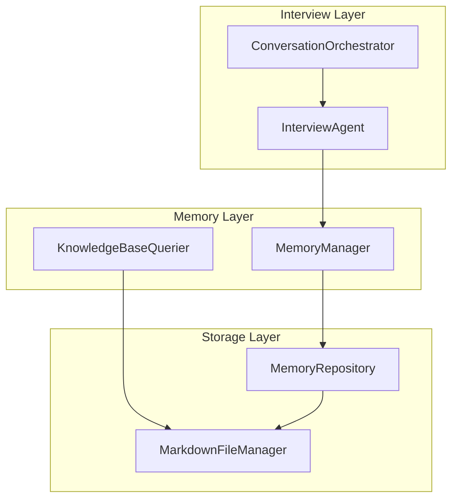
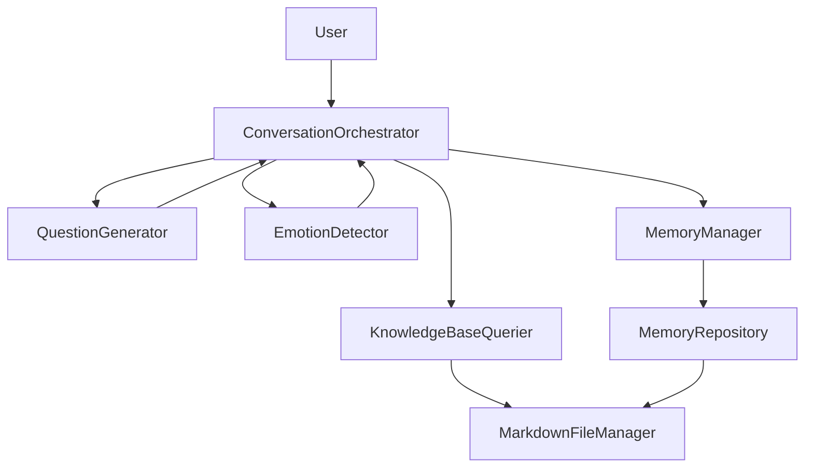
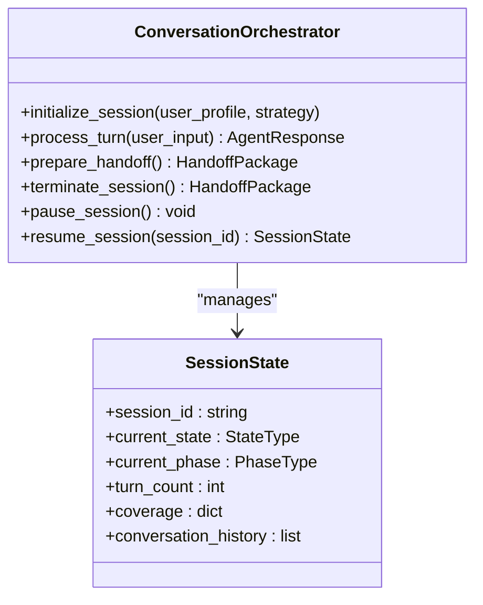
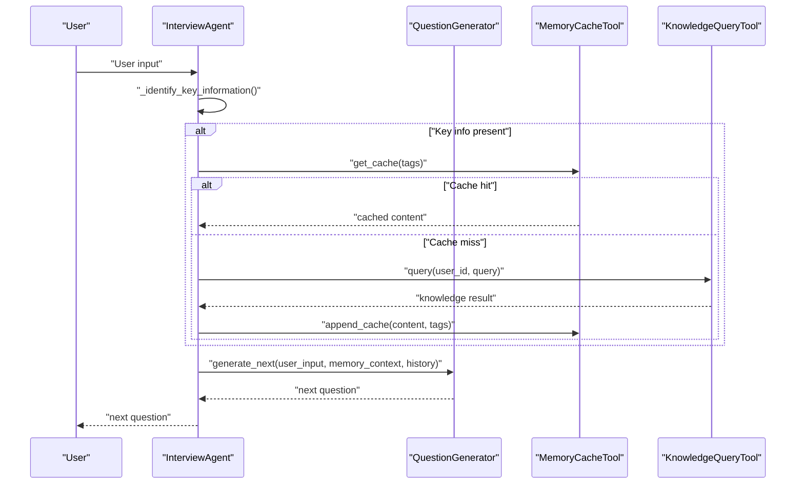
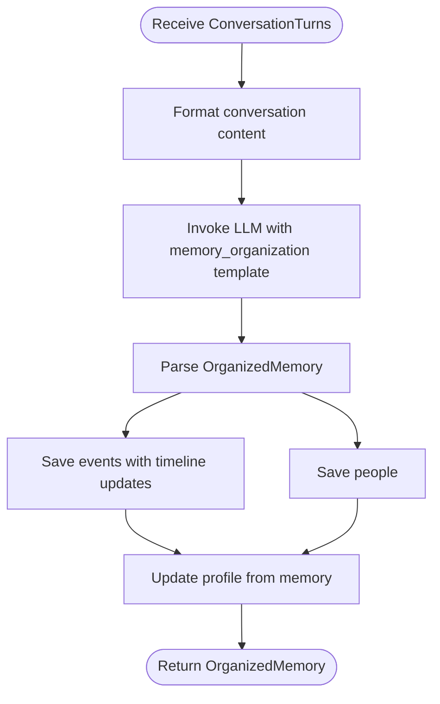
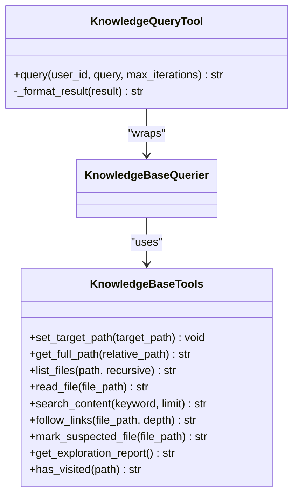
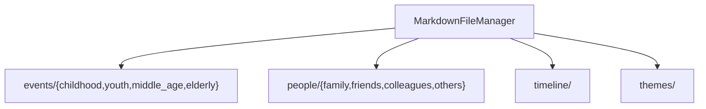
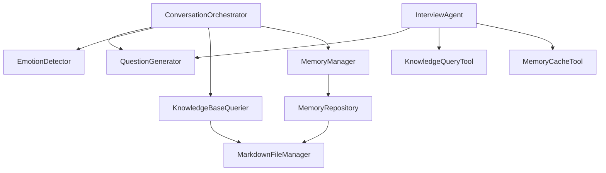

# Project Overview

<cite>
**Referenced Files in This Document**
- [老人自传 Agent 协作架构.md](file://老人自传 Agent 协作架构.md)
- [老人自传写作指南.md](file://老人自传写作指南.md)
- [conversation_orchestrator.py](file://src/core/conversation_orchestrator.py)
- [interview_agent.py](file://src/agents/interview_agent.py)
- [memory_manager.py](file://src/services/memory_manager.py)
- [knowledge_base_querier.py](file://src/services/knowledge_base_querier.py)
- [question_generator.py](file://src/services/question_generator.py)
- [session_state.py](file://src/models/session_state.py)
- [organized_memory.py](file://src/models/organized_memory.py)
- [markdown_file_manager.py](file://src/storage/markdown_file_manager.py)
- [knowledge_query_tool.py](file://src/tools/knowledge_query_tool.py)
- [patterns.md](file://langgraph-agent-dev/references/patterns.md)
</cite>

## Table of Contents
1. [Introduction](#introduction)
2. [Project Structure](#project-structure)
3. [Core Components](#core-components)
4. [Architecture Overview](#architecture-overview)
5. [Detailed Component Analysis](#detailed-component-analysis)
6. [Dependency Analysis](#dependency-analysis)
7. [Performance Considerations](#performance-considerations)
8. [Troubleshooting Guide](#troubleshooting-guide)
9. [Conclusion](#conclusion)

## Introduction
This project is an AI-powered conversational agent platform designed to help elderly individuals document their life stories into structured, narrative-driven memoirs. It targets seniors seeking to preserve personal histories and families who want to capture meaningful legacies. The system’s core value proposition lies in transforming oral history into coherent, multi-stage narratives through adaptive conversation flow, multi-layer memory organization, and intelligent content extraction.

Key capabilities include:
- Adaptive conversation flow guided by emotion-aware question generation and session-state tracking
- Multi-stage memory organization across events, people, timelines, and profiles
- Intelligent content extraction and cross-memory verification to ensure accuracy and completeness
- Practical examples demonstrating how raw interviews evolve into structured digital narratives

## Project Structure
The system is organized around three primary layers:
- Interview and dialogue orchestration (ConversationOrchestrator, InterviewAgent)
- Structured memory organization (MemoryManager, KnowledgeBaseQuerier)
- Persistent storage and retrieval (MarkdownFileManager, MemoryRepository)

**Diagram sources**
- [conversation_orchestrator.py:138-181](file://src/core/conversation_orchestrator.py#L138-L181)
- [interview_agent.py:16-79](file://src/agents/interview_agent.py#L16-L79)
- [memory_manager.py:27-61](file://src/services/memory_manager.py#L27-L61)
- [knowledge_base_querier.py:17-53](file://src/services/knowledge_base_querier.py#L17-L53)
- [markdown_file_manager.py:31-77](file://src/storage/markdown_file_manager.py#L31-L77)

**Section sources**
- [conversation_orchestrator.py:138-181](file://src/core/conversation_orchestrator.py#L138-L181)
- [interview_agent.py:16-79](file://src/agents/interview_agent.py#L16-L79)
- [memory_manager.py:27-61](file://src/services/memory_manager.py#L27-L61)
- [knowledge_base_querier.py:17-53](file://src/services/knowledge_base_querier.py#L17-L53)
- [markdown_file_manager.py:31-77](file://src/storage/markdown_file_manager.py#L31-L77)

## Core Components
- ConversationOrchestrator: Central controller managing session lifecycle, state transitions, and handoffs between interview stages. It coordinates emotion detection, knowledge queries, and question generation.
- InterviewAgent: An interview-focused agent that drives time-bound conversations, identifies key information, queries memory caches, and generates adaptive questions.
- MemoryManager: Orchestrates multi-dimensional memory organization (events, people, timelines, profiles) via LLM-driven structuring and persistent storage.
- KnowledgeBaseQuerier: Provides LangChain-based tools to explore and retrieve relevant memory entries across the knowledge base.
- MarkdownFileManager: Manages filesystem-backed storage for memory artifacts, ensuring proper directory structure and content persistence.
- SessionState: A Pydantic model capturing session progress, coverage per life stage, and conversation history.
- OrganizedMemory: A structured schema for extracted events, people, timeline updates, and profile enhancements.

**Section sources**
- [conversation_orchestrator.py:138-181](file://src/core/conversation_orchestrator.py#L138-L181)
- [interview_agent.py:16-79](file://src/agents/interview_agent.py#L16-L79)
- [memory_manager.py:27-61](file://src/services/memory_manager.py#L27-L61)
- [knowledge_base_querier.py:17-53](file://src/services/knowledge_base_querier.py#L17-L53)
- [markdown_file_manager.py:31-77](file://src/storage/markdown_file_manager.py#L31-L77)
- [session_state.py:24-82](file://src/models/session_state.py#L24-L82)
- [organized_memory.py:141-151](file://src/models/organized_memory.py#L141-L151)

## Architecture Overview
The system follows a layered, memory-centric architecture:
- Interview Layer: Handles user input, emotion-aware question generation, and session timing controls.
- Memory Layer: Transforms unstructured interview data into structured knowledge across multiple dimensions.
- Storage Layer: Persists and retrieves knowledge base artifacts with robust directory scaffolding.

**Diagram sources**
- [老人自传 Agent 协作架构.md:11-101](file://老人自传 Agent 协作架构.md#L11-L101)
- [conversation_orchestrator.py:172-181](file://src/core/conversation_orchestrator.py#L172-L181)
- [question_generator.py:12-36](file://src/services/question_generator.py#L12-L36)
- [knowledge_base_querier.py:17-53](file://src/services/knowledge_base_querier.py#L17-L53)
- [memory_manager.py:27-61](file://src/services/memory_manager.py#L27-L61)
- [markdown_file_manager.py:31-77](file://src/storage/markdown_file_manager.py#L31-L77)

## Detailed Component Analysis

### ConversationOrchestrator
Responsibilities:
- Initialize sessions with timing and optional profile collection
- Manage state transitions (collect, deepen, redirect, pause, handoff)
- Coordinate emotion detection, knowledge queries, and question generation
- Trigger handoff packages for downstream processing

Key behaviors:
- Asynchronous orchestration of emotion detection and knowledge queries
- Time-based warnings and termination handling
- Profile collection flow for first-time users
- Event bus emissions for session lifecycle events

**Diagram sources**
- [conversation_orchestrator.py:138-181](file://src/core/conversation_orchestrator.py#L138-L181)
- [session_state.py:24-82](file://src/models/session_state.py#L24-L82)

**Section sources**
- [conversation_orchestrator.py:198-234](file://src/core/conversation_orchestrator.py#L198-L234)
- [conversation_orchestrator.py:236-343](file://src/core/conversation_orchestrator.py#L236-L343)
- [conversation_orchestrator.py:353-401](file://src/core/conversation_orchestrator.py#L353-L401)
- [conversation_orchestrator.py:403-414](file://src/core/conversation_orchestrator.py#L403-L414)

### InterviewAgent
Responsibilities:
- Drive time-bound interviews with adaptive questioning
- Identify key information (events, persons, time points, locations)
- Query memory cache and knowledge base, update cache, and generate next questions
- Provide session end guidance

**Diagram sources**
- [interview_agent.py:115-184](file://src/agents/interview_agent.py#L115-L184)
- [interview_agent.py:186-242](file://src/agents/interview_agent.py#L186-L242)
- [knowledge_query_tool.py:33-66](file://src/tools/knowledge_query_tool.py#L33-L66)
- [question_generator.py:12-36](file://src/services/question_generator.py#L12-L36)

**Section sources**
- [interview_agent.py:80-114](file://src/agents/interview_agent.py#L80-L114)
- [interview_agent.py:115-184](file://src/agents/interview_agent.py#L115-L184)
- [interview_agent.py:244-272](file://src/agents/interview_agent.py#L244-L272)

### MemoryManager
Responsibilities:
- Organize and save structured memories across events, people, timelines, and profiles
- Apply LLM-driven transformations to convert conversation turns into OrganizedMemory
- Maintain short-term and long-term memory indices
- Provide query and update interfaces for profile and entity data

**Diagram sources**
- [memory_manager.py:111-156](file://src/services/memory_manager.py#L111-L156)
- [memory_manager.py:158-193](file://src/services/memory_manager.py#L158-L193)
- [organized_memory.py:141-151](file://src/models/organized_memory.py#L141-L151)

**Section sources**
- [memory_manager.py:111-156](file://src/services/memory_manager.py#L111-L156)
- [memory_manager.py:158-193](file://src/services/memory_manager.py#L158-L193)
- [organized_memory.py:57-95](file://src/models/organized_memory.py#L57-L95)

### KnowledgeBaseQuerier and Tools
Responsibilities:
- Provide LangChain tools for listing files, reading content, searching, following links, and marking suspected files
- Support safe path handling and exploration reporting
- Enable InterviewAgent and other components to query and enrich context

**Diagram sources**
- [knowledge_base_querier.py:17-53](file://src/services/knowledge_base_querier.py#L17-L53)
- [knowledge_base_querier.py:54-195](file://src/services/knowledge_base_querier.py#L54-L195)
- [knowledge_query_tool.py:11-32](file://src/tools/knowledge_query_tool.py#L11-L32)

**Section sources**
- [knowledge_base_querier.py:17-53](file://src/services/knowledge_base_querier.py#L17-L53)
- [knowledge_base_querier.py:54-195](file://src/services/knowledge_base_querier.py#L54-L195)
- [knowledge_query_tool.py:33-66](file://src/tools/knowledge_query_tool.py#L33-L66)

### Storage and Persistence
Responsibilities:
- Ensure directory structure for events, people, timelines, and themes
- Create, read, and update Markdown files asynchronously
- Maintain indexes and support linked content navigation

**Diagram sources**
- [markdown_file_manager.py:80-131](file://src/storage/markdown_file_manager.py#L80-L131)

**Section sources**
- [markdown_file_manager.py:80-131](file://src/storage/markdown_file_manager.py#L80-L131)

### LangGraph-Based Agent Orchestration Patterns
The system aligns with LangGraph patterns for analyzer and router agents, enabling:
- Analyzer Agent pattern for iterative analysis and tool use
- Router Agent pattern for conditional routing decisions based on context

These patterns inform how InterviewAgent and MemoryManager can be integrated into a LangGraph workflow for dynamic, tool-augmented conversation control.

**Section sources**
- [patterns.md:14-107](file://langgraph-agent-dev/references/patterns.md#L14-L107)
- [patterns.md:144-259](file://langgraph-agent-dev/references/patterns.md#L144-L259)

## Dependency Analysis
High-level dependencies:
- ConversationOrchestrator depends on QuestionGenerator, EmotionDetector, KnowledgeBaseQuerier, and MemoryManager
- InterviewAgent depends on QuestionGenerator, MemoryCacheTool, KnowledgeQueryTool, and MemoryManager
- MemoryManager depends on MemoryRepository and LLMService
- KnowledgeBaseQuerier depends on MarkdownFileManager and LLMService
- MarkdownFileManager underpins MemoryRepository and KnowledgeBaseQuerier

**Diagram sources**
- [conversation_orchestrator.py:172-181](file://src/core/conversation_orchestrator.py#L172-L181)
- [interview_agent.py:58-61](file://src/agents/interview_agent.py#L58-L61)
- [memory_manager.py:59-60](file://src/services/memory_manager.py#L59-L60)
- [knowledge_base_querier.py:82-87](file://src/services/knowledge_base_querier.py#L82-L87)
- [markdown_file_manager.py:68-77](file://src/storage/markdown_file_manager.py#L68-L77)

**Section sources**
- [conversation_orchestrator.py:172-181](file://src/core/conversation_orchestrator.py#L172-L181)
- [interview_agent.py:58-61](file://src/agents/interview_agent.py#L58-L61)
- [memory_manager.py:59-60](file://src/services/memory_manager.py#L59-L60)
- [knowledge_base_querier.py:82-87](file://src/services/knowledge_base_querier.py#L82-L87)
- [markdown_file_manager.py:68-77](file://src/storage/markdown_file_manager.py#L68-L77)

## Performance Considerations
- Asynchronous orchestration: Parallel execution of emotion detection and knowledge queries reduces latency per turn.
- Time-based controls: Session timers and warnings prevent extended interviews, improving user experience and resource utilization.
- Caching and indexing: MemoryCacheTool and MemoryRepository LRUCache reduce repeated I/O and accelerate retrieval.
- Structured templates: Using LLM templates for memory organization ensures consistent, high-throughput processing.

[No sources needed since this section provides general guidance]

## Troubleshooting Guide
Common issues and resolutions:
- Timeout handling: ConversationOrchestrator applies timeouts to emotion detection and knowledge queries; failures fall back to neutral or default responses.
- Session termination: Time-up triggers a structured end-guide with highlights and next-topic hints.
- Memory organization failures: LLM invocation failures are logged and handled gracefully, returning empty structures for downstream safety.
- Path safety: KnowledgeBaseTools enforce safe path handling to prevent directory traversal and unauthorized access.

**Section sources**
- [conversation_orchestrator.py:286-302](file://src/core/conversation_orchestrator.py#L286-L302)
- [conversation_orchestrator.py:570-592](file://src/core/conversation_orchestrator.py#L570-L592)
- [memory_manager.py:140-150](file://src/services/memory_manager.py#L140-L150)
- [knowledge_base_querier.py:30-52](file://src/services/knowledge_base_querier.py#L30-L52)

## Conclusion
This elderly memoir recording system combines adaptive conversation flow, multi-stage memory organization, and intelligent content extraction to transform oral histories into structured, narrative-driven documents. Its layered architecture—centered on ConversationOrchestrator, InterviewAgent, MemoryManager, and persistent storage—ensures scalability, maintainability, and a strong foundation for future enhancements such as LangGraph-based orchestration.