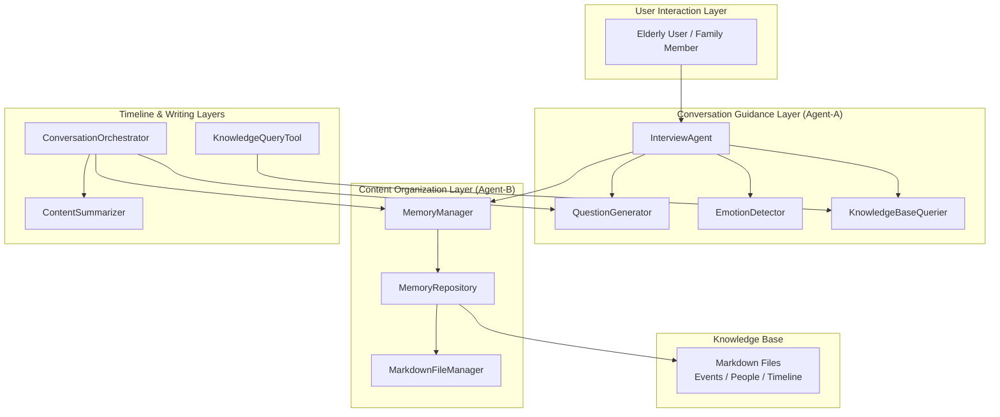
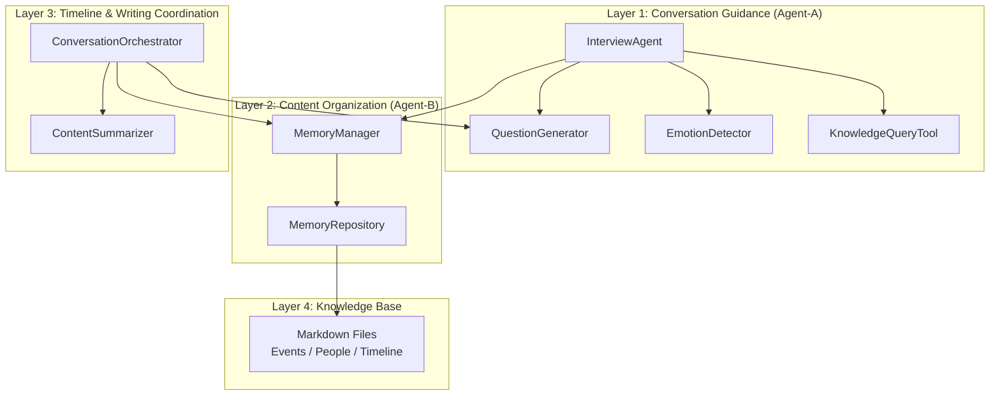
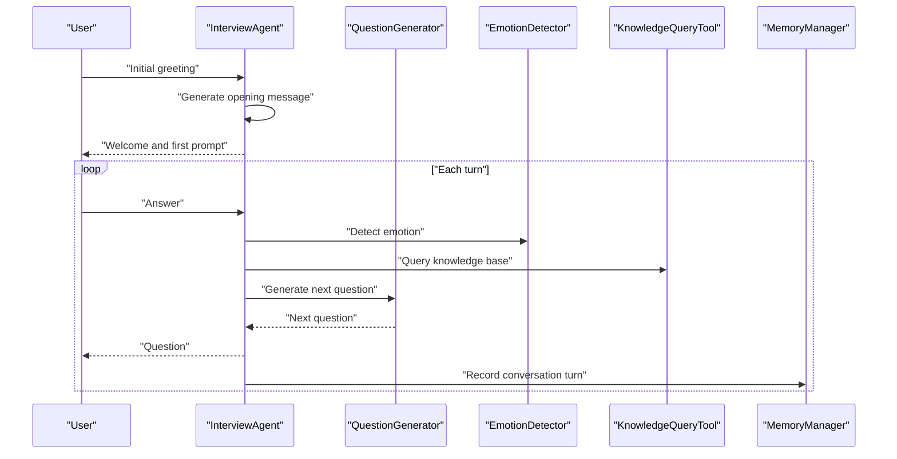
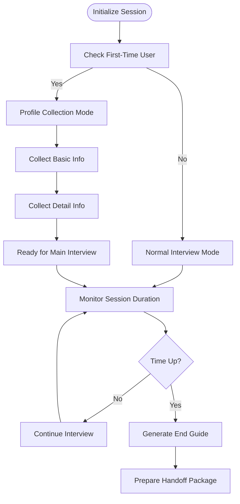
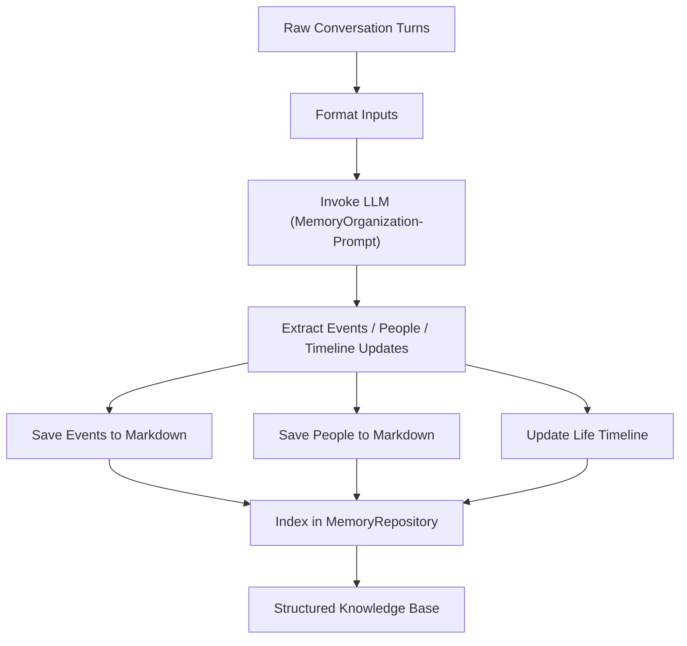
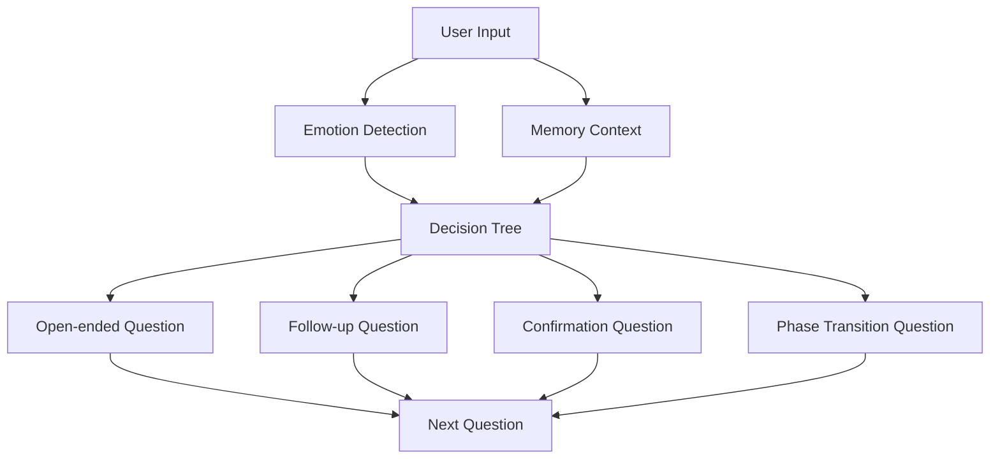
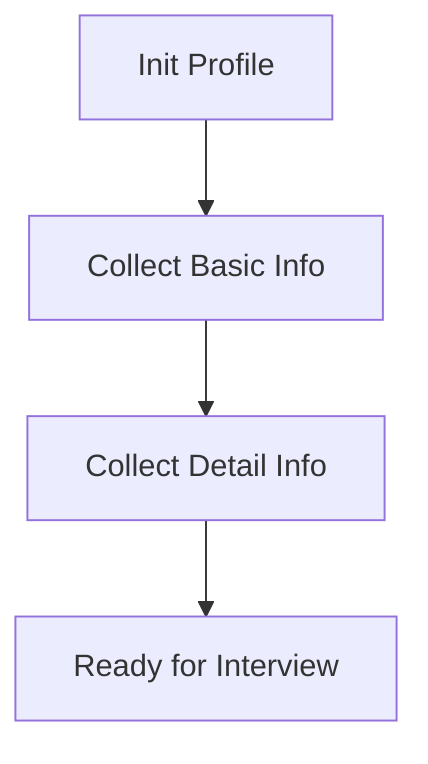
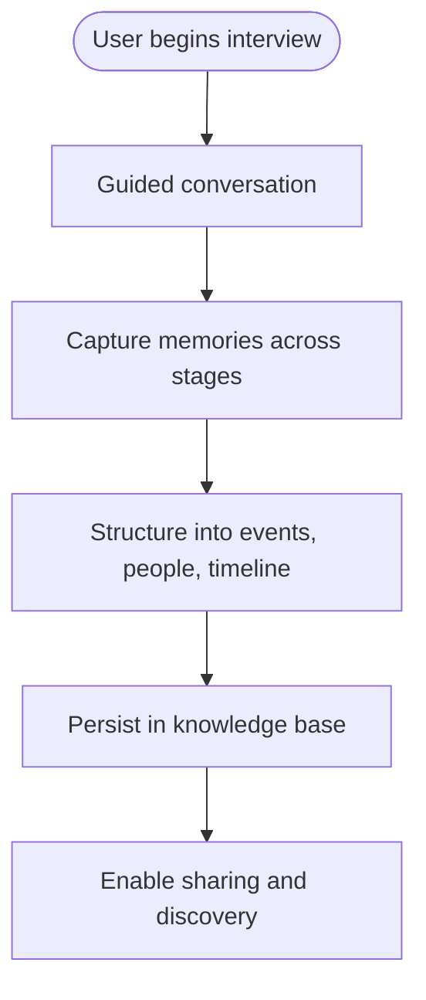
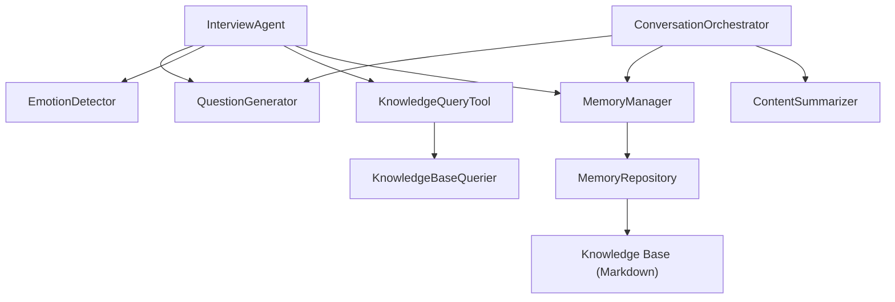

# System Introduction

<cite>
**Referenced Files in This Document**
- [老人自传 Agent 协作架构.md](file://老人自传 Agent 协作架构.md)
- [老人自传写作指南.md](file://老人自传写作指南.md)
- [MEMORY_INTERACTION_GUIDE.md](file://MEMORY_INTERACTION_GUIDE.md)
- [Prompts/MemoryOrganizer-Prompt.md](file://Prompts/MemoryOrganizer-Prompt.md)
- [Prompts/QuestionGenerator-Prompt.md](file://Prompts/QuestionGenerator-Prompt.md)
- [Prompts/ProfileCollection-Prompt.md](file://Prompts/ProfileCollection-Prompt.md)
- [src/agents/interview_agent.py](file://src/agents/interview_agent.py)
- [src/core/conversation_orchestrator.py](file://src/core/conversation_orchestrator.py)
- [src/models/session_state.py](file://src/models/session_state.py)
- [src/enums/phase_type.py](file://src/enums/phase_type.py)
- [src/enums/state_type.py](file://src/enums/state_type.py)
- [src/services/memory_manager.py](file://src/services/memory_manager.py)
- [src/storage/memory_repository.py](file://src/storage/memory_repository.py)
- [src/tools/knowledge_query_tool.py](file://src/tools/knowledge_query_tool.py)
</cite>

## Table of Contents
1. [Introduction](#introduction)
2. [Project Structure](#project-structure)
3. [Core Components](#core-components)
4. [Architecture Overview](#architecture-overview)
5. [Detailed Component Analysis](#detailed-component-analysis)
6. [Dependency Analysis](#dependency-analysis)
7. [Performance Considerations](#performance-considerations)
8. [Troubleshooting Guide](#troubleshooting-guide)
9. [Conclusion](#conclusion)

## Introduction
This elderly memoir recording platform is an AI-powered conversational agent designed to help elderly individuals document their life stories through structured, guided interviews. It transforms personal recollections into organized, searchable digital narratives by combining intelligent conversation guidance with multi-layered memory organization. The system’s mission is to preserve cultural heritage and personal memories by making the process of collecting life experiences accessible, supportive, and meaningful—especially for older adults who may find it challenging to articulate or revisit their past without assistance.

Target audience
- Elderly users: Primary beneficiaries who want to share and preserve their life stories.
- Family members: Often participate as interviewers or collaborators, helping to trigger memories and provide context.
- Caregivers and historians: Professionals who support the documentation process and ensure historical accuracy and completeness.

Core value proposition
- Intelligent conversation guidance: The system adapts questions and pacing to the user’s emotional state and cognitive needs, ensuring a comfortable and effective interview experience.
- Structured storytelling: Through AI-driven extraction and organization, raw conversations are transformed into structured timelines, event records, and character profiles.
- Digital preservation: All content is stored in a knowledge base with cross-linked entries, enabling long-term accessibility and future generations’ engagement with family history.

Why it matters
- Oral histories are irreplaceable windows into the past, offering insights into social change, family dynamics, and human resilience.
- Many elderly individuals struggle to recall or retell their stories coherently without prompting, and may feel overwhelmed by the task.
- Traditional methods often require significant time and effort from family members or professionals, and can be inconsistent or incomplete.

How this system helps
- By guiding users through life stages with thoughtful, stage-appropriate questions, the platform encourages deeper reflection and richer detail.
- By structuring and organizing content automatically, it reduces the burden on families and caregivers while ensuring nothing important is missed.
- By preserving content in a searchable, cross-linked format, it enables future generations to explore and engage with family history in a meaningful way.

## Project Structure
The platform is organized around a layered, agent-based architecture that coordinates conversation guidance, content organization, timeline construction, and writing support. The system integrates multiple specialized services and tools, each responsible for a distinct aspect of the interview and documentation lifecycle.

**Diagram sources**
- [老人自传 Agent 协作架构.md](file://老人自传 Agent 协作架构.md)
- [src/agents/interview_agent.py](file://src/agents/interview_agent.py)
- [src/core/conversation_orchestrator.py](file://src/core/conversation_orchestrator.py)
- [src/services/memory_manager.py](file://src/services/memory_manager.py)
- [src/storage/memory_repository.py](file://src/storage/memory_repository.py)
- [src/tools/knowledge_query_tool.py](file://src/tools/knowledge_query_tool.py)

**Section sources**
- [老人自传 Agent 协作架构.md](file://老人自传 Agent 协作架构.md)
- [src/agents/interview_agent.py](file://src/agents/interview_agent.py)
- [src/core/conversation_orchestrator.py](file://src/core/conversation_orchestrator.py)
- [src/services/memory_manager.py](file://src/services/memory_manager.py)
- [src/storage/memory_repository.py](file://src/storage/memory_repository.py)
- [src/tools/knowledge_query_tool.py](file://src/tools/knowledge_query_tool.py)

## Core Components
- InterviewAgent: Manages the interview loop, generates contextual questions, tracks conversation history, and coordinates with memory and knowledge services.
- QuestionGenerator: Produces the next appropriate question based on user input, emotional state, memory context, and interview strategy.
- MemoryManager: Transforms raw conversations into structured memories across three dimensions—events, people, and timeline—and updates the knowledge base accordingly.
- MemoryRepository: Provides persistent storage for events, people, and timelines, with indexing and caching for efficient retrieval.
- ConversationOrchestrator: Coordinates all subsystems asynchronously, manages session timing and state transitions, and prepares handoff packages for downstream writing layers.
- KnowledgeQueryTool: Wraps knowledge base queries to provide contextual memory to the conversation guidance layer.
- Prompts: Specialized templates for question generation, memory organization, and profile collection guide the AI in maintaining coherent, structured outputs.

**Section sources**
- [src/agents/interview_agent.py](file://src/agents/interview_agent.py)
- [src/core/conversation_orchestrator.py](file://src/core/conversation_orchestrator.py)
- [src/services/memory_manager.py](file://src/services/memory_manager.py)
- [src/storage/memory_repository.py](file://src/storage/memory_repository.py)
- [src/tools/knowledge_query_tool.py](file://src/tools/knowledge_query_tool.py)
- [Prompts/QuestionGenerator-Prompt.md](file://Prompts/QuestionGenerator-Prompt.md)
- [Prompts/MemoryOrganizer-Prompt.md](file://Prompts/MemoryOrganizer-Prompt.md)
- [Prompts/ProfileCollection-Prompt.md](file://Prompts/ProfileCollection-Prompt.md)

## Architecture Overview
The system follows a multi-agent architecture with clear separation of concerns across four layers: conversation guidance, content organization, timeline and writing coordination, and persistent knowledge storage. Agents communicate via structured messages and shared state, enabling iterative refinement and cross-layer validation.

**Diagram sources**
- [老人自传 Agent 协作架构.md](file://老人自传 Agent 协作架构.md)
- [src/agents/interview_agent.py](file://src/agents/interview_agent.py)
- [src/core/conversation_orchestrator.py](file://src/core/conversation_orchestrator.py)
- [src/services/memory_manager.py](file://src/services/memory_manager.py)
- [src/storage/memory_repository.py](file://src/storage/memory_repository.py)
- [src/tools/knowledge_query_tool.py](file://src/tools/knowledge_query_tool.py)

## Detailed Component Analysis

### InterviewAgent: Guided Interview Loop
InterviewAgent orchestrates the interview process, generating questions tailored to the user’s input, emotional state, and memory context. It maintains conversation history, enforces time limits, and integrates with memory services to ensure continuity and coherence across sessions.

**Diagram sources**
- [src/agents/interview_agent.py](file://src/agents/interview_agent.py)
- [src/tools/knowledge_query_tool.py](file://src/tools/knowledge_query_tool.py)
- [src/services/memory_manager.py](file://src/services/memory_manager.py)

**Section sources**
- [src/agents/interview_agent.py](file://src/agents/interview_agent.py)

### ConversationOrchestrator: Session Control and State Management
ConversationOrchestrator manages session lifecycle, timing, and state transitions. It coordinates asynchronous tasks for emotion detection, knowledge querying, and content summarization, and emits events for external systems.

**Diagram sources**
- [src/core/conversation_orchestrator.py](file://src/core/conversation_orchestrator.py)
- [src/models/session_state.py](file://src/models/session_state.py)
- [src/enums/phase_type.py](file://src/enums/phase_type.py)
- [src/enums/state_type.py](file://src/enums/state_type.py)

**Section sources**
- [src/core/conversation_orchestrator.py](file://src/core/conversation_orchestrator.py)
- [src/models/session_state.py](file://src/models/session_state.py)
- [src/enums/phase_type.py](file://src/enums/phase_type.py)
- [src/enums/state_type.py](file://src/enums/state_type.py)

### MemoryManager and MemoryRepository: Structured Storytelling
MemoryManager transforms unstructured conversations into structured memories across three dimensions: events, people, and timelines. MemoryRepository persists these memories in Markdown files, indexes them for fast retrieval, and supports incremental updates and cross-linking.

**Diagram sources**
- [src/services/memory_manager.py](file://src/services/memory_manager.py)
- [src/storage/memory_repository.py](file://src/storage/memory_repository.py)
- [Prompts/MemoryOrganizer-Prompt.md](file://Prompts/MemoryOrganizer-Prompt.md)

**Section sources**
- [src/services/memory_manager.py](file://src/services/memory_manager.py)
- [src/storage/memory_repository.py](file://src/storage/memory_repository.py)
- [Prompts/MemoryOrganizer-Prompt.md](file://Prompts/MemoryOrganizer-Prompt.md)

### QuestionGenerator: Adaptive Questioning Engine
QuestionGenerator produces the next question based on user input, emotional state, memory context, and interview strategy. It balances openness, follow-ups, confirmations, and emotional sensitivity to keep the user engaged and comfortable.

**Diagram sources**
- [Prompts/QuestionGenerator-Prompt.md](file://Prompts/QuestionGenerator-Prompt.md)
- [src/agents/interview_agent.py](file://src/agents/interview_agent.py)

**Section sources**
- [Prompts/QuestionGenerator-Prompt.md](file://Prompts/QuestionGenerator-Prompt.md)
- [src/agents/interview_agent.py](file://src/agents/interview_agent.py)

### ProfileCollection-Prompt: First-Time User Onboarding
ProfileCollection-Prompt defines the flow for collecting essential user information during the first session. It ensures respectful, gradual collection of basic and detailed information, setting the stage for personalized interview guidance.

**Diagram sources**
- [Prompts/ProfileCollection-Prompt.md](file://Prompts/ProfileCollection-Prompt.md)

**Section sources**
- [Prompts/ProfileCollection-Prompt.md](file://Prompts/ProfileCollection-Prompt.md)

### Conceptual Overview
The platform’s mission is to preserve personal and cultural heritage by turning fragmented memories into coherent, searchable narratives. It emphasizes emotional safety, adaptability, and long-term accessibility, ensuring that every voice is heard and every story is preserved.

[No sources needed since this diagram shows conceptual workflow, not actual code structure]

## Dependency Analysis
The system exhibits strong modularity with clear dependencies among components. InterviewAgent depends on QuestionGenerator, EmotionDetector, KnowledgeQueryTool, and MemoryManager. MemoryManager relies on MemoryRepository for persistence and LLM services for content structuring. ConversationOrchestrator coordinates these services and emits events for external monitoring.

**Diagram sources**
- [src/agents/interview_agent.py](file://src/agents/interview_agent.py)
- [src/core/conversation_orchestrator.py](file://src/core/conversation_orchestrator.py)
- [src/services/memory_manager.py](file://src/services/memory_manager.py)
- [src/storage/memory_repository.py](file://src/storage/memory_repository.py)
- [src/tools/knowledge_query_tool.py](file://src/tools/knowledge_query_tool.py)

**Section sources**
- [src/agents/interview_agent.py](file://src/agents/interview_agent.py)
- [src/core/conversation_orchestrator.py](file://src/core/conversation_orchestrator.py)
- [src/services/memory_manager.py](file://src/services/memory_manager.py)
- [src/storage/memory_repository.py](file://src/storage/memory_repository.py)
- [src/tools/knowledge_query_tool.py](file://src/tools/knowledge_query_tool.py)

## Performance Considerations
- Asynchronous orchestration: Parallel execution of emotion detection, knowledge queries, and content summarization improves responsiveness and throughput.
- Caching and indexing: MemoryRepository’s LRU cache and in-memory indices reduce repeated I/O and accelerate retrieval during interviews.
- Time-bound sessions: Built-in timing controls prevent extended sessions from degrading user experience and ensure timely handoffs.
- Incremental updates: Structured memory organization allows incremental additions to the knowledge base, minimizing redundant processing.

[No sources needed since this section provides general guidance]

## Troubleshooting Guide
Common issues and resolutions
- LLM invocation failures: Retry mechanisms and fallback prompts ensure continuity when model calls fail.
- Knowledge base query timeouts: Asynchronous queries with timeouts protect against slow responses and maintain smooth conversation flow.
- Memory persistence errors: Centralized logging and structured error reporting help diagnose storage issues quickly.
- Emotional state misclassification: EmotionDetector’s neutral defaults and pause triggers allow for graceful handling of ambiguous inputs.

**Section sources**
- [src/agents/interview_agent.py](file://src/agents/interview_agent.py)
- [src/core/conversation_orchestrator.py](file://src/core/conversation_orchestrator.py)
- [src/services/memory_manager.py](file://src/services/memory_manager.py)
- [src/storage/memory_repository.py](file://src/storage/memory_repository.py)

## Conclusion
This elderly memoir recording platform leverages AI to make the documentation of life stories accessible, supportive, and sustainable. By guiding users through structured interviews, extracting and organizing memories across multiple dimensions, and preserving content in a searchable knowledge base, it empowers families, caregivers, and historians to capture and share meaningful legacies. Its layered, event-driven architecture ensures reliability, scalability, and a seamless user experience—from first-time users to ongoing collaboration.