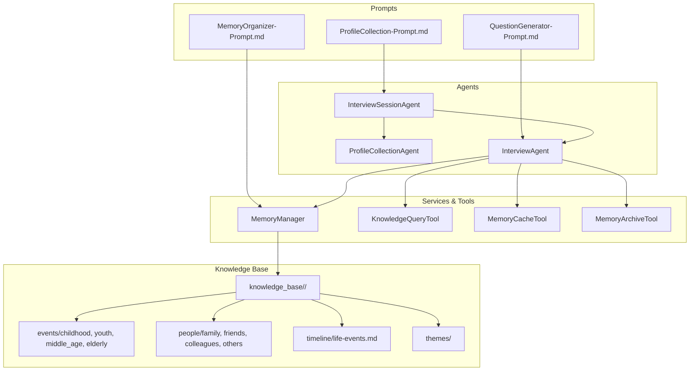
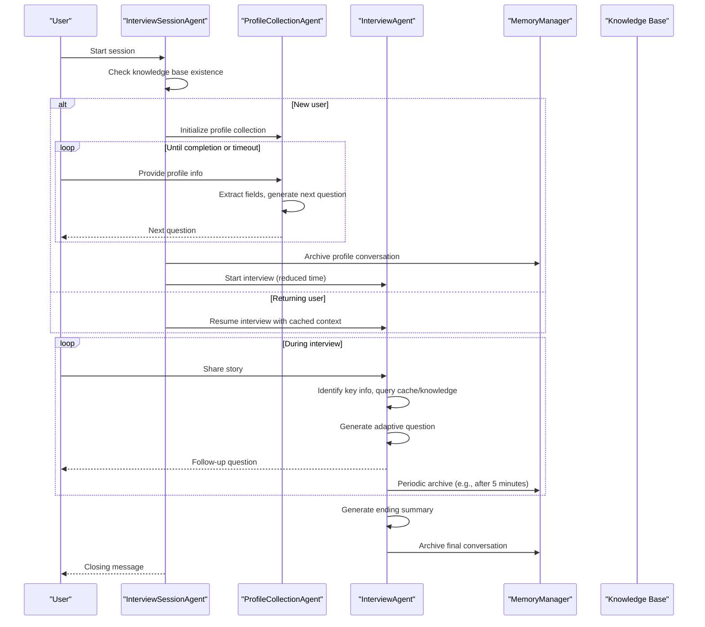
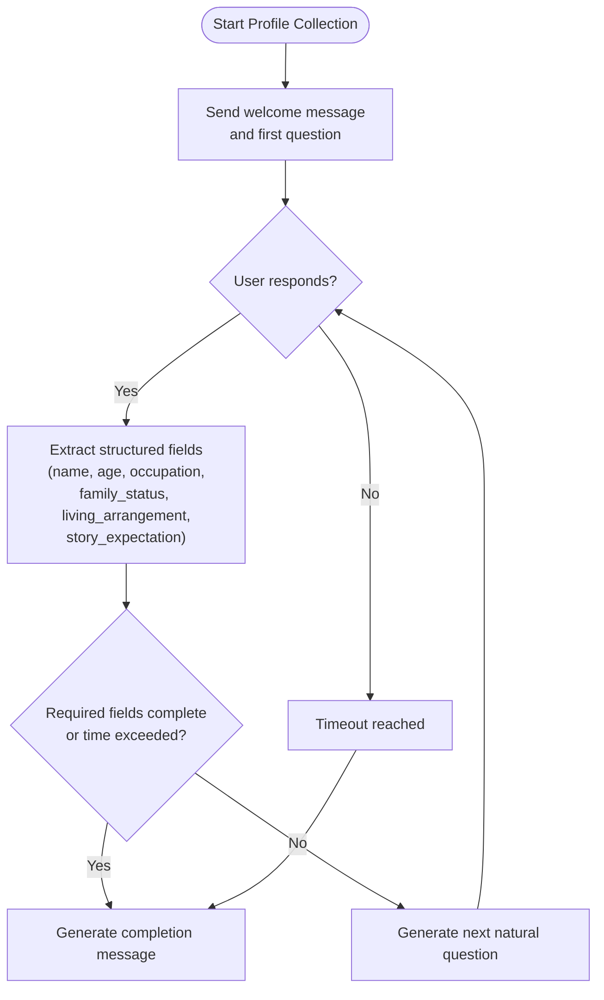
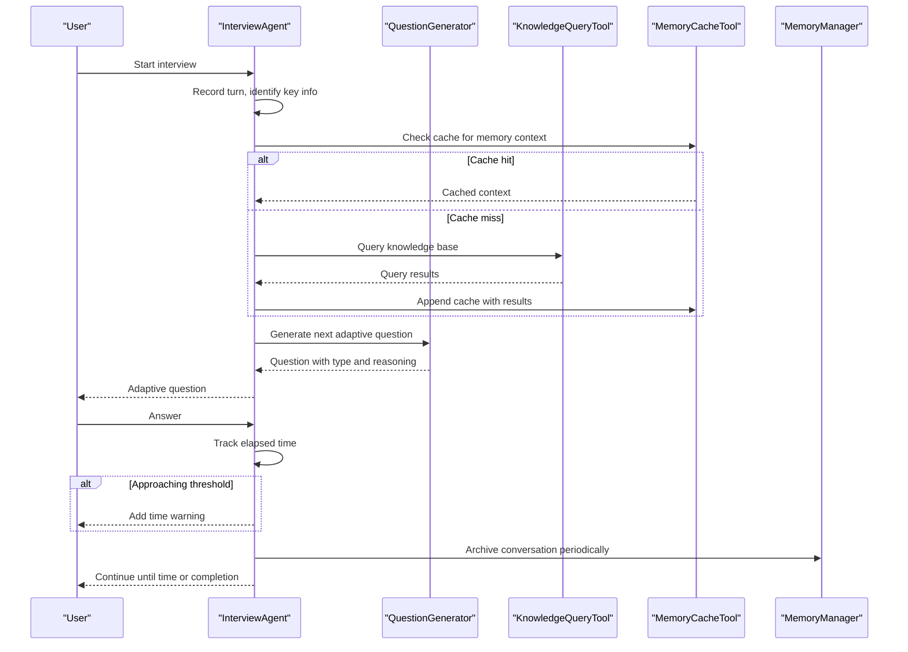
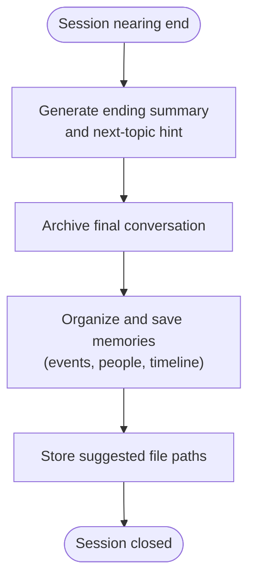
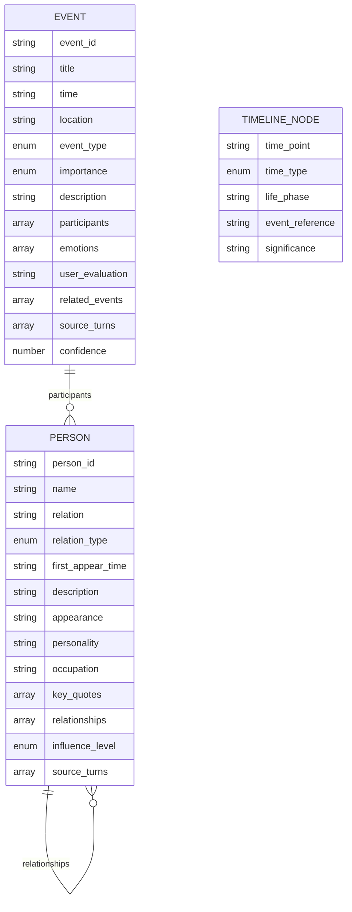
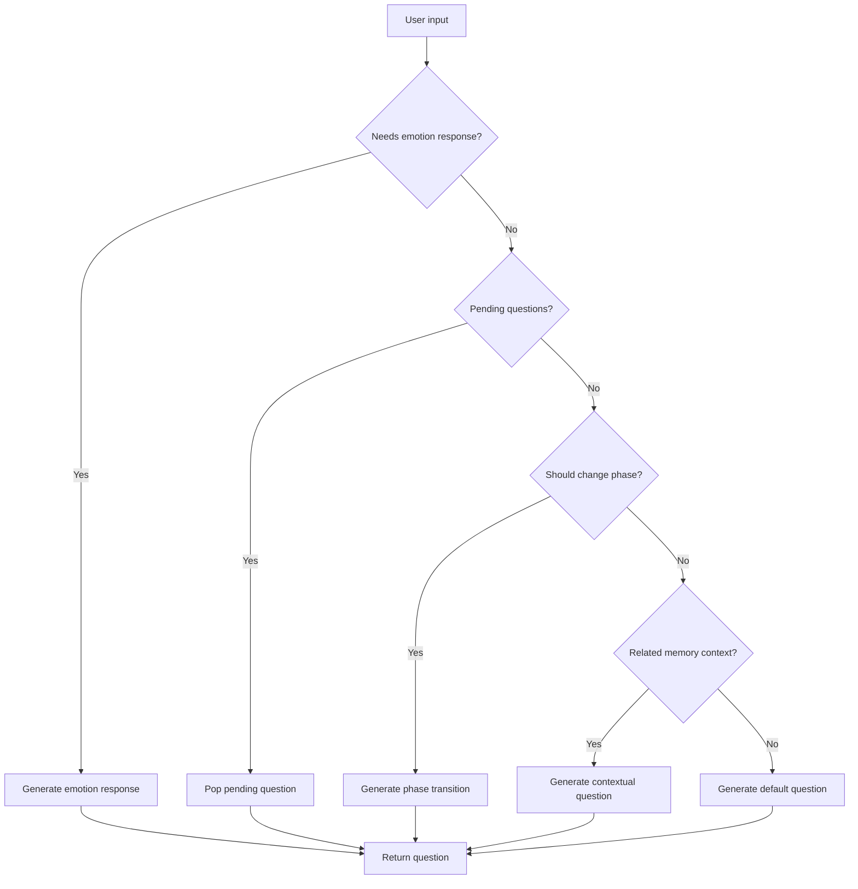
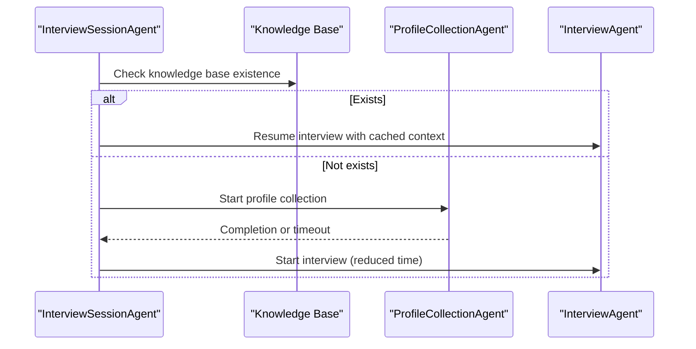
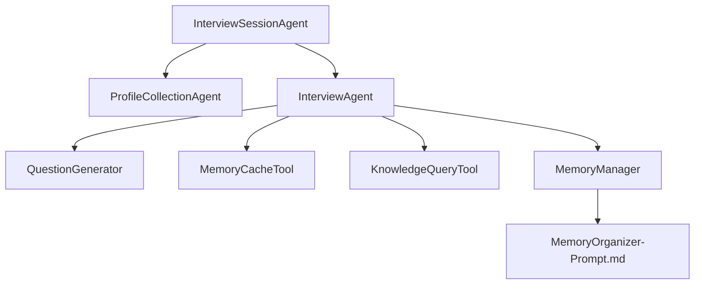

# Use Cases and Examples

<cite>
**Referenced Files in This Document**
- [ProfileCollection-Prompt.md](file://Prompts/ProfileCollection-Prompt.md)
- [QuestionGenerator-Prompt.md](file://Prompts/QuestionGenerator-Prompt.md)
- [MemoryOrganizer-Prompt.md](file://Prompts/MemoryOrganizer-Prompt.md)
- [profile_collection_agent.py](file://src/agents/profile_collection_agent.py)
- [interview_agent.py](file://src/agents/interview_agent.py)
- [interview_session_agent.py](file://src/agents/interview_session_agent.py)
- [session_state.py](file://src/models/session_state.py)
- [phase_type.py](file://src/enums/phase_type.py)
- [integration_test_new_user.py](file://integration_test_new_user.py)
- [test_integration.py](file://test_integration.py)
- [四合院家庭生活.md](file://knowledge_base/test_user001/events/childhood/四合院家庭生活.md)
- [母亲.md](file://knowledge_base/test_user001/people/family/母亲.md)
- [life-events.md](file://knowledge_base/test_user001/timeline/life-events.md)
- [conversation_2026-04-26_14-34-15.json](file://knowledge_base/test_user002/conversation_2026-04-26_14-34-15.json)
- [conversation_2026-04-26_16-51-04.json](file://knowledge_base/test_user002/conversation_2026-04-26_16-51-04.json)
</cite>

## Table of Contents
1. [Introduction](#introduction)
2. [Project Structure](#project-structure)
3. [Core Components](#core-components)
4. [Architecture Overview](#architecture-overview)
5. [Detailed Component Analysis](#detailed-component-analysis)
6. [Dependency Analysis](#dependency-analysis)
7. [Performance Considerations](#performance-considerations)
8. [Troubleshooting Guide](#troubleshooting-guide)
9. [Conclusion](#conclusion)
10. [Appendices](#appendices)

## Introduction
This document presents practical use cases and examples for the elderly memoir system, focusing on three primary scenarios:
- New user onboarding with profile collection
- Regular interview sessions with time management
- Session completion with memory archiving

It also demonstrates how the system organizes real-life stories into structured formats (childhood memories, family relationships, life events), showcases adaptive questioning techniques, and illustrates integration patterns across user profiles and cultural contexts. Sample outputs and expected behaviors are provided for typical interview scenarios, including time-constrained conversations and memory-rich discussions.

## Project Structure
The system is composed of:
- Prompt templates that define roles, tasks, and dynamic variable injection for profile collection, memory organization, and question generation
- Agents that orchestrate user onboarding, ongoing interviews, and session lifecycle
- Services and tools that manage memory, knowledge queries, and archival
- A knowledge base that stores structured memories, people, timelines, and themes

**Diagram sources**
- [ProfileCollection-Prompt.md:1-405](file://Prompts/ProfileCollection-Prompt.md#L1-L405)
- [QuestionGenerator-Prompt.md:1-352](file://Prompts/QuestionGenerator-Prompt.md#L1-L352)
- [MemoryOrganizer-Prompt.md:1-773](file://Prompts/MemoryOrganizer-Prompt.md#L1-L773)
- [interview_session_agent.py:1-482](file://src/agents/interview_session_agent.py#L1-L482)
- [profile_collection_agent.py:1-275](file://src/agents/profile_collection_agent.py#L1-L275)
- [interview_agent.py:1-346](file://src/agents/interview_agent.py#L1-L346)

**Section sources**
- [ProfileCollection-Prompt.md:1-405](file://Prompts/ProfileCollection-Prompt.md#L1-L405)
- [QuestionGenerator-Prompt.md:1-352](file://Prompts/QuestionGenerator-Prompt.md#L1-L352)
- [MemoryOrganizer-Prompt.md:1-773](file://Prompts/MemoryOrganizer-Prompt.md#L1-L773)
- [interview_session_agent.py:1-482](file://src/agents/interview_session_agent.py#L1-L482)
- [profile_collection_agent.py:1-275](file://src/agents/profile_collection_agent.py#L1-L275)
- [interview_agent.py:1-346](file://src/agents/interview_agent.py#L1-L346)

## Core Components
- ProfileCollectionAgent: Guides new users through a warm, progressive profile collection process, extracting structured fields and transitioning to the interview stage upon completion or timeout.
- InterviewAgent: Manages time-driven interviews, adaptive questioning, memory caching, knowledge querying, and session summarization.
- InterviewSessionAgent: Orchestrates the full lifecycle—initialization detection, profile collection, interview, and ending—while coordinating time limits and archival.
- MemoryManager and Organizer: Transform interview content into structured memories, linking events, people, timelines, and themes.
- Knowledge Base: Stores organized memories in a standardized directory structure for retrieval and cross-referencing.

**Section sources**
- [profile_collection_agent.py:1-275](file://src/agents/profile_collection_agent.py#L1-L275)
- [interview_agent.py:1-346](file://src/agents/interview_agent.py#L1-L346)
- [interview_session_agent.py:1-482](file://src/agents/interview_session_agent.py#L1-L482)
- [MemoryOrganizer-Prompt.md:1-773](file://Prompts/MemoryOrganizer-Prompt.md#L1-L773)

## Architecture Overview
The system follows a layered architecture:
- Prompt-driven orchestration defines roles and dynamic variable injection
- Agent layer handles conversation flow and state transitions
- Service layer manages memory, caching, and knowledge queries
- Persistent storage maintains structured knowledge base

**Diagram sources**
- [interview_session_agent.py:112-392](file://src/agents/interview_session_agent.py#L112-L392)
- [profile_collection_agent.py:98-166](file://src/agents/profile_collection_agent.py#L98-L166)
- [interview_agent.py:80-184](file://src/agents/interview_agent.py#L80-L184)
- [MemoryOrganizer-Prompt.md:282-364](file://Prompts/MemoryOrganizer-Prompt.md#L282-L364)

## Detailed Component Analysis

### Use Case 1: New User Onboarding with Profile Collection
- Objective: Collect essential profile information in a warm, progressive manner to enable personalized interviewing.
- Key behaviors:
  - Warm welcome and immediate first question
  - Progressive extraction of required fields (name, age, occupation, family status, living arrangement, story expectation)
  - Flexible handling of sensitive topics and privacy
  - Completion on either full field coverage or time limit (default 5 minutes)
- Expected outputs:
  - Structured profile fields stored via MemoryManager
  - Initial conversation archived as foundation for future interviews
  - Transition to interview stage with reduced time allocation for new users

**Diagram sources**
- [ProfileCollection-Prompt.md:44-96](file://Prompts/ProfileCollection-Prompt.md#L44-L96)
- [ProfileCollection-Prompt.md:100-210](file://Prompts/ProfileCollection-Prompt.md#L100-L210)
- [ProfileCollection-Prompt.md:213-330](file://Prompts/ProfileCollection-Prompt.md#L213-L330)
- [profile_collection_agent.py:98-166](file://src/agents/profile_collection_agent.py#L98-L166)

**Section sources**
- [ProfileCollection-Prompt.md:10-41](file://Prompts/ProfileCollection-Prompt.md#L10-L41)
- [ProfileCollection-Prompt.md:167-210](file://Prompts/ProfileCollection-Prompt.md#L167-L210)
- [profile_collection_agent.py:130-166](file://src/agents/profile_collection_agent.py#L130-L166)
- [integration_test_new_user.py:39-176](file://integration_test_new_user.py#L39-L176)

### Use Case 2: Regular Interview Sessions with Time Management
- Objective: Conduct time-aware, adaptive interviews that respect user energy and preserve memory quality.
- Key behaviors:
  - Adaptive questioning based on emotion, memory context, and interview strategy
  - Time warnings near thresholds (e.g., 80% of allocated time)
  - Periodic archival during the session (e.g., after 5 minutes)
  - Natural transitions between life phases and topics
- Expected outputs:
  - Incremental memory organization into events, people, and timelines
  - Session summaries and next-topic hints
  - Persistent archives for continuity across sessions

**Diagram sources**
- [interview_agent.py:115-184](file://src/agents/interview_agent.py#L115-L184)
- [interview_agent.py:186-243](file://src/agents/interview_agent.py#L186-L243)
- [QuestionGenerator-Prompt.md:10-89](file://Prompts/QuestionGenerator-Prompt.md#L10-L89)
- [QuestionGenerator-Prompt.md:205-241](file://Prompts/QuestionGenerator-Prompt.md#L205-L241)

**Section sources**
- [QuestionGenerator-Prompt.md:49-89](file://Prompts/QuestionGenerator-Prompt.md#L49-L89)
- [interview_agent.py:115-184](file://src/agents/interview_agent.py#L115-L184)
- [session_state.py:24-82](file://src/models/session_state.py#L24-L82)

### Use Case 3: Session Completion with Memory Archiving
- Objective: Finalize the session with a summary, next-topic hint, and comprehensive archival.
- Key behaviors:
  - Generate closing message and session summary
  - Archive final conversation with metadata
  - Trigger post-session memory organization
- Expected outputs:
  - Structured memory updates (events, people, timeline nodes)
  - Storage suggestions for new files
  - Processing summary and confidence metrics

**Diagram sources**
- [interview_agent.py:244-272](file://src/agents/interview_agent.py#L244-L272)
- [interview_session_agent.py:369-392](file://src/agents/interview_session_agent.py#L369-L392)
- [MemoryOrganizer-Prompt.md:282-364](file://Prompts/MemoryOrganizer-Prompt.md#L282-L364)

**Section sources**
- [interview_agent.py:244-272](file://src/agents/interview_agent.py#L244-L272)
- [interview_session_agent.py:369-392](file://src/agents/interview_session_agent.py#L369-L392)
- [MemoryOrganizer-Prompt.md:83-183](file://Prompts/MemoryOrganizer-Prompt.md#L83-L183)

### Memory Organization Patterns
- Time-line dimension: Establish or update life-phase nodes with precise or approximate timestamps and significance markers.
- Events dimension: Extract complete event records with time, location, participants, importance, emotions, user evaluation, and related events.
- People dimension: Identify and enrich人物 profiles with relationships, influence level, and key quotes.
- Profile updates: Enhance protagonist’s key life events, personality traits, and values hints.
- Storage suggestions: Provide canonical file paths for new events and people, ensuring consistent organization.

**Diagram sources**
- [MemoryOrganizer-Prompt.md:414-514](file://Prompts/MemoryOrganizer-Prompt.md#L414-L514)

**Section sources**
- [MemoryOrganizer-Prompt.md:57-192](file://Prompts/MemoryOrganizer-Prompt.md#L57-L192)
- [MemoryOrganizer-Prompt.md:518-556](file://Prompts/MemoryOrganizer-Prompt.md#L518-L556)

### Adaptive Questioning Techniques
- Emotion-first responses: When user emotion requires special handling, generate empathetic responses before proceeding with topic exploration.
- Contextual follow-ups: Use memory context to generate relevant follow-up questions that deepen storytelling.
- Phase transitions: Encourage natural progression between life stages without forcing jumps.
- Strategy alignment: Align questioning with interview strategy (e.g., sparkle-first, timeline classic, thematic divergent).

**Diagram sources**
- [QuestionGenerator-Prompt.md:284-302](file://Prompts/QuestionGenerator-Prompt.md#L284-L302)
- [QuestionGenerator-Prompt.md:10-89](file://Prompts/QuestionGenerator-Prompt.md#L10-L89)

**Section sources**
- [QuestionGenerator-Prompt.md:49-89](file://Prompts/QuestionGenerator-Prompt.md#L49-L89)
- [QuestionGenerator-Prompt.md:284-302](file://Prompts/QuestionGenerator-Prompt.md#L284-L302)

### Integration Examples Across Profiles and Cultural Contexts
- New user integration: The system initializes a fresh knowledge base for each user ID, runs profile collection, and transitions to interview with reduced time allocation.
- Returning user integration: The system detects existing knowledge base structure, resumes the interview with cached context, and continues from where the user left off.
- Cross-cultural adaptability: Prompts emphasize respectful, warm, and natural tones suitable for diverse cultural backgrounds. The agent adjusts questioning style based on emotion and memory context.

**Diagram sources**
- [interview_session_agent.py:121-177](file://src/agents/interview_session_agent.py#L121-L177)
- [interview_session_agent.py:178-241](file://src/agents/interview_session_agent.py#L178-L241)
- [interview_session_agent.py:243-340](file://src/agents/interview_session_agent.py#L243-L340)

**Section sources**
- [interview_session_agent.py:121-177](file://src/agents/interview_session_agent.py#L121-L177)
- [integration_test_new_user.py:39-176](file://integration_test_new_user.py#L39-L176)

## Dependency Analysis
- InterviewSessionAgent depends on ProfileCollectionAgent and InterviewAgent to manage lifecycle and transitions.
- InterviewAgent depends on QuestionGenerator, MemoryCacheTool, KnowledgeQueryTool, and MemoryManager for adaptive questioning and memory organization.
- MemoryManager depends on LLMService and repository abstractions to transform and persist memories.

**Diagram sources**
- [interview_session_agent.py:33-111](file://src/agents/interview_session_agent.py#L33-L111)
- [interview_agent.py:16-78](file://src/agents/interview_agent.py#L16-L78)
- [MemoryOrganizer-Prompt.md:282-364](file://Prompts/MemoryOrganizer-Prompt.md#L282-L364)

**Section sources**
- [interview_session_agent.py:33-111](file://src/agents/interview_session_agent.py#L33-L111)
- [interview_agent.py:16-78](file://src/agents/interview_agent.py#L16-L78)

## Performance Considerations
- Time-aware design: InterviewAgent enforces strict time limits with early warnings to prevent cognitive fatigue.
- Incremental archival: Periodic saving reduces risk and enables quick recovery.
- Caching and knowledge querying: MemoryCacheTool minimizes repeated queries and improves responsiveness.
- Structured outputs: MemoryOrganizer’s schema ensures efficient indexing and retrieval.

## Troubleshooting Guide
- Profile collection stalls: Ensure required fields are progressing; if stuck, revisit the extraction and question generation prompts for clarity.
- InterviewAgent timeouts: Verify elapsed ratio checks and time warning insertion logic.
- Memory organization failures: Confirm LLM service invocation and fallback handling; review storage suggestions and processing summaries.
- Knowledge base detection issues: Validate directory structure and presence of non-index Markdown files.

**Section sources**
- [profile_collection_agent.py:214-226](file://src/agents/profile_collection_agent.py#L214-L226)
- [interview_agent.py:170-184](file://src/agents/interview_agent.py#L170-L184)
- [MemoryOrganizer-Prompt.md:324-337](file://Prompts/MemoryOrganizer-Prompt.md#L324-L337)

## Conclusion
The elderly memoir system provides a robust framework for collecting, organizing, and preserving personal histories. Through structured onboarding, adaptive interviewing, and continuous archival, it supports both new and returning users while maintaining cultural sensitivity and emotional resonance. The examples and diagrams in this document illustrate practical workflows and expected outcomes for typical interview scenarios.

## Appendices

### Example: Structured Story Organization
- Childhood memories: Organized under events/childhood with family-type entries and linked timeline nodes.
- Family relationships: Enriched person profiles with relationships, influence levels, and key quotes.
- Life events: Chronologically mapped in timeline/life-events.md with cross-references to detailed event pages.

**Section sources**
- [四合院家庭生活.md:1-34](file://knowledge_base/test_user001/events/childhood/四合院家庭生活.md#L1-L34)
- [母亲.md:1-23](file://knowledge_base/test_user001/people/family/母亲.md#L1-L23)
- [life-events.md:1-12](file://knowledge_base/test_user001/timeline/life-events.md#L1-L12)

### Example: Conversation Flows
- Memory-rich session: Demonstrates deep storytelling around military service, with adaptive questioning and time warnings.
- Transition to new topic: Illustrates natural progression from war experiences to post-war relocation and family life.

**Section sources**
- [conversation_2026-04-26_14-34-15.json:1-67](file://knowledge_base/test_user002/conversation_2026-04-26_14-34-15.json#L1-L67)
- [conversation_2026-04-26_16-51-04.json:1-107](file://knowledge_base/test_user002/conversation_2026-04-26_16-51-04.json#L1-L107)

### Example: Lifecycle Integration Test
- End-to-end flow for a new user, including initialization, profile collection, interview, and archival.

**Section sources**
- [integration_test_new_user.py:39-176](file://integration_test_new_user.py#L39-L176)