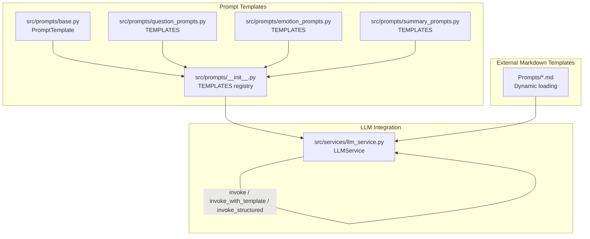
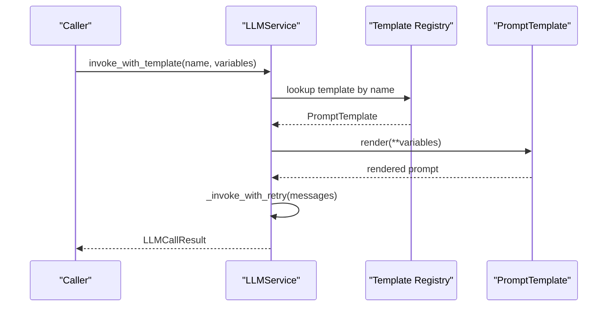
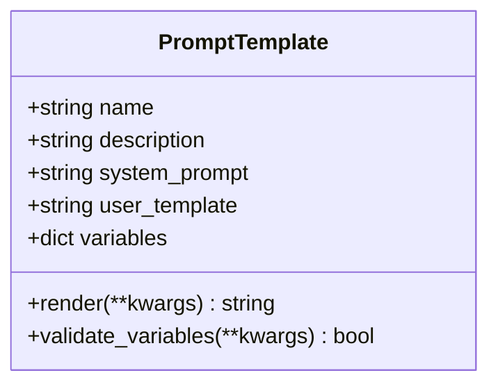
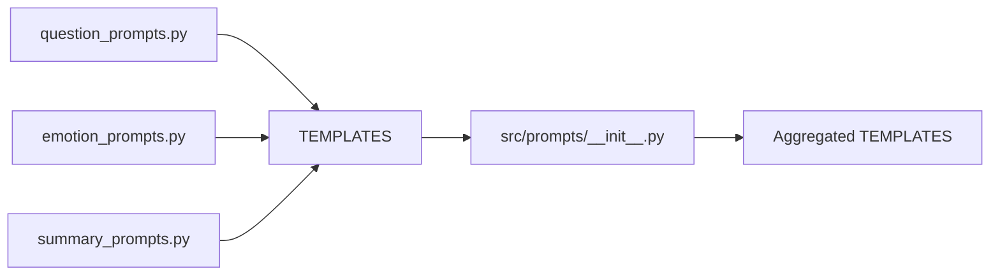
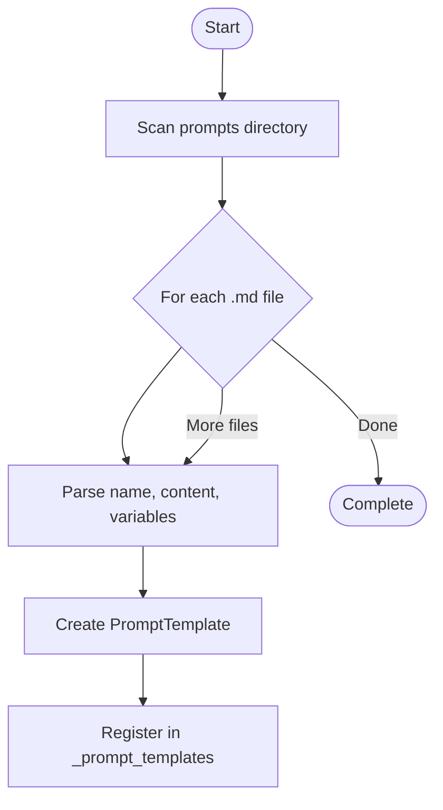
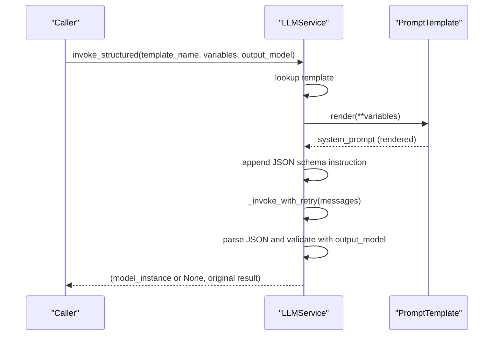
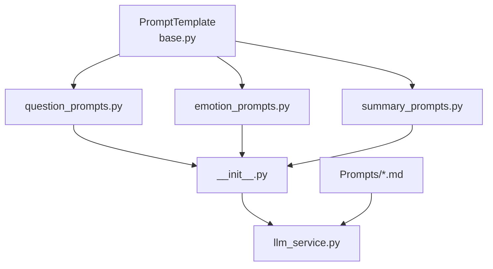
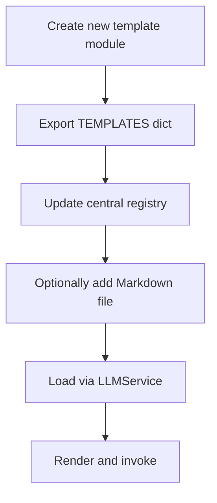
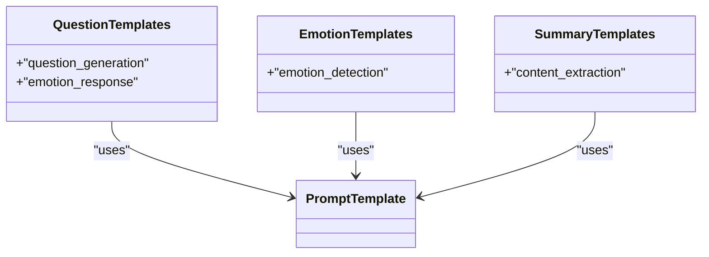

# Base Prompt System and Template Management

<cite>
**Referenced Files in This Document**
- [base.py](file://src/prompts/base.py)
- [__init__.py](file://src/prompts/__init__.py)
- [question_prompts.py](file://src/prompts/question_prompts.py)
- [emotion_prompts.py](file://src/prompts/emotion_prompts.py)
- [summary_prompts.py](file://src/prompts/summary_prompts.py)
- [llm_service.py](file://src/services/llm_service.py)
- [test_llm_service.py](file://tests/test_llm_service.py)
- [verify_llm_service.py](file://verify_llm_service.py)
- [QuestionGenerator-Prompt.md](file://Prompts/QuestionGenerator-Prompt.md)
- [MemoryOrganizer-Prompt.md](file://Prompts/MemoryOrganizer-Prompt.md)
- [ProfileCollection-Prompt.md](file://Prompts/ProfileCollection-Prompt.md)
</cite>

## Table of Contents
1. [Introduction](#introduction)
2. [Project Structure](#project-structure)
3. [Core Components](#core-components)
4. [Architecture Overview](#architecture-overview)
5. [Detailed Component Analysis](#detailed-component-analysis)
6. [Dependency Analysis](#dependency-analysis)
7. [Performance Considerations](#performance-considerations)
8. [Troubleshooting Guide](#troubleshooting-guide)
9. [Conclusion](#conclusion)
10. [Appendices](#appendices)

## Introduction
This document explains the base prompt system and template management framework used to define, register, load, and render prompts across the system. It covers:
- The unified PromptTemplate base class and its validation/rendering behavior
- The template registration and aggregation mechanism
- The dynamic rendering pipeline via LLMService
- Inheritance patterns and specialization for different prompt types
- Template validation, error handling, and fallback strategies
- Practical integration examples for adding new prompt templates
- Guidance for extending the system and introducing new template types

## Project Structure
The prompt system is composed of:
- A base template definition in a dedicated module
- Modular template collections grouped by domain
- A central registry that aggregates all templates
- An LLM service that loads templates from both Python modules and Markdown files, renders them, and invokes the underlying model

**Diagram sources**
- [base.py:6-33](file://src/prompts/base.py#L6-L33)
- [question_prompts.py:1-86](file://src/prompts/question_prompts.py#L1-L86)
- [emotion_prompts.py:1-38](file://src/prompts/emotion_prompts.py#L1-L38)
- [summary_prompts.py:1-49](file://src/prompts/summary_prompts.py#L1-L49)
- [__init__.py:1-12](file://src/prompts/__init__.py#L1-L12)
- [llm_service.py:126-161](file://src/services/llm_service.py#L126-L161)
- [QuestionGenerator-Prompt.md:1-352](file://Prompts/QuestionGenerator-Prompt.md#L1-L352)

**Section sources**
- [base.py:1-33](file://src/prompts/base.py#L1-L33)
- [__init__.py:1-12](file://src/prompts/__init__.py#L1-L12)
- [llm_service.py:126-161](file://src/services/llm_service.py#L126-L161)

## Core Components
- PromptTemplate: Defines the schema and behavior for all prompt templates, including rendering and variable validation.
- Template Collections: Domain-specific dictionaries of PromptTemplate instances.
- Central Registry: Aggregates all template collections into a single dictionary for lookup.
- LLMService: Loads templates from Python modules and Markdown files, renders them, and executes model calls with retry and structured output support.

Key responsibilities:
- Unified interface for different prompt types
- Dynamic loading of external Markdown templates
- Safe substitution of variables during rendering
- Structured output parsing with Pydantic models
- Error handling and fallback strategies

**Section sources**
- [base.py:6-33](file://src/prompts/base.py#L6-L33)
- [__init__.py:1-12](file://src/prompts/__init__.py#L1-L12)
- [llm_service.py:126-161](file://src/services/llm_service.py#L126-L161)
- [llm_service.py:293-325](file://src/services/llm_service.py#L293-L325)
- [llm_service.py:327-398](file://src/services/llm_service.py#L327-L398)

## Architecture Overview
The prompt system follows a layered architecture:
- Base Layer: PromptTemplate defines the contract for all templates.
- Registration Layer: Individual template modules export TEMPLATES dictionaries; the central registry merges them.
- Integration Layer: LLMService loads templates from both Python modules and Markdown files, validates variables, renders prompts, and invokes the model with retries and structured output parsing.

**Diagram sources**
- [llm_service.py:293-325](file://src/services/llm_service.py#L293-L325)
- [llm_service.py:400-437](file://src/services/llm_service.py#L400-L437)
- [base.py:24-27](file://src/prompts/base.py#L24-L27)

**Section sources**
- [llm_service.py:126-161](file://src/services/llm_service.py#L126-L161)
- [llm_service.py:293-325](file://src/services/llm_service.py#L293-L325)
- [llm_service.py:327-398](file://src/services/llm_service.py#L327-L398)

## Detailed Component Analysis

### PromptTemplate Base Class
PromptTemplate encapsulates:
- Name and description
- System prompt content
- User template placeholder
- Variable metadata for validation

Rendering behavior:
- Uses safe substitution to replace placeholders with provided variables
- Validates completeness of required variables against declared metadata

**Diagram sources**
- [base.py:6-33](file://src/prompts/base.py#L6-L33)

**Section sources**
- [base.py:6-33](file://src/prompts/base.py#L6-L33)

### Template Registration and Aggregation
Template collections are defined per domain and aggregated centrally:
- question_prompts.py exports TEMPLATES with question generation and emotion response templates
- emotion_prompts.py exports TEMPLATES with emotion detection template
- summary_prompts.py exports TEMPLATES with content extraction template
- src/prompts/__init__.py merges all collections into a single registry

**Diagram sources**
- [question_prompts.py:1-86](file://src/prompts/question_prompts.py#L1-L86)
- [emotion_prompts.py:1-38](file://src/prompts/emotion_prompts.py#L1-L38)
- [summary_prompts.py:1-49](file://src/prompts/summary_prompts.py#L1-L49)
- [__init__.py:1-12](file://src/prompts/__init__.py#L1-L12)

**Section sources**
- [question_prompts.py:1-86](file://src/prompts/question_prompts.py#L1-L86)
- [emotion_prompts.py:1-38](file://src/prompts/emotion_prompts.py#L1-L38)
- [summary_prompts.py:1-49](file://src/prompts/summary_prompts.py#L1-L49)
- [__init__.py:1-12](file://src/prompts/__init__.py#L1-L12)

### Dynamic Loading from Markdown Files
LLMService dynamically discovers and loads external Markdown templates:
- Scans the prompts directory for .md files
- Parses template name, content, and variable table
- Creates PromptTemplate instances and registers them under their names

**Diagram sources**
- [llm_service.py:148-161](file://src/services/llm_service.py#L148-L161)
- [llm_service.py:163-216](file://src/services/llm_service.py#L163-L216)

**Section sources**
- [llm_service.py:126-161](file://src/services/llm_service.py#L126-L161)
- [llm_service.py:163-216](file://src/services/llm_service.py#L163-L216)

### Rendering and Invocation Pipeline
LLMService supports three primary invocation modes:
- Basic invoke: sends a raw prompt with optional system prompt/history
- invoke_with_template: resolves a named template, renders it, and sends to the model
- invoke_structured: renders a template, appends a JSON schema instruction, parses the response into a Pydantic model

**Diagram sources**
- [llm_service.py:327-398](file://src/services/llm_service.py#L327-L398)

**Section sources**
- [llm_service.py:225-292](file://src/services/llm_service.py#L225-L292)
- [llm_service.py:293-325](file://src/services/llm_service.py#L293-L325)
- [llm_service.py:327-398](file://src/services/llm_service.py#L327-L398)

### Specialized Prompt Implementations
- Question Generation: A multi-purpose template supporting strategy-aware question generation and emotion-aware responses
- Emotion Detection: A template focused on extracting structured emotion metadata from conversation turns
- Content Extraction: A template for extracting structured information (events, people, themes) from dialogue

These are defined as PromptTemplate instances and registered via their respective modules’ TEMPLATES dictionaries.

**Section sources**
- [question_prompts.py:1-86](file://src/prompts/question_prompts.py#L1-L86)
- [emotion_prompts.py:1-38](file://src/prompts/emotion_prompts.py#L1-L38)
- [summary_prompts.py:1-49](file://src/prompts/summary_prompts.py#L1-L49)

### External Markdown-Based Templates
External templates are loaded dynamically from Markdown files. These templates:
- Define a template name and content block
- Optionally include a variable table describing placeholders
- Are parsed and registered under their declared names

Examples of external templates include:
- QuestionGenerator-Prompt.md
- MemoryOrganizer-Prompt.md
- ProfileCollection-Prompt.md

These files demonstrate advanced prompting patterns, structured output expectations, and integration with service components.

**Section sources**
- [QuestionGenerator-Prompt.md:1-352](file://Prompts/QuestionGenerator-Prompt.md#L1-L352)
- [MemoryOrganizer-Prompt.md:1-773](file://Prompts/MemoryOrganizer-Prompt.md#L1-L773)
- [ProfileCollection-Prompt.md:1-405](file://Prompts/ProfileCollection-Prompt.md#L1-L405)

## Dependency Analysis
The system exhibits low coupling and high cohesion:
- PromptTemplate is a standalone Pydantic model with minimal dependencies
- Template modules depend only on the base class
- LLMService depends on the base class and the central registry
- External Markdown templates are decoupled from the Python modules and loaded dynamically

**Diagram sources**
- [base.py:6-33](file://src/prompts/base.py#L6-L33)
- [question_prompts.py:1-86](file://src/prompts/question_prompts.py#L1-L86)
- [emotion_prompts.py:1-38](file://src/prompts/emotion_prompts.py#L1-L38)
- [summary_prompts.py:1-49](file://src/prompts/summary_prompts.py#L1-L49)
- [__init__.py:1-12](file://src/prompts/__init__.py#L1-L12)
- [llm_service.py:126-161](file://src/services/llm_service.py#L126-L161)

**Section sources**
- [base.py:1-33](file://src/prompts/base.py#L1-L33)
- [llm_service.py:126-161](file://src/services/llm_service.py#L126-L161)

## Performance Considerations
- Rendering cost: Safe substitution is linear in the size of the template and number of variables; keep variable sets minimal and avoid excessive nesting.
- Token usage: LLMService tracks token usage and exposes statistics; monitor usage patterns to optimize prompt sizes.
- Retry strategy: Exponential backoff reduces load spikes during transient failures; tune max_retries according to SLAs.
- Structured output parsing: JSON extraction and validation add CPU overhead; cache frequently used templates and reuse rendered system prompts where appropriate.

[No sources needed since this section provides general guidance]

## Troubleshooting Guide
Common issues and resolutions:
- Template not found: Ensure the template name matches the registry key and that the template was loaded from either Python modules or Markdown files.
- Variable validation failure: Confirm that all keys declared in the template’s variables metadata are provided during rendering.
- Structured output parsing errors: Verify that the model response adheres to the expected JSON schema; the system attempts to extract JSON blocks but may fail on malformed outputs.
- Invocation failures: LLMService retries on transient exceptions; check logs for repeated failures and adjust retry parameters.

Validation and verification artifacts:
- Tests confirm successful loading of multiple templates and proper error propagation on failures.
- Verification scripts demonstrate template creation, rendering, variable validation, and LLMService initialization.

**Section sources**
- [test_llm_service.py:169-187](file://tests/test_llm_service.py#L169-L187)
- [test_llm_service.py:179-187](file://tests/test_llm_service.py#L179-L187)
- [verify_llm_service.py:59-121](file://verify_llm_service.py#L59-L121)

## Conclusion
The prompt system provides a robust, extensible foundation for managing diverse prompting needs:
- A unified PromptTemplate base ensures consistent rendering and validation
- Modular template collections enable domain specialization
- Dynamic loading from Markdown files supports rapid iteration and documentation-driven development
- LLMService offers a cohesive integration layer with retry, structured output, and observability features

[No sources needed since this section summarizes without analyzing specific files]

## Appendices

### Implementation Examples: Adding a New Prompt Template
Steps to integrate a new template:
1. Define a new PromptTemplate in a dedicated module (e.g., new_prompts.py) and export it in a TEMPLATES dictionary.
2. Ensure the template declares all required variables in the variables metadata.
3. Add the new module’s TEMPLATES to the central registry in src/prompts/__init__.py.
4. Alternatively, place a Markdown file in the prompts directory with a template name and content block; LLMService will load it automatically.
5. Use LLMService.invoke_with_template or invoke_structured to render and execute the template.

**Diagram sources**
- [__init__.py:1-12](file://src/prompts/__init__.py#L1-L12)
- [llm_service.py:126-161](file://src/services/llm_service.py#L126-L161)

**Section sources**
- [__init__.py:1-12](file://src/prompts/__init__.py#L1-L12)
- [llm_service.py:126-161](file://src/services/llm_service.py#L126-L161)

### Relationship Between Base Classes and Specializations
- Base class: PromptTemplate defines the contract for all templates
- Specializations: Domain-specific modules (question_prompts.py, emotion_prompts.py, summary_prompts.py) extend the system with concrete templates
- Central registry: Aggregates all specializations for unified access

**Diagram sources**
- [base.py:6-33](file://src/prompts/base.py#L6-L33)
- [question_prompts.py:1-86](file://src/prompts/question_prompts.py#L1-L86)
- [emotion_prompts.py:1-38](file://src/prompts/emotion_prompts.py#L1-L38)
- [summary_prompts.py:1-49](file://src/prompts/summary_prompts.py#L1-L49)

**Section sources**
- [base.py:6-33](file://src/prompts/base.py#L6-L33)
- [question_prompts.py:1-86](file://src/prompts/question_prompts.py#L1-L86)
- [emotion_prompts.py:1-38](file://src/prompts/emotion_prompts.py#L1-L38)
- [summary_prompts.py:1-49](file://src/prompts/summary_prompts.py#L1-L49)

### Template Validation, Error Handling, and Fallback Mechanisms
- Validation: PromptTemplate.validate_variables compares required vs provided keys to prevent runtime substitution errors.
- Error handling: LLMService wraps model invocations with retry logic and records call results with success flags and error messages.
- Fallback: External templates (Markdown) are parsed and registered; if parsing fails, the system logs warnings and continues loading other templates.

**Section sources**
- [base.py:29-33](file://src/prompts/base.py#L29-L33)
- [llm_service.py:400-437](file://src/services/llm_service.py#L400-L437)
- [llm_service.py:157-158](file://src/services/llm_service.py#L157-L158)