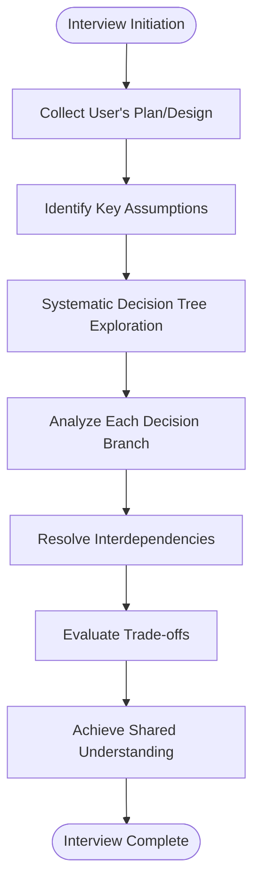
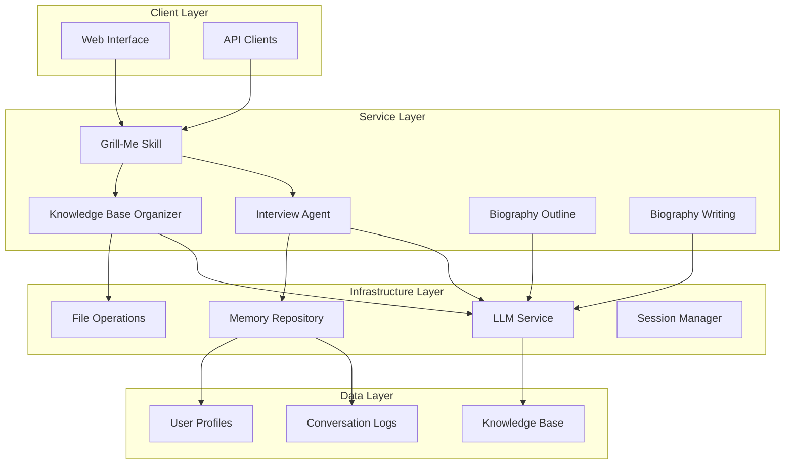
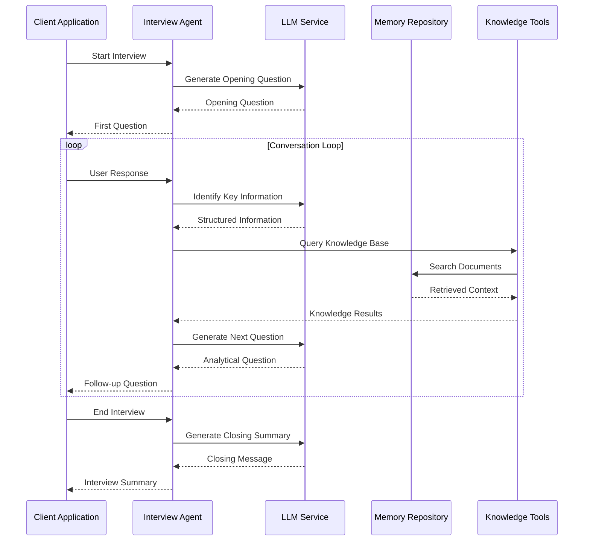
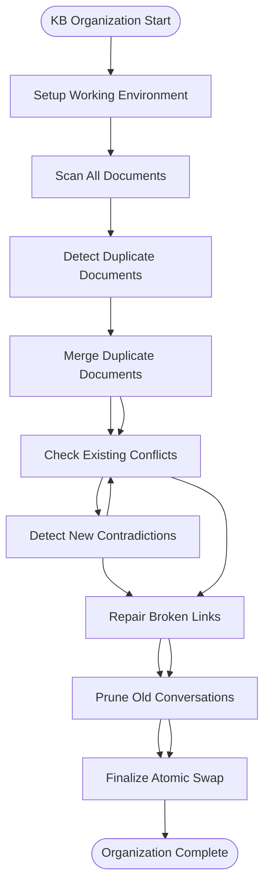
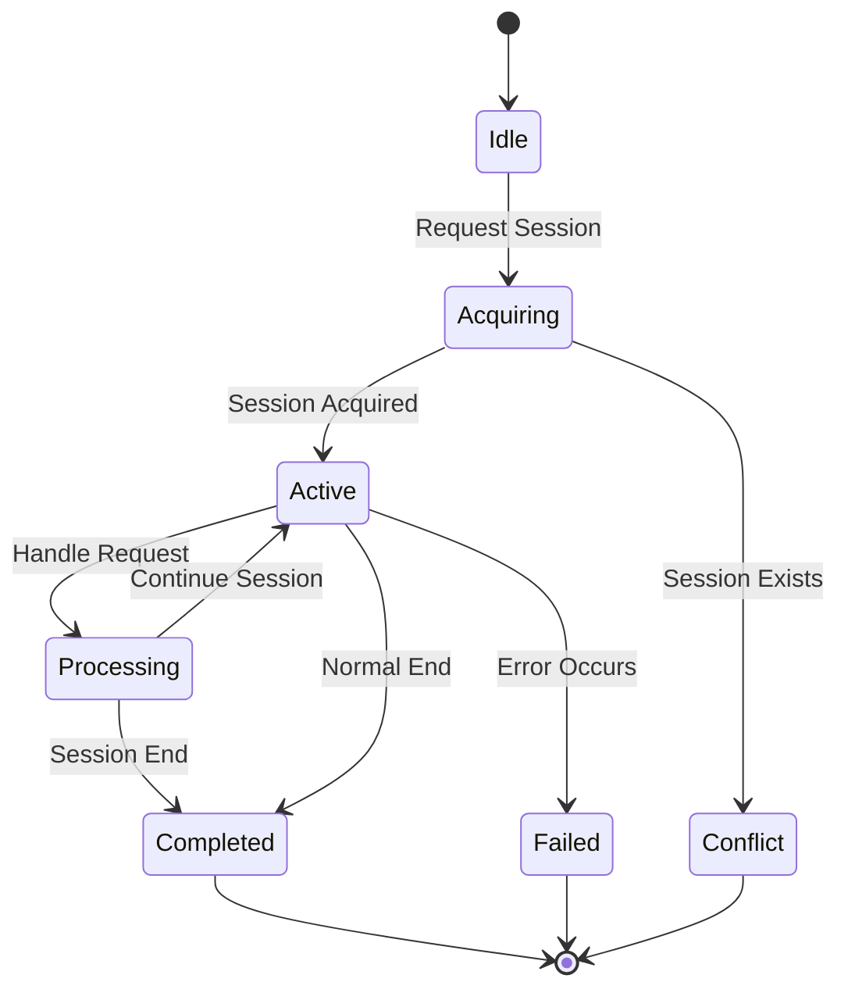
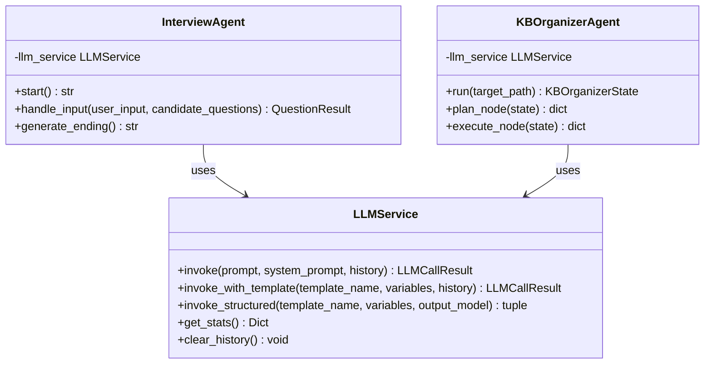

# Claude Grill-Me Skill

<cite>
**Referenced Files in This Document**
- [grill-me.md](file://.claude/skills/grill-me.md)
- [README.md](file://README.md)
- [start_service.py](file://start_service.py)
- [run_server.py](file://run_server.py)
- [app.py](file://src/service/app.py)
- [interview.py](file://src/service/routes/interview.py)
- [kb_organizer.py](file://src/service/routes/kb_organizer.py)
- [biography_outline.py](file://src/service/routes/biography_outline.py)
- [biography_writing.py](file://src/service/routes/biography_writing.py)
- [interview_agent.py](file://src/agents/interview_agent.py)
- [profile_collection_agent.py](file://src/agents/profile_collection_agent.py)
- [kb_organizer_agent.py](file://src/agents/kb_organizer_agent.py)
- [llm_service.py](file://src/services/llm_service.py)
- [memory_repository.py](file://src/storage/memory_repository.py)
</cite>

## Table of Contents
1. [Introduction](#introduction)
2. [Skill Purpose and Scope](#skill-purpose-and-scope)
3. [Core Functionality](#core-functionality)
4. [System Architecture](#system-architecture)
5. [Interview Agent Implementation](#interview-agent-implementation)
6. [Knowledge Base Organization](#knowledge-base-organization)
7. [API Endpoints](#api-endpoints)
8. [Session Management](#session-management)
9. [Integration Patterns](#integration-patterns)
10. [Performance Considerations](#performance-considerations)
11. [Troubleshooting Guide](#troubleshooting-guide)
12. [Best Practices](#best-practices)
13. [Conclusion](#conclusion)

## Introduction

The Claude Grill-Me Skill is a specialized interviewing agent designed to rigorously challenge and validate plans, designs, and strategic decisions through systematic questioning. This skill transforms the traditional interview process into a structured analytical framework that helps users identify hidden assumptions, resolve trade-offs, and achieve shared understanding of complex decisions.

Built as part of the Elder Memoir Agent system, the Grill-Me Skill leverages advanced AI capabilities to conduct intensive interviews that probe the foundations of any proposed plan or design. The skill operates on the principle that thorough questioning leads to better decision-making and more robust outcomes.

## Skill Purpose and Scope

The Grill-Me Skill serves as a specialized analytical interviewing tool with the following primary objectives:

### Core Mission
- **Decision Validation**: Systematically test and validate complex plans or designs before implementation
- **Assumption Discovery**: Uncover hidden assumptions and unstated premises in user proposals
- **Trade-off Resolution**: Help identify and resolve conflicting requirements or constraints
- **Shared Understanding**: Ensure both interviewer and interviewee have complete alignment on key decisions

### Target Scenarios
The skill is particularly valuable for situations involving:
- Strategic planning and business initiatives
- Product design and development decisions
- Engineering and architectural choices
- Policy formulation and implementation planning
- Any complex decision requiring thorough analysis

### Unique Value Proposition
Unlike conventional interview skills, Grill-Me focuses specifically on analytical rigor rather than narrative collection. It transforms the interview process from storytelling into systematic problem-solving, ensuring that all critical aspects of a proposal are examined and validated.

## Core Functionality

### Interview Methodology
The skill employs a structured approach to questioning that follows these principles:



**Diagram sources**
- [grill-me.md:12-21](file://.claude/skills/grill-me.md#L12-L21)

### Question Generation Strategy
The skill generates questions one at a time, avoiding information overload while maintaining analytical rigor. Each question builds upon previous responses to create a logical progression through the decision space.

### Codebase Integration
The skill integrates seamlessly with the broader Elder Memoir Agent ecosystem, leveraging the same underlying infrastructure for:
- LLM service management
- Memory and knowledge base operations
- Session state management
- Streaming response delivery

## System Architecture

### High-Level Design
The Grill-Me Skill operates within a microservices architecture that separates concerns while enabling efficient collaboration:



**Diagram sources**
- [app.py:22-59](file://src/service/app.py#L22-L59)
- [start_service.py:30-36](file://start_service.py#L30-L36)

### Component Responsibilities
Each component plays a specific role in the overall system:

- **Grill-Me Skill**: Orchestrates the analytical interview process
- **Interview Agent**: Manages the conversational flow and question generation
- **Knowledge Base Services**: Provide data persistence and retrieval capabilities
- **LLM Service**: Handles all language model interactions with standardized interfaces
- **Session Manager**: Coordinates concurrent user sessions and prevents conflicts

## Interview Agent Implementation

### Core Interview Process
The Interview Agent implements sophisticated conversational logic designed for analytical questioning:



**Diagram sources**
- [interview_agent.py:80-196](file://src/agents/interview_agent.py#L80-L196)
- [llm_service.py:240-307](file://src/services/llm_service.py#L240-L307)

### Time Management System
The agent implements sophisticated time management to ensure productive interviews:

- **Standard Duration**: 15 minutes for comprehensive analysis
- **Warning Threshold**: 80% completion triggers time-sensitive question modifications
- **Automatic Completion**: Natural termination when time limit is reached

### Memory Integration
The Interview Agent seamlessly integrates with the memory system for context preservation:

- **Short-term Memory**: Tracks conversation history and key insights
- **Long-term Storage**: Persists conversation records for future reference
- **Knowledge Base Queries**: Searches existing documents for contextual information
- **Cache Management**: Optimizes repeated queries through intelligent caching

**Section sources**
- [interview_agent.py:16-79](file://src/agents/interview_agent.py#L16-L79)
- [interview_agent.py:115-196](file://src/agents/interview_agent.py#L115-L196)

## Knowledge Base Organization

### KB Organizer Agent
The Knowledge Base Organizer implements a sophisticated ReAct (Reasoning-Act) pattern for systematic document organization:



**Diagram sources**
- [kb_organizer_agent.py:24-33](file://src/agents/kb_organizer_agent.py#L24-L33)
- [kb_organizer_agent.py:96-144](file://src/agents/kb_organizer_agent.py#L96-L144)

### Organizational Tasks
The KB Organizer performs eight critical tasks in sequence:

1. **Workspace Setup**: Creates working copies and scans file inventories
2. **Document Reading**: Establishes memory indexes for all documents
3. **Duplicate Detection**: Identifies and merges similar content
4. **Conflict Checking**: Reviews existing conflict resolution status
5. **Contradiction Detection**: Finds factual inconsistencies across documents
6. **Link Repair**: Fixes broken internal references
7. **Conversation Pruning**: Removes outdated conversation records
8. **Atomic Replacement**: Safely swaps working copy into production

### Safety Mechanisms
The system implements multiple safety measures:
- **Atomic Operations**: Ensures data integrity during replacements
- **Backup Creation**: Preserves original state before modifications
- **Error Handling**: Comprehensive failure recovery and reporting
- **Progress Tracking**: Detailed logging of all operations performed

**Section sources**
- [kb_organizer_agent.py:36-80](file://src/agents/kb_organizer_agent.py#L36-L80)
- [kb_organizer_agent.py:147-296](file://src/agents/kb_organizer_agent.py#L147-L296)

## API Endpoints

### Service Architecture
The system exposes RESTful APIs organized by functional domains:

```mermaid
graph LR
subgraph "Interview Domain"
A1[/api/interview/start]
A2[/api/interview/message]
A3[/api/interview/end]
A4[/api/interview/status/{user_id}/{session_id}]
end
subgraph "Knowledge Base Domain"
B1[/api/kb-organizer/run]
B2[/api/kb-organizer/result/{user_id}]
end
subgraph "Biography Domain"
C1[/api/biography/outline/generate]
C2[/api/biography/outline/{user_id}]
C3[/api/biography/outline/{user_id}/chapters/{chapter_id}/confirm]
C4[/api/biography/writing/run]
C5[/api/biography/writing/{user_id}/chapters]
C6[/api/biography/writing/{user_id}/full]
end
subgraph "File Management"
D1[/api/files/list]
D2[/api/files/tree]
D3[/api/files/content]
end
```

**Diagram sources**
- [start_service.py:30-36](file://start_service.py#L30-L36)
- [app.py:41-51](file://src/service/app.py#L41-L51)

### Interview API Endpoints
The interview service provides real-time streaming responses for interactive conversations:

- **POST /api/interview/start**: Initiates new interview sessions with SSE streaming
- **POST /api/interview/message**: Processes user responses with candidate question support
- **POST /api/interview/end**: Terminates sessions and returns summary data
- **GET /api/interview/status/{user_id}/{session_id}**: Provides session progress information

### Knowledge Base Management
The KB service offers both automated organization and manual inspection capabilities:

- **POST /api/kb-organizer/run**: Executes comprehensive knowledge base cleanup
- **GET /api/kb-organizer/result/{user_id}**: Retrieves organization results

### Biography Workflow
The biography service supports complete lifecycle management from outline creation to final publication:

- **POST /api/biography/outline/generate**: Creates or updates biographical outlines
- **GET /api/biography/outline/{user_id}**: Retrieves saved outline data
- **PUT /api/biography/outline/{user_id}/chapters/{chapter_id}/confirm**: Approves chapters for writing
- **POST /api/biography/writing/run**: Generates complete biography text
- **GET /api/biography/writing/{user_id}/chapters**: Lists generated chapters
- **GET /api/biography/writing/{user_id}/full**: Retrieves complete biography

**Section sources**
- [interview.py:15-122](file://src/service/routes/interview.py#L15-L122)
- [kb_organizer.py:32-77](file://src/service/routes/kb_organizer.py#L32-L77)
- [biography_outline.py:33-133](file://src/service/routes/biography_outline.py#L33-L133)
- [biography_writing.py:34-136](file://src/service/routes/biography_writing.py#L34-L136)

## Session Management

### Concurrency Control
The system implements sophisticated session management to handle multiple concurrent users:



**Diagram sources**
- [interview.py:21-25](file://src/service/routes/interview.py#L21-L25)
- [kb_organizer.py:40-44](file://src/service/routes/kb_organizer.py#L40-L44)

### Session Types
Different agent types require distinct session management approaches:

- **Interview Sessions**: Real-time streaming with time limits and conversation state
- **KB Organization Tasks**: Background processing with progress reporting
- **Biography Workflows**: Multi-stage processes with intermediate state persistence

### Error Handling
The system provides comprehensive error handling for session conflicts and invalid states:

- **Session Conflict Detection**: Prevents simultaneous operations on same resource
- **Graceful Degradation**: Continues operation even when individual components fail
- **Resource Cleanup**: Ensures proper cleanup of temporary resources on errors

## Integration Patterns

### LLM Service Integration
The system standardizes all LLM interactions through a unified service layer:



**Diagram sources**
- [llm_service.py:33-499](file://src/services/llm_service.py#L33-L499)
- [interview_agent.py:16-79](file://src/agents/interview_agent.py#L16-L79)
- [kb_organizer_agent.py:36-47](file://src/agents/kb_organizer_agent.py#L36-L47)

### Memory Management Integration
The memory system provides three-tier storage abstraction:

- **Short-term Memory**: Recent conversation context and temporary data
- **Long-term Storage**: Persistent knowledge base with structured indexing
- **Cache Layer**: Optimized access patterns for frequently used data

### Tool Integration
The system integrates specialized tools for enhanced functionality:

- **Memory Cache Tool**: Intelligent caching for repeated queries
- **Knowledge Query Tool**: Advanced semantic search capabilities
- **Memory Archive Tool**: Historical data preservation and retrieval

**Section sources**
- [llm_service.py:141-177](file://src/services/llm_service.py#L141-L177)
- [memory_repository.py:40-88](file://src/storage/memory_repository.py#L40-L88)

## Performance Considerations

### Scalability Architecture
The system is designed for horizontal scalability with several key considerations:

- **Asynchronous Processing**: Non-blocking operations for improved throughput
- **Connection Pooling**: Efficient database and external service connections
- **Caching Strategies**: Multi-level caching to reduce latency
- **Streaming Responses**: Real-time user feedback without blocking operations

### Resource Optimization
Performance optimization occurs at multiple levels:

- **LLM Call Optimization**: Structured prompting and response formatting
- **Memory Management**: Efficient data structures and garbage collection
- **Network Efficiency**: Minimized round trips and optimized payload sizes
- **Storage Optimization**: Indexed access patterns and compressed storage

### Monitoring and Metrics
The system provides comprehensive observability:

- **Latency Tracking**: End-to-end request timing and breakdown analysis
- **Throughput Measurement**: Requests per second and concurrent session metrics
- **Error Rate Monitoring**: Failure rates and error categorization
- **Resource Utilization**: CPU, memory, and I/O usage patterns

## Troubleshooting Guide

### Common Issues and Solutions

#### Session Management Problems
- **Issue**: Session conflicts when multiple clients access same resource
- **Solution**: Implement proper session acquisition and release patterns
- **Prevention**: Use unique session IDs and proper timeout handling

#### LLM Service Failures
- **Issue**: Model API timeouts or rate limiting
- **Solution**: Implement exponential backoff and circuit breaker patterns
- **Monitoring**: Track success rates and latency distributions

#### Memory Access Issues
- **Issue**: Slow queries or memory exhaustion
- **Solution**: Optimize indexing strategies and implement connection pooling
- **Prevention**: Monitor memory usage and implement eviction policies

#### File System Operations
- **Issue**: Permission errors or disk space limitations
- **Solution**: Validate permissions and implement space monitoring
- **Recovery**: Automatic cleanup of temporary files and rollback mechanisms

### Debugging Strategies
Effective debugging requires understanding the multi-layered architecture:

1. **API Level**: Verify request/response formats and error codes
2. **Service Level**: Check service initialization and configuration
3. **Data Level**: Validate data integrity and access patterns
4. **Infrastructure Level**: Monitor resource utilization and network connectivity

### Logging and Observability
The system implements comprehensive logging:

- **Structured Logging**: Consistent log formats across all components
- **Context Propagation**: Trace IDs and correlation data throughout request lifecycle
- **Performance Metrics**: Timing data and resource usage statistics
- **Error Tracking**: Detailed stack traces and error categorization

## Best Practices

### Implementation Guidelines
When extending or modifying the Grill-Me Skill, follow these established patterns:

#### Code Organization
- **Modular Design**: Keep components focused and loosely coupled
- **Clear Interfaces**: Define explicit contracts between services
- **Consistent Naming**: Use descriptive names that reflect functionality
- **Documentation**: Maintain inline documentation for complex logic

#### Error Handling
- **Fail Fast**: Detect and report errors early in the process
- **Graceful Degradation**: Continue operation when possible despite partial failures
- **Meaningful Messages**: Provide clear error descriptions for debugging
- **Logging**: Capture sufficient context for troubleshooting

#### Performance Optimization
- **Asynchronous Operations**: Use async/await patterns for I/O-bound operations
- **Connection Management**: Reuse connections and implement pooling
- **Resource Cleanup**: Always clean up temporary resources and connections
- **Monitoring**: Implement comprehensive metrics collection

### Operational Excellence
- **Testing**: Maintain comprehensive test suites covering all major scenarios
- **Deployment**: Use blue-green deployments for zero-downtime updates
- **Monitoring**: Set up alerts for critical system metrics and error rates
- **Backups**: Regular backups of critical data and configuration

### Security Considerations
- **Input Validation**: Sanitize all user inputs to prevent injection attacks
- **Access Control**: Implement proper authentication and authorization
- **Data Protection**: Encrypt sensitive data at rest and in transit
- **Audit Logging**: Track all access to sensitive operations and data

## Conclusion

The Claude Grill-Me Skill represents a sophisticated approach to analytical interviewing that transforms traditional conversation into systematic problem-solving. By leveraging the comprehensive infrastructure of the Elder Memoir Agent system, it provides a robust foundation for rigorous decision analysis and validation.

The skill's strength lies in its systematic approach to questioning, its integration with advanced memory and knowledge management systems, and its scalable architecture that supports both individual users and enterprise deployments. Through careful attention to performance, reliability, and user experience, it delivers a powerful tool for validating complex plans and designs.

Future enhancements could expand the skill's capabilities through additional reasoning patterns, integration with external knowledge sources, and enhanced visualization of decision analysis results. The modular architecture ensures that such extensions can be implemented efficiently while maintaining system stability and performance.