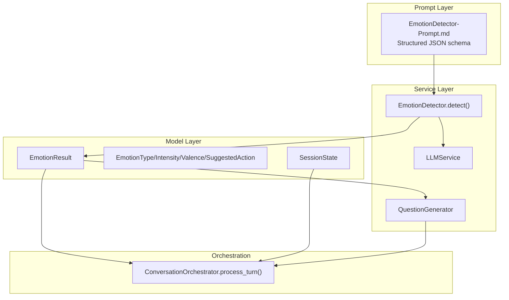
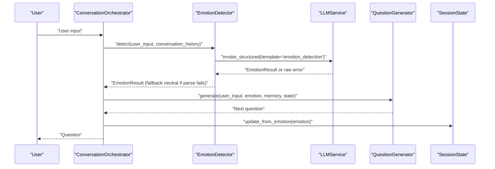
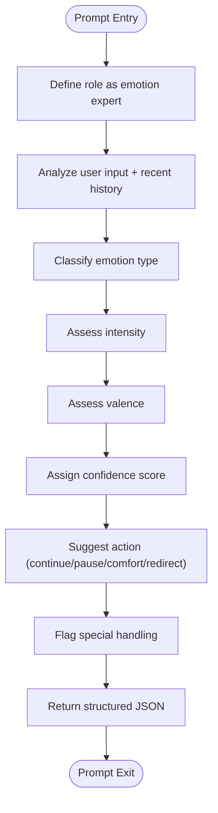
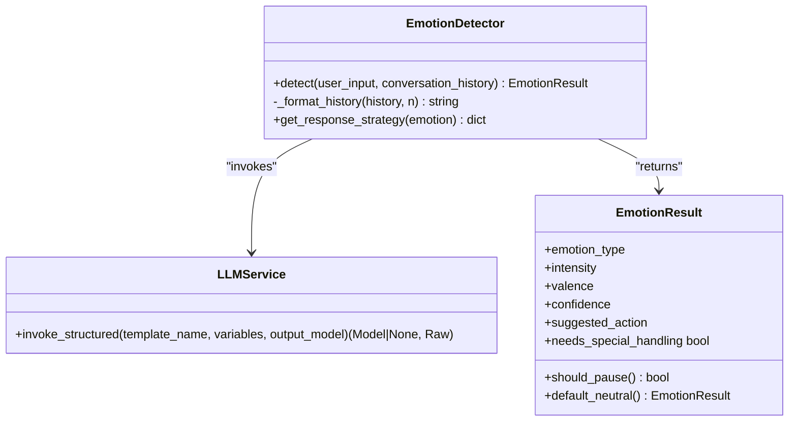
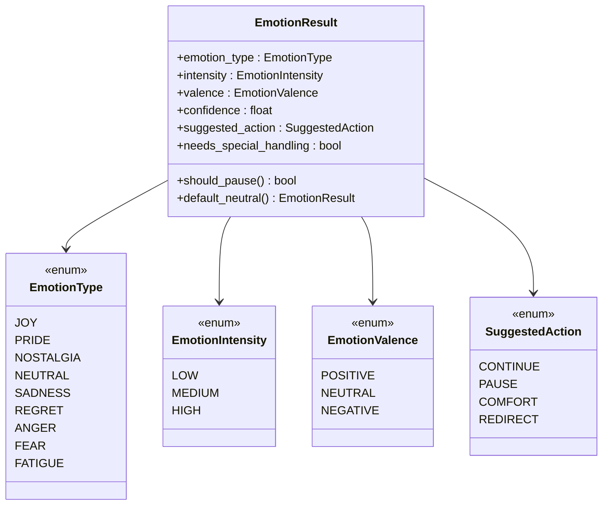
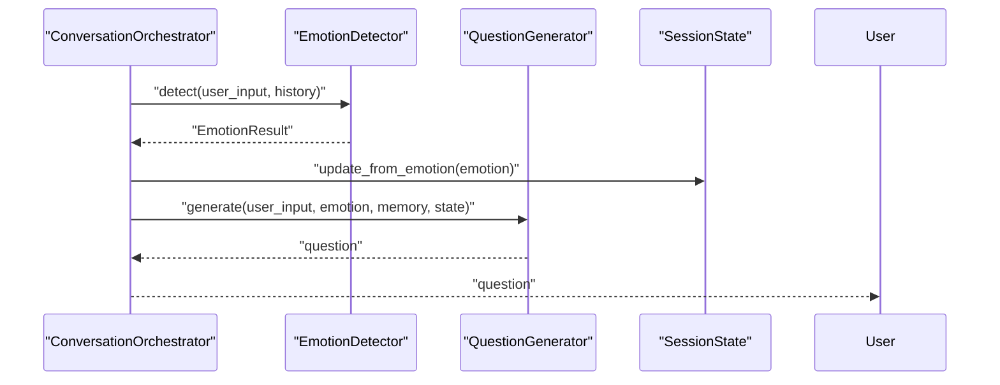
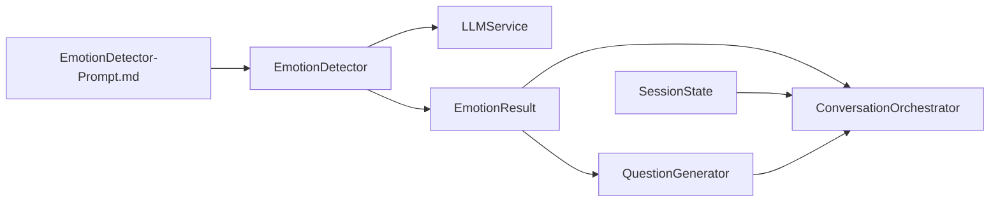

# EmotionDetector Prompt Template

<cite>
**Referenced Files in This Document**
- [EmotionDetector-Prompt.md](file://src/prompts/EmotionDetector-Prompt.md)
- [emotion_detector.py](file://src/services/emotion_detector.py)
- [emotion_result.py](file://src/models/emotion_result.py)
- [emotion_type.py](file://src/enums/emotion_type.py)
- [conversation_orchestrator.py](file://src/core/conversation_orchestrator.py)
- [question_generator.py](file://src/services/question_generator.py)
- [llm_service.py](file://src/services/llm_service.py)
- [session_state.py](file://src/models/session_state.py)
</cite>

## Table of Contents
1. [Introduction](#introduction)
2. [Project Structure](#project-structure)
3. [Core Components](#core-components)
4. [Architecture Overview](#architecture-overview)
5. [Detailed Component Analysis](#detailed-component-analysis)
6. [Dependency Analysis](#dependency-analysis)
7. [Performance Considerations](#performance-considerations)
8. [Troubleshooting Guide](#troubleshooting-guide)
9. [Conclusion](#conclusion)

## Introduction
This document explains the EmotionDetector prompt template system that powers emotional analysis in elderly interview contexts. It covers the emotion classification taxonomy, intensity scoring, confidence assessment, and the integration with EmotionResult models and interview strategies. The guide also documents how emotion detection influences question generation and conversation flow, provides customization guidance for diverse cultural contexts, and outlines fallback mechanisms for ambiguous inputs.

## Project Structure
The EmotionDetector system is implemented as a structured prompt template integrated with a dedicated service and Pydantic models. It participates in the broader interview orchestration pipeline alongside the QuestionGenerator and ConversationOrchestrator.

**Diagram sources**
- [EmotionDetector-Prompt.md:10-139](file://src/prompts/EmotionDetector-Prompt.md#L10-L139)
- [emotion_detector.py:39-73](file://src/services/emotion_detector.py#L39-L73)
- [emotion_result.py:6-57](file://src/models/emotion_result.py#L6-L57)
- [emotion_type.py:4-50](file://src/enums/emotion_type.py#L4-L50)
- [conversation_orchestrator.py:236-343](file://src/core/conversation_orchestrator.py#L236-L343)
- [question_generator.py:38-73](file://src/services/question_generator.py#L38-L73)
- [llm_service.py:327-399](file://src/services/llm_service.py#L327-L399)
- [session_state.py:24-139](file://src/models/session_state.py#L24-L139)

**Section sources**
- [EmotionDetector-Prompt.md:10-139](file://src/prompts/EmotionDetector-Prompt.md#L10-L139)
- [emotion_detector.py:12-73](file://src/services/emotion_detector.py#L12-L73)
- [emotion_result.py:6-57](file://src/models/emotion_result.py#L6-L57)
- [emotion_type.py:4-50](file://src/enums/emotion_type.py#L4-L50)
- [conversation_orchestrator.py:138-343](file://src/core/conversation_orchestrator.py#L138-L343)
- [question_generator.py:12-73](file://src/services/question_generator.py#L12-L73)
- [llm_service.py:327-399](file://src/services/llm_service.py#L327-L399)
- [session_state.py:24-139](file://src/models/session_state.py#L24-L139)

## Core Components
- EmotionDetector prompt template: Defines the structured JSON schema and analysis requirements for emotion classification, intensity, valence, confidence, suggested action, and special handling flags.
- EmotionDetector service: Formats conversation history, invokes LLMService with the emotion_detection template, and returns an EmotionResult with fallback behavior.
- EmotionResult model: Encapsulates emotion classification, intensity, valence, confidence, suggested action, and convenience methods for special handling and pause decisions.
- EmotionType taxonomy: Enumerates emotion categories including nostalgic, joy, pride, neutral, sadness, regret, anger, fear, and fatigue.
- Integration points: ConversationOrchestrator consumes EmotionResult to adjust state and pause decisions; QuestionGenerator uses EmotionResult to generate emotionally responsive questions.

**Section sources**
- [EmotionDetector-Prompt.md:34-55](file://src/prompts/EmotionDetector-Prompt.md#L34-L55)
- [emotion_detector.py:39-73](file://src/services/emotion_detector.py#L39-L73)
- [emotion_result.py:20-46](file://src/models/emotion_result.py#L20-L46)
- [emotion_type.py:4-50](file://src/enums/emotion_type.py#L4-L50)
- [conversation_orchestrator.py:236-343](file://src/core/conversation_orchestrator.py#L236-L343)
- [question_generator.py:38-73](file://src/services/question_generator.py#L38-L73)

## Architecture Overview
The EmotionDetector pipeline integrates with the broader interview orchestration. Emotion detection runs concurrently with knowledge queries during each conversation turn. The resulting EmotionResult informs pause decisions, strategy mapping, and question generation.

**Diagram sources**
- [conversation_orchestrator.py:269-316](file://src/core/conversation_orchestrator.py#L269-L316)
- [emotion_detector.py:58-73](file://src/services/emotion_detector.py#L58-L73)
- [llm_service.py:327-399](file://src/services/llm_service.py#L327-L399)
- [question_generator.py:38-73](file://src/services/question_generator.py#L38-L73)
- [session_state.py:119-124](file://src/models/session_state.py#L119-L124)

## Detailed Component Analysis

### EmotionDetector Prompt Template
- Purpose: Provide a structured JSON schema for emotion classification, intensity, valence, confidence, suggested action, and special handling flags.
- Inputs: user_input and recent conversation history formatted as a short transcript.
- Output: EmotionResult validated against the JSON schema.
- Notes: Highlights that nostalgia is common in elderly narratives, fatigue warrants pause, and high-intensity negative emotions require special handling.

**Diagram sources**
- [EmotionDetector-Prompt.md:13-55](file://src/prompts/EmotionDetector-Prompt.md#L13-L55)

**Section sources**
- [EmotionDetector-Prompt.md:13-55](file://src/prompts/EmotionDetector-Prompt.md#L13-L55)
- [EmotionDetector-Prompt.md:76-92](file://src/prompts/EmotionDetector-Prompt.md#L76-L92)
- [EmotionDetector-Prompt.md:98-125](file://src/prompts/EmotionDetector-Prompt.md#L98-L125)
- [EmotionDetector-Prompt.md:145-213](file://src/prompts/EmotionDetector-Prompt.md#L145-L213)

### EmotionDetector Service
- Responsibilities: Format conversation history, call LLMService with emotion_detection template, parse structured output, and apply fallback neutral result on failure.
- History formatting: Uses the last N turns to build a concise user/assistant transcript.
- Timeout handling: The orchestrator enforces a timeout around emotion detection to keep the conversation responsive.

**Diagram sources**
- [emotion_detector.py:12-131](file://src/services/emotion_detector.py#L12-L131)
- [llm_service.py:327-399](file://src/services/llm_service.py#L327-L399)
- [emotion_result.py:6-57](file://src/models/emotion_result.py#L6-L57)

**Section sources**
- [emotion_detector.py:39-73](file://src/services/emotion_detector.py#L39-L73)
- [emotion_detector.py:75-83](file://src/services/emotion_detector.py#L75-L83)
- [emotion_detector.py:85-131](file://src/services/emotion_detector.py#L85-L131)

### EmotionResult Model and Enums
- EmotionResult captures emotion_type, intensity, valence, confidence, suggested_action, and flags for special handling and pause decisions.
- EmotionType taxonomy includes nostalgic, joy, pride, neutral, sadness, regret, anger, fear, and fatigue.
- Convenience methods: needs_special_handling and should_pause encapsulate policy decisions.

**Diagram sources**
- [emotion_type.py:4-50](file://src/enums/emotion_type.py#L4-L50)
- [emotion_result.py:6-57](file://src/models/emotion_result.py#L6-L57)

**Section sources**
- [emotion_type.py:4-50](file://src/enums/emotion_type.py#L4-L50)
- [emotion_result.py:20-46](file://src/models/emotion_result.py#L20-L46)
- [emotion_result.py:48-57](file://src/models/emotion_result.py#L48-L57)

### Integration with ConversationOrchestrator and QuestionGenerator
- During each turn, the orchestrator runs emotion detection concurrently with knowledge queries.
- EmotionResult drives pause decisions and updates SessionState emotion_state.
- QuestionGenerator prioritizes emotion responses when special handling is flagged, otherwise generates context-aware questions.

**Diagram sources**
- [conversation_orchestrator.py:269-316](file://src/core/conversation_orchestrator.py#L269-L316)
- [emotion_detector.py:58-73](file://src/services/emotion_detector.py#L58-L73)
- [question_generator.py:38-73](file://src/services/question_generator.py#L38-L73)
- [session_state.py:119-124](file://src/models/session_state.py#L119-L124)

**Section sources**
- [conversation_orchestrator.py:236-343](file://src/core/conversation_orchestrator.py#L236-L343)
- [question_generator.py:38-73](file://src/services/question_generator.py#L38-L73)
- [session_state.py:119-124](file://src/models/session_state.py#L119-L124)

### Implementation Examples: How Emotion Detection Influences Flow
- Positive emotion (e.g., nostalgia): Continue and deepen the narrative.
- Negative emotion (e.g., sadness/regret/anger) with high intensity: Pause and express concern.
- Fatigue: Pause and suggest rest.
- Neutral emotion: Continue normally.

These mappings are derived from the prompt’s response strategy table and the EmotionResult convenience methods.

**Section sources**
- [EmotionDetector-Prompt.md:217-230](file://src/prompts/EmotionDetector-Prompt.md#L217-L230)
- [emotion_result.py:29-46](file://src/models/emotion_result.py#L29-L46)

### Prompt Customization Guidance
- Cultural context: Adjust tone and phrasing in the emotion_detection template to align with cultural norms for expressing emotion in interviews.
- Expression styles: Add explicit examples in the prompt for different expression styles (e.g., reserved vs. expressive) to improve classification robustness.
- Domain specificity: Include elderly-specific idioms and references to enhance recognition of nostalgic and reflective language.

**Section sources**
- [EmotionDetector-Prompt.md:57-63](file://src/prompts/EmotionDetector-Prompt.md#L57-L63)

### Fallback Mechanisms and Error Handling
- Structured parsing fallback: On LLMService structured output parse failure, EmotionDetector returns a default neutral EmotionResult.
- Timeout protection: The orchestrator applies a timeout around emotion detection to prevent stalls.
- Graceful degradation: QuestionGenerator falls back to emotion_response template or preset responses when structured generation fails.

**Section sources**
- [emotion_detector.py:67-73](file://src/services/emotion_detector.py#L67-L73)
- [llm_service.py:375-399](file://src/services/llm_service.py#L375-L399)
- [question_generator.py:75-98](file://src/services/question_generator.py#L75-L98)

## Dependency Analysis
The EmotionDetector depends on the LLMService for structured output and on the EmotionResult model for typed results. The orchestrator coordinates emotion detection with other services and persists emotion state in SessionState.

**Diagram sources**
- [EmotionDetector-Prompt.md:98-125](file://src/prompts/EmotionDetector-Prompt.md#L98-L125)
- [emotion_detector.py:39-73](file://src/services/emotion_detector.py#L39-L73)
- [emotion_result.py:6-57](file://src/models/emotion_result.py#L6-L57)
- [conversation_orchestrator.py:236-343](file://src/core/conversation_orchestrator.py#L236-L343)
- [question_generator.py:38-73](file://src/services/question_generator.py#L38-L73)
- [session_state.py:24-139](file://src/models/session_state.py#L24-L139)

**Section sources**
- [EmotionDetector-Prompt.md:98-125](file://src/prompts/EmotionDetector-Prompt.md#L98-L125)
- [emotion_detector.py:39-73](file://src/services/emotion_detector.py#L39-L73)
- [emotion_result.py:6-57](file://src/models/emotion_result.py#L6-L57)
- [conversation_orchestrator.py:236-343](file://src/core/conversation_orchestrator.py#L236-L343)
- [question_generator.py:38-73](file://src/services/question_generator.py#L38-L73)
- [session_state.py:24-139](file://src/models/session_state.py#L24-L139)

## Performance Considerations
- Concurrency: Emotion detection runs concurrently with knowledge queries to minimize latency.
- Token limits: The emotion_detection template specifies max tokens to control cost and latency.
- Structured output parsing: Robust extraction handles varied LLM outputs and reduces retries.

[No sources needed since this section provides general guidance]

## Troubleshooting Guide
- Emotion detection returns neutral: Indicates structured parse failure or fallback path was triggered. Review LLMService logs and prompt formatting.
- Frequent timeouts: Increase emotion_timeout or reduce prompt complexity; ensure adequate system resources.
- Misclassification of nostalgia vs. sadness: Enhance prompt examples and clarify distinctions in the emotion_detection template.

**Section sources**
- [emotion_detector.py:67-73](file://src/services/emotion_detector.py#L67-L73)
- [llm_service.py:400-437](file://src/services/llm_service.py#L400-L437)
- [EmotionDetector-Prompt.md:57-63](file://src/prompts/EmotionDetector-Prompt.md#L57-L63)

## Conclusion
The EmotionDetector prompt template system provides a robust, structured approach to recognizing emotions in elderly interview contexts. By integrating with EmotionResult models and the broader orchestration pipeline, it enables adaptive conversation flow, thoughtful question generation, and graceful handling of ambiguous inputs. Customization for cultural nuances and expression styles enhances accuracy, while built-in fallbacks ensure resilient operation under uncertainty.