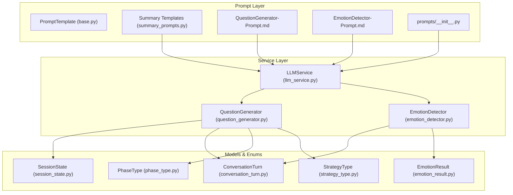
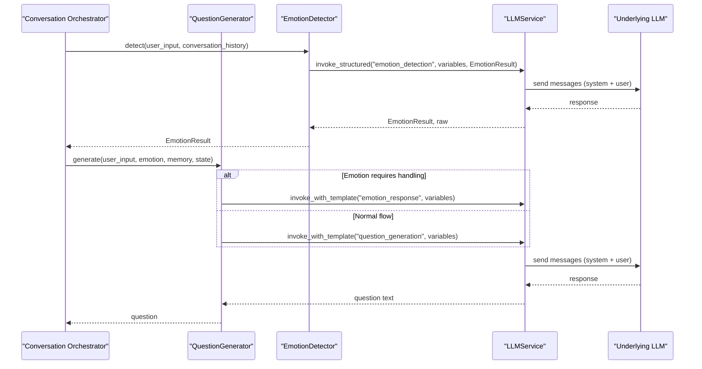
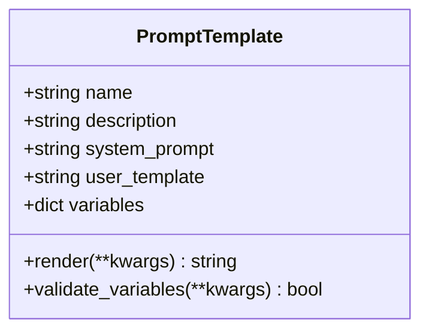
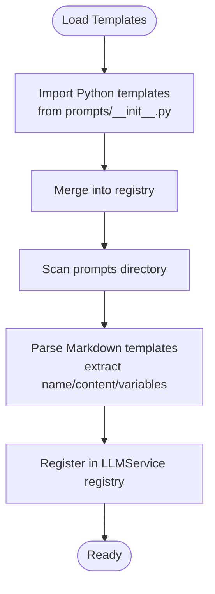
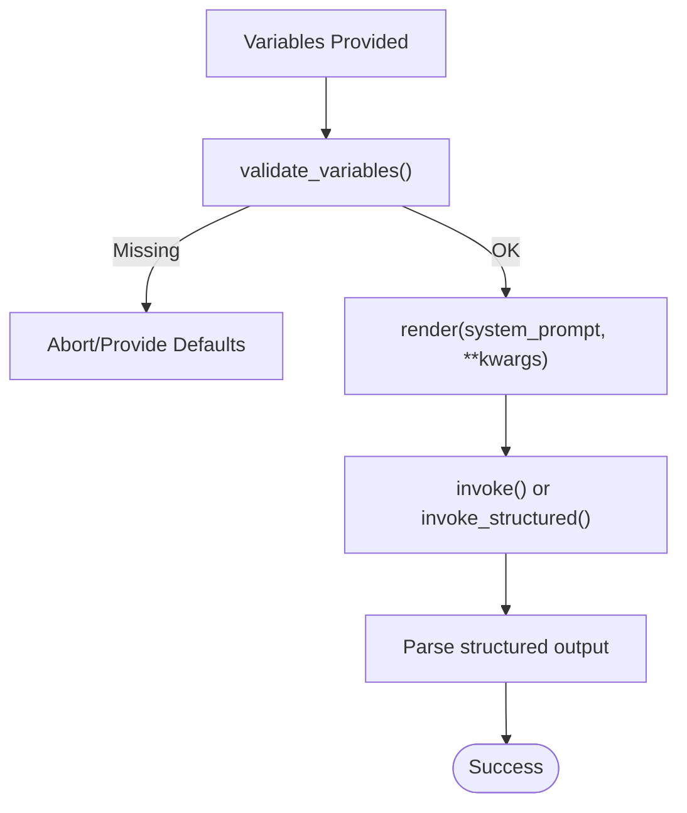
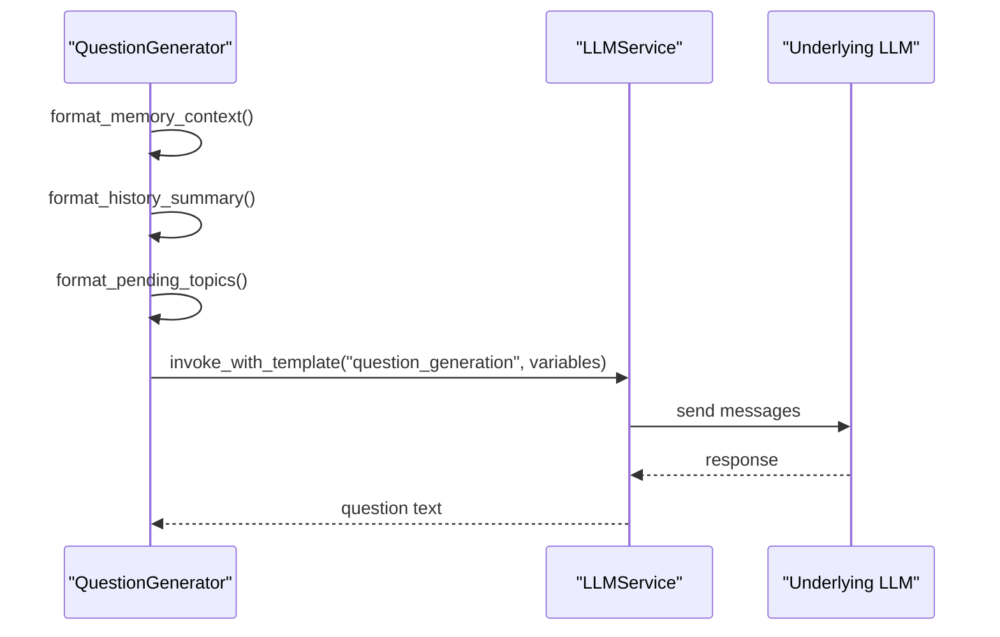
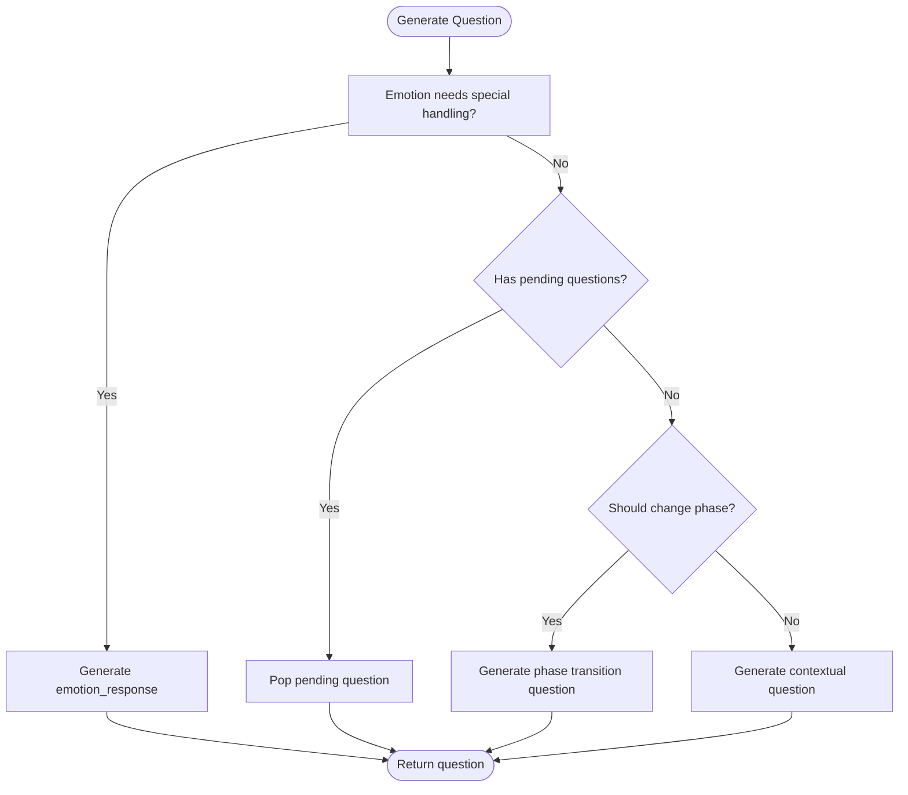
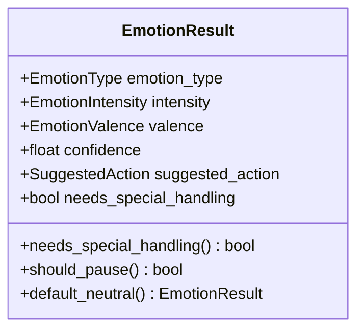
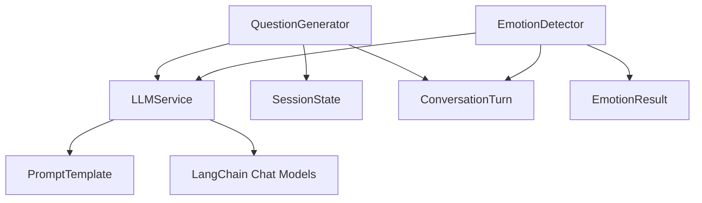

# Prompts and Templates

<cite>
**Referenced Files in This Document**
- [base.py](file://src/prompts/base.py)
- [__init__.py](file://src/prompts/__init__.py)
- [summary_prompts.py](file://src/prompts/summary_prompts.py)
- [QuestionGenerator-Prompt.md](file://src/prompts/QuestionGenerator-Prompt.md)
- [EmotionDetector-Prompt.md](file://src/prompts/EmotionDetector-Prompt.md)
- [llm_service.py](file://src/services/llm_service.py)
- [question_generator.py](file://src/services/question_generator.py)
- [emotion_detector.py](file://src/services/emotion_detector.py)
- [conversation_turn.py](file://src/models/conversation_turn.py)
- [session_state.py](file://src/models/session_state.py)
- [phase_type.py](file://src/enums/phase_type.py)
- [strategy_type.py](file://src/enums/strategy_type.py)
- [emotion_result.py](file://src/models/emotion_result.py)
</cite>

## Table of Contents
1. [Introduction](#introduction)
2. [Project Structure](#project-structure)
3. [Core Components](#core-components)
4. [Architecture Overview](#architecture-overview)
5. [Detailed Component Analysis](#detailed-component-analysis)
6. [Dependency Analysis](#dependency-analysis)
7. [Performance Considerations](#performance-considerations)
8. [Troubleshooting Guide](#troubleshooting-guide)
9. [Conclusion](#conclusion)
10. [Appendices](#appendices)

## Introduction
This document explains the prompt management system used to orchestrate conversational AI interactions. It covers how templates are loaded from Markdown and Python sources, how variables are substituted and validated, and how dynamic rendering powers adaptive questioning, emotion-aware responses, and content summarization. It also documents the base prompt system, inheritance patterns, customization techniques, versioning, localization considerations, and performance optimization strategies.

## Project Structure
The prompt system spans two primary areas:
- Prompt definitions and base classes under src/prompts
- Services that consume prompts via LLMService under src/services
- Supporting models and enums under src/models and src/enums

Key directories and files:
- src/prompts: Base template class, summary templates, and Markdown-based templates
- src/services: LLMService orchestrating template loading and invocation, plus specialized services for question generation and emotion detection
- src/models and src/enums: Data models and enumerations used by prompts and services

**Diagram sources**
- [base.py:1-33](file://src/prompts/base.py#L1-L33)
- [summary_prompts.py:1-49](file://src/prompts/summary_prompts.py#L1-L49)
- [QuestionGenerator-Prompt.md:1-352](file://src/prompts/QuestionGenerator-Prompt.md#L1-L352)
- [EmotionDetector-Prompt.md:1-259](file://src/prompts/EmotionDetector-Prompt.md#L1-L259)
- [__init__.py:1-12](file://src/prompts/__init__.py#L1-L12)
- [llm_service.py:1-481](file://src/services/llm_service.py#L1-L481)
- [question_generator.py:1-253](file://src/services/question_generator.py#L1-L253)
- [emotion_detector.py:1-131](file://src/services/emotion_detector.py#L1-L131)
- [conversation_turn.py:1-52](file://src/models/conversation_turn.py#L1-L52)
- [session_state.py:1-139](file://src/models/session_state.py#L1-L139)
- [phase_type.py:1-10](file://src/enums/phase_type.py#L1-L10)
- [strategy_type.py:1-8](file://src/enums/strategy_type.py#L1-L8)
- [emotion_result.py:1-57](file://src/models/emotion_result.py#L1-L57)

**Section sources**
- [base.py:1-33](file://src/prompts/base.py#L1-L33)
- [summary_prompts.py:1-49](file://src/prompts/summary_prompts.py#L1-L49)
- [QuestionGenerator-Prompt.md:1-352](file://src/prompts/QuestionGenerator-Prompt.md#L1-L352)
- [EmotionDetector-Prompt.md:1-259](file://src/prompts/EmotionDetector-Prompt.md#L1-L259)
- [__init__.py:1-12](file://src/prompts/__init__.py#L1-L12)
- [llm_service.py:126-217](file://src/services/llm_service.py#L126-L217)
- [question_generator.py:38-74](file://src/services/question_generator.py#L38-L74)
- [emotion_detector.py:39-73](file://src/services/emotion_detector.py#L39-L73)

## Core Components
- PromptTemplate: A Pydantic model representing a prompt with name, description, optional system prompt, a user template field, and a variables dictionary. It supports safe rendering and variable validation.
- LLMService: Centralized service that loads templates from Python modules and Markdown files, renders prompts, invokes the underlying LLM, and parses structured outputs.
- QuestionGenerator: Generates adaptive questions using a decision chain and integrates emotion-aware fallbacks and phase transitions.
- EmotionDetector: Detects user emotion from input and conversation history, returning a structured EmotionResult with suggestions for action.
- SessionState and ConversationTurn: Data models that carry conversation context, coverage, and emotion state used by prompt services.
- Summary Templates: Structured extraction templates for content summarization and knowledge base structuring.

Key responsibilities:
- Template loading: LLMService scans a prompts directory and parses Markdown templates, while also importing Python-defined templates.
- Variable substitution: Variables are rendered into the system prompt before invoking the model.
- Structured outputs: LLMService wraps structured prompts and parses JSON into Pydantic models.
- Dynamic rendering: Services format contextual variables (e.g., conversation history, memory context) before templating.

**Section sources**
- [base.py:6-33](file://src/prompts/base.py#L6-L33)
- [llm_service.py:126-217](file://src/services/llm_service.py#L126-L217)
- [llm_service.py:293-399](file://src/services/llm_service.py#L293-L399)
- [question_generator.py:12-27](file://src/services/question_generator.py#L12-L27)
- [emotion_detector.py:12-28](file://src/services/emotion_detector.py#L12-L28)
- [session_state.py:24-86](file://src/models/session_state.py#L24-L86)
- [conversation_turn.py:14-52](file://src/models/conversation_turn.py#L14-L52)
- [summary_prompts.py:3-49](file://src/prompts/summary_prompts.py#L3-L49)

## Architecture Overview
The prompt system follows a layered architecture:
- Prompt definitions live in Python modules and Markdown files.
- LLMService acts as the central orchestrator, loading, validating, and rendering prompts.
- Services (QuestionGenerator, EmotionDetector) encapsulate domain-specific logic and call LLMService with appropriate variables.
- Models and enums provide typed data structures for state, emotion, and conversation context.

**Diagram sources**
- [emotion_detector.py:39-73](file://src/services/emotion_detector.py#L39-L73)
- [question_generator.py:38-74](file://src/services/question_generator.py#L38-L74)
- [llm_service.py:293-399](file://src/services/llm_service.py#L293-L399)

## Detailed Component Analysis

### Base Prompt System and Inheritance Patterns
- PromptTemplate defines a minimal schema with name, description, optional system_prompt, required user_template, and variables. Rendering uses safe substitution to avoid missing keys.
- Validation ensures required variables are present before invoking the model.
- Inheritance pattern: Services extend behavior by composing PromptTemplate instances and adding domain-specific formatting and decision logic.

**Diagram sources**
- [base.py:6-33](file://src/prompts/base.py#L6-L33)

**Section sources**
- [base.py:6-33](file://src/prompts/base.py#L6-L33)

### Template Loading Mechanism
- Python templates: Imported via prompts/__init__.py and merged into a single registry.
- Markdown templates: Loaded dynamically by LLMService from the prompts directory. The loader extracts template name, content, and variable table from Markdown.
- Registration: Templates are stored in LLMService’s internal registry keyed by template name.

**Diagram sources**
- [__init__.py:1-12](file://src/prompts/__init__.py#L1-L12)
- [llm_service.py:126-217](file://src/services/llm_service.py#L126-L217)

**Section sources**
- [__init__.py:1-12](file://src/prompts/__init__.py#L1-L12)
- [llm_service.py:126-217](file://src/services/llm_service.py#L126-L217)

### Variable Substitution and Validation
- Rendering: PromptTemplate.render performs safe substitution of variables into the system prompt.
- Validation: PromptTemplate.validate_variables checks that all declared variables are provided.
- Structured outputs: LLMService.invoke_structured injects a JSON schema into the prompt and parses the response into a Pydantic model, with robust error handling for malformed JSON.

**Diagram sources**
- [base.py:24-33](file://src/prompts/base.py#L24-L33)
- [llm_service.py:327-399](file://src/services/llm_service.py#L327-L399)

**Section sources**
- [base.py:24-33](file://src/prompts/base.py#L24-L33)
- [llm_service.py:327-399](file://src/services/llm_service.py#L327-L399)

### Dynamic Rendering Capabilities
- QuestionGenerator dynamically formats memory context, conversation history, and session state into variables for the “question_generation” template.
- EmotionDetector formats recent turns into a concise history for the “emotion_detection” template.
- Both services include fallbacks when LLM calls fail, ensuring graceful degradation.

**Diagram sources**
- [question_generator.py:109-140](file://src/services/question_generator.py#L109-L140)
- [question_generator.py:207-253](file://src/services/question_generator.py#L207-L253)
- [llm_service.py:293-325](file://src/services/llm_service.py#L293-L325)

**Section sources**
- [question_generator.py:109-140](file://src/services/question_generator.py#L109-L140)
- [question_generator.py:207-253](file://src/services/question_generator.py#L207-L253)
- [emotion_detector.py:75-83](file://src/services/emotion_detector.py#L75-L83)

### Conversation Prompts

#### QuestionGenerator-Prompt
- Purpose: Adaptive question generation integrating user input, emotion, memory context, session state, and interview strategy.
- Variables: user_input, emotion_result (JSON), memory_context, current_phase, interview_strategy, conversation_history, pending_topics.
- Decision logic: Priority order considers emotion handling, pending questions, phase transitions, and contextual prompts.
- Fallbacks: Emotion response fallbacks and default questions when LLM fails.

**Diagram sources**
- [question_generator.py:38-74](file://src/services/question_generator.py#L38-L74)
- [QuestionGenerator-Prompt.md:284-302](file://src/prompts/QuestionGenerator-Prompt.md#L284-L302)

**Section sources**
- [QuestionGenerator-Prompt.md:1-352](file://src/prompts/QuestionGenerator-Prompt.md#L1-L352)
- [question_generator.py:38-74](file://src/services/question_generator.py#L38-L74)

#### EmotionDetector-Prompt
- Purpose: Detect emotion from user input and recent conversation history, returning structured EmotionResult with suggested actions.
- Variables: user_input, conversation_history.
- Output schema: EmotionType, EmotionIntensity, EmotionValence, confidence, suggested_action, needs_special_handling, reasoning.
- Strategy mapping: Maps emotion profiles to recommended actions (continue, pause, comfort, redirect).

**Diagram sources**
- [emotion_result.py:6-57](file://src/models/emotion_result.py#L6-L57)
- [EmotionDetector-Prompt.md:143-213](file://src/prompts/EmotionDetector-Prompt.md#L143-L213)

**Section sources**
- [EmotionDetector-Prompt.md:1-259](file://src/prompts/EmotionDetector-Prompt.md#L1-L259)
- [emotion_detector.py:39-73](file://src/services/emotion_detector.py#L39-L73)
- [emotion_result.py:6-57](file://src/models/emotion_result.py#L6-L57)

#### Summary Prompts
- Purpose: Extract structured information (events, people, themes, time markers) from conversations for knowledge base structuring.
- Variables: user_input, turn_id.
- Output: JSON schema aligned with target models for downstream processing.

**Section sources**
- [summary_prompts.py:1-49](file://src/prompts/summary_prompts.py#L1-L49)

### Relationship Between Prompts and AI Services
- LLMService is the single integration point for all prompt-based invocations, supporting both free-form and structured outputs.
- QuestionGenerator composes multiple variables (memory, emotion, state) and selects among templates (“question_generation”, “emotion_response”).
- EmotionDetector focuses on structured emotion classification and provides actionable insights to the orchestrator.

**Section sources**
- [llm_service.py:32-69](file://src/services/llm_service.py#L32-L69)
- [question_generator.py:24-27](file://src/services/question_generator.py#L24-L27)
- [emotion_detector.py:25-28](file://src/services/emotion_detector.py#L25-L28)

### Template Versioning and Localization
- Versioning: Markdown templates include explicit version and date metadata to track changes.
- Localization: While no dedicated localization framework is shown, variables and enums enable flexible adaptation of prompts for different languages and cultural contexts.

**Section sources**
- [QuestionGenerator-Prompt.md:3-6](file://src/prompts/QuestionGenerator-Prompt.md#L3-L6)
- [EmotionDetector-Prompt.md:3-6](file://src/prompts/EmotionDetector-Prompt.md#L3-L6)
- [phase_type.py:1-10](file://src/enums/phase_type.py#L1-L10)
- [strategy_type.py:1-8](file://src/enums/strategy_type.py#L1-L8)

## Dependency Analysis
- Coupling: LLMService depends on PromptTemplate and LangChain abstractions; services depend on LLMService and domain models.
- Cohesion: Each service encapsulates a single responsibility (question generation, emotion detection) and delegates prompt orchestration to LLMService.
- External dependencies: LangChain chat models, OpenAI-compatible providers, and Pydantic models.

**Diagram sources**
- [llm_service.py:12-15](file://src/services/llm_service.py#L12-L15)
- [question_generator.py:5-6](file://src/services/question_generator.py#L5-L6)
- [emotion_detector.py:5-7](file://src/services/emotion_detector.py#L5-L7)

**Section sources**
- [llm_service.py:12-15](file://src/services/llm_service.py#L12-L15)
- [question_generator.py:5-6](file://src/services/question_generator.py#L5-L6)
- [emotion_detector.py:5-7](file://src/services/emotion_detector.py#L5-L7)

## Performance Considerations
- Token usage tracking: LLMService records prompt/completion/total tokens per call and maintains a rolling history.
- Retry with exponential backoff: LLMService retries failed calls with increasing delays to improve reliability.
- Structured parsing safety: Robust extraction and validation of JSON outputs reduce post-processing overhead.
- Template caching: LLMService stores loaded templates in memory for reuse across invocations.
- Minimizing context length: Services format histories and memory to concise summaries to keep prompts efficient.

Best practices:
- Keep system prompts concise and focused.
- Validate variables before rendering to avoid runtime errors.
- Prefer structured outputs for predictable parsing.
- Monitor token usage and adjust max_tokens accordingly.

**Section sources**
- [llm_service.py:439-457](file://src/services/llm_service.py#L439-L457)
- [llm_service.py:400-438](file://src/services/llm_service.py#L400-L438)
- [llm_service.py:327-399](file://src/services/llm_service.py#L327-L399)

## Troubleshooting Guide
Common issues and resolutions:
- Template not found: LLMService raises a clear error if a template name is missing; verify registration and spelling.
- Missing variables: PromptTemplate.validate_variables helps catch missing keys early; ensure all variables are provided.
- Structured output parsing failures: LLMService strips code blocks and attempts JSON extraction; check schema alignment and output formatting.
- Degradation paths: QuestionGenerator and EmotionDetector include fallback responses when LLM calls fail; confirm fallback logic is triggered as expected.

Operational tips:
- Inspect LLMService.get_stats() for success rates and latency.
- Review logs for parsing errors and retry outcomes.
- Verify enum mappings (PhaseType, StrategyType) align with template expectations.

**Section sources**
- [llm_service.py:312-314](file://src/services/llm_service.py#L312-L314)
- [base.py:29-33](file://src/prompts/base.py#L29-L33)
- [llm_service.py:375-398](file://src/services/llm_service.py#L375-L398)
- [question_generator.py:96-107](file://src/services/question_generator.py#L96-L107)
- [emotion_detector.py:67-73](file://src/services/emotion_detector.py#L67-L73)

## Conclusion
The prompt management system provides a robust, extensible foundation for conversational AI workflows. By centralizing template loading and rendering in LLMService, and encapsulating domain logic in specialized services, the system achieves maintainability, reliability, and adaptability. The combination of structured outputs, validation, and fallback mechanisms ensures resilient operation across diverse scenarios.

## Appendices

### Prompt Customization Techniques
- Extend PromptTemplate: Add new fields or override render/validate for specialized needs.
- Add Python templates: Define PromptTemplate instances and export via prompts/__init__.py.
- Enhance Markdown templates: Include version metadata and variable tables for clarity.
- Integrate with services: Pass formatted variables and handle structured outputs with Pydantic models.

**Section sources**
- [base.py:6-33](file://src/prompts/base.py#L6-L33)
- [__init__.py:1-12](file://src/prompts/__init__.py#L1-L12)
- [QuestionGenerator-Prompt.md:93-201](file://src/prompts/QuestionGenerator-Prompt.md#L93-L201)
- [EmotionDetector-Prompt.md:67-92](file://src/prompts/EmotionDetector-Prompt.md#L67-L92)

### Example Usage References
- Question generation: See QuestionGenerator.generate and invoke_with_template usage.
- Emotion detection: See EmotionDetector.detect and invoke_structured usage.
- Structured extraction: See summary_prompts.py for content extraction template definition.

**Section sources**
- [question_generator.py:38-74](file://src/services/question_generator.py#L38-L74)
- [emotion_detector.py:39-73](file://src/services/emotion_detector.py#L39-L73)
- [summary_prompts.py:3-49](file://src/prompts/summary_prompts.py#L3-L49)