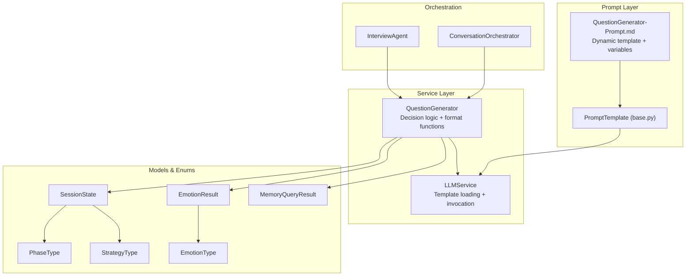
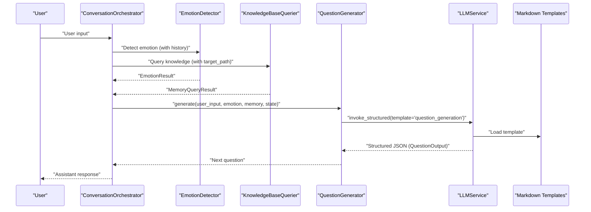
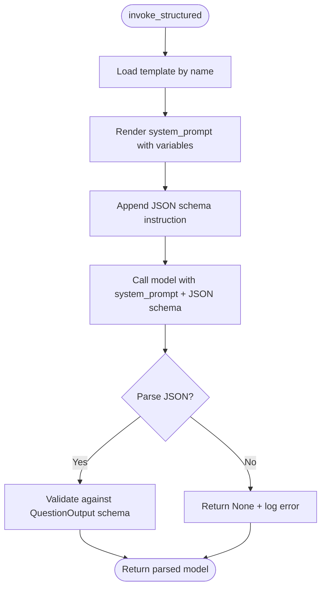
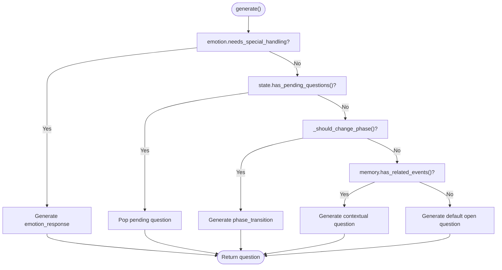
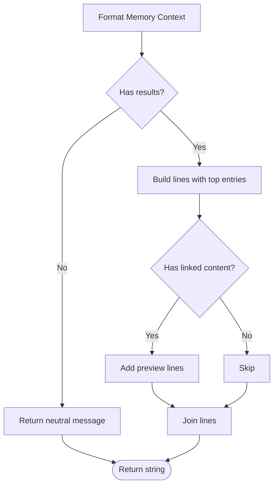
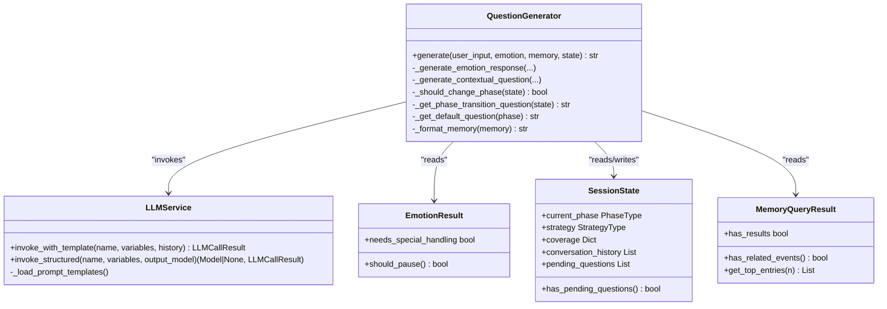

# QuestionGenerator Prompt Template

<cite>
**Referenced Files in This Document**
- [QuestionGenerator-Prompt.md](file://Prompts/QuestionGenerator-Prompt.md)
- [QuestionGenerator-Prompt.md](file://src/prompts/QuestionGenerator-Prompt.md)
- [question_generator.py](file://src/services/question_generator.py)
- [llm_service.py](file://src/services/llm_service.py)
- [emotion_result.py](file://src/models/emotion_result.py)
- [session_state.py](file://src/models/session_state.py)
- [conversation_turn.py](file://src/models/conversation_turn.py)
- [memory_query_result.py](file://src/models/memory_query_result.py)
- [phase_type.py](file://src/enums/phase_type.py)
- [strategy_type.py](file://src/enums/strategy_type.py)
- [emotion_type.py](file://src/enums/emotion_type.py)
- [base.py](file://src/prompts/base.py)
- [conversation_orchestrator.py](file://src/core/conversation_orchestrator.py)
- [interview_agent.py](file://src/agents/interview_agent.py)
</cite>

## Table of Contents
1. [Introduction](#introduction)
2. [Project Structure](#project-structure)
3. [Core Components](#core-components)
4. [Architecture Overview](#architecture-overview)
5. [Detailed Component Analysis](#detailed-component-analysis)
6. [Dependency Analysis](#dependency-analysis)
7. [Performance Considerations](#performance-considerations)
8. [Troubleshooting Guide](#troubleshooting-guide)
9. [Conclusion](#conclusion)
10. [Appendices](#appendices)

## Introduction
This document explains the QuestionGenerator prompt template system that dynamically generates interview questions for an elderly life-story collection agent. It covers the dynamic prompt architecture, variable substitution, JSON output formatting, the four question types, the variable system, format functions, integration with LLMService, priority decision chain, and best practices for customization.

## Project Structure
The QuestionGenerator system spans prompt definitions, service orchestration, and model/data structures:
- Prompt definition: Markdown templates define the dynamic prompt structure and variable substitutions.
- Service layer: QuestionGenerator encapsulates decision logic and integrates with LLMService.
- Models: EmotionResult, SessionState, MemoryQueryResult, and enums provide runtime context.
- Orchestration: ConversationOrchestrator coordinates emotion detection, knowledge querying, and question generation.

**Diagram sources**
- [QuestionGenerator-Prompt.md:1-352](file://src/prompts/QuestionGenerator-Prompt.md#L1-L352)
- [base.py:6-33](file://src/prompts/base.py#L6-L33)
- [question_generator.py:12-253](file://src/services/question_generator.py#L12-L253)
- [llm_service.py:32-481](file://src/services/llm_service.py#L32-L481)
- [emotion_result.py:6-57](file://src/models/emotion_result.py#L6-L57)
- [session_state.py:24-139](file://src/models/session_state.py#L24-L139)
- [memory_query_result.py:23-81](file://src/models/memory_query_result.py#L23-L81)
- [phase_type.py:4-10](file://src/enums/phase_type.py#L4-L10)
- [strategy_type.py:4-8](file://src/enums/strategy_type.py#L4-L8)
- [emotion_type.py:4-50](file://src/enums/emotion_type.py#L4-L50)
- [conversation_orchestrator.py:138-658](file://src/core/conversation_orchestrator.py#L138-L658)
- [interview_agent.py:16-346](file://src/agents/interview_agent.py#L16-L346)

**Section sources**
- [QuestionGenerator-Prompt.md:1-352](file://src/prompts/QuestionGenerator-Prompt.md#L1-L352)
- [question_generator.py:12-253](file://src/services/question_generator.py#L12-L253)
- [llm_service.py:32-481](file://src/services/llm_service.py#L32-L481)
- [conversation_orchestrator.py:138-658](file://src/core/conversation_orchestrator.py#L138-L658)

## Core Components
- Dynamic Prompt Template: Defines roles, tasks, input variables, principles, and JSON output schema.
- Variable System: user_input, emotion_result, memory_context, current_phase, interview_strategy, conversation_history, pending_topics.
- Decision Logic: Priority chain for question types (emotion_response, pending, phase_transition, contextual/default).
- Format Functions: _format_memory_context, _format_history_summary, _format_pending_topics.
- Integration: LLMService loads templates from Markdown and invokes structured JSON output.

**Section sources**
- [QuestionGenerator-Prompt.md:10-202](file://src/prompts/QuestionGenerator-Prompt.md#L10-L202)
- [question_generator.py:38-74](file://src/services/question_generator.py#L38-L74)
- [llm_service.py:293-399](file://src/services/llm_service.py#L293-L399)

## Architecture Overview
The system integrates emotion detection, knowledge querying, and question generation in a coordinated loop. ConversationOrchestrator drives the process, while QuestionGenerator selects and formats the next question using LLMService.

**Diagram sources**
- [conversation_orchestrator.py:236-343](file://src/core/conversation_orchestrator.py#L236-L343)
- [question_generator.py:38-74](file://src/services/question_generator.py#L38-L74)
- [llm_service.py:293-399](file://src/services/llm_service.py#L293-L399)
- [QuestionGenerator-Prompt.md:1-352](file://src/prompts/QuestionGenerator-Prompt.md#L1-L352)

## Detailed Component Analysis

### Dynamic Prompt Template and Variables
- Template structure defines system role, task, input variables, principles, and JSON output schema.
- Variables are substituted via PromptTemplate.render and LLMService.invoke_with_template.
- Variables include user_input, emotion_result (JSON), memory_context, current_phase, interview_strategy, conversation_history, pending_topics.

**Section sources**
- [QuestionGenerator-Prompt.md:10-202](file://src/prompts/QuestionGenerator-Prompt.md#L10-L202)
- [base.py:24-33](file://src/prompts/base.py#L24-L33)
- [llm_service.py:293-325](file://src/services/llm_service.py#L293-L325)

### Variable Substitution Mechanisms
- emotion_result: Converted to JSON string using model_dump_json(indent=2).
- memory_context: Formatted by _format_memory_context returning a concise string with top entries and linked previews.
- current_phase: Mapped to a descriptive label using PHASE_LABELS.
- interview_strategy: Mapped to a descriptive label using STRATEGY_LABELS.
- conversation_history: Summarized by _format_history_summary showing completed phases and recent turns.
- pending_topics: Formatted by _format_pending_topics listing top topics.

**Section sources**
- [QuestionGenerator-Prompt.md:107-201](file://src/prompts/QuestionGenerator-Prompt.md#L107-L201)
- [question_generator.py:141-150](file://src/services/question_generator.py#L141-L150)

### JSON Output Formatting and Validation
- LLMService.invoke_structured renders the template, appends a JSON schema instruction, and parses the response into QuestionOutput.
- Fallback occurs if structured parsing fails.

**Diagram sources**
- [llm_service.py:327-399](file://src/services/llm_service.py#L327-L399)
- [QuestionGenerator-Prompt.md:260-281](file://src/prompts/QuestionGenerator-Prompt.md#L260-L281)

**Section sources**
- [llm_service.py:327-399](file://src/services/llm_service.py#L327-L399)
- [QuestionGenerator-Prompt.md:260-281](file://src/prompts/QuestionGenerator-Prompt.md#L260-L281)

### Question Types and Decision Logic
Four question types are supported:
- open: Default open-ended question per phase.
- follow_up: Continue building on user’s specific story.
- emotion_response: Address emotional needs.
- phase_transition: Transition between life stages.

Priority decision chain:
1. Emotion needs special handling → emotion_response
2. Pending questions exist → follow_up
3. Should change phase → phase_transition
4. Related memory exists → contextual question
5. Otherwise → default open question

**Diagram sources**
- [question_generator.py:38-74](file://src/services/question_generator.py#L38-L74)
- [emotion_result.py:29-46](file://src/models/emotion_result.py#L29-L46)
- [session_state.py:115-117](file://src/models/session_state.py#L115-L117)

**Section sources**
- [question_generator.py:38-74](file://src/services/question_generator.py#L38-L74)
- [emotion_result.py:29-46](file://src/models/emotion_result.py#L29-L46)

### Variable System Details
- user_input: From ConversationTurn.user_input.
- emotion_result: EmotionResult JSON string.
- memory_context: Formatted by _format_memory_context.
- current_phase: SessionState.current_phase mapped to descriptive label.
- interview_strategy: SessionState.strategy mapped to descriptive label.
- conversation_history: Summarized by _format_history_summary.
- pending_topics: Formatted by _format_pending_topics.

**Section sources**
- [QuestionGenerator-Prompt.md:93-201](file://src/prompts/QuestionGenerator-Prompt.md#L93-L201)
- [session_state.py:24-139](file://src/models/session_state.py#L24-L139)
- [conversation_turn.py:14-52](file://src/models/conversation_turn.py#L14-L52)

### Format Functions Implementation
- _format_memory_context(memory): Returns a compact string with top entries and linked previews; falls back to a neutral message when no results.
- _format_history_summary(state): Lists completed phases and recent turns.
- _format_pending_topics(state): Lists top pending topics.

**Diagram sources**
- [QuestionGenerator-Prompt.md:114-133](file://src/prompts/QuestionGenerator-Prompt.md#L114-L133)

**Section sources**
- [QuestionGenerator-Prompt.md:114-201](file://src/prompts/QuestionGenerator-Prompt.md#L114-L201)

### Integration with LLMService
- Template registration: PROMPT_TEMPLATES maps template names to system prompts, output format, tokens, and temperature.
- Invocation: invoke_with_template renders the template and calls the model; invoke_structured appends JSON schema and validates output.
- Fallback: On structured parse failure, QuestionGenerator returns a fallback question.

**Section sources**
- [llm_service.py:246-256](file://src/services/llm_service.py#L246-L256)
- [llm_service.py:293-399](file://src/services/llm_service.py#L293-L399)
- [question_generator.py:236-240](file://src/services/question_generator.py#L236-L240)

### Concrete Examples and Transformations
- Input: user_input, emotion_result JSON, memory_context formatted, current_phase label, interview_strategy label, conversation_history summary, pending_topics list.
- Output: JSON with fields question, question_type, reasoning, expected_info; fallback to a default question if structured output fails.

**Section sources**
- [QuestionGenerator-Prompt.md:306-351](file://src/prompts/QuestionGenerator-Prompt.md#L306-L351)
- [question_generator.py:236-240](file://src/services/question_generator.py#L236-L240)

### Best Practices for Prompt Customization
- Keep system role and principles aligned with the interview goal.
- Limit variable cardinality to reduce token usage.
- Use clear JSON schema instructions for structured output.
- Provide robust fallbacks for emotion handling and default questions.
- Validate variable completeness before rendering.

**Section sources**
- [QuestionGenerator-Prompt.md:70-89](file://src/prompts/QuestionGenerator-Prompt.md#L70-L89)
- [llm_service.py:355-365](file://src/services/llm_service.py#L355-L365)

## Dependency Analysis
- QuestionGenerator depends on EmotionResult, SessionState, MemoryQueryResult, and enums for decision-making.
- LLMService depends on PromptTemplate and external providers; it loads templates from Markdown and Python modules.
- ConversationOrchestrator coordinates emotion detection, knowledge querying, and question generation.

**Diagram sources**
- [question_generator.py:12-253](file://src/services/question_generator.py#L12-L253)
- [llm_service.py:32-481](file://src/services/llm_service.py#L32-L481)
- [emotion_result.py:6-57](file://src/models/emotion_result.py#L6-L57)
- [session_state.py:24-139](file://src/models/session_state.py#L24-L139)
- [memory_query_result.py:23-81](file://src/models/memory_query_result.py#L23-L81)

**Section sources**
- [question_generator.py:12-253](file://src/services/question_generator.py#L12-L253)
- [llm_service.py:126-161](file://src/services/llm_service.py#L126-L161)

## Performance Considerations
- Token limits: Templates specify max_tokens; keep summaries concise.
- Structured output retries: LLMService retries with exponential backoff.
- Parallel orchestration: ConversationOrchestrator runs emotion detection and knowledge querying concurrently.
- Fallbacks: Emotion response fallback and default question fallback prevent stalls.

**Section sources**
- [llm_service.py:400-437](file://src/services/llm_service.py#L400-L437)
- [conversation_orchestrator.py:269-302](file://src/core/conversation_orchestrator.py#L269-L302)
- [question_generator.py:99-107](file://src/services/question_generator.py#L99-L107)

## Troubleshooting Guide
- Structured output parsing errors: LLMService logs parse errors and marks result unsuccessful; QuestionGenerator falls back to a default question.
- Missing template: LLMService raises a ValueError if template not found.
- Emotion handling: If emotion requires special handling, QuestionGenerator attempts emotion_response; otherwise uses fallback responses keyed by emotion type and intensity.
- Time warnings: InterviewAgent adds time warnings near threshold; ConversationOrchestrator emits session time-up events.

**Section sources**
- [llm_service.py:394-398](file://src/services/llm_service.py#L394-L398)
- [question_generator.py:99-107](file://src/services/question_generator.py#L99-L107)
- [interview_agent.py:284-286](file://src/agents/interview_agent.py#L284-L286)
- [conversation_orchestrator.py:570-592](file://src/core/conversation_orchestrator.py#L570-L592)

## Conclusion
The QuestionGenerator system combines a dynamic prompt template with robust decision logic and format functions to produce context-aware, emotionally responsive questions. Its integration with LLMService ensures structured, validated outputs and graceful fallbacks, while the orchestration layer coordinates multi-modal inputs for a cohesive interview experience.

## Appendices

### Variable Reference
- user_input: String from ConversationTurn.user_input.
- emotion_result: JSON string of EmotionResult.
- memory_context: Formatted string of top memory entries and linked previews.
- current_phase: Descriptive label derived from PhaseType.
- interview_strategy: Descriptive label derived from StrategyType.
- conversation_history: Summary of completed phases and recent turns.
- pending_topics: Top topics awaiting exploration.

**Section sources**
- [QuestionGenerator-Prompt.md:93-201](file://src/prompts/QuestionGenerator-Prompt.md#L93-L201)
- [session_state.py:24-139](file://src/models/session_state.py#L24-L139)
- [conversation_turn.py:14-52](file://src/models/conversation_turn.py#L14-L52)