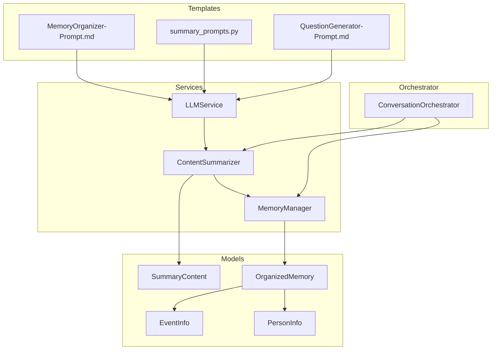
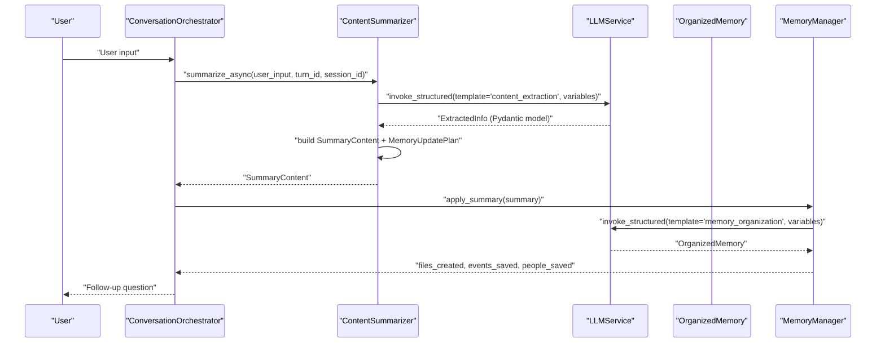
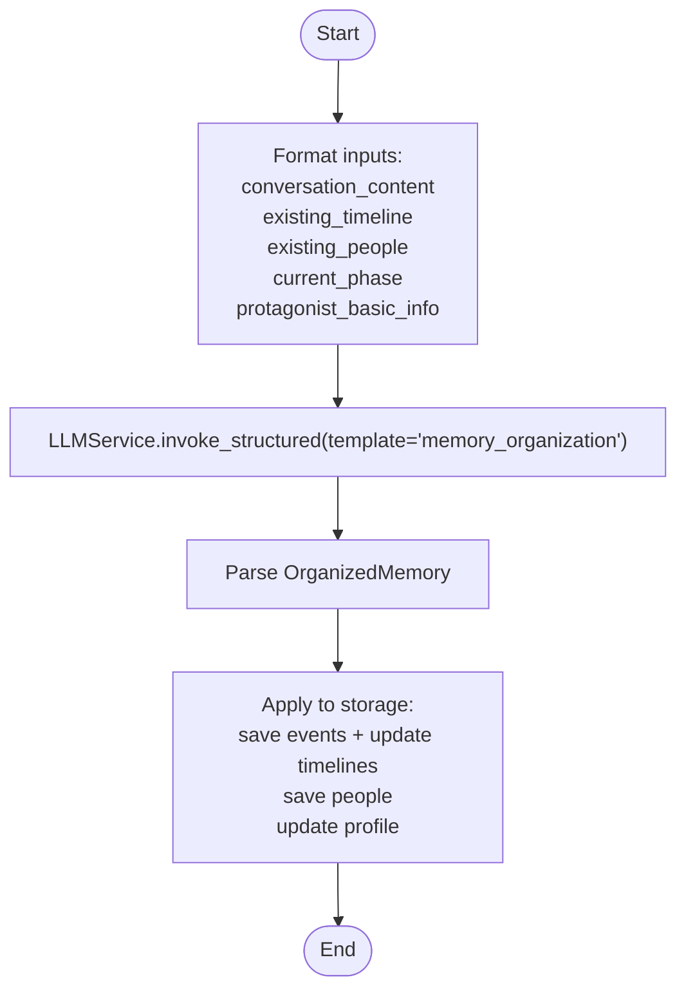
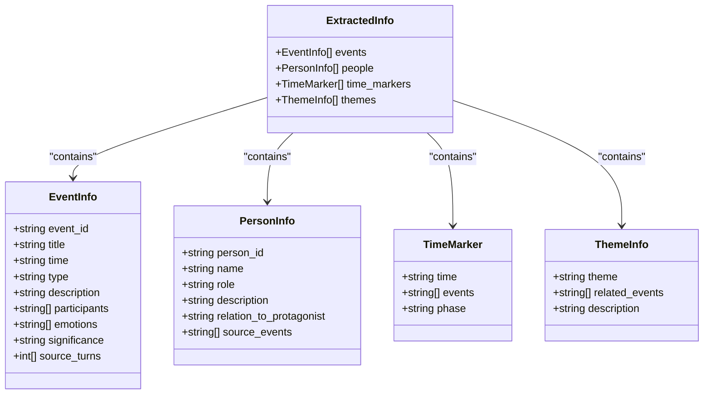
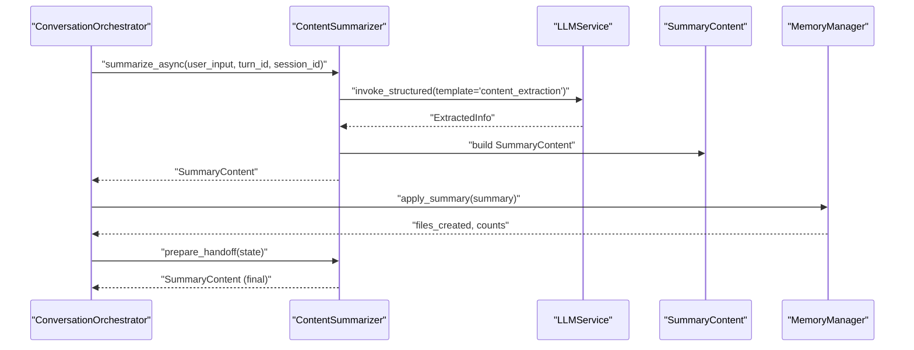
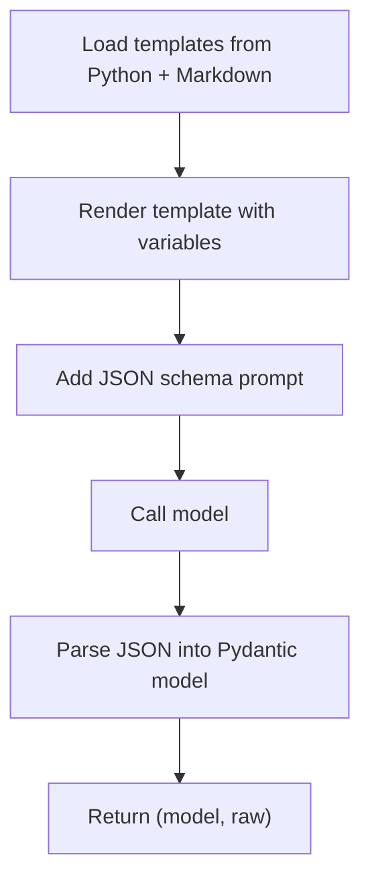
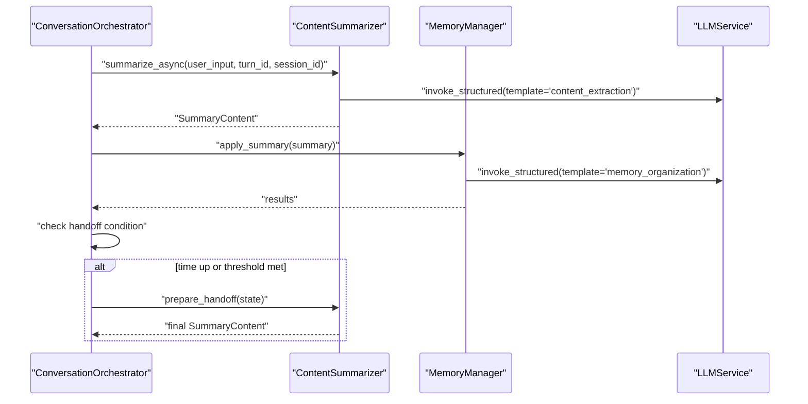
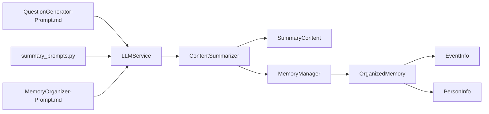

# Summary and Content Structuring Prompts

<cite>
**Referenced Files in This Document**
- [MemoryOrganizer-Prompt.md](file://Prompts/MemoryOrganizer-Prompt.md)
- [summary_prompts.py](file://src/prompts/summary_prompts.py)
- [content_summarizer.py](file://src/services/content_summarizer.py)
- [summary_content.py](file://src/models/summary_content.py)
- [organized_memory.py](file://src/models/organized_memory.py)
- [base.py](file://src/prompts/base.py)
- [event_info.py](file://src/models/event_info.py)
- [person_info.py](file://src/models/person_info.py)
- [conversation_orchestrator.py](file://src/core/conversation_orchestrator.py)
- [llm_service.py](file://src/services/llm_service.py)
- [QuestionGenerator-Prompt.md](file://Prompts/QuestionGenerator-Prompt.md)
</cite>

## Table of Contents
1. [Introduction](#introduction)
2. [Project Structure](#project-structure)
3. [Core Components](#core-components)
4. [Architecture Overview](#architecture-overview)
5. [Detailed Component Analysis](#detailed-component-analysis)
6. [Dependency Analysis](#dependency-analysis)
7. [Performance Considerations](#performance-considerations)
8. [Troubleshooting Guide](#troubleshooting-guide)
9. [Conclusion](#conclusion)
10. [Appendices](#appendices)

## Introduction
This document explains the prompt templates and systems used to structure interview content into durable, searchable knowledge. It focuses on:
- Summary and content structuring prompts for extracting structured information from interviews
- Narrative organization across time, events, and people
- Memory consolidation via a unified OrganizedMemory schema
- Integration with the content_summarizer service and the broader interview workflow
- Guidance for customizing prompts across cultures and storytelling preferences

## Project Structure
The prompt system spans Markdown-based templates and Python-driven orchestration:
- Prompt templates live in Prompts/ (Markdown) and Python modules (src/prompts/)
- Services consume templates via LLMService and produce structured models
- Models define the schema for extracted content and memory updates
- The orchestrator coordinates summarization and memory updates during sessions

**Diagram sources**
- [MemoryOrganizer-Prompt.md:1-773](file://Prompts/MemoryOrganizer-Prompt.md#L1-L773)
- [summary_prompts.py:1-49](file://src/prompts/summary_prompts.py#L1-L49)
- [content_summarizer.py:1-177](file://src/services/content_summarizer.py#L1-L177)
- [summary_content.py:1-67](file://src/models/summary_content.py#L1-L67)
- [organized_memory.py:1-151](file://src/models/organized_memory.py#L1-L151)
- [conversation_orchestrator.py:1-658](file://src/core/conversation_orchestrator.py#L1-L658)
- [llm_service.py:1-481](file://src/services/llm_service.py#L1-L481)

**Section sources**
- [MemoryOrganizer-Prompt.md:1-773](file://Prompts/MemoryOrganizer-Prompt.md#L1-L773)
- [summary_prompts.py:1-49](file://src/prompts/summary_prompts.py#L1-L49)
- [content_summarizer.py:1-177](file://src/services/content_summarizer.py#L1-L177)
- [summary_content.py:1-67](file://src/models/summary_content.py#L1-L67)
- [organized_memory.py:1-151](file://src/models/organized_memory.py#L1-L151)
- [conversation_orchestrator.py:1-658](file://src/core/conversation_orchestrator.py#L1-L658)
- [llm_service.py:1-481](file://src/services/llm_service.py#L1-L481)

## Core Components
- MemoryOrganization Prompt: Defines the dynamic prompt for organizing conversations into time, events, people, and profile updates. It specifies input variables, processing rules, and a strict JSON schema for output.
- Content Extraction Prompt: Defines the content extraction prompt for per-turn structured extraction into events, people, time markers, and themes.
- ContentSummarizer: Orchestrates per-turn extraction and builds a SummaryContent object with extracted info and a memory update plan.
- LLMService: Loads templates from Markdown and Python, renders them, and supports structured JSON parsing into Pydantic models.
- OrganizedMemory and SummaryContent: Define the schemas for memory consolidation and interim summary artifacts.
- ConversationOrchestrator: Drives the interview loop, invoking summarization asynchronously and preparing handoff packages.

**Section sources**
- [MemoryOrganizer-Prompt.md:1-773](file://Prompts/MemoryOrganizer-Prompt.md#L1-L773)
- [summary_prompts.py:1-49](file://src/prompts/summary_prompts.py#L1-L49)
- [content_summarizer.py:1-177](file://src/services/content_summarizer.py#L1-L177)
- [summary_content.py:1-67](file://src/models/summary_content.py#L1-L67)
- [organized_memory.py:1-151](file://src/models/organized_memory.py#L1-L151)
- [conversation_orchestrator.py:1-658](file://src/core/conversation_orchestrator.py#L1-L658)
- [llm_service.py:1-481](file://src/services/llm_service.py#L1-L481)

## Architecture Overview
The summarization pipeline integrates prompts, services, and models to transform interview transcripts into structured memory entries.

**Diagram sources**
- [conversation_orchestrator.py:279-284](file://src/core/conversation_orchestrator.py#L279-L284)
- [content_summarizer.py:43-93](file://src/services/content_summarizer.py#L43-L93)
- [llm_service.py:327-399](file://src/services/llm_service.py#L327-L399)
- [organized_memory.py:140-151](file://src/models/organized_memory.py#L140-L151)
- [MemoryOrganizer-Prompt.md:314-337](file://Prompts/MemoryOrganizer-Prompt.md#L314-L337)

## Detailed Component Analysis

### MemoryOrganization Prompt System
- Purpose: Transform multi-turn interview content into three-dimensional knowledge: timeline nodes, events, and people, plus profile updates.
- Inputs: conversation_content, existing_timeline, existing_people, current_phase, protagonist_basic_info.
- Processing rules: precise time assignment, stage classification, completeness checks, emotional tagging, and confidence scoring.
- Output schema: timeline_updates, events, people, profile_updates, storage_suggestions, processing_summary.

**Diagram sources**
- [MemoryOrganizer-Prompt.md:314-337](file://Prompts/MemoryOrganizer-Prompt.md#L314-L337)
- [MemoryOrganizer-Prompt.md:339-363](file://Prompts/MemoryOrganizer-Prompt.md#L339-L363)
- [organized_memory.py:140-151](file://src/models/organized_memory.py#L140-L151)

**Section sources**
- [MemoryOrganizer-Prompt.md:1-773](file://Prompts/MemoryOrganizer-Prompt.md#L1-L773)
- [organized_memory.py:1-151](file://src/models/organized_memory.py#L1-L151)

### Content Extraction Prompt System
- Purpose: Per-turn extraction of structured information into events, people, time markers, and themes.
- Template: content_extraction with explicit variable placeholders and JSON schema guidance.
- Integration: ContentSummarizer calls LLMService.invoke_structured with ExtractedInfo as output model.

**Diagram sources**
- [summary_prompts.py:4-48](file://src/prompts/summary_prompts.py#L4-L48)
- [summary_content.py:22-28](file://src/models/summary_content.py#L22-L28)
- [event_info.py:5-33](file://src/models/event_info.py#L5-L33)
- [person_info.py:5-32](file://src/models/person_info.py#L5-L32)

**Section sources**
- [summary_prompts.py:1-49](file://src/prompts/summary_prompts.py#L1-L49)
- [summary_content.py:1-67](file://src/models/summary_content.py#L1-L67)
- [event_info.py:1-69](file://src/models/event_info.py#L1-L69)
- [person_info.py:1-61](file://src/models/person_info.py#L1-L61)

### ContentSummarizer Integration
- Responsibilities: asynchronous extraction per turn, building SummaryContent, and applying updates to MemoryManager.
- Handoff: prepares a final SummaryContent when the session ends, aggregating all events and people.
- MemoryUpdatePlan: short-term and long-term update hints for downstream consumers.

**Diagram sources**
- [content_summarizer.py:43-143](file://src/services/content_summarizer.py#L43-L143)
- [summary_content.py:37-67](file://src/models/summary_content.py#L37-L67)
- [conversation_orchestrator.py:353-389](file://src/core/conversation_orchestrator.py#L353-L389)

**Section sources**
- [content_summarizer.py:1-177](file://src/services/content_summarizer.py#L1-L177)
- [summary_content.py:1-67](file://src/models/summary_content.py#L1-L67)
- [conversation_orchestrator.py:353-389](file://src/core/conversation_orchestrator.py#L353-L389)

### LLMService Template Loading and Structured Parsing
- Loads templates from Python modules and Markdown files.
- Supports structured JSON parsing into Pydantic models with robust error handling.
- Provides invoke_with_template and invoke_structured entry points.

**Diagram sources**
- [llm_service.py:126-216](file://src/services/llm_service.py#L126-L216)
- [llm_service.py:327-399](file://src/services/llm_service.py#L327-L399)
- [base.py:6-33](file://src/prompts/base.py#L6-L33)

**Section sources**
- [llm_service.py:1-481](file://src/services/llm_service.py#L1-L481)
- [base.py:1-33](file://src/prompts/base.py#L1-L33)

### Interview Workflow Integration
- ConversationOrchestrator triggers ContentSummarizer per turn and manages timing, handoffs, and end-of-session summaries.
- MemoryManager applies updates and organizes content via the MemoryOrganization prompt.

**Diagram sources**
- [conversation_orchestrator.py:236-401](file://src/core/conversation_orchestrator.py#L236-L401)
- [content_summarizer.py:111-143](file://src/services/content_summarizer.py#L111-L143)
- [MemoryOrganizer-Prompt.md:314-337](file://Prompts/MemoryOrganizer-Prompt.md#L314-L337)

**Section sources**
- [conversation_orchestrator.py:1-658](file://src/core/conversation_orchestrator.py#L1-L658)
- [content_summarizer.py:1-177](file://src/services/content_summarizer.py#L1-L177)

## Dependency Analysis
- Templates depend on LLMService for rendering and structured parsing.
- ContentSummarizer depends on LLMService and MemoryManager.
- MemoryManager depends on LLMService and uses OrganizedMemory schema.
- Models define the contract for data transformation across services.

**Diagram sources**
- [QuestionGenerator-Prompt.md:1-352](file://Prompts/QuestionGenerator-Prompt.md#L1-L352)
- [summary_prompts.py:1-49](file://src/prompts/summary_prompts.py#L1-L49)
- [MemoryOrganizer-Prompt.md:1-773](file://Prompts/MemoryOrganizer-Prompt.md#L1-L773)
- [llm_service.py:1-481](file://src/services/llm_service.py#L1-L481)
- [content_summarizer.py:1-177](file://src/services/content_summarizer.py#L1-L177)
- [summary_content.py:1-67](file://src/models/summary_content.py#L1-L67)
- [organized_memory.py:1-151](file://src/models/organized_memory.py#L1-L151)
- [event_info.py:1-69](file://src/models/event_info.py#L1-L69)
- [person_info.py:1-61](file://src/models/person_info.py#L1-L61)

**Section sources**
- [llm_service.py:1-481](file://src/services/llm_service.py#L1-L481)
- [content_summarizer.py:1-177](file://src/services/content_summarizer.py#L1-L177)
- [organized_memory.py:1-151](file://src/models/organized_memory.py#L1-L151)
- [summary_content.py:1-67](file://src/models/summary_content.py#L1-L67)

## Performance Considerations
- Asynchronous extraction: ContentSummarizer runs per-turn extraction without blocking the main loop.
- Parallel saves: MemoryManager aggregates save tasks and executes them concurrently.
- Structured parsing: LLMService validates and parses JSON into strongly typed models, reducing downstream errors.
- Template loading: LLMService loads templates lazily from disk and Python modules, minimizing startup overhead.

[No sources needed since this section provides general guidance]

## Troubleshooting Guide
Common issues and resolutions:
- Template not found: Ensure the template name matches between calls and loaded templates.
- Structured parsing failures: Verify the LLM returned valid JSON and that the schema matches the output model.
- Missing variables: Confirm all required variables are provided when invoking structured templates.
- Memory organization failures: Check logs for errors and confirm the OrganizedMemory schema alignment.

**Section sources**
- [llm_service.py:312-315](file://src/services/llm_service.py#L312-L315)
- [llm_service.py:378-398](file://src/services/llm_service.py#L378-L398)
- [MemoryOrganizer-Prompt.md:330-332](file://Prompts/MemoryOrganizer-Prompt.md#L330-L332)

## Conclusion
The prompt system couples two complementary approaches:
- Content extraction per turn for incremental, structured capture
- Memory organization for holistic consolidation across time, events, and people

Together, they enable a robust interview workflow that transforms unstructured narratives into durable, navigable knowledge.

[No sources needed since this section summarizes without analyzing specific files]

## Appendices

### Prompt Patterns by Content Type
- Events: Extract time, location, participants, description, emotions, user evaluation, related events, and confidence.
- People: Capture identity, role, description, relationships, influence level, and key quotes.
- Themes: Aggregate recurring ideas and connect them to related events.
- Time markers: Group events by meaningful time points and assign life-phase categories.

**Section sources**
- [summary_prompts.py:4-48](file://src/prompts/summary_prompts.py#L4-L48)
- [summary_content.py:8-28](file://src/models/summary_content.py#L8-L28)
- [event_info.py:5-33](file://src/models/event_info.py#L5-L33)
- [person_info.py:5-32](file://src/models/person_info.py#L5-L32)

### Customization Guidelines
- Cultural adaptation: Adjust tone and phrasing in the content extraction prompt to match local storytelling styles.
- Storytelling preference: Modify emphasis on emotional tags, narrative arcs, or factual precision based on user preference.
- Domain-specificity: Extend event types and relationship categories to reflect cultural or domain nuances.
- Validation: Add explicit constraints in the structured schema to enforce domain-specific completeness.

**Section sources**
- [summary_prompts.py:32-35](file://src/prompts/summary_prompts.py#L32-L35)
- [MemoryOrganizer-Prompt.md:57-82](file://Prompts/MemoryOrganizer-Prompt.md#L57-L82)