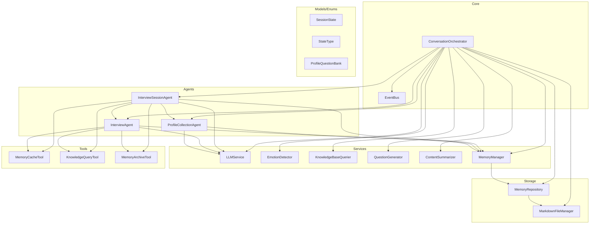
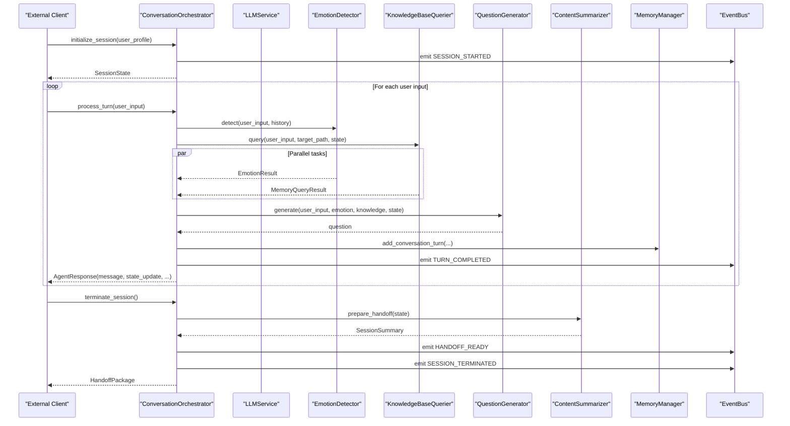
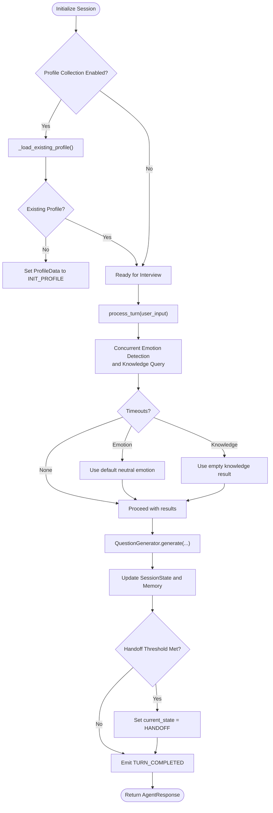
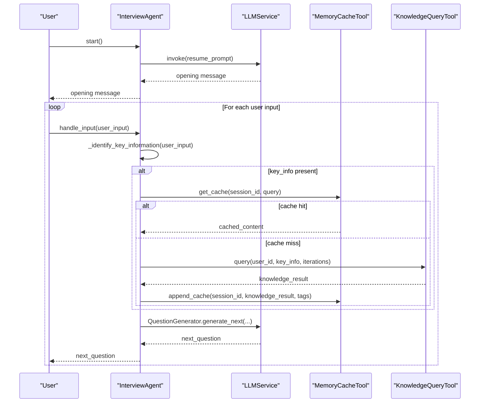
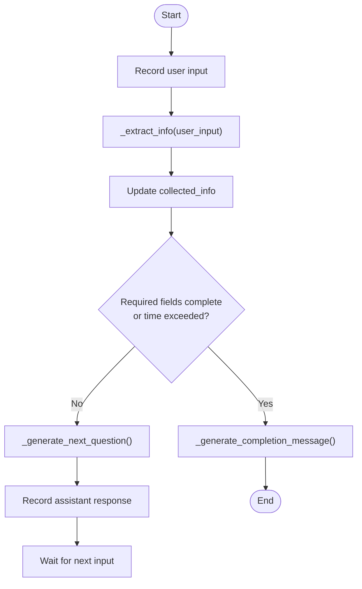
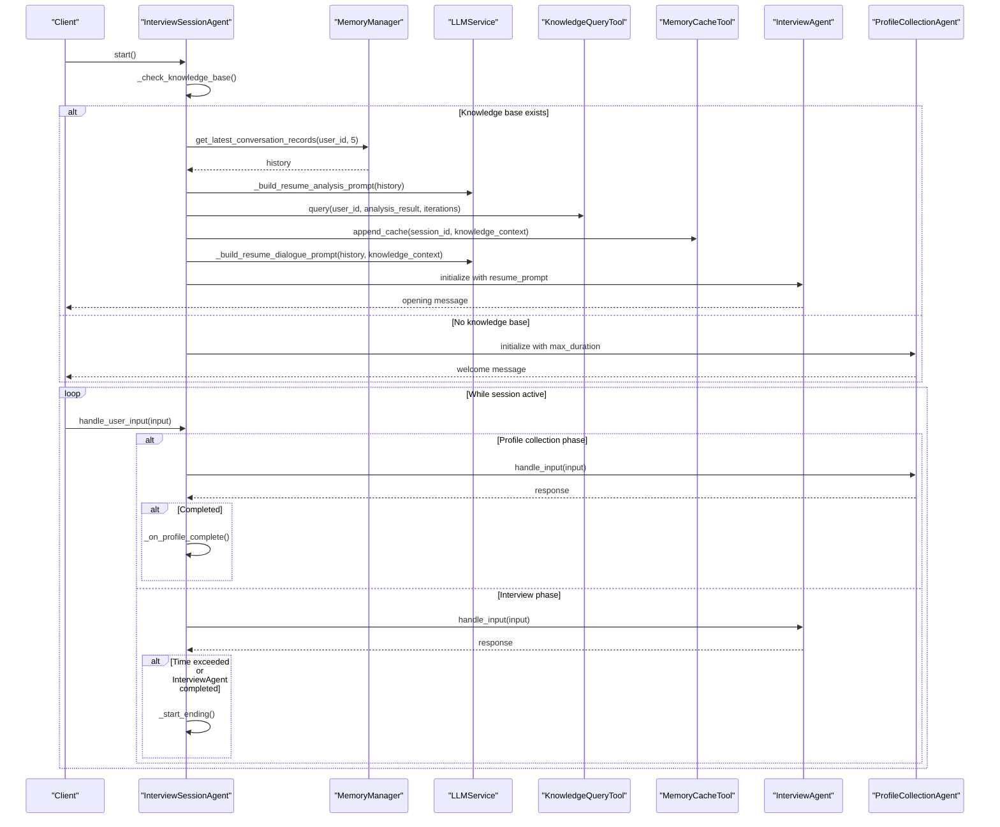
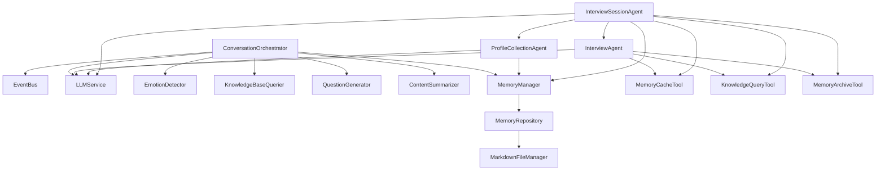
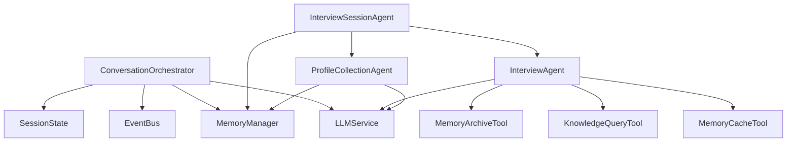

# Component Architecture

<cite>
**Referenced Files in This Document**
- [conversation_orchestrator.py](file://src/core/conversation_orchestrator.py)
- [event_bus.py](file://src/core/event_bus.py)
- [interview_agent.py](file://src/agents/interview_agent.py)
- [profile_collection_agent.py](file://src/agents/profile_collection_agent.py)
- [interview_session_agent.py](file://src/agents/interview_session_agent.py)
- [llm_service.py](file://src/services/llm_service.py)
- [session_state.py](file://src/models/session_state.py)
- [state_type.py](file://src/enums/state_type.py)
- [profile_questions.py](file://src/config/profile_questions.py)
- [memory_cache_tool.py](file://src/tools/memory_cache_tool.py)
- [memory_repository.py](file://src/storage/memory_repository.py)
</cite>

## Table of Contents
1. [Introduction](#introduction)
2. [Project Structure](#project-structure)
3. [Core Components](#core-components)
4. [Architecture Overview](#architecture-overview)
5. [Detailed Component Analysis](#detailed-component-analysis)
6. [Dependency Analysis](#dependency-analysis)
7. [Performance Considerations](#performance-considerations)
8. [Troubleshooting Guide](#troubleshooting-guide)
9. [Conclusion](#conclusion)

## Introduction
This document describes the component architecture of the interview and memory orchestration system. It focuses on the ConversationOrchestrator as the central coordinator, detailing how it manages agent lifecycles, state transitions, and parallel processing. It also documents the three main agent types: InterviewAgent for conversation management, ProfileCollectionAgent for user onboarding, and InterviewSessionAgent for complete session lifecycle. The document explains component dependencies, initialization sequences, communication patterns, and integration points with external services. It includes component interaction diagrams, data flow, event handling, state management, lifecycle management, error handling strategies, and performance considerations.

## Project Structure
The system is organized around a core orchestrator coordinating specialized agents and services. Key modules include:
- Core: ConversationOrchestrator and EventBus
- Agents: InterviewAgent, ProfileCollectionAgent, InterviewSessionAgent
- Services: LLMService, EmotionDetector, KnowledgeBaseQuerier, QuestionGenerator, ContentSummarizer, MemoryManager
- Storage: MemoryRepository, MarkdownFileManager
- Tools: MemoryCacheTool, KnowledgeQueryTool, MemoryArchiveTool
- Models and Enums: SessionState, ConversationTurn, EmotionResult, MemoryQueryResult, AgentResponse, HandoffPackage, SessionSummary, ProgressInfo, CollectedData, StateType, PhaseType, StrategyType
- Configuration: LLMConfig, ProfileQuestionBank

**Diagram sources**
- [conversation_orchestrator.py:138-197](file://src/core/conversation_orchestrator.py#L138-L197)
- [interview_agent.py:16-79](file://src/agents/interview_agent.py#L16-L79)
- [profile_collection_agent.py:14-49](file://src/agents/profile_collection_agent.py#L14-L49)
- [interview_session_agent.py:33-106](file://src/agents/interview_session_agent.py#L33-L106)
- [llm_service.py:32-89](file://src/services/llm_service.py#L32-L89)
- [memory_repository.py:40-88](file://src/storage/memory_repository.py#L40-L88)

**Section sources**
- [conversation_orchestrator.py:138-197](file://src/core/conversation_orchestrator.py#L138-L197)
- [interview_agent.py:16-79](file://src/agents/interview_agent.py#L16-L79)
- [profile_collection_agent.py:14-49](file://src/agents/profile_collection_agent.py#L14-L49)
- [interview_session_agent.py:33-106](file://src/agents/interview_session_agent.py#L33-L106)

## Core Components
- ConversationOrchestrator: Central coordinator that initializes and coordinates all subsystems, manages session timing and state, performs parallel processing of emotion detection, knowledge queries, and summarization, and emits events for external monitoring.
- EventBus: Publish-subscribe event bus decoupling components and enabling asynchronous handlers.
- InterviewAgent: Manages interview flow, question generation, knowledge queries, caching, and time-aware prompting.
- ProfileCollectionAgent: Collects user profile information progressively with structured extraction and time limits.
- InterviewSessionAgent: Top-level session manager that decides whether to resume existing sessions or start profile collection, and orchestrates transitions between phases.

Key responsibilities and interfaces:
- ConversationOrchestrator exposes initialize_session, process_turn, prepare_handoff, terminate_session, pause_session, and resume_session.
- InterviewAgent exposes start and handle_input with time-aware logic and memory context injection.
- ProfileCollectionAgent exposes start and handle_input with extraction and completion checks.
- InterviewSessionAgent exposes start, handle_user_input, and internal handlers for each phase.

Integration points:
- All agents depend on LLMService for prompt invocation and structured outputs.
- MemoryRepository and MemoryManager provide persistent and in-memory storage abstractions.
- EventBus enables cross-component observability and async event-driven coordination.

**Section sources**
- [conversation_orchestrator.py:138-401](file://src/core/conversation_orchestrator.py#L138-L401)
- [event_bus.py:40-182](file://src/core/event_bus.py#L40-L182)
- [interview_agent.py:16-184](file://src/agents/interview_agent.py#L16-L184)
- [profile_collection_agent.py:14-167](file://src/agents/profile_collection_agent.py#L14-L167)
- [interview_session_agent.py:33-270](file://src/agents/interview_session_agent.py#L33-L270)

## Architecture Overview
The ConversationOrchestrator acts as the central controller, initializing services and emitting events. During each turn, it runs emotion detection and knowledge queries concurrently, generates a question, updates session state, and publishes events. InterviewAgent and ProfileCollectionAgent operate independently, while InterviewSessionAgent coordinates higher-level session phases and delegates to the appropriate agent.

**Diagram sources**
- [conversation_orchestrator.py:198-344](file://src/core/conversation_orchestrator.py#L198-L344)
- [conversation_orchestrator.py:353-401](file://src/core/conversation_orchestrator.py#L353-L401)
- [event_bus.py:108-134](file://src/core/event_bus.py#L108-L134)

**Section sources**
- [conversation_orchestrator.py:198-344](file://src/core/conversation_orchestrator.py#L198-L344)
- [conversation_orchestrator.py:353-401](file://src/core/conversation_orchestrator.py#L353-L401)
- [event_bus.py:108-134](file://src/core/event_bus.py#L108-L134)

## Detailed Component Analysis

### ConversationOrchestrator
Central coordinator responsible for:
- Initialization: Creates and wires LLMService, MemoryRepository, MemoryManager, EmotionDetector, KnowledgeBaseQuerier, QuestionGenerator, ContentSummarizer, and EventBus.
- Session timing and profile collection: Tracks session duration and triggers profile collection for new users.
- Parallel processing: Runs emotion detection and knowledge queries concurrently with timeouts.
- State management: Updates SessionState, handles pause conditions, and checks handoff thresholds.
- Event emission: Emits session lifecycle and turn completion events.

Initialization sequence:
- Construct OrchestratorConfig and LLMConfig.
- Initialize LLMService with provider-specific model.
- Initialize MarkdownFileManager and MemoryRepository.
- Initialize MemoryManager with repository.
- Initialize EmotionDetector, KnowledgeBaseQuerier, QuestionGenerator, ContentSummarizer.
- Get EventBus singleton and set current_session to None.

Processing logic:
- process_turn creates a ConversationTurn, starts concurrent tasks for emotion and knowledge, waits with timeouts, generates a question, updates state and memory, checks handoff, and emits TURN_COMPLETED.

Handoff preparation:
- prepare_handoff computes coverage and collected data, builds HandoffPackage, and emits HANDOFF_READY.

Session termination:
- terminate_session prepares handoff and emits SESSION_TERMINATED.

Time-up handling:
- _handle_session_time_up emits SESSION_TERMINATED, generates end guide, and returns an AgentResponse indicating time-up with next topic hint.

Profile collection:
- _process_profile_collection_turn routes to initialization, basic, or detail collection handlers, updates ProfileData, and transitions to ready state upon completion.

**Diagram sources**
- [conversation_orchestrator.py:198-344](file://src/core/conversation_orchestrator.py#L198-L344)
- [conversation_orchestrator.py:421-551](file://src/core/conversation_orchestrator.py#L421-L551)

**Section sources**
- [conversation_orchestrator.py:163-197](file://src/core/conversation_orchestrator.py#L163-L197)
- [conversation_orchestrator.py:198-344](file://src/core/conversation_orchestrator.py#L198-L344)
- [conversation_orchestrator.py:353-401](file://src/core/conversation_orchestrator.py#L353-L401)
- [conversation_orchestrator.py:421-551](file://src/core/conversation_orchestrator.py#L421-L551)

### InterviewAgent
Responsibilities:
- Time-driven interview flow with 15-minute total duration (or reduced for resumed sessions).
- Progressive question generation guided by conversation history and memory context.
- Knowledge base query and cache management to reduce repeated lookups.
- End-of-session summary generation using LLMService.

Key behaviors:
- start: Generates an opening message using a resume prompt or a default template.
- handle_input: Records user input, identifies key information, checks cache, queries knowledge base if needed, updates cache, generates next question, and injects time warnings near threshold.
- generate_ending: Builds a session end guide prompt and invokes LLMService to produce a warm closing message.

**Diagram sources**
- [interview_agent.py:80-184](file://src/agents/interview_agent.py#L80-L184)
- [interview_agent.py:186-243](file://src/agents/interview_agent.py#L186-L243)

**Section sources**
- [interview_agent.py:16-184](file://src/agents/interview_agent.py#L16-L184)
- [interview_agent.py:186-243](file://src/agents/interview_agent.py#L186-L243)

### ProfileCollectionAgent
Responsibilities:
- Collect user profile information progressively with structured extraction.
- Maintain conversation history and collected info.
- Enforce time limits and required fields for completion.

Key behaviors:
- start: Loads a welcome prompt and sends an initial greeting.
- handle_input: Records user input, extracts structured fields via LLMService, checks completion criteria (required fields or time limit), and generates the next question.
- _should_complete: Returns true when required fields are filled or time exceeded.

**Diagram sources**
- [profile_collection_agent.py:130-167](file://src/agents/profile_collection_agent.py#L130-L167)
- [profile_collection_agent.py:214-227](file://src/agents/profile_collection_agent.py#L214-L227)

**Section sources**
- [profile_collection_agent.py:14-167](file://src/agents/profile_collection_agent.py#L14-L167)
- [profile_collection_agent.py:214-227](file://src/agents/profile_collection_agent.py#L214-L227)

### InterviewSessionAgent
Responsibilities:
- Full session lifecycle management: decide between resuming old sessions or starting profile collection, manage transitions, enforce time limits, and coordinate archiving.
- Knowledge base existence checks and resume analysis.
- Delegation to InterviewAgent and ProfileCollectionAgent.

Key behaviors:
- start: Checks knowledge base existence; if present, resumes session with analysis and dialogue continuation; otherwise, starts profile collection.
- handle_user_input: Routes to appropriate handler based on current phase.
- _resume_session: Loads recent conversation history, analyzes needed knowledge, queries knowledge base, caches results, constructs a resume prompt, and initializes InterviewAgent.
- _start_profile_collection: Initializes ProfileCollectionAgent and begins collection.
- _handle_interview_input: Enforces total session time, archives early conversations, and triggers ending when time is reached.
- _start_ending: Generates ending message and archives final conversation.

**Diagram sources**
- [interview_session_agent.py:112-130](file://src/agents/interview_session_agent.py#L112-L130)
- [interview_session_agent.py:178-242](file://src/agents/interview_session_agent.py#L178-L242)
- [interview_session_agent.py:243-270](file://src/agents/interview_session_agent.py#L243-L270)
- [interview_session_agent.py:341-368](file://src/agents/interview_session_agent.py#L341-L368)
- [interview_session_agent.py:369-392](file://src/agents/interview_session_agent.py#L369-L392)

**Section sources**
- [interview_session_agent.py:33-130](file://src/agents/interview_session_agent.py#L33-L130)
- [interview_session_agent.py:178-242](file://src/agents/interview_session_agent.py#L178-L242)
- [interview_session_agent.py:243-270](file://src/agents/interview_session_agent.py#L243-L270)
- [interview_session_agent.py:341-368](file://src/agents/interview_session_agent.py#L341-L368)
- [interview_session_agent.py:369-392](file://src/agents/interview_session_agent.py#L369-L392)

### Component Interactions and Communication Patterns
- Event-driven coordination: EventBus enables decoupled communication. Components publish events (TURN_COMPLETED, SESSION_STARTED, HANDOFF_READY, SESSION_TERMINATED) and optionally subscribe async handlers for non-blocking processing.
- Parallel processing: ConversationOrchestrator uses asyncio tasks to run emotion detection and knowledge queries concurrently with timeouts to prevent blocking.
- Tool-based caching: InterviewAgent uses MemoryCacheTool to avoid redundant knowledge base queries.
- Structured LLM interactions: All agents rely on LLMService for prompt rendering, structured outputs, and retries.

**Diagram sources**
- [conversation_orchestrator.py:163-197](file://src/core/conversation_orchestrator.py#L163-L197)
- [interview_agent.py:16-79](file://src/agents/interview_agent.py#L16-L79)
- [profile_collection_agent.py:14-49](file://src/agents/profile_collection_agent.py#L14-L49)
- [interview_session_agent.py:33-106](file://src/agents/interview_session_agent.py#L33-L106)
- [memory_repository.py:40-88](file://src/storage/memory_repository.py#L40-L88)

**Section sources**
- [event_bus.py:40-182](file://src/core/event_bus.py#L40-L182)
- [conversation_orchestrator.py:269-344](file://src/core/conversation_orchestrator.py#L269-L344)
- [interview_agent.py:58-79](file://src/agents/interview_agent.py#L58-L79)
- [memory_cache_tool.py:8-89](file://src/tools/memory_cache_tool.py#L8-L89)

## Dependency Analysis
- Coupling: ConversationOrchestrator tightly couples to core services and models; InterviewSessionAgent depends on InterviewAgent and ProfileCollectionAgent; InterviewAgent depends on LLMService and tools; ProfileCollectionAgent depends on LLMService and MemoryManager.
- Cohesion: Each agent encapsulates a single responsibility (interview, profile collection, session lifecycle).
- External dependencies: LangChain OpenAI chat model, filesystem-backed storage, and optional provider-specific integrations.
- Potential circular dependencies: None observed among core components; InterviewSessionAgent delegates to agents rather than importing them directly.

**Diagram sources**
- [conversation_orchestrator.py:163-197](file://src/core/conversation_orchestrator.py#L163-L197)
- [interview_session_agent.py:33-106](file://src/agents/interview_session_agent.py#L33-L106)
- [interview_agent.py:16-79](file://src/agents/interview_agent.py#L16-L79)
- [profile_collection_agent.py:14-49](file://src/agents/profile_collection_agent.py#L14-L49)

**Section sources**
- [conversation_orchestrator.py:163-197](file://src/core/conversation_orchestrator.py#L163-L197)
- [interview_session_agent.py:33-106](file://src/agents/interview_session_agent.py#L33-L106)

## Performance Considerations
- Concurrency: ConversationOrchestrator runs emotion detection and knowledge queries in parallel with timeouts to avoid blocking and improve responsiveness.
- Caching: InterviewAgent uses MemoryCacheTool to reduce repeated knowledge base queries; MemoryRepository employs LRU caching for indexed entities.
- Token management: LLMService tracks token usage and provides statistics; consider batching or rate limiting for high-throughput scenarios.
- Time controls: Session timing and profile collection durations limit resource consumption; adjust thresholds based on user behavior and provider quotas.
- Persistence: MemoryRepository maintains short-term and long-term memory; ensure efficient file I/O and avoid excessive writes during interviews.

[No sources needed since this section provides general guidance]

## Troubleshooting Guide
Common issues and strategies:
- Timeout handling: ConversationOrchestrator applies timeouts to emotion detection and knowledge queries; when exceeded, defaults are used and warnings are logged. Verify provider latency and adjust OrchestratorConfig timeouts accordingly.
- Event delivery: EventBus synchronously invokes handlers and asynchronously schedules async handlers; ensure handlers are resilient and log errors without failing the main flow.
- LLM reliability: LLMService implements retry logic with exponential backoff; monitor success rates and latency metrics via get_stats().
- Memory growth: InterviewAgent and MemoryRepository maintain histories and caches; configure capacities and periodically clear caches to prevent memory pressure.
- Session lifecycle: InterviewSessionAgent enforces time limits and archives conversations; verify archive_tool and cache_tool configurations for desired retention and performance.

**Section sources**
- [conversation_orchestrator.py:286-302](file://src/core/conversation_orchestrator.py#L286-L302)
- [event_bus.py:135-141](file://src/core/event_bus.py#L135-L141)
- [llm_service.py:400-438](file://src/services/llm_service.py#L400-L438)
- [memory_repository.py:16-38](file://src/storage/memory_repository.py#L16-L38)

## Conclusion
The system’s architecture centers on ConversationOrchestrator as the primary coordinator, delegating specialized responsibilities to InterviewAgent, ProfileCollectionAgent, and InterviewSessionAgent. EventBus enables decoupled, event-driven communication, while LLMService, MemoryManager, and MemoryRepository provide unified access to language model capabilities and persistent storage. Parallel processing and caching optimize performance, and robust error handling ensures resilience. Together, these components deliver a scalable, maintainable framework for interview-driven memory orchestration.