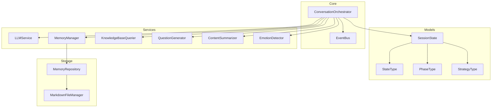
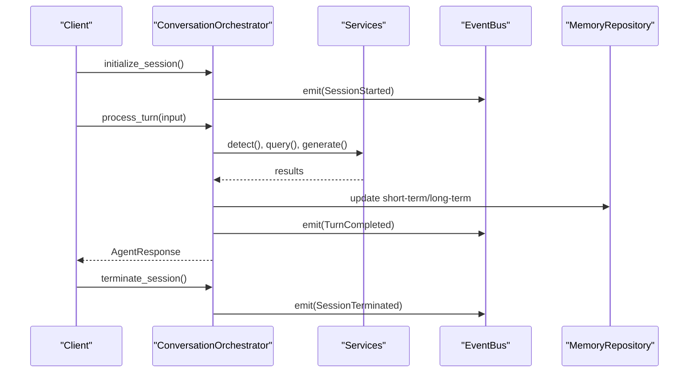
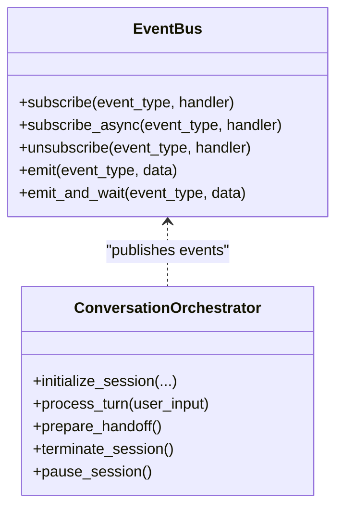
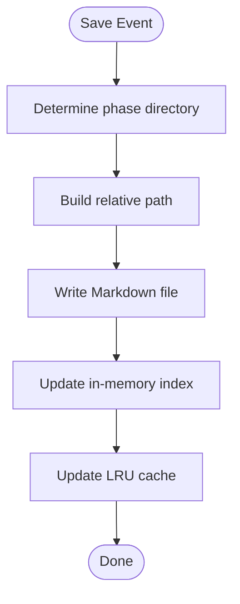
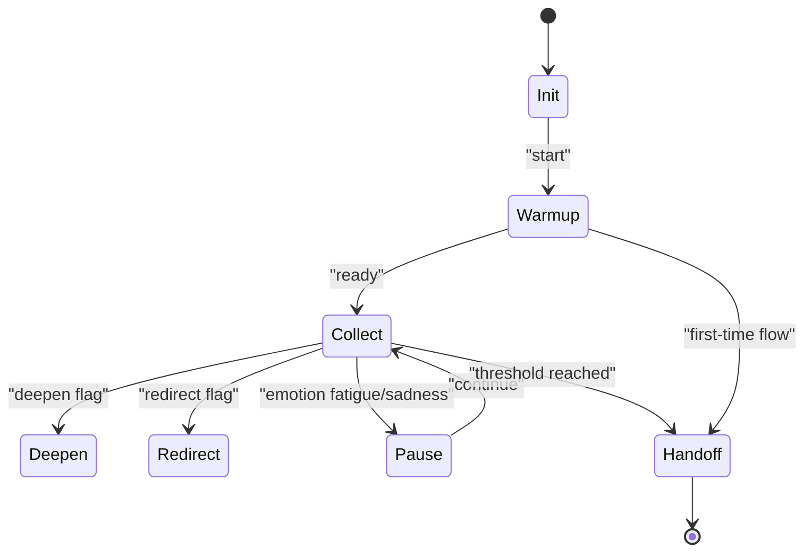
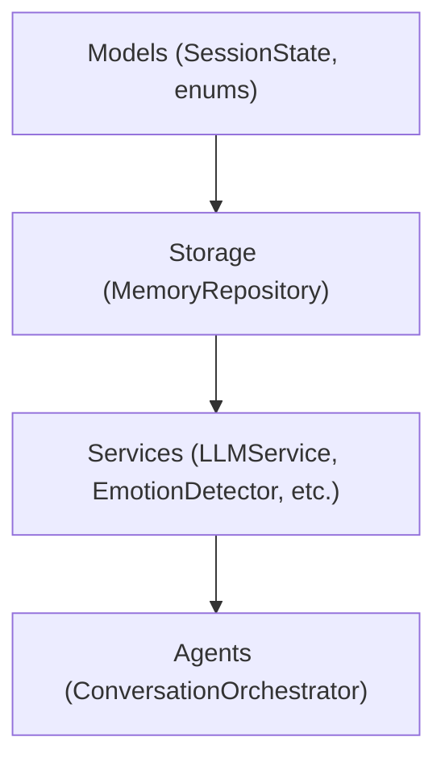

# Design Patterns

<cite>
**Referenced Files in This Document**
- [event_bus.py](file://src/core/event_bus.py)
- [conversation_orchestrator.py](file://src/core/conversation_orchestrator.py)
- [session_state.py](file://src/models/session_state.py)
- [state_type.py](file://src/enums/state_type.py)
- [strategy_type.py](file://src/enums/strategy_type.py)
- [phase_type.py](file://src/enums/phase_type.py)
- [emotion_type.py](file://src/enums/emotion_type.py)
- [llm_service.py](file://src/services/llm_service.py)
- [memory_repository.py](file://src/storage/memory_repository.py)
- [test_session_state.py](file://tests/test_session_state.py)
</cite>

## Table of Contents
1. [Introduction](#introduction)
2. [Project Structure](#project-structure)
3. [Core Components](#core-components)
4. [Architecture Overview](#architecture-overview)
5. [Detailed Component Analysis](#detailed-component-analysis)
6. [Dependency Analysis](#dependency-analysis)
7. [Performance Considerations](#performance-considerations)
8. [Troubleshooting Guide](#troubleshooting-guide)
9. [Conclusion](#conclusion)
10. [Appendices](#appendices)

## Introduction
This document explains the architectural design patterns implemented across the system, focusing on how they enable modularity, testability, and maintainability. It covers:
- Observer Pattern via EventBus for event-driven communication
- Factory Pattern usage for dynamic model instantiation and service creation
- Repository Pattern for unified data access abstraction
- Strategy Pattern for pluggable conversation strategies
- State Pattern implementation in SessionState and StateType enumerations for managing conversation flow

## Project Structure
The system is organized around a core orchestration layer, typed models, services, storage, and enums. The orchestration layer coordinates services and publishes events through EventBus, while models encapsulate state and behavior. Storage provides a repository abstraction over long-term memory.

**Diagram sources**
- [conversation_orchestrator.py:138-483](file://src/core/conversation_orchestrator.py#L138-L483)
- [event_bus.py:40-182](file://src/core/event_bus.py#L40-L182)
- [session_state.py:24-139](file://src/models/session_state.py#L24-L139)
- [state_type.py:4-12](file://src/enums/state_type.py#L4-L12)
- [phase_type.py:4-10](file://src/enums/phase_type.py#L4-L10)
- [strategy_type.py:4-8](file://src/enums/strategy_type.py#L4-L8)
- [llm_service.py:32-481](file://src/services/llm_service.py#L32-L481)
- [memory_repository.py:40-359](file://src/storage/memory_repository.py#L40-L359)

**Section sources**
- [conversation_orchestrator.py:138-483](file://src/core/conversation_orchestrator.py#L138-L483)
- [event_bus.py:40-182](file://src/core/event_bus.py#L40-L182)
- [session_state.py:24-139](file://src/models/session_state.py#L24-L139)
- [state_type.py:4-12](file://src/enums/state_type.py#L4-L12)
- [phase_type.py:4-10](file://src/enums/phase_type.py#L4-L10)
- [strategy_type.py:4-8](file://src/enums/strategy_type.py#L4-L8)
- [llm_service.py:32-481](file://src/services/llm_service.py#L32-L481)
- [memory_repository.py:40-359](file://src/storage/memory_repository.py#L40-L359)

## Core Components
- EventBus: Publish-subscribe mechanism decoupling components and enabling asynchronous event handling.
- ConversationOrchestrator: Central controller coordinating services, managing session lifecycle, and publishing events.
- SessionState: Typed state container modeling conversation progress, coverage, and user preferences.
- StrategyType and StateType: Enumerations enabling pluggable strategies and explicit state transitions.
- LLMService: Unified service for model invocation with templating and structured output support.
- MemoryRepository: Abstraction over long-term memory with caching and indexing.

**Section sources**
- [event_bus.py:40-182](file://src/core/event_bus.py#L40-L182)
- [conversation_orchestrator.py:138-483](file://src/core/conversation_orchestrator.py#L138-L483)
- [session_state.py:24-139](file://src/models/session_state.py#L24-L139)
- [strategy_type.py:4-8](file://src/enums/strategy_type.py#L4-L8)
- [state_type.py:4-12](file://src/enums/state_type.py#L4-L12)
- [llm_service.py:32-481](file://src/services/llm_service.py#L32-L481)
- [memory_repository.py:40-359](file://src/storage/memory_repository.py#L40-L359)

## Architecture Overview
The system follows an event-driven architecture:
- ConversationOrchestrator initializes and runs sessions, invoking services concurrently.
- EventBus decouples orchestration from downstream consumers (e.g., summarization triggers).
- SessionState centralizes state for visibility and persistence.
- StrategyType and StateType define extensible behavior and transitions.
- MemoryRepository abstracts storage and caching for long-term memory.

**Diagram sources**
- [conversation_orchestrator.py:198-401](file://src/core/conversation_orchestrator.py#L198-L401)
- [event_bus.py:108-170](file://src/core/event_bus.py#L108-L170)
- [memory_repository.py:91-173](file://src/storage/memory_repository.py#L91-L173)

## Detailed Component Analysis

### Observer Pattern: EventBus
EventBus implements publish-subscribe to decouple components and enable asynchronous reactions to system events.

Key capabilities:
- Subscribe/unsubscribe handlers for synchronous and asynchronous processing
- Emit events and optionally await completion of async subscribers
- Global singleton access via get_event_bus()

Usage in orchestration:
- ConversationOrchestrator emits session lifecycle and turn completion events
- Consumers can react to events without direct coupling

Benefits:
- Loose coupling between orchestrator and downstream processors
- Asynchronous handling of side effects (e.g., summarization)
- Extensibility via new subscribers

Trade-offs:
- Complexity increases with many subscribers
- Debugging requires tracing event flows

**Diagram sources**
- [event_bus.py:40-182](file://src/core/event_bus.py#L40-L182)
- [conversation_orchestrator.py:198-401](file://src/core/conversation_orchestrator.py#L198-L401)

**Section sources**
- [event_bus.py:40-182](file://src/core/event_bus.py#L40-L182)
- [conversation_orchestrator.py:227-336](file://src/core/conversation_orchestrator.py#L227-L336)

### Factory Pattern: Dynamic Model Instantiation and Service Creation
The system uses explicit construction and centralized composition roots rather than hidden globals:
- ConversationOrchestrator constructs services and repositories with explicit dependencies
- LLMService supports initialization with configuration and offers optional global accessors
- MemoryRepository composes dependencies (MarkdownFileManager, KnowledgeBaseQuerier) explicitly

Guidelines for extension:
- Prefer constructor injection over implicit globals
- Keep object creation centralized (composition root) to simplify testing and swapping implementations

Benefits:
- Clear dependencies and easier unit testing
- Reduced risk of circular imports and hidden coupling
- Consistent initialization across the system

Trade-offs:
- More boilerplate in orchestrators
- Requires disciplined adherence to DI principles

**Section sources**
- [conversation_orchestrator.py:163-197](file://src/core/conversation_orchestrator.py#L163-L197)
- [llm_service.py:477-481](file://src/services/llm_service.py#L477-L481)
- [memory_repository.py:54-88](file://src/storage/memory_repository.py#L54-L88)

### Repository Pattern: Unified Data Access Abstraction
MemoryRepository provides a unified interface for:
- Short-term memory (in-memory, LRU cache)
- Long-term memory (file-backed)
- Profile memory (indexed in-memory)

Capabilities:
- Save/load events and persons
- Query and update timelines
- Maintain caches and indices
- Integrate with MarkdownFileManager for persistence

Benefits:
- Encapsulates storage concerns behind a single interface
- Enables pluggable storage backends by swapping implementations
- Supports caching and indexing for performance

Trade-offs:
- Adds indirection overhead
- Requires careful maintenance of indices and caches

**Diagram sources**
- [memory_repository.py:176-200](file://src/storage/memory_repository.py#L176-L200)

**Section sources**
- [memory_repository.py:40-359](file://src/storage/memory_repository.py#L40-L359)

### Strategy Pattern: Pluggable Conversation Strategies
StrategyType defines interchangeable interview strategies:
- Sparkle-first: highlight-centric
- Timeline classic: chronological
- Thematic divergent: theme-based exploration

Usage:
- ConversationOrchestrator accepts StrategyType during session initialization
- Strategy selection influences question generation and content summarization behavior

Benefits:
- Easy to add new strategies without changing orchestration logic
- Allows A/B experimentation per user profile or session

Trade-offs:
- Strategy selection logic must remain cohesive and configurable

**Section sources**
- [strategy_type.py:4-8](file://src/enums/strategy_type.py#L4-L8)
- [conversation_orchestrator.py:198-234](file://src/core/conversation_orchestrator.py#L198-L234)

### State Pattern: SessionState and StateType
SessionState models the conversation lifecycle with explicit state transitions:
- StateType enumerates states: init, warmup, collect, deepen, redirect, pause, handoff
- SessionState tracks current_state, current_phase, strategy, turn_count, coverage, and more

Behavior:
- Methods update state consistently (add_turn, update_coverage, mark_event_collected, etc.)
- Emotion updates influence state transitions (e.g., pause on fatigue)

Benefits:
- Predictable state transitions and clear invariants
- Easier to persist/resume sessions
- Simplifies testing with deterministic state sequences

Trade-offs:
- Requires disciplined updates to keep state consistent
- Additional complexity for cross-cutting concerns (e.g., emotion handling)

**Diagram sources**
- [state_type.py:4-12](file://src/enums/state_type.py#L4-L12)
- [session_state.py:87-124](file://src/models/session_state.py#L87-L124)
- [conversation_orchestrator.py:304-330](file://src/core/conversation_orchestrator.py#L304-L330)

**Section sources**
- [session_state.py:24-139](file://src/models/session_state.py#L24-L139)
- [state_type.py:4-12](file://src/enums/state_type.py#L4-L12)
- [test_session_state.py:18-143](file://tests/test_session_state.py#L18-L143)

## Dependency Analysis
The system enforces unidirectional dependency flow: Models ← Storage ← Services ← Agents. This reduces coupling and improves testability.

**Diagram sources**
- [conversation_orchestrator.py:138-197](file://src/core/conversation_orchestrator.py#L138-L197)
- [memory_repository.py:40-88](file://src/storage/memory_repository.py#L40-L88)
- [llm_service.py:32-89](file://src/services/llm_service.py#L32-L89)

**Section sources**
- [conversation_orchestrator.py:138-197](file://src/core/conversation_orchestrator.py#L138-L197)
- [memory_repository.py:40-88](file://src/storage/memory_repository.py#L40-L88)
- [llm_service.py:32-89](file://src/services/llm_service.py#L32-L89)

## Performance Considerations
- Asynchronous event handling: EventBus supports async subscribers to avoid blocking orchestration.
- Caching: MemoryRepository uses LRU cache for frequent lookups.
- Structured outputs: LLMService’s structured invocation ensures robust parsing and reduces retries.
- Concurrency: ConversationOrchestrator runs key tasks concurrently with timeouts to prevent stalls.

[No sources needed since this section provides general guidance]

## Troubleshooting Guide
Common issues and remedies:
- Event handler errors: EventBus logs exceptions but does not propagate; ensure handlers are resilient and monitored externally.
- Timeout handling: ConversationOrchestrator applies timeouts to critical tasks; verify thresholds align with SLAs.
- State inconsistencies: Use SessionState methods to update state; avoid direct mutations outside the model.
- MemoryRepository cache misses: Verify cache keys and ensure proper indexing after writes.

**Section sources**
- [event_bus.py:125-140](file://src/core/event_bus.py#L125-L140)
- [conversation_orchestrator.py:288-301](file://src/core/conversation_orchestrator.py#L288-L301)
- [session_state.py:87-124](file://src/models/session_state.py#L87-L124)
- [memory_repository.py:230-246](file://src/storage/memory_repository.py#L230-L246)

## Conclusion
The system leverages well-established patterns to achieve modularity and maintainability:
- EventBus decouples orchestration from downstream processors
- Explicit construction and DI replace hidden globals
- MemoryRepository abstracts storage concerns
- StrategyType and StateType enable flexible, testable behavior
- SessionState centralizes state for predictable control flow

These patterns collectively improve testability, extensibility, and resilience across the system.

[No sources needed since this section summarizes without analyzing specific files]

## Appendices

### Practical Examples from the Codebase
- Observer Pattern: ConversationOrchestrator emits session and turn events; downstream components can subscribe to react.
  - Example paths: [conversation_orchestrator.py:227-231](file://src/core/conversation_orchestrator.py#L227-L231), [event_bus.py:108-133](file://src/core/event_bus.py#L108-L133)
- Factory Pattern: ConversationOrchestrator constructs services and repositories explicitly; LLMService supports initialization with configuration.
  - Example paths: [conversation_orchestrator.py:173-187](file://src/core/conversation_orchestrator.py#L173-L187), [llm_service.py:71-89](file://src/services/llm_service.py#L71-L89)
- Repository Pattern: MemoryRepository encapsulates saving/loading and caching.
  - Example paths: [memory_repository.py:176-200](file://src/storage/memory_repository.py#L176-L200)
- Strategy Pattern: StrategyType drives different interview approaches.
  - Example paths: [strategy_type.py:4-8](file://src/enums/strategy_type.py#L4-L8), [conversation_orchestrator.py:221-225](file://src/core/conversation_orchestrator.py#L221-L225)
- State Pattern: SessionState manages state transitions and coverage.
  - Example paths: [session_state.py:87-124](file://src/models/session_state.py#L87-L124), [state_type.py:4-12](file://src/enums/state_type.py#L4-L12)

[No sources needed since this section aggregates examples without analyzing specific files]