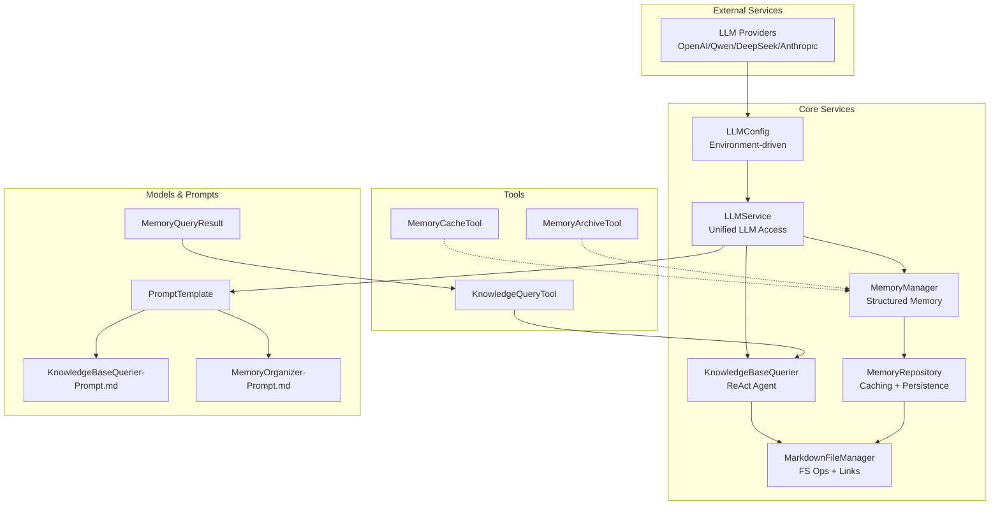
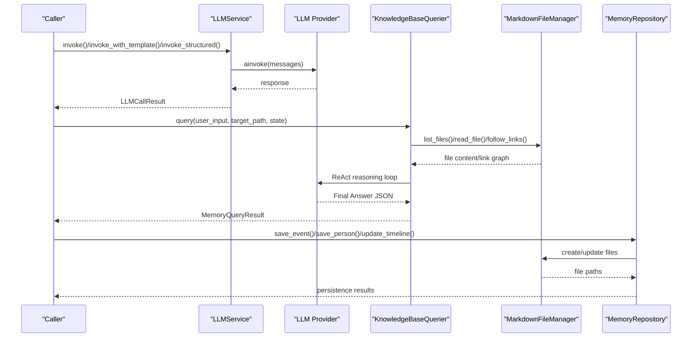
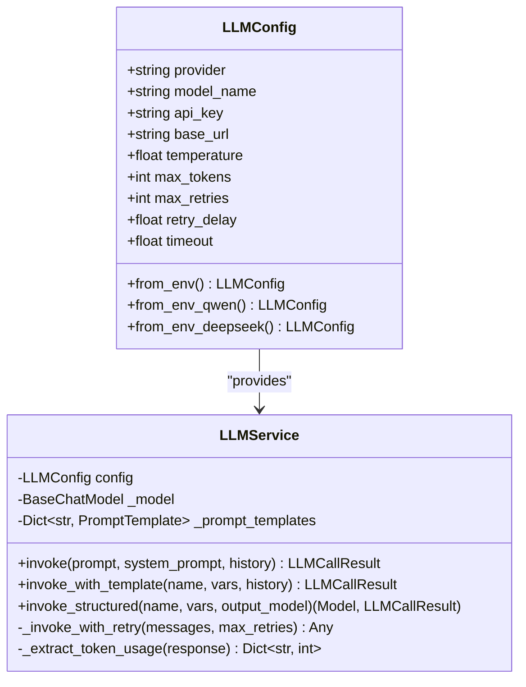
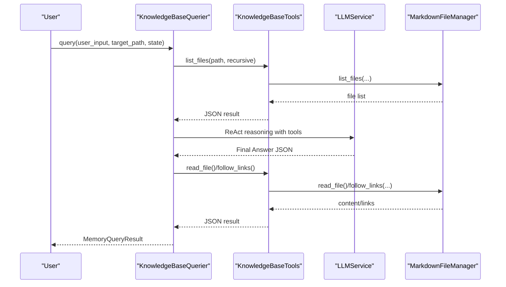
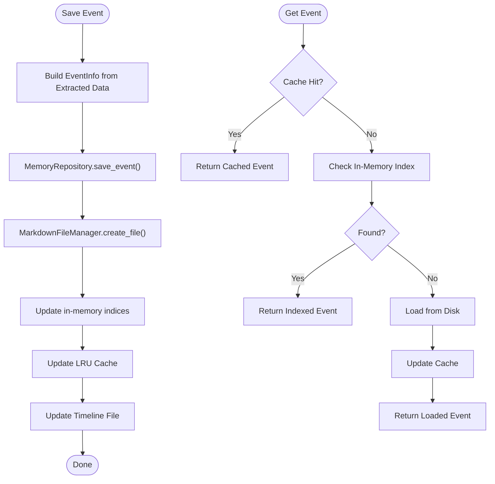
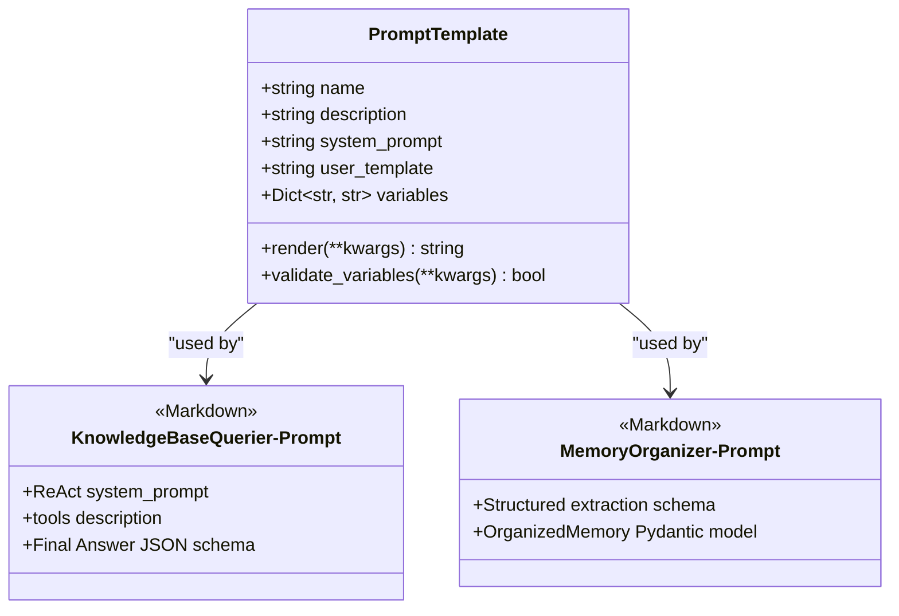
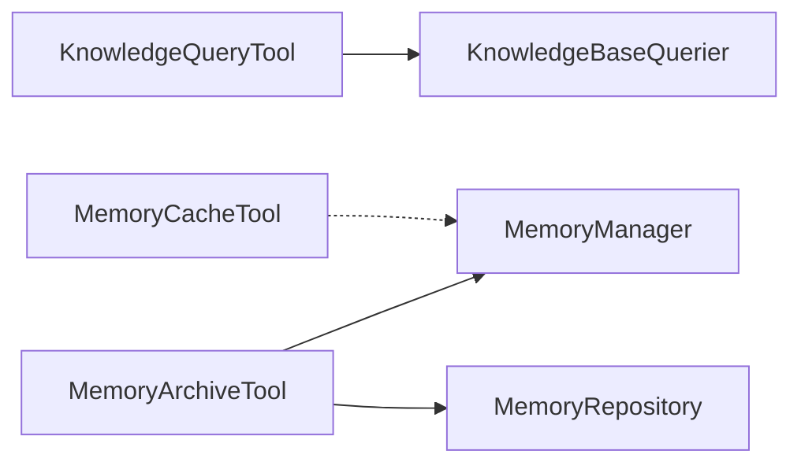
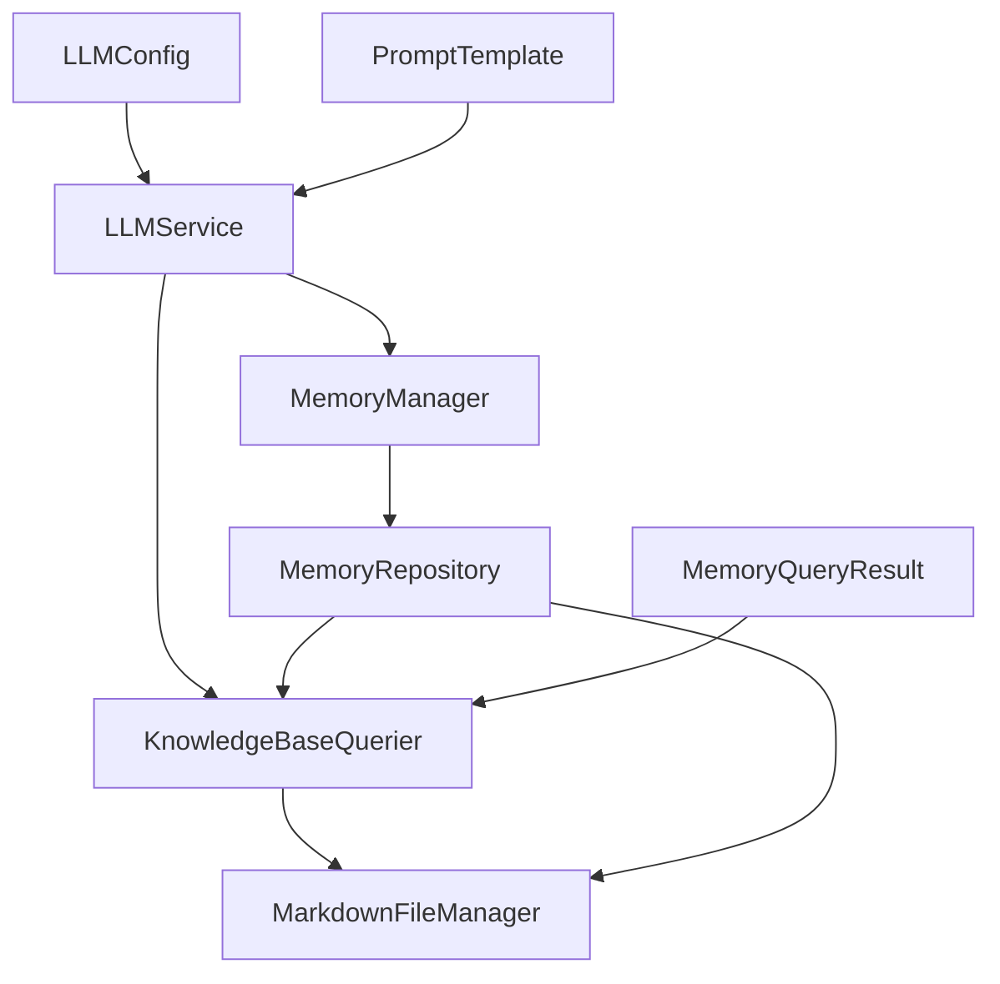

# Integration Architecture

<cite>
**Referenced Files in This Document**
- [llm_config.py](file://src/config/llm_config.py)
- [llm_service.py](file://src/services/llm_service.py)
- [memory_repository.py](file://src/storage/memory_repository.py)
- [markdown_file_manager.py](file://src/storage/markdown_file_manager.py)
- [knowledge_base_querier.py](file://src/services/knowledge_base_querier.py)
- [memory_manager.py](file://src/services/memory_manager.py)
- [memory_query_result.py](file://src/models/memory_query_result.py)
- [base.py](file://src/prompts/base.py)
- [KnowledgeBaseQuerier-Prompt.md](file://Prompts/KnowledgeBaseQuerier-Prompt.md)
- [MemoryOrganizer-Prompt.md](file://Prompts/MemoryOrganizer-Prompt.md)
- [knowledge_query_tool.py](file://src/tools/knowledge_query_tool.py)
- [memory_cache_tool.py](file://src/tools/memory_cache_tool.py)
- [memory_archive_tool.py](file://src/tools/memory_archive_tool.py)
</cite>

## Table of Contents
1. [Introduction](#introduction)
2. [Project Structure](#project-structure)
3. [Core Components](#core-components)
4. [Architecture Overview](#architecture-overview)
5. [Detailed Component Analysis](#detailed-component-analysis)
6. [Dependency Analysis](#dependency-analysis)
7. [Performance Considerations](#performance-considerations)
8. [Troubleshooting Guide](#troubleshooting-guide)
9. [Conclusion](#conclusion)
10. [Appendices](#appendices)

## Introduction
This document describes the integration architecture for external system connections and data flow patterns in the project. It focuses on:
- The LLM provider abstraction layer supporting multiple AI services (OpenAI-compatible providers, Qwen, DeepSeek, and Anthropic)
- Configuration management and model selection strategies
- Memory management integrating file system operations, caching, and persistence
- Knowledge base integration patterns, semantic search capabilities, and cross-referencing mechanisms
- Integration diagrams showing data flow between internal components and external services
- API contracts, error handling strategies, and fallback mechanisms
- Scalability considerations, performance optimization techniques, and monitoring integration patterns
- Guidelines for adding new integrations and maintaining backward compatibility

## Project Structure
The integration architecture centers around three pillars:
- LLM abstraction and orchestration via a unified service
- Knowledge base storage and retrieval using a Markdown file manager and ReAct-powered querier
- Memory management with layered caching and persistence

**Diagram sources**
- [llm_config.py:10-120](file://src/config/llm_config.py#L10-L120)
- [llm_service.py:32-481](file://src/services/llm_service.py#L32-L481)
- [knowledge_base_querier.py:202-540](file://src/services/knowledge_base_querier.py#L202-L540)
- [memory_manager.py:27-470](file://src/services/memory_manager.py#L27-L470)
- [memory_repository.py:40-359](file://src/storage/memory_repository.py#L40-L359)
- [markdown_file_manager.py:31-546](file://src/storage/markdown_file_manager.py#L31-L546)
- [memory_query_result.py:23-81](file://src/models/memory_query_result.py#L23-L81)
- [base.py:6-33](file://src/prompts/base.py#L6-L33)
- [KnowledgeBaseQuerier-Prompt.md:1-538](file://Prompts/KnowledgeBaseQuerier-Prompt.md#L1-L538)
- [MemoryOrganizer-Prompt.md:1-773](file://Prompts/MemoryOrganizer-Prompt.md#L1-L773)
- [knowledge_query_tool.py:11-81](file://src/tools/knowledge_query_tool.py#L11-L81)
- [memory_cache_tool.py:8-89](file://src/tools/memory_cache_tool.py#L8-L89)
- [memory_archive_tool.py:10-112](file://src/tools/memory_archive_tool.py#L10-L112)

**Section sources**
- [llm_config.py:10-120](file://src/config/llm_config.py#L10-L120)
- [llm_service.py:32-481](file://src/services/llm_service.py#L32-L481)
- [knowledge_base_querier.py:202-540](file://src/services/knowledge_base_querier.py#L202-L540)
- [memory_manager.py:27-470](file://src/services/memory_manager.py#L27-L470)
- [memory_repository.py:40-359](file://src/storage/memory_repository.py#L40-L359)
- [markdown_file_manager.py:31-546](file://src/storage/markdown_file_manager.py#L31-L546)
- [memory_query_result.py:23-81](file://src/models/memory_query_result.py#L23-L81)
- [base.py:6-33](file://src/prompts/base.py#L6-L33)
- [KnowledgeBaseQuerier-Prompt.md:1-538](file://Prompts/KnowledgeBaseQuerier-Prompt.md#L1-L538)
- [MemoryOrganizer-Prompt.md:1-773](file://Prompts/MemoryOrganizer-Prompt.md#L1-L773)
- [knowledge_query_tool.py:11-81](file://src/tools/knowledge_query_tool.py#L11-L81)
- [memory_cache_tool.py:8-89](file://src/tools/memory_cache_tool.py#L8-L89)
- [memory_archive_tool.py:10-112](file://src/tools/memory_archive_tool.py#L10-L112)

## Core Components
- LLM provider abstraction layer:
  - Centralized configuration and provider selection
  - Unified invocation APIs with structured outputs and token usage tracking
  - Prompt template loading from both Python modules and Markdown files
- Knowledge base integration:
  - ReAct-powered agent for dynamic exploration and contextual retrieval
  - Toolset for listing, reading, searching, and following wiki-style links
  - Structured result model for downstream consumption
- Memory management:
  - Multi-tier memory with short-term, LRU cache, and persistent storage
  - Structured extraction and persistence of events, people, timelines, and profiles
  - Parallelized saving and indexing for performance

**Section sources**
- [llm_config.py:10-120](file://src/config/llm_config.py#L10-L120)
- [llm_service.py:32-481](file://src/services/llm_service.py#L32-L481)
- [knowledge_base_querier.py:202-540](file://src/services/knowledge_base_querier.py#L202-L540)
- [memory_manager.py:27-470](file://src/services/memory_manager.py#L27-L470)
- [memory_repository.py:40-359](file://src/storage/memory_repository.py#L40-L359)

## Architecture Overview
The system integrates external LLM providers and a local knowledge base with robust error handling and fallback strategies. The LLMService encapsulates provider-specific differences behind a unified interface, while the KnowledgeBaseQuerier leverages a ReAct agent to explore the knowledge base dynamically. Memory operations are layered with in-memory short-term storage, LRU caching, and persistent Markdown files.

**Diagram sources**
- [llm_service.py:225-438](file://src/services/llm_service.py#L225-L438)
- [knowledge_base_querier.py:257-373](file://src/services/knowledge_base_querier.py#L257-L373)
- [memory_repository.py:176-261](file://src/storage/memory_repository.py#L176-L261)
- [markdown_file_manager.py:134-262](file://src/storage/markdown_file_manager.py#L134-L262)

## Detailed Component Analysis

### LLM Provider Abstraction Layer
- Configuration management:
  - Environment-driven configuration supports multiple providers with dedicated and generic settings
  - Priority-based fallback ensures availability across providers
- Model initialization:
  - OpenAI-compatible providers (including Qwen) use a shared ChatOpenAI wrapper
  - Anthropic uses a dedicated adapter loaded on demand
  - DeepSeek adds provider-specific parameters
- Invocation and retries:
  - Unified invoke/invoke_with_template/invoke_structured APIs
  - Built-in exponential backoff retry and token usage extraction
- Prompt management:
  - Templates loaded from Python modules and Markdown files
  - Dynamic variable rendering and validation

**Diagram sources**
- [llm_config.py:10-120](file://src/config/llm_config.py#L10-L120)
- [llm_service.py:32-125](file://src/services/llm_service.py#L32-L125)

**Section sources**
- [llm_config.py:10-120](file://src/config/llm_config.py#L10-L120)
- [llm_service.py:32-125](file://src/services/llm_service.py#L32-L125)

### Knowledge Base Integration Patterns
- ReAct agent:
  - Uses a dedicated prompt template to drive reasoning and action loops
  - Tools include listing, reading, content search, and link following
  - Parses structured Final Answer JSON with fallback to natural language
- Cross-referencing:
  - Wiki-style links parsed and followed to discover related content
  - LinkedContent captures source-target relations for downstream use
- Result modeling:
  - MemoryQueryResult aggregates related memories and linked context
  - Supports top-N retrieval and type filtering

**Diagram sources**
- [knowledge_base_querier.py:257-373](file://src/services/knowledge_base_querier.py#L257-L373)
- [knowledge_base_querier.py:17-200](file://src/services/knowledge_base_querier.py#L17-L200)
- [KnowledgeBaseQuerier-Prompt.md:30-144](file://Prompts/KnowledgeBaseQuerier-Prompt.md#L30-L144)

**Section sources**
- [knowledge_base_querier.py:202-540](file://src/services/knowledge_base_querier.py#L202-L540)
- [KnowledgeBaseQuerier-Prompt.md:1-538](file://Prompts/KnowledgeBaseQuerier-Prompt.md#L1-L538)
- [memory_query_result.py:23-81](file://src/models/memory_query_result.py#L23-L81)

### Memory Management Integration
- Three-tier memory:
  - Short-term memory stored in-memory with bounded history
  - LRU cache for frequent lookups
  - Persistent storage via MarkdownFileManager with structured directories
- Structured extraction and persistence:
  - MemoryManager orchestrates LLM-based organization into events, people, and timelines
  - Parallelized saves improve throughput
- Indexing and queries:
  - In-memory indices for quick lookup
  - File-based queries and timeline updates

**Diagram sources**
- [memory_manager.py:158-211](file://src/services/memory_manager.py#L158-L211)
- [memory_repository.py:176-200](file://src/storage/memory_repository.py#L176-L200)
- [markdown_file_manager.py:134-170](file://src/storage/markdown_file_manager.py#L134-L170)

**Section sources**
- [memory_manager.py:27-470](file://src/services/memory_manager.py#L27-L470)
- [memory_repository.py:40-359](file://src/storage/memory_repository.py#L40-L359)
- [markdown_file_manager.py:31-546](file://src/storage/markdown_file_manager.py#L31-L546)

### Prompt Templates and Contracts
- PromptTemplate model supports dynamic rendering and variable validation
- KnowledgeBaseQuerier-Prompt.md defines the ReAct prompt contract
- MemoryOrganizer-Prompt.md defines the structured extraction contract

**Diagram sources**
- [base.py:6-33](file://src/prompts/base.py#L6-L33)
- [KnowledgeBaseQuerier-Prompt.md:1-538](file://Prompts/KnowledgeBaseQuerier-Prompt.md#L1-L538)
- [MemoryOrganizer-Prompt.md:1-773](file://Prompts/MemoryOrganizer-Prompt.md#L1-L773)

**Section sources**
- [base.py:6-33](file://src/prompts/base.py#L6-L33)
- [KnowledgeBaseQuerier-Prompt.md:1-538](file://Prompts/KnowledgeBaseQuerier-Prompt.md#L1-L538)
- [MemoryOrganizer-Prompt.md:1-773](file://Prompts/MemoryOrganizer-Prompt.md#L1-L773)

### Tools and Utilities
- KnowledgeQueryTool: wraps KnowledgeBaseQuerier for simplified querying
- MemoryCacheTool: in-memory session-scoped cache with tag-based retrieval
- MemoryArchiveTool: orchestrates user knowledge base creation and conversation archiving

**Diagram sources**
- [knowledge_query_tool.py:11-81](file://src/tools/knowledge_query_tool.py#L11-L81)
- [memory_cache_tool.py:8-89](file://src/tools/memory_cache_tool.py#L8-L89)
- [memory_archive_tool.py:10-112](file://src/tools/memory_archive_tool.py#L10-L112)

**Section sources**
- [knowledge_query_tool.py:11-81](file://src/tools/knowledge_query_tool.py#L11-L81)
- [memory_cache_tool.py:8-89](file://src/tools/memory_cache_tool.py#L8-L89)
- [memory_archive_tool.py:10-112](file://src/tools/memory_archive_tool.py#L10-L112)

## Dependency Analysis
- Coupling:
  - LLMService depends on LLMConfig and PromptTemplate
  - KnowledgeBaseQuerier depends on LLMService and MarkdownFileManager
  - MemoryManager depends on MemoryRepository and LLMService
  - MemoryRepository depends on MarkdownFileManager and KnowledgeBaseQuerier
- Cohesion:
  - Each component has a single responsibility: LLM orchestration, knowledge base querying, memory management, file operations, and result modeling
- External dependencies:
  - LangChain adapters for OpenAI/Qwen/Anthropic
  - Async file I/O via aiofiles
  - Pydantic for structured outputs and validation

**Diagram sources**
- [llm_config.py:10-120](file://src/config/llm_config.py#L10-L120)
- [llm_service.py:32-125](file://src/services/llm_service.py#L32-L125)
- [knowledge_base_querier.py:202-256](file://src/services/knowledge_base_querier.py#L202-L256)
- [memory_manager.py:27-61](file://src/services/memory_manager.py#L27-L61)
- [memory_repository.py:40-88](file://src/storage/memory_repository.py#L40-L88)
- [memory_query_result.py:23-81](file://src/models/memory_query_result.py#L23-L81)

**Section sources**
- [llm_config.py:10-120](file://src/config/llm_config.py#L10-L120)
- [llm_service.py:32-125](file://src/services/llm_service.py#L32-L125)
- [knowledge_base_querier.py:202-256](file://src/services/knowledge_base_querier.py#L202-L256)
- [memory_manager.py:27-61](file://src/services/memory_manager.py#L27-L61)
- [memory_repository.py:40-88](file://src/storage/memory_repository.py#L40-L88)
- [memory_query_result.py:23-81](file://src/models/memory_query_result.py#L23-L81)

## Performance Considerations
- Asynchronous I/O:
  - MarkdownFileManager uses async file operations to avoid blocking
- Parallelization:
  - MemoryManager performs parallel saves for events and people
- Caching:
  - LRU cache in MemoryRepository reduces repeated disk reads
  - MemoryCacheTool provides session-scoped in-memory caching
- Token and latency tracking:
  - LLMService records token usage and latency for observability
- Retry and timeouts:
  - Configurable retries and timeouts prevent transient failures from failing requests

[No sources needed since this section provides general guidance]

## Troubleshooting Guide
- LLM invocation failures:
  - Exponential backoff retry is built-in; check logs for exceptions and error fields in LLMCallResult
- Knowledge base query failures:
  - Validate target_path existence and directory permissions
  - Inspect Final Answer parsing; fallback to natural language extraction is supported
- Memory persistence errors:
  - Verify directory structure creation and write permissions
  - Check cache and index consistency after failures
- Configuration issues:
  - Ensure environment variables for selected provider are present
  - Confirm provider-specific overrides take precedence over generic ones

**Section sources**
- [llm_service.py:400-438](file://src/services/llm_service.py#L400-L438)
- [knowledge_base_querier.py:368-373](file://src/services/knowledge_base_querier.py#L368-L373)
- [memory_repository.py:176-200](file://src/storage/memory_repository.py#L176-L200)
- [llm_config.py:42-120](file://src/config/llm_config.py#L42-L120)

## Conclusion
The integration architecture cleanly separates concerns across LLM orchestration, knowledge base querying, and memory management. It supports multiple providers, robust error handling, and extensible prompt-driven workflows. The layered memory design balances performance with persistence, while the ReAct-based knowledge base querier enables flexible, context-aware retrieval with cross-references.

[No sources needed since this section summarizes without analyzing specific files]

## Appendices

### API Contracts and Error Handling
- LLMService:
  - invoke/invoke_with_template/invoke_structured return structured results with success/error flags and token usage
  - Retries and timeouts configurable via LLMConfig
- KnowledgeBaseQuerier:
  - Accepts user_input, target_path, and state; returns MemoryQueryResult
  - Final Answer JSON schema enforced; natural language fallback supported
- MemoryRepository:
  - save_event/save_person return file paths; get_* methods support cache-first lookups
- MemoryQueryResult:
  - Provides top-N retrieval and type-based filtering

**Section sources**
- [llm_service.py:225-438](file://src/services/llm_service.py#L225-L438)
- [knowledge_base_querier.py:257-373](file://src/services/knowledge_base_querier.py#L257-L373)
- [memory_repository.py:176-261](file://src/storage/memory_repository.py#L176-L261)
- [memory_query_result.py:23-81](file://src/models/memory_query_result.py#L23-L81)

### Adding New Integrations and Maintaining Backward Compatibility
- New LLM provider:
  - Add provider option in LLMConfig.from_env variants
  - Extend LLMService._init_model with provider-specific adapter
  - Keep unified invocation APIs unchanged
- New knowledge base tool:
  - Add tool function in KnowledgeBaseTools and include in tool list
  - Update ReAct prompt to describe the new tool
- New memory extractor:
  - Define Pydantic model similar to OrganizedMemory
  - Extend MemoryManager to convert and persist new structures
- Backward compatibility:
  - Maintain stable method signatures in LLMService and MemoryManager
  - Preserve existing prompt template names and JSON schemas
  - Provide migration helpers for evolving schemas

[No sources needed since this section provides general guidance]