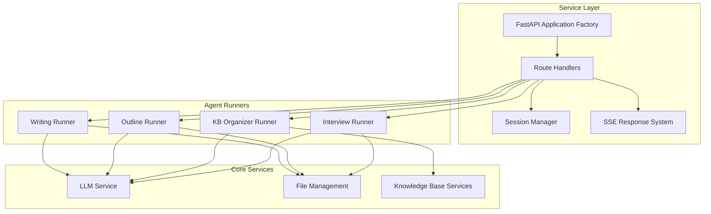
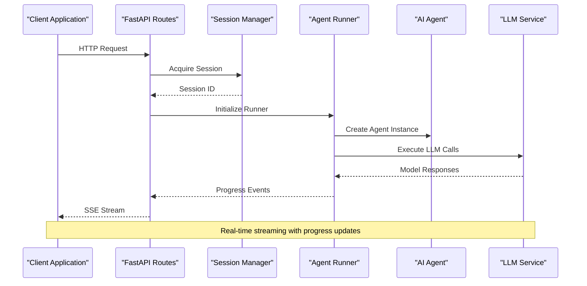
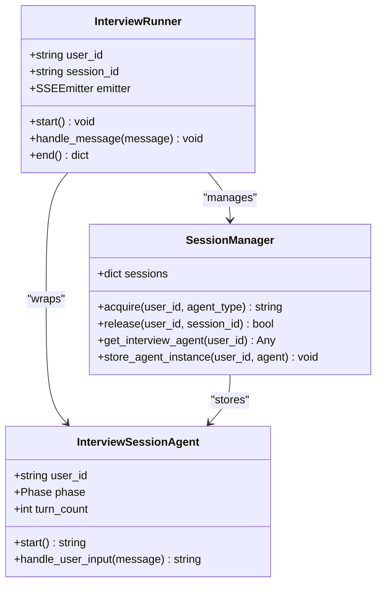
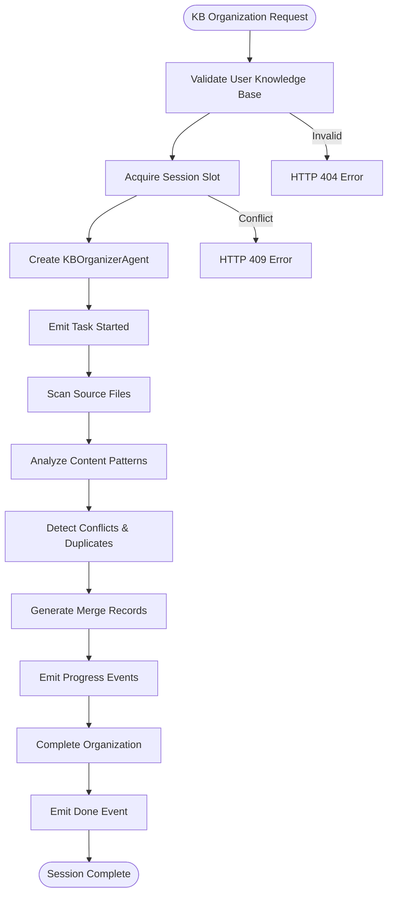
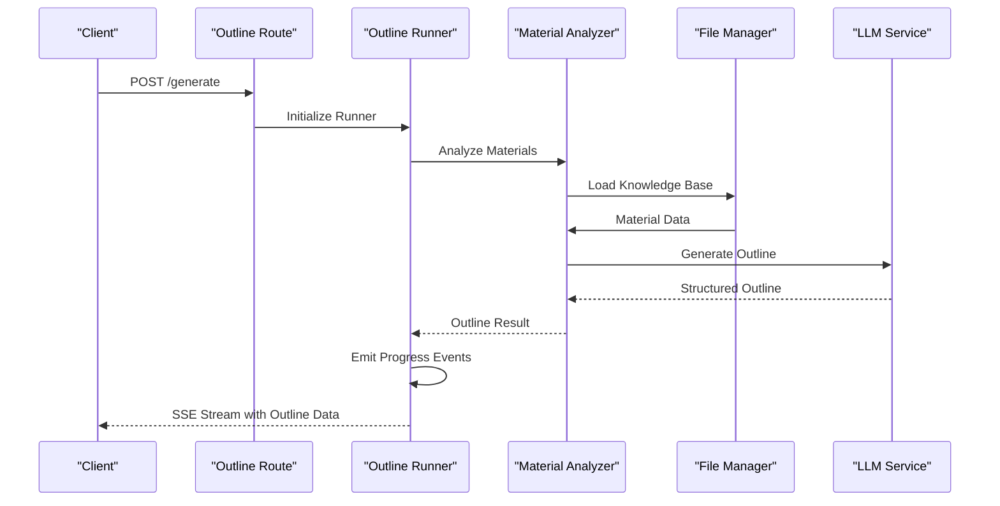
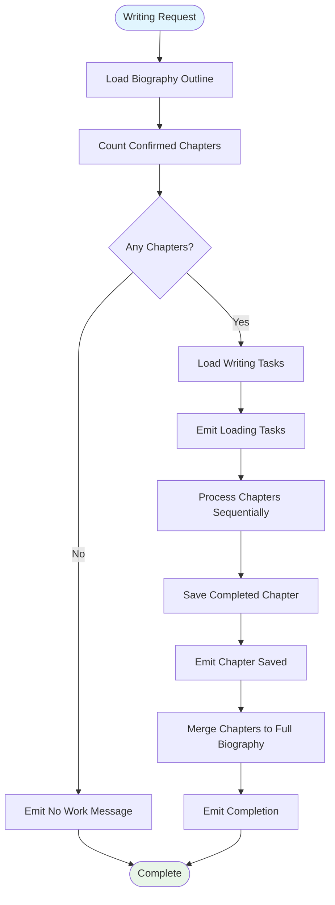
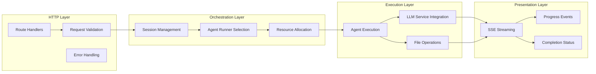
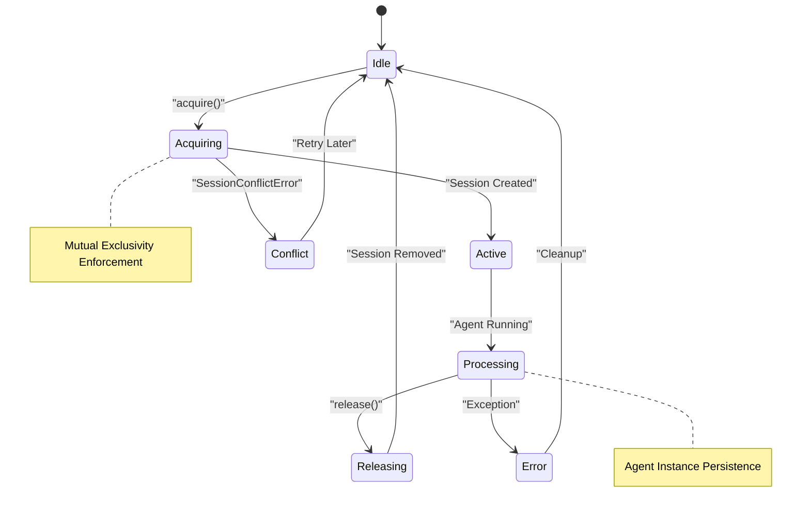
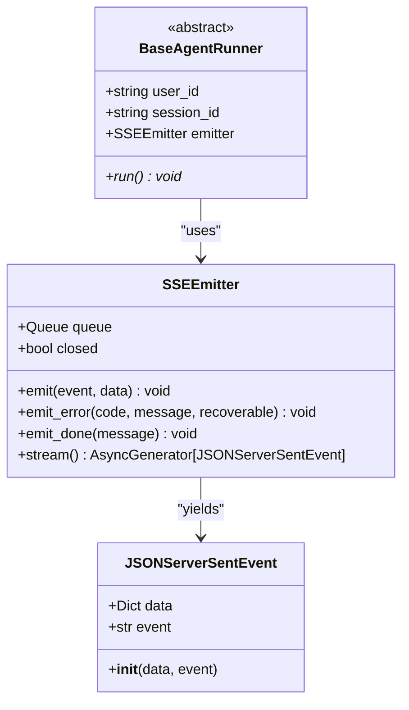
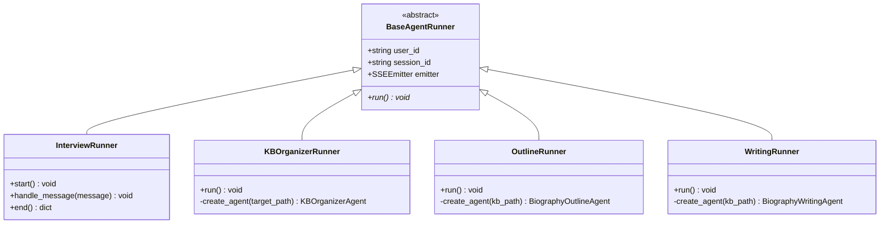

# Service Layer Architecture

<cite>
**Referenced Files in This Document**
- [app.py](file://src/service/app.py)
- [session_manager.py](file://src/service/session_manager.py)
- [sse_response.py](file://src/service/sse_response.py)
- [interview.py](file://src/service/routes/interview.py)
- [kb_organizer.py](file://src/service/routes/kb_organizer.py)
- [biography_outline.py](file://src/service/routes/biography_outline.py)
- [biography_writing.py](file://src/service/routes/biography_writing.py)
- [base_runner.py](file://src/service/agent_runners/base_runner.py)
- [interview_runner.py](file://src/service/agent_runners/interview_runner.py)
- [kb_organizer_runner.py](file://src/service/agent_runners/kb_organizer_runner.py)
- [outline_runner.py](file://src/service/agent_runners/outline_runner.py)
- [writing_runner.py](file://src/service/agent_runners/writing_runner.py)
- [llm_service.py](file://src/services/llm_service.py)
</cite>

## Update Summary
**Changes Made**
- Updated Streaming Response System section to reflect enhanced SSE event formatting with JSONServerSentEvent objects
- Modified SSE Event Emission Pattern diagram to show new JSONServerSentEvent object structure
- Updated event handling examples to demonstrate structured data handling improvements
- Enhanced documentation of SSEEmitter stream method returning JSONServerSentEvent objects

## Table of Contents
1. [Introduction](#introduction)
2. [Project Structure](#project-structure)
3. [Core Components](#core-components)
4. [Architecture Overview](#architecture-overview)
5. [Detailed Component Analysis](#detailed-component-analysis)
6. [Service Layer Orchestration](#service-layer-orchestration)
7. [Session Management](#session-management)
8. [Streaming Response System](#streaming-response-system)
9. [Agent Runner Pattern](#agent-runner-pattern)
10. [Performance Considerations](#performance-considerations)
11. [Error Handling and Monitoring](#error-handling-and-monitoring)
12. [Conclusion](#conclusion)

## Introduction

The Service Layer Architecture represents the operational backbone of the Elderly Biography Writing Agent system. This architecture encapsulates four primary AI agents—Interview, Knowledge Base Organization, Biography Outline Generation, and Biography Writing—into a cohesive HTTP/SSE service layer built on FastAPI. The service layer provides a unified interface for managing long-running AI workflows while maintaining thread safety, session isolation, and real-time progress streaming.

The architecture emphasizes separation of concerns through distinct layers: HTTP routing, session management, agent orchestration, and streaming response generation. This design enables scalable deployment of AI-powered interview sessions, automated knowledge base organization, intelligent outline generation, and collaborative biography writing workflows.

## Project Structure

The service layer follows a modular architecture with clear separation between routing, orchestration, and agent execution:

**Diagram sources**
- [app.py:22-59](file://src/service/app.py#L22-L59)
- [session_manager.py:45-157](file://src/service/session_manager.py#L45-L157)
- [sse_response.py:23-69](file://src/service/sse_response.py#L23-L69)

**Section sources**
- [app.py:1-59](file://src/service/app.py#L1-L59)
- [session_manager.py:1-157](file://src/service/session_manager.py#L1-L157)
- [sse_response.py:1-69](file://src/service/sse_response.py#L1-L69)

## Core Components

The service layer consists of several interconnected components that work together to provide seamless AI agent orchestration:

### Application Factory
The FastAPI application factory serves as the central entry point, configuring middleware, registering routes, and managing application lifecycle. It initializes the LLM service singleton on startup and provides health check endpoints.

### Route Handlers
Four specialized route handlers manage different agent workflows:
- Interview routes for conversational AI sessions
- Knowledge base organization routes for automated content processing
- Biography outline routes for structured content planning
- Biography writing routes for collaborative document creation

### Session Management System
A sophisticated session management system ensures thread-safe operation and prevents conflicting agent executions. It enforces mutual exclusivity rules and maintains agent state persistence.

### Streaming Response Engine
The SSE (Server-Sent Events) system provides real-time progress updates, enabling clients to receive incremental feedback during long-running AI operations.

**Section sources**
- [app.py:8-59](file://src/service/app.py#L8-L59)
- [interview.py:1-116](file://src/service/routes/interview.py#L1-L116)
- [kb_organizer.py:1-77](file://src/service/routes/kb_organizer.py#L1-L77)
- [biography_outline.py:1-133](file://src/service/routes/biography_outline.py#L1-L133)
- [biography_writing.py:1-136](file://src/service/routes/biography_writing.py#L1-L136)

## Architecture Overview

The service layer architecture implements a layered pattern that separates concerns while maintaining tight integration between components:

**Diagram sources**
- [interview_runner.py:16-41](file://src/service/agent_runners/interview_runner.py#L16-L41)
- [llm_service.py:225-292](file://src/services/llm_service.py#L225-L292)

The architecture supports concurrent operations through asynchronous programming patterns and maintains state consistency through centralized session management.

**Section sources**
- [interview_runner.py:1-94](file://src/service/agent_runners/interview_runner.py#L1-L94)
- [llm_service.py:1-481](file://src/services/llm_service.py#L1-L481)

## Detailed Component Analysis

### Interview Agent Service

The Interview Agent Service provides conversational AI capabilities with persistent session management:

**Diagram sources**
- [interview_runner.py:8-94](file://src/service/agent_runners/interview_runner.py#L8-L94)
- [session_manager.py:45-157](file://src/service/session_manager.py#L45-L157)

The Interview Runner orchestrates conversation flow, manages agent lifecycle, and emits structured progress events through the SSE system.

**Section sources**
- [interview_runner.py:1-94](file://src/service/agent_runners/interview_runner.py#L1-L94)
- [session_manager.py:45-157](file://src/service/session_manager.py#L45-L157)

### Knowledge Base Organization Service

The Knowledge Base Organization Service automates content processing and conflict resolution:

**Diagram sources**
- [kb_organizer_runner.py:53-108](file://src/service/agent_runners/kb_organizer_runner.py#L53-L108)
- [kb_organizer.py:32-61](file://src/service/routes/kb_organizer.py#L32-L61)

**Section sources**
- [kb_organizer_runner.py:1-108](file://src/service/agent_runners/kb_organizer_runner.py#L1-L108)
- [kb_organizer.py:1-77](file://src/service/routes/kb_organizer.py#L1-L77)

### Biography Outline Generation Service

The Biography Outline Service creates structured content plans with intelligent chapter organization:

**Diagram sources**
- [outline_runner.py:34-108](file://src/service/agent_runners/outline_runner.py#L34-L108)
- [biography_outline.py:33-61](file://src/service/routes/biography_outline.py#L33-L61)

**Section sources**
- [outline_runner.py:1-108](file://src/service/agent_runners/outline_runner.py#L1-L108)
- [biography_outline.py:1-133](file://src/service/routes/biography_outline.py#L1-L133)

### Biography Writing Service

The Biography Writing Service coordinates collaborative document creation with chapter-by-chapter processing:

**Diagram sources**
- [writing_runner.py:35-122](file://src/service/agent_runners/writing_runner.py#L35-L122)
- [biography_writing.py:34-62](file://src/service/routes/biography_writing.py#L34-L62)

**Section sources**
- [writing_runner.py:1-122](file://src/service/agent_runners/writing_runner.py#L1-L122)
- [biography_writing.py:1-136](file://src/service/routes/biography_writing.py#L1-L136)

## Service Layer Orchestration

The service layer orchestrates complex workflows through a coordinated pattern:

**Diagram sources**
- [app.py:22-59](file://src/service/app.py#L22-L59)
- [session_manager.py:87-118](file://src/service/session_manager.py#L87-L118)
- [base_runner.py:6-18](file://src/service/agent_runners/base_runner.py#L6-L18)

The orchestration ensures proper resource allocation, error propagation, and state management across all agent operations.

**Section sources**
- [app.py:1-59](file://src/service/app.py#L1-L59)
- [session_manager.py:45-157](file://src/service/session_manager.py#L45-L157)
- [base_runner.py:1-18](file://src/service/agent_runners/base_runner.py#L1-L18)

## Session Management

The Session Management system provides thread-safe coordination for concurrent agent operations:

### Session Lifecycle Management

**Diagram sources**
- [session_manager.py:87-137](file://src/service/session_manager.py#L87-L137)

### Conflict Resolution Strategy

The session manager implements sophisticated conflict detection and resolution:

- **Same Agent Type**: Allows continuation for interview sessions, prevents duplicate execution for other agents
- **Different Agent Type**: Enforces strict mutual exclusivity to prevent resource conflicts
- **Thread Safety**: Uses asyncio.Lock for concurrent access protection
- **State Persistence**: Maintains agent instances for interview session continuity

**Section sources**
- [session_manager.py:45-157](file://src/service/session_manager.py#L45-L157)

## Streaming Response System

**Updated** Enhanced SSE streaming response handling with improved event formatting using JSONServerSentEvent objects for better structured data handling.

The SSE (Server-Sent Events) system provides real-time communication between server and client with enhanced structured data support:

### Enhanced Event Emission Pattern

**Diagram sources**
- [sse_response.py:23-69](file://src/service/sse_response.py#L23-L69)
- [base_runner.py:6-18](file://src/service/agent_runners/base_runner.py#L6-L18)

### Event Types and Payloads

The system supports standardized event types for consistent client-side handling:

- **task_started**: Workflow initiation with metadata
- **scanning/analyzing/generating**: Progress indicators for different phases
- **task_progress**: Detailed progress updates with completion percentages
- **saved**: Individual chapter completion notifications
- **completed**: Finalization events with result data
- **error**: Error conditions with recovery guidance
- **done**: Stream termination signals

**Updated** The SSE system now yields `JSONServerSentEvent` objects directly, eliminating the need for manual string formatting and providing better structured data handling. Each event object contains both the event type and structured data payload, enabling more reliable client-side parsing and processing.

**Section sources**
- [sse_response.py:1-71](file://src/service/sse_response.py#L1-L71)
- [outline_runner.py:42-99](file://src/service/agent_runners/outline_runner.py#L42-L99)
- [writing_runner.py:53-113](file://src/service/agent_runners/writing_runner.py#L53-L113)

## Agent Runner Pattern

The Agent Runner pattern provides a consistent interface for all AI agent operations:

### Base Runner Interface

**Diagram sources**
- [base_runner.py:6-18](file://src/service/agent_runners/base_runner.py#L6-L18)
- [interview_runner.py:8-94](file://src/service/agent_runners/interview_runner.py#L8-L94)
- [kb_organizer_runner.py:15-108](file://src/service/agent_runners/kb_organizer_runner.py#L15-L108)
- [outline_runner.py:13-108](file://src/service/agent_runners/outline_runner.py#L13-L108)
- [writing_runner.py:14-122](file://src/service/agent_runners/writing_runner.py#L14-L122)

### Runner Responsibilities

Each runner implements specific responsibilities while maintaining consistency:

- **Initialization**: Creates properly configured agent instances
- **Execution**: Coordinates agent operations with progress reporting
- **Error Handling**: Converts exceptions to structured error events
- **Resource Management**: Ensures proper cleanup and session release

**Section sources**
- [base_runner.py:1-18](file://src/service/agent_runners/base_runner.py#L1-L18)
- [interview_runner.py:1-94](file://src/service/agent_runners/interview_runner.py#L1-L94)
- [kb_organizer_runner.py:1-108](file://src/service/agent_runners/kb_organizer_runner.py#L1-L108)
- [outline_runner.py:1-108](file://src/service/agent_runners/outline_runner.py#L1-L108)
- [writing_runner.py:1-122](file://src/service/agent_runners/writing_runner.py#L1-L122)

## Performance Considerations

The service layer architecture incorporates several performance optimization strategies:

### Asynchronous Processing
- Non-blocking I/O operations for file system access
- Concurrent execution of independent tasks
- Efficient memory management for large document processing

### Resource Management
- Singleton pattern for LLM service initialization
- Connection pooling for database and external API calls
- Memory-efficient streaming for large content processing

### Caching Strategies
- Session-based caching for frequently accessed agent instances
- File system caching for processed content
- Response caching for static data queries

### Scalability Patterns
- Stateless route handlers for horizontal scaling
- Session persistence for stateful operations
- Modular architecture for independent component scaling

## Error Handling and Monitoring

The service layer implements comprehensive error handling and monitoring:

### Error Classification
- **Session Errors**: Conflict detection and resolution
- **Agent Errors**: Graceful degradation and recovery
- **System Errors**: Resource exhaustion and timeout handling
- **Validation Errors**: Input sanitization and constraint checking

### Monitoring and Logging
- Structured logging for all operations
- Performance metrics collection
- Error rate tracking and alerting
- Usage pattern analytics

### Recovery Mechanisms
- Automatic retry for transient failures
- Graceful degradation for partial failures
- State rollback for inconsistent operations
- Health check endpoints for system monitoring

**Section sources**
- [session_manager.py:34-43](file://src/service/session_manager.py#L34-L43)
- [llm_service.py:400-438](file://src/services/llm_service.py#L400-L438)

## Conclusion

The Service Layer Architecture provides a robust foundation for deploying AI-powered biography writing workflows at scale. Through careful separation of concerns, thread-safe session management, and real-time streaming capabilities, the architecture enables complex multi-agent operations while maintaining reliability and performance.

Key architectural strengths include:

- **Modular Design**: Clear separation between routing, orchestration, and execution layers
- **Scalable Concurrency**: Thread-safe operations supporting multiple simultaneous workflows
- **Enhanced Real-time Communication**: SSE-based streaming with structured JSONServerSentEvent objects for immediate user feedback
- **Fault Tolerance**: Comprehensive error handling and recovery mechanisms
- **Extensible Pattern**: Consistent runner pattern enabling easy addition of new agent types

**Updated** The recent enhancement to SSE streaming response handling with JSONServerSentEvent objects significantly improves structured data handling, eliminates manual string formatting overhead, and provides more reliable client-side event processing. This change maintains backward compatibility while offering better performance and data integrity for real-time streaming scenarios.

This architecture successfully balances complexity management with operational efficiency, providing a solid foundation for future enhancements and scaling requirements.