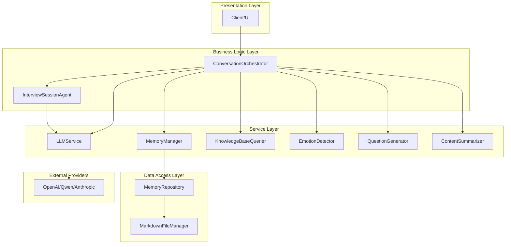
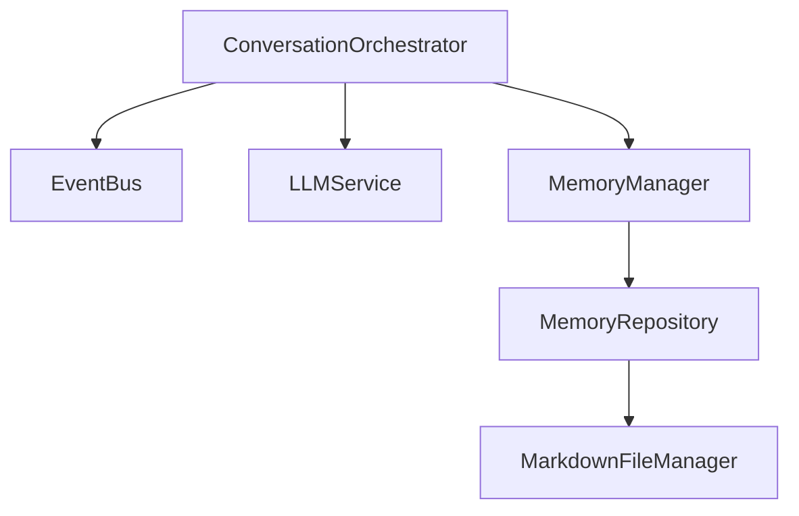
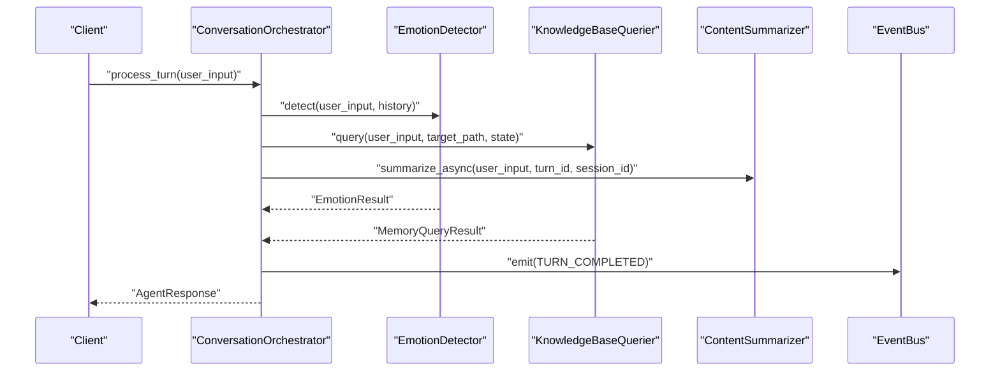
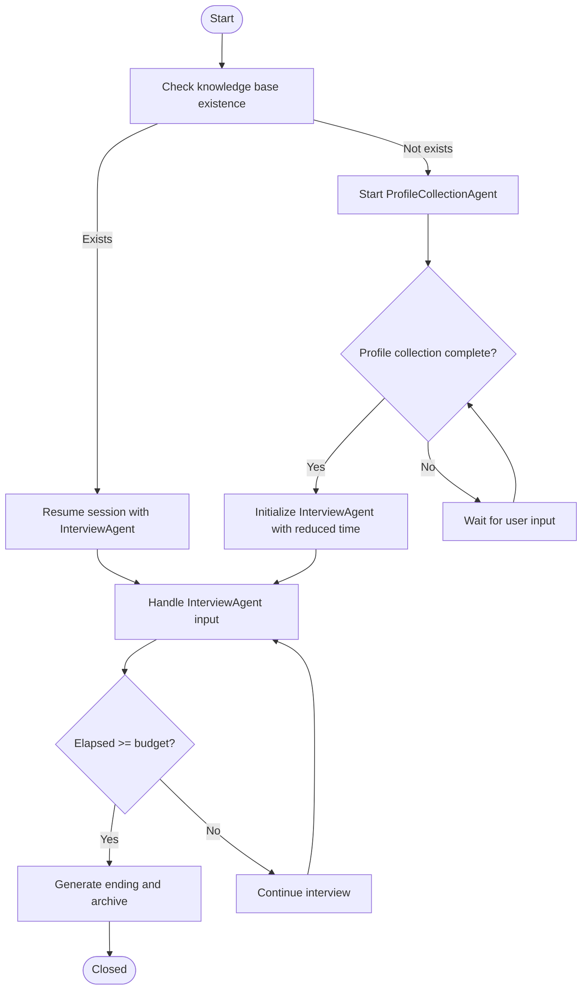
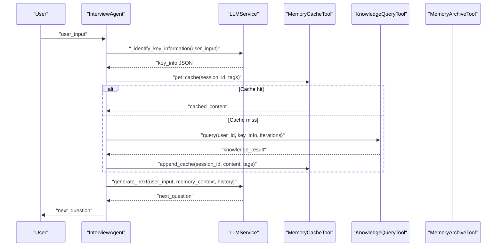
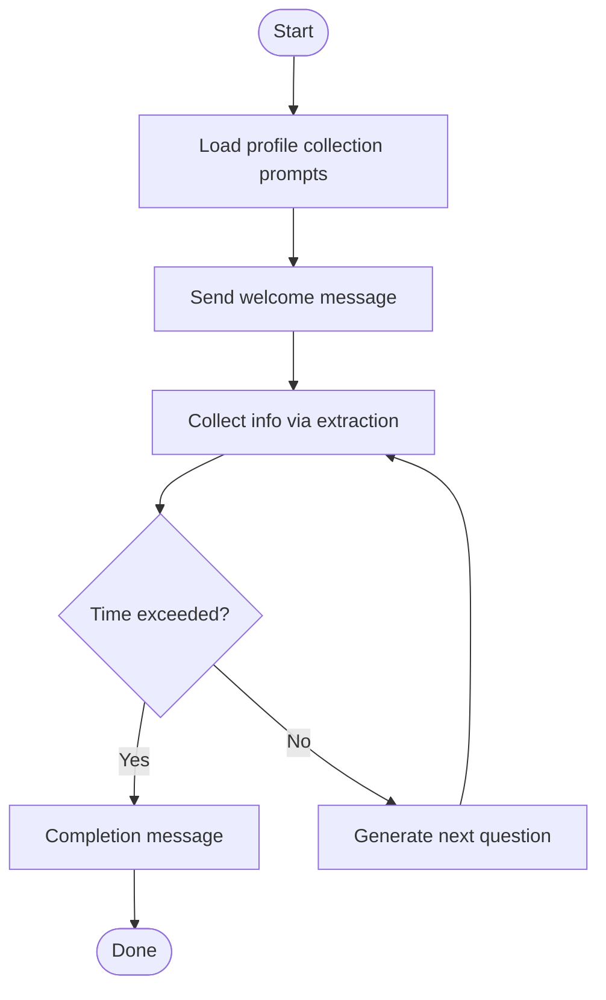
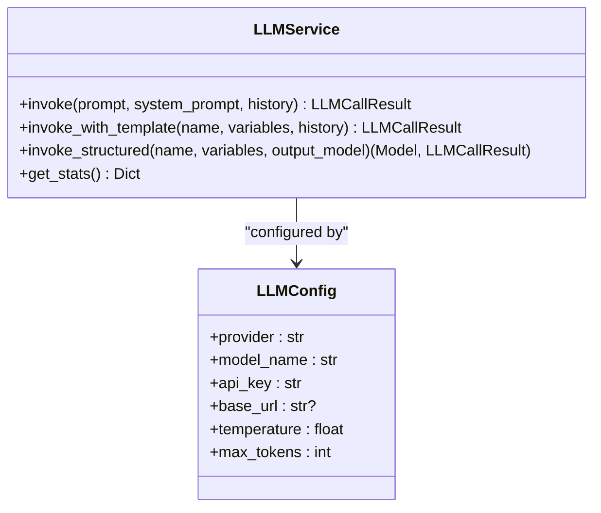
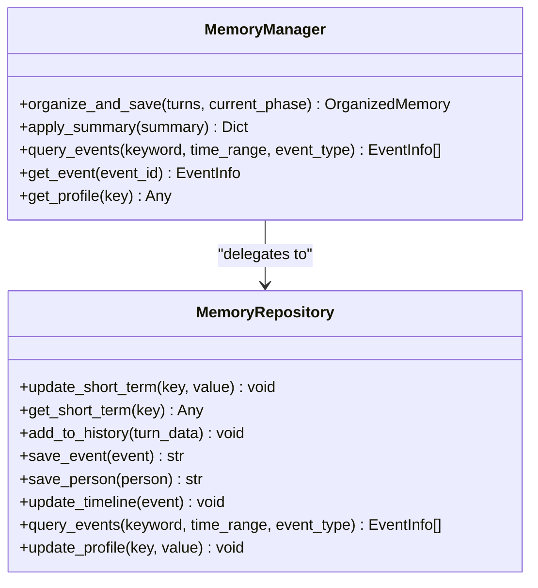
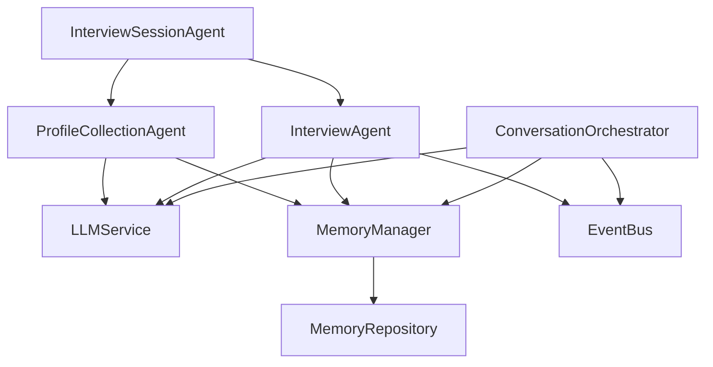

# System Architecture

<cite>
**Referenced Files in This Document**
- [conversation_orchestrator.py](file://src/core/conversation_orchestrator.py)
- [event_bus.py](file://src/core/event_bus.py)
- [interview_agent.py](file://src/agents/interview_agent.py)
- [profile_collection_agent.py](file://src/agents/profile_collection_agent.py)
- [interview_session_agent.py](file://src/agents/interview_session_agent.py)
- [llm_service.py](file://src/services/llm_service.py)
- [memory_manager.py](file://src/services/memory_manager.py)
- [memory_repository.py](file://src/storage/memory_repository.py)
- [session_state.py](file://src/models/session_state.py)
- [state_type.py](file://src/enums/state_type.py)
- [llm_config.py](file://src/config/llm_config.py)
- [memory_cache_tool.py](file://src/tools/memory_cache_tool.py)
</cite>

## Table of Contents
1. [Introduction](#introduction)
2. [Project Structure](#project-structure)
3. [Core Components](#core-components)
4. [Architecture Overview](#architecture-overview)
5. [Detailed Component Analysis](#detailed-component-analysis)
6. [Dependency Analysis](#dependency-analysis)
7. [Performance Considerations](#performance-considerations)
8. [Troubleshooting Guide](#troubleshooting-guide)
9. [Conclusion](#conclusion)

## Introduction
This document describes the architectural design of the elderly memoir system, centered around LangGraph agent orchestration patterns. The system is composed of layered components: presentation, business logic, service, and data access layers. It coordinates multiple specialized agents (InterviewAgent, ProfileCollectionAgent, InterviewSessionAgent) through a central ConversationOrchestrator, which manages state, timing, and cross-service communication via an EventBus. Services integrate with external AI providers through a unified LLMService abstraction, while the repository pattern consolidates memory persistence and retrieval. Parallel processing is employed to improve responsiveness during concurrent operations such as emotion detection, knowledge queries, and summarization.

## Project Structure
The system follows a feature-oriented package layout with clear separation of concerns:
- Core orchestration and eventing: src/core
- Agents: src/agents
- Services: src/services
- Storage and repositories: src/storage
- Models and enums: src/models, src/enums
- Configuration: src/config
- Tools: src/tools
- Prompts: Prompts/

**Diagram sources**
- [conversation_orchestrator.py:138-401](file://src/core/conversation_orchestrator.py#L138-L401)
- [interview_session_agent.py:33-110](file://src/agents/interview_session_agent.py#L33-L110)
- [llm_service.py:32-89](file://src/services/llm_service.py#L32-L89)
- [memory_manager.py:27-61](file://src/services/memory_manager.py#L27-L61)
- [memory_repository.py:40-88](file://src/storage/memory_repository.py#L40-L88)

**Section sources**
- [conversation_orchestrator.py:138-401](file://src/core/conversation_orchestrator.py#L138-L401)
- [interview_session_agent.py:33-110](file://src/agents/interview_session_agent.py#L33-L110)

## Core Components
- ConversationOrchestrator: Central coordinator managing session lifecycle, state transitions, parallel processing, and event emission. It initializes services, tracks timing, handles profile collection, and triggers handoff.
- EventBus: Observer-pattern event bus enabling decoupled inter-component communication (turn completion, session lifecycle, memory updates).
- InterviewSessionAgent: Top-level agent orchestrating user onboarding (ProfileCollectionAgent) and interview (InterviewAgent) phases with time budgeting and knowledge base integration.
- InterviewAgent: Core interview agent generating questions, identifying key info, querying knowledge base, caching, and time-aware continuation.
- ProfileCollectionAgent: Collects user profile data with structured extraction and time-bounded initialization.
- LLMService: Unified interface to external AI providers with template management, structured outputs, retries, and metrics.
- MemoryManager: High-level memory operations coordinating LLM-based organization and storage via MemoryRepository.
- MemoryRepository: Repository implementing short-term, long-term, and profile memory with LRU caching and file-backed persistence.
- Tools: Caching and knowledge query tools supporting InterviewAgent’s runtime needs.

**Section sources**
- [conversation_orchestrator.py:138-401](file://src/core/conversation_orchestrator.py#L138-L401)
- [event_bus.py:40-182](file://src/core/event_bus.py#L40-L182)
- [interview_session_agent.py:33-110](file://src/agents/interview_session_agent.py#L33-L110)
- [interview_agent.py:16-114](file://src/agents/interview_agent.py#L16-L114)
- [profile_collection_agent.py:14-63](file://src/agents/profile_collection_agent.py#L14-L63)
- [llm_service.py:32-89](file://src/services/llm_service.py#L32-L89)
- [memory_manager.py:27-61](file://src/services/memory_manager.py#L27-L61)
- [memory_repository.py:40-88](file://src/storage/memory_repository.py#L40-L88)
- [memory_cache_tool.py:8-33](file://src/tools/memory_cache_tool.py#L8-L33)

## Architecture Overview
The system adopts a LangGraph-style orchestration model:
- Orchestration: ConversationOrchestrator drives parallel tasks (emotion detection, knowledge query, summarization) and emits domain events.
- Agent Coordination: InterviewSessionAgent switches between profile collection and interview phases, delegating to InterviewAgent and ProfileCollectionAgent.
- Service Abstraction: LLMService encapsulates provider integrations and prompt templating.
- Data Access: MemoryRepository provides a unified interface for short-term, long-term, and profile memory with caching and file persistence.
- Integration: EventBus decouples components, enabling asynchronous handlers and observability.

**Diagram sources**
- [conversation_orchestrator.py:163-197](file://src/core/conversation_orchestrator.py#L163-L197)
- [event_bus.py:40-182](file://src/core/event_bus.py#L40-L182)
- [memory_manager.py:27-61](file://src/services/memory_manager.py#L27-L61)
- [memory_repository.py:40-88](file://src/storage/memory_repository.py#L40-L88)

## Detailed Component Analysis

### ConversationOrchestrator
Responsibilities:
- Initialize session, manage timing, and coordinate parallel tasks.
- Handle profile collection state machine and transition to interview mode.
- Emit lifecycle and domain events via EventBus.
- Trigger content summarization and handoff preparation.

Key behaviors:
- Parallelism: Emotion detection, knowledge query, and summarization run concurrently with timeouts.
- Time management: SessionTiming enforces warnings and termination thresholds.
- State management: SessionState tracks coverage, collected entities, and conversation history.
- Handoff: prepare_handoff aggregates collected data and pending questions for downstream processing.

**Diagram sources**
- [conversation_orchestrator.py:236-343](file://src/core/conversation_orchestrator.py#L236-L343)
- [event_bus.py:108-134](file://src/core/event_bus.py#L108-L134)

**Section sources**
- [conversation_orchestrator.py:198-401](file://src/core/conversation_orchestrator.py#L198-L401)
- [session_state.py:24-139](file://src/models/session_state.py#L24-L139)
- [state_type.py:4-12](file://src/enums/state_type.py#L4-L12)

### InterviewSessionAgent
Responsibilities:
- Determine user state (new vs. returning) and route to appropriate flow.
- Manage session phases: profile collection, interview, and ending.
- Coordinate InterviewAgent and ProfileCollectionAgent with time budgets and knowledge base context.

**Diagram sources**
- [interview_session_agent.py:112-177](file://src/agents/interview_session_agent.py#L112-L177)
- [interview_session_agent.py:243-269](file://src/agents/interview_session_agent.py#L243-L269)
- [interview_session_agent.py:341-367](file://src/agents/interview_session_agent.py#L341-L367)

**Section sources**
- [interview_session_agent.py:33-110](file://src/agents/interview_session_agent.py#L33-L110)
- [interview_session_agent.py:178-241](file://src/agents/interview_session_agent.py#L178-L241)
- [interview_session_agent.py:296-340](file://src/agents/interview_session_agent.py#L296-L340)
- [interview_session_agent.py:369-392](file://src/agents/interview_session_agent.py#L369-L392)

### InterviewAgent
Responsibilities:
- Identify key information from user input.
- Query knowledge base via KnowledgeQueryTool and cache results.
- Generate next questions with time awareness and continue until time-up.
- Produce session end guidance.

**Diagram sources**
- [interview_agent.py:115-184](file://src/agents/interview_agent.py#L115-L184)
- [interview_agent.py:186-242](file://src/agents/interview_agent.py#L186-L242)
- [memory_cache_tool.py:34-61](file://src/tools/memory_cache_tool.py#L34-L61)

**Section sources**
- [interview_agent.py:16-114](file://src/agents/interview_agent.py#L16-L114)
- [interview_agent.py:115-184](file://src/agents/interview_agent.py#L115-L184)
- [interview_agent.py:244-272](file://src/agents/interview_agent.py#L244-L272)

### ProfileCollectionAgent
Responsibilities:
- Collect essential user profile data with structured extraction.
- Enforce time limits and produce completion message upon completion.

**Diagram sources**
- [profile_collection_agent.py:98-128](file://src/agents/profile_collection_agent.py#L98-L128)
- [profile_collection_agent.py:130-166](file://src/agents/profile_collection_agent.py#L130-L166)
- [profile_collection_agent.py:168-212](file://src/agents/profile_collection_agent.py#L168-L212)

**Section sources**
- [profile_collection_agent.py:14-63](file://src/agents/profile_collection_agent.py#L14-L63)
- [profile_collection_agent.py:98-166](file://src/agents/profile_collection_agent.py#L98-L166)

### LLMService
Responsibilities:
- Abstract provider integrations (OpenAI-compatible, Qwen, Anthropic).
- Manage prompt templates and structured outputs.
- Provide retry logic, token usage tracking, and unified invocation APIs.

**Diagram sources**
- [llm_service.py:32-89](file://src/services/llm_service.py#L32-L89)
- [llm_config.py:10-41](file://src/config/llm_config.py#L10-L41)

**Section sources**
- [llm_service.py:32-89](file://src/services/llm_service.py#L32-L89)
- [llm_config.py:10-41](file://src/config/llm_config.py#L10-L41)

### MemoryManager and MemoryRepository
Responsibilities:
- MemoryManager: Provides high-level memory operations, orchestrating LLM-based organization and applying results to the repository.
- MemoryRepository: Implements short-term, long-term, and profile memory with LRU caching and file-backed persistence.

**Diagram sources**
- [memory_manager.py:27-61](file://src/services/memory_manager.py#L27-L61)
- [memory_repository.py:40-88](file://src/storage/memory_repository.py#L40-L88)

**Section sources**
- [memory_manager.py:27-61](file://src/services/memory_manager.py#L27-L61)
- [memory_repository.py:40-88](file://src/storage/memory_repository.py#L40-L88)

## Dependency Analysis
Component coupling and integration points:
- ConversationOrchestrator depends on LLMService, MemoryManager, KnowledgeBaseQuerier, EmotionDetector, QuestionGenerator, ContentSummarizer, EventBus, and SessionState.
- InterviewSessionAgent composes InterviewAgent and ProfileCollectionAgent and coordinates knowledge base access.
- MemoryManager depends on MemoryRepository and LLMService for organization.
- EventBus enables loose coupling between orchestrator and services.

**Diagram sources**
- [conversation_orchestrator.py:163-197](file://src/core/conversation_orchestrator.py#L163-L197)
- [interview_session_agent.py:54-110](file://src/agents/interview_session_agent.py#L54-L110)
- [interview_agent.py:37-79](file://src/agents/interview_agent.py#L37-L79)
- [profile_collection_agent.py:34-49](file://src/agents/profile_collection_agent.py#L34-L49)

**Section sources**
- [conversation_orchestrator.py:163-197](file://src/core/conversation_orchestrator.py#L163-L197)
- [interview_session_agent.py:54-110](file://src/agents/interview_session_agent.py#L54-L110)

## Performance Considerations
- Parallel processing: ConversationOrchestrator runs emotion detection, knowledge query, and summarization concurrently to reduce latency.
- Timeouts: Configurable timeouts prevent long-running operations from blocking the main thread.
- Caching: MemoryCacheTool reduces repeated knowledge base queries; MemoryRepository’s LRU cache minimizes IO overhead.
- Structured outputs: LLMService’s structured parsing ensures robustness and reduces post-processing costs.
- Asynchronous eventing: EventBus supports non-blocking notifications and aggregation of side effects.

[No sources needed since this section provides general guidance]

## Troubleshooting Guide
Common issues and resolutions:
- Provider configuration errors: Verify LLMConfig environment variables and fallback logic.
- Template loading failures: Ensure prompt Markdown files exist and are parsable; LLMService logs warnings when templates fail to load.
- Timeouts during orchestration: Adjust emotion and query timeouts in OrchestratorConfig; consider increasing budget for long interviews.
- Cache misses: Confirm tag-based queries align with cached entries; review InterviewAgent’s key information extraction.
- Event delivery: Use EventBus emit_and_wait for synchronous handlers when ordering is critical.

**Section sources**
- [llm_config.py:42-120](file://src/config/llm_config.py#L42-L120)
- [llm_service.py:126-161](file://src/services/llm_service.py#L126-L161)
- [conversation_orchestrator.py:286-301](file://src/core/conversation_orchestrator.py#L286-L301)
- [memory_cache_tool.py:34-61](file://src/tools/memory_cache_tool.py#L34-L61)
- [event_bus.py:142-170](file://src/core/event_bus.py#L142-L170)

## Conclusion
The elderly memoir system employs a robust, event-driven architecture orchestrated by ConversationOrchestrator and mediated by InterviewSessionAgent. Services abstract AI provider integrations and memory operations, while the repository pattern unifies data access. Parallel processing and caching enhance responsiveness, and the EventBus enables scalable, decoupled interactions. This design supports extensibility, maintainability, and reliable operation across diverse user scenarios.