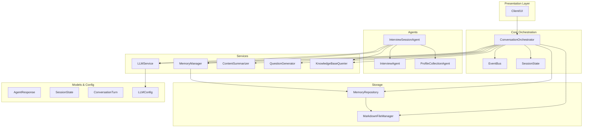
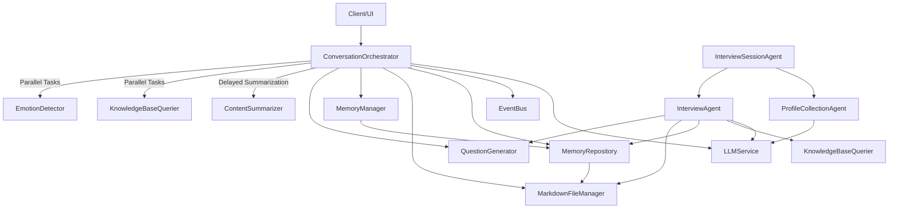
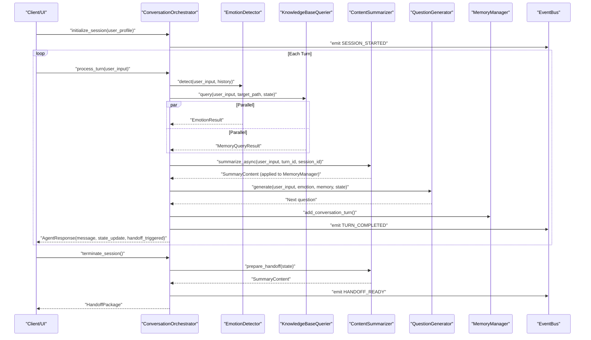
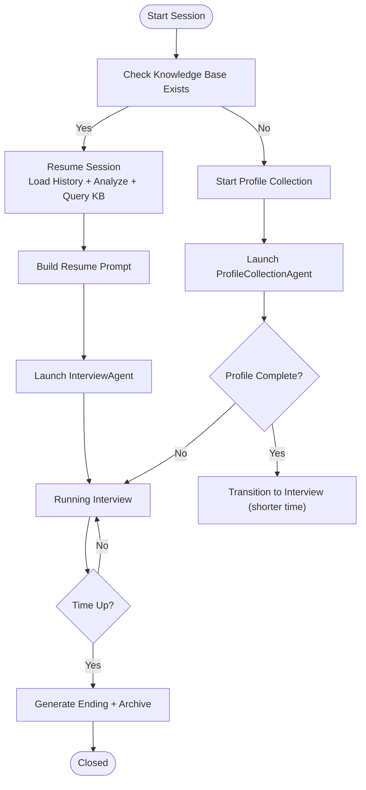
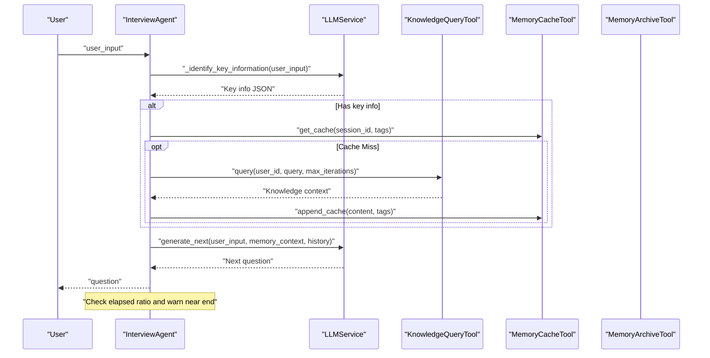
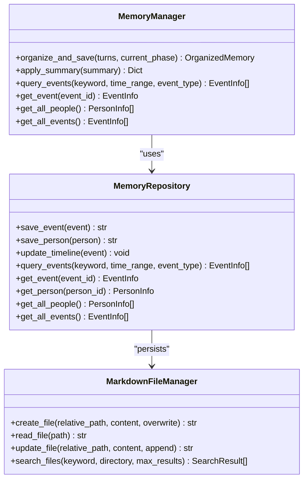
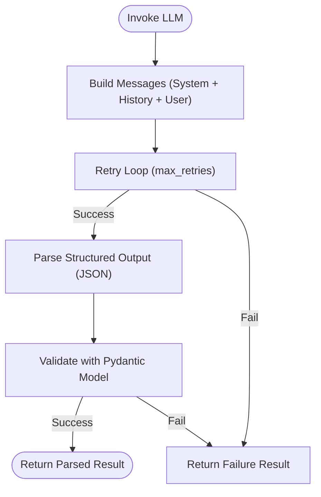
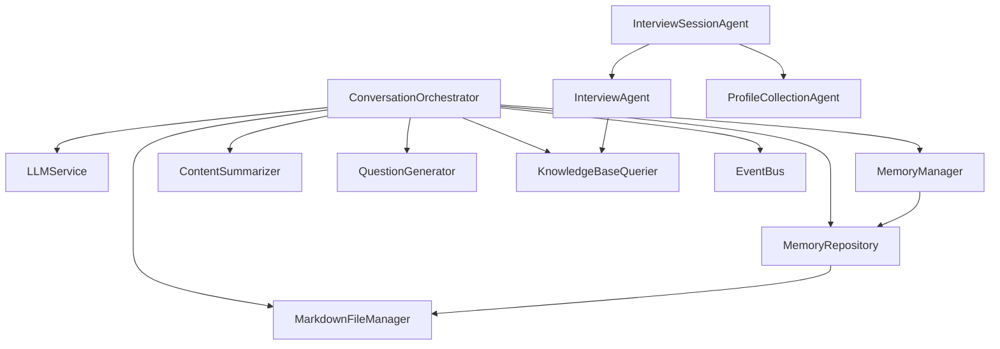

# System Design Overview

<cite>
**Referenced Files in This Document**
- [conversation_orchestrator.py](file://src/core/conversation_orchestrator.py)
- [interview_agent.py](file://src/agents/interview_agent.py)
- [interview_session_agent.py](file://src/agents/interview_session_agent.py)
- [profile_collection_agent.py](file://src/agents/profile_collection_agent.py)
- [llm_service.py](file://src/services/llm_service.py)
- [memory_manager.py](file://src/services/memory_manager.py)
- [content_summarizer.py](file://src/services/content_summarizer.py)
- [question_generator.py](file://src/services/question_generator.py)
- [knowledge_query_tool.py](file://src/tools/knowledge_query_tool.py)
- [markdown_file_manager.py](file://src/storage/markdown_file_manager.py)
- [memory_repository.py](file://src/storage/memory_repository.py)
- [session_state.py](file://src/models/session_state.py)
- [conversation_turn.py](file://src/models/conversation_turn.py)
- [agent_response.py](file://src/models/agent_response.py)
- [llm_config.py](file://src/config/llm_config.py)
- [event_bus.py](file://src/core/event_bus.py)
- [state_type.py](file://src/enums/state_type.py)
- [phase_type.py](file://src/enums/phase_type.py)
- [emotion_type.py](file://src/enums/emotion_type.py)
</cite>

## Table of Contents
1. [Introduction](#introduction)
2. [Project Structure](#project-structure)
3. [Core Components](#core-components)
4. [Architecture Overview](#architecture-overview)
5. [Detailed Component Analysis](#detailed-component-analysis)
6. [Dependency Analysis](#dependency-analysis)
7. [Performance Considerations](#performance-considerations)
8. [Troubleshooting Guide](#troubleshooting-guide)
9. [Conclusion](#conclusion)

## Introduction
This document presents the system design overview for the elderly memoir recording platform. The system is built around a LangGraph-inspired orchestration pattern that coordinates specialized AI agents and services to guide intergenerational interviews, collect structured memories, and maintain a knowledge base of life stories. It adopts a layered architecture separating presentation concerns from business logic, services, and data access, while enabling asynchronous, event-driven workflows and extensible agent plugins.

Key design principles:
- Centralized orchestration with a ConversationOrchestrator coordinating parallel tasks
- Layered architecture with clear separation of concerns
- Event-driven communication via an internal EventBus
- Asynchronous processing for responsiveness and scalability
- Extensibility through modular agents, services, and tools

## Project Structure
The system is organized into distinct layers and functional domains:
- Core orchestration and state: ConversationOrchestrator, SessionState, EventBus
- Agents: InterviewAgent, InterviewSessionAgent, ProfileCollectionAgent
- Services: LLMService, MemoryManager, ContentSummarizer, QuestionGenerator, KnowledgeBaseQuerier
- Storage: MarkdownFileManager, MemoryRepository
- Models and enums: SessionState, ConversationTurn, AgentResponse, state and phase enums
- Configuration: LLMConfig

**Diagram sources**
- [conversation_orchestrator.py](file://src/core/conversation_orchestrator.py)
- [interview_session_agent.py](file://src/agents/interview_session_agent.py)
- [interview_agent.py](file://src/agents/interview_agent.py)
- [profile_collection_agent.py](file://src/agents/profile_collection_agent.py)
- [llm_service.py](file://src/services/llm_service.py)
- [memory_manager.py](file://src/services/memory_manager.py)
- [content_summarizer.py](file://src/services/content_summarizer.py)
- [question_generator.py](file://src/services/question_generator.py)
- [knowledge_query_tool.py](file://src/tools/knowledge_query_tool.py)
- [markdown_file_manager.py](file://src/storage/markdown_file_manager.py)
- [memory_repository.py](file://src/storage/memory_repository.py)
- [session_state.py](file://src/models/session_state.py)
- [conversation_turn.py](file://src/models/conversation_turn.py)
- [agent_response.py](file://src/models/agent_response.py)
- [llm_config.py](file://src/config/llm_config.py)

**Section sources**
- [conversation_orchestrator.py](file://src/core/conversation_orchestrator.py)
- [interview_session_agent.py](file://src/agents/interview_session_agent.py)
- [interview_agent.py](file://src/agents/interview_agent.py)
- [profile_collection_agent.py](file://src/agents/profile_collection_agent.py)
- [llm_service.py](file://src/services/llm_service.py)
- [memory_manager.py](file://src/services/memory_manager.py)
- [content_summarizer.py](file://src/services/content_summarizer.py)
- [question_generator.py](file://src/services/question_generator.py)
- [knowledge_query_tool.py](file://src/tools/knowledge_query_tool.py)
- [markdown_file_manager.py](file://src/storage/markdown_file_manager.py)
- [memory_repository.py](file://src/storage/memory_repository.py)
- [session_state.py](file://src/models/session_state.py)
- [conversation_turn.py](file://src/models/conversation_turn.py)
- [agent_response.py](file://src/models/agent_response.py)
- [llm_config.py](file://src/config/llm_config.py)

## Core Components
- ConversationOrchestrator: Central coordinator that manages session lifecycle, parallel processing of emotion detection, knowledge queries, and summarization, and emits events for downstream subscribers.
- InterviewSessionAgent: Top-level agent orchestrating user initialization and interview phases, managing time budgets, and coordinating InterviewAgent and ProfileCollectionAgent.
- InterviewAgent: Time-bound interview agent generating contextual questions, identifying key information, querying knowledge, and managing conversation history.
- ProfileCollectionAgent: Collects user basic information iteratively until completion or timeout.
- LLMService: Unified interface to underlying LLM providers with template management, structured outputs, retries, and token usage tracking.
- MemoryManager: High-level memory manager coordinating LLM-based organization of conversations into structured events, people, and timelines; integrates with MemoryRepository.
- ContentSummarizer: Extracts structured content asynchronously after each turn and applies updates to memory.
- QuestionGenerator: Generates contextual questions prioritizing emotion handling, pending questions, phase transitions, and fallbacks.
- KnowledgeBaseQuerier and KnowledgeQueryTool: Query knowledge base with optional LLM assistance and format results.
- MarkdownFileManager and MemoryRepository: File-system-backed storage for Markdown-based knowledge base with indexing, search, and caching.
- EventBus: Publish-subscribe mechanism decoupling orchestration from downstream processors.
- Models and Enums: Typed data models and enumerations for session state, conversation turns, agent responses, and emotion/phase/state types.

**Section sources**
- [conversation_orchestrator.py](file://src/core/conversation_orchestrator.py)
- [interview_session_agent.py](file://src/agents/interview_session_agent.py)
- [interview_agent.py](file://src/agents/interview_agent.py)
- [profile_collection_agent.py](file://src/agents/profile_collection_agent.py)
- [llm_service.py](file://src/services/llm_service.py)
- [memory_manager.py](file://src/services/memory_manager.py)
- [content_summarizer.py](file://src/services/content_summarizer.py)
- [question_generator.py](file://src/services/question_generator.py)
- [knowledge_query_tool.py](file://src/tools/knowledge_query_tool.py)
- [markdown_file_manager.py](file://src/storage/markdown_file_manager.py)
- [memory_repository.py](file://src/storage/memory_repository.py)
- [event_bus.py](file://src/core/event_bus.py)
- [session_state.py](file://src/models/session_state.py)
- [conversation_turn.py](file://src/models/conversation_turn.py)
- [agent_response.py](file://src/models/agent_response.py)
- [state_type.py](file://src/enums/state_type.py)
- [phase_type.py](file://src/enums/phase_type.py)
- [emotion_type.py](file://src/enums/emotion_type.py)

## Architecture Overview
The system follows a layered architecture:
- Presentation: Client/UI interacts with the orchestration layer
- Orchestration: ConversationOrchestrator coordinates agents and services
- Business Logic: Agents implement interview flows and initialization
- Services: LLM orchestration, memory organization, question generation, and knowledge querying
- Data Access: MarkdownFileManager and MemoryRepository manage persistent knowledge base

**Diagram sources**
- [conversation_orchestrator.py](file://src/core/conversation_orchestrator.py)
- [interview_session_agent.py](file://src/agents/interview_session_agent.py)
- [interview_agent.py](file://src/agents/interview_agent.py)
- [profile_collection_agent.py](file://src/agents/profile_collection_agent.py)
- [llm_service.py](file://src/services/llm_service.py)
- [memory_manager.py](file://src/services/memory_manager.py)
- [content_summarizer.py](file://src/services/content_summarizer.py)
- [question_generator.py](file://src/services/question_generator.py)
- [knowledge_query_tool.py](file://src/tools/knowledge_query_tool.py)
- [markdown_file_manager.py](file://src/storage/markdown_file_manager.py)
- [memory_repository.py](file://src/storage/memory_repository.py)
- [event_bus.py](file://src/core/event_bus.py)

## Detailed Component Analysis

### ConversationOrchestrator: Central Coordinator
Responsibilities:
- Initialize sessions with timing controls and optional profile collection
- Manage parallel tasks for emotion detection, knowledge querying, and delayed summarization
- Generate contextual questions and update session state
- Emit events for monitoring and downstream processing
- Prepare handoff packages and terminate sessions gracefully

Key behaviors:
- Asynchronous orchestration with timeouts for reliability
- Session timing with warnings and termination triggers
- Profile collection workflow with state transitions
- Event emission for turn completion, session lifecycle, and handoff readiness

**Diagram sources**
- [conversation_orchestrator.py](file://src/core/conversation_orchestrator.py)
- [content_summarizer.py](file://src/services/content_summarizer.py)
- [question_generator.py](file://src/services/question_generator.py)
- [memory_manager.py](file://src/services/memory_manager.py)
- [event_bus.py](file://src/core/event_bus.py)

**Section sources**
- [conversation_orchestrator.py](file://src/core/conversation_orchestrator.py)
- [session_state.py](file://src/models/session_state.py)
- [conversation_turn.py](file://src/models/conversation_turn.py)
- [agent_response.py](file://src/models/agent_response.py)
- [event_bus.py](file://src/core/event_bus.py)

### InterviewSessionAgent: Agent Service Orchestrator
Responsibilities:
- Determine whether to resume an existing session or start profile collection
- Coordinate InterviewAgent and ProfileCollectionAgent lifecycles
- Manage time budgets and archiving at milestones
- Build prompts for resuming interviews and integrate knowledge context

**Diagram sources**
- [interview_session_agent.py](file://src/agents/interview_session_agent.py)
- [interview_agent.py](file://src/agents/interview_agent.py)
- [profile_collection_agent.py](file://src/agents/profile_collection_agent.py)

**Section sources**
- [interview_session_agent.py](file://src/agents/interview_session_agent.py)
- [interview_agent.py](file://src/agents/interview_agent.py)
- [profile_collection_agent.py](file://src/agents/profile_collection_agent.py)

### InterviewAgent: Time-Bound Interview Flow
Responsibilities:
- Identify key information from user input
- Query knowledge base and manage cache
- Generate contextual questions with time-aware warnings
- Produce session end guidance and summaries

**Diagram sources**
- [interview_agent.py](file://src/agents/interview_agent.py)
- [knowledge_query_tool.py](file://src/tools/knowledge_query_tool.py)
- [llm_service.py](file://src/services/llm_service.py)

**Section sources**
- [interview_agent.py](file://src/agents/interview_agent.py)
- [knowledge_query_tool.py](file://src/tools/knowledge_query_tool.py)
- [llm_service.py](file://src/services/llm_service.py)

### Memory Management and Storage
Responsibilities:
- Organize conversation turns into structured memory (events, people, timeline)
- Apply updates to long-term storage and maintain caches
- Provide query interfaces for events and people
- Support profile updates derived from memory

**Diagram sources**
- [memory_manager.py](file://src/services/memory_manager.py)
- [memory_repository.py](file://src/storage/memory_repository.py)
- [markdown_file_manager.py](file://src/storage/markdown_file_manager.py)

**Section sources**
- [memory_manager.py](file://src/services/memory_manager.py)
- [memory_repository.py](file://src/storage/memory_repository.py)
- [markdown_file_manager.py](file://src/storage/markdown_file_manager.py)

### LLM Service and Structured Outputs
Responsibilities:
- Unified LLM invocation with retry logic and token accounting
- Template loading from Markdown and Python modules
- Structured output parsing with Pydantic models
- Provider abstraction (OpenAI-compatible, Qwen, DeepSeek, Anthropic)

**Diagram sources**
- [llm_service.py](file://src/services/llm_service.py)
- [llm_config.py](file://src/config/llm_config.py)

**Section sources**
- [llm_service.py](file://src/services/llm_service.py)
- [llm_config.py](file://src/config/llm_config.py)

## Dependency Analysis
Component relationships and coupling:
- ConversationOrchestrator depends on LLMService, MemoryManager, KnowledgeBaseQuerier, QuestionGenerator, ContentSummarizer, MarkdownFileManager, MemoryRepository, and EventBus
- InterviewSessionAgent composes InterviewAgent and ProfileCollectionAgent and coordinates knowledge base access
- MemoryManager depends on MemoryRepository and LLMService for organization
- MemoryRepository depends on MarkdownFileManager and KnowledgeBaseQuerier
- EventBus decouples orchestration from downstream processors

**Diagram sources**
- [conversation_orchestrator.py](file://src/core/conversation_orchestrator.py)
- [interview_session_agent.py](file://src/agents/interview_session_agent.py)
- [interview_agent.py](file://src/agents/interview_agent.py)
- [profile_collection_agent.py](file://src/agents/profile_collection_agent.py)
- [llm_service.py](file://src/services/llm_service.py)
- [memory_manager.py](file://src/services/memory_manager.py)
- [content_summarizer.py](file://src/services/content_summarizer.py)
- [question_generator.py](file://src/services/question_generator.py)
- [knowledge_query_tool.py](file://src/tools/knowledge_query_tool.py)
- [markdown_file_manager.py](file://src/storage/markdown_file_manager.py)
- [memory_repository.py](file://src/storage/memory_repository.py)
- [event_bus.py](file://src/core/event_bus.py)

**Section sources**
- [conversation_orchestrator.py](file://src/core/conversation_orchestrator.py)
- [interview_session_agent.py](file://src/agents/interview_session_agent.py)
- [memory_manager.py](file://src/services/memory_manager.py)
- [memory_repository.py](file://src/storage/memory_repository.py)
- [markdown_file_manager.py](file://src/storage/markdown_file_manager.py)
- [llm_service.py](file://src/services/llm_service.py)
- [event_bus.py](file://src/core/event_bus.py)

## Performance Considerations
- Asynchronous orchestration: Parallel emotion detection, knowledge queries, and delayed summarization improve throughput and responsiveness.
- Timeouts and backpressure: Configurable timeouts prevent long-running operations from blocking the main thread; session timing enforces upper bounds.
- Caching: MemoryRepository’s LRU cache and MemoryManager’s short-term memory reduce repeated I/O and computation.
- Structured outputs: LLMService’s structured parsing reduces post-processing overhead and improves reliability.
- Event-driven decoupling: EventBus enables scalable, asynchronous reactions to orchestration events without tight coupling.

## Troubleshooting Guide
Common issues and remedies:
- LLM invocation failures: LLMService implements retry logic; check provider credentials and base URLs in LLMConfig. Review logs for structured parse errors and adjust prompt templates.
- Knowledge base queries failing: Verify target_path resolution and directory structure; ensure MarkdownFileManager has proper base_path and conversation_id.
- Memory updates not applied: Confirm MemoryManager.apply_summary is invoked and MemoryRepository.save_* operations succeed; inspect cache and indices.
- Session timing anomalies: Adjust session_duration_minutes and time_warning_threshold in OrchestratorConfig; verify SessionTiming calculations.
- Event bus handlers: Ensure subscribers are registered and handlers are resilient to exceptions; use async handlers for I/O-bound work.

**Section sources**
- [llm_service.py](file://src/services/llm_service.py)
- [llm_config.py](file://src/config/llm_config.py)
- [markdown_file_manager.py](file://src/storage/markdown_file_manager.py)
- [memory_repository.py](file://src/storage/memory_repository.py)
- [memory_manager.py](file://src/services/memory_manager.py)
- [conversation_orchestrator.py](file://src/core/conversation_orchestrator.py)
- [event_bus.py](file://src/core/event_bus.py)

## Conclusion
The elderly memoir recording system employs a robust, layered architecture centered on a ConversationOrchestrator that coordinates specialized agents and services. By leveraging asynchronous processing, event-driven communication, and a Markdown-based knowledge base, the system supports responsive, extensible interview experiences. The design balances modularity with strong integration points, enabling future enhancements such as additional agent types, richer memory models, and expanded external integrations.