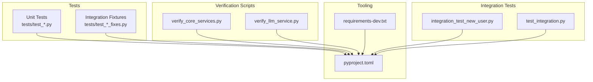
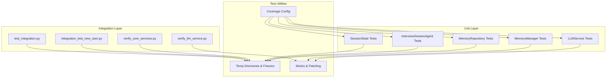
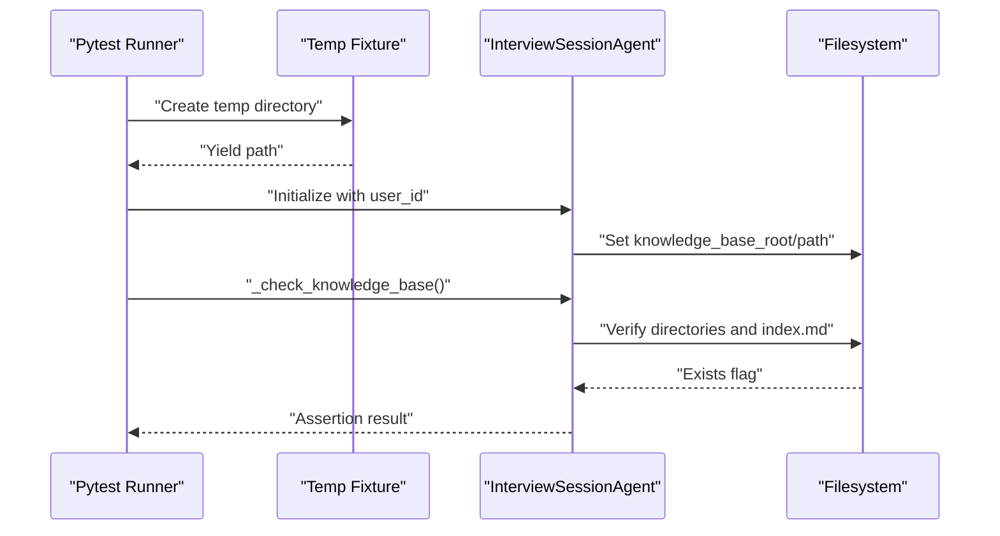
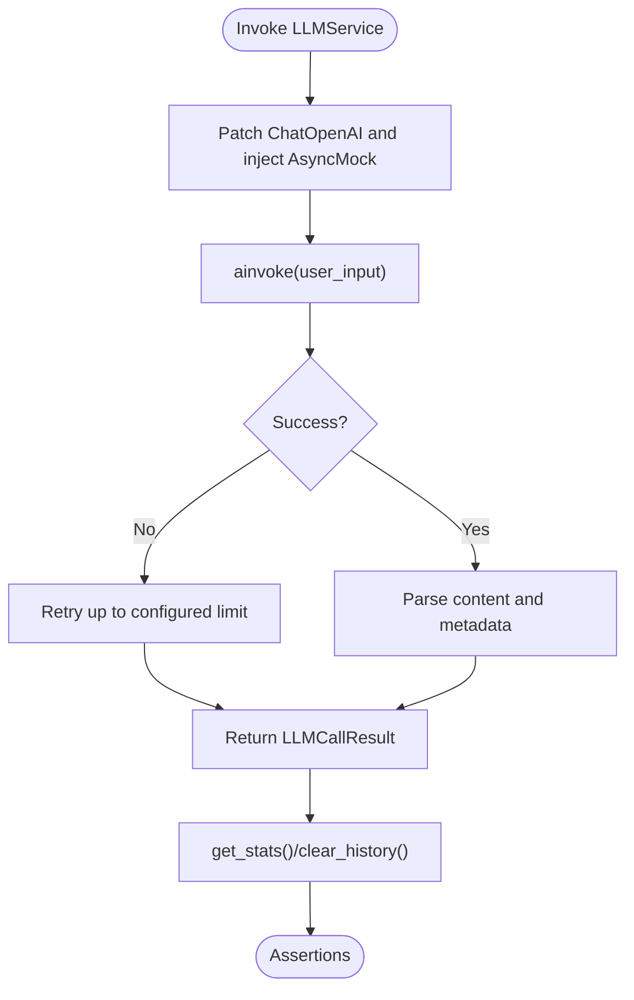
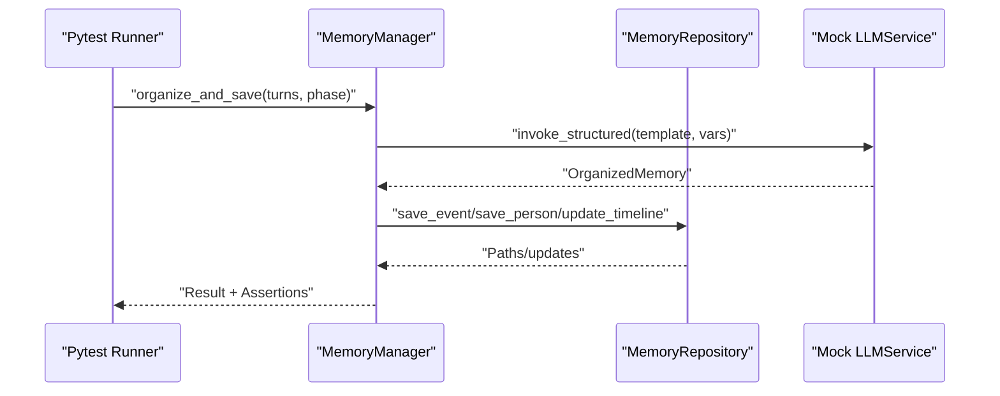
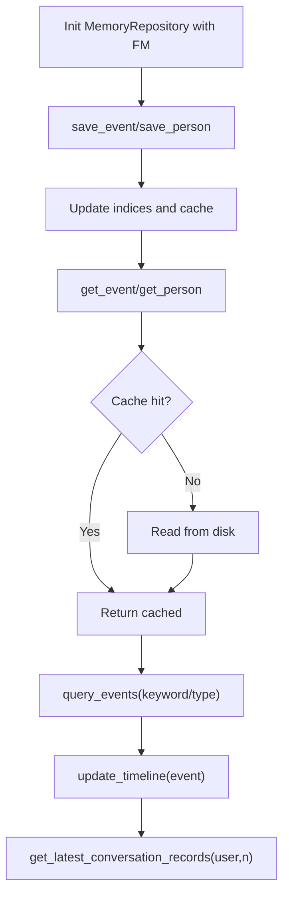
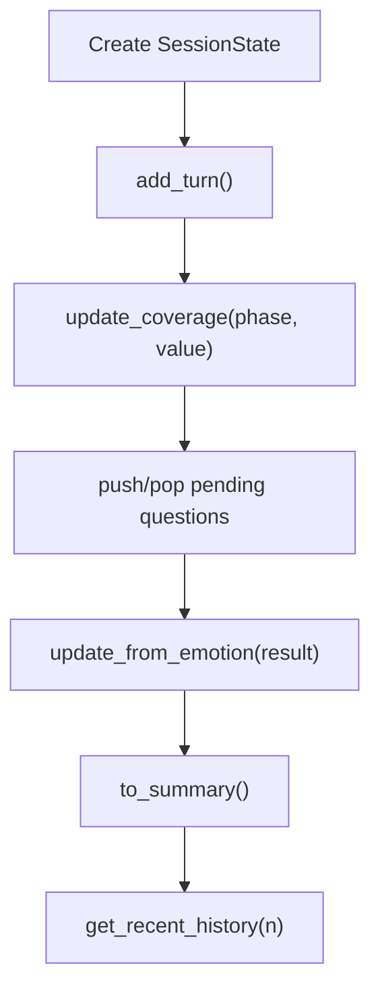
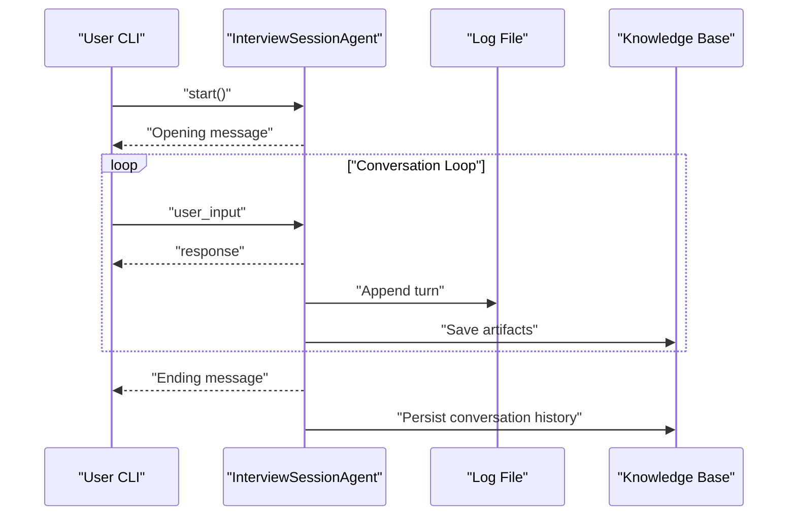
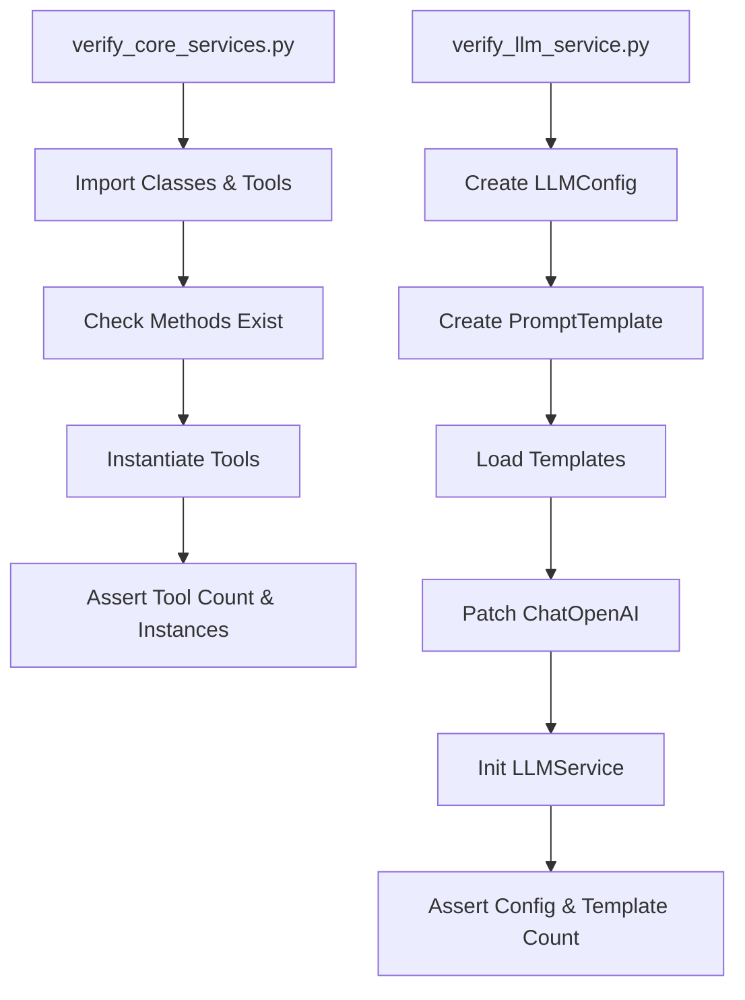
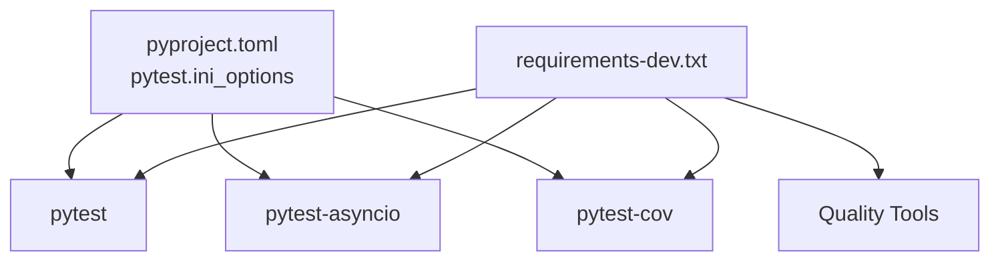

# Testing Strategy

<cite>
**Referenced Files in This Document**
- [tests/test_interview_session_agent.py](file://tests/test_interview_session_agent.py)
- [tests/test_llm_service.py](file://tests/test_llm_service.py)
- [tests/test_memory_manager.py](file://tests/test_memory_manager.py)
- [tests/test_memory_repository.py](file://tests/test_memory_repository.py)
- [tests/test_session_state.py](file://tests/test_session_state.py)
- [integration_test_new_user.py](file://integration_test_new_user.py)
- [test_integration.py](file://test_integration.py)
- [test_fixes.py](file://test_fixes.py)
- [verify_core_services.py](file://verify_core_services.py)
- [verify_llm_service.py](file://verify_llm_service.py)
- [requirements-dev.txt](file://requirements-dev.txt)
- [pyproject.toml](file://pyproject.toml)
</cite>

## Table of Contents
1. [Introduction](#introduction)
2. [Project Structure](#project-structure)
3. [Core Components](#core-components)
4. [Architecture Overview](#architecture-overview)
5. [Detailed Component Analysis](#detailed-component-analysis)
6. [Dependency Analysis](#dependency-analysis)
7. [Performance Considerations](#performance-considerations)
8. [Troubleshooting Guide](#troubleshooting-guide)
9. [Conclusion](#conclusion)
10. [Appendices](#appendices)

## Introduction
This document presents a comprehensive testing strategy and implementation guide for the Elder Memoir Agent system. It covers unit testing approaches for individual components with mocks and coverage requirements, integration testing for end-to-end workflows and memory operations, and the test utilities used for fixtures, helpers, and verification scripts. It also documents test organization, test data management, continuous integration patterns, best practices, performance testing considerations, debugging strategies, coverage requirements, flaky test mitigation, and automated testing workflows.

## Project Structure
The repository organizes tests under a dedicated tests/ directory and supports both unit and integration verification via standalone scripts. The primary testing stack leverages pytest with asyncio support, and developer dependencies include coverage, black, isort, flake8, and mypy.

**Diagram sources**
- [pyproject.toml:24-26](file://pyproject.toml#L24-L26)
- [requirements-dev.txt:1-13](file://requirements-dev.txt#L1-L13)

**Section sources**
- [pyproject.toml:1-26](file://pyproject.toml#L1-L26)
- [requirements-dev.txt:1-13](file://requirements-dev.txt#L1-L13)

## Core Components
This section outlines the testing approach for major components and their responsibilities in the system.

- InterviewSessionAgent
  - Validates knowledge base initialization and directory structure checks.
  - Uses temporary directories for isolation and deterministic assertions.
  - Tests include missing directories, partial structure, and complete structure scenarios.

- LLMService
  - Comprehensive unit tests for invocation, retries, structured output parsing, and statistics.
  - Uses mocking to avoid external API calls while asserting behavior and error handling.

- MemoryManager
  - Integrates with MemoryRepository and LLMService via mocks.
  - Tests organize and save conversations, apply summaries, manage short-term memory, and query events.

- MemoryRepository
  - Includes a custom LRUCache and extensive tests for saving/loading, querying, timeline updates, and conversation records retrieval.
  - Exercises short-term memory, history management, and profile updates.

- SessionState
  - Validates creation, turn management, coverage updates, pending questions, and emotion-driven state transitions.

**Section sources**
- [tests/test_interview_session_agent.py:9-77](file://tests/test_interview_session_agent.py#L9-L77)
- [tests/test_llm_service.py:8-187](file://tests/test_llm_service.py#L8-L187)
- [tests/test_memory_manager.py:18-249](file://tests/test_memory_manager.py#L18-L249)
- [tests/test_memory_repository.py:44-325](file://tests/test_memory_repository.py#L44-L325)
- [tests/test_session_state.py:7-143](file://tests/test_session_state.py#L7-L143)

## Architecture Overview
The testing architecture separates concerns into unit tests, integration verification scripts, and end-to-end integration tests. Unit tests focus on isolated components and services, while integration scripts validate real-world workflows and service interactions.

**Diagram sources**
- [tests/test_llm_service.py:9-22](file://tests/test_llm_service.py#L9-L22)
- [tests/test_memory_manager.py:20-30](file://tests/test_memory_manager.py#L20-L30)
- [tests/test_memory_repository.py:45-49](file://tests/test_memory_repository.py#L45-L49)
- [tests/test_interview_session_agent.py:10-13](file://tests/test_interview_session_agent.py#L10-L13)
- [tests/test_session_state.py:8-16](file://tests/test_session_state.py#L8-L16)
- [verify_core_services.py:22-74](file://verify_core_services.py#L22-L74)
- [verify_llm_service.py:86-110](file://verify_llm_service.py#L86-L110)
- [integration_test_new_user.py:39-77](file://integration_test_new_user.py#L39-L77)
- [test_integration.py:21-103](file://test_integration.py#L21-L103)

## Detailed Component Analysis

### InterviewSessionAgent Tests
- Purpose: Validate knowledge base existence and structure checks.
- Approach: Fixture creates a temporary directory; agent path is overridden to isolate tests.
- Assertions: Checks for false positives/negatives across missing directories, partial structures, and complete setups.
- Edge cases: Non-existent user paths and malformed structures.

**Diagram sources**
- [tests/test_interview_session_agent.py:10-13](file://tests/test_interview_session_agent.py#L10-L13)
- [tests/test_interview_session_agent.py:16-77](file://tests/test_interview_session_agent.py#L16-L77)

**Section sources**
- [tests/test_interview_session_agent.py:9-77](file://tests/test_interview_session_agent.py#L9-L77)

### LLMService Tests
- Purpose: Validate invocation, retry logic, template usage, structured output parsing, and statistics.
- Approach: Mock ChatOpenAI to avoid external API calls; simulate exceptions and JSON responses.
- Assertions: Success flags, error propagation, latency and token usage metrics, and prompt template loading.

**Diagram sources**
- [tests/test_llm_service.py:9-22](file://tests/test_llm_service.py#L9-L22)
- [tests/test_llm_service.py:24-52](file://tests/test_llm_service.py#L24-L52)
- [tests/test_llm_service.py:84-102](file://tests/test_llm_service.py#L84-L102)
- [tests/test_llm_service.py:141-168](file://tests/test_llm_service.py#L141-L168)

**Section sources**
- [tests/test_llm_service.py:8-187](file://tests/test_llm_service.py#L8-L187)

### MemoryManager Tests
- Purpose: Integrate MemoryRepository and LLMService to organize and save conversation-derived memories.
- Approach: Mock LLMService via patch; inject AsyncMock; assert repository interactions and profile updates.
- Assertions: Organized memory returned, repository save/update calls, and short-term memory/history management.

**Diagram sources**
- [tests/test_memory_manager.py:20-30](file://tests/test_memory_manager.py#L20-L30)
- [tests/test_memory_manager.py:32-96](file://tests/test_memory_manager.py#L32-L96)
- [tests/test_memory_manager.py:98-151](file://tests/test_memory_manager.py#L98-L151)

**Section sources**
- [tests/test_memory_manager.py:18-249](file://tests/test_memory_manager.py#L18-L249)

### MemoryRepository Tests
- Purpose: Validate persistence, caching, querying, timeline updates, and conversation records retrieval.
- Approach: Temporary directory fixture; use LRUCache to verify eviction and update semantics.
- Assertions: Paths, indices, cache hits/evictions, query filters, and history capacity limits.

**Diagram sources**
- [tests/test_memory_repository.py:45-49](file://tests/test_memory_repository.py#L45-L49)
- [tests/test_memory_repository.py:52-112](file://tests/test_memory_repository.py#L52-L112)
- [tests/test_memory_repository.py:193-227](file://tests/test_memory_repository.py#L193-L227)
- [tests/test_memory_repository.py:269-325](file://tests/test_memory_repository.py#L269-L325)

**Section sources**
- [tests/test_memory_repository.py:44-325](file://tests/test_memory_repository.py#L44-L325)

### SessionState Tests
- Purpose: Validate state transitions, coverage bounds, pending questions, and emotion-driven updates.
- Approach: Instantiate SessionState and mutate state via methods; assert immutables and derived values.
- Assertions: Turn counts, coverage clamping, collected sets, and emotion state updates.

**Diagram sources**
- [tests/test_session_state.py:8-16](file://tests/test_session_state.py#L8-L16)
- [tests/test_session_state.py:18-27](file://tests/test_session_state.py#L18-L27)
- [tests/test_session_state.py:29-42](file://tests/test_session_state.py#L29-L42)
- [tests/test_session_state.py:61-82](file://tests/test_session_state.py#L61-L82)
- [tests/test_session_state.py:118-143](file://tests/test_session_state.py#L118-L143)

**Section sources**
- [tests/test_session_state.py:7-143](file://tests/test_session_state.py#L7-L143)

### Integration Tests
- New User Integration Test
  - Purpose: End-to-end walkthrough of a new user’s first interview session.
  - Approach: Initialize InterviewSessionAgent, log conversation, and persist history.
  - Assertions: Successful initialization, conversation persistence, and completion markers.

- Full Conversation Flow Integration
  - Purpose: Validate orchestrator end-to-end flow, emotion detection, question generation, and handoff.
  - Approach: Simulate conversation turns, check state updates, and collect handoff data.
  - Assertions: Handoff metadata, collected events/people/timeline/themes counts.

**Diagram sources**
- [integration_test_new_user.py:39-77](file://integration_test_new_user.py#L39-L77)
- [integration_test_new_user.py:96-148](file://integration_test_new_user.py#L96-L148)
- [integration_test_new_user.py:150-166](file://integration_test_new_user.py#L150-L166)

**Section sources**
- [integration_test_new_user.py:1-176](file://integration_test_new_user.py#L1-L176)
- [test_integration.py:21-103](file://test_integration.py#L21-L103)

### Verification Scripts
- Core Services Verification
  - Purpose: Verify class existence, method presence, and basic instantiation without LLM calls.
  - Approach: Import and introspect classes; instantiate tools and render defaults.
  - Assertions: Methods exist, tools count, and model instances.

- LLM Service Verification
  - Purpose: Validate LLMConfig, PromptTemplate, template loading, and mocked LLMService initialization.
  - Approach: Create configurations and templates; patch ChatOpenAI during LLMService construction.
  - Assertions: Config fields, template rendering/validation, and loaded template count.

**Diagram sources**
- [verify_core_services.py:22-74](file://verify_core_services.py#L22-L74)
- [verify_core_services.py:77-121](file://verify_core_services.py#L77-L121)
- [verify_llm_service.py:22-45](file://verify_llm_service.py#L22-L45)
- [verify_llm_service.py:46-84](file://verify_llm_service.py#L46-L84)
- [verify_llm_service.py:86-110](file://verify_llm_service.py#L86-L110)

**Section sources**
- [verify_core_services.py:1-173](file://verify_core_services.py#L1-L173)
- [verify_llm_service.py:1-121](file://verify_llm_service.py#L1-L121)

## Dependency Analysis
- Test framework and async mode are configured via pyproject.toml.
- Developer dependencies include pytest, pytest-asyncio, pytest-cov, plus code quality tools.
- Tests rely on fixtures for temporary directories and mocks for external services.

**Diagram sources**
- [pyproject.toml:24-26](file://pyproject.toml#L24-L26)
- [requirements-dev.txt:1-13](file://requirements-dev.txt#L1-L13)

**Section sources**
- [pyproject.toml:1-26](file://pyproject.toml#L1-L26)
- [requirements-dev.txt:1-13](file://requirements-dev.txt#L1-L13)

## Performance Considerations
- Asynchronous tests: Use pytest-asyncio to run async tests efficiently without blocking.
- Mock external services: Avoid network overhead by mocking LLM providers and file system operations.
- Caching and fixtures: Use temporary directories and in-memory caches to minimize I/O and speed up tests.
- Coverage measurement: Enable pytest-cov to track coverage and identify hotspots for optimization.

## Troubleshooting Guide
- Flaky tests
  - Isolate randomness by using deterministic fixtures and controlled mocks.
  - Pin retry logic expectations and assert call counts to reduce variability.
- Assertion patterns
  - Prefer explicit assertions on success flags, counts, and content rather than implicit truthiness.
  - Validate error messages and edge-case outcomes (e.g., empty queries, missing files).
- Debugging failures
  - Increase logging verbosity in integration scripts.
  - Capture and inspect conversation logs and persisted artifacts for failed runs.
  - Use smaller test datasets and targeted fixtures to narrow down failure scopes.

## Conclusion
The testing strategy combines robust unit tests with comprehensive integration verification and end-to-end integration scripts. By leveraging fixtures, mocks, and verification utilities, the suite ensures correctness, reliability, and maintainability across core components and workflows. Continuous improvement should focus on expanding coverage, stabilizing flaky tests, and integrating automated CI pipelines.

## Appendices

### Test Organization and Data Management
- Organization
  - Unit tests under tests/ grouped by module.
  - Integration and verification scripts in repository root for manual and semi-automated checks.
- Data management
  - Temporary directories per test to avoid cross-test contamination.
  - Mocked LLM responses and repository indices to simulate realistic behavior without external dependencies.

### Continuous Integration Patterns
- Pytest configuration
  - Async mode auto-enabled; tests discovered under tests/.
- Coverage
  - pytest-cov included; configure thresholds and reporting in CI pipeline.
- Quality gates
  - Pre-commit hooks and linters (black, isort, flake8, mypy) to enforce style and type safety.

### Best Practices
- Prefer small, focused tests with clear assertions.
- Use fixtures for shared setup and teardown.
- Mock external systems to keep tests deterministic and fast.
- Maintain verification scripts for quick smoke checks outside CI.

### Example References
- Unit test development
  - LLMService invocation and retry: [tests/test_llm_service.py:24-52](file://tests/test_llm_service.py#L24-L52)
  - Structured output parsing: [tests/test_llm_service.py:84-102](file://tests/test_llm_service.py#L84-L102)
- Mock usage
  - Patching ChatOpenAI: [tests/test_llm_service.py:17-22](file://tests/test_llm_service.py#L17-L22)
  - Mocking LLMService in MemoryManager: [tests/test_memory_manager.py:26-28](file://tests/test_memory_manager.py#L26-L28)
- Assertion patterns
  - Success flags and call counts: [tests/test_llm_service.py:33-35](file://tests/test_llm_service.py#L33-L35)
  - Statistics and clearing history: [tests/test_llm_service.py:150-167](file://tests/test_llm_service.py#L150-L167)
- Integration examples
  - New user interview flow: [integration_test_new_user.py:39-166](file://integration_test_new_user.py#L39-L166)
  - Full conversation orchestration: [test_integration.py:21-103](file://test_integration.py#L21-L103)