# Testing Infrastructure

<cite>
**Referenced Files in This Document**
- [_common.py](file://tests/integration/_common.py)
- [run_all.py](file://tests/integration/run_all.py)
- [test_interview_api.py](file://tests/integration/test_interview_api.py)
- [test_kb_organizer_api.py](file://tests/integration/test_kb_organizer_api.py)
- [test_biography_outline_api.py](file://tests/integration/test_biography_outline_api.py)
- [test_biography_writing_api.py](file://tests/integration/test_biography_writing_api.py)
- [test_llm_service.py](file://tests/test_llm_service.py)
- [test_memory_manager.py](file://tests/test_memory_manager.py)
- [test_memory_repository.py](file://tests/test_memory_repository.py)
- [test_markdown_file_manager.py](file://tests/test_markdown_file_manager.py)
- [test_session_state.py](file://tests/test_session_state.py)
- [test_session_manager.py](file://tests/test_service/test_session_manager.py)
- [test_sse_response.py](file://tests/test_service/test_sse_response.py)
- [test_file_routes.py](file://tests/test_service/test_file_routes.py)
- [test_core_services.py](file://test_core_services.py)
- [test_system_assembly.py](file://test_system_assembly.py)
- [verify_core_services.py](file://verify_core_services.py)
</cite>

## Table of Contents
1. [Introduction](#introduction)
2. [Project Structure](#project-structure)
3. [Core Components](#core-components)
4. [Architecture Overview](#architecture-overview)
5. [Detailed Component Analysis](#detailed-component-analysis)
6. [Dependency Analysis](#dependency-analysis)
7. [Performance Considerations](#performance-considerations)
8. [Troubleshooting Guide](#troubleshooting-guide)
9. [Conclusion](#conclusion)

## Introduction
This document describes the testing infrastructure of the project, covering unit, integration, and standalone end-to-end tests. It explains how tests are organized, how they exercise APIs and services, and how to run them effectively. The testing stack includes:
- Unit tests using pytest with mocked external dependencies
- Integration tests that call the HTTP/SSE endpoints of agents
- Standalone integration runners that orchestrate multiple agent flows
- Verification and assembly-layer tests for core services and system components

## Project Structure
The testing layout is organized by functional area:
- tests/unit: pytest-based unit tests for services, models, and utilities
- tests/integration: HTTP/SSE integration tests for agents and shared helpers
- tests/test_service: service-layer tests for SSE, session management, and file routes
- top-level test scripts: quick verification and assembly tests

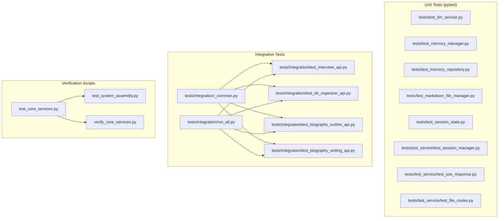

**Diagram sources**
- [test_llm_service.py:1-187](file://tests/test_llm_service.py#L1-L187)
- [test_memory_manager.py:1-249](file://tests/test_memory_manager.py#L1-L249)
- [test_memory_repository.py:1-325](file://tests/test_memory_repository.py#L1-L325)
- [test_markdown_file_manager.py:1-207](file://tests/test_markdown_file_manager.py#L1-L207)
- [test_session_state.py:1-143](file://tests/test_session_state.py#L1-L143)
- [test_session_manager.py:1-134](file://tests/test_service/test_session_manager.py#L1-L134)
- [test_sse_response.py:1-136](file://tests/test_service/test_sse_response.py#L1-L136)
- [test_file_routes.py:1-243](file://tests/test_service/test_file_routes.py#L1-L243)
- [_common.py:1-194](file://tests/integration/_common.py#L1-L194)
- [test_interview_api.py:1-217](file://tests/integration/test_interview_api.py#L1-L217)
- [test_kb_organizer_api.py:1-120](file://tests/integration/test_kb_organizer_api.py#L1-L120)
- [test_biography_outline_api.py:1-186](file://tests/integration/test_biography_outline_api.py#L1-L186)
- [test_biography_writing_api.py:1-166](file://tests/integration/test_biography_writing_api.py#L1-L166)
- [run_all.py:1-74](file://tests/integration/run_all.py#L1-L74)
- [test_core_services.py:1-164](file://test_core_services.py#L1-L164)
- [test_system_assembly.py:1-206](file://test_system_assembly.py#L1-L206)
- [verify_core_services.py:1-173](file://verify_core_services.py#L1-L173)

**Section sources**
- [test_llm_service.py:1-187](file://tests/test_llm_service.py#L1-L187)
- [test_memory_manager.py:1-249](file://tests/test_memory_manager.py#L1-L249)
- [test_memory_repository.py:1-325](file://tests/test_memory_repository.py#L1-L325)
- [test_markdown_file_manager.py:1-207](file://tests/test_markdown_file_manager.py#L1-L207)
- [test_session_state.py:1-143](file://tests/test_session_state.py#L1-L143)
- [test_session_manager.py:1-134](file://tests/test_service/test_session_manager.py#L1-L134)
- [test_sse_response.py:1-136](file://tests/test_service/test_sse_response.py#L1-L136)
- [test_file_routes.py:1-243](file://tests/test_service/test_file_routes.py#L1-L243)
- [_common.py:1-194](file://tests/integration/_common.py#L1-L194)
- [test_interview_api.py:1-217](file://tests/integration/test_interview_api.py#L1-L217)
- [test_kb_organizer_api.py:1-120](file://tests/integration/test_kb_organizer_api.py#L1-L120)
- [test_biography_outline_api.py:1-186](file://tests/integration/test_biography_outline_api.py#L1-L186)
- [test_biography_writing_api.py:1-166](file://tests/integration/test_biography_writing_api.py#L1-L166)
- [run_all.py:1-74](file://tests/integration/run_all.py#L1-L74)
- [test_core_services.py:1-164](file://test_core_services.py#L1-L164)
- [test_system_assembly.py:1-206](file://test_system_assembly.py#L1-L206)
- [verify_core_services.py:1-173](file://verify_core_services.py#L1-L173)

## Core Components
- Shared integration helpers: HTTP/SSE parsing, timeouts, logging, and summary reporting
- Agent integration tests: Interview, KB Organizer, Biography Outline, Biography Writing
- Unit tests: LLM service, memory manager/repository, markdown file manager, session state, SSE/emitter, session manager, file routes
- Verification scripts: Quick checks for core services and system assembly

Key capabilities:
- HTTP/SSE streaming consumption with robust parsing and event emission
- Mock-driven unit tests that avoid external LLM calls
- End-to-end integration flows for agent pipelines
- Service-layer validations for SSE formatting and session concurrency

**Section sources**
- [_common.py:1-194](file://tests/integration/_common.py#L1-L194)
- [test_interview_api.py:1-217](file://tests/integration/test_interview_api.py#L1-L217)
- [test_kb_organizer_api.py:1-120](file://tests/integration/test_kb_organizer_api.py#L1-L120)
- [test_biography_outline_api.py:1-186](file://tests/integration/test_biography_outline_api.py#L1-L186)
- [test_biography_writing_api.py:1-166](file://tests/integration/test_biography_writing_api.py#L1-L166)
- [test_llm_service.py:1-187](file://tests/test_llm_service.py#L1-L187)
- [test_memory_manager.py:1-249](file://tests/test_memory_manager.py#L1-L249)
- [test_memory_repository.py:1-325](file://tests/test_memory_repository.py#L1-L325)
- [test_markdown_file_manager.py:1-207](file://tests/test_markdown_file_manager.py#L1-L207)
- [test_session_state.py:1-143](file://tests/test_session_state.py#L1-L143)
- [test_session_manager.py:1-134](file://tests/test_service/test_session_manager.py#L1-L134)
- [test_sse_response.py:1-136](file://tests/test_service/test_sse_response.py#L1-L136)
- [test_file_routes.py:1-243](file://tests/test_service/test_file_routes.py#L1-L243)
- [test_core_services.py:1-164](file://test_core_services.py#L1-L164)
- [test_system_assembly.py:1-206](file://test_system_assembly.py#L1-L206)
- [verify_core_services.py:1-173](file://verify_core_services.py#L1-L173)

## Architecture Overview
The testing architecture separates concerns into layers:
- Unit layer: isolated tests for services and utilities, using mocks to stub external systems
- Integration layer: HTTP/SSE tests that exercise real endpoints and streams
- Verification layer: quick smoke checks for core services and system assembly

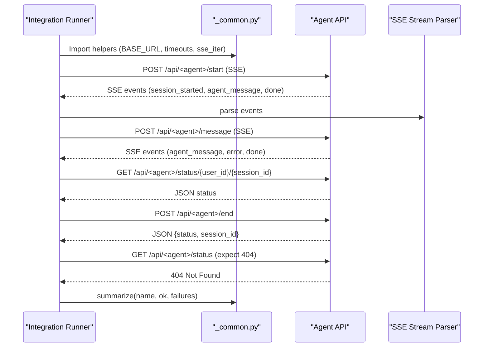

**Diagram sources**
- [_common.py:1-194](file://tests/integration/_common.py#L1-L194)
- [test_interview_api.py:1-217](file://tests/integration/test_interview_api.py#L1-L217)
- [test_kb_organizer_api.py:1-120](file://tests/integration/test_kb_organizer_api.py#L1-L120)
- [test_biography_outline_api.py:1-186](file://tests/integration/test_biography_outline_api.py#L1-L186)
- [test_biography_writing_api.py:1-166](file://tests/integration/test_biography_writing_api.py#L1-L166)

## Detailed Component Analysis

### Integration Helpers and Utilities
- Provides BASE_URL resolution, timeouts, and SSE parsing
- Implements a robust SSE parser that handles line endings, comments, and partial chunks
- Offers logging helpers and a summary reporter for integration scripts

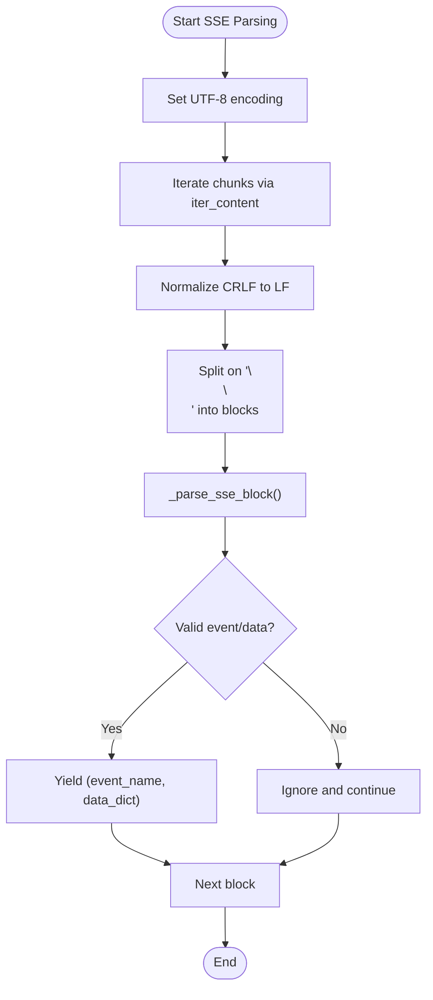

**Diagram sources**
- [_common.py:48-151](file://tests/integration/_common.py#L48-L151)

**Section sources**
- [_common.py:1-194](file://tests/integration/_common.py#L1-L194)

### Interview Agent Integration Test
- Exercises start, message, status, end, and post-end status endpoints
- Validates SSE event presence and session lifecycle
- Uses shared SSE parsing and logging utilities

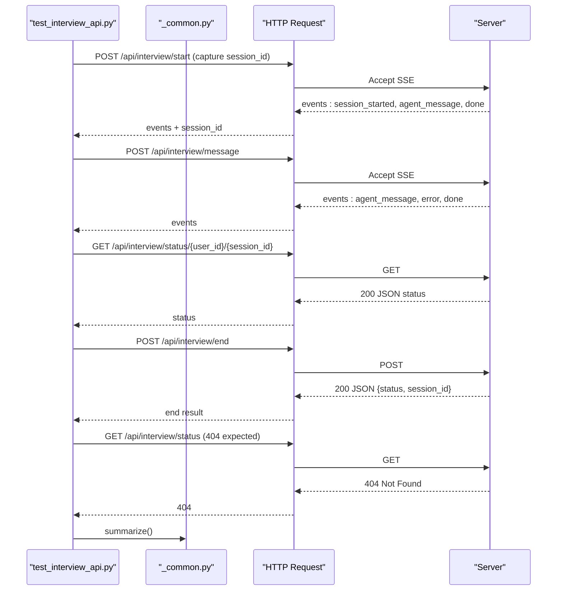

**Diagram sources**
- [test_interview_api.py:92-208](file://tests/integration/test_interview_api.py#L92-L208)
- [_common.py:1-194](file://tests/integration/_common.py#L1-L194)

**Section sources**
- [test_interview_api.py:1-217](file://tests/integration/test_interview_api.py#L1-L217)

### KB Organizer Agent Integration Test
- Exercises run and result retrieval endpoints
- Demonstrates SSE streaming and result validation

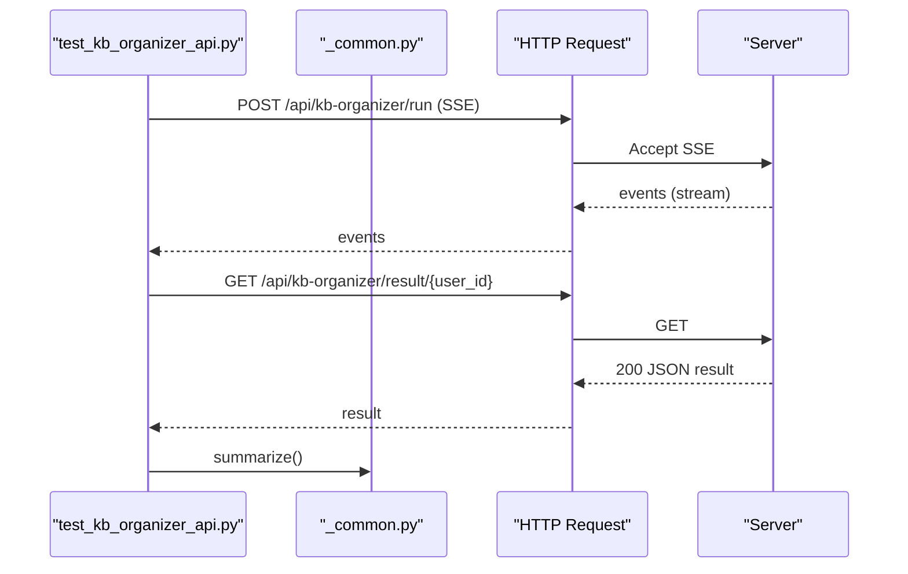

**Diagram sources**
- [test_kb_organizer_api.py:37-111](file://tests/integration/test_kb_organizer_api.py#L37-L111)
- [_common.py:1-194](file://tests/integration/_common.py#L1-L194)

**Section sources**
- [test_kb_organizer_api.py:1-120](file://tests/integration/test_kb_organizer_api.py#L1-L120)

### Biography Outline Agent Integration Test
- Exercises generation, retrieval, and chapter confirmation endpoints
- Handles optional confirm step when a draft chapter exists

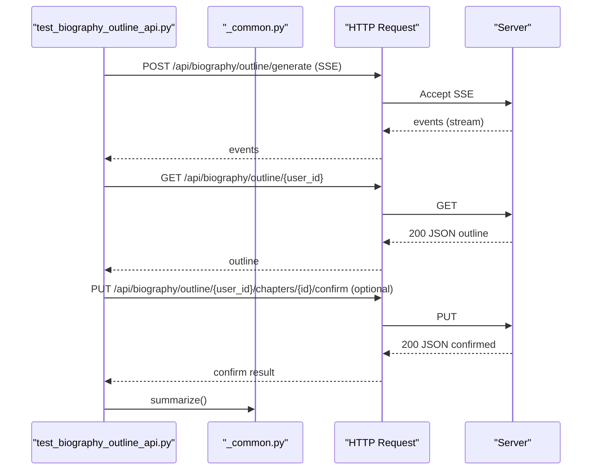

**Diagram sources**
- [test_biography_outline_api.py:44-177](file://tests/integration/test_biography_outline_api.py#L44-L177)
- [_common.py:1-194](file://tests/integration/_common.py#L1-L194)

**Section sources**
- [test_biography_outline_api.py:1-186](file://tests/integration/test_biography_outline_api.py#L1-L186)

### Biography Writing Agent Integration Test
- Exercises run, chapters listing, and full biography retrieval endpoints
- Handles potential 404 for full biography when not yet generated

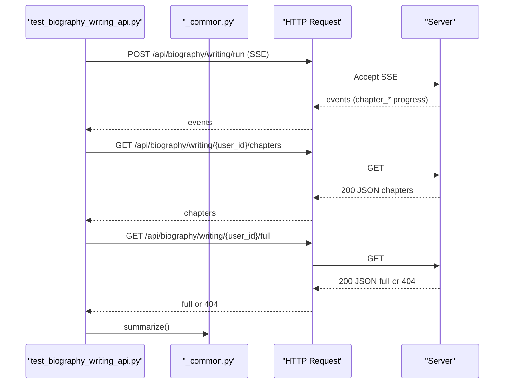

**Diagram sources**
- [test_biography_writing_api.py:43-157](file://tests/integration/test_biography_writing_api.py#L43-L157)
- [_common.py:1-194](file://tests/integration/_common.py#L1-L194)

**Section sources**
- [test_biography_writing_api.py:1-166](file://tests/integration/test_biography_writing_api.py#L1-L166)

### Integration Test Orchestration
- A runner that executes all agent integration tests in sequence
- Captures exit codes and prints a summary table

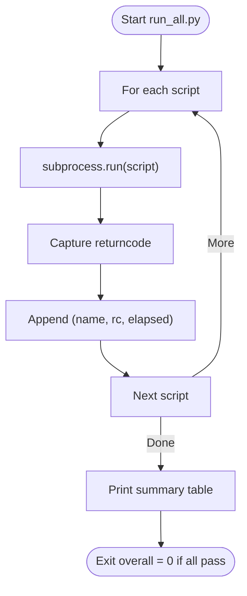

**Diagram sources**
- [run_all.py:30-69](file://tests/integration/run_all.py#L30-L69)

**Section sources**
- [run_all.py:1-74](file://tests/integration/run_all.py#L1-L74)

### Unit Tests: LLM Service
- Tests invoke, retry, structured output, and statistics
- Uses mocking to avoid external LLM calls

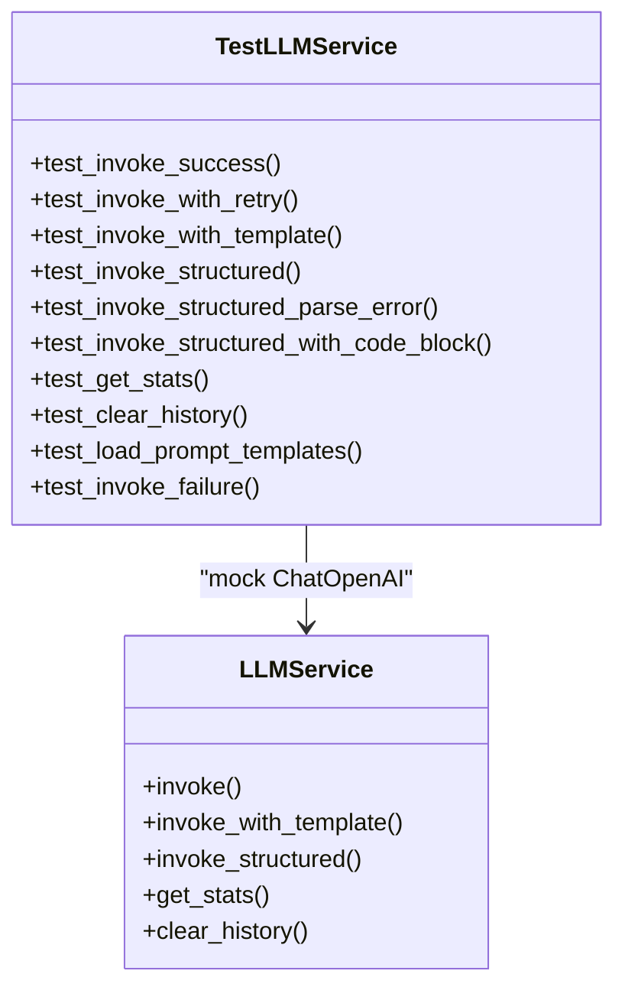

**Diagram sources**
- [test_llm_service.py:8-187](file://tests/test_llm_service.py#L8-L187)

**Section sources**
- [test_llm_service.py:1-187](file://tests/test_llm_service.py#L1-L187)

### Unit Tests: Memory Manager and Repository
- Tests organize_and_save, apply_summary, query_events, and session clearing
- Validates repository save/get/update and timeline updates
- Uses mocked LLMService and repository methods

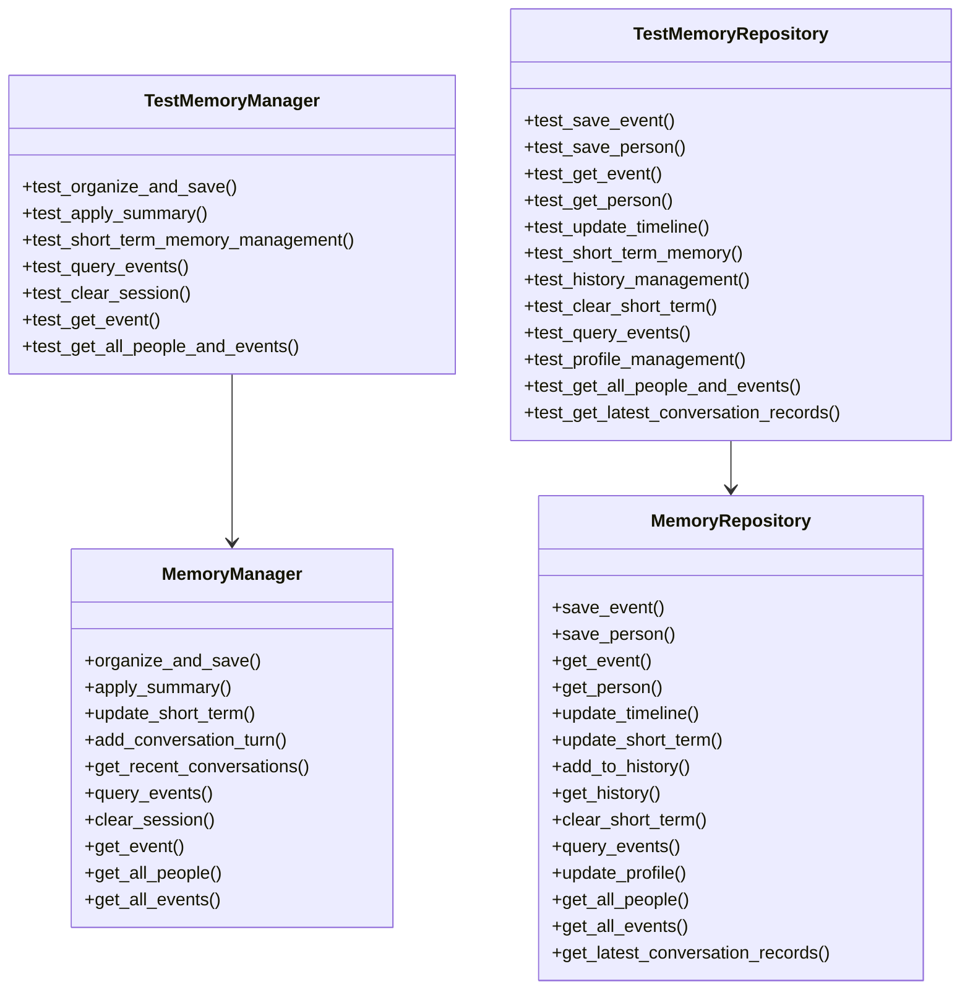

**Diagram sources**
- [test_memory_manager.py:18-249](file://tests/test_memory_manager.py#L18-L249)
- [test_memory_repository.py:44-325](file://tests/test_memory_repository.py#L44-L325)

**Section sources**
- [test_memory_manager.py:1-249](file://tests/test_memory_manager.py#L1-L249)
- [test_memory_repository.py:1-325](file://tests/test_memory_repository.py#L1-L325)

### Unit Tests: Markdown File Manager
- Tests create/read/update, search, wiki-link extraction/resolution, and link following
- Validates file existence and metadata

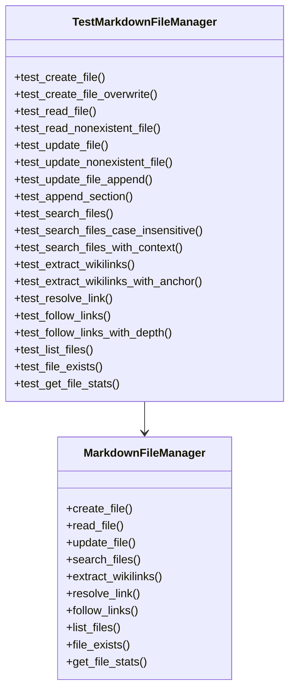

**Diagram sources**
- [test_markdown_file_manager.py:7-207](file://tests/test_markdown_file_manager.py#L7-L207)

**Section sources**
- [test_markdown_file_manager.py:1-207](file://tests/test_markdown_file_manager.py#L1-L207)

### Unit Tests: Session State
- Tests creation, adding turns, coverage updates, pending questions, and summaries

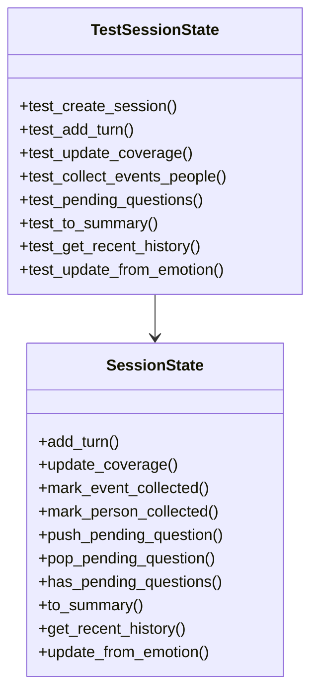

**Diagram sources**
- [test_session_state.py:7-143](file://tests/test_session_state.py#L7-L143)

**Section sources**
- [test_session_state.py:1-143](file://tests/test_session_state.py#L1-L143)

### Service Tests: Session Manager
- Tests mutual exclusivity and session acquisition/release semantics

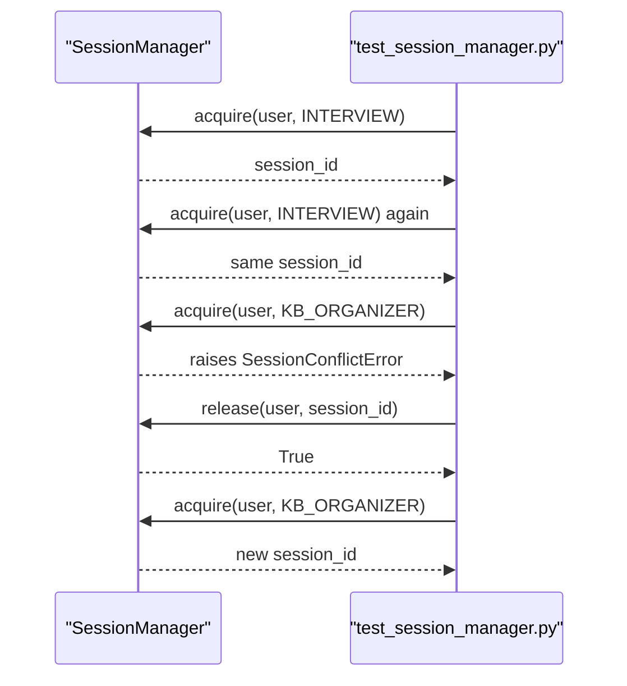

**Diagram sources**
- [test_session_manager.py:16-134](file://tests/test_service/test_session_manager.py#L16-L134)

**Section sources**
- [test_session_manager.py:1-134](file://tests/test_service/test_session_manager.py#L1-L134)

### Service Tests: SSE Response Formatting
- Tests SSEEvent and SSEEmitter formatting, timestamps, and error emission

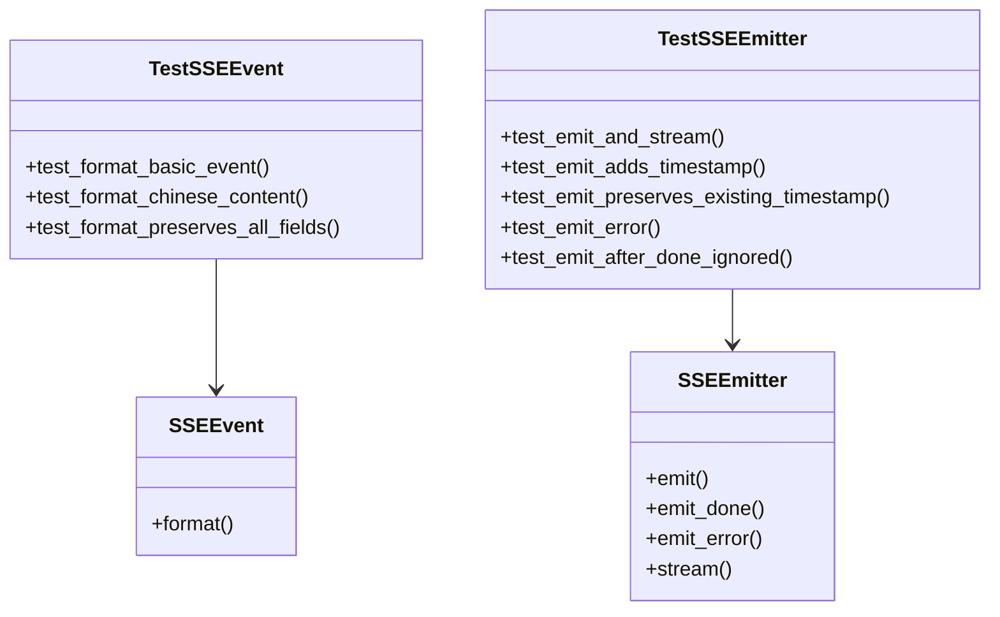

**Diagram sources**
- [test_sse_response.py:9-136](file://tests/test_service/test_sse_response.py#L9-L136)

**Section sources**
- [test_sse_response.py:1-136](file://tests/test_service/test_sse_response.py#L1-L136)

### Service Tests: File Routes
- Tests directory listing, file content retrieval, tree view, and error handling
- Validates content-type detection and path traversal protection

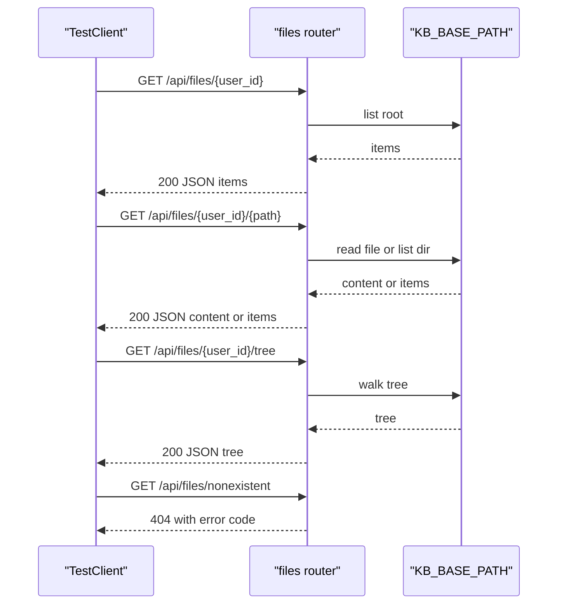

**Diagram sources**
- [test_file_routes.py:49-243](file://tests/test_service/test_file_routes.py#L49-L243)

**Section sources**
- [test_file_routes.py:1-243](file://tests/test_service/test_file_routes.py#L1-L243)

### Verification and Assembly Tests
- test_core_services.py: end-to-end async tests for emotion detector, knowledge base querier, and question generator
- test_system_assembly.py: tests event bus, content summarizer, and conversation orchestrator
- verify_core_services.py: structural verification without LLM calls

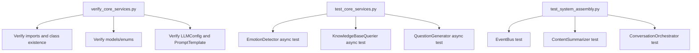

**Diagram sources**
- [verify_core_services.py:1-173](file://verify_core_services.py#L1-L173)
- [test_core_services.py:1-164](file://test_core_services.py#L1-L164)
- [test_system_assembly.py:1-206](file://test_system_assembly.py#L1-L206)

**Section sources**
- [verify_core_services.py:1-173](file://verify_core_services.py#L1-L173)
- [test_core_services.py:1-164](file://test_core_services.py#L1-L164)
- [test_system_assembly.py:1-206](file://test_system_assembly.py#L1-L206)

## Dependency Analysis
- Integration tests depend on shared helpers for HTTP/SSE handling and logging
- Unit tests rely on pytest fixtures and mocking to isolate components
- Service tests validate internal protocols and error handling
- Verification scripts depend on core module imports and basic instantiation

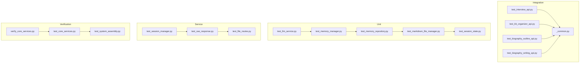

**Diagram sources**
- [test_interview_api.py:1-217](file://tests/integration/test_interview_api.py#L1-L217)
- [test_kb_organizer_api.py:1-120](file://tests/integration/test_kb_organizer_api.py#L1-L120)
- [test_biography_outline_api.py:1-186](file://tests/integration/test_biography_outline_api.py#L1-L186)
- [test_biography_writing_api.py:1-166](file://tests/integration/test_biography_writing_api.py#L1-L166)
- [_common.py:1-194](file://tests/integration/_common.py#L1-L194)
- [test_llm_service.py:1-187](file://tests/test_llm_service.py#L1-L187)
- [test_memory_manager.py:1-249](file://tests/test_memory_manager.py#L1-L249)
- [test_memory_repository.py:1-325](file://tests/test_memory_repository.py#L1-L325)
- [test_markdown_file_manager.py:1-207](file://tests/test_markdown_file_manager.py#L1-L207)
- [test_session_state.py:1-143](file://tests/test_session_state.py#L1-L143)
- [test_session_manager.py:1-134](file://tests/test_service/test_session_manager.py#L1-L134)
- [test_sse_response.py:1-136](file://tests/test_service/test_sse_response.py#L1-L136)
- [test_file_routes.py:1-243](file://tests/test_service/test_file_routes.py#L1-L243)
- [verify_core_services.py:1-173](file://verify_core_services.py#L1-L173)
- [test_core_services.py:1-164](file://test_core_services.py#L1-L164)
- [test_system_assembly.py:1-206](file://test_system_assembly.py#L1-L206)

**Section sources**
- [test_interview_api.py:1-217](file://tests/integration/test_interview_api.py#L1-L217)
- [test_kb_organizer_api.py:1-120](file://tests/integration/test_kb_organizer_api.py#L1-L120)
- [test_biography_outline_api.py:1-186](file://tests/integration/test_biography_outline_api.py#L1-L186)
- [test_biography_writing_api.py:1-166](file://tests/integration/test_biography_writing_api.py#L1-L166)
- [_common.py:1-194](file://tests/integration/_common.py#L1-L194)
- [test_llm_service.py:1-187](file://tests/test_llm_service.py#L1-L187)
- [test_memory_manager.py:1-249](file://tests/test_memory_manager.py#L1-L249)
- [test_memory_repository.py:1-325](file://tests/test_memory_repository.py#L1-L325)
- [test_markdown_file_manager.py:1-207](file://tests/test_markdown_file_manager.py#L1-L207)
- [test_session_state.py:1-143](file://tests/test_session_state.py#L1-L143)
- [test_session_manager.py:1-134](file://tests/test_service/test_session_manager.py#L1-L134)
- [test_sse_response.py:1-136](file://tests/test_service/test_sse_response.py#L1-L136)
- [test_file_routes.py:1-243](file://tests/test_service/test_file_routes.py#L1-L243)
- [verify_core_services.py:1-173](file://verify_core_services.py#L1-L173)
- [test_core_services.py:1-164](file://test_core_services.py#L1-L164)
- [test_system_assembly.py:1-206](file://test_system_assembly.py#L1-L206)

## Performance Considerations
- Integration tests use generous timeouts for SSE reads to accommodate slower agent executions
- Unit tests minimize external I/O via mocking, enabling fast local iteration
- SSE parsing avoids line-buffering pitfalls by reading byte-by-byte and normalizing line endings
- Service-layer tests validate streaming semantics without heavy network overhead

[No sources needed since this section provides general guidance]

## Troubleshooting Guide
Common issues and remedies:
- Missing requests dependency in integration helpers: install the requests package to run integration tests
- No session_id captured from SSE: verify server-side session initialization and event emission
- SSE stream ends without "done": check server-side completion logic and ensure done event is emitted
- 404 after end: expected behavior; indicates session cleanup
- LLM invocation failures: mock ChatOpenAI in unit tests to avoid API calls
- Path traversal errors: ensure paths are validated and normalized before file access
- Session conflicts: release active sessions before acquiring a different agent type for the same user

**Section sources**
- [_common.py:12-20](file://tests/integration/_common.py#L12-L20)
- [test_interview_api.py:103-110](file://tests/integration/test_interview_api.py#L103-L110)
- [test_llm_service.py:180-187](file://tests/test_llm_service.py#L180-L187)
- [test_file_routes.py:218-238](file://tests/test_service/test_file_routes.py#L218-L238)
- [test_session_manager.py:39-58](file://tests/test_service/test_session_manager.py#L39-L58)

## Conclusion
The testing infrastructure combines robust unit tests with comprehensive integration tests that exercise HTTP/SSE endpoints. Shared helpers streamline SSE parsing and reporting, while verification scripts provide quick checks for core services and system assembly. The suite supports reliable development and regression detection across services, repositories, and agent pipelines.