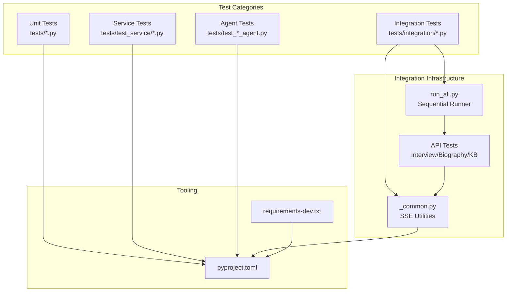
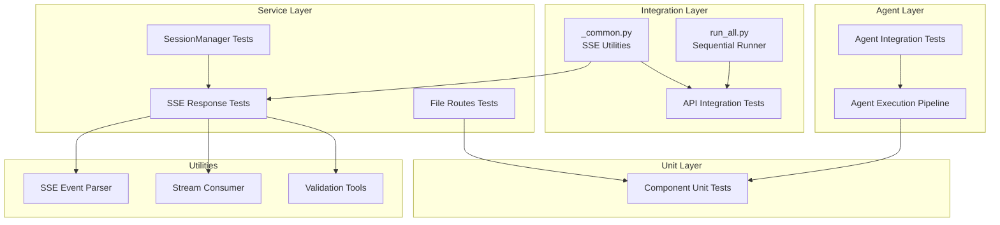
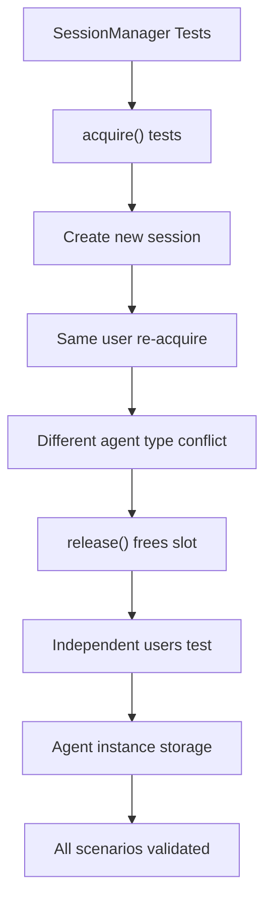
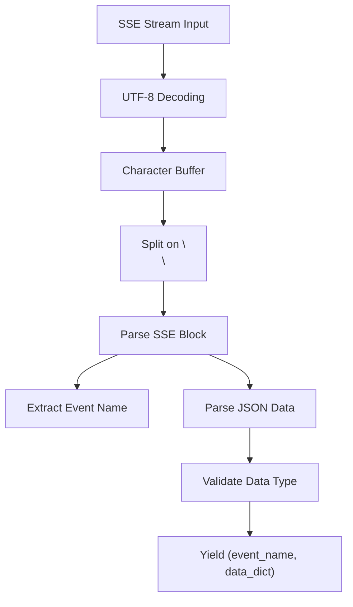
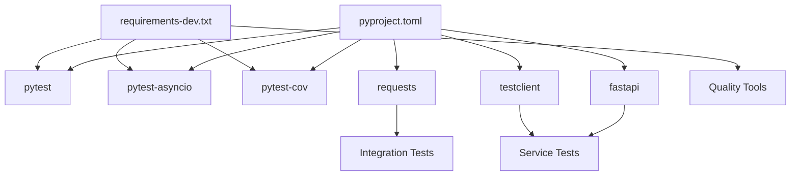

# Testing Strategy

<cite>
**Referenced Files in This Document**
- [tests/integration/run_all.py](file://tests/integration/run_all.py)
- [tests/integration/_common.py](file://tests/integration/_common.py)
- [tests/integration/test_interview_api.py](file://tests/integration/test_interview_api.py)
- [tests/integration/test_kb_organizer_api.py](file://tests/integration/test_kb_organizer_api.py)
- [tests/integration/test_biography_outline_api.py](file://tests/integration/test_biography_outline_api.py)
- [tests/integration/test_biography_writing_api.py](file://tests/integration/test_biography_writing_api.py)
- [tests/test_service/test_sse_response.py](file://tests/test_service/test_sse_response.py)
- [tests/test_service/test_session_manager.py](file://tests/test_service/test_session_manager.py)
- [tests/test_service/test_file_routes.py](file://tests/test_service/test_file_routes.py)
- [tests/test_interview_session_agent.py](file://tests/test_interview_session_agent.py)
- [tests/test_llm_service.py](file://tests/test_llm_service.py)
- [tests/test_memory_manager.py](file://tests/test_memory_manager.py)
- [tests/test_memory_repository.py](file://tests/test_memory_repository.py)
- [tests/test_session_state.py](file://tests/test_session_state.py)
- [integration_test_new_user.py](file://integration_test_new_user.py)
- [test_integration.py](file://test_integration.py)
- [test_fixes.py](file://test_fixes.py)
- [verify_core_services.py](file://verify_core_services.py)
- [verify_llm_service.py](file://verify_llm_service.py)
- [requirements-dev.txt](file://requirements-dev.txt)
- [pyproject.toml](file://pyproject.toml)
</cite>

## Update Summary
**Changes Made**
- Enhanced Interview API integration testing to validate both backward compatibility and new candidate question selection behavior
- Added comprehensive validation of new SSE event fields (`question_source`, `candidate_question_id`) in agent message events
- Expanded integration test coverage to include candidate question selection workflow testing
- Updated test assertions to verify new candidate question selection behavior while maintaining backward compatibility checks

## Table of Contents
1. [Introduction](#introduction)
2. [Project Structure](#project-structure)
3. [Core Components](#core-components)
4. [Architecture Overview](#architecture-overview)
5. [Detailed Component Analysis](#detailed-component-analysis)
6. [API Endpoint Integration Testing](#api-endpoint-integration-testing)
7. [Agent Integration Testing](#agent-integration-testing)
8. [Service Layer Testing](#service-layer-testing)
9. [SSE Support Testing](#sse-support-testing)
10. [Test Utilities and Helpers](#test-utilities-and-helpers)
11. [Dependency Analysis](#dependency-analysis)
12. [Performance Considerations](#performance-considerations)
13. [Troubleshooting Guide](#troubleshooting-guide)
14. [Conclusion](#conclusion)
15. [Appendices](#appendices)

## Introduction
This document presents a comprehensive testing strategy and implementation guide for the Elder Memoir Agent system. The testing infrastructure has been significantly expanded to include comprehensive API endpoint integration tests, agent pipeline testing, service layer validation, and SSE (Server-Sent Events) support testing. The system now provides end-to-end testing coverage for HTTP/SSE workflows, agent execution pipelines, and service integration patterns.

**Updated** Enhanced with expanded integration testing for candidate question selection behavior and backward compatibility validation.

## Project Structure
The repository organizes tests under multiple specialized directories including unit tests, integration tests, and service-specific tests. The testing stack leverages pytest with asyncio support, comprehensive SSE parsing utilities, and dedicated integration test runners.



**Diagram sources**
- [tests/integration/run_all.py:1-74](file://tests/integration/run_all.py#L1-L74)
- [tests/integration/_common.py:1-226](file://tests/integration/_common.py#L1-L226)
- [tests/integration/test_interview_api.py:1-272](file://tests/integration/test_interview_api.py#L1-L272)
- [tests/integration/test_biography_outline_api.py:1-186](file://tests/integration/test_biography_outline_api.py#L1-L186)
- [tests/integration/test_kb_organizer_api.py:1-120](file://tests/integration/test_kb_organizer_api.py#L1-L120)
- [tests/integration/test_biography_writing_api.py:1-166](file://tests/integration/test_biography_writing_api.py#L1-L166)

**Section sources**
- [pyproject.toml:1-26](file://pyproject.toml#L1-L26)
- [requirements-dev.txt:1-13](file://requirements-dev.txt#L1-L13)

## Core Components
The testing infrastructure now encompasses four major testing categories:

- **API Endpoint Integration Tests**: Comprehensive HTTP/SSE testing for Interview, Biography Outline, Biography Writing, and Knowledge Base Organizer agents
- **Agent Integration Tests**: Full pipeline testing for agent execution with LLM service integration
- **Service Layer Tests**: Session management, file operations, and SSE response formatting validation
- **Unit Tests**: Individual component testing with mocks and fixtures

**Updated** Enhanced Interview API testing now validates both backward compatibility and new candidate question selection behavior.

**Section sources**
- [tests/integration/test_interview_api.py:1-272](file://tests/integration/test_interview_api.py#L1-L272)
- [tests/test_biography_outline_agent.py:1-182](file://tests/test_biography_outline_agent.py#L1-L182)
- [tests/test_service/test_session_manager.py:1-134](file://tests/test_service/test_session_manager.py#L1-L134)
- [tests/test_service/test_sse_response.py:1-136](file://tests/test_service/test_sse_response.py#L1-L136)

## Architecture Overview
The testing architecture now includes a comprehensive multi-layered approach with dedicated integration test runners, SSE parsing utilities, and specialized test suites for different system components.



**Diagram sources**
- [tests/integration/run_all.py:30-74](file://tests/integration/run_all.py#L30-L74)
- [tests/integration/_common.py:48-152](file://tests/integration/_common.py#L48-L152)
- [tests/test_service/test_session_manager.py:16-134](file://tests/test_service/test_session_manager.py#L16-L134)
- [tests/test_service/test_file_routes.py:11-243](file://tests/test_service/test_file_routes.py#L11-L243)
- [tests/test_service/test_sse_response.py:9-136](file://tests/test_service/test_sse_response.py#L9-L136)

## Detailed Component Analysis

### InterviewSessionAgent Tests
Enhanced with comprehensive unit testing including knowledge base validation, directory structure checking, and temporary directory isolation.

**Section sources**
- [tests/test_interview_session_agent.py:9-77](file://tests/test_interview_session_agent.py#L9-L77)

### LLMService Tests
Comprehensive unit testing with extensive mocking, retry logic validation, structured output parsing, and statistics tracking.

**Section sources**
- [tests/test_llm_service.py:8-187](file://tests/test_llm_service.py#L8-L187)

### MemoryManager Tests
Integration testing with MemoryRepository and LLMService via comprehensive mocking and assertion patterns.

**Section sources**
- [tests/test_memory_manager.py:18-249](file://tests/test_memory_manager.py#L18-L249)

### MemoryRepository Tests
LRUCache-based testing with extensive query validation, timeline updates, and conversation record management.

**Section sources**
- [tests/test_memory_repository.py:44-325](file://tests/test_memory_repository.py#L44-L325)

### SessionState Tests
State transition validation with coverage updates, pending questions management, and emotion-driven state changes.

**Section sources**
- [tests/test_session_state.py:7-143](file://tests/test_session_state.py#L7-L143)

## API Endpoint Integration Testing

### Interview Agent API Integration
Comprehensive testing of the Interview agent HTTP/SSE API with complete session lifecycle validation, including backward compatibility and new candidate question selection behavior.

```mermaid
sequenceDiagram
participant Client as "Integration Client"
participant Start as "POST /api/interview/start"
participant MessageCompat as "POST /api/interview/message (compat)"
participant MessageCQ as "POST /api/interview/message (candidate)"
participant Status as "GET /api/interview/status"
participant End as "POST /api/interview/end"
Client->>Start : Stream SSE events
Start-->>Client : session_started, agent_message
Client->>MessageCompat : Send user message (backward compat)
MessageCompat-->>Client : agent_message with question_source, candidate_question_id
Client->>MessageCQ : Send user message with candidate_questions
MessageCQ-->>Client : agent_message with validation
Client->>Status : Check session status
Status-->>Client : Active session data
Client->>End : End interview session
End-->>Client : Session ended confirmation
```

**Updated** Enhanced with candidate question selection workflow validation and backward compatibility checks.

**Diagram sources**
- [tests/integration/test_interview_api.py:123-194](file://tests/integration/test_interview_api.py#L123-L194)

**Section sources**
- [tests/integration/test_interview_api.py:1-272](file://tests/integration/test_interview_api.py#L1-L272)

### Biography Outline API Integration
Complete testing of the Biography Outline agent with generation, retrieval, and chapter confirmation workflows.

**Section sources**
- [tests/integration/test_biography_outline_api.py:1-186](file://tests/integration/test_biography_outline_api.py#L1-L186)

### Biography Writing API Integration
End-to-end testing of the Biography Writing agent with chapter progression and full biography retrieval.

**Section sources**
- [tests/integration/test_biography_writing_api.py:1-166](file://tests/integration/test_biography_writing_api.py#L1-L166)

### Knowledge Base Organizer API Integration
Testing of the KB Organizer agent with result retrieval and validation workflows.

**Section sources**
- [tests/integration/test_kb_organizer_api.py:1-120](file://tests/integration/test_kb_organizer_api.py#L1-L120)

## Agent Integration Testing

### Biography Outline Agent Integration
Full pipeline testing with LLM service integration, file management, and output validation.

**Section sources**
- [tests/test_biography_outline_agent.py:1-182](file://tests/test_biography_outline_agent.py#L1-L182)

### Biography Writing Agent Integration
Complete writing pipeline testing with chapter processing, file generation, and content validation.

**Section sources**
- [tests/test_biography_writing_agent.py:1-167](file://tests/test_biography_writing_agent.py#L1-L167)

### Knowledge Base Organizer Agent Integration
Comprehensive KB organization pipeline testing with task planning, conflict resolution, and atomic swaps.

**Section sources**
- [tests/test_kb_organizer_agent.py:1-127](file://tests/test_kb_organizer_agent.py#L1-L127)

## Service Layer Testing

### SessionManager Testing
Mutual exclusivity logic testing with agent type conflicts, session acquisition/release, and concurrent user validation.



**Diagram sources**
- [tests/test_service/test_session_manager.py:16-134](file://tests/test_service/test_session_manager.py#L16-L134)

**Section sources**
- [tests/test_service/test_session_manager.py:1-134](file://tests/test_service/test_session_manager.py#L1-134)

### File Routes Testing
FastAPI routing testing with comprehensive directory listing, file content retrieval, and error handling validation.

**Section sources**
- [tests/test_service/test_file_routes.py:1-243](file://tests/test_service/test_file_routes.py#L1-L243)

### SSE Response Testing
SSE event formatting and streaming validation with timestamp handling, error propagation, and stream termination.

**Section sources**
- [tests/test_service/test_sse_response.py:1-136](file://tests/test_service/test_sse_response.py#L1-L136)

## SSE Support Testing

### Common SSE Utilities
Comprehensive SSE parsing utilities with robust event block processing, UTF-8 encoding handling, and error recovery mechanisms.



**Diagram sources**
- [tests/integration/_common.py:48-152](file://tests/integration/_common.py#L48-L152)

### SSE Event Processing
Advanced SSE event processing with support for Chinese content, structured data handling, and streaming validation.

**Section sources**
- [tests/integration/_common.py:1-226](file://tests/integration/_common.py#L1-L226)

## Test Utilities and Helpers

### Integration Test Runner
Sequential integration test execution with comprehensive logging, timing, and result aggregation.

**Section sources**
- [tests/integration/run_all.py:1-74](file://tests/integration/run_all.py#L1-L74)

### API Test Infrastructure
Standardized API testing utilities with BASE_URL configuration, timeout management, and SSE event validation.

**Section sources**
- [tests/integration/_common.py:23-47](file://tests/integration/_common.py#L23-L47)

## Dependency Analysis
The testing infrastructure now includes comprehensive dependencies for API testing, SSE processing, and agent integration testing.



**Diagram sources**
- [pyproject.toml:24-26](file://pyproject.toml#L24-L26)
- [requirements-dev.txt:1-13](file://requirements-dev.txt#L1-L13)

**Section sources**
- [pyproject.toml:1-26](file://pyproject.toml#L1-L26)
- [requirements-dev.txt:1-13](file://requirements-dev.txt#L1-L13)

## Performance Considerations
- **Asynchronous Integration Testing**: All integration tests leverage pytest-asyncio for efficient concurrent execution
- **SSE Streaming Optimization**: Custom SSE parsers handle large streams without memory overflow
- **Mock-Based Service Testing**: Extensive mocking reduces external dependency overhead
- **Parallel Test Execution**: Integration test runner supports sequential execution with comprehensive timing
- **Resource Cleanup**: Automatic cleanup of temporary directories and test artifacts

## Troubleshooting Guide
- **SSE Integration Issues**: Use the common SSE utilities for debugging stream parsing and event validation
- **API Test Failures**: Leverage the integration test runner for sequential debugging and timing analysis
- **Agent Pipeline Errors**: Utilize agent-specific logging and state validation for troubleshooting
- **Session Conflicts**: Monitor SessionManager logs for mutual exclusivity violations
- **File Operation Errors**: Validate file routes testing with proper error handling and path traversal prevention
- **Candidate Question Selection Issues**: Check for proper validation of `question_source` and `candidate_question_id` fields in agent messages

## Conclusion
The comprehensive testing infrastructure now provides end-to-end coverage for the Elder Memoir Agent system, including API endpoint integration testing, agent pipeline validation, service layer testing, and SSE support validation. The multi-layered testing approach ensures reliability, maintainability, and comprehensive error detection across all system components.

**Updated** Enhanced integration testing now comprehensively validates both backward compatibility and new candidate question selection behavior, ensuring robust API functionality across different client implementations.

## Appendices

### Test Organization and Data Management
- **Integration Test Categories**: API tests, agent tests, service tests, and unit tests organized by functional area
- **SSE Testing Infrastructure**: Comprehensive utilities for SSE event parsing, streaming, and validation
- **Agent Testing Framework**: Full pipeline testing with LLM service integration and output validation
- **Service Testing Coverage**: Session management, file operations, and SSE response formatting validation

### Continuous Integration Patterns
- **Multi-Layered Testing**: Integration tests run sequentially with comprehensive reporting
- **SSE Streaming Tests**: Specialized testing for asynchronous event streams
- **Agent Pipeline Validation**: End-to-end testing of complete agent execution workflows
- **Service Integration Testing**: Validation of service layer components and their interactions

### Best Practices
- **SSE Event Testing**: Use standardized SSE parsing utilities for reliable event validation
- **Integration Test Sequencing**: Leverage the run_all.py utility for comprehensive test execution
- **Agent Pipeline Testing**: Validate complete agent execution with proper state management
- **Service Layer Testing**: Test mutual exclusivity, error handling, and resource management
- **Backward Compatibility Testing**: Always validate new features against existing API contracts

### Example References
- **API Integration Testing**: Interview agent SSE workflow validation with candidate question selection
- **Agent Integration Examples**: Biography outline and writing pipeline testing
- **SSE Utility Usage**: Common SSE parsing and event processing utilities
- **Service Testing Patterns**: Session management and file operation validation
- **Candidate Question Testing**: Backward compatibility and new selection behavior validation